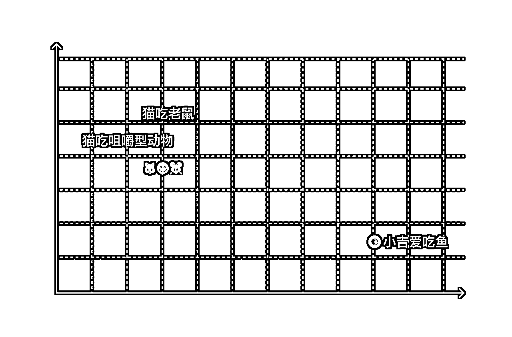

# 手把手教你用 ChatGPT plugin 打造一个人知识库系统（一）

> 来源：[https://vfb2y0pfkc.feishu.cn/docx/Zqi3dDa6woRKCUxp9CjcxjHBnGf](https://vfb2y0pfkc.feishu.cn/docx/Zqi3dDa6woRKCUxp9CjcxjHBnGf)

## 为什么需要个人知识库？

大概有很多人跟我一样，被现在信息过载弄得非常焦虑。很自然想到通过整理的方式来对抗信息过载，试图使用各种知识管理工具来整理这些信息，但最后折腾完各种工具后，才发现根本用不起来。因为这些工具常常需要我们按照预设的框架去管理和整理我们的信息，而这些框架可能并不完全符合我们的需求，缺乏足够的灵活性。

所以我在想，是否存在这样一种方案？既不改变我们现有摄入处理信息的方式，又能在整理信息时帮助我们链接和管理我们历史的知识。在大模型语言出现之前，这可能是难以实现的。但现在以 OpenAI 为代表的语言模型，具备了这个能力，他们能非常精准地理解你的自然语言。因此，我们完全可以不必关心整理这一趴，所有的知识点都可以散落一地，我们只在需要它的时候，捡起我想要的。

这么做的好处在于，它可以给你的大脑减负。而那些收藏夹吃灰系列的内容，也有被再度回收利用的可能。总之就是，拿来当第二大脑，真的超级适合！并且，通过提问的方式去使用它也非常符合直觉。另外我在成本上也做了验证，具体步骤在这里👉 ChatGPT 插件做个人知识库的成本计算，3.7K 的中文字数，收了 2 分钱，太良心了好吧？

## 原理介绍

为了方便之后更好地使用它，我们还是需要提前了解两个基本概念，有技术背景的童鞋可以跳过这一趴

### 什么是嵌入 (embedding)

简而言之，嵌入就是一个向量，它是可以被机器理解的数字列表。将自然语言映射成这样的向量，可以帮助机器理解词的含义以及词与词之间的关系。

比如下面三句话，在二维向量空间中，它们的位置大概如图示中这样👇🏻，其中「猫吃老鼠」、「猫吃咀嚼型动物」和「🐱😋🐭」，在空间中的位置是相近的，而「小吉爱吃鱼」这句话则在空间中位置则相对较远。这还只是在二维空间中，OpenAI 的 text-embedding-ada-002 模型的空间向量有 1536 个维度。因此，在更多维度的加持和上下文的帮助下，它基本上可以准确地检索出我们想要的结果。

在做个人知识库的场景中，当我们发起一个提问时，问题首先被转换成一个向量，然后去向量数据库中检索到我们最相关的向量块，再结合 OpenAI 自身的总结摘要能力，将我们想要的内容总结成方便理解的自然语言返回给我们。

## 什么是向量数据库（vector database）

向量数据库是一种将信息存储为向量或数字数组的数据库。每一条信息都被表示为一个向量，其中向量中的每一个数字对应于数据的一个特定属性或特征。

在这种情况下，你可以使用一个向量作为索引来从数据库中搜索和检索数据。查询向量不需要与数据库向量完全匹配。数据库引擎可以有效地检索由接近的向量索引的数据。在我们的情况下，它检索的是与你的问题语义相关的块。

## 设计思路

本教程基于官方的开源项目 ChatGPT-retrieval-plugin，为了方便理解，我画了一下原理图，并解释其中的各个模块的作用。原理图如下 👇🏻

首先，你需要将你的文档或文本，通过官方的向量映射语言模型转换成向量，并存到向量数据库中。当你想要检索数据库中的内容时，只要导入你开发的插件，然后向正常使用 ChatGPT 一样使用即可，插件会将你的聊天内容分割成查询的词，然后通过 Api 调用 text-embedding-ada-002-v2 模型，将查询词转换成向量，接着去数据库中，查找语义相关的问题区块，并在查询到结果后，经过整理返回给你

运行的最终效果图如上所示，本教程前半部分这一节主要解释其原理，下一节将进入实战环节，带你一步一步搭建一个本地可运行的知识库检索插件。敬请期待~

第二节内容可以点击卡片查看 👇🏻

或者通过这个链接，点击飞书查看 👇🏻

## 参考资料

*   New and improved embedding model