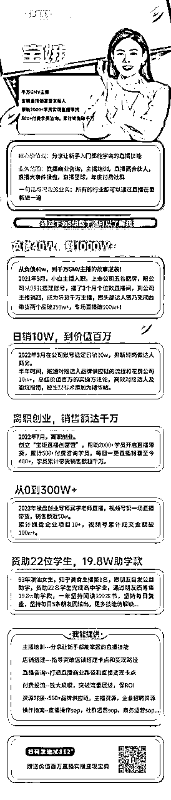

# 如何有效BD达人？

> 来源：[https://xfxnrwx9us.feishu.cn/docx/doxcnb8LDVdg910UJXZ8SILXgff](https://xfxnrwx9us.feishu.cn/docx/doxcnb8LDVdg910UJXZ8SILXgff)

我是宝爷！分享我在五谷磨房做商务几个月，总结出来的一些避坑小经验分享给大家。

#### （1）平常通过什么方式去找达人？

1.  达人的主页，基本很多有意向合作的达人都会在主页写上自己的联系方式。（直接备注是哪个品牌方，想如何合作，达人有意向就会通过。

1.  商务社群，达人方以及品牌方都会建一个沟通的社群，可以在里面找到自己想要的品牌方和达人。（群里的小侠，就有很多这方面的资源，有兴趣可以跟小侠多沟通，寻求帮助的同时，也别忘了给人家发个小红包,表示感谢。）

1.  品牌方互推，跟自己品类接近或者竞品的品牌方，可以相互推荐合作产出比较好的达人，也可以通过飞瓜数据去查阅，看看她们过往合作过产出比较好的达人，再进行资源互换，一般很多品牌方的商务都特别友好。

1.  小二/团长机构建联，像五谷磨房这种大品牌都是跟官方小二关系比较深，就可以找小二去拉群沟通，效率特别高，像很多形体达人很难找到联系方式，这个时候可以通过机构或者团长去建联，也是比较容易链接的上。

#### （2）哪些方式建联比较高效？

1.  有实力的品牌方通过官方小二去建联是最高效的。

1.  其次是通过商务社群和品牌方互推的方式，比较容易建联上。

1.  团长和机构，说实在靠谱的占少数，找比较有实力的，我之前在五谷至少建联了30+的团长，靠谱的就2-3个，一定要有自己的筛选标准。

1.  达人的主页信息通过率是最低的，大概5%的通过率，一天不要同时加上好几十个人，会被微信官方警告，别问我为什么知道，因为我试过。

#### （3）达人的合作模式和现状：

1.  达人合作的模式基本是两种：坑位费+纯佣和纯佣两种模式为主，也有合作签季框和年框等，基本比较少。达人选品只会计算一件事：就是在直播间里，如何挣到更多的钱。（利益最大化）

1.  你是知名品牌的热销品，达人们几乎都会抢着带。因为“货带人”能够让达人名利双收。

1.  你是网红产品，很多达人在卖，受众比较广，直播机制也比较好，还给高佣金，达人就愿意努力给你推。

1.  你是白牌，没有什么知名度。主要产品没有明显的质量问题，愿意给高额的佣金和坑位，也有达人愿意给你带。不过现在也有很多大主播比较珍惜自己的羽毛，选品也会相对严格，比如贾乃亮直播间的选品，真的每个细节都要卡到位。

1.  很多老板以及品牌方会觉得自己的品特别好，为啥达人不愿意带，其实原因很简单，就是你的产品没有办法给她创造价值最大化。

#### （4）达人合作如何避坑？

1.  明星合作的坑位，不夸张的说10个至少有9个都是坑。很多过气的明星都来抖音带货，基本很多带不了几场就消失不见，因为数据太差了，粉丝粘性特别差，还有很多虚假在线。发现一场付了2w-10w不等的坑位费，最后只卖了几单，沟通补播口头承诺说好，催补播，每次都有无数的借口。（请各位品牌方老板记住一个真理：明星首场直播坑位尽量不要投。）

1.  夸张承诺，能够给你保投产，最后亏得渣都不剩。如果你发现平常对你爱搭不理得达人，突然来找你，不用怀疑，就是来找你完成kpi。跟你说最近有档期，就是来要坑位费的，基本有实力的达人根本品就选不完，突然来找你，大概率不要投，亏得几率很大。

1.  热情得中间商几乎不靠谱，给你长长一大片得介绍。合作哪个头部达人，你一看，全部头部达人都是她家得，这里有个巨大得坑就是签保量协议，比如100w的框架合同，要保多少roi，这个达人不行换另外一个达人播，通常就两种情况：一，就是骗子公司，合同一签，款一打就不见人，真的在行业内听到很多被骗得商家，一打官司好几年，钱不一定能够拿回来。二，就是播了几场，找得都是尾部达人播了几万块，一直拖，也不退款。像这种保量得合同一定要小心。（还有很多假冒品牌方商务去骗坑位费得比比皆是，一定要谨慎核对。）

1.  付了坑位费，达人直播间带不动货。很多主播都是不熟悉产品，也不懂得如何去带直播节奏，跟粉丝得粘性也比较差，一场带货下来也就是卖几单。还有就是给达人备好货，备好库存，蹲了一天跟你说今天直播间节奏不对，场观不稳定，品太多了，直播时间太晚了，品上不了，这个在头部得直播间是最常见得，每次一蹲就是一天，工厂得工人也等着发货，可是真的一点办法没有。

1.  扶持没有实力得腰尾部达人，真的浪费时间和精力。我转岗后得前2个月，因为头部对接不上，就觉得多培养一些腰尾部达人，事实证明这个策略不对，最后精力耗费，业绩惨淡。找一个有实力得头部顶100个没有实力得腰尾部达人。其实对接头部达人得时间跟腰尾部达人花得时间相同，投入产出比完全不同，一定要懂得筛选。

1.  第一次合作尽量谈纯佣模式，宁愿佣金高一些，也相对保险很多。

#### （5）如何找到高产的合作达人？

1.  一定要学会筛选，通过飞瓜等数据去看这个达人的带货数据，粉丝画像，近期的涨粉及成交的产品类目情况，是否跟我们带的产品是匹配的，数据是不是呈上升趋势，在判断值不值得投。

1.  通过飞瓜等数据去看竞品品牌方产出数据好的达人，就像五谷磨房找竞品也会对标老金磨房，滋补类目得品牌方，通常竞品品牌方带的好，一般情况下带我们得品也不会太差。

1.  寻找垂类得主播，像五谷磨房这类养生和减脂类得产品，我们测试下来跟形体账号得合作产出最高，因为形体主播一般一场直播就只带几个产品，主播会讲得更加得详细和细致，产出也会比较好，不过也有一个相对明显得略势，就是佣金占比都要求很高。

1.  潜力的日播达人像减脂类跟生活类的账号跟我们产品也是比较契合，日播达人好处就是佣金低，配合度高，劣势就是单场产出比较低，不过一个月下来，有潜力的像王些黑这种不到100w的博主，一个月产出300w+，比头部还厉害。

1.  尽量找头部合作为主，一个月搞定几个头部基本业绩就稳了。同时培养有潜力的腰尾部达人，像刚带货，数据一场带几千的就暂时先不合作，人的时间精力是有限的。

1.  多跟官方小二以及商务社群和品牌方商务搞好关系，这样就能够有效的建联达人。

#### （6）达人商务的工作流程具体有什么？

1.  通过各种方式建联上。

1.  给对方发产品货盘选品。

1.  提报产品机制。

1.  寄样和过品及确定上播时间。

1.  建商品链接+填写商品手卡。

1.  跟仓库确认库存和跟达人确定库存。

1.  跟播+复盘总结。

#### （7）群友大虾的补充分享：

1.  如果你的产品没啥销量没啥评价基础，店铺体验分很低，甚至没过新手期直接去找达人去带，达人是不会理你的，所以链接达人钱先要把店铺基础数据做好!

1.  达人选品会他们也会每天看第三方选品工具如蝉妈妈，快选品，飞瓜等，这时候我做为商家应该怎么办，就要给达人放诱饵。我可以先花点坑位费找几个中腰部达人带，同时我后台补点销量数据，让产品销量和转化率数据异常高，这样就能引起其他达人的兴趣。

1.  链接达人还是要多混圈子，毕竟最终对接的都是个体，举个例子我原先认识的一个商务，他最早在冬姐那，后面跳到盈公主，最近又跳到衣哥那，每次换个主播就会主动找我最近有没有品要上的，这种是长时间沉淀下来的关系。

这基本就是整个达人商务的过程，其实商务真的是一个综合能力要求很高的职位，不仅要经常加班，随时随地达人一找到你，就要及时处理，同时还需要有极强的沟通能力和复盘能力，以及抗压能力，我是自己做了几个月才意识到不容易，总结一些自己过往的商务方法论，希望大家少走点坑。

如果需要直播业务交流：可加：baoyeaixiachu……从哪里来记得备注：来意！

