# 💰客户给我20w，我帮她赚了200w

> 来源：[https://hjlrkivx2z.feishu.cn/docx/IMzSdE39eoVBX1xwLzgcKTnDnme](https://hjlrkivx2z.feishu.cn/docx/IMzSdE39eoVBX1xwLzgcKTnDnme)

现在在做播客的复盘

小红书饰品赛道代运营回报率1000%的复盘

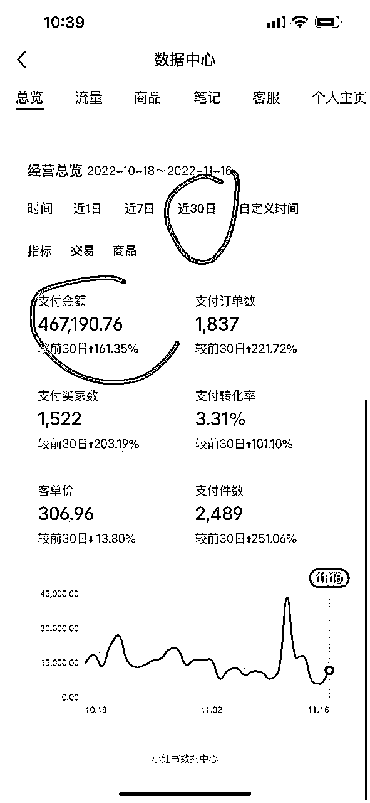

人物标签：当小时，以前自己做自媒体电商，现在帮别人做自媒体电商

背景：从十年前的QQ空间开始享受到社交媒体的红利，一路从微信微博公众号迁移到抖音到小红书，不断摸索流量和变现的逻辑。

收益：服务费20w，提成12%

项目亮点：三个月时间，小红书电商做到细分领域销售排行榜第一

产品是什么：珠宝饰品

流量哪里来：小红书

如何变现：短视频带货，提供电商内容服务

分享会ppt源文件⬆️

分享会录音36min➡️

这是我们转行后接的第一个客户，沿用了给自己做的 电商的团队，从零到一做起来的，从拍摄剪辑甚至也会反向参与选品

下面内容来自给得到校友做的分享方法论：

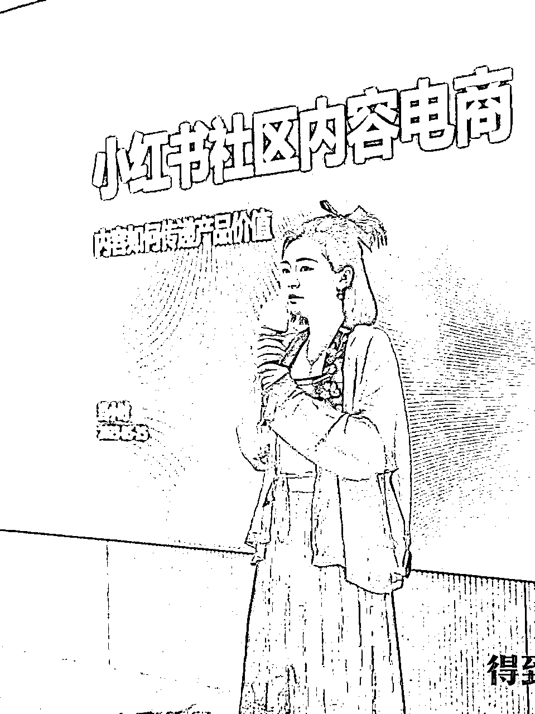

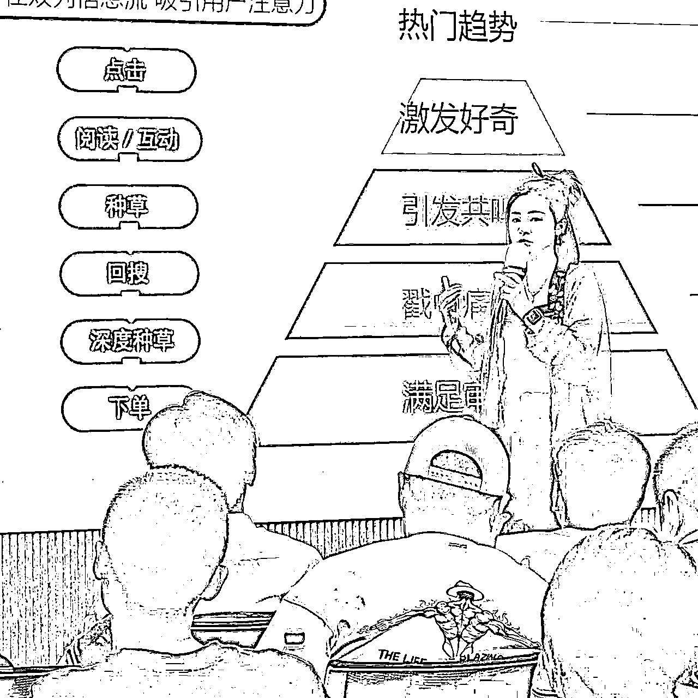

来自小红书官方商务部的定义

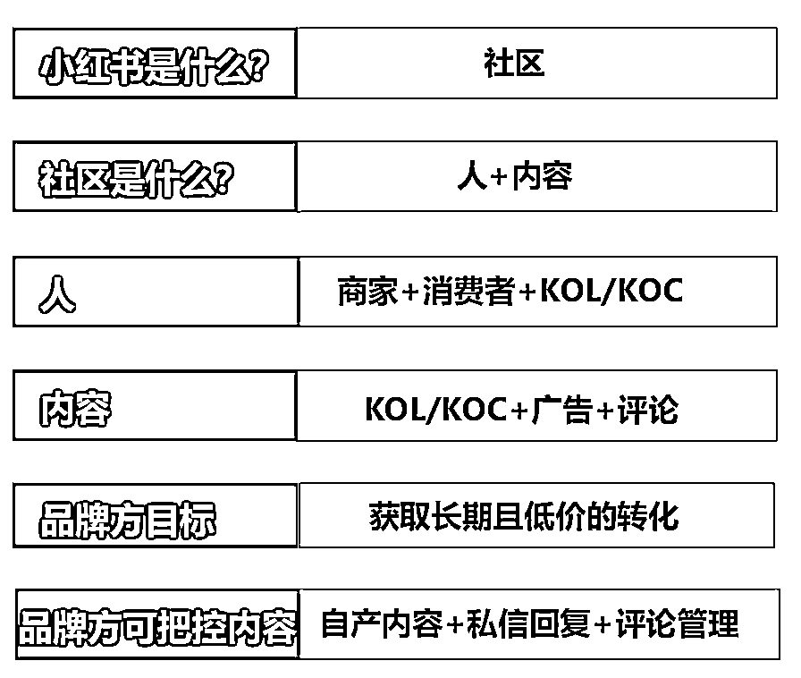

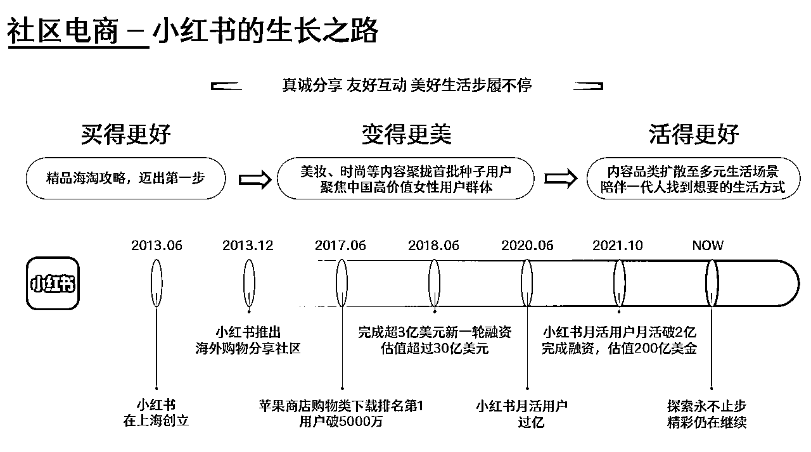

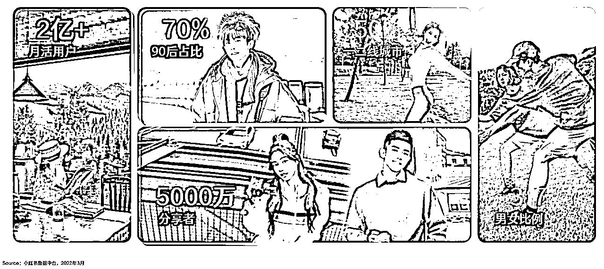

## 自己操盘的案例数据分析

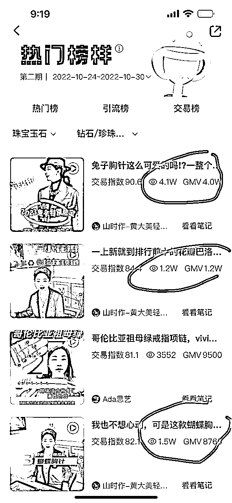

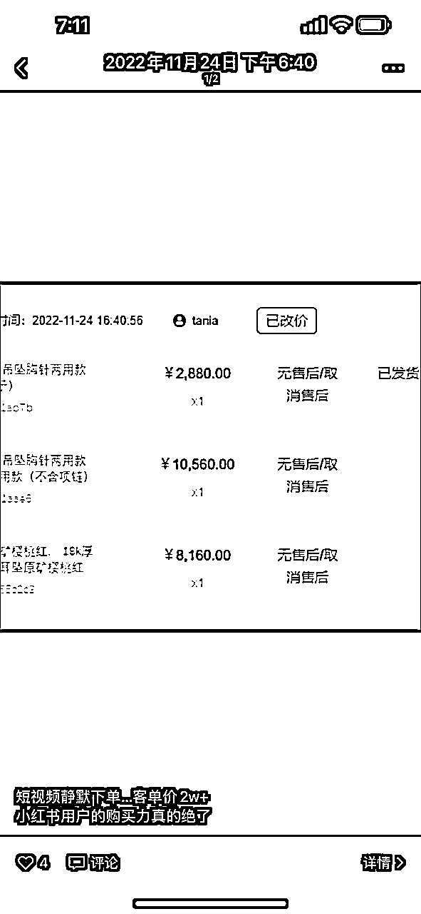

小红书运营销售额做到行业第一，以下是一些经验分享：

1.  分析市场趋势：在开始运营前，需要对市场进行充分的分析，了解消费者需求和偏好，以便更好地制定营销策略。

1.  确定目标客户：根据市场分析结果，确定目标客户群体，并制定相应的营销策略。

1.  优化内容：在运营过程中，需要不断优化内容，提高用户体验和参与度。

1.  加强与消费者互动：通过各种形式的互动，如在线咨询、促销活动等，更好地了解消费者需求和偏好。

1.  利用社交媒体平台，如小红书、抖音、快手等，进行有效的推广和营销。

1.  确定最佳实践：在运营过程中，需要不断探索和实践最佳实践，不断完善营销策略和内容。

1.  持续改进：随着市场变化和消费者需求的变化，需要持续改进营销策略和内容，以保持竞争力。

当然，不同企业和品牌的情况不同，需要根据自身情况进行适当调整。

## 如何做好种草内容

好内容+ 好流量=长期高效率种草

好内容是爆文的基石，更是流量产品的弹药

*   热点趋势

*   社区热门话题 品类相关热词 热门种草场景

*   热门趋势：创作者中心笔记灵感+搜索发现

*   商品笔记：专业号中心-热门商品笔记

*   垂类内容：优质内容风向标（官方号）

*   广告笔记：蒲公英/专业号平台

内容选题

实用价值：干货合集，经验教程

情绪价值：真实故事，高颜值人/物/景，走心/搞笑剧情

万能公式：以下内容2～4种组合使用。

例：

*   早春学生党平价保湿好物合集，

*   秋冬季打工人办公桌必备神器。

*   季节：早春春夏初夏夏末秋冬 初冬换季期...

*   目标人群：学生党打工人 宝妈铲屎官

*   使用场景：.宿舍/学校 约会/出行宅家居家办公职场..

*   价格定位：白菜平价贵妇

*   节假日：春节情人节七夕圣诞节..

*   需求/功能：美白保湿抗老拍照妆教解馋扛饿减脂瘦身…

*   封面

封面形式：单图/拼图

封面比例：3:4/1:1/4:3

封面关键字

*   成交流程 点击➡️阅读➡️互动➡️种草➡️回搜➡️深度种草➡️下单

*   用户点击的底层逻辑 热门趋势 制造预期 激发好奇 引发共鸣 戳中痛点 满足审美

标题

埋热词引流量

激好奇引点击

切痛点找共鸣

聚焦细分场景

多用功能需求词

*   善用关键词、突出重点：有助于系统分发和推+用户更易Get关键信息

*   在标题中适当添加数字：直观信息抓人眼球+提高内容可信度

*   利用标题与用户互动：引发用户好奇心+提升笔记互动率

*   贴近用户引发共鸣：身份/地域共鸣+增强用户代入感

*   内容详情

*   详情图/视频 正文文案 正/负面评论维护 。。。

*   如何提高种草率 解决实际问题和提供情绪价值 用户更喜欢真实体验后的真诚分享 客观描述产品使用心得的内容会更具备种草力

内容范式

1.  吸引注意力： 痛点or好处

1.  建立信任：痛点or好处和产品卖点结合

1.  促成转化：提出解决方案

*   需求明确的目标客户

品类 功效 风格 颜色。。。

直接围绕品类词+利益点进行创作

用品牌词/产品词/品类词来触达

*   需求模糊的潜在客户

场景化 教程干货。。

需求度低，通常需 要利用场景化内容来软性种草

## 商域流量进阶指南

*   品牌专业号

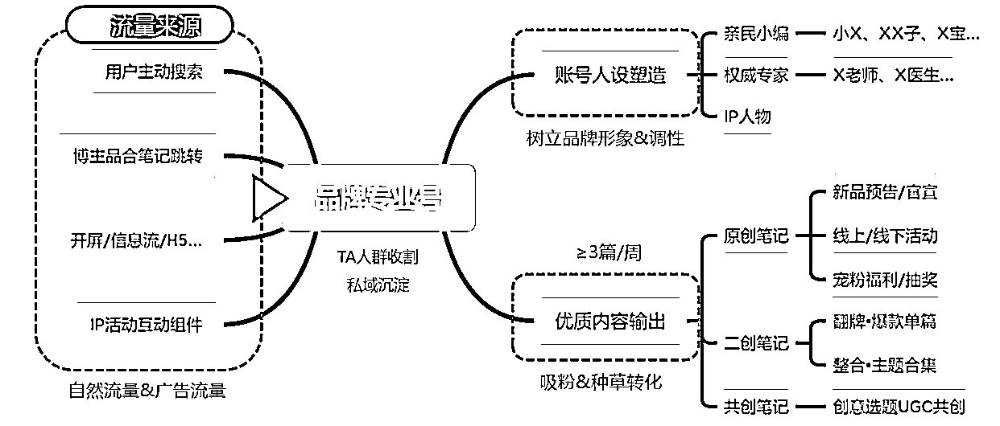

*   粉丝关注动机及对应策略

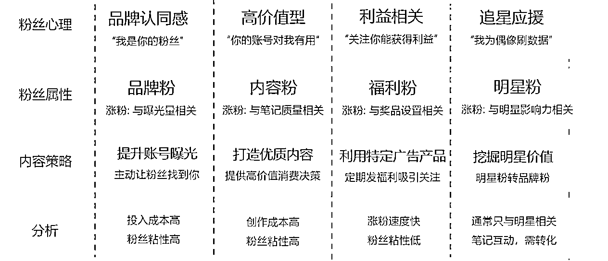

*   主要内容类型 产品上新官宣 明星代言物料 产品使用教程 KOL笔记翻牌 抽奖福利 活动预告

如何花钱买博主的内容

头部kol≥50万

KOL≥1万

KOC

质感+影响力担当

种草+专业担当

口碑+氛围担当

*   泛推 快速打造热度 高度覆盖 触达粉丝跟风效应 提高调性

*   精推 垂直圈层影响 专业背书 精准触动

*   粗推 真实晒单反馈 买家秀， 辅助决策 起“SEO”优化功能

如何筛选博主

*   基础数据 1⃣️互动效果：粉丝量＜赞藏数， 且赞藏数至少是粉丝量的1.5-2倍以上， 但也不能太高， 太高则代表账号有爆文、 内容不错， 但转粉率低， 且不稳定。 5000粉丝以下， 近期笔记平均点赞不能低于10； 5000粉丝以上， 近期笔记平均点赞不能低于20； 1w粉丝以上， 近期笔记平均点赞不能低 于50； 5w粉丝以上， 近期笔记平均点赞不能低于200； 10w粉丝以上， 近期笔记平均点赞不能低于500 2⃣️涨粉情况：是否存在掉粉现象； 笔记数量不能太多， 且篇均涨粉不能低于100+;粉丝量越高， 篇均涨粉要求也会变得越高。素人 (粉丝量300-5000) 要求可低一些 3⃣️粉丝粘性：全面评估KOL粉丝粘性、活跃度及优质粉丝占比， 粉丝质量越高的KOC， 粉丝影响力、信任力越强。

*   匹配程度 1⃣️人设匹配度：KOL人设、 内容风格调性与品牌调性是否相符——这是品牌信息能够传播的基础 2⃣️Ta匹配度：KOL粉丝的年龄、性别、地域分布： 与品牌目标TA重合度 3⃣️兴趣匹配度：通过粉丝解析， 了解粉丝内容偏好、互动兴趣—判断与KOL的风格是否接近， 风格越接近， 越能迎合用户偏好， 起到种草目标 4⃣️垂类标签度：垂直领域创作者更适合个性化推荐算法机制， 选择账号权重高且小红书账号标签和种草笔记分类一致的达人。

*   内容质量 1⃣️内容爆款率：30日内爆款率， 能更好地反映出阶段性KOL的创作实力和投放价值——这是品牌效果投放的保障 2⃣️内容真实性：数据浮动太稳定≈刷量， 太稳定的判断标准： 浮动值＜20 数据浮动太夸张≈赌博， 夸张的判断标准： 浮动值＞ 100， 甚至更高； 这代表内容创作水平不稳定 3⃣️内容更新率：至少周更， 即近30天笔记更新至少5篇， 日更最多3篇， 即近30天笔记更新最多90篇。 4⃣️舆情健康度：直观了解粉丝对于KOL口碑及态度， 讨论关键词， 正向舆情是赢得粉丝信任的重要保证

*   性价比 1⃣️达人报价：博主合作报价一般是在博主粉丝量的10左右% 2⃣️互动成本：点赞的1.5倍≈互动量， 而互动量的10倍≈阅读量博主合作报价/近期笔记平均点赞的1.5倍≈单个互动成本， 互动成本： 互动成本在5-10性价比较高

*   商业能力 1⃣️商业经验 ：KOL过往所服务的品牌/行业：与品牌是否相关、以及客户评价 2⃣️种草转化力 ：小红书电商转化数 3⃣️评论互动效果 ：评论区是否有真实询问链接、问尺码、问地方、问感受等

*   投流

*   投流打造爆款

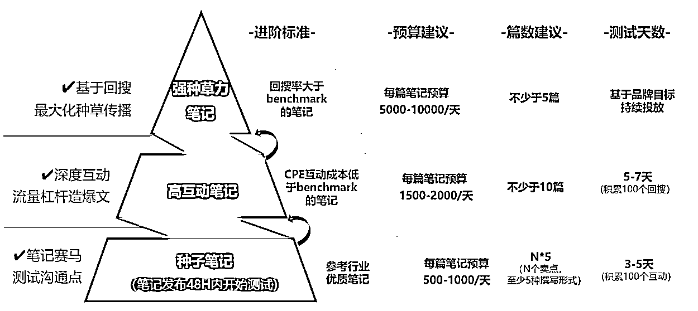

*   方法论

*    以产品策略为底层基础 产品特性是引爆小 红书的底层因素

*    以内容策略为核心 优质内容及运用套路大 大提升投放效果效率

*    以关键词布局为切入口 搜索页关键词是影响 品牌口碑关键节点

*    以达人选择为利剑 选对达人能让投放 事半功倍

*    以投放节奏为顶层设计 有条不紊地投放节奏， 有序收割

*   影响点击率的要素

*   年龄性别地区

*   标题 封面

*   关键词出价

*   一些关键经验

*   新入驻时，数量》质量 迅速铺量 多 关键词测试 集中 打爆款 首发小红书→辐射其他社交平台

*   产品是核心，内容是基础，投流是辅助。

*   这类产品有爆款基因 刚需+高颜值+低价+DSR高评分

*   这类内容有爆款基因 评测、清单、干货内容

*   案例

ppt

现场的图片

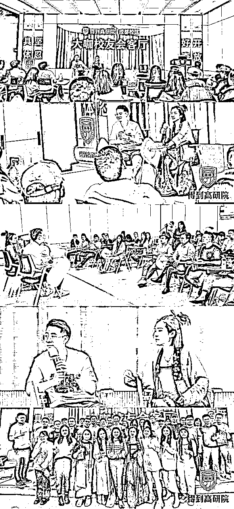