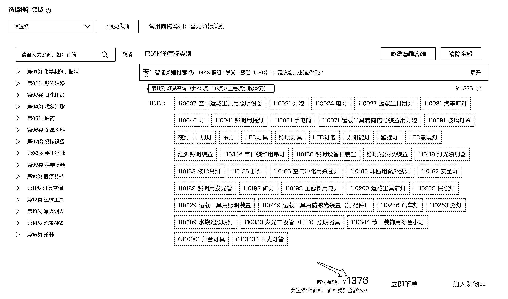
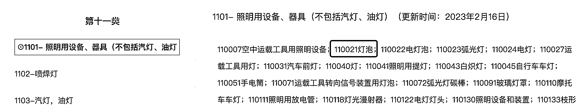
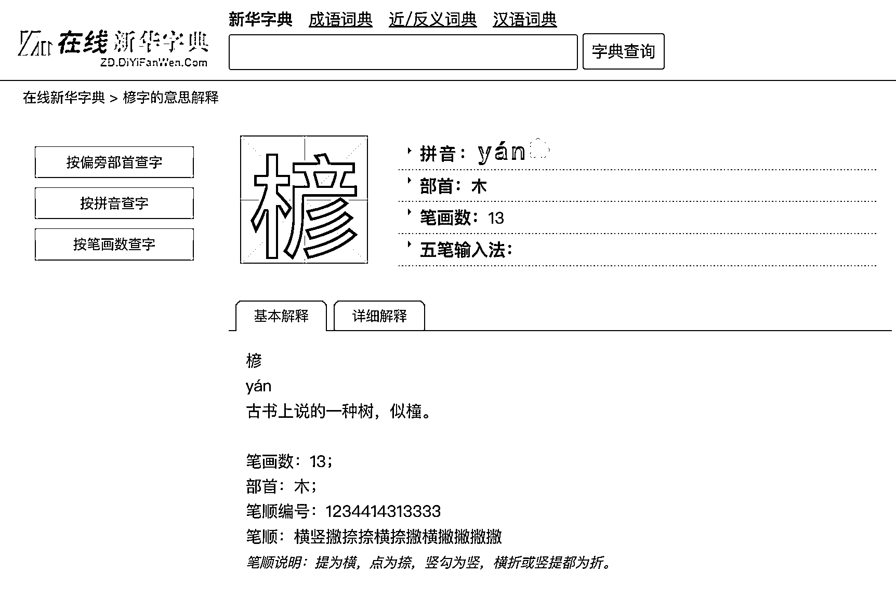
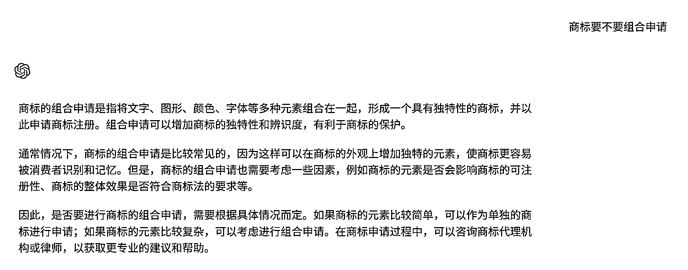
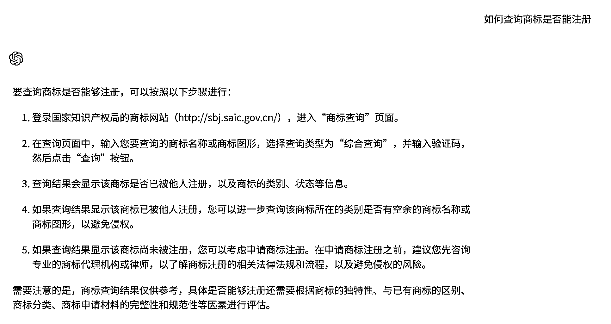

# 成功申请 5000+商标后，我总结的高效省钱的商标申请秘诀！

> 原文：[`www.yuque.com/for_lazy/thfiu8/iqfsezam5svui9mt`](https://www.yuque.com/for_lazy/thfiu8/iqfsezam5svui9mt)

<ne-h2 id="effa2233" data-lake-id="effa2233"><ne-heading-ext><ne-heading-anchor></ne-heading-anchor><ne-heading-fold></ne-heading-fold></ne-heading-ext><ne-heading-content><ne-text id="ubf87f760">(33 赞)成功申请 5000+商标后，我总结的高效省钱的商标申请秘诀！</ne-text></ne-heading-content></ne-h2> <ne-p id="u400b681a" data-lake-id="u400b681a"><ne-text id="u9602aa88">作者： 侯小妹</ne-text></ne-p> <ne-p id="u5a6cfa32" data-lake-id="u5a6cfa32"><ne-text id="uca605672">日期：2023-06-19</ne-text></ne-p> <ne-p id="ud0a04448" data-lake-id="ud0a04448"><ne-text id="uc4bdc064" ne-bold="true">申请商标分几步：</ne-text></ne-p> <ne-p id="u31347ef2" data-lake-id="u31347ef2"><ne-text id="u5a97f73a">1、确定从事的商品/服务范围</ne-text></ne-p> <ne-p id="u060afa8c" data-lake-id="u060afa8c"><ne-text id="u69d6ac69">2、取一个名字或者设计图形 LOGO</ne-text></ne-p> <ne-p id="u1901bbd1" data-lake-id="u1901bbd1"><ne-text id="u1aa06a07">3、查询该商标注册通过率</ne-text></ne-p> <ne-p id="u8a7a662a" data-lake-id="u8a7a662a"><ne-text id="u0a0b6a2b">4、提交申请，等待初审，获得注册</ne-text></ne-p> <ne-h4 id="823855df" data-lake-id="823855df"><ne-heading-ext><ne-heading-anchor></ne-heading-anchor><ne-heading-fold></ne-heading-fold></ne-heading-ext><ne-heading-content><ne-text id="uae2d5c09">第一步：确定从事的商品/服务范围；</ne-text></ne-heading-content></ne-h4> <ne-p id="u0c79aade" data-lake-id="u0c79aade"><ne-text id="uc295ee41">      申请商标，我们需要按照商标局规定的分类表去选择对应的商品/服务。</ne-text></ne-p> <ne-p id="ub0f40d88" data-lake-id="ub0f40d88"><ne-text id="u1f36d47f">      商品分类：是一种用于将商品和服务进行分类的国际标准。它是由世界知识产权组织（WIPO）制定的，目的是为商标注册和保护提供一个统一的分类系统。</ne-text></ne-p> <ne-p id="u7e8fe125" data-lake-id="u7e8fe125"><ne-text id="u527ee1a1">      目前在用的商品分类表是：「类似商品和服务区分表（基于尼斯分类第十一版）2023 文本」</ne-text></ne-p> <ne-p id="ub347a931" data-lake-id="ub347a931"><ne-text id="u28b354bf">对于申请人来说，厚厚的几百页分类表（大概 A4 纸五六百页），看到肯定懵，但是对于有经验的代理人来说，这些分类表很多已经刻在脑子里了。</ne-text></ne-p> <ne-p id="ub09cebfc" data-lake-id="ub09cebfc"><ne-text id="u329a095c">       商品分类表并不是一成不变的，它会随着市场的发展和技术的进步而不断更新和调整。因此，在商标申请过程中，申请人需要时刻关注最新的商品分类表，以确保其商标的正确分类。</ne-text></ne-p> <ne-p id="u75029ca3" data-lake-id="u75029ca3"><ne-text id="u5d5679cd" ne-underline="true">一个商标，一个类别，官费 270 元，一般是包括 10 个商品。如果超过了那就需要加收超项费 27 元/商品。</ne-text></ne-p> <ne-p id="u9aaf0280" data-lake-id="u9aaf0280"><ne-text id="u4db7520a">      如果你申请过商标，看过商标的分类表，你就知道，看到分类表，你就会觉得好像很多商品都差不多意思，都会涉及，要选择的有好多，超项很多诶。</ne-text></ne-p> <ne-p id="u55d39de1" data-lake-id="u55d39de1"><ne-text id="u3afe9e13" ne-underline="true">下面这个案例大家可以感受一下：这个是最近生财圈友小伙伴的案例，</ne-text><ne-text id="u35c5b2e2">主要做灯具，其营业执照范围是：一般经营项目是：电子电器产品、照明灯具、电光源、电子控制系统、驱动电源、电器开关、显示产品、LED 产品及其零部件和配件的设计研发与销售；</ne-text></ne-p> <ne-p id="u4d04d3dc" data-lake-id="u4d04d3dc"><ne-text id="ua32d0c70">发我的商品只有 11 类，但商品一共有 43 个，超项了 33 个商品，直接超项官费就 891，这不包括代理收的超项费。「官费：270+891=1161」</ne-text></ne-p> <ne-p id="u25c8b71d" data-lake-id="u25c8b71d"><ne-text id="u04235b47">      如果在阿里云商标注册自助平台自助申请的话总费用是：1376 元（阿里云商标注册服务费应该算行业最低了，但其是自助服务平台，前提是需要自己对商标比较懂）</ne-text></ne-p> <ne-p id="uc7b876da" data-lake-id="uc7b876da"><ne-text id="u2b44f0dd" ne-bold="true">其问题主要有：</ne-text></ne-p> <ne-p id="u0afbb6eb" data-lake-id="u0afbb6eb"><ne-text id="uf7c70076">1、很多商品是重复的，看似都有涉及，实际都选的话，成本很大。</ne-text></ne-p> <ne-quote id="uaa946341" data-lake-id="uaa946341"><ne-p id="ud3bc17a4" data-lake-id="ud3bc17a4"><ne-text id="udf68a63c" ne-bold="true">好的代理虽然赚你的代理费。但更多的时候给你的建议会让你省下很多不必要的消费。</ne-text></ne-p> <ne-p id="u191497a7" data-lake-id="u191497a7"><ne-text id="u55964b94" style="color: rgb(38, 38, 38);">不好的代理或是自助申请平台，给你一个分类表，你选多少就给你申请多少，不会真正的站在客户的角度出发，选择合适的商品/服务范围，大家总觉得反正选择越多越好，就造成了成本不断增加，实际需求其实没有那么大。</ne-text></ne-p> <ne-quote id="u013fed4b" data-lake-id="u013fed4b"><ne-p id="ue9293825" data-lake-id="ue9293825"><ne-text id="uea64cd3c">2、只涉及到 1101 中的商品，其他群组完全不涉及（当然，可能实际也确实不涉及）</ne-text></ne-p> <ne-p id="uc0e21190" data-lake-id="uc0e21190"><ne-text id="u2e3d50b3">3、经营中涉及到的电器开关等商品（第 09 类），没有涉及到；选择的商品类别不全。</ne-text></ne-p> <ne-p id="u12b5a588" data-lake-id="u12b5a588"><ne-card data-card-name="image" data-card-type="inline" id="jOfWR" data-event-boundary="card"></ne-card></ne-p> <ne-p id="u63c702cb" data-lake-id="u63c702cb"><ne-text id="uf63fa367" ne-underline="true">阿里云商标自助平台费用试算截图</ne-text></ne-p> <ne-p id="ua9e9e7fb" data-lake-id="ua9e9e7fb"><ne-card data-card-name="image" data-card-type="inline" id="v8DTG" data-event-boundary="card"></ne-card></ne-p> <ne-p id="ud19583b9" data-lake-id="ud19583b9"><ne-text id="u976d3c70" ne-underline="true">筛选商品过程</ne-text></ne-p> <ne-p id="ubb2d324b" data-lake-id="ubb2d324b"><ne-card data-card-name="image" data-card-type="inline" id="XtvZ9" data-event-boundary="card"></ne-card></ne-p> <ne-h5 id="9039450f" data-lake-id="9039450f"><ne-heading-ext><ne-heading-anchor></ne-heading-anchor><ne-heading-fold></ne-heading-fold></ne-heading-ext> <ne-heading-content></ne-heading-content></ne-h5> <ne-h3 id="3aac578b" data-lake-id="3aac578b"><ne-heading-ext><ne-heading-anchor></ne-heading-anchor><ne-heading-fold></ne-heading-fold></ne-heading-ext><ne-heading-content><ne-text id="u2ad431d1" style="color: rgb(236, 40, 52);">商品/服务选择的 3 大原则</ne-text></ne-heading-content></ne-h3> <ne-p id="u4e2199f8" data-lake-id="u4e2199f8"><ne-text id="uf84e6491" ne-bold="true">1-确定商标所使用的范围（注册的商品主要是用来干什么的？）确定好类别（可以是多个类别）</ne-text></ne-p> <ne-quote id="u37ea3584" data-lake-id="u37ea3584"><ne-p id="u1c60bd8b" data-lake-id="u1c60bd8b"><ne-text id="u48add147" ne-bold="true">2-确定商品（实际销售/服务涉及到的）</ne-text></ne-p> <ne-quote id="ube037c3a" data-lake-id="ube037c3a"><ne-p id="u459ec732" data-lake-id="u459ec732"><ne-text id="u51ae064c" ne-bold="true">3-同类别不同群组的防御性保护策略</ne-text></ne-p> <ne-quote id="u747d53dc" data-lake-id="u747d53dc"><ne-p id="u9f18a38d" data-lake-id="u9f18a38d"><ne-text id="u220e63fa">大家要获得商品分类表，可以到国家知识产权局商标局官网看（个人觉得不好用，但是准确）</ne-text></ne-p> <ne-p id="ubfa0b63e" data-lake-id="ubfa0b63e"><ne-text id="ua870943d">国家知识产权局商标局，商品/服务项目查询网址：</ne-text>[<ne-text id="u6675d067">http://wcjs.sbj.cnipa.gov.cn/gs?b9La8sqW=09ayAOGlqErvGArocAmHBwozUFUtUR_Z9fKUNBIBhRkYlTEFX_okbEcVxmxBl.8cnCHXtcfiqDpvOswq6AYAuHtbM6bt8iryN</ne-text>](http://wcjs.sbj.cnipa.gov.cn/gs?b9La8sqW=09ayAOGlqErvGArocAmHBwozUFUtUR_Z9fKUNBIBhRkYlTEFX_okbEcVxmxBl.8cnCHXtcfiqDpvOswq6AYAuHtbM6bt8iryN)</ne-p> <ne-p id="u134d90d5" data-lake-id="u134d90d5"><ne-text id="uce986cd6">我常用的在线分类表是：</ne-text>[<ne-text id="ubb4ab40e">http://www.sbfl.cn/</ne-text>](http://www.sbfl.cn)</ne-p> <ne-p id="ub27f14da" data-lake-id="ub27f14da"><ne-text id="u9d260f35" style="background-color: rgba(255, 246, 122, 0.8);">我汇总了常见行业的商标商品/服务分类，</ne-text>[<ne-text id="uc7946399">常见行业，商品/服务分类选择</ne-text>](https://iwvmcwbm4c2.feishu.cn/docx/E7ZHdk5FzoyqmTxBrRjcIIR7n8e?from=from_wechat&login_redirect_times=1)</ne-p> <ne-p id="u275c20b9" data-lake-id="u275c20b9"><ne-text id="u8f73aa86" style="background-color: rgba(255, 246, 122, 0.8);">各类别所涉及商品及服务领域</ne-text> [<ne-text id="u1ae40433">商品分类表：各类别所涉及商品及服务领域</ne-text>](https://iwvmcwbm4c2.feishu.cn/docx/OpXIdbXvZoXp1HxU0BLcH4TtnHe)</ne-p> <ne-p id="ud2f30052" data-lake-id="ud2f30052"><ne-text id="u57d4ba81" ne-bold="true">提示注意：</ne-text><ne-text id="u9e32dd9d">在选择商品或者服务项目时，不能使用类别名称或者类似群组标题名称；而应该选择类似群组下具体商品或服项目。</ne-text></ne-p> <ne-p id="u6d002a4f" data-lake-id="u6d002a4f"><ne-card data-card-name="image" data-card-type="inline" id="g1OQx" data-event-boundary="card"></ne-card></ne-p> <ne-p id="u8169e5bc" data-lake-id="u8169e5bc"><ne-card data-card-name="image" data-card-type="inline" id="ZaZnD" data-event-boundary="card"></ne-card></ne-p> <ne-h4 id="96faedbd" data-lake-id="96faedbd"><ne-heading-ext><ne-heading-anchor></ne-heading-anchor><ne-heading-fold></ne-heading-fold></ne-heading-ext><ne-heading-content><ne-text id="u3fc4166b">第二步：取一个名字或者设计图形 LOGO</ne-text></ne-heading-content></ne-h4> <ne-p id="u9124f431" data-lake-id="u9124f431"><ne-text id="u1087f382">商标取名是最关键的一步，也是最难的一步。</ne-text></ne-p> <ne-p id="u4e411aaa" data-lake-id="u4e411aaa"><ne-text id="u59640cb1">商标取名需要注意以下几点：</ne-text></ne-p> <ne-p id="u437ffb0b" data-lake-id="u437ffb0b"><ne-text id="u616f87bd" ne-bold="true">1、简单易记：商标的名字应该简单易记，方便消费者记忆和传播。</ne-text></ne-p> <ne-quote id="u1fe39caa" data-lake-id="u1fe39caa"><ne-p id="u1a570375" data-lake-id="u1a570375"><ne-text id="ucc5a5fc5" ne-bold="true">2、独特性：商标的名字应该具有独特性，避免与已有商标混淆。</ne-text></ne-p> <ne-quote id="ue0f9d767" data-lake-id="ue0f9d767"><ne-p id="u76c1cff4" data-lake-id="u76c1cff4"><ne-text id="ud8f885e8" ne-bold="true">3、与产品相关：商标的名字应该与所代表的产品或服务相关，能够反映出产品或服务的优势。</ne-text></ne-p> <ne-quote id="u4d9f6757" data-lake-id="u4d9f6757"><ne-p id="ue8c65dc8" data-lake-id="ue8c65dc8"><ne-text id="u90785f0b" ne-bold="true">4、法律合规：商标的名字应该符合商标法律法规，避免侵犯他人权利。</ne-text></ne-p> <ne-quote id="u86e20477" data-lake-id="u86e20477"><ne-p id="u61836638" data-lake-id="u61836638"><ne-text id="u27b52cd7" ne-bold="true">5、多方面考虑：商标的名字应该从多个角度进行考虑，如品牌定位、市场需求、目标受众等。</ne-text></ne-p> <ne-quote id="u600ac56f" data-lake-id="u600ac56f"><ne-h4 id="8c93ff63" data-lake-id="8c93ff63"><ne-heading-ext><ne-heading-anchor></ne-heading-anchor><ne-heading-fold></ne-heading-fold></ne-heading-ext><ne-heading-content><ne-text id="u8019a315">在取名这一步，大部分人遇到的问题是：</ne-text></ne-heading-content></ne-h4> <ne-p id="u1e8a2abc" data-lake-id="u1e8a2abc"><ne-text id="uccf354c9" ne-bold="true">1、想好的名字，被注册了（或者是查询了之后代理告诉你有近似商标）。</ne-text></ne-p> <ne-p id="u23f05d00" data-lake-id="u23f05d00"><ne-text id="u18bcbea2">讲一讲我的经验吧：</ne-text></ne-p> <ne-p id="uf8296e88" data-lake-id="uf8296e88"><ne-text id="u7b44daf7" ne-bold="true">当你想的名称，在先已经有相同/近似，如何修改？</ne-text></ne-p> <ne-p id="ud4eb2b6c" data-lake-id="ud4eb2b6c"><ne-text id="u17ee9eee" ne-bold="true">利用新华字典；</ne-text> <ne-text id="u5f4dddb5">在线新华字典：</ne-text> [<ne-text id="uc18a6e28">https://zd.diyifanwen.com/</ne-text>](https://zd.diyifanwen.com/)<ne-text id="uc1ee3978">（新华字典，在取名方面真的很好用）</ne-text></ne-p> <ne-p id="ue8943035" data-lake-id="ue8943035"><ne-text id="u224938ae">在植物商品上，想要注册一个商标“颜植”，但是经过查询，该商标存在很大的驳回风险。</ne-text></ne-p> <ne-p id="u9498c5ab" data-lake-id="u9498c5ab"><ne-text id="udefa5edb">查新华字典，找一个与“颜”同音，含义与植物相关的字替代。</ne-text></ne-p> <ne-p id="ua3083bf5" data-lake-id="ua3083bf5"><ne-text id="ua37a8a88">“楌植”    楌  是一个不常见的字，又有特定的含义，与植物也息息相关。</ne-text></ne-p> <ne-p id="u19376b9d" data-lake-id="u19376b9d"><ne-card data-card-name="image" data-card-type="inline" id="BnDzQ" data-event-boundary="card"></ne-card></ne-p> <ne-p id="uf2f47d95" data-lake-id="uf2f47d95"><ne-text id="u1283df71" ne-bold="true">2、想的名字，代理甚至都没查，就告诉我，不能注册，缺乏显著性。</ne-text></ne-p> <ne-quote id="u4975e1c1" data-lake-id="u4975e1c1"><ne-p id="u65079119" data-lake-id="u65079119"><ne-text id="uc5dd68a6">这个是你看多了案例，真的就有经验了；</ne-text><ne-text id="uee3948a6" ne-bold="true" ne-underline="true">我的经验是：把自己当做消费者，我在购买这个商品/服务的时候，我能不能将这个标志作为商标来与别的品牌区分。</ne-text></ne-p> <ne-quote id="u88590c70" data-lake-id="u88590c70"><ne-p id="ud9f56c54" data-lake-id="ud9f56c54"><ne-text id="ud1d4ce4a" ne-bold="true">3、是要申请中文商标？英文商标？还是图形商标？还是组合？</ne-text></ne-p> <ne-quote id="ua7f0854d" data-lake-id="ua7f0854d"><ne-p id="uc8f1b1e5" data-lake-id="uc8f1b1e5"><ne-text id="u7c013362">对于申请人来说，需要哪种形式的商标主要</ne-text><ne-text id="u28d6dfb3" ne-bold="true">取决于面对的消费者</ne-text><ne-text id="ua3fca6ab">。</ne-text></ne-p> <ne-quote id="u052b00d6" data-lake-id="u052b00d6"><ne-p id="ufeeb5eb1" data-lake-id="ufeeb5eb1"><ne-text id="u0c47a704">      商标一定要遵循的原则就是</ne-text><ne-text id="u8e209673" ne-bold="true">简单易记</ne-text><ne-text id="ued0e9e7c">；简单的图形，方便消费者区分记忆。直接的文字也是如此。</ne-text></ne-p> <ne-p id="u1b447c49" data-lake-id="u1b447c49"><ne-text id="u48a3da1c" ne-bold="true">商标要不要组合申请？</ne-text></ne-p> <ne-p id="u89b1ef72" data-lake-id="u89b1ef72"><ne-text id="u5a323fd6">       对于有中文，英文、图形的商标到底要不要组合申请，大部分代理告诉你，不要组合，但其实真的是否要组合也是要看具体情况的。分开有分开的好处，组合有组合的优势。</ne-text></ne-p> <ne-p id="u399f407d" data-lake-id="u399f407d"><ne-text id="ua82dc8ad">分开申请，每个单独的风险较小，分开注册之后，组合在一起使用的灵活性更高，等等。。</ne-text></ne-p> <ne-p id="u3020c3cb" data-lake-id="u3020c3cb"><ne-text id="u9f1f86a2">但是组合申请，也可以增加商标的独特性和辨识度，有利于保护商标，所以具体是否要组合/分开申请，需要对商标的每一组成部分查询，分析之后，再综合判断组合分开的优劣势，再决定如何申请。</ne-text></ne-p> <ne-p id="u26cb5c71" data-lake-id="u26cb5c71"><ne-card data-card-name="image" data-card-type="inline" id="CL5hX" data-event-boundary="card"></ne-card></ne-p> <ne-h4 id="d8c66621" data-lake-id="d8c66621"><ne-heading-ext><ne-heading-anchor></ne-heading-anchor><ne-heading-fold></ne-heading-fold></ne-heading-ext><ne-heading-content><ne-text id="u71def3f9">第三步：查询该商标注册通过率</ne-text></ne-heading-content></ne-h4> <ne-p id="uc60d2660" data-lake-id="uc60d2660"><ne-text id="ub3fd9155">ChatGPT 给出了答案，通过商标局网站查询，但是，该网站速度很慢，经常会出现 502。</ne-text></ne-p> <ne-p id="uf2e6ab73" data-lake-id="uf2e6ab73"><ne-text id="u17e32b81">免费的查询网站，例如商标局官网、飚局等；</ne-text></ne-p> <ne-p id="uee2bb7ba" data-lake-id="uee2bb7ba"><ne-card data-card-name="image" data-card-type="inline" id="UZWFN" data-event-boundary="card"></ne-card></ne-p> <ne-p id="u9258d376" data-lake-id="u9258d376"><ne-text id="uf2ae9915" ne-bold="true" ne-underline="true">我们代理是如何查询商标的？</ne-text></ne-p> <ne-p id="u2950bcbf" data-lake-id="u2950bcbf"><ne-text id="ud9885d7b">大部分代理都是选择付费的查询方式，如购买的白兔商标系统、权大师商标系统、摩知轮商标系统等等。</ne-text></ne-p> <ne-p id="uc105608a" data-lake-id="uc105608a"><ne-text id="u9560722a">付费的查询工具，查询的相对比较准确，快速。</ne-text></ne-p> <ne-p id="u8dfbc5bc" data-lake-id="u8dfbc5bc"><ne-text id="u78231141">找到合适的查询软件，查询方式是简单的，</ne-text><ne-text id="ud3da9d44" ne-bold="true" ne-underline="true">最难</ne-text><ne-text id="ub42f59ea" ne-bold="true">的</ne-text><ne-text id="u53562f6f" ne-bold="true" ne-underline="true">其实是，如何判断商标是否近似？</ne-text></ne-p> <ne-p id="u20f6cb60" data-lake-id="u20f6cb60"><ne-text id="uab840671" ne-bold="true">把握一个原则：我作为消费者， 这两个标志放在一起，我会不会产生误认。</ne-text></ne-p> <ne-p id="uc6273583" data-lake-id="uc6273583"><ne-text id="u09c22343">这里有个前提，是在相同或者近似的商品/服务上。如果商品不相关，即使商标相同，原则上是不近似的（除非在先是驰名商标等品牌影响力很大的）</ne-text></ne-p> <ne-p id="u9f84b28d" data-lake-id="u9f84b28d"><ne-text id="ub7dc5ca3" ne-bold="true">商标的整体视觉效果：</ne-text><ne-text id="u6386627e">商标的整体视觉效果是判断商标是否近似的重要因素之一。</ne-text></ne-p> <ne-p id="ud2dd2994" data-lake-id="ud2dd2994"><ne-text id="u1f1e7944">如果两个商标在视觉上非常相似，例如字形、颜色、构图等方面都很接近，那么它们就很可能被认为是近似的。</ne-text></ne-p> <ne-p id="uf3bb601c" data-lake-id="uf3bb601c"><ne-text id="ufedcb2d2">例如：康师傅和康帅傅  ，①名字差异，shi 和 shuai  读音差异，但是字形上差异不大；②使用的场景，二者包装基本一致，包装颜色一致；</ne-text> <ne-text id="u53703919" ne-bold="true">“我作为一个消费者，很容易将二者混淆”。</ne-text></ne-p> <ne-p id="u6c212ab8" data-lake-id="u6c212ab8"><ne-card data-card-name="image" data-card-type="inline" id="BWxr6" data-event-boundary="card"></ne-card></ne-p> <ne-p id="u8c92df7d" data-lake-id="u8c92df7d"><ne-text id="u0fcb7d57" ne-bold="true">其他的判断是否近似的一些标准：</ne-text></ne-p> <ne-p id="uedb08c99" data-lake-id="uedb08c99"><ne-text id="u75956b39" ne-bold="true">1、发音相似：</ne-text><ne-text id="u73327cba">商标的发音也是判断商标是否近似的因素之一。如果两个商标的发音很接近，那么它们也很可能被认为是近似的。</ne-text></ne-p> <ne-p id="u07580320" data-lake-id="u07580320"><ne-text id="u2bd2b155" ne-bold="true">2、含义相似：</ne-text><ne-text id="u6c2f713e">商标的含义也是判断商标是否近似的因素之一。如果两个商标的含义很相似，例如都涉及到相同的行业、产品或服务，那么它们也很可能被认为是近似的。</ne-text></ne-p> <ne-p id="u7d50e81c" data-lake-id="u7d50e81c"><ne-text id="u664f00b2">       很多时候，代理人判断是否近似，全靠经验，所以在行业中越资深的代理人，经验越丰富，判断也就越准确。</ne-text></ne-p> <ne-p id="u6a849ea9" data-lake-id="u6a849ea9"><ne-text id="uc0af8cb6" ne-underline="true">需要注意的是，商标的近似性是一个</ne-text><ne-text id="uafa5b7d8" ne-bold="true" ne-underline="true">相对的概念</ne-text><ne-text id="ue33edaf8" ne-underline="true">，不同的人可能会有不同的看法，商标查询，主要也就是</ne-text><ne-text id="uc6f3d9a2" ne-bold="true" ne-underline="true">尽可能</ne-text><ne-text id="ub97517b7" ne-underline="true">的规避商标被驳回的风险。</ne-text></ne-p> <ne-h4 id="eb7a59cf" data-lake-id="eb7a59cf"><ne-heading-ext><ne-heading-anchor></ne-heading-anchor><ne-heading-fold></ne-heading-fold></ne-heading-ext><ne-heading-content><ne-text id="ue2a78d62">第四步：提交申请，等待初审，获得注册</ne-text></ne-heading-content></ne-h4> <ne-p id="u6e6fcf49" data-lake-id="u6e6fcf49"><ne-text id="u5ab44029">到了这一步，其实就很简单了，无非就是准备资料，签署盖章，递交流程性的工作了。</ne-text></ne-p> <ne-p id="uf3e26b80" data-lake-id="uf3e26b80"><ne-text id="uff29fe5f">以上基本是一个商标注册申请</ne-text><ne-text id="u05bd7f1b" ne-bold="true">前期</ne-text><ne-text id="uf1aeb8e3">的全部工作流程。有一些客户会问，</ne-text><ne-text id="ufda2b780" ne-bold="true">你们商标代理公司的服务价格和互联网上商标服务价格有什么区别？</ne-text></ne-p> <ne-p id="u22cf07a1" data-lake-id="u22cf07a1"><ne-text id="ua24d8398" ne-bold="true">作为代理提供的服务内容主要也就上述 4 点：</ne-text></ne-p> <ne-p id="u9e56914b" data-lake-id="u9e56914b"><ne-text id="u173af035">1、协助确定从事的商品/服务范围</ne-text></ne-p> <ne-p id="uabc423fc" data-lake-id="uabc423fc"><ne-text id="ua31fd8a3">2、协助商标取名，给一些建议方案</ne-text></ne-p> <ne-p id="uddd2c843" data-lake-id="uddd2c843"><ne-text id="u854fac0c">3、商标查询/近似商标判断，规避商标注册风险</ne-text></ne-p> <ne-p id="uce74c388" data-lake-id="uce74c388"><ne-text id="u82615983">4、提交申请，全流程跟进，如果驳回，出具驳回分析建议。</ne-text></ne-p> <ne-p id="uf50a4d81" data-lake-id="uf50a4d81"><ne-text id="ub339be16">     对于大部分互联网上商标服务，以自助半自助为主，给你一个平台，填写商标相关信息，然后他们检查申请资料的完整性，提交申请，主要的服务内容也就第 4 步（当然不排除有些会提供更多服务）。</ne-text></ne-p> <ne-p id="u28373c3b" data-lake-id="u28373c3b"><ne-text id="u1fdc667f" ne-bold="true"> 我们要申请商标，其实最主要的在于 123 步，这 3 步是商标递交申请之前的工作，包含了很多专业与服务。商标递交之后，审查我们是干预不了的，万一商标驳回了，对于代理而言，可以给你更好的建议，但是自助/半自助平台而言，就只能是收到一纸驳回文书。</ne-text></ne-p> <ne-p id="ud08b35a3" data-lake-id="ud08b35a3"><ne-text id="u3f93de82" ne-bold="true">      如果你自己就比较懂商标这块，可以很好的解决 123 步，那选择自助/半自助，或者是直接商标网递交，是最节省成本的，但是如果你不太懂，那靠谱的商标代理人会给你的帮助很多。</ne-text></ne-p> <ne-p id="u13323461" data-lake-id="u13323461"><ne-text id="u246961ac" ne-bold="true">     对于代理来说，经手的商标太多，接触的行业也很多，对于如何准确的确定从事的商品/服务，有非常丰富的经验，基本代理时间长了，一说某个商品/服务，都能马上知晓对应的商标分类的类别；在取名方面，经常与客户沟通，也积累了很多的经验，哪些字/词在商标中是不容易通过的，可以很好的避坑；商标查询/近似商标判断，这是就每个代理的日常，常年的查询经验积累，以及见过很多的驳回理由，在近似判断上有丰富的经验，基本都能判断地八九不离十。</ne-text></ne-p> <ne-p id="u6cb6dd84" data-lake-id="u6cb6dd84"><ne-text id="u7cbcdd23">     任何一个行业其实都一样，价格有高有低，就好比我们去买一件衣服也是如此，同样的款式，几十、几百甚至几千都有，至于大家如何选择，每个人都有自己的标准。</ne-text></ne-p> <ne-p id="u469d7aaf" data-lake-id="u469d7aaf"><ne-text id="uba7e2c1f">     商标代理服务，1/2/3 都是服务，对于服务而言，这个东西是个虚的，好不好，只有你体验了才知道，或许你遇到代理对接人是个负责的人，价格又很低，给你的服务体验都不差；或者你的商标申请都很顺利，选择的商品很合适，也没有驳回。顺顺利利拿到了商标注册证。</ne-text></ne-p> <ne-p id="u16fdce9b" data-lake-id="u16fdce9b"><ne-text id="uf4f4eceb">     有时候，我都觉得申请商标是个玄学，运气占一部分。例如：如果你申请的商标证审查的时候正值年中/年终，你会发现，这段时间的商标驳回率好像有增多，被误伤驳回的商标也多。还有如果你申请的商标遇到的审查员学识渊博，你会发现，驳回的理由让你意想不到。</ne-text></ne-p> <ne-p id="u4565a2b9" data-lake-id="u4565a2b9"><ne-text id="uc4c14682">      但是不管外界怎么变化，我们做好商标申请前的 123 步，对于你的品牌布局而言，一定会更好；一定会最大程度的帮助你成功获得商标。</ne-text></ne-p> <ne-hole id="ub870d1b0" data-lake-id="ub870d1b0"><ne-card data-card-name="hr" data-card-type="block" id="D2lz3" data-event-boundary="card"><ne-p id="u38c7fd4b" data-lake-id="u38c7fd4b"><ne-text id="u3fc32df0">评论区：</ne-text></ne-p> <ne-p id="u4405e2bb" data-lake-id="u4405e2bb"><ne-text id="u43d4f609">亦仁 : 我没人能申请商标每次都基本通不过，然后一堆代理打电话过来，他们实际上说的复审基本没用对吧？</ne-text> <ne-text id="u3315b456">亦仁 : 你是商标代理还是？ 怎么申请这么多商标。</ne-text> <ne-text id="u0f813001">亦仁 : 我觉得你可以录个视频讲讲，面向生财这么多小型创业者，商标申请常见问题，以及可能遇到的一些坑，相比于外面想帮申商标的代理，大家这里需要一些真诚的商标顾问。</ne-text> <ne-text id="u0997cb71">Caleb : 绝对专业，我商标 就找的她，靠谱</ne-text> <ne-text id="uad23db39">亦仁 : 那生财圈友正好缺一些靠谱的商标顾问，不是想靠代申请商标赚钱的那种，立场上站在圈友角度。</ne-text> <ne-text id="uf093641a">侯小妹 : 我从事商标代理工作 8 年，帮客户申请了很多商标哒[呲牙]</ne-text> <ne-text id="u1ac8de58">侯小妹 : 商标驳回之后，是否复审，需要具体的分析，有一些驳回是被误伤的，上次有个圈友驳回，分析之后，给出复审和不复审的优劣势，根据实际需求以及风险去评价是否需要复审。</ne-text> <ne-text id="uc44d6ed8">侯小妹 : 感谢肯定[玫瑰]</ne-text></ne-p></ne-card></ne-hole></ne-quote></ne-quote></ne-quote></ne-quote></ne-quote></ne-quote></ne-quote></ne-quote></ne-quote></ne-quote></ne-quote></ne-quote></ne-quote></ne-quote>