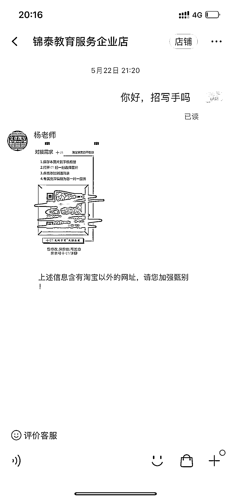
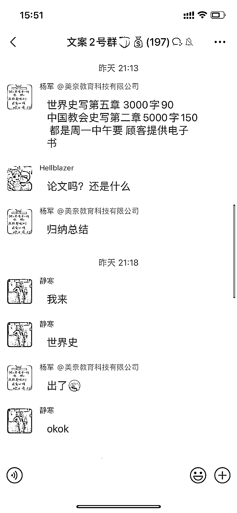
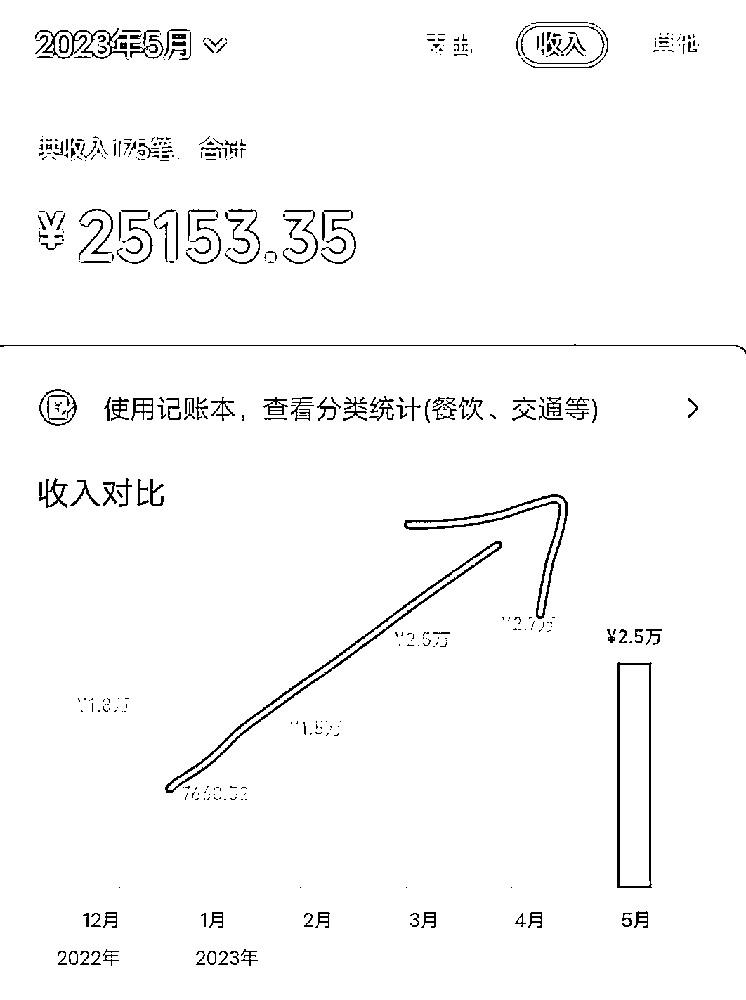

# AI 写作，一个稳定小富的成长型副业

> 原文：[`www.yuque.com/for_lazy/thfiu8/hq9gg0i2l4y6ssll`](https://www.yuque.com/for_lazy/thfiu8/hq9gg0i2l4y6ssll)

<ne-h2 id="d1f86cd7" data-lake-id="d1f86cd7"><ne-heading-ext><ne-heading-anchor></ne-heading-anchor><ne-heading-fold></ne-heading-fold></ne-heading-ext><ne-heading-content><ne-text id="u0c37d05b">(100 赞)AI 写作，一个稳定小富的成长型副业</ne-text></ne-heading-content></ne-h2> <ne-p id="ua2580369" data-lake-id="ua2580369"><ne-text id="u1efb0fb8">作者： Xu·东伟</ne-text></ne-p> <ne-p id="ua80c5471" data-lake-id="ua80c5471"><ne-text id="u5ecdff01">日期：2023-06-22</ne-text></ne-p> <ne-p id="u814cabe0" data-lake-id="u814cabe0"><ne-text id="ubaea217e">《AI 写作，一个稳定小富的成长型副业》</ne-text></ne-p> <ne-p id="u7e1c17e6" data-lake-id="u7e1c17e6"><ne-text id="u37b05595">写这篇文章是一次复盘，覆盖所有实操的细节！</ne-text></ne-p> <ne-p id="ucd87de5a" data-lake-id="ucd87de5a"><ne-text id="udd46411a">希望能让大家看完后，直接无脑实操赚钱！</ne-text></ne-p> <ne-p id="u40152388" data-lake-id="u40152388"><ne-text id="u69ae567f">我一直相信一个理念，AI 只是一种新的技术，有人嗤之以鼻，有人用来提高效率，但我相信利用 AI 可以让普通人做成一些之前做不到的事情，甚至直接变现。</ne-text></ne-p> <ne-p id="u2f97d9ac" data-lake-id="u2f97d9ac"><ne-text id="u81ee29c0">后来在圈子里认识了向南和荷包蛋糕，两人对写作都有经验，于是我们一拍即合，组成了 AI 写作团队，目前已经跑出了一点成绩。</ne-text></ne-p> <ne-p id="u3ab00774" data-lake-id="u3ab00774"><ne-text id="u654d8f60">糕老师拥有三年写作经验，之前稳定月入 1w+，后来在 GPT 的加持下，效率提升，再加上迎来毕业季，增长到月入近 3w，如下图。</ne-text></ne-p> <ne-p id="uc6e8e6f1" data-lake-id="uc6e8e6f1"><ne-text id="u50353129">这两个月跑出的成绩：新人第一天开始做就可以直接变现几十，一个月左右可以稳定在日入 200~300，想要做大就需要往个人 ip、开店铺、引流方面去做了。</ne-text></ne-p> <ne-p id="u3fa7eeb1" data-lake-id="u3fa7eeb1"><ne-text id="u661c25f0">更多细节，烦请移步飞书：</ne-text> [<ne-text id="u86a99b66">https://y9r93uo8au.feishu.cn/docx/XHNNdajhloRsH2xt2MKcWEXSnic</ne-text>](https://y9r93uo8au.feishu.cn/docx/XHNNdajhloRsH2xt2MKcWEXSnic)<ne-card data-card-name="image" data-card-type="inline" id="XRuYz" data-event-boundary="card">  <ne-p id="uee28449f" data-lake-id="uee28449f"><ne-card data-card-name="image" data-card-type="inline" id="xuWAF" data-event-boundary="card">  <ne-p id="u80d9c6bd" data-lake-id="u80d9c6bd"><ne-card data-card-name="image" data-card-type="inline" id="T3BN0" data-event-boundary="card"></ne-card></ne-p> <ne-hole id="u141ad919" data-lake-id="u141ad919"><ne-card data-card-name="hr" data-card-type="block" id="YBmOK" data-event-boundary="card"><ne-p id="u3a842372" data-lake-id="u3a842372"><ne-text id="u6afe6a13">评论区：</ne-text></ne-p> <ne-p id="u7132a8ee" data-lake-id="u7132a8ee"><ne-text id="uc61acc31">陈宇 : ChatGPT 用的是 3.5 还是 4</ne-text> <ne-text id="u9e65b11f">Xu·东伟 : 3.5 就可以了</ne-text> <ne-text id="ufe8778f8">Young。 : 加了 5 个，有 2 个都是让你刷单的。。。[擦汗]</ne-text> <ne-text id="u04bc621f">Xu·东伟 : 正常的，有些还会让你赚几块钱</ne-text> <ne-text id="u5f208532">勇者/重庆/写作输出 : 刷单要接受吗，好像都是唉</ne-text> <ne-text id="ub73861f1">Xu·东伟 : 正常的 店铺也想白嫖 有些还会让你赚几块钱</ne-text> <ne-text id="u56b57a74">小野 : 加的全是让我刷单的</ne-text> <ne-text id="u5505652f">Xu·东伟 : 说明现在写作店铺都是这种趋势了😂 不过都会返钱的</ne-text></ne-p></ne-card></ne-hole></ne-card></ne-p></ne-card></ne-p>