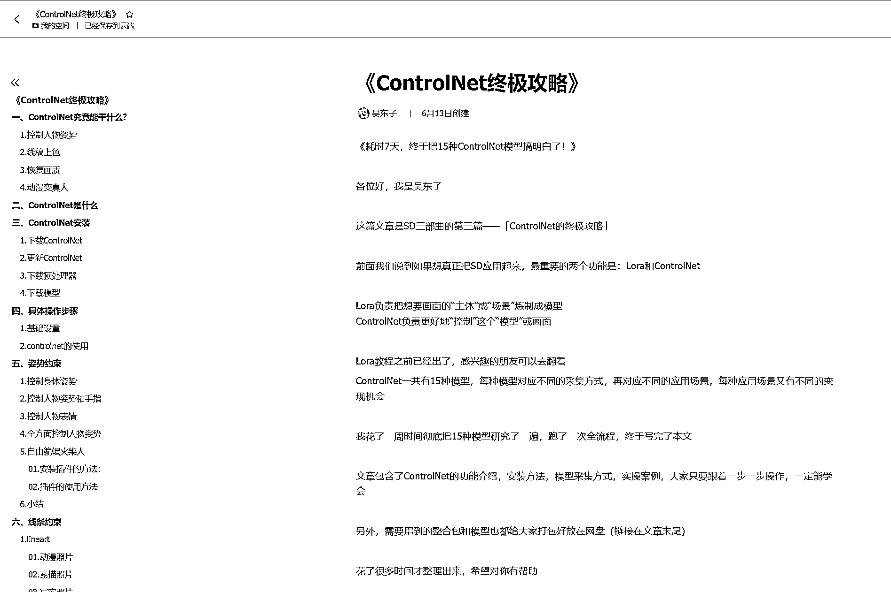
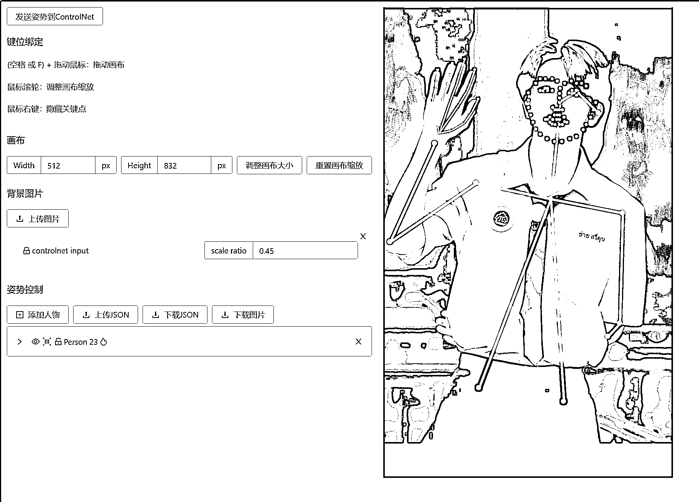
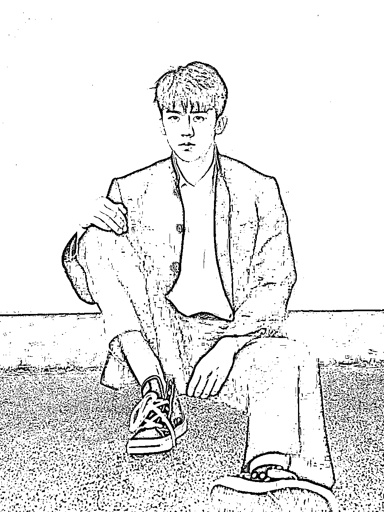
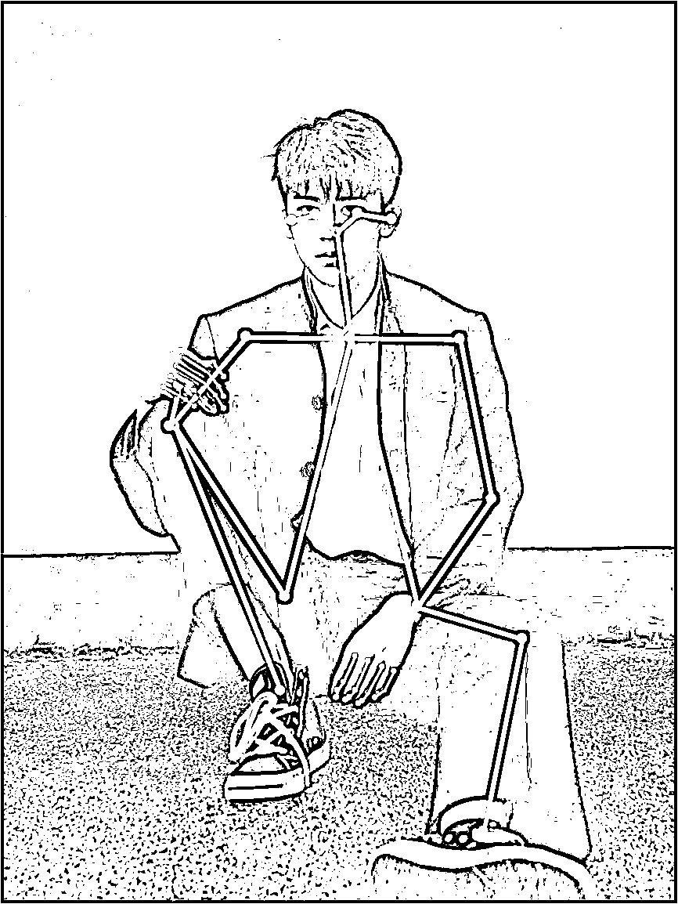

# 耗时 7 天，终于把 15 种 ControlNet 模型搞明白了

> 原文：[`www.yuque.com/for_lazy/thfiu8/qc7sz9g4v7yiuggc`](https://www.yuque.com/for_lazy/thfiu8/qc7sz9g4v7yiuggc)

<ne-h2 id="7b1d10d2" data-lake-id="7b1d10d2"><ne-heading-ext><ne-heading-anchor></ne-heading-anchor><ne-heading-fold></ne-heading-fold></ne-heading-ext><ne-heading-content><ne-text id="u025ae20c">(53 赞)耗时 7 天，终于把 15 种 ControlNet 模型搞明白了</ne-text></ne-heading-content></ne-h2> <ne-p id="u2bc77ab9" data-lake-id="u2bc77ab9"><ne-text id="u533587a4">作者： 吴东子</ne-text></ne-p> <ne-p id="uc55bcfe7" data-lake-id="uc55bcfe7"><ne-text id="u3d7a7fb5">日期：2023-06-21</ne-text></ne-p> <ne-p id="uc1e08940" data-lake-id="uc1e08940"><ne-text id="u72838be9">《耗时 7 天，终于把 15 种 ControlNet 模型搞明白了！》</ne-text></ne-p> <ne-p id="ub18463ee" data-lake-id="ub18463ee"><ne-text id="u456d0b0e">各位好，我是吴东子</ne-text></ne-p> <ne-p id="u6bf9ccfa" data-lake-id="u6bf9ccfa"><ne-text id="u02cf59fa">这篇文章是 SD 三部曲的第三篇——「ControlNet 的终极攻略」</ne-text></ne-p> <ne-p id="u07d52ac1" data-lake-id="u07d52ac1"><ne-text id="u490dbf1b">前面我们说到如果想真正把 SD 应用起来，最重要的两个功能是：Lora 和 ControlNet</ne-text></ne-p> <ne-p id="u89e7f911" data-lake-id="u89e7f911"><ne-text id="u7d183397">Lora 负责把想要画面的“主体”或“场景”炼制成模型</ne-text> <ne-text id="u44039a84">ControlNet 负责更好地“控制”这个“模型”或画面</ne-text></ne-p> <ne-p id="u0d69443c" data-lake-id="u0d69443c"><ne-text id="u7d50cbd4">Lora 教程之前已经出了，感兴趣的朋友可以去翻看</ne-text> <ne-text id="u4b350601">ControlNet 一共有 15 种模型，每种模型对应不同的采集方式，再对应不同的应用场景，每种应用场景又有不同的变现空间</ne-text></ne-p> <ne-p id="ueb78acae" data-lake-id="ueb78acae"><ne-text id="uecf7079a">我花了一周时间彻底把 15 种模型研究了一遍，跑了一次全流程，终于写完了本文</ne-text></ne-p> <ne-p id="u568cd36e" data-lake-id="u568cd36e"><ne-text id="u0a6570a0">文章包含了 ControlNet 的功能介绍，安装方法，模型采集方式，实操案例，以及下面几个目前很好玩的功能</ne-text></ne-p> <ne-p id="u9a4eeb74" data-lake-id="u9a4eeb74"><ne-text id="ua10276f0">1.动漫转真人</ne-text> <ne-text id="uce223fa3">2.真人转动漫</ne-text> <ne-text id="u6eca49ee">3.控制人物姿势、表情</ne-text> <ne-text id="uef654ad5">4.线稿 AI 上色</ne-text> <ne-text id="ud928c83a">5.固定主角</ne-text></ne-p> <ne-p id="u02f1a695" data-lake-id="u02f1a695"><ne-text id="u005d816b">大家只要跟着一步一步操作，一定能学会</ne-text></ne-p> <ne-p id="u8dca8469" data-lake-id="u8dca8469"><ne-text id="ued12872a">另外，需要用到的整合包和模型也都给大家打包好放在网盘（链接在文章末尾）</ne-text></ne-p> <ne-p id="ua7a43e2b" data-lake-id="ua7a43e2b"><ne-text id="u3037d19a">花了很多时间才整理出来，希望对你有帮助</ne-text> [<ne-text id="ue92dfc70">https://ry5hwpuf7b.feishu.cn/docx/NeqIdWC9PovqQ6xruAJcErqHnxc</ne-text>](https://ry5hwpuf7b.feishu.cn/docx/NeqIdWC9PovqQ6xruAJcErqHnxc)<ne-card data-card-name="image" data-card-type="inline" id="KINlE" data-event-boundary="card">  <ne-p id="ue230984c" data-lake-id="ue230984c"><ne-card data-card-name="image" data-card-type="inline" id="TQlWR" data-event-boundary="card">  <ne-p id="uf1645dd8" data-lake-id="uf1645dd8"><ne-card data-card-name="image" data-card-type="inline" id="OZvsn" data-event-boundary="card">  <ne-p id="u70df912e" data-lake-id="u70df912e"><ne-card data-card-name="image" data-card-type="inline" id="V6hqT" data-event-boundary="card">  <ne-p id="u8f6c00a6" data-lake-id="u8f6c00a6"><ne-card data-card-name="image" data-card-type="inline" id="EICAB" data-event-boundary="card">  <ne-p id="u5e656a6b" data-lake-id="u5e656a6b"><ne-card data-card-name="image" data-card-type="inline" id="THXg9" data-event-boundary="card"></ne-card></ne-p> <ne-p id="u84afb7c2" data-lake-id="u84afb7c2"><ne-card data-card-name="image" data-card-type="inline" id="fJ2Z7" data-event-boundary="card">  <ne-p id="uacd47ad6" data-lake-id="uacd47ad6"><ne-card data-card-name="image" data-card-type="inline" id="Rzoqo" data-event-boundary="card">  <ne-p id="ub4339a30" data-lake-id="ub4339a30"><ne-card data-card-name="image" data-card-type="inline" id="DGD54" data-event-boundary="card"></ne-card></ne-p> <ne-hole id="u67695380" data-lake-id="u67695380"><ne-card data-card-name="hr" data-card-type="block" id="CE3en" data-event-boundary="card"><ne-p id="udd8203de" data-lake-id="udd8203de"><ne-text id="ue87bcb65">评论区：</ne-text></ne-p> <ne-p id="u0c42c3c7" data-lake-id="u0c42c3c7"><ne-text id="u5251ad55">msft : 大佬刚看你的 sd 教程🐮</ne-text></ne-p></ne-card></ne-hole></ne-card></ne-p></ne-card></ne-p></ne-card></ne-p></ne-card></ne-p></ne-card></ne-p></ne-card></ne-p></ne-card></ne-p>