# 非设计专业的如何快速找到设计的思路，用 Midjourney 做出商品

> 原文：[`www.yuque.com/for_lazy/thfiu8/ghl2iyy2iugoickf`](https://www.yuque.com/for_lazy/thfiu8/ghl2iyy2iugoickf)

## (37 赞)非设计专业的如何快速找到设计的思路，用 Midjourney 做出商品 

作者： 饼公子 

日期：2023-06-19 

大家好~我是饼公子。 

随着航海的深入，很多小伙伴都开始出图了。近期，我发现很多非设计专业的小伙伴在接商业定制单的时候，不知道该如何下手。现在半路出家再去学习设计基础知识，就有点晚了，难道要眼睁睁的看着单子飞走吗？ 

今天我就来给大家分享：对于非设计专业的人来说，该怎么快速找到设计的思路以满足甲方的需求，如何快速用 midjourney 做商品出图的思路，方便大家在定制、商业活动中达到想要的效果。 

本文将按一下目录进行描述 

一、网站介绍 

二、实操讲解 

三、商品的 2 种写法 

对于其他基础内容，可以参考之前的帖子 

【小白也能看懂的 AI 作画技巧】 

[https://articles.zsxq.com/id_hhfr33l9lfmk.html](https://articles.zsxq.com/id_hhfr33l9lfmk.html) 

【AI 绘画，从随机出图到随心定制】 

[https://t.zsxq.com/0cuNtPEqJ](https://t.zsxq.com/0cuNtPEqJ) 

## 一、网站介绍 

如何快速找到设计思路，我们要借助一个叫“shutterstock”的网站，通过在网站上搜索我们想要设计的类别，然后找到关键词，到 MJ 上出图。 

首先介绍一下我们要用的网址：[https://www.shutterstock.com/zh/](https://www.shutterstock.com/zh) 

Shutterstock 是一个知名的在线图库和创意内容平台。它提供了大量的高质量照片、插图、矢量图、视频剪辑和音频文件，供个人和商业用户使用。Shutterstock 的内容库涵盖了各种主题和风格，可以满足不同领域的需求，如广告、出版物、网站设计、演示文稿等。 

打开网页（需要科学上午），可以看到很多内容。点击浏览--> 图片--> 找到类别 

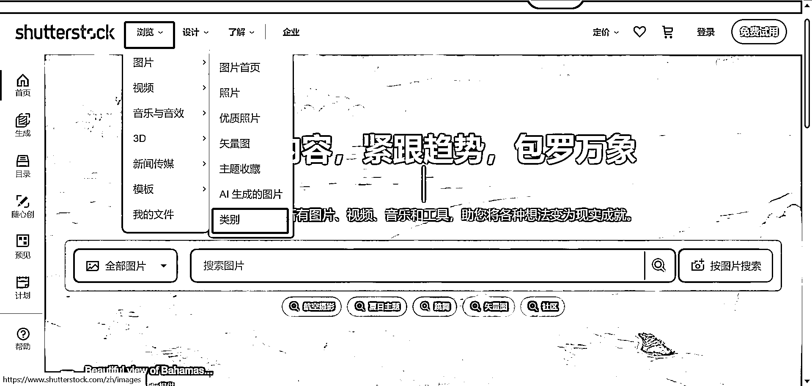 

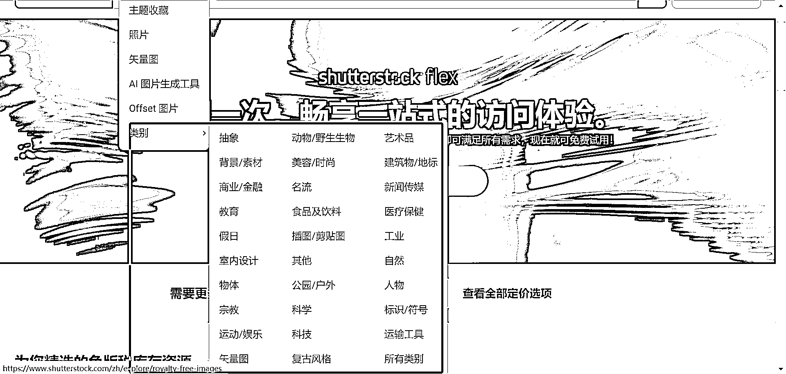 

可以看到在这里，有非常多的选项，有兴趣的可以自己看看。我就直接进入我们的主题，找寻到我想要的内容。在这里我用手提包作为举例。在这里就简单的直接用搜索功能，在搜索栏输入「手提包」 

 

可以看到跳转到结果网页 

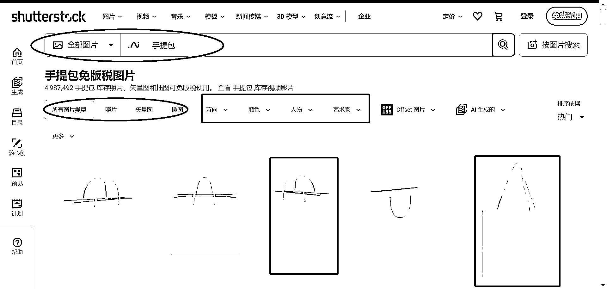 

 

有非常多的标签，还有筛选页。把鼠标放在图片上，还会发现图片上会跳出一些“关键词”。 

 

点进去看看，往下拉可以看到一整段的“关键词” 

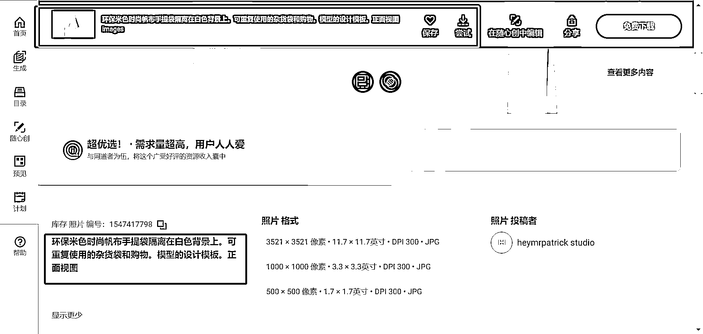 

这个时候，我们可以把这个关键词复制下来，送到 MJ 里面去看看效果。当然，为了省事可以把网页拉到最下面，直接把网页语言改为英语。 

(有的页面是英文的关键词,有的页面是中文。而且就这个中文的写法来看，估计也是机翻的效果) 

 

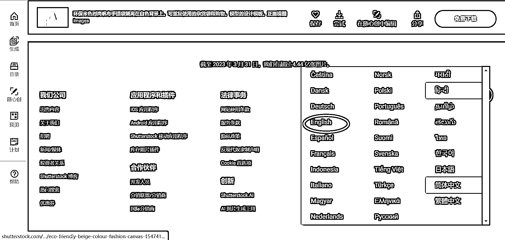 

## 二、实操讲解 

介绍了网站的使用，我们来实际操作一下，假设甲方需要制作一个包包的图，那么我们就来以此为主题进行设计， 

我先找了一个词，我们来放进 MJ 里看一下，会出什么样的图。 

在刚才的图片中看到的原词是：环保米色时尚帆布手提袋隔离在白色背景上。可重复使用的杂货袋和购物。模型的设计模板。正面视图 

可以看出来，直接复制的词，有些许不合逻辑，因为本是机翻的中文，所以我在出图的时候，会对整个关键词的写法进行略微的调整，更符合逻辑 

关键词： <ne-quote id="udd6f9c06" data-lake-id="udd6f9c06">

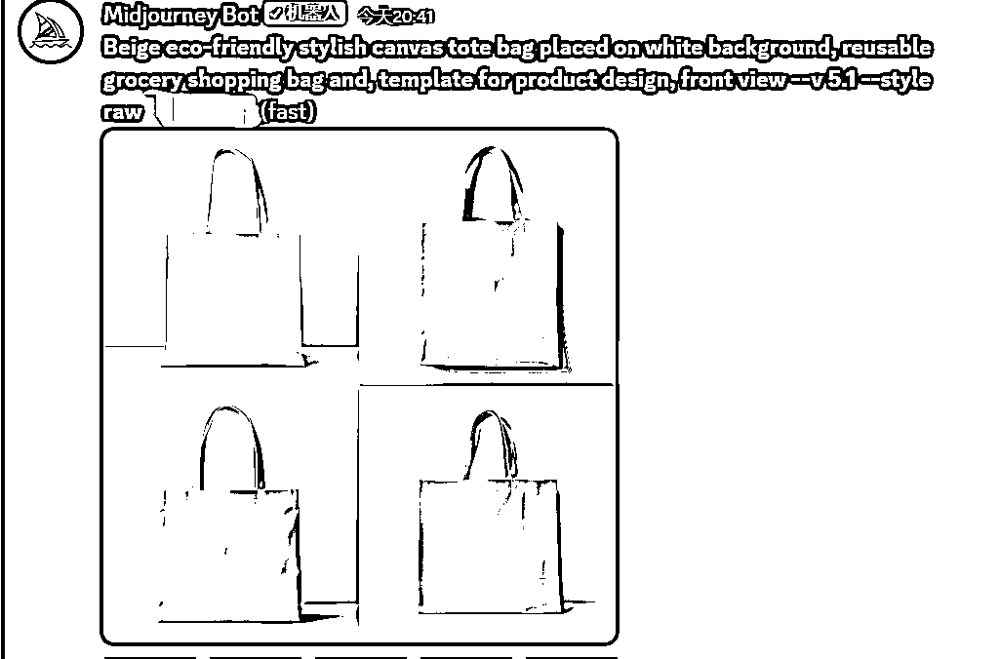 

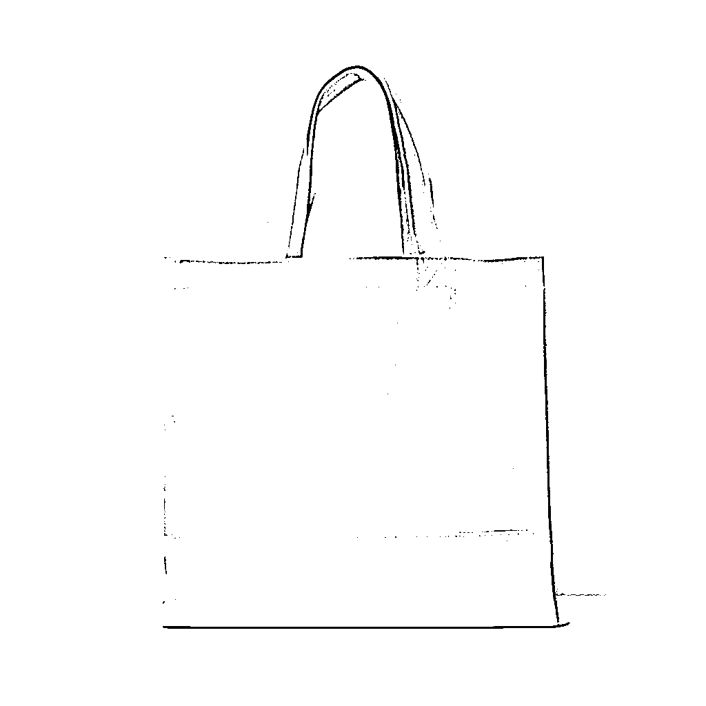 

效果很不错吧？好的，这个手提袋其实不是我想要的，我想要的是类似 LV 的手提包怎么办？比如直接搜索：棕色牛皮手提包 

我觉得这个包包不错，点进去看看，找到关键词，复制一下。这里直接是英文的，那就不改写法了 

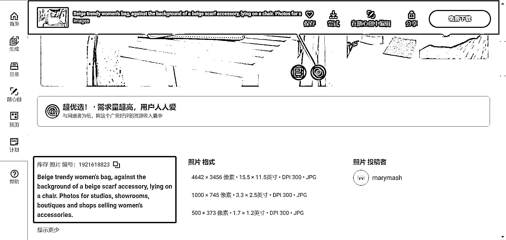 

但是这个关键词的意思并不是完全描述包，而是描述整个画面（如下图）。 

 

暂时不管，直接把它复制进 MJ 

关键词： <ne-quote id="u5850e4e2" data-lake-id="u5850e4e2">

 

我发现出图的果然是和原图的包相差较远。这个时候，想清楚一件事，你的目标是出“手提包”，还是想要留背景。如果是留下背景，那就把关于背景的描述留下，对于其他部分进行修改。如果是出和原图类似的“手提包”，那就对包的描述进行修改。 

我以想要“手提包”进行修改，因为示例且个人对一些专业词语的知识有限，不做完全复原，小伙伴们也可以用垫图的方式来尝试你想要的商品。 

关键词： <ne-quote id="u4447d7e3" data-lake-id="u4447d7e3">

 

## 三、关于商品的两种写法： 

在商业定制单中，我们需要根据甲方的需求来撰写商品的描述。在 MJ 中如何更好的生成一个商品呢？以下是两种常见的写法： 

### 1.摄影 

首先明白一个点，绝大多数的商业广告都是摄影的产物。那么用摄影的方式来写商品，一定是没有问题的。更为详细的摄影，可以参考航海手册中的内容。 

这里做一个简单的公式列举 

商业摄影/商业美拍+摄影师+机位（从哪个角度拍）+产品主体+环境+光效 

商业摄影/商业美拍：Commercial Photography/Commercial Beauty Shooting 

摄影师（由 chatGPT 提供）： <ne-oli index-type="0">1.  Hiroshi Nonami（野波浩）- 日本商业产品摄影师，擅长捕捉产品的细节和纹理，作品精致而引人注目。 <ne-oli index-type="0">2.  Tom Nagy（汤姆·纳吉）- 加拿大商业产品摄影师，以其创意和精确的摄影技术而闻名，作品展现出产品的质感和特点。 <ne-oli index-type="0">3.  Steven Rothfeld（斯蒂文·罗斯菲尔德）- 美国商业产品摄影师，特别擅长拍摄食物和饮品，他的作品富有诱人的色彩和光线效果。 <ne-oli index-type="0">4.  Jean Cazals（尚·卡扎尔）- 法国商业产品摄影师，主攻食物摄影，他的作品结合了创意构图和精确的光线控制。 <ne-oli index-type="0">5.  Mitchell Feinberg（米切尔·费恩伯格）- 美国商业产品摄影师，擅长拍摄奢侈品和珠宝，他的作品注重细节和精致感。 

机位：特写、正面、俯视图、仰视图等 

产品主体：包括具体产品名称、材质、质感、类型、颜色等等 

环境：纯色背景、海边、竹林、室内等 

光效：自然光、影棚光、色散、衍射等等 

### 2.工艺品 

很多产品，通过工艺设计/软件一样可以达到效果，而且有些效果比摄影更棒。 

这里做一个简单的公式列举 

设计师+产品主体+渲染软件+材质+环境+光效+设计流派 

工艺品设计大师（由 chatGPT 提供）： <ne-oli index-type="0">1.  Philippe Starck（菲利普·史塔克）- 法国设计师，以他的创新设计和独特的审美风格而闻名，涉及家居用品、照明、家具等领域。 <ne-oli index-type="0">2.  Karim Rashid（卡里姆·拉希德）- 加拿大设计师，他的作品充满了鲜艳的色彩和流线型的曲线，擅长设计家居用品、家具、餐具等。 <ne-oli index-type="0">3.  Patricia Urquiola（帕特里夏·乌尔基奥拉）- 西班牙设计师，她的作品融合了传统和现代的元素，擅长设计家具、灯具和装饰品。 <ne-oli index-type="0">4.  Marcel Wanders（马塞尔·万德斯）- 荷兰设计师，以他的奇幻而浪漫的设计风格而著名，涉及家居用品、照明、餐具等领域。 <ne-oli index-type="0">5.  Tom Dixon（汤姆·迪克森）- 英国设计师，以其工业风格的家居产品设计而闻名，擅长设计灯具、家具和装饰品。 

产品主体：包括具体产品名称、质感、工艺、纹路、类型、颜色等等 

渲染软件：C4D、Maya、Blender、Unity Engine 等 

材质：金属、石头、宝石、纺织品与皮革、陶瓷、玻璃等 

环境：纯色背景、海边、竹林、室内等 

光效：自然光、影棚光、色散、衍射等等 

设计流派（由 chatGPT 提供）： <ne-oli index-type="0">1.  传统手工艺：这包括各种传统工艺技术和技能，如陶瓷、木工、玉石雕刻、纺织品、刺绣等。每个地区和文化都有自己独特的传统手工艺流派。 <ne-oli index-type="0">2.  Art Nouveau（新艺术运动）：该流派兴起于 19 世纪末至 20 世纪初，强调自然和曲线的优雅，常用于设计家具、玻璃器皿和珠宝等。 <ne-oli index-type="0">3.  Art Deco（装饰艺术）：这是 20 世纪 20 年代至 30 年代的流行风格，以几何形状、镜面效果和奢华的装饰为特点。在工艺品设计中，常见于家居用品、珠宝和时钟等。 <ne-oli index-type="0">4.  Bauhaus（包豪斯）：这是 20 世纪初德国的一股现代主义运动，注重功能性和简约设计，常应用于家具、灯具和陶瓷等。 <ne-oli index-type="0">5.  Mid-century Modern（现代主义）：这是 20 世纪 50 年代至 60 年代的设计风格，以简洁、流畅的线条和有机形状为特点。在工艺品设计中，常见于家具、照明和家居装饰品等。 <ne-oli index-type="0">6.  Scandinavian Design（北欧设计）：这是来自北欧国家的设计风格，强调简约、功能性和自然材料的使用，常见于家具、陶瓷和玻璃制品等。 <ne-oli index-type="0">7.  Pop Art（波普艺术）：这是 20 世纪 60 年代的一种艺术运动，以大胆鲜艳的色彩和流行文化的符号为特征。在工艺品设计中，常见于家居用品和装饰品等。 

举两个栗子🌰，为了让产品更“真实”，选择的都是 V5.1 的 style raw 模型 

珠宝设计 

摄影写法： 

关键词： <ne-quote id="u84bab986" data-lake-id="u84bab986">

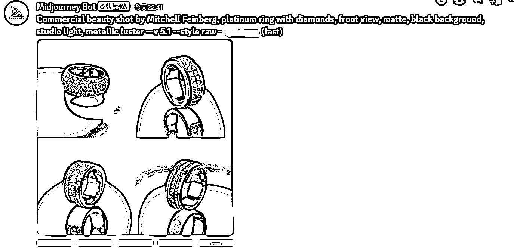 

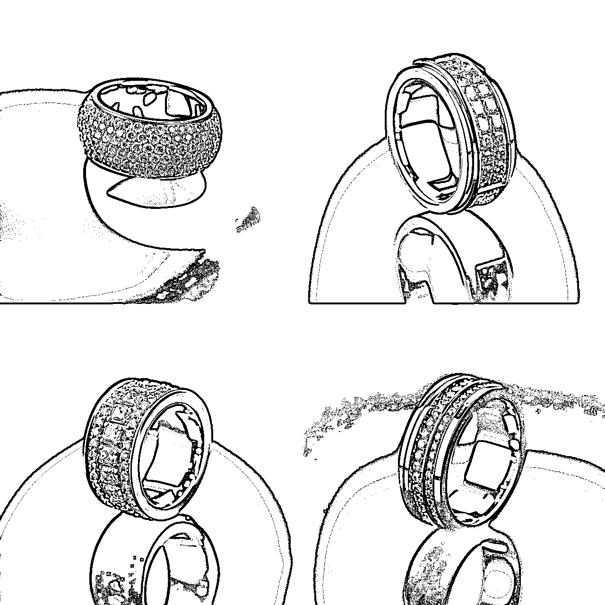 

工艺品写法： 

关键词： <ne-quote id="uf95ff569" data-lake-id="uf95ff569">

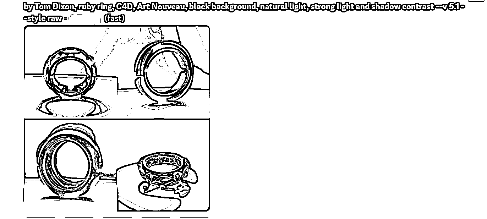 

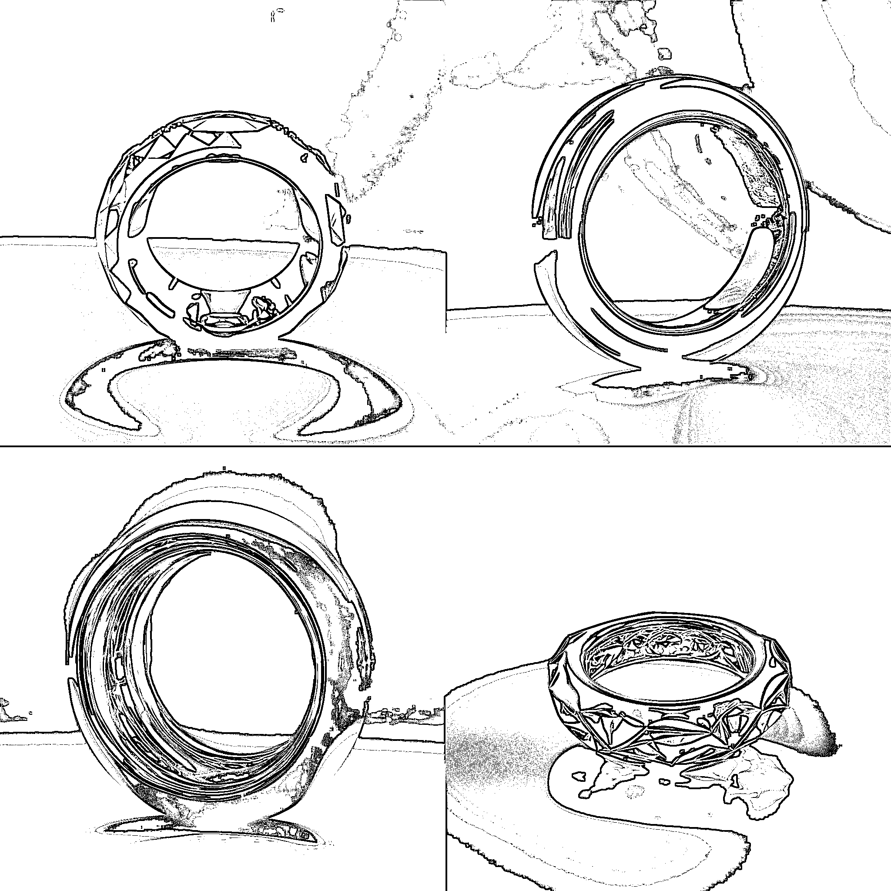 

沙发的设计 

摄影写法： 

关键词： <ne-quote id="u7844f025" data-lake-id="u7844f025">

 

 

工艺品写法： 

关键词： <ne-quote id="ub6a078be" data-lake-id="ub6a078be">

 

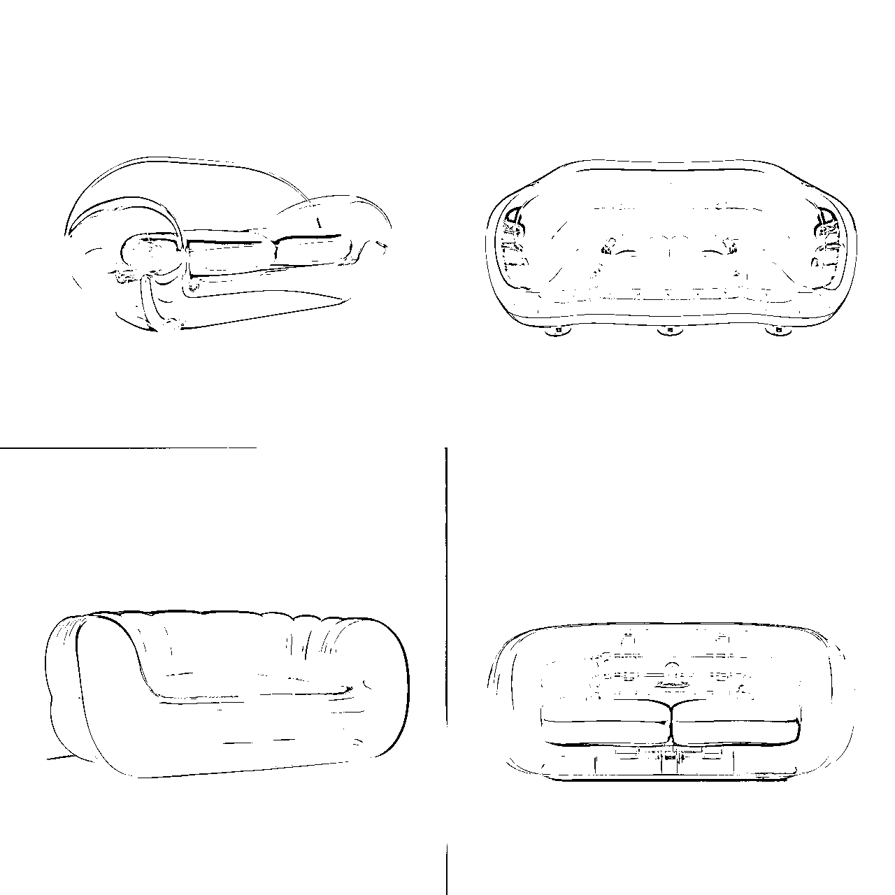 

## 四、（隐藏内容）关于商品的第三种写法： 

除了上述的方式，还有吗？当然还可以有了。 

除了一些著名的设计师，还可以运用著名的品牌，甚至可以一起用，称之为“请某著名设计师来做某个品牌的产品” 

栗子 1：来自著名品牌的产品 <ne-quote id="ua2d5e231" data-lake-id="ua2d5e231">

 

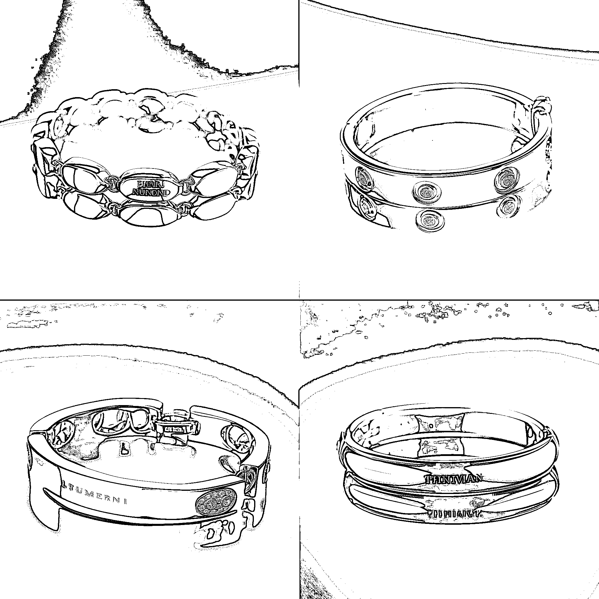 

栗子 2：来自著名设计师设计的著名品牌产品 <ne-quote id="u8bb10e87" data-lake-id="u8bb10e87">

 

 <ne-quote id="u837bbd10" data-lake-id="u837bbd10">

 

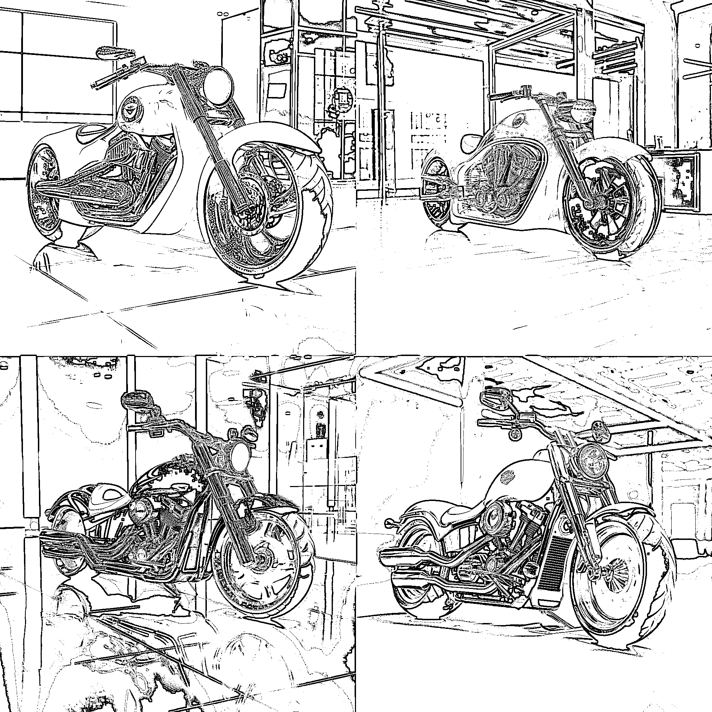 

注:并不是所有的设计师都会起作用，一个是有的著名商品效果太强了，难以变化；另一个是有些设计师风格并没有被 MJ 训练。侵权问题自行注意。 

以上，是一些非设计专业人士快速找到设计思路的方法和技巧，希望能对你有所帮助。顺带牢记，目前在商业应用上，作为概念图、思路图 MJ 效果是非常好的，距离具体落地仍旧离不开工业设计师和工厂的配合。因为具体的尺寸、材质、安全、是否符合国标等问题需要在实践中摸索。 

评论区： 

向温暖 : 这可太棒了！感谢 诗农 Hope : 手动 666 饼公子 : 感谢喜欢 饼公子 : [呲牙]</ne-quote></ne-quote></ne-quote></ne-quote></ne-quote></ne-quote></ne-quote></ne-quote></ne-quote></ne-quote>