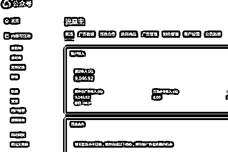

# 我通过流量主每月被动收入超 5W 的历程分享

> 原文：[`www.yuque.com/for_lazy/thfiu8/psl5d1mqmcbfws6w`](https://www.yuque.com/for_lazy/thfiu8/psl5d1mqmcbfws6w)

<ne-h2 id="b15457d6" data-lake-id="b15457d6"><ne-heading-ext><ne-heading-anchor></ne-heading-anchor><ne-heading-fold></ne-heading-fold></ne-heading-ext><ne-heading-content><ne-text id="ua93c713d">(精华帖)(660 赞)我通过流量主每月被动收入超 5W 的历程分享</ne-text></ne-heading-content></ne-h2> <ne-p id="u0a36e060" data-lake-id="u0a36e060"><ne-text id="u7582d02f">作者： 程序员田同学</ne-text></ne-p> <ne-p id="u66a4b9c6" data-lake-id="u66a4b9c6"><ne-text id="u57be7a16">日期：2023-06-20</ne-text></ne-p> <ne-p id="uad0582f3" data-lake-id="uad0582f3"><ne-text id="u92ae0e82">大家好，我是程序员田同学，一个在小程序行业沉淀了五年，在老年私域粉+</ne-text><ne-text id="ub9ee4a5a">公众号\小程序流量主</ne-text><ne-text id="u0b9a73dc">赛道专研三年的玩家。</ne-text></ne-p> <ne-p id="uf1c6bcbf" data-lake-id="uf1c6bcbf"><ne-text id="u17df4236">三年前，我大四实习工资一月 3000，经过这几年的探索，现在在不影响我本职工作和个人 IP 业务的前提下，兼职运营数十个公众号和小程序。</ne-text></ne-p> <ne-p id="ue70ee45f" data-lake-id="ue70ee45f"><ne-text id="u5036ec0c">下图是我今年二月上线的小程序，目前像这样在盈利的老年小程序有十二个。</ne-text></ne-p> <ne-p id="u0d78d4a5" data-lake-id="u0d78d4a5"><ne-card data-card-name="image" data-card-type="inline" id="JGFjd" data-event-boundary="card"></ne-card></ne-p> <ne-p id="u9beb72a3" data-lake-id="u9beb72a3"><ne-text id="ufa602fb3">下图是我今年新开的一个老年公众号的收益，这样的公众号目前有十五个。</ne-text></ne-p> <ne-p id="u1e101bf3" data-lake-id="u1e101bf3"><ne-card data-card-name="image" data-card-type="inline" id="h3MJF" data-event-boundary="card"></ne-card></ne-p> <ne-p id="uef74e2b1" data-lake-id="uef74e2b1"><ne-text id="u31229805">这样的成绩在大佬云集的生财里可能不值一提，但它对于我这样的普通人来说，在当下的人生阶段还是挺满意的。</ne-text></ne-p> <ne-p id="u1994bad3" data-lake-id="u1994bad3"><ne-text id="u45ae0d26">这篇文章就和大家详细分享一下——我是从何从迷茫的状态->再到找到赚钱方向->最后再到老年私域粉的引流和变现的具体玩法。</ne-text></ne-p> <ne-p id="u23e898fd" data-lake-id="u23e898fd"><ne-text id="u3c618b8e">详情请移步：</ne-text></ne-p> <ne-p id="u91bd8cd0" data-lake-id="u91bd8cd0">[<ne-text id="ue8081150">https://q2srbwoeiz.feishu.cn/docx/N147dCBZJoN4sxxAprMcVZZHnWf</ne-text>](https://q2srbwoeiz.feishu.cn/docx/N147dCBZJoN4sxxAprMcVZZHnWf)</ne-p> <ne-p id="ue93508da" data-lake-id="ue93508da"><ne-text id="ud8ba0708">最后特别感谢涛哥对文章的悉心指导。大家如果有什么需要，也欢迎和我交流。</ne-text></ne-p> <ne-hole id="u6e1b4214" data-lake-id="u6e1b4214"><ne-card data-card-name="hr" data-card-type="block" id="H9fZr" data-event-boundary="card"><ne-p id="u5c23b30e" data-lake-id="u5c23b30e"><ne-text id="u637f9466">评论区：</ne-text></ne-p> <ne-p id="ubf86ccb7" data-lake-id="ubf86ccb7"><ne-text id="u8f917bfa">展扬 : 先点赞后观看</ne-text> <ne-text id="u037322e3">程序员田同学 : [抱拳][抱拳][抱拳]</ne-text> <ne-text id="u07f9c4eb">张集慧 : 把抖音，视频号火过的养生类视频和这类小程序结合起来，不知道效果怎样</ne-text> <ne-text id="u1f9c07a3">程序员田同学 : 内容从来不是最重要的，老年粉喜欢军事</ne-text> <ne-text id="u14f3365e">而且养生类是不能上架小程序的</ne-text> <ne-text id="u1acfdd5c">张集慧 : 懂了</ne-text> <ne-text id="u3ea8639c">小王子 : 大哥牛逼</ne-text> <ne-text id="u2f9a12f7">云桃桃 : 厉害！</ne-text> <ne-text id="u75768032">猴大 : 多个公众号，在一个 ip 下有影响么？</ne-text></ne-p></ne-card></ne-hole>