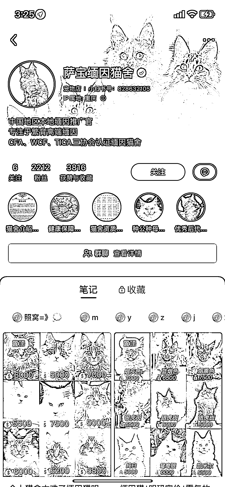
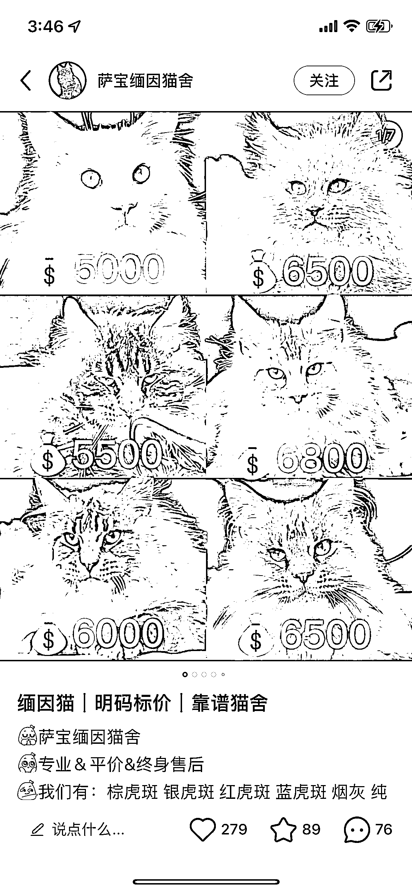
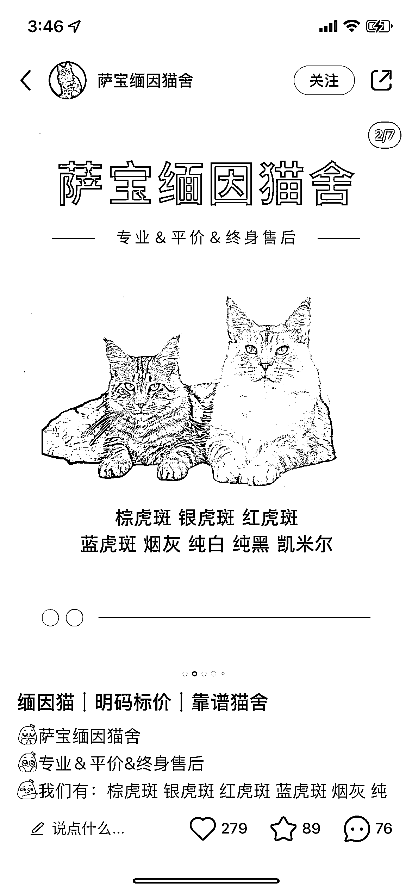
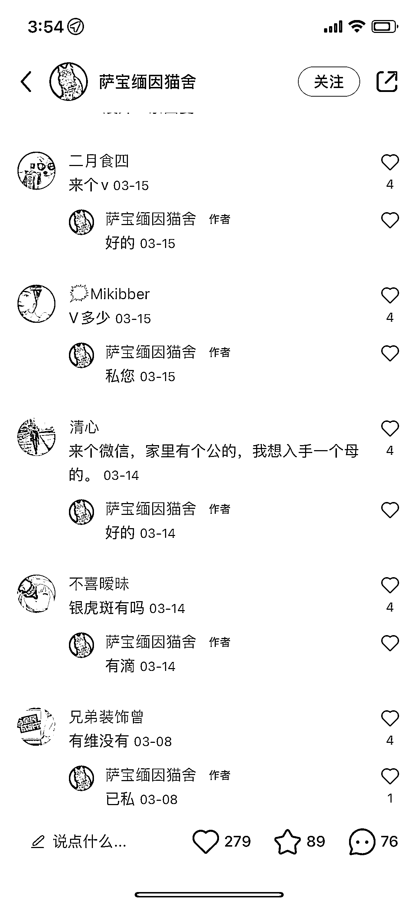
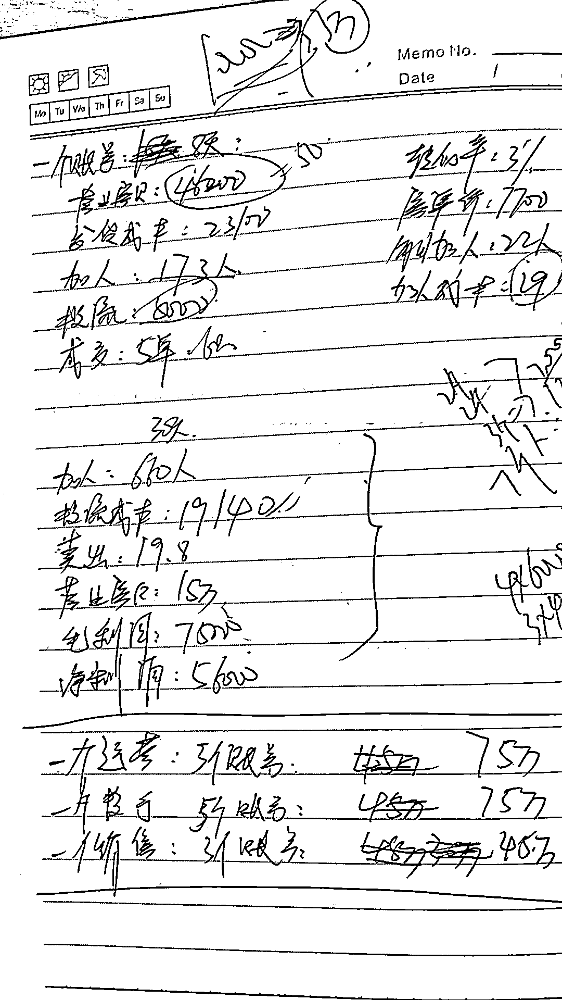

# 实操项目复盘，小红书卖猫月入 10W+

> 原文：[`www.yuque.com/for_lazy/thfiu8/yvxgl85c46ibewte`](https://www.yuque.com/for_lazy/thfiu8/yvxgl85c46ibewte)

<ne-h2 id="a49bc802" data-lake-id="a49bc802"><ne-heading-ext><ne-heading-anchor></ne-heading-anchor><ne-heading-fold></ne-heading-fold></ne-heading-ext><ne-heading-content><ne-text id="ub19b0c8a">(303 赞)实操项目复盘，小红书卖猫月入 10W+</ne-text></ne-heading-content></ne-h2> <ne-p id="u379b8c10" data-lake-id="u379b8c10"><ne-text id="u55ba42d3">作者： 盗坤</ne-text></ne-p> <ne-p id="ub4d8143e" data-lake-id="ub4d8143e"><ne-text id="uf3a42532">日期：2023-06-23</ne-text></ne-p> <ne-p id="uf0dcd5db" data-lake-id="uf0dcd5db"><ne-text id="u2bb2e6b4">继上次发文之后，已经过去四天了，估计有些小伙伴的热乎劲还没过，今天，盗坤的一篇新文又来了。</ne-text></ne-p> <ne-p id="u711d85ed" data-lake-id="u711d85ed"><ne-text id="ud5afcbcc">前因后果，人物背景这些就不提了，反正和你们也无关。还是一如既往的单刀直入，直奔主题的风格，只聊和你们相关的，直叙项目本身。各位圈友，收拾好心情，静下心来，慢慢看。</ne-text></ne-p> <ne-p id="u046c5b85" data-lake-id="u046c5b85"><ne-text id="u6d2be327">这是我投资的团队，我们自己亲自做过，且实现盈利，且已经放弃的项目。如果目标是月利润百万，数百万级别的圈友们直接忽略本文，这也是我否决该项目的原因。但如果是目标单月挣个几万十几万的，可以认真看看本文。</ne-text></ne-p> <ne-p id="u152cc9b6" data-lake-id="u152cc9b6"><ne-text id="ucd144fbd">先简单介绍一下项目，产品是活体宠物猫，流量渠道是小红书，销售端在私域，货源是一件代发。如下图所示，就是我们当初经营的账号，虽然两千粉丝不到，单日可以往私域导流 100+的超级精准粉。</ne-text></ne-p> <ne-p id="u19a6b070" data-lake-id="u19a6b070"><ne-card data-card-name="image" data-card-type="inline" id="xOFHK" data-event-boundary="card"></ne-card></ne-p> <ne-p id="u1e12cd4b" data-lake-id="u1e12cd4b"><ne-text id="u5ed8e246">接下来，我先说项目的术，再说背后的道，最后再来复盘总结项目的优劣。</ne-text></ne-p> <ne-p id="u74567ec0" data-lake-id="u74567ec0"><ne-text id="u5fbdae20" ne-bold="true">【项目运作之术】</ne-text></ne-p> <ne-p id="u40529dd2" data-lake-id="u40529dd2"><ne-text id="udd9c97bb" ne-bold="true">第一步：寻找对标，筛选对标</ne-text></ne-p> <ne-p id="u612cf87a" data-lake-id="u612cf87a"><ne-text id="ue730b50e">在小红书平台搜索“缅因猫”这个关键词，找到那些在做</ne-text><ne-text id="uc1e13d85" ne-bold="true">付费投放</ne-text><ne-text id="ude31abc5">的账号全都记录下来。如下图所示，右下角有“赞助”二字的都是投了广告的。</ne-text></ne-p> <ne-p id="uafaafa18" data-lake-id="uafaafa18"><ne-card data-card-name="image" data-card-type="inline" id="HLMMW" data-event-boundary="card"></ne-card></ne-p> <ne-p id="u921afd96" data-lake-id="u921afd96"><ne-text id="u83213f81">将对标账号记录下来之后，去进行一个筛选，发现那些点赞高，评论区互动高并且都是想要加微信买猫的账号筛选出来，这一点很重要，</ne-text><ne-text id="u15d915b8" ne-bold="true">要的就是精准流量</ne-text><ne-text id="u7527d244">。</ne-text></ne-p> <ne-p id="ued8ea70b" data-lake-id="ued8ea70b"><ne-card data-card-name="image" data-card-type="inline" id="zWRpK" data-event-boundary="card"></ne-card></ne-p> <ne-p id="ude9aac7c" data-lake-id="ude9aac7c"><ne-text id="u81aa6a9e" ne-bold="true">第二步：拆解对标，模仿对标</ne-text></ne-p> <ne-p id="u8d521614" data-lake-id="u8d521614"><ne-text id="u104b0657">筛选出这种对标账号以后，把对标账号从账号昵称，简介背景，置顶笔记，笔记合集，引流路径等等细节进行 1:1 拆解，然后像素级模仿。</ne-text></ne-p> <ne-p id="ub6fcbdab" data-lake-id="ub6fcbdab"><ne-card data-card-name="image" data-card-type="inline" id="NxYRE" data-event-boundary="card"></ne-card></ne-p> <ne-p id="u85ac673e" data-lake-id="u85ac673e"><ne-text id="u37a28b5d" ne-bold="true">第三步：筛选素材，通投拉满</ne-text></ne-p> <ne-p id="ud9e35e16" data-lake-id="ud9e35e16"><ne-text id="ua9c89273">再设置好昵称，简介，群聊等基础要素以后，然后就是开通投放账户聚光平台（类似字节的巨量引擎，巨量千川，有返点，我们之前返点是 15%，最近好像降低了）。接下来就是大量撰写笔记，测试素材。</ne-text></ne-p> <ne-p id="u685b90f6" data-lake-id="u685b90f6"><ne-text id="u71464513">我们没有对运营人员去培训什么如何起标题，做封面，写笔记等动作。我们就是让运营人员去将优秀的对标笔记的要素 1:1 模仿，然后拼凑在一起。</ne-text></ne-p> <ne-p id="uf80225ac" data-lake-id="uf80225ac"><ne-text id="u04b0ee1b" ne-bold="true">在模仿，抄袭这个动作都还没做好的前提下，我们不提倡创新。</ne-text></ne-p> <ne-p id="u7711ace5" data-lake-id="u7711ace5"><ne-card data-card-name="image" data-card-type="inline" id="W5fZq" data-event-boundary="card"></ne-card></ne-p> <ne-p id="u2b0ef12b" data-lake-id="u2b0ef12b"><ne-card data-card-name="image" data-card-type="inline" id="DlmsU" data-event-boundary="card"></ne-card></ne-p> <ne-p id="u46dc47fa" data-lake-id="u46dc47fa"><ne-text id="uba4b5755">接下来，我们会对每一个笔记花几十块到一百块去测试投放，一旦发现一个转粉率高，引流成本低的笔记，就对那个笔记通投拉满，不设预算。一直到引流成本超过我们设置的成本线之上，才会停止投放。</ne-text></ne-p> <ne-p id="ue00f2d46" data-lake-id="ue00f2d46"><ne-text id="u3ff5345f">所以大家可以去看一下我们的账号，笔记都是简单粗暴的营销笔记，那么吸引过来的都是精准的流量。而且，我们的笔记大部分都是几个点赞，而只有少数几个笔记点赞几百的，那都是筛选出来引流成本低的笔记付费投放的。</ne-text></ne-p> <ne-p id="u23b3b2b7" data-lake-id="u23b3b2b7"><ne-text id="udc750c3b">基本上，只要测试出一个好的投放素材，那个笔记给我们挣几万十几万是一点问题都没有的。</ne-text></ne-p> <ne-p id="u86fb1c2e" data-lake-id="u86fb1c2e"><ne-card data-card-name="image" data-card-type="inline" id="iGlAv" data-event-boundary="card"></ne-card></ne-p> <ne-p id="uf09da44c" data-lake-id="uf09da44c"><ne-card data-card-name="image" data-card-type="inline" id="jbHux" data-event-boundary="card"></ne-card></ne-p> <ne-p id="u1d8cc46a" data-lake-id="u1d8cc46a"><ne-text id="u15a225dc">我们仅仅只是做了一个这样的账号，单日微信加粉数量就达到了 100+，单个粉丝成本 30 以内。就这，还是因为我们的销售接待不过来，产品承接不过来，要是不限量，我觉得单日加几百人问题不大。</ne-text></ne-p> <ne-p id="u107c6a78" data-lake-id="u107c6a78"><ne-text id="u130cc2d6" ne-bold="true">第四步：导流私域，销售产品</ne-text></ne-p> <ne-p id="ud3de5115" data-lake-id="ud3de5115"><ne-text id="u9549fc32">销售和产品都是我们非常薄弱的一个环节。</ne-text><ne-text id="u8fd4d608" ne-bold="true">销售的逻辑也很简单，三个关键词，第一是分钱，第二是模仿，第三是筛选。</ne-text></ne-p> <ne-p id="u67f223e9" data-lake-id="u67f223e9"><ne-text id="u9b0feb0b">首先，给销售一个超高的销售提成（营业额的 5 个点，等同于利润的 10%，因为我们每只猫的利润都是 50%以上）。其次，整个销售流程就是找到众多同行，把他们好的东西借鉴过来，然后不断模仿完善。最后就是筛选，以结果为导向，筛选销售人员。</ne-text></ne-p> <ne-p id="u24c4e74d" data-lake-id="u24c4e74d"><ne-text id="u3f1dcc28">在筛选了三四个人以后，我们筛选出来一个比较靠谱的，能做到 2-5 个点的转化率。</ne-text></ne-p> <ne-p id="ud9b95345" data-lake-id="ud9b95345"><ne-text id="uc27f8439">产品是我们最弱的一个环节，货源全都是一件代发，有在闲鱼上找供货商，也专门飞了一趟沈阳去找供货商。销售朋友圈的素材全都是直接扒的供货商的朋友圈素材，有不懂的问题也去问供货商。</ne-text></ne-p> <ne-p id="u273e984a" data-lake-id="u273e984a"><ne-text id="u83ad71a1">在这样的操作之下，我们第一个星期就卖了四只猫，毛利润两万多，投流成本才三千多。</ne-text></ne-p> <ne-p id="u650a27e0" data-lake-id="u650a27e0"><ne-text id="u30457ba5" ne-bold="true">【背后思考之道】</ne-text></ne-p> <ne-p id="ua3a304bf" data-lake-id="ua3a304bf"><ne-text id="ucca8cc47">第一：选择，大于一切</ne-text></ne-p> <ne-p id="u3564a35f" data-lake-id="u3564a35f"><ne-text id="u6f458842">为什么要做付费流量？简单粗暴，最容易复制。</ne-text></ne-p> <ne-p id="uea033c0b" data-lake-id="uea033c0b"><ne-text id="uf3ed9cb6">能做免费流量，当然要做免费流量，但是除了 IP 等极少数的内容形式，想要稳定的获取免费流量太难了。而没有稳定的流量获取，你就没法搭建稳定的销售团队和供应链体系。</ne-text></ne-p> <ne-p id="ua411c9dc" data-lake-id="ua411c9dc"><ne-text id="u3dd92bda">但，并不是所有的产品都适用我们这套逻辑。</ne-text></ne-p> <ne-p id="u0e4b516f" data-lake-id="u0e4b516f"><ne-text id="u2c986b2a">我们选择的是猫咪，而且是猫咪里的缅因猫，便宜的五六千，七八千，一般来讲都是一万多，一只猫的利润几千起步，所以我们容错率极大。即使运营差点，销售差点，依然给了我们很大时间周期来优化。你要是卖个啥几十块的 T 恤之类的，那对你的内容，销售，供应链要求都极高极高，哪个环节没做好，都是功亏一篑。</ne-text></ne-p> <ne-p id="ueebbec97" data-lake-id="ueebbec97"><ne-text id="uc4344ada">所以，我一直强调，</ne-text><ne-text id="u5c38a45e" ne-bold="true">学一切的营销技术之前，先学选品</ne-text><ne-text id="ua0873a2c" ne-bold="true">。</ne-text></ne-p> <ne-p id="ua84f6562" data-lake-id="ua84f6562"><ne-text id="u97921985">你和我在那逼逼怎么写标题，做封面，写笔记，不好意思，我们根本不在一个思考的维度。在更高维度的认知面前，运营技术不值一钱。</ne-text></ne-p> <ne-p id="u59ef6001" data-lake-id="u59ef6001"><ne-text id="u1a61d660">类似的类目其实还蛮多，赚不了大钱，但是用我们这套逻辑，一个月赚个几万十万还是比较容易的。比如小朋友的夏令营游学，国内国外的都可以，比如本地室内装修设计，本地月子中心业务。都很难做大，但是客单价都比较高，类目相对蓝海，赚点小钱还是有很大机会的。</ne-text></ne-p> <ne-p id="u2c469da1" data-lake-id="u2c469da1"><ne-text id="ubb4dc4a0">当然，我们选择做活体宠物猫，也有一些思考上不完善的地方，所以我们后面才会放弃，这个我后面复盘那一节再来详细描述。</ne-text></ne-p> <ne-p id="ub27108fe" data-lake-id="ub27108fe"><ne-text id="u9a1548bc">第二：踩在巨人的肩膀上前进</ne-text></ne-p> <ne-p id="ud2f8f02a" data-lake-id="ud2f8f02a"><ne-text id="u6bc1bd2a">最好的学习，不在培训讲堂，在一线战场，最好的老师，不是讲师，是你的对手。</ne-text></ne-p> <ne-p id="u6eeb0dbf" data-lake-id="u6eeb0dbf"><ne-text id="ua33397ed">我佩服创新，但是在商业路径上，我们更提倡“先抄后超”。先遵循着前人已经成功的道路，去做好学生，去做好模仿，只要你还不是第一名之前，你就应该先模仿第一名做好。等你要做到第一名了，再去做创新。</ne-text></ne-p> <ne-p id="u6bb03301" data-lake-id="u6bb03301"><ne-text id="ubed7db78">这是我现在最大的一个感悟，这么多年来，我们能成功，能赚钱的项目，大都是找到对标去模仿。而那些我天马行空的想法，大概率都没能做起来。</ne-text></ne-p> <ne-p id="u83d47b5b" data-lake-id="u83d47b5b"><ne-text id="uce4a98e5">有对标，你至少有个赶超的标准，没做到还可以继续优化，继续努力。没有对标，完全创新，你甚至都不知道自己做的对不对，有没有达到合格的标准。</ne-text></ne-p> <ne-p id="uba8380c9" data-lake-id="uba8380c9"><ne-text id="u63bbd144">第三，用财务逻辑去看待问题</ne-text></ne-p> <ne-p id="ue28136ac" data-lake-id="ue28136ac"><ne-text id="u401ee171">选品思维排在运营思维之上，财务逻辑也大于运营思维之上。</ne-text></ne-p> <ne-p id="ucf415bce" data-lake-id="ucf415bce"><ne-text id="ufc8da0f8">我们的笔记内容，引流路径，销售话术肯定都还有优化的空间。不过这不是我关心的问题，是我们负责人关心的事情，是我们一线运营人员去思考的问题，我看的是数据指标。</ne-text></ne-p> <ne-p id="u145d50b3" data-lake-id="u145d50b3"><ne-card data-card-name="image" data-card-type="inline" id="J5xpR" data-event-boundary="card"></ne-card></ne-p> <ne-p id="u008cd68e" data-lake-id="u008cd68e"><ne-text id="u2acda635">转化率是 3%，引流成本 29 一个人，平均客单价 7700 元，平均毛利率 65%，而这还是在我们运营、销售、供应链优化空间极大的情况下。由此推断得出结论，盈亏平衡线在单个加微成本 150 元。</ne-text><ne-text id="u5aa9f0da" ne-bold="true">所以我设定的引流成本线是，单个加微成本在 50 元以内，通投拉满！</ne-text></ne-p> <ne-p id="u35b148b4" data-lake-id="u35b148b4"><ne-text id="u55e56c07">第四，筛选逻辑大于培养逻辑</ne-text></ne-p> <ne-p id="u20163d68" data-lake-id="u20163d68"><ne-text id="u622dbb2a">成事在人，人，是做成这个项目的第一要素，也是最稀缺要素。</ne-text></ne-p> <ne-p id="uf543437c" data-lake-id="uf543437c"><ne-text id="ud28b0805">要聚人，第一是利益价值给够，在此基础上才是情绪价值。所以，我们的逻辑是分好钱，把钱给给够，我们要达到的效果就是让小红书运营和销售的薪资能够达到重庆行业平均的 1.5 倍以上。这之后，筛选逻辑大于培养逻辑。</ne-text></ne-p> <ne-p id="ud45ebdaa" data-lake-id="ud45ebdaa"><ne-text id="u2bdd1023">我们是用运营淘宝的思维去运营 boss 直聘的，先把重庆小红书运营招聘岗位都做一个调查，得出一个行业平均薪资水平，然后根据根据这个薪资水平来倒推我们的薪资设计。</ne-text></ne-p> <ne-p id="ue4a1aa98" data-lake-id="ue4a1aa98"><ne-text id="uee30ef03">如果你把 boss 直聘上的每一个公司都看成淘宝的一个店铺，把每一个招聘广告都看成淘宝的链接，把每一个求职者都看成淘宝的客户，你就懂我说的意思了。</ne-text></ne-p> <ne-p id="u159a2042" data-lake-id="u159a2042"><ne-text id="u396b5456">真的找到那种有自驱力，有学习力，有复盘能力的人，你只要把钱给够了，他会自动点燃自己的光芒。</ne-text></ne-p> <ne-p id="ub9454a9c" data-lake-id="ub9454a9c"><ne-text id="ud1a1e816">你辛辛苦苦去指导标题怎么写，封面怎么设计，你其他事就可以不用做了。</ne-text></ne-p> <ne-p id="u74fabd93" data-lake-id="u74fabd93"><ne-text id="u2027e361" ne-bold="true">【项目优劣复盘】</ne-text></ne-p> <ne-p id="u8a7cd5b1" data-lake-id="u8a7cd5b1"><ne-text id="u87d0ef3a">就一句话，承接的是刚才“选择，大于一切”这句话。决策能力是人这一辈子最重要的能力，你要读哪个学校，选什么专业，在哪个城市，做什么行业，选什么岗位，找什么样的伴侣...</ne-text></ne-p> <ne-p id="ueb49c337" data-lake-id="ueb49c337"><ne-text id="u7fa735c5">你人生做这些决策，比你的努力，智商要重要很多倍。</ne-text></ne-p> <ne-p id="uad1395b6" data-lake-id="uad1395b6"><ne-text id="uba99059e">为什么我后面放弃了这个项目呢？</ne-text></ne-p> <ne-p id="u963fd8e2" data-lake-id="u963fd8e2"><ne-text id="u44e09f14">因为，回归到商业的本质，最终比拼的还是产品的品质、价格、服务以及背后的成本、效率。互联网只是披了一个流量渠道创新的外衣，其商业内核没有实质改变。</ne-text></ne-p> <ne-p id="u25712e9e" data-lake-id="u25712e9e"><ne-text id="ue93d66ae">做活体宠物这个事，说一千道一万，最后的落脚点还是产品本身。产品是整个链路的起点和终点，产品解决不了，整个路径就无法复制放大。</ne-text></ne-p> <ne-p id="ud9b3d6f2" data-lake-id="ud9b3d6f2"><ne-text id="u2afaf18a">流量都是一时的，流量红利的本质就是信息不对称，当这个信息不对称消失之后，流量成本必然提高。到那一天，要比拼的还是产品本身品质沉淀下来私域复购，以及品牌溢价。我们原本的想法也是通过高单价的活体宠物，在第一个环节就实现盈利，通过活体宠物获得信任之后，继而在私域销售其他周边，把一个流量反复使用多次。</ne-text></ne-p> <ne-p id="u2e6ef210" data-lake-id="u2e6ef210"><ne-text id="u23535dda">然而，然而猫咪是一个非标品，每一只猫都是与众不同的，猫咪本身的品相极大影响我们的转化率，猫咪的品质也极大影响我们的售后。</ne-text></ne-p> <ne-p id="ue750841f" data-lake-id="ue750841f"><ne-text id="u24d9a39d">你要找到那种把猫咪拍照拍得很好看的素材都已经很难了。而真正品相好的猫咪，养户根本就不愁卖，圈子里的人都是先自己内部消化了。而能够在市场上流转出来的猫咪，质量参差不齐，我们根本就无法把控质量。我们售出去的猫咪，老是会有一部分品质的问题。</ne-text></ne-p> <ne-p id="u756afcac" data-lake-id="u756afcac"><ne-text id="u0426f25c">这不是单单依靠我们拓宽供应商数量，养户数量就可以解决的事情。即使增加再多的供应商，我们对这些养户依然没有把控力，口头上的承诺没有意义。这些养户都不大，好的猫咪不愁销路，我们对其的约束就像空中楼阁一样，显得很幼稚。</ne-text></ne-p> <ne-p id="ueab61afb" data-lake-id="ueab61afb"><ne-text id="u5875c24f">我做这个项目也不是单单为了一个月挣几万，十几万。如果真正能解决产品问题，需要下重注，花钱去解决，我也是愿意的。就比如说，我们自己做猫舍，自己做繁育。然而这么多养户都做不大是有原因的，猫咪的繁育是一个非常非常精细的活，他需要非常专业的人才，专业的设备，专业的管理才行，一旦一两只猫出现了疾病没有处理好，那可能就是整个猫舍的灾难。</ne-text></ne-p> <ne-p id="ud132ea9f" data-lake-id="ud132ea9f"><ne-text id="u474642ab">这已经不是我们愿意砸钱就可以解决的事情了，所以这也是为什么大多数的养户都只是维持一个很小的状态。因为如果猫咪数量不大，猫舍主人自己用心呵护好，管理好，是能做照顾好这些猫咪的。一旦量变大了，也会超出他们的管理能力。</ne-text></ne-p> <ne-p id="ue701f4ba" data-lake-id="ue701f4ba"><ne-text id="u7b4e6666">我前面有讲到“踩在巨人的肩膀上前进”，这就是生动一课。为什么全中国就没有一家做得很大的活体宠物猫机构？不是因为没有人想到这个生意，是这个生意确实有很大的问题很难去解决。</ne-text></ne-p> <ne-p id="u97cd2010" data-lake-id="u97cd2010"><ne-text id="ucf865ade">当然，基于此，我为什么还要把这个项目分享给大家。因为我虽然没有看到那种年入千万，几千万的案例。但是，一个普通人要想一个月赚几万，十万还是不难的。而如果深耕这个赛道，一年赚个几百万也还是有机会的。</ne-text></ne-p> <ne-p id="ueaecf960" data-lake-id="ueaecf960"><ne-text id="u438371f5">我们的项目已经停止了，那个账号送给了当时项目负责人的老婆。靠着小红书的长尾流量，她上个月都还卖出去六只猫，赚了几万块。</ne-text></ne-p> <ne-p id="u3daa8afd" data-lake-id="u3daa8afd"><ne-text id="u0b01450e">我做这个项目，是需要搭建一个稳定的流量渠道，一个稳定的销售团队，这是有成本的。而如果没有稳定的产品，庞大的团队反而成了我的累赘。</ne-text></ne-p> <ne-p id="u3329aee5" data-lake-id="u3329aee5"><ne-text id="u0145683d">但是她总共就一个人，真要放大也放大不了，每天接待十个人都已经是她的极限了。事实上，她要带小孩，要做家务，每天大概也就接待两三个人，就这她都挣了几万块。而在量不大的情况下，靠我们筛选的那几个供应商，一个月卖个十几只猫，并且要保证品质售后，完全是没问题的。</ne-text></ne-p> <ne-p id="u35ccc6f4" data-lake-id="u35ccc6f4"><ne-text id="u60842cb9">除此之外，我也知道一些人全身心投入此项目，甚至自己自建猫舍+同行合作，产品品质绝对过关，价格都是一两万，几万的猫咪，一年也可以做到几百万利润。</ne-text></ne-p> <ne-p id="u9a578d6d" data-lake-id="u9a578d6d"><ne-text id="u9eff5d95">当然，如果回到几年前，这个盈利也让我非常心动了。可是我是以投资占小比例股份的情况，还需要找到一个对这个行业特别了解，有行业沉淀的优秀团队，还只是有机会做到几百万的利润，这就和我的预期相去甚远了。</ne-text></ne-p> <ne-p id="u76b8d2d0" data-lake-id="u76b8d2d0"><ne-text id="u2e677e93">以上，就是项目的完整分享。我没有这个项目的培训，所以大家也不用想着要找我啥学习、请教、合作又或者帮忙链接资源啥的。就是很单纯地给大家分享一个我们实际跑通了的项目，以及给一些在做小红书的圈友一些启发。</ne-text></ne-p> <ne-hole id="u772eec9a" data-lake-id="u772eec9a"><ne-card data-card-name="hr" data-card-type="block" id="LEhE8" data-event-boundary="card"><ne-p id="u863dbc9d" data-lake-id="u863dbc9d"><ne-text id="u27d71c48">评论区：</ne-text></ne-p> <ne-p id="u5c066656" data-lake-id="u5c066656"><ne-text id="ude03f6ac">y 青青青青青 : [呲牙]马上来学习</ne-text> <ne-text id="ub4ab8f8e">小李同学 : 坤哥🐮</ne-text> <ne-text id="u114177a4">六和 : 大佬发文，虽然在路上，但也要马住</ne-text> <ne-text id="u1bc6e850">小李同学 : 核心还是后端[呲牙]</ne-text> <ne-text id="u78a8de0e">盗坤 : 顺便说一下，小红书对导流私域查得很严，严重直接封号。而开了聚光平台，导流路径很丝滑，并且可以光明正大导流，我们账号没有因为导流私域受过任何处罚，这也是我直接选择做付费的原因。同时，该文章复盘的是卖猫的事情，但整个逻辑同样可以运用到小红书其他产品上。</ne-text> <ne-text id="u4f5e7d14">大飛 : 谢谢大佬分享</ne-text> <ne-text id="u99c2abf6">艾小飞 : 我很喜欢这句：</ne-text> <ne-text id="u2eb8fb3b">最好的学习，不在培训讲堂，在一线战场</ne-text> <ne-text id="u82cfe358">最好的老师，不是讲师，是你的对手</ne-text> <ne-text id="u454e4e5d">谢谢分享[玫瑰]</ne-text> <ne-text id="u722b9f71">孙永华 : 坤坤 我想你了</ne-text></ne-p></ne-card></ne-hole>