# 职场小白裸辞做小红书宠物博主，一个月收入顶一年工资

> 原文：[`www.yuque.com/for_lazy/thfiu8/hogk66evq71esnu5`](https://www.yuque.com/for_lazy/thfiu8/hogk66evq71esnu5)

<ne-h2 id="4ee60682" data-lake-id="4ee60682"><ne-heading-ext><ne-heading-anchor></ne-heading-anchor><ne-heading-fold></ne-heading-fold></ne-heading-ext><ne-heading-content><ne-text id="u535cb457">(81 赞)职场小白裸辞做小红书宠物博主，一个月收入顶一年工资</ne-text></ne-heading-content></ne-h2> <ne-p id="u5cb783fa" data-lake-id="u5cb783fa"><ne-text id="u4e302b06">作者： 虾饼</ne-text></ne-p> <ne-p id="u3f077ce6" data-lake-id="u3f077ce6"><ne-text id="u7b3a5e9b">日期：2023-06-21</ne-text></ne-p> <ne-p id="uc59f0b06" data-lake-id="uc59f0b06"><ne-text id="u80e584fb">宠物赛道越来越卷了，那除了头部大 V 外，素人还能做起来吗？</ne-text></ne-p> <ne-p id="u41c98ed6" data-lake-id="u41c98ed6"><ne-text id="uaeeab20f">不知道大家有没有发现，很多的红海赛道细分之后，就又是一个新的蓝海。我在小红书做宠物科普博主之前，就是一个毫无基础的新人，在小红书做宠物赛道也只是因为热爱分享。</ne-text></ne-p> <ne-p id="ued43bff3" data-lake-id="ued43bff3"><ne-text id="u3a75bee8">所以在刚开始起号时，仅仅是利用闲暇时间去蹭爆款标题，发笔记试试水，没想到一个月就积累了近千粉。慢慢的我就开始专职做宠物科普博主，接广告推广变现了。现在，我单月的收入比我之前一年的收入还高，这也是我当时不敢想的。</ne-text></ne-p> <ne-p id="u6bdb2417" data-lake-id="u6bdb2417"><ne-text id="u9d9a443d">而对于素人来说，宠物科普就是一个机会比较大的蓝海类目。相比萌宠、吃播赛道，宠物科普难度比较低，适合小白入局，而且起号成功之后不仅仅可以只做科普，也可以做同类型的矩阵号去引流卖货。</ne-text></ne-p> <ne-p id="u6fbdaddc" data-lake-id="u6fbdaddc"><ne-text id="u3c990550">今天，和大家分享我做小红书宠物科普博主的一些经验和实操，希望对大家有帮助。</ne-text></ne-p> <ne-h1 id="ad224632" data-lake-id="ad224632"><ne-heading-ext><ne-heading-anchor></ne-heading-anchor><ne-heading-fold></ne-heading-fold></ne-heading-ext><ne-heading-content><ne-text id="uebbf112a">一、自我介绍</ne-text></ne-heading-content></ne-h1> <ne-p id="u402d57dd" data-lake-id="u402d57dd"><ne-text id="u31e52e2f">哈喽大家好，我是虾饼，3 年生财圈友，2 年谢无敌的红书宝宝友。我在 21 年底裸辞后开始做小红书，选择了宠物赛道里的细分赛道——宠物科普，单月收入最高抵我之前上班一年的收入。</ne-text></ne-p> <ne-p id="ufa69f200" data-lake-id="ufa69f200"><ne-text id="u4874cb79">小红书可以说是各个自媒体平台里对素人最容易上手、推荐机制最友好的，分分钟从苦逼打工人转型为全职博主！</ne-text></ne-p> <ne-p id="u40bf84df" data-lake-id="u40bf84df"><ne-text id="u8649c9e9">宠物行业近年来发展趋势向好。比起生娃，现代年轻人更偏爱养育成本低而精神陪伴价值高的宠物，将它们看做是家庭成员的一部分，愿意为它们付出精力和金钱。</ne-text></ne-p> <ne-p id="u0c8bc571" data-lake-id="u0c8bc571"><ne-text id="u00e01f7c">但实际上我选择这个赛道偶然性是比较多的，我没有像其他人一样用很科学的方式去调研去分析，仅仅是从我个人长处出发。我是一名铲屎官，特别特别爱我的毛孩子，有事没事就要逛论坛取经，学习科学养育的知识，淘车价好物，我还很热衷于把我所知道的安利给身边的朋友。</ne-text></ne-p> <ne-p id="u3f4bc63d" data-lake-id="u3f4bc63d"><ne-text id="ud789cfdc">那么我的优势就是：有知识储备（量多量少不要紧）+热爱分享。所以我决定大类上选择宠物，细分赛道上选择做科普。</ne-text></ne-p> <ne-p id="u06144c9a" data-lake-id="u06144c9a"><ne-text id="u83737bd9">误打误撞，这个赛道恰恰是最适合新人入场的赛道之一。</ne-text></ne-p> <ne-p id="u7417714a" data-lake-id="u7417714a"><ne-text id="u00be45e8">先说一下我起号的情况：2021.10 开始利用通勤时间发简单科普笔记+萌宠日常，但发现科普笔记流量更好，通过蹭爆款标题一个月积累了近千粉丝。</ne-text></ne-p> <ne-p id="u69b6cb29" data-lake-id="u69b6cb29"><ne-text id="uf22d2563">零零碎碎地接广，一个品报价小几百。2022.2 用了一个爆款模板一周时间涨粉 3W，广告邀约不断，报价四位数。</ne-text></ne-p> <ne-p id="u5f36801f" data-lake-id="u5f36801f"><ne-card data-card-name="image" data-card-type="inline" id="MfeXA" data-event-boundary="card">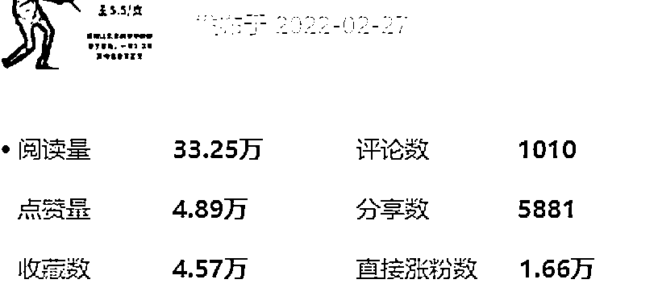</ne-card></ne-p> <ne-h1 id="77c3dc2a" data-lake-id="77c3dc2a"><ne-heading-ext><ne-heading-anchor></ne-heading-anchor><ne-heading-fold></ne-heading-fold></ne-heading-ext><ne-heading-content><ne-text id="u09f673bd">二、宠物赛道情况</ne-text></ne-heading-content></ne-h1> <ne-p id="u7d62c188" data-lake-id="u7d62c188"><ne-text id="u169ca177">宠物赛道大致可以细分为：萌宠、吃播、科普。</ne-text></ne-p> <ne-p id="u1dd1ad94" data-lake-id="u1dd1ad94"><ne-text id="u23028bbe" ne-bold="true">（1）萌宠 难度：5 星</ne-text></ne-p> <ne-oli index-type="0"><ne-oli-i>1</ne-oli-i><ne-oli-c class="ne-oli-content" id="uf1a7320e" data-lake-id="uf1a7320e"><ne-text id="u9cbf102a">必备条件：宠物有特色或号主有较强的包装能力</ne-text></ne-oli-c></ne-oli> <ne-oli index-type="0"><ne-oli-i>2</ne-oli-i><ne-oli-c class="ne-oli-content" id="ucfb0ca4e" data-lake-id="ucfb0ca4e"><ne-text id="ub61b71f1">其他条件：会讲故事、会拍摄剪辑</ne-text></ne-oli-c></ne-oli> <ne-oli index-type="0"><ne-oli-i>3</ne-oli-i><ne-oli-c class="ne-oli-content" id="ub7e5d019" data-lake-id="ub7e5d019"><ne-text id="u1d02ec9a">优点：流量大，出大 V 概率高</ne-text></ne-oli-c></ne-oli> <ne-oli index-type="0"><ne-oli-i>4</ne-oli-i><ne-oli-c class="ne-oli-content" id="u82dae901" data-lake-id="u82dae901"><ne-text id="u235f4642">缺点：泛粉多，用户画像不够精准，报价较低，无法批量复制</ne-text></ne-oli-c></ne-oli> <ne-p id="u98a963e3" data-lake-id="u98a963e3"><ne-card data-card-name="image" data-card-type="inline" id="STAWL" data-event-boundary="card"></ne-card></ne-p> <ne-p id="ub6259dd4" data-lake-id="ub6259dd4"><ne-text id="u3d60fcbf" ne-bold="true">（2）吃播 难度：3 星</ne-text></ne-p> <ne-oli index-type="0"><ne-oli-i>1</ne-oli-i><ne-oli-c class="ne-oli-content" id="u911aa313" data-lake-id="u911aa313"><ne-text id="ud5f4538b">必备条件：宠物干饭能干得很香或号主场景布置能力较高</ne-text></ne-oli-c></ne-oli> <ne-oli index-type="0"><ne-oli-i>2</ne-oli-i><ne-oli-c class="ne-oli-content" id="uc0634482" data-lake-id="uc0634482"><ne-text id="u01a0be7d">其他条件：简单的拍摄剪辑</ne-text></ne-oli-c></ne-oli> <ne-oli index-type="0"><ne-oli-i>3</ne-oli-i><ne-oli-c class="ne-oli-content" id="u1106a3ab" data-lake-id="u1106a3ab"><ne-text id="u17834fd0">优点：流量中等，出片比萌宠难度低，可以复制</ne-text></ne-oli-c></ne-oli> <ne-oli index-type="0"><ne-oli-i>4</ne-oli-i><ne-oli-c class="ne-oli-content" id="u929efc77" data-lake-id="u929efc77"><ne-text id="ua0d33421">缺点：同萌宠</ne-text></ne-oli-c></ne-oli> <ne-p id="ue0ca6990" data-lake-id="ue0ca6990"><ne-card data-card-name="image" data-card-type="inline" id="oeE2M" data-event-boundary="card"></ne-card></ne-p> <ne-p id="u72f82e57" data-lake-id="u72f82e57"><ne-card data-card-name="image" data-card-type="inline" id="azTVF" data-event-boundary="card"></ne-card></ne-p> <ne-p id="udeaada71" data-lake-id="udeaada71"><ne-text id="u9f7f1238" ne-bold="true">（3）科普 难度：2 星</ne-text></ne-p> <ne-oli index-type="0"><ne-oli-i>1</ne-oli-i><ne-oli-c class="ne-oli-content" id="u804ab80b" data-lake-id="u804ab80b"><ne-text id="ua29cab72">必备条件：宠物知识储备</ne-text></ne-oli-c></ne-oli> <ne-oli index-type="0"><ne-oli-i>2</ne-oli-i><ne-oli-c class="ne-oli-content" id="u6e3a42b9" data-lake-id="u6e3a42b9"><ne-text id="u602a78e3">其他条件：简单的拍摄剪辑或文案排版</ne-text></ne-oli-c></ne-oli> <ne-oli index-type="0"><ne-oli-i>3</ne-oli-i><ne-oli-c class="ne-oli-content" id="u68ea71c0" data-lake-id="u68ea71c0"><ne-text id="u813a8f9b">优点：制作简单几乎无成本，用户画像精准，报价较高，可批量复制</ne-text></ne-oli-c></ne-oli> <ne-oli index-type="0"><ne-oli-i>4</ne-oli-i><ne-oli-c class="ne-oli-content" id="ucd7c9130" data-lake-id="ucd7c9130"><ne-text id="ucb903296">缺点：流量较少，较难出大 V</ne-text></ne-oli-c></ne-oli> <ne-p id="u06d8215c" data-lake-id="u06d8215c"><ne-card data-card-name="image" data-card-type="inline" id="XBxeS" data-event-boundary="card">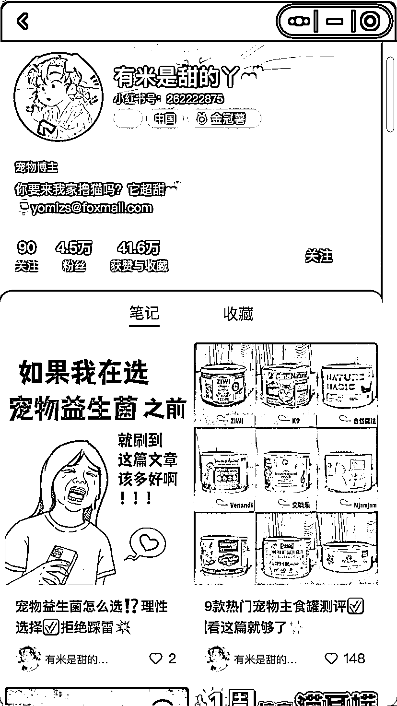</ne-card></ne-p> <ne-p id="ubaf19b17" data-lake-id="ubaf19b17"><ne-card data-card-name="image" data-card-type="inline" id="pCHns" data-event-boundary="card">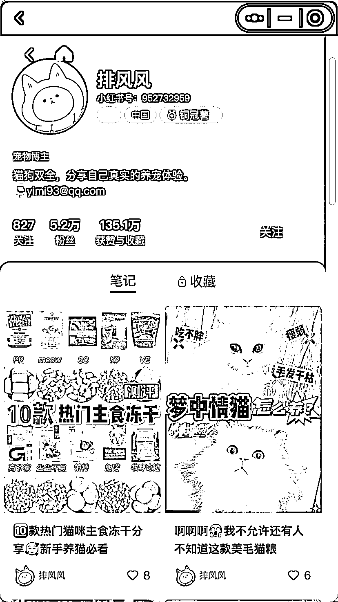</ne-card></ne-p> <ne-p id="ube17b60d" data-lake-id="ube17b60d"><ne-text id="uc6fd70c3">因为科普类可量产的特点，成为了许多机构和品牌做号的切入点。团队来做这类号的优势是人力充足，能量产，只要一批号里有那么几个做起来了，收益就很可观了。</ne-text></ne-p> <ne-h5 id="ff61871e" data-lake-id="ff61871e"><ne-heading-ext><ne-heading-anchor></ne-heading-anchor><ne-heading-fold></ne-heading-fold></ne-heading-ext><ne-heading-content><ne-text id="u394ec9ce">1、品牌</ne-text></ne-heading-content></ne-h5> <ne-p id="u2258a0ec" data-lake-id="u2258a0ec"><ne-text id="u09f1d284">品牌起号只需要组建一个非常小的团队，成本远比每月找博主投放低。</ne-text></ne-p> <ne-h5 id="e63cee96" data-lake-id="e63cee96"><ne-heading-ext><ne-heading-anchor></ne-heading-anchor><ne-heading-fold></ne-heading-fold></ne-heading-ext><ne-heading-content><ne-text id="u3cbe24e6" ne-bold="true">例子：诚实一口</ne-text></ne-heading-content></ne-h5> <ne-p id="u76f55e00" data-lake-id="u76f55e00"><ne-text id="u65edb03c">品牌矩阵号&作用：</ne-text></ne-p> <ne-p id="u0306960e" data-lake-id="u0306960e"><ne-card data-card-name="image" data-card-type="inline" id="m6Zox" data-event-boundary="card"></ne-card></ne-p> <ne-p id="uc29bd4ee" data-lake-id="uc29bd4ee"><ne-text id="u19af8b17" style="color: rgb(143, 149, 158);">专业号大号 1 个</ne-text></ne-p> <ne-p id="u8a5ded5f" data-lake-id="u8a5ded5f"><ne-text id="u64866712" style="color: rgb(143, 149, 158);">品牌宣传、活动发布用</ne-text></ne-p> <ne-p id="u7c7cf441" data-lake-id="u7c7cf441"><ne-card data-card-name="image" data-card-type="inline" id="MiKeL" data-event-boundary="card"></ne-card></ne-p> <ne-p id="u3242e802" data-lake-id="u3242e802"><ne-text id="u6fa2f485" style="color: rgb(143, 149, 158);">专业号小号 1 个</ne-text></ne-p> <ne-p id="u08f35300" data-lake-id="u08f35300"><ne-text id="ua63c6225" style="color: rgb(143, 149, 158);">品牌宣传、引流用</ne-text></ne-p> <ne-p id="ubfb19aab" data-lake-id="ubfb19aab"><ne-card data-card-name="image" data-card-type="inline" id="CDABN" data-event-boundary="card">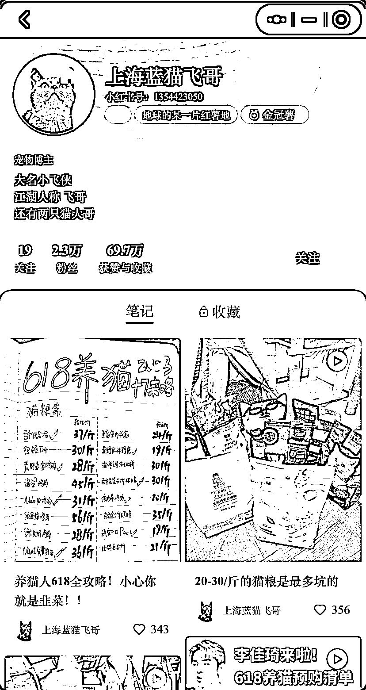</ne-card></ne-p> <ne-p id="u4e5e0455" data-lake-id="u4e5e0455"><ne-text id="u8aeaa1b4" style="color: rgb(143, 149, 158);">个人号猫号 N 个</ne-text></ne-p> <ne-p id="ua04931d6" data-lake-id="ua04931d6"><ne-text id="u1eff09ee" style="color: rgb(143, 149, 158);">给品牌打软广用</ne-text></ne-p> <ne-p id="u3f501c66" data-lake-id="u3f501c66"><ne-card data-card-name="image" data-card-type="inline" id="KwxF0" data-event-boundary="card">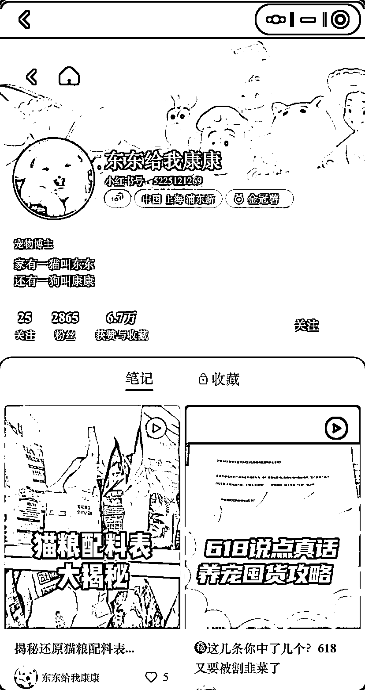</ne-card></ne-p> <ne-p id="u45c865e2" data-lake-id="u45c865e2"><ne-text id="u827e2f8f" style="color: rgb(143, 149, 158);">个人号狗号 N 个</ne-text></ne-p> <ne-p id="uec444307" data-lake-id="uec444307"><ne-text id="ud9935b61" style="color: rgb(143, 149, 158);">给品牌打软广用</ne-text></ne-p> <ne-p id="udf1e849a" data-lake-id="udf1e849a"><ne-text id="u1b8acb23">诚实一口的专业号小号做得很好，通过发布一系列有趣但没什么意义的内容，打造品牌有意思、亲近用户的形象，博得用户好感，打开品牌知名度。</ne-text></ne-p> <ne-p id="udb796a41" data-lake-id="udb796a41"><ne-text id="u7dc0cac5">该品牌前期的个人号也是图文类型，使用爆款模板大量起号，后来又做了视频类型的，成本高了一些，但传播度和影响力也更大。</ne-text></ne-p> <ne-p id="u48b43bbd" data-lake-id="u48b43bbd"><ne-text id="u4f4708a1">视频内容的打造跟图文爆款也是一样的，猫号的某条内容火了，选题不变，台词稍微改一下，套到狗号上面，能再爆一次。</ne-text></ne-p> <ne-h5 id="af94d180" data-lake-id="af94d180"><ne-heading-ext><ne-heading-anchor></ne-heading-anchor><ne-heading-fold></ne-heading-fold></ne-heading-ext><ne-heading-content><ne-text id="ubd118feb">2、机构</ne-text></ne-heading-content></ne-h5> <ne-p id="u17bf8ee5" data-lake-id="u17bf8ee5"><ne-text id="u1d9bc251">量产一批号，选题、封面设计、剪辑套路共用，只要做起来了，就可以找品牌合作推广。而且由于机构手上号多，什么量级的号都有，价位不同，给了品牌较大的选择空间。</ne-text></ne-p> <ne-h5 id="5584031f" data-lake-id="5584031f"><ne-heading-ext><ne-heading-anchor></ne-heading-anchor><ne-heading-fold></ne-heading-fold></ne-heading-ext><ne-heading-content><ne-text id="u3598ed39" ne-bold="true">例子：方片新媒体</ne-text></ne-heading-content></ne-h5> <ne-p id="ub2fd1597" data-lake-id="ub2fd1597"><ne-text id="ubd1d0d2f">矩阵号：</ne-text></ne-p> <ne-p id="ud71fbc0d" data-lake-id="ud71fbc0d"><ne-card data-card-name="image" data-card-type="inline" id="FTRSV" data-event-boundary="card"></ne-card></ne-p> <ne-p id="u84aa7111" data-lake-id="u84aa7111"><ne-card data-card-name="image" data-card-type="inline" id="Bx1lu" data-event-boundary="card">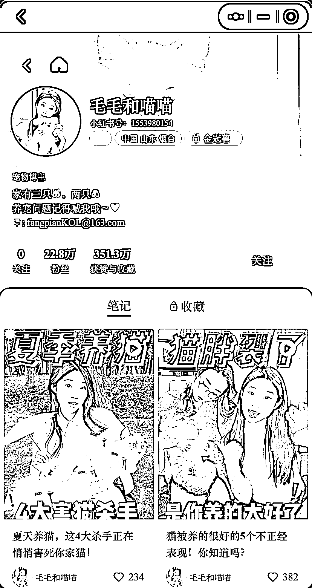</ne-card></ne-p> <ne-p id="u108b5f1e" data-lake-id="u108b5f1e"><ne-card data-card-name="image" data-card-type="inline" id="nq1eG" data-event-boundary="card"></ne-card></ne-p> <ne-p id="uba6896d2" data-lake-id="uba6896d2"><ne-text id="u320ab2d7">他们做的号太多了，但是基本上只要看到就能认出来，因为风格差不多。毛毛和喵喵这个号还是换过演员的，谁都可以是猫猫，视频里露的脸长什么样，对他们来说并不重要。</ne-text></ne-p> <ne-p id="ub905a4e1" data-lake-id="ub905a4e1"><ne-text id="u4fdde5bc">当然批量批号对机构来说不过是常规操作，只是做宠物号的机构没有很多。我认为可能是能批量做的类型比较少，目前看来主要都是科普类，此外就是宠物品牌预算较低，远不如美妆类的利润高。</ne-text></ne-p> <ne-h5 id="282dfdb2" data-lake-id="282dfdb2"><ne-heading-ext><ne-heading-anchor></ne-heading-anchor><ne-heading-fold></ne-heading-fold></ne-heading-ext><ne-heading-content><ne-text id="u0ca78381">3、素人入场分析</ne-text></ne-heading-content></ne-h5> <ne-p id="ub27f8ce0" data-lake-id="ub27f8ce0"><ne-text id="ub4be9367">去年小红书对宠物赛道十分友好，经常给予流量扶持，还拉了作者群进行运营。</ne-text></ne-p> <ne-p id="u35a55d8e" data-lake-id="u35a55d8e"><ne-text id="u10c1cfde">今年起来砍掉了宠物赛道大部分的流量扶持，活动减少，类目仅限于萌宠和异宠，大部分作者群也直接解散了。现在整体环境对新号比较友好，新号能获得较多自然流量，但老号基本只能靠推流。</ne-text></ne-p> <ne-p id="u1341b7d0" data-lake-id="u1341b7d0"><ne-text id="u82f94e0e">此外品牌和机构入场会挤压到素人的生存空间，质量不够高，或自然流量不够好的素人接广概率相比之前有所降低。</ne-text></ne-p> <ne-p id="u8b1785b4" data-lake-id="u8b1785b4"><ne-text id="ua1a25934">但对素人来说宠物科普仍是一个机会比较大的蓝海类目。所以我会建议小白多考虑宠物科普赛道，先套爆款模板起号，再看是要做同类型矩阵号去引流卖货，还是要精耕内容转型更有深度的科普博主。</ne-text></ne-p> <ne-h1 id="2238bd22" data-lake-id="2238bd22"><ne-heading-ext><ne-heading-anchor></ne-heading-anchor><ne-heading-fold></ne-heading-fold></ne-heading-ext><ne-heading-content><ne-text id="uf8eca49f">三、实操流程</ne-text></ne-heading-content></ne-h1> <ne-p id="u42fe7b8c" data-lake-id="u42fe7b8c"><ne-text id="uc31eb439" ne-bold="true">（1）账号装修</ne-text></ne-p> <ne-oli index-type="0"><ne-oli-i>1</ne-oli-i><ne-oli-c class="ne-oli-content" id="u7b8383c6" data-lake-id="u7b8383c6"><ne-text id="u8eeb28c0">账号定位：科普类使用真人的 IP 价值更高，用宠物做 IP 需要结合萌宠内容一起做效果才好</ne-text></ne-oli-c></ne-oli> <ne-oli index-type="0"><ne-oli-i>2</ne-oli-i><ne-oli-c class="ne-oli-content" id="ueb49143a" data-lake-id="ueb49143a"><ne-text id="ub62d119c">昵称：最好带上关键词方便被搜到，如：XX 养猫、铲屎官 XX、XX 说宠物</ne-text></ne-oli-c></ne-oli> <ne-oli index-type="0"><ne-oli-i>3</ne-oli-i><ne-oli-c class="ne-oli-content" id="u403c5a7d" data-lake-id="u403c5a7d"><ne-text id="ud5ef5f20">头像：用真人照更容易拉近和用户之间的距离，形象更丰满</ne-text></ne-oli-c></ne-oli> <ne-p id="u2ab8763b" data-lake-id="u2ab8763b"><ne-text id="u3a6f1bad" ne-bold="true">（2）内容来源</ne-text></ne-p> <ne-oli index-type="0"><ne-oli-i>1</ne-oli-i><ne-oli-c class="ne-oli-content" id="u88e41c19" data-lake-id="u88e41c19"><ne-text id="u2aed7a5a">豆瓣、贴吧、知乎：找选题相关资料用，这几个网站拥有较多高质量的经验贴</ne-text></ne-oli-c></ne-oli> <ne-oli index-type="0"><ne-oli-i>2</ne-oli-i><ne-oli-c class="ne-oli-content" id="uf4986ade" data-lake-id="uf4986ade"><ne-text id="u9568f4b5">PetMD、ASPCA、icatcare：在谷歌里用英文搜关键词，能找到很多同类网站。找选题相关资料用，需自行翻译，内容有专家把控，比中文论坛的素人发帖专业严谨</ne-text></ne-oli-c></ne-oli> <ne-oli index-type="0"><ne-oli-i>3</ne-oli-i><ne-oli-c class="ne-oli-content" id="ue5db0146" data-lake-id="ue5db0146"><ne-text id="u86d94934">谷歌学术：找文献用，宠物相关的研究国外更先进且资料更丰富</ne-text></ne-oli-c></ne-oli> <ne-oli index-type="0"><ne-oli-i>4</ne-oli-i><ne-oli-c class="ne-oli-content" id="ueeb7ce57" data-lake-id="ueeb7ce57"><ne-text id="u4eba5735">小红书：内容质量参差不齐，主要用来模仿内容的呈现方式，内容的呈现方式，如标题、封面、排版等</ne-text></ne-oli-c></ne-oli> <ne-p id="u41b01b87" data-lake-id="u41b01b87"><ne-text id="u779d26b5" ne-bold="true">（3）创作流程</ne-text></ne-p> <ne-h5 id="524a02d6" data-lake-id="524a02d6"><ne-heading-ext><ne-heading-anchor></ne-heading-anchor><ne-heading-fold></ne-heading-fold></ne-heading-ext><ne-heading-content><ne-text id="ue7bc05cf">1、找选题</ne-text></ne-heading-content></ne-h5> <ne-oli index-type="0"><ne-oli-i>1</ne-oli-i><ne-oli-c class="ne-oli-content" id="ua4117454" data-lake-id="ua4117454"><ne-text id="u16c8ae75">不要局限于自己的类目，其他类目的爆款也是可以参考的，比如：</ne-text></ne-oli-c></ne-oli> <ne-p id="ufc49446e" data-lake-id="ufc49446e"><ne-card data-card-name="image" data-card-type="inline" id="Xdwk9" data-event-boundary="card">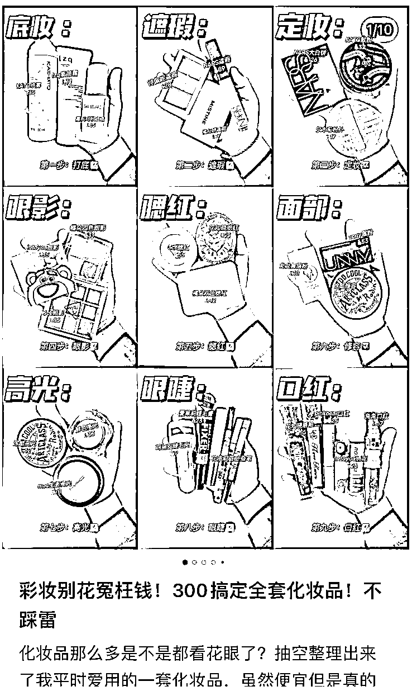</ne-card></ne-p> <ne-p id="ub9640bed" data-lake-id="ub9640bed"><ne-card data-card-name="image" data-card-type="inline" id="V89bo" data-event-boundary="card"></ne-card></ne-p> <ne-p id="u4af4ca9b" data-lake-id="u4af4ca9b"><ne-text id="u76dfe1b6">好会养猫一女的 200 元搞定日常消耗品</ne-text></ne-p> <ne-p id="u4d0b9e9c" data-lake-id="u4d0b9e9c"><ne-text id="u03977fd9" style="color: rgb(143, 149, 158);">（同时参考了选题、标题、封面）</ne-text></ne-p> <ne-oli index-type="0"><ne-oli-i>1</ne-oli-i><ne-oli-c class="ne-oli-content" id="u58d89943" data-lake-id="u58d89943"><ne-text id="uef3a256a">笔记要注意内容分配，一开始可以设定 30%引流内容（蹭热点、蹭爆款模板）+70%体现账号价值的内容。这个 70%里面留有产品植入位置，为后续接广打基础，同时也要注意账号调性，如果只发 PDD 平价养猫这种选题的笔记，接到高端产品的几率会较低。</ne-text></ne-oli-c></ne-oli> <ne-h5 id="480775c0" data-lake-id="480775c0"><ne-heading-ext><ne-heading-anchor></ne-heading-anchor><ne-heading-fold></ne-heading-fold></ne-heading-ext><ne-heading-content><ne-text id="ubb525888">2、定封面</ne-text></ne-heading-content></ne-h5> <ne-p id="u0e8affa3" data-lake-id="u0e8affa3"><ne-text id="u0d4783d5">小红书瀑布流的推送形式让封面变得极为重要，用户第一眼看到的就是封面，想要笔记脱颖而出，封面就得足够吸睛。</ne-text></ne-p> <ne-p id="u1bc049b2" data-lake-id="u1bc049b2"><ne-text id="u6baeb4af">但是不建议所有笔记封面都复刻爆款的，这样很累，而且没有明显的个人标识，还是得定下一个足够有个人特点的封面模板。</ne-text></ne-p> <ne-p id="u6b803988" data-lake-id="u6b803988"><ne-card data-card-name="image" data-card-type="inline" id="Oays8" data-event-boundary="card"></ne-card></ne-p> <ne-p id="u7b00c847" data-lake-id="u7b00c847"><ne-text id="u98459882" style="color: rgb(143, 149, 158);">统一的花字，封面均为人像</ne-text></ne-p> <ne-p id="u27ea5729" data-lake-id="u27ea5729"><ne-card data-card-name="image" data-card-type="inline" id="n2EIJ" data-event-boundary="card"></ne-card></ne-p> <ne-p id="u52d30380" data-lake-id="u52d30380"><ne-text id="u569dc491" style="color: rgb(143, 149, 158);">统一花字、封面、视频特效，但这位博主也是经历了很长时间的蛰伏才找到自己的爆款方向</ne-text></ne-p> <ne-p id="u616e7d8d" data-lake-id="u616e7d8d"><ne-card data-card-name="image" data-card-type="inline" id="dJJf2" data-event-boundary="card"></ne-card></ne-p> <ne-p id="ubb79a74a" data-lake-id="ubb79a74a"><ne-text id="u4ba7a120" style="color: rgb(143, 149, 158);">统一花字，封面均为多物品摆拍</ne-text></ne-p> <ne-h5 id="5571e1f9" data-lake-id="5571e1f9"><ne-heading-ext><ne-heading-anchor></ne-heading-anchor><ne-heading-fold></ne-heading-fold></ne-heading-ext><ne-heading-content><ne-text id="u3f9fe110">3、定图片内容</ne-text></ne-heading-content></ne-h5> <ne-p id="u06dabd2d" data-lake-id="u06dabd2d"><ne-text id="u4eb22d46">内容跟封面有共通之处，但是没有封面要求那么严格，只需琢磨出你自己一套模板即可，不用模仿爆款。</ne-text></ne-p> <ne-p id="u618e1c75" data-lake-id="u618e1c75"><ne-text id="u755ae787">但也还是要注意可读性。</ne-text></ne-p> <ne-p id="u90c61ae7" data-lake-id="u90c61ae7"><ne-card data-card-name="image" data-card-type="inline" id="IiF5D" data-event-boundary="card">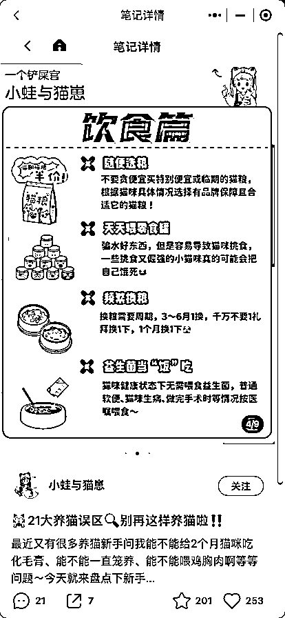</ne-card></ne-p> <ne-p id="u7f2152da" data-lake-id="u7f2152da"><ne-text id="u3f6c5bf6">笔记科普部分</ne-text></ne-p> <ne-p id="ua3baa357" data-lake-id="ua3baa357"><ne-text id="u1bd15c24" style="color: rgb(143, 149, 158);">模板可拆解为：底图、标题、段落、配图，这些都是可以用固定的字体配色和排版的</ne-text></ne-p> <ne-p id="uf996c0b5" data-lake-id="uf996c0b5"><ne-card data-card-name="image" data-card-type="inline" id="ZawO4" data-event-boundary="card">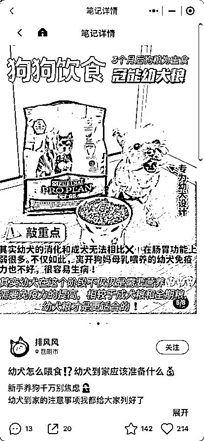</ne-card></ne-p> <ne-p id="ubf0b6256" data-lake-id="ubf0b6256"><ne-text id="u529e66fe">笔记推广部分（宠物与产品的合影）</ne-text></ne-p> <ne-p id="u67d84003" data-lake-id="u67d84003"><ne-text id="u75bc9a1f" style="color: rgb(143, 149, 158);">拍摄模板可拆解为：宠物与产品的合影、产品细节图、宠物试吃图；</ne-text></ne-p> <ne-p id="ufbbfc63b" data-lake-id="ufbbfc63b"><ne-text id="u311e2d6f" style="color: rgb(143, 149, 158);">推广部分的文案模板：大标题、小标题、卖点详解等的字体配色和排版</ne-text></ne-p> <ne-p id="u4166281e" data-lake-id="u4166281e"><ne-card data-card-name="image" data-card-type="inline" id="lhPka" data-event-boundary="card"></ne-card></ne-p> <ne-p id="ua071cbcf" data-lake-id="ua071cbcf"><ne-text id="u37e8c13f">笔记推广部分（产品细节图）</ne-text></ne-p> <ne-p id="u70ab2134" data-lake-id="u70ab2134"><ne-card data-card-name="image" data-card-type="inline" id="sScko" data-event-boundary="card">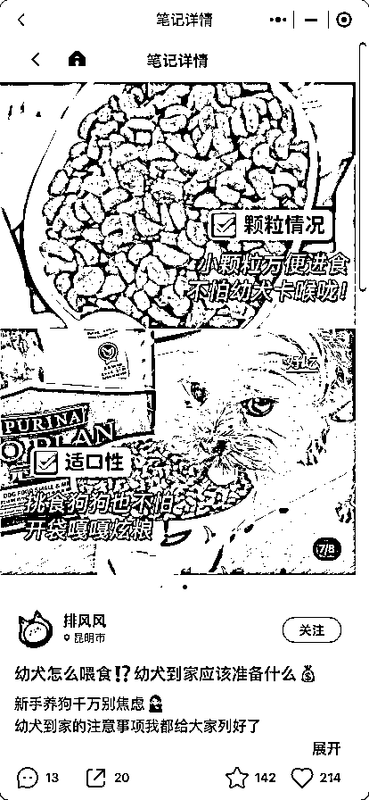</ne-card></ne-p> <ne-p id="uea0f2598" data-lake-id="uea0f2598"><ne-text id="u3c6e793c">笔记推广部分（宠物试吃图）</ne-text></ne-p> <ne-h5 id="3d63f99b" data-lake-id="3d63f99b"><ne-heading-ext><ne-heading-anchor></ne-heading-anchor><ne-heading-fold></ne-heading-fold></ne-heading-ext><ne-heading-content><ne-text id="u8cd2b87a">4、定文案</ne-text></ne-heading-content></ne-h5> <ne-p id="u4dfc9d79" data-lake-id="u4dfc9d79"><ne-text id="ua064b885">这部分其他朋友分享过，无非是分好段落，开头固定打招呼，中间抛问题埋关键词，结尾自我介绍和引导互动。此处不赘述。</ne-text></ne-p> <ne-h1 id="7feac37c" data-lake-id="7feac37c"><ne-heading-ext><ne-heading-anchor></ne-heading-anchor><ne-heading-fold></ne-heading-fold></ne-heading-ext><ne-heading-content><ne-text id="uf5fb4ddf">四、变现方向</ne-text></ne-heading-content></ne-h1> <ne-p id="uc865bc99" data-lake-id="uc865bc99"><ne-text id="ue51ad18e">对于小白来说最简单方便的变现方法就是接推广</ne-text></ne-p> <ne-p id="u065ff54c" data-lake-id="u065ff54c"><ne-text id="u561f5fd6" ne-bold="true">（1）如何提高接广率</ne-text></ne-p> <ne-oli index-type="0"><ne-oli-i>1</ne-oli-i><ne-oli-c class="ne-oli-content" id="u097c653b" data-lake-id="u097c653b"><ne-text id="u1aa6471e">前面强调的，笔记内留出产品植入空间，比如你在科普猫咪软便怎么办时，留一部分出来讲平时吃什么猫粮/保健品可以解决这个问题。</ne-text></ne-oli-c></ne-oli> <ne-oli index-type="0"><ne-oli-i>1</ne-oli-i><ne-oli-c class="ne-oli-content" id="uf084bc92" data-lake-id="uf084bc92"><ne-text id="u2b11e2b6">简介里留联系方式，方便 PR 联系你。不过现在不能留邮箱了，建议使用特殊字符，工具：</ne-text>[<ne-text id="ub93b48fd">https://exotictext.com/zh-cn/</ne-text>](https://exotictext.com/zh-cn)</ne-oli-c></ne-oli> <ne-p id="u42123185" data-lake-id="u42123185"><ne-card data-card-name="image" data-card-type="inline" id="lGYNW" data-event-boundary="card"></ne-card></ne-p> <ne-oli index-type="0"><ne-oli-i>1</ne-oli-i><ne-oli-c class="ne-oli-content" id="ue0aaa256" data-lake-id="ue0aaa256"><ne-text id="ue441993c">到达千粉后马上去开通报备合作权限，你的账号可能被品牌在蒲公英平台上看到并选中：</ne-text></ne-oli-c></ne-oli> <ne-p id="u87daecde" data-lake-id="u87daecde"><ne-card data-card-name="image" data-card-type="inline" id="LLGXD" data-event-boundary="card"></ne-card></ne-p> <ne-p id="u64dcbc33" data-lake-id="u64dcbc33"><ne-text id="u282b02db">小红书-我-左上角三条杠-创作中心</ne-text></ne-p> <ne-p id="u20186b81" data-lake-id="u20186b81"><ne-card data-card-name="image" data-card-type="inline" id="OMyup" data-event-boundary="card">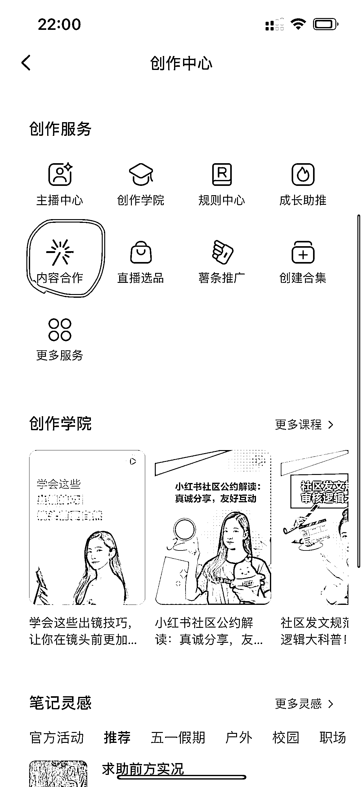</ne-card></ne-p> <ne-p id="u10f90951" data-lake-id="u10f90951"><ne-text id="u3ccf0d0d">创作中心下滑-内容合作-进去后有开通指引</ne-text></ne-p> <ne-oli index-type="0"><ne-oli-i>1</ne-oli-i><ne-oli-c class="ne-oli-content" id="u7bad9b45" data-lake-id="u7bad9b45"><ne-text id="u452149d2">使用第三方通告平台（注意甄别），如螃蟹通告、布偶通告（均为小程序），这些平台里会有新媒体群入群引导，多加，也多跟其他人互换群资源，能接触到很多通告信息</ne-text></ne-oli-c></ne-oli> <ne-oli index-type="0"><ne-oli-i>1</ne-oli-i><ne-oli-c class="ne-oli-content" id="ub1f1f855" data-lake-id="ub1f1f855"><ne-text id="u5e2b0251">遇到心仪的品牌也可以去私信求合作</ne-text></ne-oli-c></ne-oli> <ne-p id="uc06a2b3e" data-lake-id="uc06a2b3e"><ne-text id="uf3155494" ne-bold="true">（2）推广合作流程</ne-text></ne-p> <ne-p id="u4c7aaf97" data-lake-id="u4c7aaf97"><ne-text id="u40229cf4" ne-bold="true">① 合作形式</ne-text></ne-p> <ne-p id="ubd8ee444" data-lake-id="ubd8ee444"><ne-text id="u2c31afd5">合作的形式分为</ne-text><ne-text id="u681bd221" ne-bold="true">报备笔记和非报备笔记</ne-text><ne-text id="u5d247b0c">。报备笔记就是前面提到过的官方认可的品牌合作，是要被收取“保护费”的；非报备就是咱们私底下合作，悄咪咪打暗广。</ne-text></ne-p> <ne-p id="u8113882e" data-lake-id="u8113882e"><ne-text id="uc00818d2">非报备又可以分为</ne-text><ne-text id="ubfa7313f" ne-bold="true">单品跟合集</ne-text><ne-text id="u708a1e1a">，单品就是一篇笔记里只能含这个品的广告；合集就是同时有好多个品给你广告费来出现在你这篇笔记中。</ne-text></ne-p> <ne-p id="u29a33bd4" data-lake-id="u29a33bd4"><ne-text id="u0c94311f">单品里面还有个概念叫做</ne-text><ne-text id="u37ecaf3f" ne-bold="true">伪合集</ne-text><ne-text id="ue40df859">，就是一篇笔记里看似出现了很多个产品，但真正给广告费的只有一家，这种就是在最大程度上避免被判定为私自推广。</ne-text></ne-p> <ne-p id="u83a1f0b3" data-lake-id="u83a1f0b3"><ne-text id="u1b023738">跟 PR 聊的时候还得聊清楚以下几个问题：</ne-text></ne-p> <ne-oli index-type="0"><ne-oli-i>1</ne-oli-i><ne-oli-c class="ne-oli-content" id="u760c4462" data-lake-id="u760c4462"><ne-text id="u35418975" ne-bold="true">档期：</ne-text><ne-text id="u96e83e51">就是你出初稿、终稿、以及最后发布的日期。</ne-text></ne-oli-c></ne-oli> <ne-oli index-type="0"><ne-oli-i>1</ne-oli-i><ne-oli-c class="ne-oli-content" id="u785a72df" data-lake-id="u785a72df"><ne-text id="u5d2d9068" ne-bold="true">授权转发：</ne-text><ne-text id="u8dd4cebb">能否授权给品牌方在电商/内容平台上发布，是否免费，授权周期多长。尾部博主一般是免费授权，周期一般在三个月到半年。</ne-text></ne-oli-c></ne-oli> <ne-oli index-type="0"><ne-oli-i>1</ne-oli-i><ne-oli-c class="ne-oli-content" id="u00080c67" data-lake-id="u00080c67"><ne-text id="u4b48e7d8" ne-bold="true">授权投流：</ne-text><ne-text id="u4fed3778">能否授权给品牌方在小红书里投流，是否免费，授权周期多长。虽然投流能帮博主涨数据，但如果品牌爆出丑闻，还继续拿我们的笔记去投流，对我们账号形象会有影响，所以最好定一个周期，比如一年内免费授权投流，一年后看情况是否继续授权，是否加费用。</ne-text></ne-oli-c></ne-oli> <ne-oli index-type="0"><ne-oli-i>1</ne-oli-i><ne-oli-c class="ne-oli-content" id="u87d94309" data-lake-id="u87d94309"><ne-text id="ufbecead2" ne-bold="true">笔记发布后的保留周期：</ne-text><ne-text id="u6942d01d">一般是一年或永久。</ne-text></ne-oli-c></ne-oli> <ne-oli index-type="0"><ne-oli-i>1</ne-oli-i><ne-oli-c class="ne-oli-content" id="u3cd7b1f3" data-lake-id="u3cd7b1f3"><ne-text id="uf4c3d35b" ne-bold="true">排竞：</ne-text><ne-text id="uc31f1626">在你发布这篇笔记的前几天到后几天，不能再发布该品牌方的竞品的相关笔记。</ne-text></ne-oli-c></ne-oli> <ne-oli index-type="0"><ne-oli-i>1</ne-oli-i><ne-oli-c class="ne-oli-content" id="u14151f34" data-lake-id="u14151f34"><ne-text id="ud4832f2b" ne-bold="true">活动出席：</ne-text><ne-text id="u8db49722">美妆和穿搭类的品牌可能会邀请达人出席他们的产品发布会之类的。</ne-text></ne-oli-c></ne-oli> <ne-p id="ub324502b" data-lake-id="ub324502b"><ne-text id="u3d5b5cb7" ne-bold="true">② 如何报价</ne-text></ne-p> <ne-p id="uc3dde161" data-lake-id="uc3dde161"><ne-text id="u025ebbf0">推广分为两大类，</ne-text><ne-text id="uc5dc6c85" ne-bold="true">无费和有费。</ne-text></ne-p> <ne-p id="u99cad1fc" data-lake-id="u99cad1fc"><ne-text id="ud673944e">无费推广就是置换，把东西送给你你帮忙出一篇笔记，跟小红书的好物体验是差不多的；</ne-text></ne-p> <ne-p id="u09aeb4ba" data-lake-id="u09aeb4ba"><ne-text id="uc81c80b4">有费就是会给你一定数额的报酬，</ne-text><ne-text id="udf6573a4" ne-underline="true">大原则上报价一般是按粉丝量的 10%～20%</ne-text><ne-text id="uf4cbd865">，具体可以看你账号的情况，如果这段时间流量很好，账号定位又跟品牌契合度很高，那就可以再往上报。</ne-text></ne-p> <ne-p id="uff694b04" data-lake-id="uff694b04"><ne-text id="u267c154a">还有就是看你是否注重长期合作。一种情况是你笔记报价相对较高，但是出来的效果不好，人家可能就不会考虑二次合作了；</ne-text></ne-p> <ne-p id="uda3c31f2" data-lake-id="uda3c31f2"><ne-text id="uc1da9223">另一种情况是比如原价是 2000 一篇，按他们的预算可能一个月只够找你合作一次，如果能谈到 1500 一篇 ，或许他们一个月内就会找你合作两次。</ne-text></ne-p> <ne-p id="ue633db46" data-lake-id="ue633db46"><ne-text id="u087bcaed">再者你要看是跟品牌直接对接，还是跟机构对接。机构的话一般会找你要返点。</ne-text><ne-text id="ub2bc3bfb" ne-bold="true">返点</ne-text><ne-text id="u38867d20">就是你收了推广费之后返一部分给机构。</ne-text></ne-p> <ne-p id="u7029ab0f" data-lake-id="u7029ab0f"><ne-text id="ud138241f">返点在 20% 左右比较合理，那种 35% 以上我觉得有点离谱。</ne-text></ne-p> <ne-p id="u32d64f81" data-lake-id="u32d64f81"><ne-text id="u8ccd6e7f" ne-underline="true">图文报价一般会低一些，大概是视频报价的 60%～70%</ne-text><ne-text id="u0cb5b9a5">。但如果你本身就偏向于图文类的博主，那么你的图文报价是和可以视频报价相当的。</ne-text></ne-p> <ne-p id="u4fc45284" data-lake-id="u4fc45284"><ne-text id="udacf0cfb" ne-bold="true">报备笔记报价，要高于非报备</ne-text><ne-text id="ua30cd07f">，因为你不仅要被品牌收取服务费，还要接受品牌更严格的审核，可能需要你更高度的配合，如果到手比非报备低的话就太亏了。</ne-text></ne-p> <ne-p id="ub952cf9c" data-lake-id="ub952cf9c"><ne-text id="u88bcfd88">有一点很重要，一定要记得跟 PR 讲！就是你现在给的这个价格是几月份的价格，是不是一定要在当月发布稿子，如果延迟到下一个月份发布，你是不是要涨价。（</ne-text><ne-text id="ueba9f9a2" ne-bold="true">保价的概念</ne-text><ne-text id="u8e3a6420">）</ne-text></ne-p> <ne-p id="u0dd905f6" data-lake-id="u0dd905f6"><ne-text id="u86a8f3da">然后就是</ne-text><ne-text id="u64e208b6" ne-bold="true">修改次数</ne-text><ne-text id="u45e9142a">啦，特别是视频的，脚本接受几次修改，后期接受几次修改，大改的话是否要加钱。</ne-text></ne-p> <ne-p id="u6a2c6f07" data-lake-id="u6a2c6f07"><ne-text id="udbca0e77">有一些合作不是按固定价格来结算的，可能是按周期内的</ne-text><ne-text id="ufb068585" ne-bold="true">互动量阶梯式付费</ne-text><ne-text id="u1c7934d7">，比如 7 天内到达 100 赞就多少钱，到达 1000 赞就多少钱。</ne-text></ne-p> <ne-p id="uc50050c8" data-lake-id="uc50050c8"><ne-text id="ua0eca81a">也有的是按</ne-text><ne-text id="u8d22bdb4" ne-bold="true">带货佣金</ne-text><ne-text id="u5d76a225">给的，给你的一个基础费用之后，你能帮忙带多少货就额外给你多少钱，或者没有基础费用，按纯佣计算。</ne-text></ne-p> <ne-p id="u099c09bb" data-lake-id="u099c09bb"><ne-text id="uba3de48c">在寄样品上面有两个概念需要了解：</ne-text><ne-text id="uf7c9c3a9" ne-bold="true">寄拍和送拍</ne-text><ne-text id="u5f9224e6">。寄拍主要用于单价较高的产品，你拍完照片后是要寄回去还给品牌的；送拍就是东西完全送给你了。</ne-text></ne-p> <ne-p id="u94e6414f" data-lake-id="u94e6414f"><ne-text id="u9fe1d6bd" ne-bold="true">③ 结款</ne-text></ne-p> <ne-p id="u11886cf8" data-lake-id="u11886cf8"><ne-text id="ue6fe8018">最后就是</ne-text><ne-text id="u5255eb64" ne-bold="true">结款</ne-text><ne-text id="u8092d536">了，要问清楚是否需要发票。跟机构对接他们会帮你开票，不用担心。</ne-text></ne-p> <ne-p id="u11c5bb97" data-lake-id="u11c5bb97"><ne-text id="u291df7b0">跟品牌对接可能要你提供替票或者是上诺诺网代开发票，替票就是你去外面消费，然后要求开发票，用的是合作公司的抬头，再把发票给他们拿去报销；</ne-text></ne-p> <ne-p id="u61db6f97" data-lake-id="u61db6f97"><ne-text id="u8a400a37">代开发票可以上某宝搜发票管家 里面有个代开的选项，是诺诺网提供的服务，选择一个税点低的城市，开票给品牌方。</ne-text></ne-p> <ne-p id="ub4077a92" data-lake-id="ub4077a92"><ne-text id="udc740189">还要问清楚的是</ne-text><ne-text id="ue4323509" ne-bold="true">结款周期</ne-text><ne-text id="uef25373d">，是发布后就打款，还是要等多久才能打款。</ne-text></ne-p> <ne-p id="u4851fd79" data-lake-id="u4851fd79"><ne-text id="u98457e58" ne-bold="true">结款方式</ne-text><ne-text id="u958c90c0">是直接打到你私人账户上，还是要注册类似人力家这种第三方平台，这种平台是会帮你交税和解决品牌的发票问题的，很省心。</ne-text></ne-p> <ne-p id="u29dee47c" data-lake-id="u29dee47c"><ne-text id="uf5ff5dc2">现在也不止接推广的变现方式，发笔记带商品链接也是可以挣佣金的，类似抖音的小黄车，>1000 粉后可开通。</ne-text></ne-p> <ne-p id="u4aebebd0" data-lake-id="u4aebebd0"><ne-text id="ua1bdfe47">此外还可以开个小红书店铺，自己给自己带货，无粉丝要求，找得到货源即可。</ne-text></ne-p> <ne-hole id="ua8a35495" data-lake-id="ua8a35495"><ne-card data-card-name="hr" data-card-type="block" id="EQvdZ" data-event-boundary="card"><ne-p id="u36a55440" data-lake-id="u36a55440"><ne-text id="u6b3a8b5d">评论区：</ne-text></ne-p> <ne-p id="u74098af2" data-lake-id="u74098af2"><ne-text id="u522422ce">虾饼 : 加入生财的第三年啦！没想到居然会被生财约稿哈哈哈！感谢生财团队的认可和运营编辑小伙伴的工作支持🎉</ne-text> <ne-text id="u50c523f8">周彦充 : 厉害，[强]，至今还没被谁约过稿[色]</ne-text> <ne-text id="u10bef4d3">虾饼 : [抱拳]仁兄过奖！还得感谢无敌老师给的曝光哈哈哈，让小白在圈子里也有露脸的机会</ne-text> <ne-text id="u68466617">Sherry💎谢无敌 : 一直都是棒棒的虾饼[得意]</ne-text> <ne-text id="u1c256e95">虾饼 : 呜呜感谢无敌姐团队的指导和支持</ne-text> <ne-text id="u59907f78">胖大魔 : 我最喜欢的宠物博主是抖音的二狗[呲牙]还有郑义的大黄[呲牙]</ne-text> <ne-text id="u0a7b14dd">周周 Mia : 赶来给锤妈点赞[呲牙][呲牙]</ne-text> <ne-text id="u872baffe">虾饼 : [亲亲][亲亲]</ne-text></ne-p></ne-card></ne-hole>