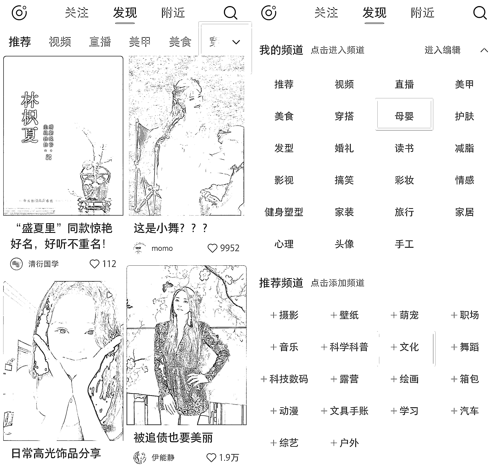
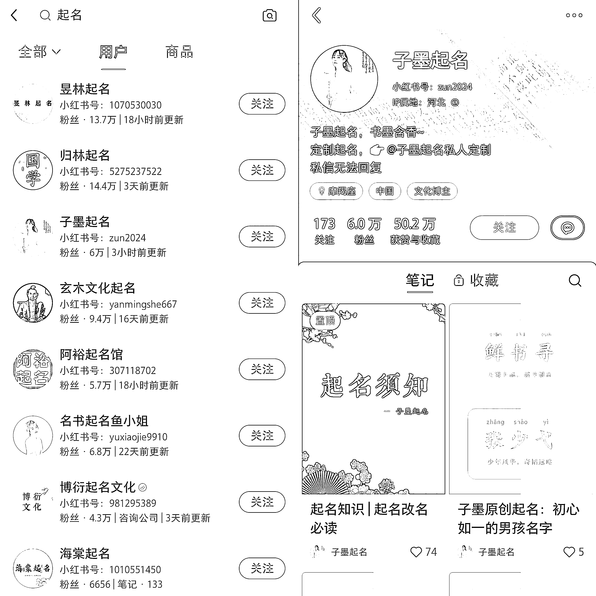
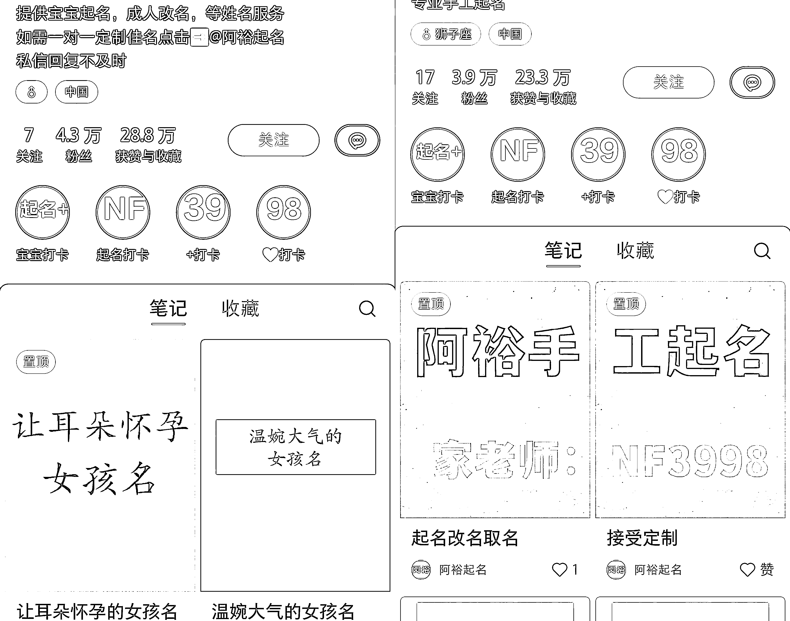
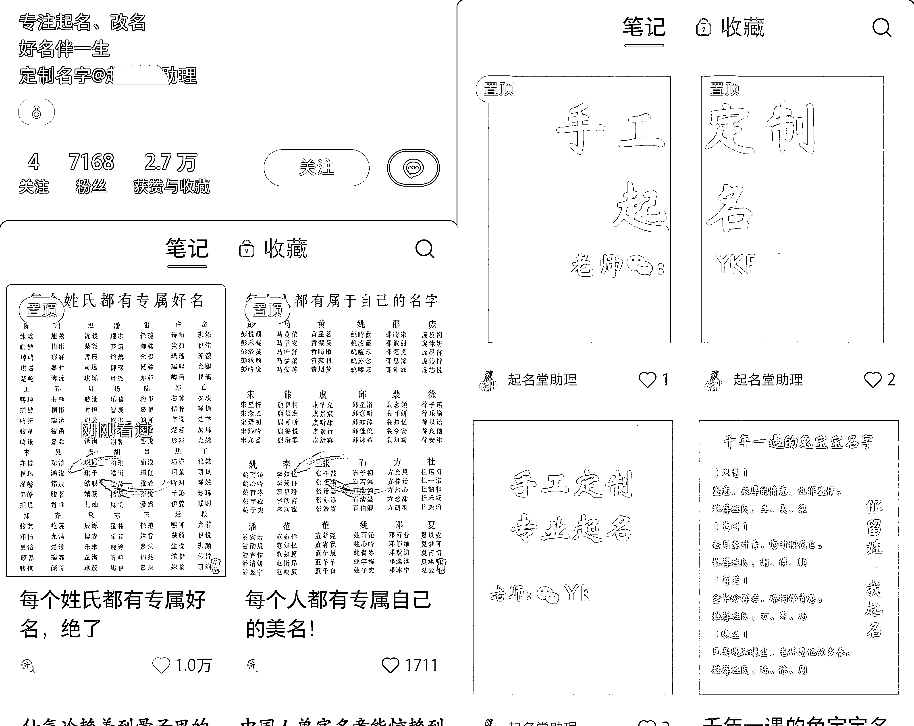
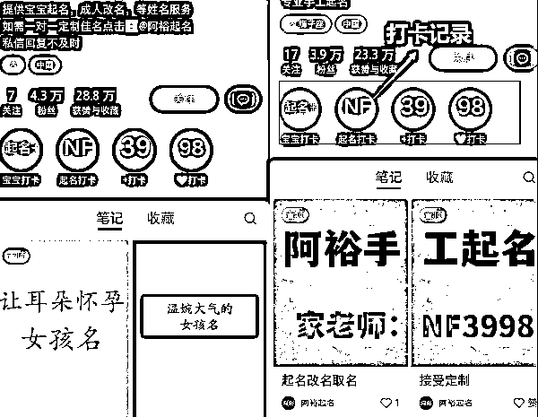
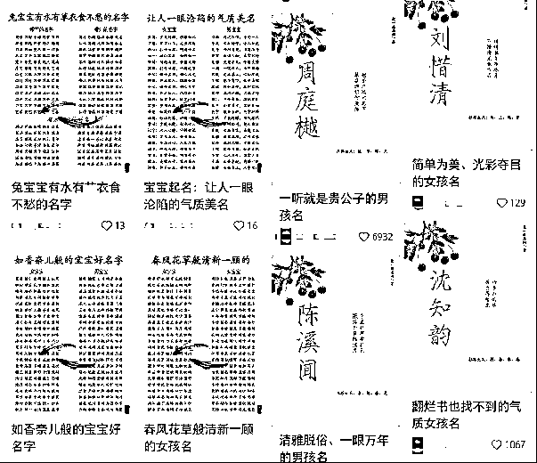
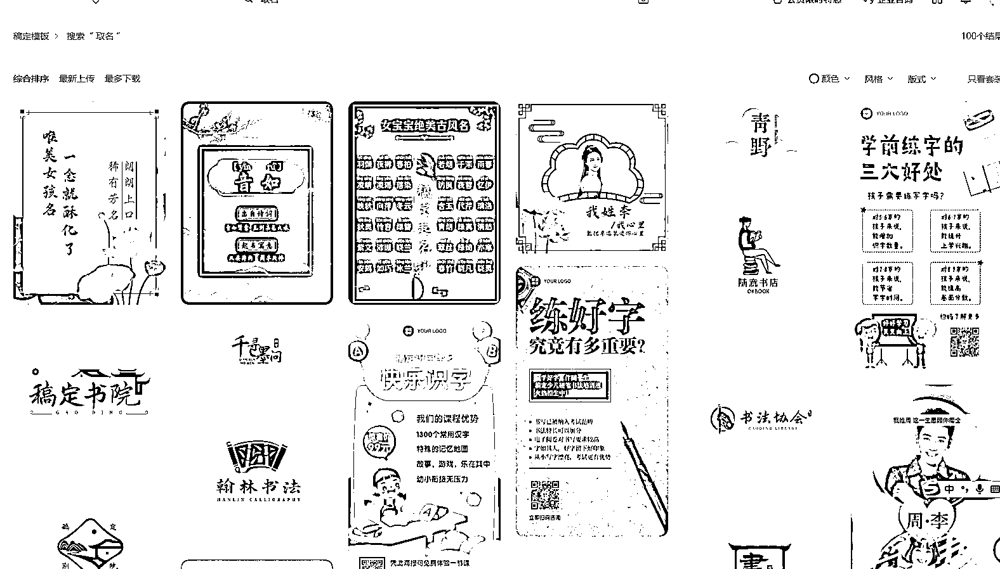
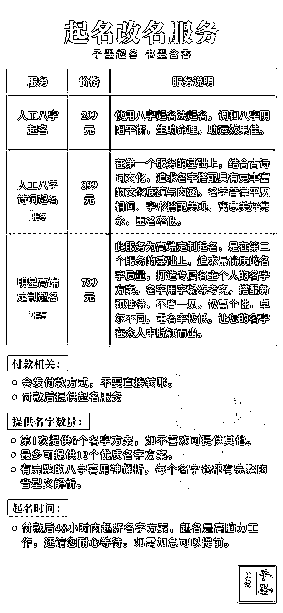
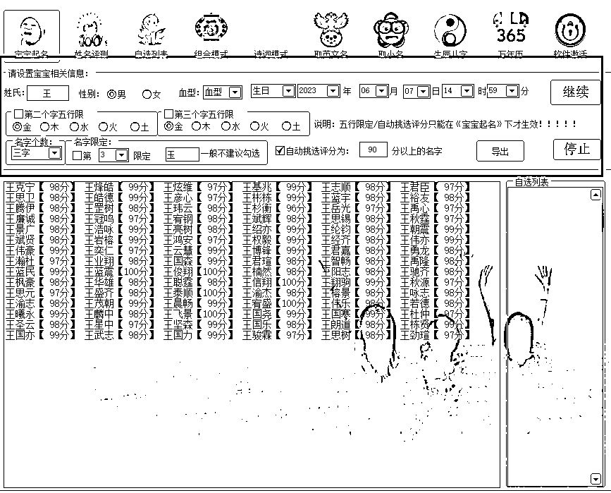

# 小红书宝宝起名虚拟小副业项目玩法分享

> 原文：[`www.yuque.com/for_lazy/thfiu8/gfwkllqwsmcf5047`](https://www.yuque.com/for_lazy/thfiu8/gfwkllqwsmcf5047)

<ne-h2 id="b65b2500" data-lake-id="b65b2500"><ne-heading-ext><ne-heading-anchor></ne-heading-anchor><ne-heading-fold></ne-heading-fold></ne-heading-ext><ne-heading-content><ne-text id="ubf24f589">(59 赞)小红书宝宝起名虚拟小副业项目玩法分享</ne-text></ne-heading-content></ne-h2> <ne-p id="uea1f968d" data-lake-id="uea1f968d"><ne-text id="u824b3718">作者： 黄岛主(虚拟项目)</ne-text></ne-p> <ne-p id="u72440abb" data-lake-id="u72440abb"><ne-text id="u206cb8d4">日期：2023-06-20</ne-text></ne-p> <ne-p id="udf9b8467" data-lake-id="udf9b8467"><ne-text id="ua19752ba" ne-bold="true">大家好，我是黄岛主！</ne-text></ne-p> <ne-p id="u7f21b8c0" data-lake-id="u7f21b8c0"><ne-text id="u0f4d64c9">今天给大家拆解一个在孕妇圈里比较火、高需求，且收益很可观的项目，就是通过发给宝宝取名字的小副业。整体操盘的流程也很简单，就是在小红书上发相关性的笔记并引流到你的私域，然后去给客户定制一个宝宝专属的名字。变现这块，一般单次收费高达 200-500 不等。可以说，跑通之后，基本上整个项目是非常暴力的。</ne-text></ne-p> <ne-p id="u1f35ccde" data-lake-id="u1f35ccde"><ne-text id="u5f57f0bd">那么，我们为什么要去做这个取名项目呢？其实因为这个项目是属于虚拟类型的，而且门槛比较低，通过软件就可以搞定取名，基本上每天花个 10 分钟就可以去做，重点是这个比较符合居家副业。而且对于很多新手宝妈都不知道如何给宝宝取名字，很是困扰，所以需求真的很大。另外引流平台除了小红书以外，我们还可以去抖音、快手伤操作。</ne-text></ne-p> <ne-p id="ua3f5cb1f" data-lake-id="ua3f5cb1f"><ne-text id="uc940825a">其实说真的，在我们 80、90 后小时候，父母起名字都很随意，最多也就是随手翻翻字典或者哪本书里面，看到喜欢的字就直接起名字，但是家长都要考虑很多因素，比如生辰八字、天时地利人和、有寓意，所以很愿意花钱给自己的宝宝取名字，我相信各位圈友有宝宝了之后也是一样，起名这块会很重视哈。</ne-text></ne-p> <ne-p id="u184410b0" data-lake-id="u184410b0"><ne-text id="uccc4147e">本篇文章，我们从五点去讲：</ne-text><ne-text id="u46fe9d95" ne-bold="true">项目介绍、账号注册、作品制作、如何引流、微信包装，下面我具体的拆解给圈友！</ne-text></ne-p> <ne-p id="ufc87b962" data-lake-id="ufc87b962"><ne-text id="ue8ae44b7" ne-bold="true">一、项目介绍</ne-text></ne-p> <ne-p id="ueddb2f2d" data-lake-id="ueddb2f2d"><ne-text id="u9c39d728">一个项目能不能做，首先要看他的市场需求有多大，可以去百度指数，搜索关键字宝宝起名，看一下搜素量有多少，可以看到搜索的人数非常多，非常惊人，有需求就有市场。</ne-text></ne-p> <ne-p id="u29e9ddbe" data-lake-id="u29e9ddbe"><ne-card data-card-name="image" data-card-type="inline" id="NmMCj" data-event-boundary="card"></ne-card></ne-p> <ne-p id="ub33584a0" data-lake-id="ub33584a0"><ne-text id="u289b792d">同时也在淘宝搜索了一下，淘宝的销量从几十到几百，还有很多破千，所以有很多人在做，市场很大。</ne-text></ne-p> <ne-p id="ue524744a" data-lake-id="ue524744a"><ne-card data-card-name="image" data-card-type="inline" id="aOvGu" data-event-boundary="card"></ne-card></ne-p> <ne-p id="u258f26b1" data-lake-id="u258f26b1"><ne-text id="u24c9336b">所以，这个项目不管是以前还是现在，只要流量口子打开了，基本上就可以放大操作！</ne-text></ne-p> <ne-p id="ub6fb9eca" data-lake-id="ub6fb9eca"><ne-text id="ud3772461" ne-bold="true">二、账号注册</ne-text></ne-p> <ne-p id="u139b9334" data-lake-id="u139b9334"><ne-text id="u98fbc617" ne-bold="true">需要先准备小红书账号，这个账号我相信很容易搞到，但是我们要用正确的方式去注册账号，所以注册账号前我建议大家这样做：</ne-text></ne-p> <ne-p id="u3a4b44da" data-lake-id="u3a4b44da"><ne-text id="u4a66d3ae" ne-bold="true">1、统一用新号做：</ne-text><ne-text id="ud79b4ff8">因为从 0-1 会更顺畅，不会有那么多的烦心事。</ne-text></ne-p> <ne-p id="ued0e23b6" data-lake-id="ued0e23b6"><ne-text id="ua8081fd4" ne-bold="true">2、新号需要养完号再去操作：</ne-text><ne-text id="ub866816b">养完号，账号，标签，类目都会比较垂直，而且系统会解除我们为营销号的判定，账号也更容易起来</ne-text></ne-p> <ne-p id="uc6e1e247" data-lake-id="uc6e1e247"><ne-text id="ue2b45d3e" ne-bold="true">3、账号数量：</ne-text><ne-text id="ua774e5f4">建议三个账号，前期可以先用一个账号，做出经验在启动新的账号，不要一开始就大批量上号，因为没复盘之前很容易废号和浪费自己的时间。</ne-text></ne-p> <ne-p id="uc88acd56" data-lake-id="uc88acd56"><ne-text id="ud5f5a3a8" ne-bold="true">手机设备建议：</ne-text></ne-p> <ne-p id="u3d4def69" data-lake-id="u3d4def69"><ne-text id="u77ec2090">一个或多个手机，尽量 2-3 个测试吧。</ne-text></ne-p> <ne-p id="uce364676" data-lake-id="uce364676"><ne-text id="u74d78de2">另外，新手机效果比旧手机好，看手机是二手的，还是新手机，很多人喜欢买人家做过小红书项目的手机，但这样的手机基本上影响后期效果，五六年前的旧手机不建议用，最好最近两三年的手机，因为怕用过的封设备，这个要注意了！</ne-text></ne-p> <ne-p id="u61195e1a" data-lake-id="u61195e1a"><ne-text id="ud5d34719" ne-bold="true">用过小红书的处理方法：</ne-text><ne-text id="u54ac8516">安卓手机恢复出厂设置，苹果手机抹除所有数据，然后卸载 APP 在再去使用。</ne-text></ne-p> <ne-p id="u4841afa6" data-lake-id="u4841afa6"><ne-text id="ua13bb625" ne-bold="true">账号注册环境：</ne-text><ne-text id="ud523cb46">4G/5G 环境下注册，也可以在无线网下注册，别过多注册就行了，最多支持三个账号注册和登录。</ne-text></ne-p> <ne-p id="uda7a12c0" data-lake-id="uda7a12c0"><ne-text id="ufdc961a4" ne-bold="true">一机一卡一号注册：</ne-text><ne-text id="u703303a6">手机、手机号、小红书账号要一一对应，登录的时候做到本机号码登录</ne-text></ne-p> <ne-p id="u2970dad2" data-lake-id="u2970dad2"><ne-text id="u1a12db92" ne-bold="true">1、无线网，</ne-text><ne-text id="u1b4bbc89">如果你是个人在家操作，且操作账号为 3 个以下（以前无大量操作小红书账号），以前的小红书账号在这个无线网也没有违规的情况下（被封禁），我们是可以使用无线网操作的。</ne-text></ne-p> <ne-p id="ucb4bff2e" data-lake-id="ucb4bff2e"><ne-text id="u4af42717" ne-bold="true">2、手机流量，</ne-text><ne-text id="u2088428b">如果无线网下面管理手机较多，而且以前大量用无线网做过小红书项目的。我们的笔记，以及视频发布就需要通过流量来操作，防止我们被限流</ne-text></ne-p> <ne-p id="u65ce88e9" data-lake-id="u65ce88e9"><ne-text id="u14ccc087" ne-bold="true">手机卡注册建议：</ne-text></ne-p> <ne-p id="u1280b8fc" data-lake-id="u1280b8fc"><ne-text id="u9452568d" ne-bold="true">1、</ne-text><ne-text id="ubf075e97">推荐用实名注册的卡，不要用虚拟卡、接码的号、物联卡等。</ne-text></ne-p> <ne-p id="u31081769" data-lake-id="u31081769"><ne-text id="u82a544c0" ne-bold="true">2、</ne-text><ne-text id="u9ae8ea8e">必须是手机号，设备，小红书一定要匹配，一机一卡一号</ne-text></ne-p> <ne-p id="ua8e7845a" data-lake-id="ua8e7845a"><ne-text id="ufeabca06" ne-bold="true">手机卡注册方法：</ne-text></ne-p> <ne-p id="udfeb9309" data-lake-id="udfeb9309"><ne-text id="u3e1ec275">去营业厅直接注册手机卡，可以注册电信、移动、联通，各五张卡，我建议你去注册移动的卡，跟营业厅说注册个副卡，和主卡流量通用。如果是个人操作的话，3 个小红书账号就足够了，后面熟悉了，扩大规模再去加卡加号。</ne-text></ne-p> <ne-p id="u182d951c" data-lake-id="u182d951c"><ne-text id="uddb8c3a7" ne-bold="true">还可以去小红书官网注册流量卡：（步骤：我→右上角三条杠→免流量→选择合适你的注册）</ne-text></ne-p> <ne-p id="uc8646c33" data-lake-id="uc8646c33"><ne-text id="ub50ac7e5" ne-bold="true">流量包的建议：</ne-text><ne-text id="u25695ffe">使用流量操作的，可以开个流量大一点的套餐，这个具体咨询线下的营业厅，我们平时基本上都是刷视频，发视频，这样情况，问问开什么套餐的流量合适。</ne-text></ne-p> <ne-p id="u5858df2e" data-lake-id="u5858df2e"><ne-text id="uab98ec57" ne-bold="true">注册流程：</ne-text><ne-text id="u33464952">手机下载小红书 APP，选择手机号登录，输入手机号获取验证码，勾选已阅读并同意，然后点击登录完善信息，选择女，年龄 26-32，女号方便引流，兴趣爱好可以选择母婴、文化等，如果前期没选，后期在小红书首页右上角我的频道里点击编辑添加。</ne-text></ne-p> <ne-p id="u0d56952a" data-lake-id="u0d56952a"><ne-card data-card-name="image" data-card-type="inline" id="MgWum" data-event-boundary="card"></ne-card></ne-p> <ne-p id="u98f09676" data-lake-id="u98f09676"><ne-text id="uab1ea25a">名字：比如某某起名阁、某某取名等，可以参考同行。</ne-text></ne-p> <ne-p id="u8ee55e70" data-lake-id="u8ee55e70"><ne-card data-card-name="image" data-card-type="inline" id="zjy88" data-event-boundary="card"></ne-card></ne-p> <ne-p id="u1f09edcb" data-lake-id="u1f09edcb"><ne-text id="u4bde23e8">个人资料：直接植入主题，内容参考同行的填写一下，不用艾特小号，如果想引流到私域可以@小号，在小号里面把微信号放进去，引导用户加私域，参考下同行都是怎么放微信号的，是不错的引流方式。</ne-text></ne-p> <ne-p id="u02861397" data-lake-id="u02861397"><ne-card data-card-name="image" data-card-type="inline" id="Mg6Ql" data-event-boundary="card"></ne-card></ne-p> <ne-p id="u58f1ebe6" data-lake-id="u58f1ebe6"><ne-card data-card-name="image" data-card-type="inline" id="HR3l8" data-event-boundary="card"></ne-card></ne-p> <ne-p id="u927e8c90" data-lake-id="u927e8c90"><ne-card data-card-name="image" data-card-type="inline" id="b8nj2" data-event-boundary="card"></ne-card></ne-p> <ne-p id="uf2660539" data-lake-id="uf2660539"><ne-text id="u5a16ab96">主页下方的这个位置出现的四个圆形托，上面带的微信号，其实就是小红书的打卡记录，点击我的头像，点击打卡，设置好打卡名称和里面的文字就可以发布，但是如果直接放咨询、微信这些词会被提示违规，可以试下同音字，或者参考同行是怎么放上去的。</ne-text></ne-p> <ne-p id="ud3a32285" data-lake-id="ud3a32285"><ne-card data-card-name="image" data-card-type="inline" id="JCTT5" data-event-boundary="card"></ne-card></ne-p> <ne-p id="u2f0f6392" data-lake-id="u2f0f6392"><ne-card data-card-name="image" data-card-type="inline" id="UrAlg" data-event-boundary="card"></ne-card></ne-p> <ne-p id="u240106d2" data-lake-id="u240106d2"><ne-text id="u89013d06">注册完账号会让你选感兴趣的内容，母婴一定要选，其他随意，直接下一步就可以了。</ne-text></ne-p> <ne-p id="uce256d2c" data-lake-id="uce256d2c"><ne-text id="u85088115" ne-bold="true">养号方法：</ne-text></ne-p> <ne-p id="ue025245d" data-lake-id="ue025245d"><ne-text id="u24449123">打开之后首页刷一刷，第一天想看啥就看啥，第二天把资料改了，改成 100%，看多长时间没有规定限制，然后接着刷，第三天偶尔看一、两篇文章就行，第四天也一样，第五天发作品，之后改资料，一定要保证活跃度，每天都来刷一刷就可以，其他没有硬性要求。</ne-text></ne-p> <ne-p id="u828b71ec" data-lake-id="u828b71ec"><ne-text id="u62f4725a">给大家找了几个对标的账号，可以去参考一下，这类作品排版非常清晰，看清来很舒服，也是非常简单，不是取名或者是取名啊，比较简单，排版让人看了就特别喜欢。</ne-text></ne-p> <ne-p id="uc79498d3" data-lake-id="uc79498d3"><ne-card data-card-name="image" data-card-type="inline" id="FGMMl" data-event-boundary="card"></ne-card></ne-p> <ne-p id="ue9eb9375" data-lake-id="ue9eb9375"><ne-card data-card-name="image" data-card-type="inline" id="LZGuV" data-event-boundary="card"></ne-card></ne-p> <ne-p id="u821a7b8d" data-lake-id="u821a7b8d"><ne-text id="u4291809d" ne-bold="true">三、作品制作</ne-text></ne-p> <ne-p id="u0b342c30" data-lake-id="u0b342c30"><ne-text id="u14890517" ne-bold="true">第一步、寻找素材</ne-text></ne-p> <ne-p id="ue50d336f" data-lake-id="ue50d336f"><ne-text id="uab3e52c0">打开小红书，输入取名，搜索一下，有很多用户名称可以参考，点击全部，综合，找到点赞量比较高的，比如这个图片很好看，点开看一下主页，整体的风格也很好看，如果我们想用它的图片也是可以的，喜欢哪一种风格去保存，或者点个赞方便后期找。</ne-text></ne-p> <ne-p id="u4167de62" data-lake-id="u4167de62"><ne-card data-card-name="image" data-card-type="inline" id="xHdxT" data-event-boundary="card"></ne-card></ne-p> <ne-p id="ubbabb230" data-lake-id="ubbabb230"><ne-text id="u9beaec76">像这种底图其实就是配色，在小红书搜索高级配色，有很多类似的图片，都可以拿来直接放入名字，图片直接保存右下角都会有作者水印，可以点击右上角箭头，复制链接，复制完链接之后，去打开微信搜索轻抖小程序，点击进入，直接点击第一个去水印，可以去除快手、西瓜、抖音、小红书、头条等水印，点击粘贴，点击一键去水印，点击全选保存到相册，点击去观看，观看完广告之后就可以直接点击保存到相册。</ne-text></ne-p> <ne-p id="u54716e3a" data-lake-id="u54716e3a"><ne-card data-card-name="image" data-card-type="inline" id="XNjrx" data-event-boundary="card"></ne-card></ne-p> <ne-p id="u98048418" data-lake-id="u98048418"><ne-text id="u47d241b1" ne-bold="true">第二步、制作图片</ne-text></ne-p> <ne-p id="u66592b1e" data-lake-id="u66592b1e"><ne-text id="ue431bb0e">第一种、打开美图秀秀，点击图片美化，导入需要用的图片，点击进入图片美化往右滑，找到消除笔，直接给它涂抹掉，涂差不多就可以，涂完之后点击勾号，把这张图片保存一下。</ne-text></ne-p> <ne-p id="u910bb02b" data-lake-id="u910bb02b"><ne-card data-card-name="image" data-card-type="inline" id="tZtR7" data-event-boundary="card"></ne-card></ne-p> <ne-p id="ub7b89345" data-lake-id="ub7b89345"><ne-text id="u4f52059e">在美图秀秀打开保存的图片，在上面输入文字，点击文字，输入文字，文案可以参考同行，比如输入颜可，调大一点，把文字颜色、样式调一下，喜欢哪个就调哪个，个人觉得书法类字体会相对好看一些，然后调到合适的位置，把文字复制一个出来继续输入文字的解释，下面再输入另外一个名字和解释。</ne-text></ne-p> <ne-p id="u20252e6d" data-lake-id="u20252e6d"><ne-card data-card-name="image" data-card-type="inline" id="pejtX" data-event-boundary="card"></ne-card></ne-p> <ne-p id="u10a2eddf" data-lake-id="u10a2eddf"><ne-text id="u690993cd">文案内容参照同行去写，或者去百度上面搜索一下，把文字调整到合适的位置就可以了，可以先把文档整理到文本里，方便直接输入，调整到合适的大小，如果想给它带上拼音也是可以的，拼音也可以输进去，直接在名字的上面添加拼音就可以了。</ne-text></ne-p> <ne-p id="ucd6260bd" data-lake-id="ucd6260bd"><ne-text id="u281e93eb">也可以在上面加入自己的水印，再直接添加文字，比如黄岛主取名，调节字体，给它放到合适的位置，如果想给字加上拼音的话也可以调，点击修改文案，在对应需要加上音标的拼音位置，直接点击符号，往右划找到拼音，选择对的声调即可，打勾号保存图片就发布就可以了。</ne-text></ne-p> <ne-p id="u85946afa" data-lake-id="u85946afa"><ne-card data-card-name="image" data-card-type="inline" id="hV7D4" data-event-boundary="card"></ne-card></ne-p> <ne-p id="u75754a7b" data-lake-id="u75754a7b"><ne-text id="ub8793e8f">第二种、稿定设计、创客贴软件都可以用，但是很多模板要收费，各方面会比较好一点，比如取名模板就挺好看的，中国红特别符合国人的习惯直接可以在它的模板上改字。</ne-text></ne-p> <ne-p id="ud4483e9f" data-lake-id="ud4483e9f"><ne-card data-card-name="image" data-card-type="inline" id="eGguZ" data-event-boundary="card"></ne-card></ne-p> <ne-p id="ubf7b0c73" data-lake-id="ubf7b0c73"><ne-text id="u466c5528" ne-bold="true">第三步、发布图文</ne-text></ne-p> <ne-p id="u789c49de" data-lake-id="u789c49de"><ne-text id="ub6bfa4c3">不需要发很多，一天发一到两条就可以，笔记入口有两个，第一个是直接点加号去发布，像这个新人是有福利的，前面几篇笔记发送成功之后会享受免费的凌波流量，是系统推送的，或者是直接点开创作者中心，然后找到笔记灵感，找到跟宝宝取名相关的，在这里发送接送流量券，类似于免费投抖加，主打的流量其实还是女生，因为小红书本身就是以女性为主的，而且消费能力会比较强一些。</ne-text></ne-p> <ne-p id="u3891fecf" data-lake-id="u3891fecf"><ne-card data-card-name="image" data-card-type="inline" id="ADfx9" data-event-boundary="card"></ne-card></ne-p> <ne-p id="u7edfbd8d" data-lake-id="u7edfbd8d"><ne-text id="ue292a18c" ne-bold="true">第四个、如何引流</ne-text></ne-p> <ne-p id="ub04e90e6" data-lake-id="ub04e90e6"><ne-text id="u78ae88af">引流有好几种方式，比如大号@小号、个人简介@小助手，或者群聊引流，这个项目只用到评论区引流。</ne-text></ne-p> <ne-p id="u619027bb" data-lake-id="u619027bb"><ne-text id="u5a8a8a9c" ne-bold="true">1、置顶评论</ne-text></ne-p> <ne-p id="uf507a1d5" data-lake-id="uf507a1d5"><ne-text id="ua8750220">比如宝宝预产期、姓氏、性别，我来取名置顶一下就可以了，有人问了就就直接在底下评论就可以，定制取名可以直接咨询老师，作者回复特别用心的，针对每个人回复不一样，可见作者文化底蕴比较高，项目比较适合文科生去操作，比较有优势，如果不会的也可以去百度搜一下，有很多。</ne-text></ne-p> <ne-p id="ub3c39435" data-lake-id="ub3c39435"><ne-card data-card-name="image" data-card-type="inline" id="nj95z" data-event-boundary="card"></ne-card></ne-p> <ne-p id="u27d0cff9" data-lake-id="u27d0cff9"><ne-text id="ud09a476e" ne-bold="true">2、小号在评论区带节奏</ne-text></ne-p> <ne-p id="uee93f988" data-lake-id="uee93f988"><ne-text id="u2afaed9a">比如说有个人问老师有没有这一类的名字，然后你进行回复，或者是老师起的名字真好听之类的话，这钱花得值，感恩回馈之类的话，大号可以回复小号不客气，有人私聊加你，然后你回复感谢认可，但是由于平台限制，所以加老师请移步加微信，就可以了。</ne-text></ne-p> <ne-p id="uc7660e61" data-lake-id="uc7660e61"><ne-text id="uc0e30fc5" ne-bold="true">五、微信包装</ne-text></ne-p> <ne-p id="uec9a3590" data-lake-id="uec9a3590"><ne-text id="u71522182" ne-bold="true">1、微信包装：头像、名字、个性签名</ne-text></ne-p> <ne-p id="u6ed62c3d" data-lake-id="u6ed62c3d"><ne-text id="u2bc47e3a" ne-bold="true">头像：</ne-text><ne-text id="u91869668">可以选择老师傅，给人一种特别信任的感觉，名字的话直接写宝宝起名馆、宝宝取名馆等。</ne-text></ne-p> <ne-p id="u7fa38abf" data-lake-id="u7fa38abf"><ne-text id="u04b60106" ne-bold="true">个性签名：</ne-text><ne-text id="u1ea1aa37">体现自己的专业，比如专注取名 20 年，20 年都在取名老师傅肯定值得信赖，朋友圈可以参考一下同行的，可以在小红书上搜素，加到很多同行。</ne-text></ne-p> <ne-p id="u01966e84" data-lake-id="u01966e84"><ne-card data-card-name="image" data-card-type="inline" id="T5Qrz" data-event-boundary="card"></ne-card></ne-p> <ne-p id="u758d4149" data-lake-id="u758d4149"><ne-card data-card-name="image" data-card-type="inline" id="vw6rg" data-event-boundary="card"></ne-card></ne-p> <ne-p id="u83ac64c2" data-lake-id="u83ac64c2"><ne-text id="ucd0a0326" ne-bold="true">2、如何变现</ne-text></ne-p> <ne-p id="ueb169937" data-lake-id="ueb169937"><ne-text id="ud091e335">根据同行的方案去设置一下金额，有几种方案，价位不同，在给出方案之前给出一个贴心的建议，建议宝宝出生之后再给孩子取名，因为要看八字，体现出非常专业的一面。</ne-text></ne-p> <ne-p id="u5e0231be" data-lake-id="u5e0231be"><ne-card data-card-name="image" data-card-type="inline" id="kZIVH" data-event-boundary="card"></ne-card></ne-p> <ne-p id="ue975125e" data-lake-id="ue975125e"><ne-card data-card-name="image" data-card-type="inline" id="Z6xjz" data-event-boundary="card"></ne-card></ne-p> <ne-p id="uc18d7b04" data-lake-id="uc18d7b04"><ne-text id="u29e6fc1c">顾客付款了之后不要担心，直接打开我给你们的软件，免费给大家，不用担心这里比如说姓氏啊，比如姓氏王、男孩、血型 O，写上生日，金木水火土，90 分以上，点击生成一下，就会自动生成评分标准，非常简单，傻瓜式的操作，可以随时暂停。</ne-text></ne-p> <ne-p id="u1c7c6669" data-lake-id="u1c7c6669"><ne-card data-card-name="image" data-card-type="inline" id="AiQAc" data-event-boundary="card"></ne-card></ne-p> <ne-p id="u813a2a05" data-lake-id="u813a2a05"><ne-text id="u70b25923" ne-bold="true">这个软件网上有下载的，如果找不到，也可以找我要，我分享给你，因为我也是网上找的！</ne-text></ne-p> <ne-p id="u49efbdfe" data-lake-id="u49efbdfe"><ne-text id="ucde21eca" ne-bold="true">3、家长引流到私域可以进行二次变现比如婴儿用品</ne-text></ne-p> <ne-p id="u1f9fd480" data-lake-id="u1f9fd480"><ne-text id="ua4770b56">再想的长远一点，小学资料等等，其实任何的项目都要看执行力，没有执行力，再好的项目都是白搭，所以希望大家认准一个项目，就坚持干一段时间，不要干几天没收入就放弃，白白浪费时间和精力。</ne-text></ne-p> <ne-p id="uae481903" data-lake-id="uae481903"><ne-text id="u503fa19d" ne-bold="true">写在最后：</ne-text></ne-p> <ne-p id="uf78fb0e1" data-lake-id="uf78fb0e1"><ne-text id="u849c2b93">好了，写这么多，如果你对我拆解的宝宝起名副业项目比较感兴趣，可以去实际操作下这个项目，因为现在外面有培训这个项目都要大几千，也别让人家去割你韭菜，你看完我拆解的基本上可以去测试了，如果你有问题在找我交流哈！</ne-text></ne-p> <ne-hole id="ua84c108d" data-lake-id="ua84c108d"><ne-card data-card-name="hr" data-card-type="block" id="mg1vc" data-event-boundary="card"><ne-p id="u38063999" data-lake-id="u38063999"><ne-text id="u4667dea0">评论区：</ne-text></ne-p> <ne-p id="u981a0c23" data-lake-id="u981a0c23"><ne-text id="ucf013e10">。？！， : 求网站</ne-text> <ne-text id="ua5fae978">黄岛主(虚拟项目) : 软件是吗</ne-text> <ne-text id="u470e3336">王小炜 : 求起名软件</ne-text> <ne-text id="uabf9667b">方小宝🎏 : [偷笑]</ne-text> <ne-text id="u354c445d">黄岛主(虚拟项目) : 看我签名</ne-text></ne-p></ne-card></ne-hole>