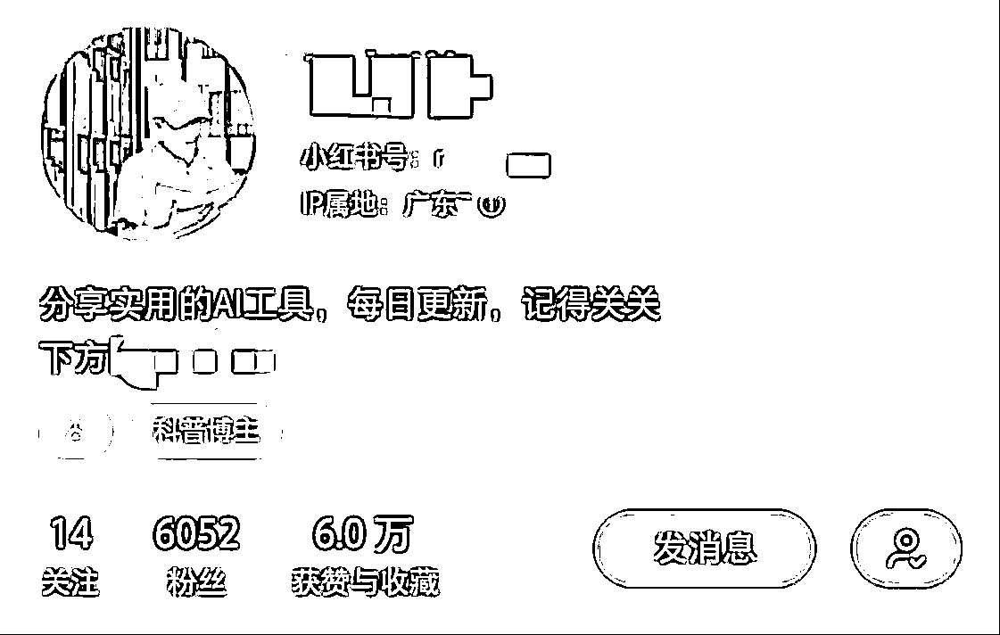
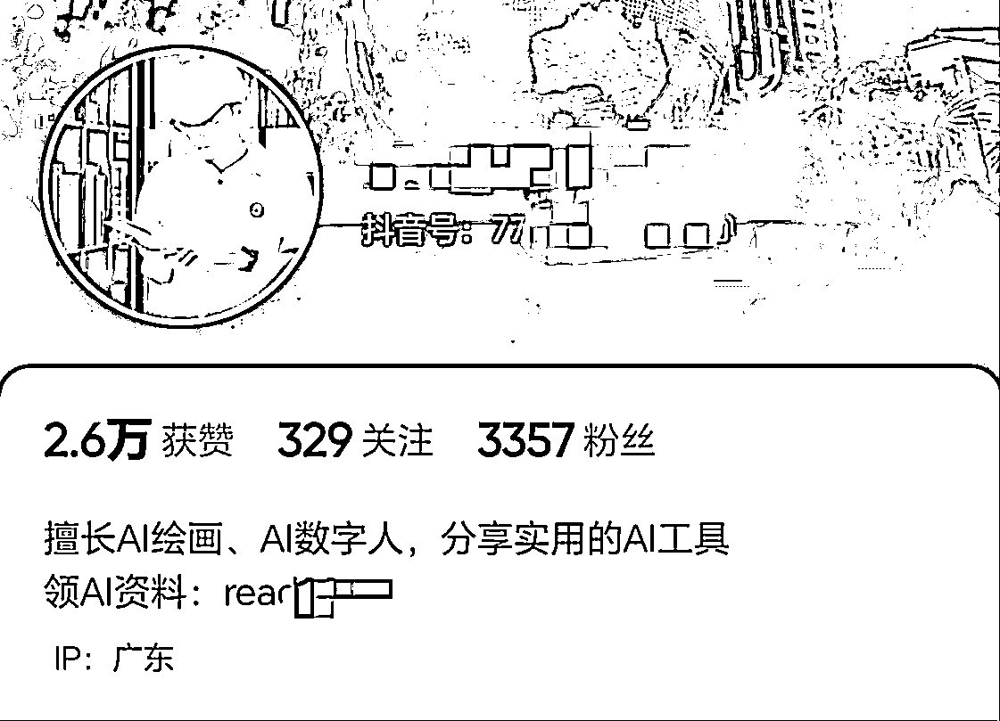
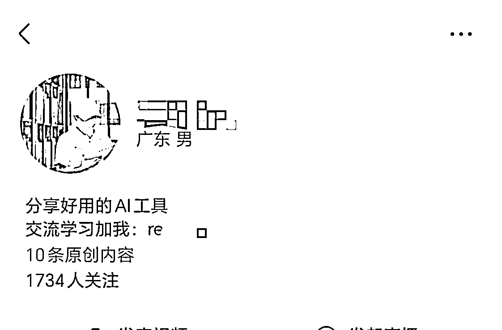
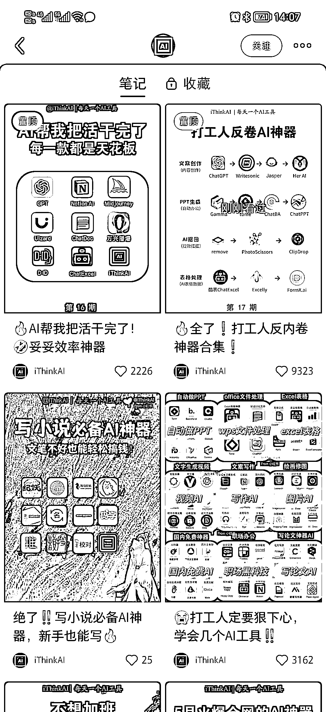
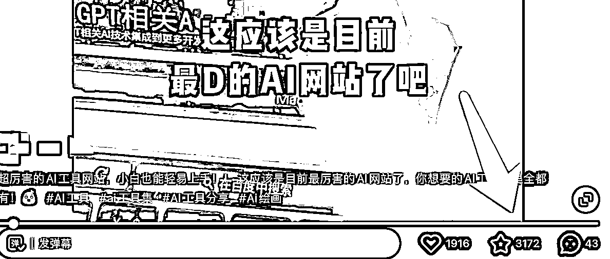
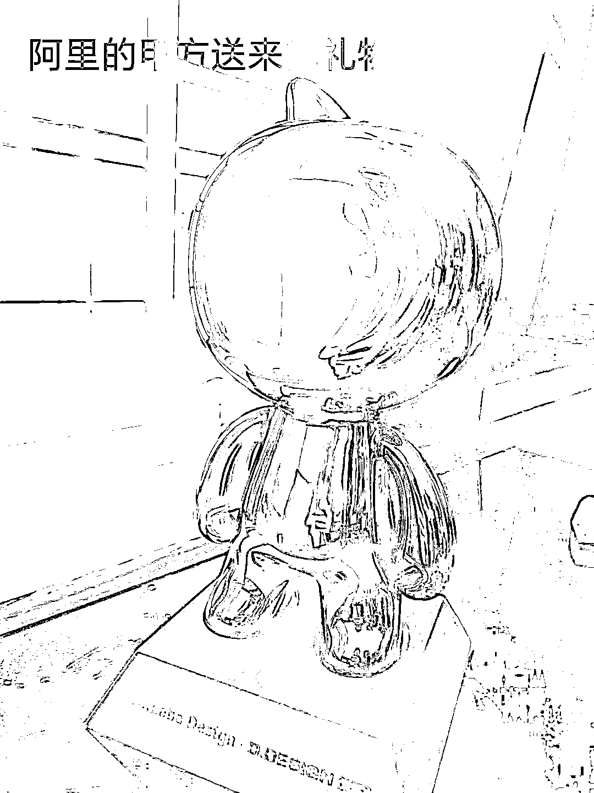

# 小红书带货两次半途而废，却意外靠 AI 热度涨粉 1W+，引流 1000+，变现 3000+的经验复盘

> 原文：[`www.yuque.com/for_lazy/thfiu8/gyu3o21qtggx0u36`](https://www.yuque.com/for_lazy/thfiu8/gyu3o21qtggx0u36)

## (41 赞)小红书带货两次半途而废，却意外靠 AI 热度涨粉 1W+，引流 1000+，变现 3000+的经验复盘 

作者： 亚超 

日期：2023-06-19 

大家好，我是亚超，一个从互联网公司裸辞三个月的产品经理。 

今天想来分享一下我做小红书两个多月以来的收获和复盘。 <ne-h3 id="430f1c8f" data-lake-id="430f1c8f">一、小红书店铺的两次“半途而废”</ne-h3> 

首先，我自己真的非常惭愧，在 3 月初的时候，我就在生财里面看到了小红书电商项目，当时做的人还不算多，小航海还没开始，所以也不算卷，算是比大多数人抢跑了半步。 

但结果是，我一单都没出，没看到反馈就草草放弃了。 

失败的原因可以总结成两点吧： 

1、当时我用的是一个 1000 多粉丝的老号，换过三次不同的定位，又直接转型做了饰品，导致发布的笔记浏览量很低，一半以上都在两位数徘徊；当然也可能是我的内容做得不好，我的笔记全都是搬运拼多多商品的买家秀，没有过多地进行美化处理。发了将近百条笔记都没有什么反馈，自信心受到了一点点打击。 

2、做小红书项目的时候，我还在同时尝试其他项目，所以其实对小红书没有太上心，没有认真选品，认真调研对标，也没有认真发笔记，没有付出肯定不会有回报的，失败就是理所当然的。 

一个月以后，小红书店铺的热度越来越高，开始有了很多培训课程、训练营等等，包括生财的小红书航海，于是我就第一时间报名了，并且拉上女朋友，想要一起做，毕竟她每天都刷小红书，网感要比我好得多。我花了 1200 元认证好了两个店铺专业号，认真看完了实战手册，选好了两个品类，还买回来了几个样品，打算实拍发笔记。 

万事俱备，只欠东风了！ 

结果。。。 

因为女朋友的工作原因，我们搬来了广州，收拾东西搬家等等折腾了很久，两个人的心思又没有放在小红书店铺这边，就这样不了了之，没有真正的去行动... 

事实证明，想要做好一个项目，光靠外部的驱动是远远不够的，即使有教练带队，即使有志愿者督促打卡，如果自己没有上心，没有“赚钱”的动力，是不可能获得结果的。 <ne-h3 id="c5fe61c3" data-lake-id="c5fe61c3">二、AI 账号的三个偶然</ne-h3> 

不过，大概在三个月以前，chatGPT 和 AI 绘画的热度非常高，我也第一时间跟了进来，想要寻找可以做的领域，没想到无意间做了一个分享 AI 工具的账号，两个月涨粉 1W+，而且小红书/抖音/视频号三个平台都做了起来。 

 

截止到现在已经完成了 6 个广告合作，还有 2 个正在推进中，尝试引流私域，目前新增好友 1000+，总变现大概 3000 多（广告费和课程分销） 

这个账号能做起来，其实纯属偶然，完全在我的意料之外。 

1、偶然刷到一个分享 AI 工具的视频 

不知道大家有没有刷到过下面这种形式的视频，内容很简单，就是分享自己用过的 AI 工具，因为观众都有猎奇和收集的心理，这类工具分享的账号非常容易吸引点赞和收藏，尤其是在小红书这样的平台。 

 

我这个人有一点小优势就是：执行力虽然不够强，但会特别快。看到了就会立马去行动，别人能做，我为什么不能？ 

于是我直接拿出手机，对着电脑屏幕拍了一段介绍 AI 网站的视频，然后用了 10 分钟就剪辑好并发布了。 

没想到是，第一条视频就看到了正反馈，抖音 7.8W 播放，2000 多点赞，小红书 2.2W 播放，3000 多收藏，一下子就把账号权重给激活了，后来的每条视频数据都不错，一直持续到现在。 

（我用的是老号，以前发过视频，所以没有考虑用不用养号的问题） 

 

2、偶然做起了私域，搭建资料库进行引流 

第一条视频小爆之后，评论区就有很多人找我要网站的链接（虽然我已经把链接打在了屏幕上，但他们并不会看...） 

于是我就顺理成章地把微信号私信发给了他们，期间测试过很多种留微信号的方式，都不太安全，为了保险起见，最后我改为了引导到公众号，再由公众号承接微信好友，虽然转化率会受到影响，但是安全第一，不敢跑得太野，顺便还能给公众号涨涨粉，一举两得~ 

 

至于靠什么来吸引用户加你好友呢？很简单的三个字：送资料。 

我整理了一份 AI 工具箱文档，里面有热门的 AI 网站链接，还有 chatGPT 和 AI 绘画的教程。 

不到 2 个月的时间，引来了将近 1000 个微信好友： 

 

3、偶然接到了第一条广告 

说实话，当初做这个账号就是想随便试试的，接广告、卖课程什么的都没想过，但是账号有流量了以后，各种合作都主动找了过来。 

有很多工具软件，都会有投放推广的需求，比如闪剪、来画等，我还合作过百度的剪辑 app 推广、阿里旗下的软件推广。 

现在基本每周都能接到合作，有的是固定推广费，有的则是按视频点赞量结算，平均单条广告收益 200~500 不等，小红书和抖音都能接到，还是挺香的。 

而且接这类的广告，粉丝不会有任何的埋怨和反感，对观众来说，又得到了一个好用的软件，对我来说，即使是广告视频，流量也不会差，完全不会影响到账号体验。 

 

 <ne-h3 id="560a4a3b" data-lake-id="560a4a3b">三、个人想法</ne-h3> 

1、市面上可以赚钱的项目有很多，虽然小红书店铺带货很火，但它不一定适合每个人，找到自己最擅长的，最容易做好的生态位更重要。不要随意跟风，什么项目火就做什么，那样只会徒增焦虑。 

2、虽然小红书店铺没有做起来，但意外地踩中了 AI 的小风口，喝到了一点点汤，还是比较知足的，接下来还会继续顺着账号的热度，持续地做下去，慢慢往真人出镜，强化个人 IP 的方向去做。另外，除了接广告以外，也会开始尝试知识付费，把现有的私域好友盘活起来。 

3、我不是被裁员的，而是主动跳出职场。虽然这三个月赚到的钱远不如上班时的工资，但我从没后悔过。这段时间我尝试过很多项目，也花了挺多时间和金钱用来试错，现在慢慢找到感觉了，那些错误的路都不会白走。 

虽然失败过很多次，但我不担心，我相信我能做成功的，成功一次就够了！ 

评论区： 

亦仁 : 都有哪些软件来投广告呢？效果怎么样？ 亚超 : 基本都是 AI 工具或者剪辑软件，比如百度旗下的“度咔剪辑”、阿里旗下的“堆友”，还是数字人软件“来画”，小程序“配音鹅”等等。 

效果还是挺不错的，视频播放量也很稳定，毕竟这些甲方只是为了增加曝光量，不需要考虑付费转化率。 

我小红书 5000 粉丝的时候发了一条广告，目前点赞 5000+，收藏量 6000+，效果很好