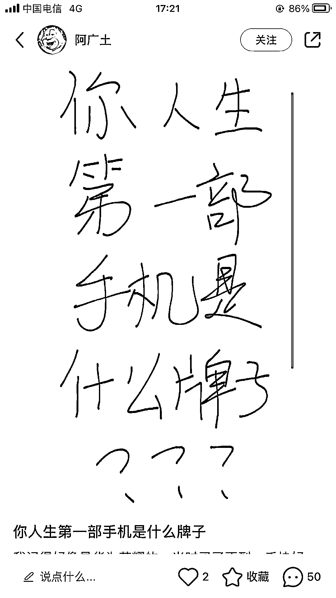
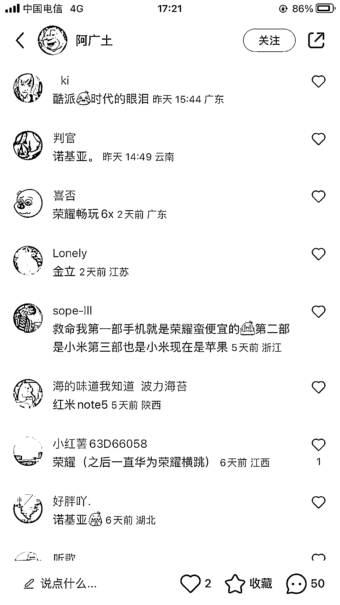
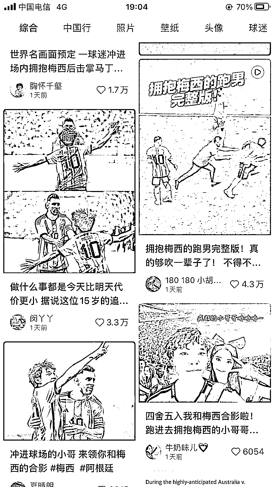

# 小红书流量低的原因和解决办法

> 原文：[`www.yuque.com/for_lazy/thfiu8/rliyphl0esiy5o5m`](https://www.yuque.com/for_lazy/thfiu8/rliyphl0esiy5o5m)

<ne-h2 id="17dd868d" data-lake-id="17dd868d"><ne-heading-ext><ne-heading-anchor></ne-heading-anchor><ne-heading-fold></ne-heading-fold></ne-heading-ext><ne-heading-content><ne-text id="uf39a750a">(35 赞)小红书流量低的原因和解决办法</ne-text></ne-heading-content></ne-h2> <ne-p id="u45a17884" data-lake-id="u45a17884"><ne-text id="uc527d295">作者： 艾小飞</ne-text></ne-p> <ne-p id="ue48d70fd" data-lake-id="ue48d70fd"><ne-text id="u0a0a16dc">日期：2023-06-19</ne-text></ne-p> <ne-p id="ue203dc50" data-lake-id="ue203dc50"><ne-text id="u5c9f815c">【小红书流量低的原因和解决办法】</ne-text></ne-p> <ne-p id="u06f19d37" data-lake-id="u06f19d37"><ne-text id="u120899f3">前两天通过各位粉丝朋友的建议，让我写一篇关于【小红书流量低迷的原因和解决办法】，那么今天呢，就给大家来聊聊，我对这其中的解读和看法。这篇会比较口水化，阅读起来不会那么的乏味</ne-text></ne-p> <ne-p id="u1f4b921f" data-lake-id="u1f4b921f"><ne-text id="u3f42973c">不浪费时间，我直接进入正题吧。</ne-text></ne-p> <ne-p id="uebd14c75" data-lake-id="uebd14c75"><ne-text id="u33db3e93">当你们发小红书的时候，笔记小眼睛都没超过 100 以上的！如果像这种情况，肯定是出现问题了</ne-text></ne-p> <ne-p id="u6fdacf19" data-lake-id="u6fdacf19"><ne-text id="u47cad06f">但流量低并不是因为一个原因导致的，它有可能是多种原因慢慢形成的</ne-text></ne-p> <ne-p id="u26b5c8fe" data-lake-id="u26b5c8fe"><ne-text id="u45e7f37c">那么今天我就来一个一个的给你们做排除法。并找出其中的解决办法</ne-text></ne-p> <ne-p id="u5c193226" data-lake-id="u5c193226"><ne-text id="u110f07e5">首先第一点，先用小技巧去测试你的账号，到底有没有被限流。这个是比较重要的</ne-text></ne-p> <ne-p id="u58e41ee9" data-lake-id="u58e41ee9"><ne-text id="u2ab3fb7c">如果被限流了，你发在优质的内容，都没什么用的，对症下药才是最好的解决办法</ne-text></ne-p> <ne-p id="u9c2a7961" data-lake-id="u9c2a7961"><ne-text id="ua25d7ba8">这个测试的方法很简单，就是用一些流量很大的话题，来测试你的账号有没有问题</ne-text></ne-p> <ne-p id="ue349b54a" data-lake-id="ue349b54a"><ne-text id="u100f5d65">比如你们看下方的图 1 到图 6，如果你刷到了这些图，是不是都想点进来看看</ne-text></ne-p> <ne-p id="ue067333d" data-lake-id="ue067333d"><ne-text id="u39ebe371">或者可以跟上热点话题，比如近期爆火的石油姐连衣裙 （图 7）</ne-text></ne-p> <ne-p id="u5af2b584" data-lake-id="u5af2b584"><ne-text id="u350621c6">或者是梅西的话题，利用流量密码来测试自己的账号数据（图 8）</ne-text></ne-p> <ne-p id="uc1ed831d" data-lake-id="uc1ed831d"><ne-text id="ubba3fc68">如果你发布这些话题的笔记，连续三天笔记流量超过了 500，那么说明你的账号是健康的。</ne-text></ne-p> <ne-p id="ue224ffc3" data-lake-id="ue224ffc3"><ne-text id="u841254ee">如果笔记都低于 100 以下，甚至是 0 的，那就是你的账号问题了</ne-text></ne-p> <ne-p id="ufbfa8f84" data-lake-id="ufbfa8f84"><ne-text id="uf14db629">如果是账号的问题，那该怎么办呢？</ne-text></ne-p> <ne-p id="uf3c0cb66" data-lake-id="uf3c0cb66"><ne-text id="u4ebe67ba">我们再来一步步的用排查法</ne-text></ne-p> <ne-p id="u05e70578" data-lake-id="u05e70578"><ne-text id="u221a9bae">如果你的这个账号是一个纯新号，也就是刚刚注册不到三天的账号，流量低于 100 以下，那么这是正常的范围内，新号刚开始权重都不高的</ne-text></ne-p> <ne-p id="u4b7264e2" data-lake-id="u4b7264e2"><ne-text id="u38bcc622">如果你的账号注册了 15 天以上，发布的流量依旧是没超过 100 的话。那你就自我检查一下，在同一个 WiFi 下，有没有批量的注册账号，批量的频繁发布笔记，</ne-text></ne-p> <ne-p id="uc06a53fb" data-lake-id="uc06a53fb"><ne-text id="u4c2a7880">如果是这样的话，平台有可能会把你的这个 IP 标记为营销号，所有登陆在同一个 ip 下的账号，随机性的限流个别账号</ne-text></ne-p> <ne-p id="uf3f4b1bf" data-lake-id="uf3f4b1bf"><ne-text id="u609d5390">那该怎么办呢？</ne-text></ne-p> <ne-p id="u61a50bfb" data-lake-id="u61a50bfb"><ne-text id="u71e46da3">最好的办法是不要在同一个 WiFi 下，去登陆这么多的账号，同时你要日常养号三天左右</ne-text></ne-p> <ne-p id="ub34fa2e1" data-lake-id="ub34fa2e1"><ne-text id="uec970541">说到养号，我也简单的给你做个科普吧</ne-text></ne-p> <ne-p id="u462a9548" data-lake-id="u462a9548"><ne-text id="u183d0642">养号的目的，是为了提高账号活跃度，从而拉高账号权重</ne-text></ne-p> <ne-p id="u53bf68c5" data-lake-id="u53bf68c5"><ne-text id="ue310015f">怎么活跃呢？</ne-text></ne-p> <ne-p id="u8cbef3e4" data-lake-id="u8cbef3e4"><ne-text id="uc51221a9">你就像是一个正常的人，去浏览小红书的首页，正常的搜索你想看的东西。然后去评论就可以啦，遇到喜欢的就点赞。遇到干货的就收藏。认为这个博主很有潜力的就关注。</ne-text></ne-p> <ne-p id="ud6663b26" data-lake-id="ud6663b26"><ne-text id="u9d2130e8">如果他发的内容能引起你的共鸣，该评论就评论，这没什么难的</ne-text></ne-p> <ne-p id="u0f68cbdc" data-lake-id="u0f68cbdc"><ne-text id="ubc61315a">ps：你刷的内容跟你创作的内容，是毫无关系的，所以随便刷什么都行，别太在意这个问题</ne-text></ne-p> <ne-p id="u0fa82610" data-lake-id="u0fa82610"><ne-text id="u4e31f309">我们回到刚刚的话题，如果你的账号发布流量大的话题，小眼睛都突破了 500。但你发卖货的笔记，浏览量就从没超过 100 以上的，那么大概率就是你的内容问题了</ne-text></ne-p> <ne-p id="u42a7ad77" data-lake-id="u42a7ad77"><ne-text id="u12b9b7c8">那内容问题有什么方法解决呢？</ne-text></ne-p> <ne-p id="u42e63fea" data-lake-id="u42e63fea"><ne-text id="uf287538e">最简单的办法，就是站在用户的角度去思考</ne-text></ne-p> <ne-p id="uf8e56129" data-lake-id="uf8e56129"><ne-text id="ucb4ed998">如果你是用户，看到你发的这篇笔记，你会有什么样的想法？会不会点击进去看，会不会去评论？会不会有下单的想法？</ne-text></ne-p> <ne-p id="u9da5a7fd" data-lake-id="u9da5a7fd"><ne-text id="u3039d748">如果你换位思考去创作的话，那么你的流量大概率是没问题的</ne-text></ne-p> <ne-p id="ubc9684ca" data-lake-id="ubc9684ca"><ne-text id="u0e536b09">那内容的创作方面都包括了哪些呢？</ne-text></ne-p> <ne-p id="ue63e2180" data-lake-id="ue63e2180"><ne-text id="u7a631266">这里面包括了你的选题方向他们是否感兴趣，封面是否能吸引到用户的注意力，同时标题能否引起他们的共鸣。还有你文中的文案，能不能勾起用户下单的欲望，等等这些。</ne-text></ne-p> <ne-p id="ufc2ef677" data-lake-id="ufc2ef677"><ne-text id="u8c906d7c">如果你不懂如何去创作内容的话，最简单的办法，就是去看同行都是怎么发的？</ne-text></ne-p> <ne-p id="u65e18ea8" data-lake-id="u65e18ea8"><ne-text id="ua90717cc">如果你是用户，你看到同行都这么发，看看你有没有想下单的欲望？如果有，那就模仿他的选题方向，模仿他的封面排版，模仿他的标题格式，模仿他的文案思路，就是这么简单。</ne-text></ne-p> <ne-p id="u204ff16f" data-lake-id="u204ff16f"><ne-text id="u89e30703">但切记：千万别搬运人家的作品！</ne-text></ne-p> <ne-p id="u024b6888" data-lake-id="u024b6888"><ne-text id="uda520708">可能有些同学会问了，我的笔记流量都破 500 了，账号是没问题的，但想要更多的流量，该怎么办？</ne-text></ne-p> <ne-p id="uc3695ce8" data-lake-id="uc3695ce8"><ne-text id="ubbc24d2a">那就从你的内容开始下手了</ne-text></ne-p> <ne-p id="ubfa56391" data-lake-id="ubfa56391"><ne-text id="u581df68a">刚刚讲的内容，包括了封面，标题，文案和你的选题方向，如果这里面有其中的一样，用户都不感兴趣，那么你的笔记流量就很难做起来。</ne-text></ne-p> <ne-p id="u87fe9054" data-lake-id="u87fe9054"><ne-text id="u2073ac63">怎么做呢？我也简单的教你一个办法吧，就是你创作内容的时候，一定不能自嗨，是什么是自嗨，相信你也懂吧</ne-text></ne-p> <ne-p id="u4f428455" data-lake-id="u4f428455"><ne-text id="u5bf908f3">就是不要认为自己创作的内容是最完美的，一定要站在用户的角度去思考，这个作品你自己创作出来的东西，你自己喜不喜欢</ne-text></ne-p> <ne-p id="ubaadb444" data-lake-id="ubaadb444"><ne-text id="u37ddf6bb">就比如说封面吧。为什么有些博主的封面，让你忍不住都想点击进去看？只要你点击进去看了，那他就成功了一半。</ne-text></ne-p> <ne-p id="u0ef80770" data-lake-id="u0ef80770"><ne-text id="u013cf9bd">如果这个时候他点击进去看，发现你的内容还挺适合他的，他也很喜欢，那么这个时候他就会进行做一下互动动作，比如点赞，收藏，关注，评论等这些。</ne-text></ne-p> <ne-p id="u28787c46" data-lake-id="u28787c46"><ne-text id="udac13999">因为平台它是没办法判别你的内容到底好不好的，它只能通过用户的动作反馈去做系统的评比</ne-text></ne-p> <ne-p id="u165d3910" data-lake-id="u165d3910"><ne-text id="u99e0f3cc">如果平台它接收到很多互动数据的反馈，平台就会认为你的内容是优质的，得到了用户的喜欢，平台就会给你更多的流量。从而给你推向更大的流量池里面去持续曝光</ne-text></ne-p> <ne-p id="ud0fbd819" data-lake-id="ud0fbd819"><ne-text id="ub3d0d518">这就是为什么笔记刚发的时候，笔记流量都是很低迷的。在偶然的两三天之后，流量就非常猛的往上涨。</ne-text></ne-p> <ne-p id="ub51d4c2b" data-lake-id="ub51d4c2b"><ne-text id="u7effed4a">这就是平台通过用户的互动数据反馈。认为你这一篇笔记是优质的，给你推给更多的人去看，但这过程需要一点点时间去推进</ne-text></ne-p> <ne-p id="ufacdbcc4" data-lake-id="ufacdbcc4"><ne-text id="u868b9d81">总结就是，如果你的流量想要突破更多，那么就要先从你的内容上再去优化。</ne-text></ne-p> <ne-p id="u291da010" data-lake-id="u291da010"><ne-text id="u5dfa5fd3">可能这话说的有点空，那具体要怎么优化呢？</ne-text></ne-p> <ne-p id="ue85db520" data-lake-id="ue85db520"><ne-text id="u2aa66d51">最简单的方法就是去找同行。</ne-text></ne-p> <ne-p id="ucd665e0b" data-lake-id="ucd665e0b"><ne-text id="uc7b0c85c">找什么样的同行呢？</ne-text></ne-p> <ne-p id="u694a95fc" data-lake-id="u694a95fc"><ne-text id="u7aa390ba">如果你是一个 0 粉新号，你千万不要去对标那些已经破万粉丝的账号</ne-text></ne-p> <ne-p id="u94f047ba" data-lake-id="u94f047ba"><ne-text id="u0345f28c">因为他们已经成功的跑通一个模式了，你现在再去模仿他们，根本就没办法去超越，也没有什么参考的价值</ne-text></ne-p> <ne-p id="u8d1252ed" data-lake-id="u8d1252ed"><ne-text id="u9cf3dc30">就像是你现在读的是二年级，你想抄高三的作业一样</ne-text></ne-p> <ne-p id="uf19645ee" data-lake-id="uf19645ee"><ne-text id="uda1653b8">所以这个就说到该如何找对标的技巧了</ne-text></ne-p> <ne-p id="u30884489" data-lake-id="u30884489"><ne-text id="u2d1ee989">如果你现在粉丝是 100 左右的，你可以对标 1000~5000 左右的账号</ne-text></ne-p> <ne-p id="u946a1376" data-lake-id="u946a1376"><ne-text id="u6690a843">对标他的哪方面呢？</ne-text></ne-p> <ne-p id="u072e7f0d" data-lake-id="u072e7f0d"><ne-text id="u2110beec">可以看他的选题方向</ne-text></ne-p> <ne-p id="ude4f492e" data-lake-id="ude4f492e"><ne-text id="ua2fd84c5">比如穿搭赛道，他的选题方向是关于小个子微胖穿搭的话题</ne-text></ne-p> <ne-p id="u630a8bfc" data-lake-id="u630a8bfc"><ne-text id="ucacded63">如果你也是做穿搭的话，你也可以跟着他往这方面的话题去创作</ne-text></ne-p> <ne-p id="u13743e8b" data-lake-id="u13743e8b"><ne-text id="u465dc189">如果他的封面采取的都是对比式的反差图，你可以按照他的这种封面排版去设计</ne-text></ne-p> <ne-p id="ucbfc51f4" data-lake-id="ucbfc51f4"><ne-text id="ufaf96bb3">如果他的文案开头都是写“超气质”“显瘦”等这些关键词，那么你也可以把这些爆款关键词套用进去</ne-text></ne-p> <ne-p id="udf8e64ae" data-lake-id="udf8e64ae"><ne-text id="ua094e09e">如果他的文案风格，写的都是跟小个子微胖女生关心的痛点，同样的你也可以按照他这个模式去走</ne-text></ne-p> <ne-p id="u2f411ae8" data-lake-id="u2f411ae8"><ne-text id="u72a0a3fe">各位能理解什么意思吗？</ne-text></ne-p> <ne-p id="u5c350a29" data-lake-id="u5c350a29"><ne-text id="u5ef931f7">话扯的有点远。所以又回了今天的主题。如果你的流量低迷不知道该要怎么办的时候，先去做排除。看看账号是否限流了</ne-text></ne-p> <ne-p id="u6e7a0d57" data-lake-id="u6e7a0d57"><ne-text id="u9f177ad7">如果确定账号是健康的话，你再去通过排除法，一步步的去查看是不是自己的内容问题</ne-text></ne-p> <ne-p id="u9d80e35e" data-lake-id="u9d80e35e"><ne-text id="ud752336a">如果是内容的问题，那么你就专注的往这个方向去优化就可以了。这些都不难的。</ne-text></ne-p> <ne-p id="u027ce253" data-lake-id="u027ce253"><ne-text id="u59763202">好了，今天的分享就到这里了，如果你们听完这一次分享后，有哪些非常细微的小问题，可以一起讨论下</ne-text></ne-p> <ne-p id="ued14c4d1" data-lake-id="ued14c4d1"><ne-text id="uc1409538">我叫艾小飞，95 后内容创作者</ne-text></ne-p> <ne-p id="uc842aefe" data-lake-id="uc842aefe"><ne-text id="u696f95d4">目前从事小红书运营和小红书店铺。</ne-text></ne-p> <ne-p id="u85d613cb" data-lake-id="u85d613cb"><ne-text id="uc147d9d5">如有问题需要交流，可后台一起聊聊</ne-text></ne-p> <ne-p id="u7a396417" data-lake-id="u7a396417"><ne-text id="u3a1e1ee6">谢谢了！</ne-text><ne-card data-card-name="image" data-card-type="inline" id="ktiux" data-event-boundary="card"></ne-card></ne-p> <ne-p id="uf5064bc0" data-lake-id="uf5064bc0"><ne-card data-card-name="image" data-card-type="inline" id="NAGqB" data-event-boundary="card"></ne-card></ne-p> <ne-p id="u10123936" data-lake-id="u10123936"><ne-card data-card-name="image" data-card-type="inline" id="I0K4e" data-event-boundary="card"></ne-card></ne-p> <ne-p id="uc0b23225" data-lake-id="uc0b23225"><ne-card data-card-name="image" data-card-type="inline" id="qP0jR" data-event-boundary="card"></ne-card></ne-p> <ne-p id="ubc9e7d5e" data-lake-id="ubc9e7d5e"><ne-card data-card-name="image" data-card-type="inline" id="cENJK" data-event-boundary="card"></ne-card></ne-p> <ne-p id="u27782307" data-lake-id="u27782307"><ne-card data-card-name="image" data-card-type="inline" id="bTMAD" data-event-boundary="card"></ne-card></ne-p> <ne-p id="u566440ca" data-lake-id="u566440ca"><ne-card data-card-name="image" data-card-type="inline" id="Ll2gC" data-event-boundary="card"></ne-card></ne-p> <ne-p id="u8791dc18" data-lake-id="u8791dc18"><ne-card data-card-name="image" data-card-type="inline" id="XyPhy" data-event-boundary="card"></ne-card></ne-p> <ne-hole id="u3aeb03b0" data-lake-id="u3aeb03b0"><ne-card data-card-name="hr" data-card-type="block" id="BOq09" data-event-boundary="card"><ne-p id="u696f5d91" data-lake-id="u696f5d91"><ne-text id="uaaa71fa1">评论区：</ne-text></ne-p> <ne-p id="u52449a28" data-lake-id="u52449a28"><ne-text id="u4d34bb5d">An : 想问测试后，发现平台可能已经把账号识别成营销号，这个号就注销掉就行嘛？</ne-text> <ne-text id="u0e22ace5">艾小飞 : 如果连续发 7-15 天的笔记，流量一直破不了 100，建议就注销吧。重新换个号重来</ne-text> <ne-text id="u112d0a74">盗梦人 : 如果是小红书限流了，每天发多少笔记比较好</ne-text> <ne-text id="u387f3638">艾小飞 : 限流这个跟你发多少条笔记没多大关系的，你先排查看看是因为什么原因导致限流的</ne-text> <ne-text id="uac65e2bf">盗梦人 : 我是发的太多了，混剪的，被判定搬运营销号了</ne-text> <ne-text id="uc13afd46">盗梦人 : 今天一个违规通知，立刻就断流了</ne-text> <ne-text id="ub617e471">前行 : 请问，被提示搬运，原创性弱，然后限流了，可以怎么养回来吗</ne-text></ne-p></ne-card></ne-hole>