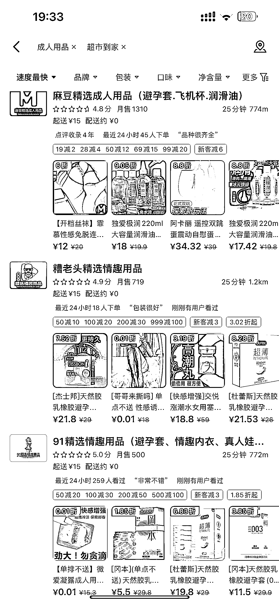

# CR 用品外卖到底赚不赚钱？做了 2 个月的经验来给大家分享下！

> 原文：[`www.yuque.com/for_lazy/thfiu8/ryykmnucw86ulh59`](https://www.yuque.com/for_lazy/thfiu8/ryykmnucw86ulh59)

<ne-h2 id="3704fcf6" data-lake-id="3704fcf6"><ne-heading-ext><ne-heading-anchor></ne-heading-anchor><ne-heading-fold></ne-heading-fold></ne-heading-ext><ne-heading-content><ne-text id="u59bb47af">(45 赞)CR 用品外卖到底赚不赚钱？做了 2 个月的经验来给大家分享下！</ne-text></ne-heading-content></ne-h2> <ne-p id="ua34583a3" data-lake-id="ua34583a3"><ne-text id="uf3f094e8">作者： Ao 阳</ne-text></ne-p> <ne-p id="u2b9ef34f" data-lake-id="u2b9ef34f"><ne-text id="u7d0d6798">日期：2023-06-23</ne-text></ne-p> <ne-p id="u86e96e4b" data-lake-id="u86e96e4b"><ne-text id="ud91979f2" ne-bold="true">     大家好，我是阿阳，一个来自哈尔滨创业的 95 后，主业目前从事通信行业，在做手机号卡，已经有 2 年多的时间，今天给大家分享一个目前在做的一个副业项目，年底的时候，朋友聚在一起，了解到了这个成人用品外卖店的项目，感觉是一个不错的蓝海项目，前景还是不错的，并且他那边做的很好，我这边年后开始做，目前把 2 个月的经验以及这个行业到底赚不赚钱分享给大家！</ne-text></ne-p> <ne-hole id="u9adcb3a0" data-lake-id="u9adcb3a0"><ne-card data-card-name="hr" data-card-type="block" id="IZ9Dh" data-event-boundary="card"><ne-oli index-type="0"><ne-oli-i>1</ne-oli-i><ne-oli-c class="ne-oli-content" id="uf6fd75a7" data-lake-id="uf6fd75a7"><ne-text id="ubfc888d8" ne-bold="true">项目形式及前景</ne-text></ne-oli-c></ne-oli> <ne-p id="ud71b035c" data-lake-id="ud71b035c"><ne-card data-card-name="image" data-card-type="inline" id="tnsUr" data-event-boundary="card"></ne-card><ne-card data-card-name="image" data-card-type="inline" id="qVU1v" data-event-boundary="card"></ne-card><ne-card data-card-name="image" data-card-type="inline" id="fTybD" data-event-boundary="card"></ne-card><ne-card data-card-name="image" data-card-type="inline" id="ZIyft" data-event-boundary="card"></ne-card></ne-p> <ne-p id="uc69772f3" data-lake-id="uc69772f3"><ne-text id="u66628127">上面的数据是我这边本地，以及一些夜生活比较丰富的城市的一些店铺数据，哈尔滨这边做的好的普遍的话都在 1000 多单，大家都应该知道这个行业，是一个非常暴力且冷门的项目，利润高达几十倍，这个利润在 65%-75%左右，平均单价的话在 60-80 左右，1000 单毛利润在 6w-8w 左右，纯利润应该在 3.9w-6w 之间，这个项目还在于能够及时送达，去电商平台拍下发货要 3-5 天，多数人而言应该没有提前准备的这个习惯，也算是这个项目的一个优势，再就是需求量很大，这个数据也在增长，大家可以搜搜自己所在城市的店铺销量，目前这个行业</ne-text><ne-text id="u561a1f95" style="color: rgb(0, 0, 0);">竞争小，外卖隐蔽送达保护隐私确实解决一些后顾之忧，目前线上女性用户占比大，有可能都是觉得很不好意思，外卖平台完全解决了客户的顾虑！完全解决了用户的痛点！</ne-text></ne-p> <ne-p id="u75deef25" data-lake-id="u75deef25"><ne-card data-card-name="image" data-card-type="inline" id="PcUAf" data-event-boundary="card">  <ne-p id="ud6461928" data-lake-id="ud6461928"><ne-text id="u946ca616">（ps 不太行凑乎看吧）</ne-text></ne-p> <ne-p id="udb7c307f" data-lake-id="udb7c307f"><ne-text id="ua12a801a">目前这个行业竞争小，利润大，投入小，需求大，而且随着社会的发展进步生活水平的提高以及思想上的更开放，未来会越来越多的人选择外卖店铺，这个市场也会越来越大！</ne-text></ne-p> <ne-p id="ufe9124d8" data-lake-id="ufe9124d8"><ne-card data-card-name="image" data-card-type="inline" id="sr1Dm" data-event-boundary="card"><ne-card data-card-name="image" data-card-type="inline" id="CyWRG" data-event-boundary="card"></ne-card>  <ne-p id="ueb917cac" data-lake-id="ueb917cac"><ne-card data-card-name="image" data-card-type="inline" id="CcnyP" data-event-boundary="card">  <ne-p id="u31ef4e28" data-lake-id="u31ef4e28"><ne-card data-card-name="image" data-card-type="inline" id="JedQI" data-event-boundary="card">  <ne-p id="uf0324b47" data-lake-id="uf0324b47"><ne-text id="u26e9968e">（大学城店 周五周六会爆单哈）</ne-text></ne-p> <ne-oli index-type="0"><ne-oli-i>1</ne-oli-i><ne-oli-c class="ne-oli-content" id="u143c71e6" data-lake-id="u143c71e6"><ne-text id="ufdfc7165" ne-bold="true">项目需要的准备</ne-text></ne-oli-c></ne-oli> <ne-p id="u9879b581" data-lake-id="u9879b581"><ne-text id="ua2d883bb">营业执照  场地在家或者找个车库 10 平米左右就可以，人员 2 人 白天晚上倒一倒 负责接单装货等外卖小哥来取货就可以了  晚上的单子会多一点，凌晨过后也会有订单，一个人有点熬不住，再就是货品品类，可以看其他家店铺作为参考！</ne-text></ne-p> <ne-oli index-type="0"><ne-oli-i>1</ne-oli-i><ne-oli-c class="ne-oli-content" id="u7f36a0ec" data-lake-id="u7f36a0ec"><ne-text id="ubcd36ef6" ne-bold="true">项目的核心</ne-text></ne-oli-c></ne-oli> <ne-p id="ucd8e72c0" data-lake-id="ucd8e72c0"><ne-text id="u245e4c7f">选址问题：百度地图有热力图，可以看到人群热度，但是你所在的城市，其实你更熟悉，哪些区域街道有：临时性的成人用品需求（比如夜场周边、酒吧一条街周边等，大家可以发散思考）</ne-text></ne-p> <ne-p id="u635328ed" data-lake-id="u635328ed"><ne-text id="uf357db06">运营问题：不少人觉得没做过外卖平台，没有运营经验，可以去先找个靠谱的外卖代运营公司，自己也要去一点一点学习，最好的老师就是同行，找附近卖的最好的成人外卖店，然后，把销量高的列下来，把好的品记下来，去别的位置开店的话可以比他便宜，（这里并不是建议大家在价格上恶意竞争，也算获得流量的一些小技巧，可以离他家店铺远点哈），再就是一定要跟着做的好的店铺学习，模仿他！慢慢学习，数据也就会越来越好！</ne-text></ne-p> <ne-p id="ud63fb8fc" data-lake-id="ud63fb8fc"><ne-text id="u0d7e3966">如果之前有过外卖运营的经验，上手可能会很快。</ne-text></ne-p> <ne-p id="u47e4fde8" data-lake-id="u47e4fde8"><ne-text id="uf621d517">希望这篇文章能够帮助到大家，对这个行业有一个更深的了解！</ne-text></ne-p> <ne-oli index-type="0"><ne-oli-i>1</ne-oli-i><ne-oli-c class="ne-oli-content" id="u7d6ca9b6" data-lake-id="u7d6ca9b6"><ne-text id="u0bc8a5f2" ne-bold="true">最后</ne-text></ne-oli-c></ne-oli> <ne-p id="u744694bb" data-lake-id="u744694bb"><ne-text id="u2a7b0b1c">作为一个副业，基本上跑通了，还是不错的，感觉前景还是很好的，比较适合夫妻俩，或者宝妈，一些刚创业的小伙伴们，对于这些群体很友好，投入小，利润高，目前准备开第二家店铺，选址中，（</ne-text><ne-text id="ue6da7ac3">目前这边消耗的精力太多了，毕竟还有主业，打算交给家里人来打理了</ne-text><ne-text id="uc2cd4f0d">）数据很多在这里就不跟大家分享太多了，图片太多太乱，这也是目前做了 2 个月的一个心得，如果这篇文章对你有帮助，欢迎交流探讨！</ne-text></ne-p> <ne-hole id="uc2522020" data-lake-id="uc2522020"><ne-card data-card-name="hr" data-card-type="block" id="wTSMN" data-event-boundary="card"><ne-p id="ubb0adf3c" data-lake-id="ubb0adf3c"><ne-text id="u0ffc2cb8">评论区：</ne-text></ne-p> <ne-p id="u253731b7" data-lake-id="u253731b7"><ne-text id="u57d34a15">饭饭 : 感谢分享！</ne-text> <ne-text id="ud3683f28">Mr_Fei : 哈尔滨同城认识下[微笑]</ne-text> <ne-text id="udb3c4083">四方小慢慢 : 等了好久，终于有人介绍这个了</ne-text> <ne-text id="ua4c8e468">🌸Tough Gir* : 这之前星球应该有好几篇内容的</ne-text> <ne-text id="ue9ecc609">四方小慢慢 : 啊，我都没发现，我看的都是无人售货，然后推销无人售货机的[流泪]</ne-text></ne-p></ne-card></ne-hole></ne-card></ne-p></ne-card></ne-p></ne-card></ne-p></ne-card></ne-p></ne-card></ne-hole>