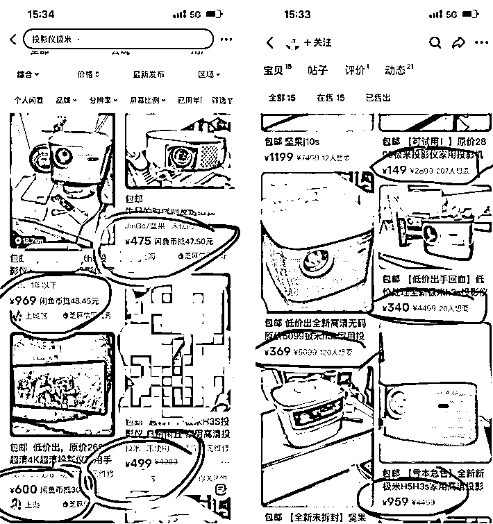
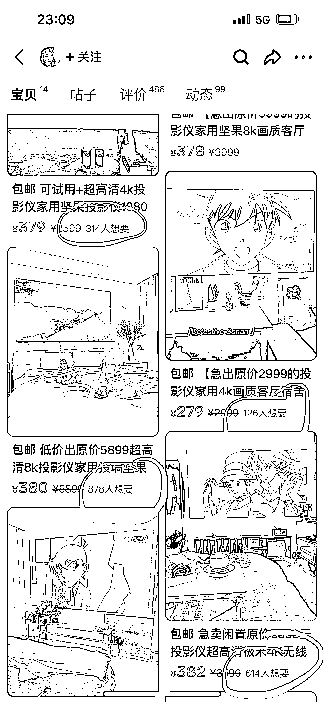
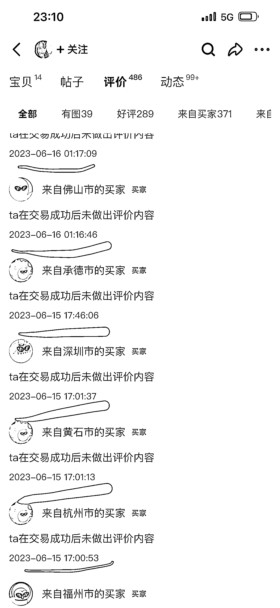
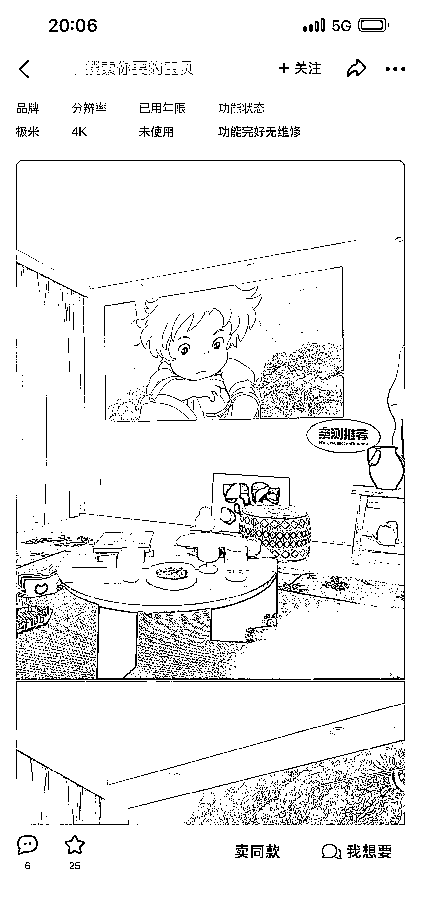
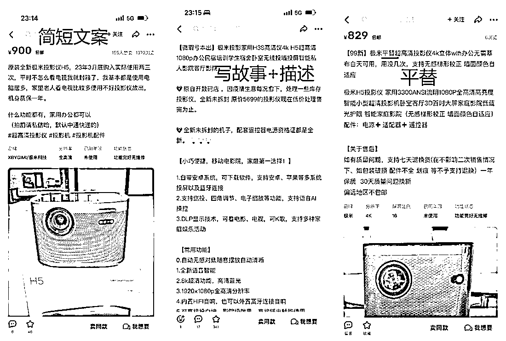
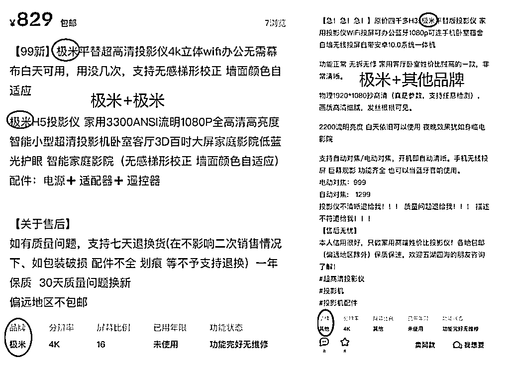
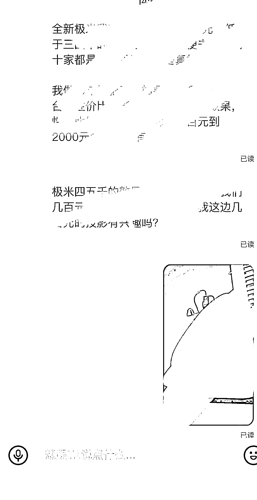
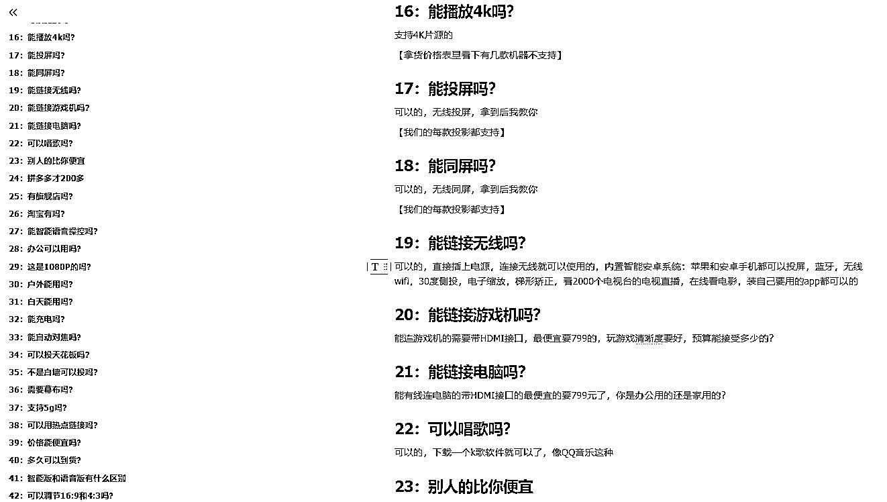
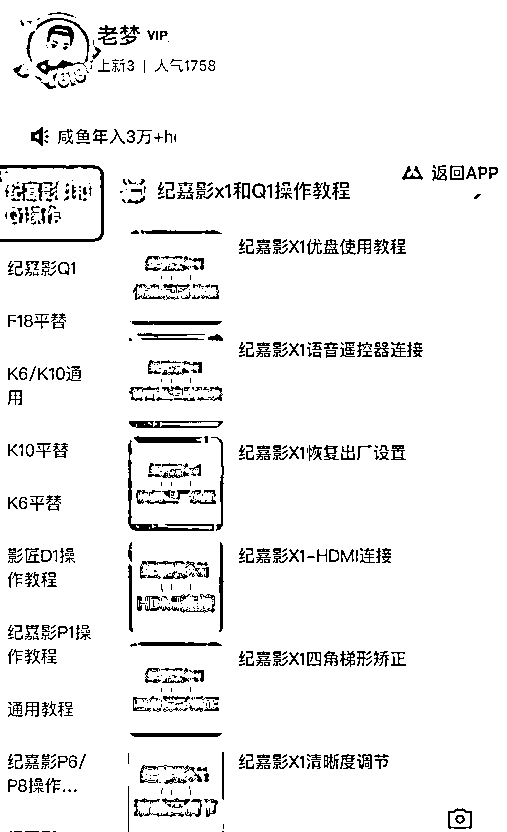

# 闲鱼全品类通用的快速起步底层逻辑

> 原文：[`www.yuque.com/for_lazy/thfiu8/byr0xyqsi6w66hgc`](https://www.yuque.com/for_lazy/thfiu8/byr0xyqsi6w66hgc)

## (25 赞)闲鱼全品类通用的快速起步底层逻辑 

作者： 老梦聊副业 

日期：2023-06-19 

各位圈友好，我是老梦，专注于闲鱼投影仪行业已经有 3 年的经验。在这篇文章中，我将分享我在闲鱼平台上如何利用明确的产品目标，在不同类目下运用多种玩法并进行复制的经验。 

如果你对闲鱼还不太了解，可以先看一下我去年写的精华帖： 

[『每天花 2-3 个小时，闲鱼高客单变现的玩法分享，大家怎么看一个月收入 3000+的副业』](https://articles.zsxq.com/id_02q0cpv9ctea.html) 

这篇文章为你提供了基础知识。 

我专注于投影仪这一品类，主要是因为它的利润相对较高，同时也对新手有一定的门槛，这使得我们可以在这个领域长期经营。与拼多多等平台上无货源的退货率高达 50%相比，我们的货源退货率仅控制在 5%，在行业内表现良好。经过 3 年的经营，我对投影仪这个品类非常熟悉。因此，今天我将以投影仪作为案例，详细讲解我的底层逻辑，这套方法可以适用于绝大多数产品。" 

# 我会从这几个方面展开 <ne-h3 id="b4dfc527" data-lake-id="b4dfc527">1：挖掘优秀对标</ne-h3> <ne-h3 id="48960c93" data-lake-id="48960c93">2：开场白洗意向客户</ne-h3> <ne-h3 id="c221c6b5" data-lake-id="c221c6b5">3：话术促成交</ne-h3> <ne-h3 id="963596d4" data-lake-id="963596d4">4：素材减少售后</ne-h3> 

# 一：挖掘优秀对标 

我做的类目投影仪是最主要的词，通过这个词，发现搜索框的搜索习惯，去年是投影仪家用是最热的词，现在已经从投影仪家用变成了【投影仪极米】为最多人搜索，也就是这个词现在肯定是流量最大的，【投影仪 家用】排第二，流量也依旧有很多，再往下还有投【影仪坚果】，【投影仪二手】这些可以作为我们的备选词，其他一下不相关的就不是我们要做的产品了 

这里面就产生了 2 部分的人群，一部分注重品牌来找极米，一部分对品牌没要求是家用，那我们接着去研究如何利用下拉框的词去发现人家是怎么玩的 

  

## 挖掘第 1 个词：搜索-投影仪极米 

我前面的文章里有讲过，数据好了就要把抵扣关闭，把我想要的数字露出来，要不然这个链接就体现不出来优势，客户点击的概率就会减少 

左边这个打码的链接，是我学员的，我关注了所以不显示数量，他没开闲鱼币抵扣，我想要是 1000+的，左边这个图里面这几个产品，4 个里面混着一个 1000+我想要的，吸引力就比其余几个只显示抵扣的要多（人都是从众的，会好奇这么多我想要的是怎么样的东西） 

右边显示我想要的就可以直观的看的出来区别了，我想要的数量几个产品图对比一下，你是客户，你会点哪种？ 

 

首先，我们要去判断，哪些链接的我想要比较高，现在我们是要找对标，所以哪怕开了抵扣的，也可以一个个点开，去看下他的我想要数，我想要有几十以上的可以记录一下他的数量和价格 

这样可以知道，现在我想要多的都是什么价格的区间，同时也能知道哪种风格主图+配图+文案的风格目前市场受欢迎（市场几个月一次迭代，风格不是一层不变的，得跟着大趋势走） 

了解这个品类下同行在进流量的价格后，可以按他们的价格去引客户点击，也可以比同行降低 50-100 元去引，进来的咨询会更多，价格下调的越多，进来的咨询是越多的，但如果低的太离谱比如同行 400，你定的只有一两百，而你的产品是卖四五百的，就会变成流量不准，进来的都是低价格段预算的用户，你推荐你的产品他预算不够 

找到一个数据不错的链接后，进他的主页看看，他有没有别的链接不错的，去看下数据不错的链接是哪种风格，价格和形式是一直在变的，但用这个方法去跟着市场优化自己的发布内容，是不会过时的，我已经用了 3 年 

 

同时去看他的留言板以及评论区，看这个链接，这个账号的活跃状态是怎么样的，留言是几天内还是很久之前，评价是最近的还是很久之前，如果是最近的去看评论里的图，看是默认评价的多，还是带图评价的多，评价内近期成交记录多，并且留言板内容都是最近的，那这个链接就是我们可以参考的，反之如果没评价，留言板是很久以前的，这个账号对方已经没管了 

 

  

如果是很多一眼就看的出来是网图的，或者很精致的图，多半是 S 的，看 S 和真实部分的数据，判断这个账号的链接是否有参考价值 

## 通过观察发现，图片有 3 种展现形式 <ne-h3 id="0291a96c" data-lake-id="0291a96c">1：9 张极米机器图不带效果图</ne-h3> 

纯放机器图片，效果等客户咨询在介绍，给客户看到整体的外观，增加信任度，吸引咨询 

 <ne-h3 id="fe164324" data-lake-id="fe164324">2：极米机器图为主图附带效果图</ne-h3> 

主图是机器图，放两三张后，其余的为极米机器的实拍 

 <ne-h3 id="3ac39d7a" data-lake-id="3ac39d7a">3：投影效果场景图为主图附带</ne-h3> 

找一些比较亮眼的机器图，前两三张为效果图，后面都为极米机器的图片，或者最后放两三张机器图，别的全为效果图吸引客户 

 <ne-h3 id="2a532103" data-lake-id="2a532103">4：9 张效果图不带机器</ne-h3> 

不带机器图，文案+品牌用大牌的蹭流量，给客户低价能拿到这效果的期待值吸引咨询 

 

用观察到的 3 种形式可以分别去测试不同的效果哪种比较好，如果是别的品类也可以去测不同的效果带来的咨询量是怎么样的 

## 文案的 3 种展现形式 <ne-h3 id="5c506748" data-lake-id="5c506748">1：根据极米的参数描述+写故事</ne-h3> 

去找的过程中可以看到很多类型的文案，这种就是把极米的参数去淘宝搬到闲鱼，有一个人写好后，后面的人看着比较专业，去复制过来自己用就好了，在开头描述一个转手文案就好了 <ne-h3 id="9f763085" data-lake-id="9f763085">2：简短文案</ne-h3> 

怕用户没耐心看文案，就简单写个三四行给客户是真人在出闲置捡漏的感觉，吸引客户咨询了解更多信息 <ne-h3 id="5ed9bd51" data-lake-id="5ed9bd51">3：平替引流</ne-h3> 

把这机器写的非常牛逼，实际发货发平替，卖出去一台是一台，万一留下来，主打凑概率，这方式对投影小白比较容易转化 

可以根据自己的风格去选择要做哪种类型的，也可以去测试不同的风格哪种效果好去用哪种 

 

## 发布的 3 种品牌方式 

1：蹭品牌 

标题内堆品牌词+发布的时候品牌选项也蹭极米品牌，效果图中不露机器（最老的玩法，以前被封很多，现在好像又可以了，很多人在这样发） 

2：比如极米就发极米的机器，坚果就发坚果的机器，对应品牌（一般是我想要到 200 以上才会被同行举报掉） 

3：文案带了极米这种品牌，但品牌选项填其他，或者填 1 

这 3 种是现在比较常见的蹭品牌的玩法 

 

## 这个玩法总结： 

整体用大牌的素材，去蹭大牌的流量，但这个很多都是去卖平替机，而我们是引流过来通过话术卖我们的机器，99%的用户都不是真的几百元可以买到极米，只是为了引一波流量，所以不用怕竞争不过别人 

## 挖掘第 2 个词-投影仪家用 

搜进这个词后会发现，里面会混着很多极米这种带品牌的机器链接，因为他们在标题中带了投影仪家用这个词，也会被框选进来展现，但整体如果单看投影仪家用，而且把第一个词的玩法蹭极米的排除掉后在看，这个词下面现在数据好的账号很少 

## 找对标也是和上面一样去找就可以，这个搜索词下也有 3 种类型的展现效果 

第 1 种：9 张全是效果图，一张机器图都没 

第 2 种：前面几张效果图,后面带几张效果图 

第 3 种：首图和前几张机器图，后面几张效果图 

翻来翻去就是调换顺序的方式，去把客户引进来就可以，图片这个是最简单直接的，就是用同行的图，哪个链接我想要高就用哪个（美图秀秀或者存图宝解决水印问题） 

可能会出现的盗图解决办法： 

如果被原图者举报，会发短信给你，你再 24 小时内把这个链接的图换 9 张不在这 9 个图里面的就可以了，如果想自己去找不用同行的，就去小红书和电商平台评论区都可以，那种都是没原图的大概率不会被举报，图片找好后的搭配形式，根据上面的几种，以及市场风格去定 

## 发布产品 

根据上面的两种形式，不管选择极米还是投影家用这种形式，都是复制同行数据好的去发布就可以，同行已经做起来的，我们先模仿在超越，别人数据好的怎么布局的我们也一比一去照猫画虎就好了 

## 这个玩法总结： 

图片决定了关键，效果图最好是成套的图，不要东一个场景西一个场景，同一个场景的信任度高，要找怎么样的图，可以看我开头发的链接那篇文章有详细的介绍这边就不多讲了 

# 二：开场白洗意向客户 

对于我们来说不管是那种类型的文案，都是引流，引流进来后和客户沟通成交这个是目的，市场哪种流量好我们去做哪种就可以，像现在我们团队重点以极米的引流方法设计转化路径 

我们的流程就是通过优化发布，吸引尽量多的流量，用话术筛选掉没意向的客户，留下有兴趣的意向客户进行重点跟进，转化下来后一单就有 200 元平均利润，最高一单利润能有 600 元，一个月赚个两三千块钱也就出个十几单的事情，在对流程熟悉后就会比较轻松 

洗意向客户的方式我们是用固定开场白发给小号并且置顶，进来的客户不管咨询什么，都是发开场白，筛选掉不是我们的意向客户，留下愿意继续交流的，再用心把这部分客户转化下来 

 

在开场白的设计上，需要明确你的销售产品和你发布的产品中的关键性是什么，是否可以平移，如果你发的是电视，卖的是自行车，那牛头不对马嘴，像我们做投影仪，发的是极米，卖的是别的牌子，就去突出自己的牌子有什么优势，为什么要选择我们的牌子，给客户一个愿意了解下去的理由，就有机会成交 

# 三：话术促成交 

做过销售的都懂得如何去找话术，如何去合理利用话术，如何去优化话术，一步步的都是有关联的，从知道，再到改进，如何去把客户转化下来，有一套流程 

开场白——问需求——展示我们的套餐——挖出客户预算——展示对应效果——逼单——不成交解决客户疑问——再次逼单——循环解决问题加逼单直到成就或者客户流失 

用好固定话术提高效率，搭配合理利用，让成交变成固定的几个步骤，你省力，客户也跟着你的销售流程走，在聊天中优化流程，提高成交率，客户不只是在问你，谁的流程清晰，聊天专业，客户就会选谁 

客户提出的问题都得提前做足功课，客户问的问题尽快回复体现专业性，像这个表格里，我们把常见问题全部列出来了，掌握了基本上就没什么问题了，每一个投影的操作步骤，一步步全部录制好视频，哪怕是小白，对照着多看几遍也能会了，也方便去成交的过程中给客户展示他问的问题我们的 

你们做别的品类，也要把素材都准备足，去增加转化的概率，光文字对话很空洞，有图，有视频，有案例，平时积累起来，对转化的帮助会很大 

 

 

# 四：抓售后 

卖出去了只是成功了第一步，如果最终死在客户拿到手的售后环节就前功尽弃，要处理好售后那就要了解好会用到的每一个功能，如果自己对自己的产品不研究透，那就两眼一抹黑了，像我们是把每一步客户会问到的问题，全部整理好，方便在处理售后中可以让客户直接对着视频操作，操作不会的直接开个视频看下客户的实际情况几分钟调节完毕就可以 

我们经常会用你带图好评一下，我给你送 XX 解决，可以送免费的软件，也可以送付费的小东西，虽然少点利润，但好歹确认收货会变成利润，而如果最终客户退了，前面的全部白忙活 

 

# 结语： 

但如果想靠闲鱼发大财是发不了，天花板摆着，靠矩阵去铺其实也不是一个做副业精力的人可以做的，两三个号已经是普通人做副业的极限了，闲鱼赚点生活费可以，能不能赚到钱最重要的还是靠执行力+坚持！ <ne-h3 id="ef060cb3" data-lake-id="ef060cb3">不管做什么产品，其实都是在找对标，抄对标，然后找到自己的长处进行突围，希望本篇分享对你有所帮助！如果需要投影仪货源的圈友也可以找我，都按代发价！</ne-h3> 

评论区： 

暂无评论