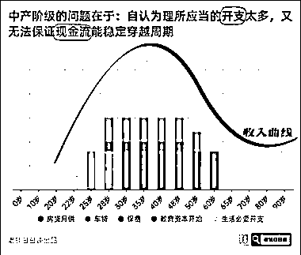
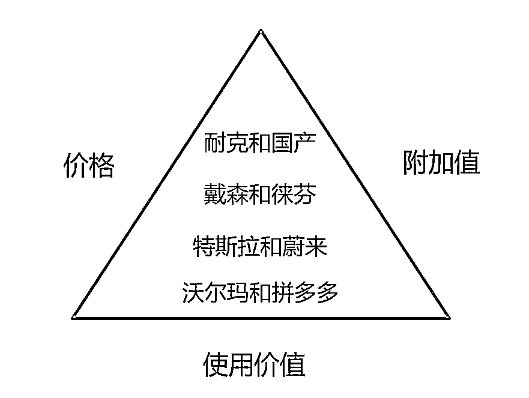

# 中产阶级消亡的警醒

> 原文：[`www.yuque.com/for_lazy/thfiu8/go3rbdmh7eynmf0k`](https://www.yuque.com/for_lazy/thfiu8/go3rbdmh7eynmf0k)

<ne-h2 id="87f890b4" data-lake-id="87f890b4"><ne-heading-ext><ne-heading-anchor></ne-heading-anchor><ne-heading-fold></ne-heading-fold></ne-heading-ext><ne-heading-content><ne-text id="u1698663e">(153 赞)中产阶级消亡的警醒</ne-text></ne-heading-content></ne-h2> <ne-p id="u1b99b2c7" data-lake-id="u1b99b2c7"><ne-text id="ufe3eb7f7">作者： 小马宋</ne-text></ne-p> <ne-p id="u2ca5567e" data-lake-id="u2ca5567e"><ne-text id="ud9d6bc55">日期：2023-06-15</ne-text></ne-p> <ne-p id="u721ef749" data-lake-id="u721ef749"><ne-text id="u91bee70f">中产阶级消亡的警醒</ne-text></ne-p> <ne-p id="ua91c590c" data-lake-id="ua91c590c"><ne-text id="u5afc8023">这周一，公众号“南添的求真之路”发了一篇文章《中产阶级消亡史的警醒》，读来有很多感触，简单分享一下这篇文章的主要观点。</ne-text></ne-p> <ne-p id="u64d0659f" data-lake-id="u64d0659f"><ne-text id="uac191b69">1、中产阶级的诞生源于经济的中高速增长，这在战后的日本以及美国，改革开放后的中国非常明显。由于经济高速增长，相关产业付得起高工资，加之地产和股市的升值，让很大一部分人群的收入和财富增长水平比较高，造就了中产阶级。</ne-text></ne-p> <ne-p id="udd474f56" data-lake-id="udd474f56"><ne-text id="uaa53b3e3">2、这三个国家中，日本的中产阶级最先消亡，由于原来的优势产业半导体被美国摁住，电子产品逐步被中韩替代，后来汽车产业又押错了方向，导致这几个优势且支柱产业没落，从业人员收入快速下降。90 年日本地产崩盘，股市也开始大跌，某些地段的房价下跌超过 90%，平均房价下跌 70%，导致日本中产财富大幅缩水，背的债务却没有缩水，要用一辈子甚至两三代人还债。</ne-text></ne-p> <ne-p id="ud2cc331e" data-lake-id="ud2cc331e"><ne-text id="udc087154">3、美国在 08 年金融危机的时候，许多中产破产，和日本一样，也进入了 M 型社会，就是大部人收入低且穷，少部分人收入和财富极高。</ne-text></ne-p> <ne-p id="ud08fc2c0" data-lake-id="ud08fc2c0"><ne-text id="u1757afe3">4、中产阶级的问题在哪里呢？是他们认为自己理所应当的开支太多，但自己的现金流又没办法保证他们穿越周期。（我翻译成人话就是，中产阶级认为自己既应该住大房子，又应该开好车，日常应该喝星巴克而不是喝 711，孩子应该读国际学校。但是这些花费有许多是借债消费的，一旦遇到经济危机，他们的现金没办法维持这种生活也没办法继续还贷，结果房子车子可能都丢了，然后就死透了）</ne-text></ne-p> <ne-p id="u0d578c1a" data-lake-id="u0d578c1a"><ne-text id="ua3e9e095">5、《M 型社会》的作者大前研一的建议是——中产阶级要放下各种所谓的“理所应当”，用内在积分牌对抗社会共识。你想自由地生活，首先得相信自己能够自由地生活。降低对子女教育和自己养老的预期，放过自己，才能保证自己不会潦倒一生。</ne-text></ne-p> <ne-p id="uccdad116" data-lake-id="uccdad116"><ne-text id="u2c04e7be">6、许多人赶上了一波产业红利，会认为高收入会持续下去，从而产生虚假的财务幻觉，花钱开始大手大脚，而不注重积累财富，其实收入快速降低或者清零随时都可能发生。</ne-text></ne-p> <ne-p id="u1d543708" data-lake-id="u1d543708"><ne-text id="uf7913ca7">7、人生收入有三个阶段，第一个是开始赚钱，也就是你毕业找到工作了。第二个是收入增长，消费也多的阶段，许多人从此背上债务。第三个阶段是收入快速下降，但贷款也还完了，孩子也读大学了，略微宽裕起来。</ne-text></ne-p> <ne-p id="u5c57725c" data-lake-id="u5c57725c"><ne-text id="u8de7bee3">8、一个新概念：“投资是用‘现金’换‘现金流’”。投资重点不投，是换。就是用你现在的现金，去换取未来比较稳定现金流，也就是收入。比如你持续在花钱学新技能，从电视媒体时代到搜索时代到直播时代到 AI 时代你从没落伍，那你的现金流就会不断。比如你把现金投资到某些稳定的产业项目中（我说的不是时髦的项目，稳定的项目指的是开了 30 年的餐厅这种项目），有固定的回报（超过 15%），这也是现金流。还有就是给靠谱的基金经理们。（我对此不熟悉，不分析了）</ne-text></ne-p> <ne-p id="u40c13366" data-lake-id="u40c13366"><ne-text id="u5cff06bb">9、一个没有消亡的中产阶级大概率做到了以下至少两点：</ne-text> <ne-text id="ua488253e">收入基数高于社会平均水平，增速不高；懂得控制杠杆，踩对了股市或者房产的每一轮周期（别买太贵）；理性消费，不去鸡娃，把省下来的现金换成将来的现金流。第一点和第二点更多依赖时代的背景，一生也就两三次机会。第三点则是个人努力可以做到的。</ne-text></ne-p> <ne-p id="u319e0a0a" data-lake-id="u319e0a0a"><ne-text id="ud2c31043">10、作者的建议：不要为商品的附加值买单。对抗消费主义，回归商品本身的使用价值，多考虑自己的真实需求和执行力。商品的附加值就是商品的使用价值之外的东西，比如你觉得穿耐克比穿安踏有面子，但要多付 50%的价格。</ne-text></ne-p> <ne-p id="u5d829d63" data-lake-id="u5d829d63"><ne-text id="u36202491">以上就是我对这篇文章的简要总结，全文链接在下面。</ne-text></ne-p> <ne-p id="u989b5c38" data-lake-id="u989b5c38">[<ne-text id="u1518ecff">https://mp.weixin.qq.com/s/c2oEzdotDtYvWzrgg8clDA?wxwork_userid=XiaoMaSong01</ne-text>](https://mp.weixin.qq.com/s/c2oEzdotDtYvWzrgg8clDA?wxwork_userid=XiaoMaSong01)<ne-card data-card-name="image" data-card-type="inline" id="dTJx8" data-event-boundary="card"></ne-card></ne-p> <ne-p id="u47636a32" data-lake-id="u47636a32"><ne-card data-card-name="image" data-card-type="inline" id="rzkBb" data-event-boundary="card"></ne-card></ne-p> <ne-p id="u95f540a2" data-lake-id="u95f540a2"><ne-card data-card-name="image" data-card-type="inline" id="G9Efb" data-event-boundary="card"></ne-card></ne-p> <ne-p id="u7707bee9" data-lake-id="u7707bee9"><ne-card data-card-name="image" data-card-type="inline" id="os4wq" data-event-boundary="card"></ne-card></ne-p> <ne-hole id="uf40cda49" data-lake-id="uf40cda49"><ne-card data-card-name="hr" data-card-type="block" id="Qk9Hy" data-event-boundary="card"><ne-p id="u81fc946a" data-lake-id="u81fc946a"><ne-text id="u6be0a48a">评论区：</ne-text></ne-p> <ne-p id="ub6f69981" data-lake-id="ub6f69981"><ne-text id="uf150faf2">阿黎 : 这个提醒太好了</ne-text> <ne-text id="u7b0e1b29">警惕中产返贫，警惕【非理性消费和投资】导致损失了【本可以在未来获得的收益】，近段时间，我常看生财的《人生亏欠指南》，常看常新。</ne-text> <ne-text id="u223e51e3">周彦充 : 感觉现在社会的生活，都不会怎么穷，不如搏一搏，单车变摩托[呲牙][呲牙]</ne-text> <ne-text id="ubfa6c671">吖 占 : 还好我是穷人基层😂</ne-text> <ne-text id="u2b947f60">小新 : 第 8 条非常有感触，虽然自己没入股过实体店，但之前有想法，详细调研过，说实话，</ne-text></ne-p> <ne-p id="u2c02c09e" data-lake-id="u2c02c09e"><ne-text id="u268fb431">普通人投实体股权，15%-20%我觉得是靠谱的收益，20%-30%甚至更高的不是没有，但普通人能遇到这种项目太难了</ne-text> <ne-text id="u9ff7bb22">就像投基金有没有人能稳定 15%收益？我相信有，但绝对是普通人很难达到的，所以我才定了 10%止盈！</ne-text> <ne-text id="ud50c3665">苟墨 : 第十点有点马克思理论的感觉</ne-text> <ne-text id="u129eb451">乾 : 有中产吗？[捂脸]掌握生产资料的才是有产阶级，这些中产只是工资比较高的打工人。</ne-text> <ne-text id="ud09f278c">乾 : 中产阶级三件套，全职太太，贵族学校，还有个啥来着？</ne-text> <ne-text id="u99fd7307">安语 : 高价房产房贷？</ne-text></ne-p></ne-card></ne-hole>