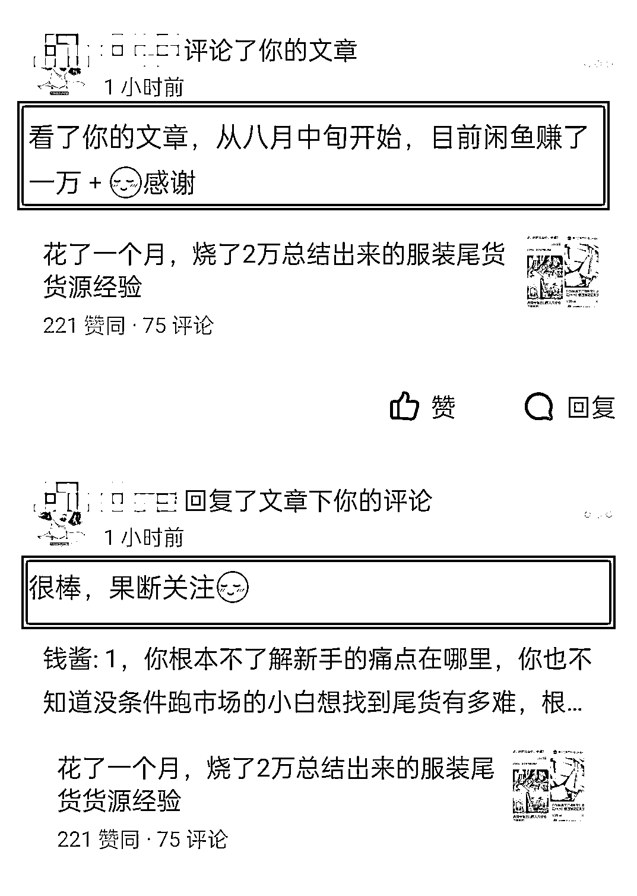
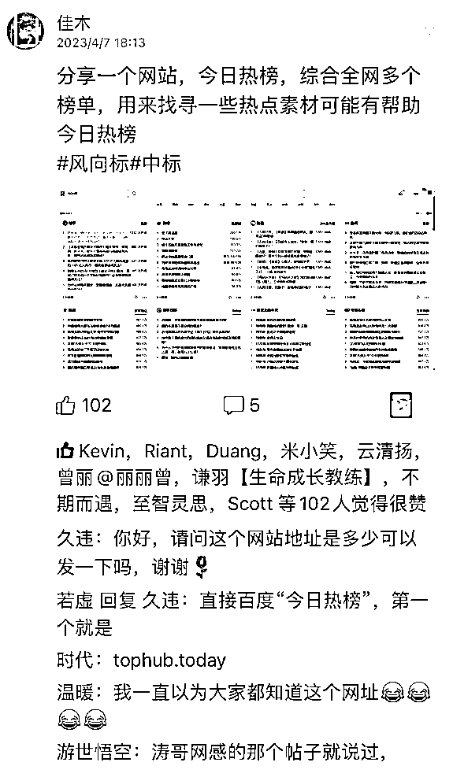

# “分享”这件事里，藏着很多钱

> 原文：[`www.yuque.com/for_lazy/thfiu8/zbi7brfete9a05xk`](https://www.yuque.com/for_lazy/thfiu8/zbi7brfete9a05xk)

## (90 赞)“分享”这件事里，藏着很多钱 

作者： 钱酱 

日期：2023-06-13 

刚才在复盘自己的笔记时，突然发现，我现在拥有的成绩，都是因为一件事，就是“真诚无保留的分享”： 

就是抱着一个初心： 

做到只要读者想学，就能通过我的文章学到非常多的东西，只要读者想实践，就绝对落地。因为这些东西都是我亲身实践总结出来的。 

我发现，只要是我抱着真诚的心态，把自己的经验复盘出来，这些文章都会在后续为我产生很强的影响力，还有很多人会自发转发我的文章。 

有这么一次，我在写文章，看到微信一直闪动，就打开微信看了消息，本来打算忽略，但一看是君言群在说话，我就想着看一看，第一眼看到的是这么一句话：“这人我一搜，居然就在咱们群里”。 

立马就来兴趣了，我心想这谁呀，吃吃瓜，一看他发的图片：  

原来是我的文章，然后下面艾特我的、夸奖我的......我组织了很久的语言，不敢回复，哈哈哈。 

但看着群成员都在夸我，我感觉自己做了一件很有意义的事，这篇文章当时发出去也给我带来了转化，我以为转化了就过去了，随着时间的推移，文章也就销声匿迹了，但没想到，居然后续还有连锁的影响力，能给各种各样的人带来启发。 

这件事过后，有很多很多朋友加我，但我没有想转化，我知道，他们都是认可我的人、和我同频的人，在未来，我们多多少少会产生链接，会发生一些故事，这些都会爆发出比钱更值钱的价值。 

真诚有价值的内容，是会在同频的人之间流通起来的，而且看到的人，会像发现了宝藏一样惊喜，像对待钱一样珍惜。 

再比如，我在做尾货的时候，把自己的经验分享了出来，然后后来又好几个做尾货的 APP，邀请我去他的 APP 做客，拉我进他们所有的群，发尾货，当时一下子我的客源和货源就丰富了起来，我一边收货、一边和别的源头尾货谈合作，帮他们卖货，当中间商； 

比如我把在闲鱼卖尾货的经验复盘了一下放在了公众号、知乎、和卢松松平台，有一天，突然知乎有读者给我评论，说他通过我的文章，8 月份赚了 1w 多； 

在做知乎好物的时候，毫无保留的把自己的经验分享出来，当时知乎编辑可能发现了，然后，我的文章突然从 8 个赞一下子就爆了，到现在 2w 多赞，好多人给我反馈，说很受启发，在我后续做知识付费的过程中，相当大一部分人因为这篇文章给我付费。 

对于真正的真知灼见，人们是不吝惜点赞、甚至真金白银的。 

还有一件对我影响非常大的事，当时我花了将近 3w 买了一同行的产品，这个同行我简称小 A 吧，虽然是我买了他的产品，但并没有让对方提供什么帮助，反倒是我把自己的机密分享给了他，解决了对方当时一个非常大的难题。 

我们是同行，这个方法当时对我们彼此都至关重要，但我不仅把方法告诉了他，连同文案、细节，都发给了他，其实我也不知道该不该这么做，毕竟是竞争关系，但当时就想着好好去解决问题。 

当天晚上，他就落实了，更有意思的是，即使他没有完全理解透这个玩法，也照样去落实了。 

我的这个规则，是根据我的阶段制定的，根据我想要的东西制定出来的，想要用好，就只能根据自己的状况去改，去套，但是他没有想这么多，直接用了，很多地方也是改的漏洞百出。 

如果是当时的我的话，这么多漏洞，我会在意别人怎么说我，我会想着别人这么做，肯定是有一套体系的，我学到手再落实.... 

最后就是这套方法，人家后面又慢慢迭代，最终彻底为自己创造价值。 

那件事，对我影响最大的： 

第一，就是敢干。 

评估一万遍，深思熟虑一万遍，不如自己动手去做。 

第二，学习永远是学思路，什么是思路？就是看他的取舍，看他的思考过程，这样学习非常快。 

这些成为了我后面做成了一些事的核心，但如果没有当时真诚的分享，我是永远不可能学到的。 

说到这，你可能心潮澎湃，跃跃欲试，但仔细一想，又觉得自己没有什么特别值得分享的，如果你也是这样，那就记住一点，就是不要去对自己要分享的东西做评价： 

1、不要去评价简单不简单： 

之前我一直觉得简单的东西没有必要分享，直到有一天在生财看到了这个： 

 

102 个点赞，下面还有人评论要网址，这个网站我早就知道了，如果是我自己，我会觉得不值得分享，但现实是别人分享出来了，还爆了。 

不要总觉得自己分享的东西含金量不高，要非常非常难才好，其实思路错了，只要对大家有用，简单的更要分享，不要不屑于去分享简单的东西。 

还是那句话，你的常识可能是别人的盲区。 

2、不要去评价靠谱不靠谱： 

前段时间我在生财发了一篇文章，发之前总怕自己分享的东西不怎么样，心里总有这么一句话：“你总结的那点所谓的“经验”，真的靠谱吗？” 

但看到很多大佬，把每一点小成绩，都复盘起来分享给大家，给我挺大鼓励的，所以我在生财就发了一篇文章，结果亦仁大佬给我点赞了，感觉很激动。 

如果我没有发，就不会有这么多人认可，亦仁大佬也不会给我点赞。 

所以：你总结的那点所谓的经验真的靠谱吗？ 

先前我看过李笑来老师的一本书，叫《微信互联网平民创业指南》，里面有这么一段话，就是回答这个问题的： 

 

一点心得，感谢观看，希望对大家有用。 

评论区： 

亦仁 : 真诚分享会带来意外好运，亲身验证无数次。 

一要分享，二要真诚。 小七 : 像你学习 🌸猫本红豆冰🌟 : 就凭亦仁兄这句话，明天把这个人生第一次航海体验码出来～ 钱酱 : 感谢亦仁大大回复[转圈]，以后要把真诚分享这件事贯彻到底~真诚比留钩子什么的更重要，作者心里想的，读者是能感受到的。 钱酱 : 一起加油💪 Clay（阿木） : 感谢分享，以前也以为普通的常识不敢分享😂 帅彬 : 知乎大佬~~~ 钱酱 : [让我看看][让我看看][让我看看]