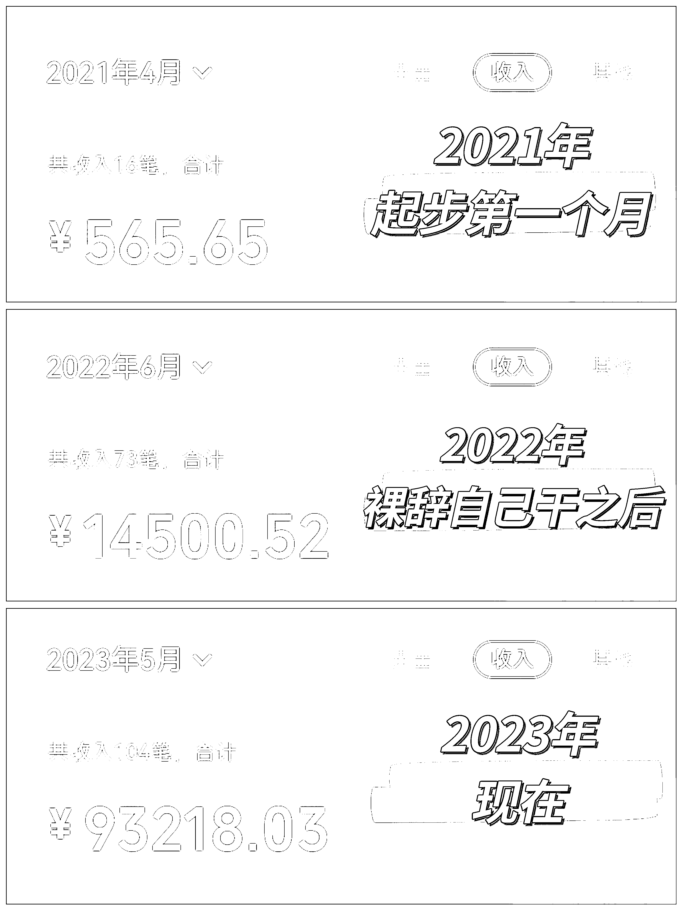

# 大厂裸辞跑通职场个人 IP，千人私域半月被动收入近六位数的历程分享

> 原文：[`www.yuque.com/for_lazy/thfiu8/osccw2l55r16qxow`](https://www.yuque.com/for_lazy/thfiu8/osccw2l55r16qxow)

<ne-h2 id="68954273" data-lake-id="68954273"><ne-heading-ext><ne-heading-anchor></ne-heading-anchor><ne-heading-fold></ne-heading-fold></ne-heading-ext><ne-heading-content><ne-text id="ube7da5bf">(精华帖)(307 赞)大厂裸辞跑通职场个人 IP，千人私域半月被动收入近六位数的历程分享</ne-text></ne-heading-content></ne-h2> <ne-p id="ue9da4505" data-lake-id="ue9da4505"><ne-text id="ud82cc674">作者： AI 君</ne-text></ne-p> <ne-p id="u8c3e9284" data-lake-id="u8c3e9284"><ne-text id="u4615f741">日期：2023-06-16</ne-text></ne-p> <ne-p id="u79b0b383" data-lake-id="u79b0b383"><ne-text id="u096be998">大家好，我是 AI 君，95 后，前大厂产品经理，做个人 IP 两年，裸辞一年半，目前是一名职场个人 IP 孵化教练。</ne-text></ne-p> <ne-p id="ue288653d" data-lake-id="ue288653d"><ne-text id="u3f9de9dd">一开始做 IP 的时候，我是无资源无背景，没有业余的自媒体账号，微信好友仅 1000 人，半年不发朋友圈的小透明。</ne-text></ne-p> <ne-p id="udd987084" data-lake-id="udd987084"><ne-text id="u0c71c810">到上个月的时候，我实现了靠 3000 私域好友、1000 粉公众号和 4000 粉小红书，半个月被动变现近六位数的净收入。基本都是一两个月从认识到转化，也几乎没有什么沟通。</ne-text></ne-p> <ne-p id="u0fc54460" data-lake-id="u0fc54460"><ne-text id="u9e4fcc99">这种模式对于一个普通职场人来说是非常舒服的，不需要维护太多好友和产品，不需要做太多的销售转化沟通，也不需要搭建和管理团队，一个人的时间精力就能搞得定。</ne-text></ne-p> <ne-p id="ub18219d2" data-lake-id="ub18219d2"><ne-text id="u4729bf2f">这是我做个人 IP 两年，微信端的变化情况</ne-text></ne-p> <ne-p id="u10630f9c" data-lake-id="u10630f9c"><ne-card data-card-name="image" data-card-type="inline" id="GKAEb" data-event-boundary="card"></ne-card></ne-p> <ne-p id="u207dcb50" data-lake-id="u207dcb50"><ne-text id="u7bad1eec">成绩和各位大佬比不值一提，但作为一个自己拿到重大变现突破的普通职场人，以及一个帮助过诸多职场人实现副业变现五位数的个人 IP 孵化教练，我的历程和经验，或许对大家有一些借鉴和参考。</ne-text></ne-p> <ne-p id="u7cfe7d11" data-lake-id="u7cfe7d11"><ne-text id="ub26722df">这篇文章就想和大家详细分享一下《普通职场人，如何跑通个人 IP，实现副业变现五位数》，具体包括——</ne-text></ne-p> <ne-p id="u8ca724d6" data-lake-id="u8ca724d6"><ne-text id="ub3326cc8">1、职场遇到瓶颈和迷茫，如何确认未来发展方向，找到自己的优势和竞争力？</ne-text></ne-p> <ne-p id="u4aab23c5" data-lake-id="u4aab23c5"><ne-text id="u3d7c38d0">2、为什么学了诸多课程却没有真的改变？职场人做 IP 的特殊性和必须考虑的问题</ne-text></ne-p> <ne-p id="uf290e82e" data-lake-id="uf290e82e"><ne-text id="ub89736bf">3、如何打造一个自身自洽，能同时实现自我价值和商业变现的个人 IP 模式？</ne-text></ne-p> <ne-p id="u4e49b9a9" data-lake-id="u4e49b9a9"><ne-text id="ud5163530">4、如何通过私域内容、转化设计、自媒体打造，实现变现飞跃，超过主业收入？</ne-text></ne-p> <ne-p id="u189a411e" data-lake-id="u189a411e"><ne-text id="u4eabe643">5、职场人转型路上有哪些常见的问题？该如何解决卡点、保障效果？</ne-text></ne-p> <ne-p id="uffc81e7b" data-lake-id="uffc81e7b"><ne-text id="ue682167b">全文将近 17000 字，详细写了我的经历和我做 IP 打造的方法论，详情请移步：</ne-text>[<ne-text id="u8d75fc78">https://j7329dxmbu.feishu.cn/docx/RmGidmCRcoQEJ6xre2Zcm9UqnXd</ne-text>](https://j7329dxmbu.feishu.cn/docx/RmGidmCRcoQEJ6xre2Zcm9UqnXd)</ne-p> <ne-p id="ud205d226" data-lake-id="ud205d226"><ne-text id="u55c5856f">最后，要特别感谢生财给的平台，这里面真的很多好的项目和资料，也很多优秀的人，毫不夸张的说，它是一个巨大的宝库，大家可以有效利用起来，不要入宝山空手归。</ne-text></ne-p> <ne-p id="u000c7409" data-lake-id="u000c7409"><ne-text id="u900ffb18">2021 年 4 月份我加入的生财，就是我起步做 IP 的阶段。</ne-text></ne-p> <ne-p id="u92d1bb7b" data-lake-id="u92d1bb7b"><ne-text id="ue11beed4">当时我专门花了一些时间把生财的各个分类的帖子每个看了几篇，对于市面上现在大概有哪些比较好的项目，情况是什么样做到心中有数。</ne-text></ne-p> <ne-p id="u20a83354" data-lake-id="u20a83354"><ne-text id="uf1f20926">同时去链接了很多自己相关的优秀圈友，去近距离交流，看看他们怎么做成的，深度了解和学习。</ne-text></ne-p> <ne-p id="u032504b9" data-lake-id="u032504b9"><ne-text id="ufdb94fa5">这些对我非常有帮助，我也很建议大家去这么做。</ne-text></ne-p> <ne-p id="ub3ab32cd" data-lake-id="ub3ab32cd"><ne-text id="u13c5f8d1">感谢米索、芷蓝、文静、靠谱，对于我进入生财、做 IP、以及写帖子过程中提供的帮助。</ne-text></ne-p> <ne-p id="u2d5a48e3" data-lake-id="u2d5a48e3"><ne-text id="uaef622f4">感谢大家的耐心收看，希望能对大家有所帮助，也希望看到更多优秀的朋友真的走通这条路。</ne-text></ne-p> <ne-p id="uf31e36b8" data-lake-id="uf31e36b8"><ne-text id="ufba64a2d">整个 IP 打造、私域变现，细节的东西还蛮多的，由于篇幅有限这里可能没有办法把所有的东西都说的特别详细。大家如果有什么需要，也欢迎和我交流。</ne-text></ne-p> <ne-hole id="u6807e8bf" data-lake-id="u6807e8bf"><ne-card data-card-name="hr" data-card-type="block" id="EC309" data-event-boundary="card"><ne-p id="uaaa7ece0" data-lake-id="uaaa7ece0"><ne-text id="uafccbf78">评论区：</ne-text></ne-p> <ne-p id="u86fe61e9" data-lake-id="u86fe61e9"><ne-text id="u20e8612c">李米乐 : 太棒了👍</ne-text> <ne-text id="udff49406">AI 君 : 谢谢亲爱哒~</ne-text> <ne-text id="u88e2f4d1">高海霞｜西瓜姐 : 太棒啦！！！！！加油！！！</ne-text> <ne-text id="ud1b0fad8">筱云 : 学习的榜样[强][强][强]</ne-text> <ne-text id="u3b9b7e4d">清一 : 太厉害啦！</ne-text> <ne-text id="u712e8cb6">书情小跟班 : 励志</ne-text> <ne-text id="u9b087cda">AI 君 : 谢谢西瓜姐[玫瑰][玫瑰]看你最近也做的风生水起，多和你交流学习~</ne-text> <ne-text id="u9a8fa1fd">AI 君 : 谢谢云云😘</ne-text></ne-p></ne-card></ne-hole>