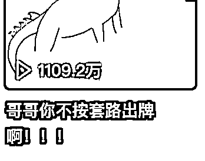
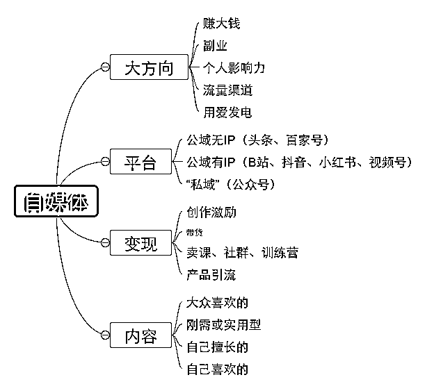

# 我的十年自媒体之路

> 原文：[`www.yuque.com/for_lazy/thfiu8/nqw6s5d6g8timl83`](https://www.yuque.com/for_lazy/thfiu8/nqw6s5d6g8timl83)

<ne-h2 id="e70d7a0e" data-lake-id="e70d7a0e"><ne-heading-ext><ne-heading-anchor></ne-heading-anchor><ne-heading-fold></ne-heading-fold></ne-heading-ext><ne-heading-content><ne-text id="ud0c5d082">(精华帖)(221 赞)我的十年自媒体之路</ne-text></ne-heading-content></ne-h2> <ne-p id="ua3e08a86" data-lake-id="ua3e08a86"><ne-text id="u9320ae6b">作者： Crossin</ne-text></ne-p> <ne-p id="u892b663d" data-lake-id="u892b663d"><ne-text id="ub2ba2520">日期：2023-06-15</ne-text></ne-p> <ne-p id="uabb0cfa5" data-lake-id="uabb0cfa5"><ne-text id="u28964e70">各位星友大家好。</ne-text></ne-p> <ne-p id="u68e75df9" data-lake-id="u68e75df9"><ne-text id="ub9addde6">本文是应小灰老师的邀请，写的一篇关于自媒体运营的经验分享。</ne-text></ne-p> <ne-p id="u3e03967b" data-lake-id="u3e03967b"><ne-text id="u9694ed20">算了下我做自媒体也有十年了，确实也想做个总结，但原本并不打算在现在这个时间点做。因为从结果上来说，目前我的公众号流量大不如前两年，加上一些个人原因，几乎处于半躺平式运营的状态；另外我正在向视频方向尝试，但目前尚处在起步阶段，还没形成有效的流程或方法论。所以客观来看，此时既谈不上是一个成功案例的分享，也不能说是失败案例的总结。</ne-text></ne-p> <ne-p id="u1f5c875d" data-lake-id="u1f5c875d"><ne-text id="ue418a323">但择日不如撞日，来都来了，那就随便聊聊吧。讲讲我个人在自媒体方面的一些经历和由此得出的经验教训。</ne-text></ne-p> <ne-p id="ue12da151" data-lake-id="ue12da151"><ne-text id="u133cb08c">分以下几部分谈谈：</ne-text></ne-p> <ne-p id="u91e6d31b" data-lake-id="u91e6d31b"><ne-text id="ud59a13dc">一、我的自媒体经历</ne-text></ne-p> <ne-p id="u0dca1263" data-lake-id="u0dca1263"><ne-text id="u0e02ff19">二、爆款内容复盘</ne-text></ne-p> <ne-p id="u6408c580" data-lake-id="u6408c580"><ne-text id="ua59924e2">三、收入水平</ne-text></ne-p> <ne-p id="u53cb3158" data-lake-id="u53cb3158"><ne-text id="u0711a508">四、我做对了哪些</ne-text></ne-p> <ne-p id="u9dc51e5e" data-lake-id="u9dc51e5e"><ne-text id="uabef5946">五、我做错了哪些</ne-text></ne-p> <ne-p id="u7d7bcee3" data-lake-id="u7d7bcee3"><ne-text id="u945492ac">六、对新入局者的建议</ne-text></ne-p> <ne-p id="u1a24d84f" data-lake-id="u1a24d84f"><ne-text id="u193249aa">对了，先介绍下我自己的号：</ne-text><ne-text id="u60b8b555" ne-bold="true">Crossin 的编程教室</ne-text><ne-text id="u326d9e1b">。以 Python 编程相关的内容为主，包括教程、案例等。</ne-text></ne-p> <ne-p id="u1aa0d101" data-lake-id="u1aa0d101"><ne-text id="u7c4d7ca1">先讲讲我个人在这个过程中的一些重要时间节点和复盘。但其中很多情况跟当下已经不一样了，同样的操作现在恐怕很难复制。对这部分不感兴趣的朋友可以直接跳过看后面的建议。</ne-text></ne-p> <ne-h3 id="cc98b366" data-lake-id="cc98b366"><ne-heading-ext><ne-heading-anchor></ne-heading-anchor><ne-heading-fold></ne-heading-fold></ne-heading-ext><ne-heading-content><ne-text id="uc38dca77" style="color: rgb(47, 48, 52);">一、我的自媒体经历</ne-text></ne-heading-content></ne-h3> <ne-p id="u2607da37" data-lake-id="u2607da37"><ne-text id="u68ef8424">粗略地理一下时间线：</ne-text></ne-p> <ne-p id="ud66dff74" data-lake-id="ud66dff74"><ne-text id="u6f27ca9f" ne-bold="true">2013 年 - 注册公众号，开始连载 Python 入门教程；注册知乎，回答 Python、编程相关问题。</ne-text></ne-p> <ne-p id="uf1e50936" data-lake-id="uf1e50936"><ne-text id="u148c4e74">此时公众号刚诞生不久，算是偏小众，更谈不上什么商业模式，甚至“自媒体”这个词都还没有。但小众有小众的好处，只要你的内容确实不错且持续更新，很容易联系上一些大号帮你推荐。不少号主也会主动搜罗一些优质号进行推荐。</ne-text></ne-p> <ne-p id="u03841251" data-lake-id="u03841251"><ne-text id="u16d0be96">而知乎在那个时候也是处在初创上升期，用户群体以大学生、刚毕业的职场人为主，内容氛围也不错，主要都是知识技能向。且早期对作者引流几乎没有限制，可以随意在回答里放公众号二维码。另外还有一点，当时百度对知乎的答案收录权重很高。所以综合下来，当时在知乎做技能向的内容分享，再引流到公众号，真的是一个非常大的红利时间窗口。</ne-text></ne-p> <ne-p id="uf256f2e2" data-lake-id="uf256f2e2"><ne-text id="ue01cb5aa">接下来的几年，我本职是做游戏行业，公众号一直当兼职在做，更新频率很低，但用户却在一直增长。期间接过两家广告合作，费用不高，差不多 1k/次（甚至有家最后还有一期没给我结清），但也算是零的突破。</ne-text></ne-p> <ne-p id="u30935840" data-lake-id="u30935840"><ne-text id="uff7c2200" ne-bold="true">2016 年 - 开始全职做自媒体，年中推出付费服务，下半年开始注册公司、组团队、参与创业孵化。</ne-text></ne-p> <ne-p id="u0b40ffea" data-lake-id="u0b40ffea"><ne-text id="uf8f6a791">这个时候正是知识付费刚刚兴起的时候，移动支付普及，大众在网上付费的意愿大大增强，而机构还没有来及大规模介入这个赛道。当时还没有太多甲方投放公众号广告，所以只能想办法自己搞变现服务，一般是做课程或者训练营。知识星球（当时还叫小密圈）和生财有术都是这个时期出现的，我是最早期的用户之一。我的付费服务前后经过很多版调整，这其中也从生财有术里学到不少。</ne-text></ne-p> <ne-p id="uddd3d9de" data-lake-id="uddd3d9de"><ne-text id="u565e0168">我最早一版的付费会员推出时，甚至没有任何自己的课程，就是提供 QQ 群答疑服务。但当时放出的几十个名额直接被秒杀。这给了我坚持做下去的信心。</ne-text></ne-p> <ne-p id="ub34c5c54" data-lake-id="ub34c5c54"><ne-text id="ucb0b99cb">后来感觉有希望，就开始着手开公司、组团队。直到 2017 年一直在尝试团队化运营，想搭建一个从内容引流到培训服务的闭环。但个人经验不足，一直无法将团队作用充分发挥出来，反倒我个人的内容输出受到影响，两边都没做好。虽然总体来说没怎么亏，用户也在增长，但始终很拧巴，不管是对团队的小伙伴还是对我个人来说，感觉都不是一个好的状态，最终选择在 2018 年初解散了团队。</ne-text></ne-p> <ne-p id="u0b8b7b82" data-lake-id="u0b8b7b82"><ne-text id="ud996955d" ne-bold="true">2018 年 - 尝试视频创作。</ne-text></ne-p> <ne-p id="u3ca8da93" data-lake-id="u3ca8da93"><ne-text id="u9f4bd009">此时抖音兴起，于是也尝试了一下短视频，竟然在一周后就做出了一个爆款，千万播放。但这个视频跟编程无关，且我在短期内也没找到可以跟编程很好结合的内容方向。与此同时，公众号的甲方投放开始井喷，于是重心依然保持在了公众号图文上，抖音就这么搁置了。</ne-text></ne-p> <ne-p id="u1fdf7fbc" data-lake-id="u1fdf7fbc"><ne-text id="u1af90dca" ne-bold="true">2019 年 - 有意识向视频转，但不够重视。</ne-text></ne-p> <ne-p id="u339f3319" data-lake-id="u339f3319"><ne-text id="u6c749c1f">这段时间，公众号的广告市场也很繁荣，甲方商单不断。这段时间可以算是做公众号非常舒服的一个时期。所以这时候又找到了几个小伙伴来辅助，其中大部分是远程兼职。</ne-text></ne-p> <ne-p id="u35b743fd" data-lake-id="u35b743fd"><ne-text id="ued6c443e">继抖音之后，B 站也由二次元逐渐出圈，我本人其实是 B 站老用户（准确来说应该是 A 站），但之前没想过在 B 站上也可以发编程内容，于是同抖音一样，起个大早赶个晚集。虽然也有过几期播放量不错的视频，但始终没当做主要渠道来重视。</ne-text></ne-p> <ne-p id="ua9c302e5" data-lake-id="ua9c302e5"><ne-text id="u58d484ad" ne-bold="true">2020 年 - 正式转为“自媒体”</ne-text></ne-p> <ne-p id="u1e0ec68d" data-lake-id="u1e0ec68d"><ne-text id="u742f8daf">这一年发生了什么我们都清楚。但 2020 年其实对公众号主来说影响并不大，甚至还有些促进，因为很多原本线下的事做不了，反倒增加了线上的流量，比如我就多卖了不少网课。而且我阴差阳错地在一月初退掉了办公室，彻底转回到一个单打独斗的自由职业者，反倒是躲过一波损失。</ne-text></ne-p> <ne-p id="u2180e2a9" data-lake-id="u2180e2a9"><ne-text id="ue1b19aaa">但随着时间越来越久，培训机构类的金主日子也不好过，到 2021 年下半年的时候，广告量已经大不如前了。另外，加上视频取代图文，知乎转型“故事会”，我这个公众号的数据直接跌到没法看。然后那阵子干脆就有点躺平了，过起了半退休的生活（去学了指弹吉他、打鼓、攀岩，有时还会去公园里跟大爷大妈一起抖空竹……）。</ne-text></ne-p> <ne-p id="ufa8a44ca" data-lake-id="ufa8a44ca"><ne-text id="uddbc1425" ne-bold="true">2022 年 - 尝试短视频</ne-text></ne-p> <ne-p id="u3184d892" data-lake-id="u3184d892"><ne-text id="u5530eef2">年中下定决心转型，尝试做编程教学短视频，主战场是抖音和 B 站，顺便同步视频号和小红书。到目前为止，数据虽然不算爆，但至少在稳步上升。暂时打算以内容创作为主先继续做下去。</ne-text></ne-p> <ne-h3 id="e997eb6d" data-lake-id="e997eb6d"><ne-heading-ext><ne-heading-anchor></ne-heading-anchor><ne-heading-fold></ne-heading-fold></ne-heading-ext><ne-heading-content><ne-text id="u4ec9f499" style="color: rgb(47, 48, 52);">二、爆款内容复盘</ne-text></ne-heading-content></ne-h3> <ne-p id="u86b36b20" data-lake-id="u86b36b20"><ne-card data-card-name="image" data-card-type="inline" id="bpbEg" data-event-boundary="card"></ne-card></ne-p> <ne-p id="u150752ea" data-lake-id="u150752ea"><ne-text id="u669001a7">这是知乎上一个 3w 多赞的回答。这个回答不仅仅是曝光量大，更在于早期在百度搜索“自学 Python”的第一条结果就是这个问题，而我的回答排在第一，同时回答里又放了资源链接和公众号二维码。</ne-text></ne-p> <ne-p id="u06d4f202" data-lake-id="u06d4f202"><ne-text id="u563ed842">在早几年，可以不夸张地说，我有 80%的关注都来源于这一个问题。之前有机构想花几千块在我这个回答里加广告，我说你们太小看这个回答的价值了。</ne-text></ne-p> <ne-p id="ufc033f9f" data-lake-id="ufc033f9f"><ne-card data-card-name="image" data-card-type="inline" id="HcMOc" data-event-boundary="card"></ne-card></ne-p> <ne-p id="u08757575" data-lake-id="u08757575"><ne-text id="u589f9470">编程教室最早的一位合作伙伴是资深虎扑用户，早期去虎扑引流，导了不少用户过来。所以编程教室最初的用户里面有相当比例的 jrs。不得不说虎扑的流量真的是惊人，但在这种社区属性极强的平台引流决定是技术活，必须得是“自己人”才玩得转。我后来也去发过一些结合体育和编程的内容，比如这篇。</ne-text></ne-p> <ne-p id="u921d8e92" data-lake-id="u921d8e92"><ne-card data-card-name="image" data-card-type="inline" id="q090z" data-event-boundary="card"></ne-card></ne-p> <ne-p id="u9bf4dde2" data-lake-id="u9bf4dde2"><ne-text id="uaea612e3">这是我前面提到的，刚刚接触抖音时做出的爆款，结合当时的两个爆款模式做了个结合的反转。但现在回头想，这个视频可能反而让我陷入了一个追求爆款的误区，以至于后来没能在编程相关的内容上踏踏实实地深耕，直接放弃了这块阵地。</ne-text></ne-p> <ne-p id="u2552e7e0" data-lake-id="u2552e7e0"><ne-card data-card-name="image" data-card-type="inline" id="OBo4l" data-event-boundary="card"></ne-card></ne-p> <ne-p id="ued1bbad3" data-lake-id="ued1bbad3"><ne-text id="uf3e75520">这是一个结合冬奥会热点的视频（可能有不少人看过），当时属于无心插柳，结果成了全网爆款。不过可惜的是，这爆款并不属于我，而是我的代码被全网营销号给搬运了，总体播放量我估计几亿是有的。我个人这边，公众号一天涨粉了 4k，B 站后来发了一个吐槽抄袭营销号的视频涨粉也差不多 3k 吧。</ne-text></ne-p> <ne-p id="uac35b78c" data-lake-id="uac35b78c"><ne-card data-card-name="image" data-card-type="inline" id="xobHG" data-event-boundary="card"></ne-card></ne-p> <ne-p id="ua7dd8947" data-lake-id="ua7dd8947"><ne-text id="u1de69389">这是去年转型视频后的一个小爆款。虽然数据跟早几年的抖音已经无法比了，但我觉得这个内容与热点结合的路子是对的。</ne-text></ne-p> <ne-p id="ucb4dc27d" data-lake-id="ucb4dc27d"><ne-text id="u79c97d6d">公众号方面反倒一直没有特别的爆款出现，“10w+”是从来没有体会过，比较好的也就在 2、3w 这个水平，比如这两篇：</ne-text></ne-p> <ne-p id="u7fd5bb48" data-lake-id="u7fd5bb48"><ne-card data-card-name="image" data-card-type="inline" id="hgACS" data-event-boundary="card"></ne-card></ne-p> <ne-p id="ub3e66276" data-lake-id="ub3e66276"><ne-card data-card-name="image" data-card-type="inline" id="VswFn" data-event-boundary="card"></ne-card></ne-p> <ne-p id="u730d92fb" data-lake-id="u730d92fb"><ne-text id="u15f1656f">这一方面是公众号的机制所决定，另一方面也是我的内容还是偏“干”，不是走情绪那一挂的，很难产生二次传播。</ne-text></ne-p> <ne-h3 id="e932f217" data-lake-id="e932f217"><ne-heading-ext><ne-heading-anchor></ne-heading-anchor><ne-heading-fold></ne-heading-fold></ne-heading-ext><ne-heading-content><ne-text id="u36fa3bd8" style="color: rgb(47, 48, 52);">三、收入水平</ne-text></ne-heading-content></ne-h3> <ne-p id="u1ad9bc64" data-lake-id="u1ad9bc64"><ne-text id="u232b4320">这可能是很多人会关心的问题。但其实这个问题的参考价值真心不大，因为自媒体的收益水平真的是千差万别，而且并不和流量完全正相关。</ne-text></ne-p> <ne-p id="u9b66406e" data-lake-id="u9b66406e"><ne-text id="u9d8226e9">就我个人来说，最初几年是几乎没有收益的。后来在最顶峰的时候可以做到年入百万。但这个百万其实是营收，其中还要算上课程研发和运营的成本。并且后来也没能持续。</ne-text></ne-p> <ne-p id="u6d0198f5" data-lake-id="u6d0198f5"><ne-text id="u9440c1be">如果把 2013~2022 看做一整个项目周期的话，整体收入大约是两百万。但从 2023 年往后看，我觉得我短期可能还恢复不到这个收入水平。</ne-text></ne-p> <ne-p id="ufb248a43" data-lake-id="ufb248a43"><ne-text id="u535c7bb5">单从绝对值来看的话，这也差不多相当于一个打工人的薪资了。但如果我老老实实去大厂做程序员，显然是可以更高的。不过以我的性格，不喜欢领导别人也不喜欢被人领导。做自媒体最起码给了我这样一个机会，至于是不是能比找个厂上班赚更多，我只能说看缘分了。</ne-text></ne-p> <ne-h3 id="2cf626e3" data-lake-id="2cf626e3"><ne-heading-ext><ne-heading-anchor></ne-heading-anchor><ne-heading-fold></ne-heading-fold></ne-heading-ext><ne-heading-content><ne-text id="ub2f59ba4" style="color: rgb(47, 48, 52);">四、我做对了哪些</ne-text></ne-heading-content></ne-h3> <ne-p id="u4acf00d5" data-lake-id="u4acf00d5"><ne-text id="ua6887d03">能靠一个自媒体账号做到不上班，我觉得这中间还是做了一些正确的事情。</ne-text></ne-p> <ne-p id="uc52309d0" data-lake-id="uc52309d0"><ne-text id="u7202c5be" ne-bold="true">1\. 踩上了公众号和知乎的风口，包括知识付费的风口。</ne-text><ne-text id="uf705a372">这有很大的运气成分，但运气偏爱有准备的人，如果当时没有积极去尝试，风口也只会从面前吹过而已。</ne-text></ne-p> <ne-p id="uf35797e2" data-lake-id="uf35797e2"><ne-text id="ubdcb880b" ne-bold="true">2\. 持续输出。</ne-text><ne-text id="u866e7e98">虽说是风口，也还是等了好几年才算是起飞。这期间不管频率高低，始终也还是在更新输出，这点也是后来能随风口吃到红利的重要保证。另外，出爆款内容其实是一个概率事件，你只有不停更不停更，基数够大，才更有机会出爆款。说实话，我的公众号运营算不上激进，内容也不是多独特，主要还是靠写得久。</ne-text></ne-p> <ne-p id="u7a42c925" data-lake-id="u7a42c925"><ne-text id="ud5077ad4" ne-bold="true">3\. 冷启动寻求外部助力。</ne-text><ne-text id="u783c7403">很多人尝试自媒体，都停在了最初的冷启动阶段，因为每次辛辛苦苦写完文章发出去，只有个位数的阅读，这样想继续坚持是很难的。前面说到，早期的大 V 推荐，还有虎扑上的引流，让我很快就跳过了这个阶段，我基本上算是直接从 500 粉丝起步的，这样创作体验就好多了。</ne-text></ne-p> <ne-p id="ubae55b18" data-lake-id="ubae55b18"><ne-text id="uc936d3c8" ne-bold="true">4\. 从用户的角度思考创作内容。</ne-text><ne-text id="ub7160d05">写公众号也好，做视频也好，是要给别人看的，跟我们自己平常发个朋友圈不一样。我会比较注意不同内容的数据情况，以及做一些问卷，调整内容方向。最终我是把内容定位在偏初级、短篇幅，要么得有趣、要么得实用这个方向之上。</ne-text></ne-p> <ne-p id="u5c40dc51" data-lake-id="u5c40dc51"><ne-text id="ua31aea6c" ne-bold="true">5\. 专业内容结合热点。</ne-text><ne-text id="u8d2e3351">现在“蹭热点”几乎是自媒体的基本功，但在早年其实并没有太多人意识到这个概念，至少我一开始是不知道的。但在运营的过程中，我自己也慢慢摸到了这个门道，做出了几篇还不错的内容。</ne-text></ne-p> <ne-p id="u193cc7e2" data-lake-id="u193cc7e2"><ne-text id="ufae1ecb9" ne-bold="true">6\. 完整的变现闭环。</ne-text><ne-text id="uccbeb940">我因为自带开发能力，所以在最开始就自己搭了教程网站，后来在其上做了付费课程和学员系统。所以从内容中的钩子导流，到公众号里的文章转换，再到后续的课程服务，整个过程我是可以自己掌握的。即使在市场大环境不好的情况下，一样可以有靠谱的变现途径。</ne-text></ne-p> <ne-h3 id="d7f28116" data-lake-id="d7f28116"><ne-heading-ext><ne-heading-anchor></ne-heading-anchor><ne-heading-fold></ne-heading-fold></ne-heading-ext><ne-heading-content><ne-text id="u19c8e7e7" style="color: rgb(47, 48, 52);">五、我做错了哪些</ne-text></ne-heading-content></ne-h3> <ne-p id="ue082efdb" data-lake-id="ue082efdb"><ne-text id="u705d45c7">讲了做对的事情，再来谈谈做错的或者说错过的事情。当然，所谓做错也只是一种假设，也并非那样做了就一定会更好。</ne-text></ne-p> <ne-p id="u10458f87" data-lake-id="u10458f87"><ne-text id="u1bd5df4a" ne-bold="true">1\. 流量(内容)、变现(服务)都想做。</ne-text><ne-text id="u80a9ce56">前面做对的事里面提到完整的闭环，但反过来看，这个闭环也在一定程度上阻碍了我的增长。个人做自媒体精力有限，什么都想自己来，相当于牺牲了一定的增速来换取稳健。如果把这部分时间省下来都投入在内容创作上，可能性价比会更高，说不定可以再上一个流量台阶。</ne-text></ne-p> <ne-p id="u85b7fc4f" data-lake-id="u85b7fc4f"><ne-text id="ufc0e721d" ne-bold="true">2\. 过早谋求团队化。</ne-text><ne-text id="u8aa0f4a3">团队化运作不是不行，只是对于我的情况来说不适合。同上一点一样，在这方面牵扯了大量的精力，最后效果却不及预期。也许是缺一个互补的合伙人吧。</ne-text></ne-p> <ne-p id="u0a828748" data-lake-id="u0a828748"><ne-text id="u5a6eea98" ne-bold="true">3\. 没有尽早转型视频。</ne-text><ne-text id="u1fde70f0">很早意识到视频对于图文的替代，但却没有像当初积极尝试公众号、知乎时候那样去积极转型视频。不过必须承认，视频的门槛确实是要大于图文的，尤其对于我们这种习惯文字写作的人来说，面对镜头是非常需要勇气克服的一件事。</ne-text></ne-p> <ne-h3 id="632c34dd" data-lake-id="632c34dd"><ne-heading-ext><ne-heading-anchor></ne-heading-anchor><ne-heading-fold></ne-heading-fold></ne-heading-ext><ne-heading-content><ne-text id="uc23b7a02" style="color: rgb(47, 48, 52);">六、对新入局者的建议</ne-text></ne-heading-content></ne-h3> <ne-p id="u31a2cbb5" data-lake-id="u31a2cbb5"><ne-text id="ue78489e8">前面都是在啰嗦个人经历，如果听建议直接看这里就好。但因为我的建议都是基于自己的经验，所以看了上面那部分你会理解我为什么这样建议。</ne-text></ne-p> <ne-p id="u05c2d8ee" data-lake-id="u05c2d8ee"><ne-text id="u99db3aee">我先帮各位理一下我认为做自媒体的一些选择：</ne-text></ne-p> <ne-p id="u92a0b3c9" data-lake-id="u92a0b3c9"><ne-card data-card-name="image" data-card-type="inline" id="WWOpI" data-event-boundary="card"></ne-card></ne-p> <ne-p id="ub2088aa7" data-lake-id="ub2088aa7"><ne-text id="u9583f8db">一部分建议是围绕上面这些选择的。</ne-text></ne-p> <ne-p id="u4cd5d1d0" data-lake-id="u4cd5d1d0"><ne-text id="u9cc55232" ne-bold="true">1\. 首先想清楚为什么要做自媒体，大方向的不同决定了你策略上的不同。</ne-text><ne-text id="u9461ec1e">做自媒体是一件门槛很低，同时天花板又很高的事情。听上去不错，但另一方面，通往天花板的路非常拥挤，且越来越挤。</ne-text></ne-p> <ne-p id="u3c2e9936" data-lake-id="u3c2e9936"><ne-text id="u55c22064">如果你是本职工作干得不爽，想裸辞全职做自媒体赚大钱，那我要泼你盆冷水。目前来说，好做的时间窗口已经过去了，如果你不是有过人天分，是很难出头的。</ne-text></ne-p> <ne-p id="u42876a23" data-lake-id="u42876a23"><ne-text id="u95ee6130">但如果你是想开拓副业，多一种尝试，那我是强烈推荐的。我这两年就间接帮助了一位朋友成功转型自媒体。但请记住：</ne-text><ne-text id="uf41fdfc3" ne-bold="true">不要辞职！不要辞职！不要辞职！</ne-text><ne-text id="ua3d17789">想做就先做起来再说，立刻就做，今天就去做。如果你说不辞职就没时间做，那相信我，你辞职了很可能也更不了几期。等你做到稳定更新之后，再考虑是不是要全职做。</ne-text></ne-p> <ne-p id="udcc6283b" data-lake-id="udcc6283b"><ne-text id="ud17451cb">就算不能做成一个能赚钱的副业，只是通过自媒体来输出个人的专业知识和独家观点，对于你的职业发展也是很有帮助的，往往会给你带来意想不到的机会。</ne-text></ne-p> <ne-p id="u0e32413f" data-lake-id="u0e32413f"><ne-text id="u35d6a064">另外一种很适合做自媒体的情况就是，有现成的生意，通过自媒体来宣传和获客。在当下这个阶段，我觉得做纯网红大 V 是很难了，但是</ne-text><ne-text id="u05fda37b" ne-bold="true">把自媒体作为一个专业性展示渠道是很有机会的</ne-text><ne-text id="ua08d2a1b">。现在很多平台的流量机制也在往这方面倾斜。举个例子，你开了家饭店，然后你再做个自媒体，你想纯靠自媒体养家可能不容易，但认真做点美食相关内容，把你店的销量翻一倍并不是难事。如果你的业务可以线上进行，比如培训、咨询、卖保险之类，那效果就更好了。</ne-text></ne-p> <ne-p id="ufd3ffd8d" data-lake-id="ufd3ffd8d"><ne-text id="ubead8de3">当然不排除有人做自媒体是出于兴趣，为爱发电，那这个也就不需要我给建议了，做得开心就行。</ne-text></ne-p> <ne-p id="u790add45" data-lake-id="u790add45"><ne-text id="u873e4dcd" ne-bold="true">2\.</ne-text> <ne-text id="ub622797a">发布视频肯定是几个平台都同步更新，但风格上需要有所侧重。</ne-text><ne-text id="u5a9ca941" ne-bold="true">新手建议优先从 B 站、抖音、小红书 中选择最适合自己风格的。</ne-text><ne-text id="ufd407e9b">这几个平台都会有用户推荐机制，即使冷启动，坚持更新一段时间，通常都会得到反馈。并且这几个平台是有 IP 这种概念的，你做得好，别人会关注你，追更，慢慢积累粉丝，良性循环。</ne-text></ne-p> <ne-p id="ufbab4ff8" data-lake-id="ufbab4ff8"><ne-text id="u59721d2a">头条这种重内容轻 IP 的平台，适合批量做营销号。公众号我把它归到“私域”，这个说法不严谨，但我是想表达，它是没有公共推荐流量的。不过目前似乎公众号机制有些改变，也开始重推荐了。但毕竟图文是过去式了，除非你文字功底真的很强，或者实在无法做视频，才考虑公众号。现在的公众号，因为平台规则相对宽松，更多是作为最终变现的渠道。</ne-text></ne-p> <ne-p id="u8bcadebf" data-lake-id="u8bcadebf"><ne-text id="uc938c575" ne-bold="true">3\. 你的内容要和你的大方向、你的变现模式相一致。</ne-text><ne-text id="u40605d16">如果你是拍搞笑短剧，虽然受众广，可以流量做很大，但多半只能靠内容激励或者直播带货变现。如果你做专业内容，比如像我一样的编程教学，那注定流量不会很大，但来的都是垂直细分用户，给他们提供需要的服务，可以做到更高的客单价。</ne-text></ne-p> <ne-p id="u0d30a805" data-lake-id="u0d30a805"><ne-text id="u4fc7d176">还有就是前面说到的，你有自己的生意，那就容易多了，只要吸引到潜在客户就 OK 了，他们会主动联系你的。</ne-text></ne-p> <ne-p id="u35eb62c6" data-lake-id="u35eb62c6"><ne-text id="u9a63fad4">如果你想在抖音卖课，但天天跟风拍一些搞笑段子，那即使出了爆款也没有价值。做垂直内容的不用羡慕别人的爆款，他的十万播放可能只带来几十块钱收入，你的十个播放说不定就给你带来一个高价值的客户。</ne-text></ne-p> <ne-p id="u4ea68c44" data-lake-id="u4ea68c44"><ne-text id="u441ef226">4\. 前面也说了，做内容是要从观众角度来选择内容。但我还是要反过来说下，如果自己都不喜欢自己做的内容，也是很难做下去的，至少你得不讨厌吧。所以</ne-text><ne-text id="u6fa63788" ne-bold="true">一个理想的方向，是用户需求（可能是爱看也可能是实用）、自己擅长、自己喜欢这三者的综合</ne-text><ne-text id="u48e300cc">。如果不能兼顾，至少取一个可接受的平衡。</ne-text></ne-p> <ne-p id="u05eda6c8" data-lake-id="u05eda6c8"><ne-text id="u407539d8" ne-bold="true">5\.</ne-text> <ne-text id="ud292e761">最后，在做自媒体的心态上，尤其是新手的心态，要做到：</ne-text><ne-text id="u1114354e" ne-bold="true">先做起来再说，然后坚持、不要脸、坚持不要脸。</ne-text></ne-p> <ne-p id="u1ccde491" data-lake-id="u1ccde491"><ne-text id="ub47f9d87">做自媒体不需要什么准备，你今天想做就可以立刻去做。如果你不放心，就先拿个小号去做，边做边想边调整。如果你觉得我要怎样怎样之后再开始，那要么你的想法有问题，要么你就是在给自己找借口拖延。很多事情，预先设想的和实际情况会有很大不同，不亲自动手做一做你不会切身体会到其中的细节。有人会完美主义，觉得我这个视频做得不够好，我不想发，我得继续改，甚至重新拍、换选题。对此我送一句话：</ne-text><ne-text id="ub500dde7" ne-bold="true">永远在下一条视频里改进。</ne-text><ne-text id="u89ac25ce">一条视频，做好了就发，发出去就是最大的成功。</ne-text></ne-p> <ne-p id="ud472ea1f" data-lake-id="ud472ea1f"><ne-text id="u85c6fe9d">坚持不必多说，大家都懂。但很多人会在潜意识上忽略坚持的作用，更多的归因到能力、环境、运气等上面。但在</ne-text><ne-text id="uf61b64fe" ne-bold="true">自媒体这条路上，坚持是第一位的</ne-text><ne-text id="uadbdfe4c">，是其他各种因素的先决条件。如果你没有做够一定的量，其他的方法论都没有展现的机会。而另一方面又会低估坚持的难度。殊不知在初期缺少正向反馈的阶段，放弃实在是太容易了，可能今天加个班，明天朋友喊你吃个饭，你就彻底断更了。</ne-text></ne-p> <ne-p id="u9d0ca64c" data-lake-id="u9d0ca64c"><ne-text id="ub15e328e">我之前跟一位想要尝试自媒体的朋友说你得不要脸的时候，她不出意料地想歪了。确实现在网上有大量“不要脸”的内容，但我不是说要做那种，而是即便你正常地去写文章表达观点，拍视频做节目效果，都难免会面临镜头恐惧，感到尴尬。这种尴尬再配合上寥寥无几的播放数据，对新手的打击几乎是毁灭性的。这时候你就得</ne-text><ne-text id="u03d432cb" ne-bold="true">硬着头皮上，别管那么多，继续更。</ne-text></ne-p> <ne-p id="u5f0c434a" data-lake-id="u5f0c434a"><ne-text id="u535a1919">我们过去接受的教育给我们一种凡事只有一次机会的错觉，觉得一旦出错了就可能带来很大的问题。但在自媒体上，我觉得不存在，至少对于新手不存在。只要你别做什么违法违规的内容，尽管放手去试吧，不停地更新，你会在更新中不断找到感觉，而不是在纸面的学习和思考中。</ne-text></ne-p> <ne-hole id="uee6e4101" data-lake-id="uee6e4101"><ne-card data-card-name="hr" data-card-type="block" id="CyFGn" data-event-boundary="card"><ne-p id="uc1a91083" data-lake-id="uc1a91083"><ne-text id="ua12f6fce">评论区：</ne-text></ne-p> <ne-p id="u3259ce27" data-lake-id="u3259ce27"><ne-text id="u28df1201">伟业 : 一直在关注老哥的公众号和知乎，好多年了</ne-text> <ne-text id="u6c233059">Crossin : [抱拳]</ne-text> <ne-text id="ub1ba1379">书豪 : 和 crossin 老哥也合作很多次了，2019 年就在一起搞公众号</ne-text> <ne-text id="ubff66763">爱飞的鱼 : 谢谢分享，收获不少！</ne-text> <ne-text id="u3c7cf7ad">亦仁 : 编号 33 的元老级圈友了</ne-text> <ne-text id="u47b49bcf">小新 : 正准备起号，非常有收获，感谢！</ne-text> <ne-text id="u250496ef">米斯特 LIu : 感觉是位有能力的佛系老哥😂</ne-text> <ne-text id="u763e0714">Crossin : 豪哥现在矩阵号风生水起[强]</ne-text></ne-p></ne-card></ne-hole>