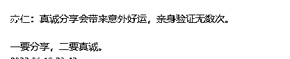

# 新人做好这一点，助你快速拿回门票钱

> 原文：[`www.yuque.com/for_lazy/thfiu8/sgvdngn1vqlp7crm`](https://www.yuque.com/for_lazy/thfiu8/sgvdngn1vqlp7crm)

<ne-h2 id="c60c414b" data-lake-id="c60c414b"><ne-heading-ext><ne-heading-anchor></ne-heading-anchor><ne-heading-fold></ne-heading-fold></ne-heading-ext><ne-heading-content><ne-text id="u6662f684">(73 赞)新人做好这一点，助你快速拿回门票钱</ne-text></ne-heading-content></ne-h2> <ne-p id="u852a3a5c" data-lake-id="u852a3a5c"><ne-text id="u237290c9">作者： 感遇</ne-text></ne-p> <ne-p id="uc35e9d8f" data-lake-id="uc35e9d8f"><ne-text id="u225b1a50">日期：2023-06-14</ne-text></ne-p> <ne-p id="u5aeebefd" data-lake-id="u5aeebefd"><ne-text id="ub5a0010c" ne-bold="true">大家好，我是感遇，感恩遇见的感遇。</ne-text><ne-text id="u564c223e">目前已经加入生财一年多了。</ne-text></ne-p> <ne-p id="u409291bc" data-lake-id="u409291bc"><ne-text id="ue5384f28" style="color: rgb(0, 0, 0);">在加入生财的这段时间里，我也经常思考，现在社群里的这些人，到底有多少人已经拿到了结果，或者说至少现在已经把门票钱赚回来了，这个数据可能就目前来看，生财官方都不一定统计的很准确。</ne-text></ne-p> <ne-p id="uc9b89d5d" data-lake-id="uc9b89d5d"><ne-text id="u5ac361ac" style="color: rgb(0, 0, 0);">那么，反过来我们再想，那些已经通过生财收回门票钱，或者是赚的再多一点点的这些人，他们又做了哪些事情。</ne-text></ne-p> <ne-p id="ud856c97e" data-lake-id="ud856c97e"><ne-text id="u075642b2" style="color: rgb(0, 0, 0);">所以，这次就不说超级大佬了，这次就讲讲我们这些相对来说普通一些，但是也拿到过小小结果的这些人。</ne-text></ne-p> <ne-p id="u74115d19" data-lake-id="u74115d19"><ne-text id="u63b8fbe7" style="color: rgb(0, 0, 0);">还是，本次</ne-text><ne-text id="u31c9538f">文章内容可能尚浅，但是如果你在看的过程中，有任何一个观点，一句话能够影响到你，那么我都不虚此行。</ne-text></ne-p> <ne-p id="uf37d557b" data-lake-id="uf37d557b"><ne-text id="u2a346a7c" ne-bold="true">注：整篇文章 2454 字，预计阅读 7 分钟。</ne-text></ne-p> <ne-p id="ud99510fe" data-lake-id="ud99510fe"><ne-text id="u195c5191">本次文章内容分为以下三个部分：</ne-text></ne-p> <ne-p id="u0b69fa73" data-lake-id="u0b69fa73"><ne-text id="u8bfa818a">1、对于新人来说，赚第一块钱的底层逻辑是什么？</ne-text></ne-p> <ne-p id="u679e5f06" data-lake-id="u679e5f06"><ne-text id="ud5c07f5c">2、我们拿什么交换，赚钱最稳？</ne-text></ne-p> <ne-p id="uf8421eac" data-lake-id="uf8421eac"><ne-text id="u68a6388a">3、如何利用好我们的专注力？</ne-text></ne-p> <ne-p id="uaddc32d2" data-lake-id="uaddc32d2"><ne-text id="u2c55d21e" ne-bold="true">一、对于新人来说，赚第一块钱的底层逻辑是什么？</ne-text></ne-p> <ne-p id="ue61adea7" data-lake-id="ue61adea7"><ne-text id="u170a9338" ne-bold="true">答案是“交换”。</ne-text></ne-p> <ne-p id="u74aa7bc2" data-lake-id="u74aa7bc2"><ne-text id="u7efb8aea">大家可能最近看了很多高大上的，刷新认知的知识，以至于到最后陷入被割韭菜的情境中。</ne-text></ne-p> <ne-p id="u5a59d795" data-lake-id="u5a59d795"><ne-text id="u91a6e7dd">所以这个时候，有些常识我们可能会忘记，因此有必要向大家再次提及：那就是</ne-text><ne-text id="u21fda2c4" ne-bold="true">天上不会掉馅饼，即使掉也是有毒的，它会杀掉你。</ne-text></ne-p> <ne-p id="u838527c2" data-lake-id="u838527c2"><ne-text id="uca4678c3">因为本质上，这个世界底层的运转逻辑是基于“交换”之上的，我们活在当下的每时每刻都在发生着交换。</ne-text></ne-p> <ne-p id="ude5fded1" data-lake-id="ude5fded1"><ne-text id="u6742e3e6">从我们的生活出发，就可以发现很多，比如：</ne-text></ne-p> <ne-p id="ue91110f3" data-lake-id="ue91110f3"><ne-text id="u3426eea0">你上班付出自己时间，劳动力可以获取一定的报酬，这是交换。</ne-text></ne-p> <ne-p id="u19b8dd1b" data-lake-id="u19b8dd1b"><ne-text id="uc7d874ff">我花时间写了一篇文章，现在你来看，我获得了你的注意力，这是交换。</ne-text></ne-p> <ne-p id="u53711130" data-lake-id="u53711130"><ne-text id="u0689f448">你花钱进入生财，看到了很多以前没见到过得项目，这是交换。</ne-text></ne-p> <ne-p id="u33080fe9" data-lake-id="u33080fe9"><ne-text id="u5cd63665">等等。</ne-text></ne-p> <ne-p id="ud4259583" data-lake-id="ud4259583"><ne-text id="uecd23665" ne-bold="true">所以，我们想要得到钱，就要找东西去换，没有付出就不会有回报。</ne-text></ne-p> <ne-p id="ub1bea306" data-lake-id="ub1bea306"><ne-text id="uef581d72">这个道理很简单。</ne-text></ne-p> <ne-p id="u21af0842" data-lake-id="u21af0842"><ne-text id="u92f8e951" ne-bold="true">二、我们拿什么交换，赚钱最稳？</ne-text></ne-p> <ne-p id="ua9ba406a" data-lake-id="ua9ba406a"><ne-text id="u977e82f3" ne-bold="true">答案是“专注力”。</ne-text></ne-p> <ne-p id="u5663be01" data-lake-id="u5663be01"><ne-text id="ue50a5971">为什么是专注力，很简单。</ne-text></ne-p> <ne-p id="u75b067a7" data-lake-id="u75b067a7"><ne-text id="u7ef2d649">还是从生活中的例子出发，比如：</ne-text></ne-p> <ne-p id="u7bdfd0aa" data-lake-id="u7bdfd0aa"><ne-text id="u7045dba1">你进入一个直播间，看到主播正在买一款产品，感觉非常好，于是打了一个评论：666。</ne-text></ne-p> <ne-p id="ub942c027" data-lake-id="ub942c027"><ne-text id="u516c6be5">这个直播间就多了一些活跃度，然后别人也进来，也打了一条“666”，然后又给这个直播间增加了一些活跃度。</ne-text></ne-p> <ne-p id="u4817c29b" data-lake-id="u4817c29b"><ne-text id="uad1d4b0a">随着直播间活跃度越来越高，进来的人也越来越多，到最后卖出去的产品也就越来越多。</ne-text></ne-p> <ne-p id="uea8cd002" data-lake-id="uea8cd002"><ne-text id="u558a21d5" ne-bold="true">所以你看到没，专注力是带有能量的，当我们专注到某个事物上的时候，我们就将能量输送给了它，然后就让它发生了一些我们感觉不到的改变</ne-text><ne-text id="uf2ed6cb4">。</ne-text></ne-p> <ne-p id="u92ab6299" data-lake-id="u92ab6299"><ne-text id="u4b8113d7">所以，掌握好我们专注力，把它用在最有用的地方，才会快速的帮我们赚到钱。</ne-text></ne-p> <ne-p id="uf062cdb4" data-lake-id="uf062cdb4"><ne-text id="uee2e9497" ne-bold="true">三、如何利用好我们的专注力？</ne-text></ne-p> <ne-p id="u1f909bb0" data-lake-id="u1f909bb0"><ne-text id="u7c5eab94" ne-bold="true">专注力的本质：专注力是一种不可再生资源，如果你这个时候在打游戏，那么注定你就不能同时做其他事情了。</ne-text></ne-p> <ne-p id="u1af9dc30" data-lake-id="u1af9dc30"><ne-text id="uba9323a0">所以，利用好我们的专注力，会让我们做事事半功倍。</ne-text></ne-p> <ne-p id="u55880d0e" data-lake-id="u55880d0e"><ne-text id="uab97dd0a">那么我们该如何做，我把我的做法分享给大家：</ne-text></ne-p> <ne-p id="u2b89a25f" data-lake-id="u2b89a25f"><ne-text id="u4482e7e7" ne-bold="true">第一步，寻找：掌控好你的时间，把</ne-text><ne-text id="u580959bd" ne-bold="true">专注力</ne-text><ne-text id="ub67f8604" ne-bold="true">花在寻找高质量的信息上。</ne-text></ne-p> <ne-p id="u23ce15f3" data-lake-id="u23ce15f3"><ne-text id="u90120227">什么是高质量的信息。在我看来，能够给你准确的讲清楚一个概念，一个项目。并且与之给到你足够多解释它的案例，助力我们更好的理解它。同时我们看完之后会产生之前从未有过的思考和启发等等，从而帮助提升我们的认知。</ne-text></ne-p> <ne-p id="u2d7cf28c" data-lake-id="u2d7cf28c"><ne-text id="ue9ef1108">这样的信息，我认为就算是一个好信息。</ne-text></ne-p> <ne-p id="u5bc891e1" data-lake-id="u5bc891e1"><ne-text id="u9b7eab3a">毫无疑问，生财算是一个具有高质量信息的地方了。我们把自己的时间多花一些在这里，至少比你天天打游戏，睡大觉是强的。</ne-text></ne-p> <ne-p id="u741b0691" data-lake-id="u741b0691"><ne-text id="u6a738b4c" ne-bold="true">第二步，学习：找到这些优质的信息，用</ne-text><ne-text id="u2d2bc813" ne-bold="true">专注力</ne-text><ne-text id="u794c9db5" ne-bold="true">去学习和思考。</ne-text></ne-p> <ne-p id="u2ba60c9b" data-lake-id="u2ba60c9b"><ne-text id="uf1ec1964">当我们找到了这些信息，我们下一步就要认真去学习了。如何学？</ne-text></ne-p> <ne-p id="u4ac9503b" data-lake-id="u4ac9503b"><ne-text id="u2ebc7436">不是看一遍就完事了，你要一遍又一遍的看，一遍又一遍的学，好好的看，反复的学，然后去思考我到底如何依靠这些知识和信息升级我的大脑，改变我做事的标准，养成良好的习惯等等。</ne-text></ne-p> <ne-p id="u5c323e4a" data-lake-id="u5c323e4a"><ne-text id="u311ec778">同时更重要地是，我们在努力的了解这个概念，项目的时候，一定要多追求这些信息的本质。</ne-text></ne-p> <ne-p id="u82878d56" data-lake-id="u82878d56"><ne-text id="udb270874">它的底层逻辑是什么，我该如何有效的迁移做好更多的事情等等。</ne-text></ne-p> <ne-p id="u8b2a683b" data-lake-id="u8b2a683b"><ne-text id="u42bc4787">这个问题需要我们不断的思考和清晰。</ne-text></ne-p> <ne-p id="ubd339e1d" data-lake-id="ubd339e1d"><ne-text id="u6fef583e" ne-bold="true">第三步，行动：学完之后落实到行动中去，</ne-text><ne-text id="ud20c5765" ne-bold="true">专注于</ne-text><ne-text id="u5a4c03ac" ne-bold="true">行动去检查，验证这些知识和信息。</ne-text></ne-p> <ne-p id="ud8c81238" data-lake-id="ud8c81238"><ne-text id="ufd49a09c">行动是治愈一切的良药，已经说过很多遍了。</ne-text></ne-p> <ne-p id="u41d7133a" data-lake-id="u41d7133a"><ne-text id="ud70d5c68">而如何正确的行动，几个小点再次给到大家：</ne-text></ne-p> <ne-p id="u3361ca34" data-lake-id="u3361ca34"><ne-text id="uba626781">1、你永远不可能完全准备好，我一般准备的差不多百分之六七十就开始动了。然后边做边思考，边改进，边完善。</ne-text></ne-p> <ne-p id="uc1b80d42" data-lake-id="uc1b80d42"><ne-text id="u0939af08">2、不懂就问，自己憋着永远解决不了问题。找大佬，找朋友，找同行，反正不管你找谁，一定要把问题尽快解决了。</ne-text></ne-p> <ne-p id="u675d52e2" data-lake-id="u675d52e2"><ne-text id="u4b33cb8e">同时别人帮你解决问题，你要付出一些东西进行“交换”，以表感谢。</ne-text></ne-p> <ne-p id="u6bb907c2" data-lake-id="u6bb907c2"><ne-text id="u7b2fac7b">3、坚持复盘，每天晚上临睡前复盘一下当天的工作情况，哪些做的好，哪些做的不好，明天如何改进等等，哪怕只有十几分钟，日积月累下去也会有很大的进步和成长。</ne-text></ne-p> <ne-p id="uc0d780bf" data-lake-id="uc0d780bf"><ne-text id="u7ae24d5c">4、始终保持思考，不断想新的方法进行尝试，不断向上迭代项目。普通人成为大佬，一定会持续做这件事的，因为只有这样，你才能从赚 1 块到赚 10 块，从 10 块赚到 100，从 100 赚到 10000。</ne-text></ne-p> <ne-p id="ua3dd618c" data-lake-id="ua3dd618c"><ne-text id="uf819f000">等等。</ne-text></ne-p> <ne-p id="ub0b72697" data-lake-id="ub0b72697"><ne-text id="ud42df4af">真的，我用自己的亲身经历告诉大家，当你真的开始行动起来之后，你会获得你远远想不到的知识和学问。</ne-text></ne-p> <ne-p id="ubc643a06" data-lake-id="ubc643a06"><ne-text id="ud4789e8c">而今天之所以能写这篇文章，也是因为自己是从这条路上一步步走过来的，虽然整个过程不是特别的难，但如果当初走错一步，可能就会绕很多的弯路。</ne-text></ne-p> <ne-p id="uf114dc0c" data-lake-id="uf114dc0c"><ne-text id="u78af0f97">所以，今天我把自己这段心路历程分享出来。还是那句话，可能文章内容整体尚浅，但是我还是愿意相信亦仁，相信生财大佬说过的：</ne-text><ne-text id="u095c4b65" ne-bold="true">越分享，越成长。</ne-text></ne-p> <ne-p id="ua556c3e4" data-lake-id="ua556c3e4"><ne-card data-card-name="image" data-card-type="inline" id="Q5Ol2" data-event-boundary="card">  <ne-p id="u6a0bc2b2" data-lake-id="u6a0bc2b2"><ne-text id="ub78bb4e9">希望这篇文章多多少少可以帮到大家，尤其是进入生财还没有开始赚钱的伙伴，希望你们能更快的至少把门票钱赚回来。</ne-text></ne-p> <ne-p id="u01122c7d" data-lake-id="u01122c7d"><ne-text id="u0ff641bd">同时，这也是我从自己的经历和过往出发来给大家分享的，如果大家有更好的赚到“第一块钱”的方法论，也欢迎大家和我一起交流和拆解。</ne-text></ne-p> <ne-p id="u13f906e1" data-lake-id="u13f906e1"><ne-text id="u67b65db8" ne-bold="true">最后的最后，我想说的是，所有成瘾的事物，都是经过长时间的重复堆砌而成的，通过不断的重复，我们才可以养成自己独特的属性。真正成为大众心目中不可取代的一部分，最后突破成长壁垒成为更强的人，到那个时候，顺便赚点钱就是很容易的事情了。</ne-text></ne-p> <ne-p id="u68517855" data-lake-id="u68517855"><ne-text id="uf42f9ce1">希望大家在成长赚钱的这条路上不要怕也不要停！</ne-text></ne-p> <ne-p id="u725ac7e4" data-lake-id="u725ac7e4"><ne-text id="u7ea3a4b9">2023 年，我们继续生财有术！</ne-text></ne-p> <ne-p id="ue08c10d6" data-lake-id="ue08c10d6"><ne-text id="u8154219f" ne-bold="true">小 tips:</ne-text></ne-p> <ne-p id="u32d6be82" data-lake-id="u32d6be82"><ne-text id="u06a04493" style="color: rgb(0, 0, 0);">我目前还是在职状态，前几个月通过以上路径，也是在闲鱼二手书项目上拿到了一个小小结果，虽然跟大佬没办法比，但也算是完成了从 0 到 1，至少门票钱回来了。之前分享过一篇文章，文章链接：</ne-text></ne-p> <ne-p id="u0219b4ea" data-lake-id="u0219b4ea">[<ne-text id="u65838ad1" ne-bold="true" ne-underline="true">https://t.zsxq.com/0eCkLrWGZ</ne-text>](https://t.zsxq.com/0eCkLrWGZ)</ne-p> <ne-p id="u8b582013" data-lake-id="u8b582013"><ne-text id="u1849df49" style="color: rgb(0, 0, 0);">同时之前还分享过一篇拆解大佬的文章，如果你现在已经拿到了一个结果，想要更快的进阶。希望我这篇文章能够帮到你。文章链接：</ne-text></ne-p> <ne-p id="u49e2e078" data-lake-id="u49e2e078">[<ne-text id="u9ca066f3" ne-bold="true" ne-underline="true">https://t.zsxq.com/0fxuZdvvj</ne-text>](https://t.zsxq.com/0fxuZdvvj)</ne-p> <ne-hole id="uaf38902d" data-lake-id="uaf38902d"><ne-card data-card-name="hr" data-card-type="block" id="fGoM7" data-event-boundary="card"><ne-p id="ua6654961" data-lake-id="ua6654961"><ne-text id="u1a3242ba">评论区：</ne-text></ne-p> <ne-p id="u074dcd19" data-lake-id="u074dcd19"><ne-text id="u483ffec1">安迪 : [强][强][强]</ne-text> <ne-text id="ue28b3e8f">饼干 : 厉害，准备弄脏手了，加油[奋斗]希望能和你一样取得点小成绩</ne-text> <ne-text id="u3bf1b3da">周彦充 : 标题不错，一看就想读，已经赚回门票，多评论也不错[得意]</ne-text> <ne-text id="u4c3048a8">番茄🍅 : 嗯...你挺爱评论的😂</ne-text></ne-p></ne-card></ne-hole></ne-card></ne-p>