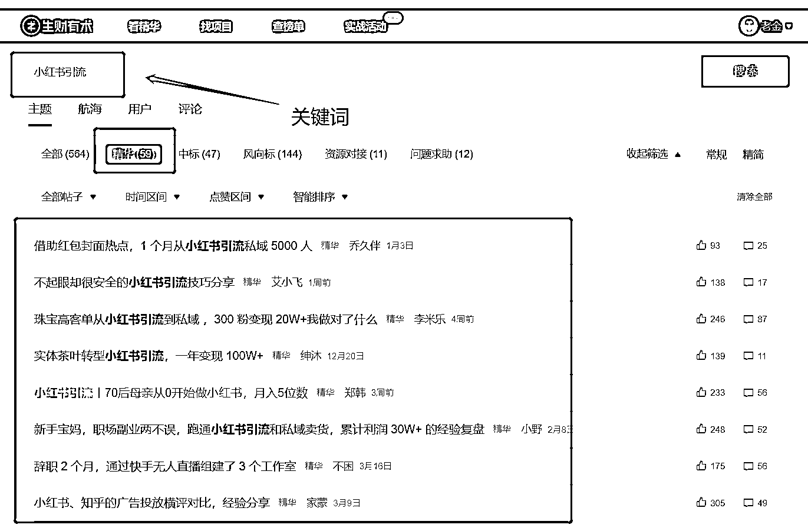
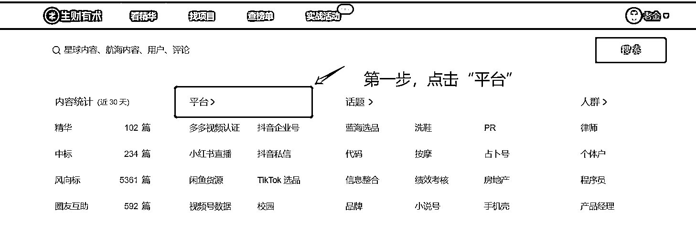
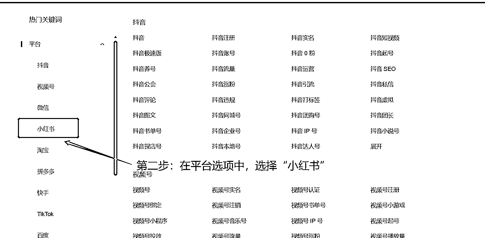

# 航海靠岸后错过续航项目怎么办？

> 原文：[`www.yuque.com/for_lazy/thfiu8/as17ft7342zgqrea`](https://www.yuque.com/for_lazy/thfiu8/as17ft7342zgqrea)

## (44 赞)航海靠岸后错过续航项目怎么办？ 

作者： 老金 

日期：2023-06-14 

昨天晚上的航海结营后，发现好多生财圈友和我一样，后悔一开始没有报名一些实战航海营 

 

尤其是张敬伟老师分享了在可续航项目中，拿到结果的优秀圈友案例后，更是恨不得能补票上船。 

可惜的是续航规则已定，这个是不可改变的，那是不是错过的圈友们，只能干耗时间等待下一次航海。 

其实早在有续航消息出来后，我自己也思考过，干等不是最好的办法，甚至于干等很容易让自己 21 天养成的好习惯，被等待的时间打回原形。（不要说不可能，大概率会躺平，继续刷刷生财精华帖，刷刷风向标，但不会下场实践）。 

相信不少圈友有类似这样的焦虑。 

不过这样的焦虑对于参加过本次航海的圈友来说，并不是难题，毕竟航海中几乎每个人都遇到不同的困难，最后不也靠岸了。 

上面说了不少废话（其实自己也不是很喜欢说大道理），下面直接分享下我自己的思路。 

第一步：借用目标管理中的“车日路”思维模型，列出自己的思路框架 

日（目标）：参加航海变现项目； 

车（当下可准备的）： 

1、选择好想参加的航海变现项目（围绕这次续航的 9 个项目）； 

2、生财项目库找匹配的细分项目 

路（当下最快能行动的事）： 

1、提前预习（看想参加航海的手册、高手分享） 

2、提前收集对应项目的资料（方法论——生财有术索引 2.0 搜索航海名称关键词） 

比如说，想报名小红书运营航海，那么除了航海手册，还可以在生财的索引站 2.0 中，搜索关键词“小红书运营”、“小红书引流”等，优先锁定精华帖，如图： 

  

关于还有哪些和小红书有关的关键词，还可以直接看生财有关小红书的热门话题，具体怎么操作，看下图： 

  

  

  

3、提前规划好自己航海学习实战计划。 

备注说明： 

1、车日路思维模型的官方定义，并不是括号中的解释，而是根据自己实际需求，做了自己能看懂的解读。有兴趣的圈友可以直接搜索“车日路思维模型” 

2、可能有的圈友会想，我的目标就是变现，参加航海的目的也是变现，所以目标应该是变现。但这里是有个逻辑的点。这个逻辑点可以和自己做次对话： <ne-quote id="udf144545" data-lake-id="udf144545">

所以变现的核心问题就是：成功报名航海变现项目，对应的“日”就有了参加航海变现项目； 

第二步：根据“路”（当下最快能行动的事），开始提前预习规划。 

那么问题又来了，怎么预习呢？可以再次和自己对话 

当自己和自己通过上面 6 个对话，大概率会有一个行动的驱动力，说白了就是，会思考如何规划预习。 

为了方便像我一样的新圈友有个大概得思路，以“小红书运营”航海变现项目为例，分享一份规划的《航海学习实战攻略》图。 

这个攻略的制作起因是，来源于自己询问自己，如果重新参加航海，会怎么做。 

  

写在最后：以上就是一些心得感悟，也缓解了错过了续航项目的焦虑，也希望可以给到和我一样的新圈友一些启发。 

评论区： 

周彦充 : 真的想做，直接做就行，也能看海航手册，高手分享，精选日记。[得意] 夏夜， : 张敬伟老师→张静伟老师 老金 : 写错了，张静伟老师，实在抱歉[捂脸] 梨落 : 我报的 都可以续航[尴尬] 老金 : [尴尬]只能羡慕下了 老金 : 😂 张静伟@生财有术 : [呲牙]没事啦，都自己人，咋叫都行 老金 : [抱拳][抱拳][抱拳]😂</ne-quote>