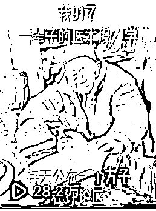

# 账号如何快速涨粉过 1000，告诉你一个万能公式

> 原文：[`www.yuque.com/for_lazy/thfiu8/ivslr04lw5eobuwo`](https://www.yuque.com/for_lazy/thfiu8/ivslr04lw5eobuwo)

<ne-h2 id="cea65440" data-lake-id="cea65440"><ne-heading-ext><ne-heading-anchor></ne-heading-anchor><ne-heading-fold></ne-heading-fold></ne-heading-ext><ne-heading-content><ne-text id="u86f57b20">(286 赞)账号如何快速涨粉过 1000，告诉你一个万能公式</ne-text></ne-heading-content></ne-h2> <ne-p id="u93476136" data-lake-id="u93476136"><ne-text id="ud25d496e">作者： 张集慧</ne-text></ne-p> <ne-p id="u917d71dc" data-lake-id="u917d71dc"><ne-text id="u7f32f6d7">日期：2023-06-14</ne-text></ne-p> <ne-p id="u2231a3b7" data-lake-id="u2231a3b7"><ne-text id="uf4386aeb">快速涨粉的方法是有的，这个稍后展开讲，我想先聊一下这位圈友遇到的问题，觉得自己拿不到结果，是因为 1000 粉这个门槛拦住了自己，自己无法施展赚钱的技能，只要过了这个坎，前面就是一片坦途了，其实这个想法就是错的。</ne-text></ne-p> <ne-p id="u87cb91fc" data-lake-id="u87cb91fc"><ne-text id="u60833b7e">从平台角度，不设置门槛，所有人上来直接就都来带货不是更好么？带货的人越多，卖的越多，赚钱越多，为什么要设置 1000 粉的门槛呢？因为没有门槛，会进来很多无效带货达人，虽然有了带货权限，但是根本带不了货，增加的这些人，反而多了很多审核，管理的成本，对于平台来说，是亏本的生意，于是出现了 1000 粉的门槛。</ne-text></ne-p> <ne-p id="u428be767" data-lake-id="u428be767"><ne-text id="ufe7178d6">那么对于达人来说，是不是没有门槛，就完美了呢？其实也不是，你连 1000 个免费的关注你都没有能力得到，你怎么会有信心开了橱窗，就能卖的出去货，从消费者兜里掏的出真金白银呢？我经常举个例子，你一个幼儿园小朋友，给你娶个媳妇，你有这个权限了，你有那个能力么？</ne-text></ne-p> <ne-p id="u2785f085" data-lake-id="u2785f085"><ne-text id="ua3ef5977">前面积累千粉，不是一个浪费时间的无用功，你要用这段时间去了解平台，了解内容，了解你的目标人群，你的每个视频，每个播放，每个评论，都是你的内容在和用户互动，你只有通过内容这个媒介去触达用户，了解用户，你过了千粉后，你才知道他们的喜好，你才知道某个品，怎么能打动他们，最终让他们买单，这个过程是必不可少的，一定要经历的。</ne-text></ne-p> <ne-hole id="u2f00bfd7" data-lake-id="u2f00bfd7"><ne-card data-card-name="hr" data-card-type="block" id="uKRx4" data-event-boundary="card"><ne-p id="ua78dadfa" data-lake-id="ua78dadfa"><ne-text id="uf532e47c">废话讲完了，进入正题，如何快速涨粉？</ne-text></ne-p> <ne-p id="u71392c71" data-lake-id="u71392c71"><ne-text id="ua1ef21cc" ne-bold="true">1、刷粉</ne-text> <ne-text id="uaae33e08">圈友的那篇帖子下面，有人提到了去刷粉，刷粉是个办法，能马上到千粉，也能有资格去开窗，但是有个问题，就像我上面提到的，你有了这个权限，开始带货，马上又会遇到带货视频没播放量，不出单的问题，因为你完全不知道该怎么做内容，那你接着该问的问题就是带货视频怎么涨播放量，那就会有人告你，投 dou+，投千川，你一个没任何经验的小白，去 dou+,千川，大概率会亏的裤衩子都不剩，最后抱怨又被人割韭菜了，因为你一开始的方向，选择的就是韭菜地。</ne-text></ne-p> <ne-p id="u6e9e272e" data-lake-id="u6e9e272e"><ne-text id="ua87ef5ad">账号刷粉，也不是一无是处，是有特例的，比如你做这个类目已经很久了，已经对用户，对产品很了解了，自己已经做起来很多号，只要开了橱窗，就能很快出单的情况下，为了避开账号自然增长千粉时间的不确定性，去刷粉，那是可以的，就好比一个老电工，他知道带电操作危险，但是他熟练了啊，知道怎样规避风险，也知道被电了的后果是啥，他对于风险是大概率可控的，他就选择带电操作，新人当然不能学他了。</ne-text></ne-p> <ne-p id="uaa15320c" data-lake-id="uaa15320c"><ne-text id="u994e43f9" ne-bold="true">2、内容涨粉</ne-text></ne-p> <ne-p id="ud5f0a67d" data-lake-id="ud5f0a67d"><ne-text id="u16015c32">经常会听到大佬说内容为王，早期做抖音时候，觉得这句话虚无缥缈的，一点都不实在，等自己做的时间久了，做的账号多了以后发现，所有的花架子，技巧，在内容面前，都是纸老虎，有些小技巧，可能运气好涨点粉，但是在真正好的内容面前，简直不值得一提。</ne-text></ne-p> <ne-p id="u6aaefeb5" data-lake-id="u6aaefeb5"><ne-text id="u2bd3f71b" ne-bold="true">涨粉内容有两个维度=有情绪的内容（有播放量）+有价值的勾子（有关注你的动机）</ne-text></ne-p> <ne-p id="ufef0a8ae" data-lake-id="ufef0a8ae"><ne-text id="u22f19ca0" ne-bold="true">1、情绪内容</ne-text></ne-p> <ne-p id="u106962ad" data-lake-id="u106962ad"><ne-text id="u42f7fd68">先说有情绪的内容，为什么内容要带情绪才行呢？因为你和屏幕对面的用户，中间隔着万水千山，你要让他给你点赞，给你评论，给你点关注，你的“控制”他啊，你隔着屏幕又没法对他动手动脚，但是呢可以用你发布的内容，去控制他的情绪，让他的情绪左右他的行为，不管是喜怒哀乐哪一种，只要调动了他的情绪，就可以了，但要注意一点，是调动用户的情绪，你要了解你对面的用户真正对什么内容感兴趣，而不是你自己做点内容，自己热血，自己激动半天，用户看了一点反应都没有，那也白搭。</ne-text></ne-p> <ne-p id="u38490682" data-lake-id="u38490682"><ne-text id="u67cdee44">如果看过我以前的文章的话，应该会了解，有情绪的内容，点赞，评论等等数据就会不错，这些数据不错，平台才会给你更多的流量，有大流量的基础上，才能有更进一步的关注人数。</ne-text></ne-p> <ne-p id="uc08c951b" data-lake-id="uc08c951b"><ne-text id="u4f254e93" ne-bold="true">2、有价值的勾子</ne-text></ne-p> <ne-p id="uc78a8852" data-lake-id="uc78a8852"><ne-text id="uf61fb02d">接下来说一下有价值的勾子，用户看到你的视频，从互动的角度来说有几个表现，越往后，说明他越感兴趣。</ne-text></ne-p> <ne-p id="u1d1d2b10" data-lake-id="u1d1d2b10"><ne-text id="ua93ef34d" ne-bold="true">直接划走<点赞<评论<关注</ne-text></ne-p> <ne-p id="uc60beebb" data-lake-id="uc60beebb"><ne-text id="ua993d53e">点个赞，可能一秒不到，对你表示认可。 评论一句，可能几十秒，对你的认可进一步加深</ne-text></ne-p> <ne-p id="ub772839c" data-lake-id="ub772839c"><ne-text id="u5188c898">点个关注，我愿意在你看你更多的内容，在你身上花费更多的时间，只有你有价值，作为用户，才愿意在你身上浪费更多的时间，才会去关注你，那么什么是有价值呢？</ne-text></ne-p> <ne-p id="ud248b165" data-lake-id="ud248b165"><ne-text id="u9e03f03d">不同的内容，对面不同的人群，价值也不同，所以这个有价值的勾子，不是一成不变的。</ne-text></ne-p> <ne-p id="u715ed3b6" data-lake-id="u715ed3b6"><ne-text id="u943a582b">一个分享小学知识的号，他分享的数学公式，英语词汇，语文优美句子，作为家长，我看了一条，我还想看 10 条，100 条，我不想错过，那么我就关注你。</ne-text></ne-p> <ne-p id="u32aac0e7" data-lake-id="u32aac0e7"><ne-text id="uc4972f94">一个电影解说的号，一部电影解说，吸引住了观众，喜欢解说的诙谐幽默，看了一条视频，还想看 10 条，100 条，不想错过，就关注了。</ne-text></ne-p> <ne-hole id="u84d55d24" data-lake-id="u84d55d24"><ne-card data-card-name="hr" data-card-type="block" id="xxy3U" data-event-boundary="card"><ne-p id="ud0c6587c" data-lake-id="ud0c6587c"><ne-text id="u836dc7ac">理论总是枯燥的，下面我会拿验证过的视频实际案例来做拆解？</ne-text></ne-p> <ne-p id="u85edb392" data-lake-id="u85edb392"><ne-card data-card-name="image" data-card-type="inline" id="D72VN" data-event-boundary="card"><ne-card data-card-name="image" data-card-type="inline" id="lN3hR" data-event-boundary="card"><ne-card data-card-name="image" data-card-type="inline" id="mTerI" data-event-boundary="card">  <ne-p id="u4af636b8" data-lake-id="u4af636b8"><ne-card data-card-name="image" data-card-type="inline" id="YVazc" data-event-boundary="card">  <ne-p id="u14c5ff09" data-lake-id="u14c5ff09"><ne-text id="u38209bd6">上图这个爆款，是一个 7-8 秒的视频，核心就是两个模块：一个看着上了年纪的大爷，另一个就是那 4 句文案。</ne-text></ne-p> <ne-p id="u7320450c" data-lake-id="u7320450c"><ne-text id="u0a6baf08" ne-bold="true">1、画面的作用（大爷的作用）</ne-text></ne-p> <ne-p id="uab3516f8" data-lake-id="uab3516f8"><ne-text id="u65cf1fb3">画面主要是起一个烘托场景的作用，给人一种代入感，一看就是老中医，有两下子，这里面的大爷，你不是老中医素材，只要是一个看着有那么点气质独特的老人其实就可以，他没有实际的作用。</ne-text></ne-p> <ne-p id="u01f4379d" data-lake-id="u01f4379d"><ne-text id="u31e8b7b5" ne-bold="true">2、3 句文案的作用</ne-text></ne-p> <ne-p id="u07c38068" data-lake-id="u07c38068"><ne-text id="u58d231b8">这三句文案，看着是 4 句话，他其实是两部分，前面两句，“XX 岁了，医术无人继承”，就是制造一个话题，中医没落了，老中医，好中医要失传了，喜欢中医的人，此刻的情绪就被调动了起来，就会围绕这个有冲突的话题，点赞，或者评论，这样这个视频的数据就很容易爆起来，十几万，几十万，甚至最高到 477w，而且是大概率可以做到的，不信的话，你看到这篇文章，你也可以去剪一个这样的视频，随便找个抖音号发一下试试，看看能有多少播放。</ne-text></ne-p> <ne-p id="u8c7e3154" data-lake-id="u8c7e3154"><ne-text id="u259a7428">虽然情绪调动起来了，播放量也起来了，但是光靠这两句文案是不可能涨粉的，因为这里面没有用户关注的点，他没有关注你的理由，于是，我们进一步去设计勾子，打了窝，吸引来了鱼，我们就准备下钩子了。</ne-text></ne-p> <ne-p id="u9a308504" data-lake-id="u9a308504"><ne-text id="u10209aa6">后面两句“每天公布一个方子，放评论区”，这句话是让人关注的核心，90 多岁老中医，手里的方子，那一定是很好的东西，每天还要公布一个，那我可不能错过，我先关注了他，要不然明天我都找不到他了，就会错过这些珍贵的方子，很多人，其实也不是真正需要方子，很多时候就是贪便宜，可能他关注了你，第二天早忘了这回事了，但是，只要你的策略吸引到他，让他关注了你，就达到了目的。</ne-text></ne-p> <ne-hole id="uae54f002" data-lake-id="uae54f002"><ne-card data-card-name="hr" data-card-type="block" id="LYRxu" data-event-boundary="card"><ne-p id="u0a97f97c" data-lake-id="u0a97f97c"><ne-text id="u2cb17c21">这样看来，是不是一个高播放，高转化的视频也不是那么难啊，但是真正难的地方，我要放在最后来说，可能大家也猜到了，难的地方是如何找到自己目标用户真正关注的点，挖出来他们的需求，才能找到这个“大爷”以及和他匹配的“4 句话”，要想找到这种看着很简单又很有效的素材+文案，就需要你研究足够多的对标账号，静下心来了解你的目标人群，不断的去找素材，写文案，去测试，去看他们的反馈，不对的修正，最后，你也可以找到你的类目里面的涨粉万能公式。</ne-text></ne-p> <ne-p id="u850a6e6d" data-lake-id="u850a6e6d"><ne-text id="uc39d2260">我是慧姐，欢迎大家一起来探讨、挖掘出各自领域的爆款文案、爆款素材。</ne-text></ne-p> <ne-p id="u26cad536" data-lake-id="u26cad536"><ne-text id="uc4d88a96">如果大家喜欢我的拆解，点赞破 100，那么下期继续拆解千粉后的带货视频，如何挖出高转化素材以及文案。</ne-text></ne-p> <ne-hole id="u499712fc" data-lake-id="u499712fc"><ne-card data-card-name="hr" data-card-type="block" id="IpAxN" data-event-boundary="card"><ne-p id="ue0571f9f" data-lake-id="ue0571f9f"><ne-text id="ua4fbf31f">评论区：</ne-text></ne-p> <ne-p id="ufcb9933e" data-lake-id="ufcb9933e"><ne-text id="ucce6b462">小花 : 慧姐是神，我先磕一个🙏</ne-text> <ne-text id="uc355d0d5">张集慧 : 😂</ne-text> <ne-text id="u37cc5751">万简 : 倪师在抖音被限流了吗？</ne-text> <ne-text id="u9a2c786d">田新一 : 慧姐 yyds</ne-text> <ne-text id="ua2364663">Andy : 涨粉软件一周时间千粉妥妥的起[呲牙]</ne-text> <ne-text id="ufcabdcfa">+龙 : 刷粉？</ne-text> <ne-text id="u6ee7f43b">Andy : 不是刷的 类似于互粉的原理，粉丝都是真实的 只是粉丝标签比较乱，</ne-text> <ne-text id="uf180d17d">翰飞 : 牛🐮，今天就发 10 条，尝试一下</ne-text></ne-p></ne-card></ne-hole></ne-card></ne-hole></ne-card></ne-p></ne-card></ne-card></ne-card></ne-p></ne-card></ne-hole></ne-card></ne-hole>