# 从 ChatGPT 超级写手 1.0 到内容工厂 1.0

> 原文：[`www.yuque.com/for_lazy/thfiu8/kxprmqkguai83gs0`](https://www.yuque.com/for_lazy/thfiu8/kxprmqkguai83gs0)

<ne-h2 id="76bcc32b" data-lake-id="76bcc32b"><ne-heading-ext><ne-heading-anchor></ne-heading-anchor><ne-heading-fold></ne-heading-fold></ne-heading-ext><ne-heading-content><ne-text id="u59cc269e">(45 赞)从 ChatGPT 超级写手 1.0 到内容工厂 1.0</ne-text></ne-heading-content></ne-h2> <ne-p id="u7b09c36c" data-lake-id="u7b09c36c"><ne-text id="ubabea654">作者： 渣渣浩</ne-text></ne-p> <ne-p id="u9478c704" data-lake-id="u9478c704"><ne-text id="u4a0fa9f7">日期：2023-06-16</ne-text></ne-p> <ne-p id="u5085cd8e" data-lake-id="u5085cd8e"><ne-text id="u059ce3bf">前面，开源了</ne-text><ne-text id="u4fc797e8" ne-bold="true">chatgpt 超级写手</ne-text> [<ne-text id="u316beafe">https://t.zsxq.com/0fC5e4Pkn</ne-text>](https://t.zsxq.com/0fC5e4Pkn) <ne-text id="ub7022447">，并且提供了保姆式的手把手教程，</ne-text></ne-p> <ne-p id="ud6962716" data-lake-id="ud6962716"><ne-text id="u43097b03">因为确实跟装微信和 QQ 一样，一路下一步即可。</ne-text></ne-p> <ne-p id="ue9648e98" data-lake-id="ue9648e98"><ne-text id="u2a88fa17">今天给大家讲下内容工厂。</ne-text></ne-p> <ne-p id="ue8210c4b" data-lake-id="ue8210c4b"><ne-text id="u7d1111e8" ne-bold="true">主要从下面几个方面构成：</ne-text></ne-p> <ne-p id="uefcd9a67" data-lake-id="uefcd9a67"><ne-text id="u97b42bb5" ne-bold="true">1.内容工厂的构成</ne-text></ne-p> <ne-p id="uc433c0ae" data-lake-id="uc433c0ae"><ne-text id="u8b284440" ne-bold="true">2.内容工厂的源码</ne-text></ne-p> <ne-p id="u721f2789" data-lake-id="u721f2789"><ne-text id="u52bdf602" ne-bold="true">3.内容工厂的运行逻辑</ne-text></ne-p> <ne-p id="u06df5388" data-lake-id="u06df5388"><ne-text id="u5e1abd53" ne-bold="true">4.如何用内容工厂选品</ne-text></ne-p> <ne-p id="u8d902b74" data-lake-id="u8d902b74"><ne-text id="u8235be8f" ne-bold="true">5.如何用内容工厂去升级视频带货玩法</ne-text></ne-p> <ne-p id="u51b93c43" data-lake-id="u51b93c43"><ne-text id="ub0a47e0e" ne-bold="true">6.如何控制好心态，玩好内容工厂</ne-text></ne-p> <ne-h1 id="ec8f0819" data-lake-id="ec8f0819"><ne-heading-ext><ne-heading-anchor></ne-heading-anchor><ne-heading-fold></ne-heading-fold></ne-heading-ext><ne-heading-content><ne-text id="u1d23a37b">一.内容工厂的构成</ne-text></ne-heading-content></ne-h1> <ne-p id="uc05a0ad6" data-lake-id="uc05a0ad6"><ne-card data-card-name="image" data-card-type="inline" id="oE8dw" data-event-boundary="card"></ne-card></ne-p> <ne-p id="u76ea6933" data-lake-id="u76ea6933"><ne-card data-card-name="image" data-card-type="inline" id="EkYll" data-event-boundary="card">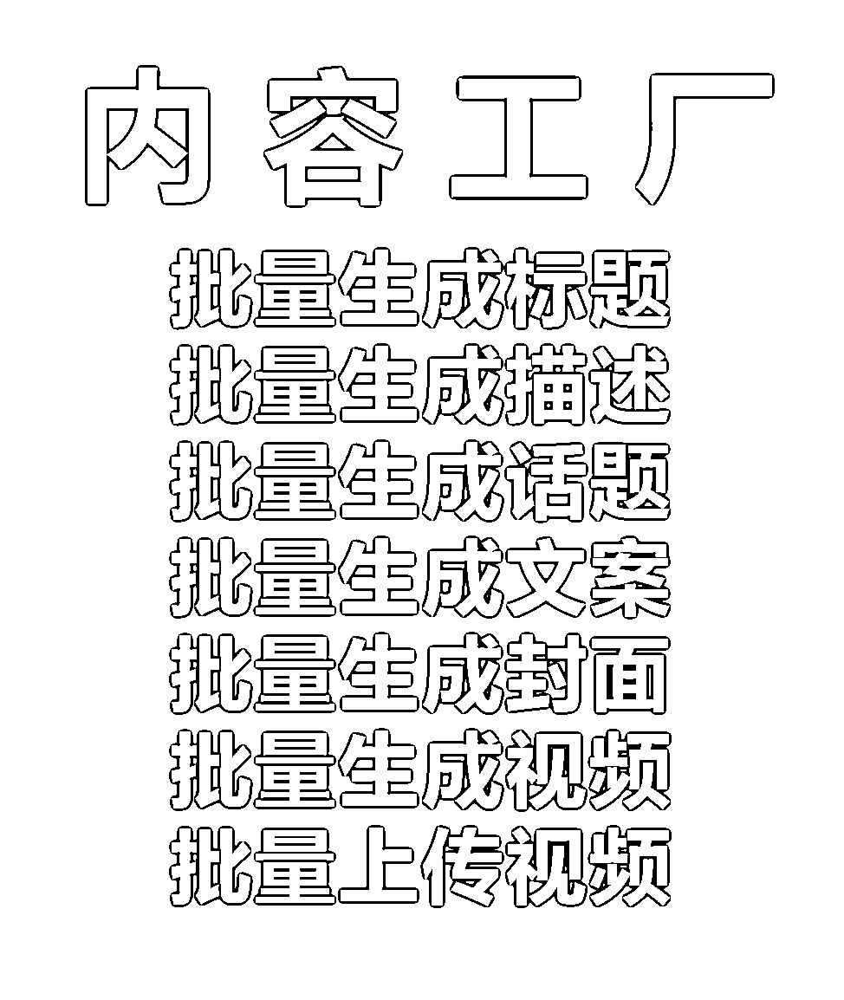</ne-card></ne-p> <ne-h2 id="9039450f" data-lake-id="9039450f"><ne-heading-ext><ne-heading-anchor></ne-heading-anchor><ne-heading-fold></ne-heading-fold></ne-heading-ext> <ne-heading-content></ne-heading-content></ne-h2> <ne-h2 id="9039450f-1" data-lake-id="9039450f-1"><ne-heading-ext><ne-heading-anchor></ne-heading-anchor><ne-heading-fold></ne-heading-fold></ne-heading-ext> <ne-heading-content></ne-heading-content></ne-h2> <ne-h2 id="9039450f-2" data-lake-id="9039450f-2"><ne-heading-ext><ne-heading-anchor></ne-heading-anchor><ne-heading-fold></ne-heading-fold></ne-heading-ext> <ne-heading-content></ne-heading-content></ne-h2> <ne-h2 id="9039450f-3" data-lake-id="9039450f-3"><ne-heading-ext><ne-heading-anchor></ne-heading-anchor><ne-heading-fold></ne-heading-fold></ne-heading-ext> <ne-heading-content></ne-heading-content></ne-h2> <ne-h2 id="9039450f-4" data-lake-id="9039450f-4"><ne-heading-ext><ne-heading-anchor></ne-heading-anchor><ne-heading-fold></ne-heading-fold></ne-heading-ext> <ne-heading-content></ne-heading-content></ne-h2> <ne-h2 id="9039450f-5" data-lake-id="9039450f-5"><ne-heading-ext><ne-heading-anchor></ne-heading-anchor><ne-heading-fold></ne-heading-fold></ne-heading-ext> <ne-heading-content></ne-heading-content></ne-h2> <ne-h2 id="9039450f-6" data-lake-id="9039450f-6"><ne-heading-ext><ne-heading-anchor></ne-heading-anchor><ne-heading-fold></ne-heading-fold></ne-heading-ext> <ne-heading-content></ne-heading-content></ne-h2> <ne-h2 id="9039450f-7" data-lake-id="9039450f-7"><ne-heading-ext><ne-heading-anchor></ne-heading-anchor><ne-heading-fold></ne-heading-fold></ne-heading-ext> <ne-heading-content></ne-heading-content></ne-h2> <ne-h2 id="9039450f-8" data-lake-id="9039450f-8"><ne-heading-ext><ne-heading-anchor></ne-heading-anchor><ne-heading-fold></ne-heading-fold></ne-heading-ext> <ne-heading-content></ne-heading-content></ne-h2> <ne-h2 id="749b59b5" data-lake-id="749b59b5"><ne-heading-ext><ne-heading-anchor></ne-heading-anchor><ne-heading-fold></ne-heading-fold></ne-heading-ext><ne-heading-content><ne-text id="udb053560">1.批量生成标题，描述，话题，文案</ne-text></ne-heading-content></ne-h2> <ne-p id="u9f7ade75" data-lake-id="u9f7ade75"><ne-text id="u174d4ea8">原有的 chatpgt 超级写手的内容</ne-text></ne-p> <ne-h2 id="c03d75f9" data-lake-id="c03d75f9"><ne-heading-ext><ne-heading-anchor></ne-heading-anchor><ne-heading-fold></ne-heading-fold></ne-heading-ext><ne-heading-content><ne-text id="u09fe207f">2.批量生成封面</ne-text></ne-heading-content></ne-h2> <ne-p id="u733b92bf" data-lake-id="u733b92bf"><ne-text id="u6d59c62a">原有的小红书排版机器人，简单版</ne-text></ne-p> <ne-h2 id="98957dc9" data-lake-id="98957dc9"><ne-heading-ext><ne-heading-anchor></ne-heading-anchor><ne-heading-fold></ne-heading-fold></ne-heading-ext><ne-heading-content><ne-text id="u4d3747bb">3.批量生成视频</ne-text></ne-heading-content></ne-h2> <ne-h2 id="d2917380" data-lake-id="d2917380"><ne-heading-ext><ne-heading-anchor></ne-heading-anchor><ne-heading-fold></ne-heading-fold></ne-heading-ext><ne-heading-content><ne-text id="ube6a338f">4.批量上传视频</ne-text></ne-heading-content></ne-h2> <ne-p id="u46d51c66" data-lake-id="u46d51c66"><ne-text id="uaffa9fde">原有的多平台视频上传机器人</ne-text></ne-p> <ne-h1 id="6c62faff" data-lake-id="6c62faff"><ne-heading-ext><ne-heading-anchor></ne-heading-anchor><ne-heading-fold></ne-heading-fold></ne-heading-ext><ne-heading-content><ne-text id="u4d2b3959">二.内容工厂的源码</ne-text></ne-heading-content></ne-h1> <ne-p id="u7e145448" data-lake-id="u7e145448">[<ne-text id="u343eba8b">源码合集</ne-text>](https://q3e80zdt6i.feishu.cn/docx/Pg26dN6vvoMORCxUaYxc5InPnme)</ne-p> <ne-p id="u9848a4f0" data-lake-id="u9848a4f0"><ne-text id="u7e3fb5be">几乎所有的 chatgpt 类工具，背后不过都是一张装有 prompt 的表单，喂给 chatgpt，网页和表单的交互，</ne-text></ne-p> <ne-p id="u3e27a269" data-lake-id="u3e27a269"><ne-text id="u8e747963">套了个壳，换了身衣服而已。</ne-text></ne-p> <ne-p id="ub543a1f5" data-lake-id="ub543a1f5"><ne-text id="u7ed3897a">把复杂的问题，拆分一下，变成简单的问题即可。</ne-text></ne-p> <ne-p id="u94cd6f8c" data-lake-id="u94cd6f8c"><ne-text id="u3dadc78f">技术极其简单，困难的是流程的梳理，以及各种综合场景的处理。</ne-text></ne-p> <ne-p id="u756c8d8e" data-lake-id="u756c8d8e"><ne-text id="u1d83562e">从使用者的角度来说，并不是所有的人都需要去学习如何配置机器人。</ne-text></ne-p> <ne-p id="u916ee318" data-lake-id="u916ee318"><ne-text id="u7b77c8da">复制粘贴，遇到问题，提出问题，解决问题即可。</ne-text></ne-p> <ne-p id="u024169c1" data-lake-id="u024169c1"><ne-text id="uf60f0d74">大部分时候，仅仅需要重新选择一下目标即可，不同的电脑环境需要对着原有机器人的图片，重新识别一下即可。</ne-text></ne-p> <ne-p id="u0054b9df" data-lake-id="u0054b9df"><ne-text id="u2335ba47">比如点击发布按钮，在自己的电脑上再重新识别选中发布按钮。</ne-text></ne-p> <ne-p id="uef876d3a" data-lake-id="uef876d3a"><ne-card data-card-name="image" data-card-type="inline" id="RaxTl" data-event-boundary="card"></ne-card></ne-p> <ne-p id="ubcd78f1c" data-lake-id="ubcd78f1c"><ne-text id="uac5692ef">技术是数不胜数的，找技术也很容易，但找靠谱的技术难。</ne-text></ne-p> <ne-p id="u39716e5a" data-lake-id="u39716e5a"><ne-text id="u64f12169">和你招人一样，招人是很容易的，但是招靠谱的人难。</ne-text></ne-p> <ne-p id="u3aa01c9a" data-lake-id="u3aa01c9a"><ne-text id="ucc665cf8">你今天喊他一声，他能答应你，半年，一年，甚至两年。</ne-text></ne-p> <ne-p id="u6b669e90" data-lake-id="u6b669e90"><ne-text id="u00bc9a67">钱都收了很久了，你再喊他一声，他还能答应就很难了。</ne-text></ne-p> <ne-p id="u38eb9133" data-lake-id="u38eb9133"><ne-text id="ub4f950f4">即便他答应，你也未必好意思，交付并没有那么长的周期。</ne-text></ne-p> <ne-p id="uc996cac8" data-lake-id="uc996cac8"><ne-text id="ua995ff51">但平台和风口又是不断变化的。</ne-text></ne-p> <ne-h1 id="cbc79bff" data-lake-id="cbc79bff"><ne-heading-ext><ne-heading-anchor></ne-heading-anchor><ne-heading-fold></ne-heading-fold></ne-heading-ext><ne-heading-content><ne-text id="uda7a612e">三.内容工厂的运行逻辑</ne-text></ne-heading-content></ne-h1> <ne-h3 id="067cab60" data-lake-id="067cab60"><ne-heading-ext><ne-heading-anchor></ne-heading-anchor><ne-heading-fold></ne-heading-fold></ne-heading-ext><ne-heading-content><ne-text id="u5b930b9e">3.1 内容工厂的作用</ne-text></ne-heading-content></ne-h3> <ne-p id="u2392d4cb" data-lake-id="u2392d4cb"><ne-text id="u20457e95">一个有项目的人，去花大量时间学技术，确实是避重就轻，捡了芝麻丢了西瓜。</ne-text></ne-p> <ne-p id="u7ddf8abb" data-lake-id="u7ddf8abb"><ne-text id="u3cd332a8">但是 chatgpt 超级写手 1.0 和内容工厂 1.0 不是什么技术，文末我会给出全套教程，以及可能遇到的问题，</ne-text></ne-p> <ne-p id="u55342c8b" data-lake-id="u55342c8b"><ne-text id="u81d7cb37">持续优化后，最终将像安装微信和 QQ 一样，一路畅通无阻。</ne-text></ne-p> <ne-p id="u2c7fe38f" data-lake-id="u2c7fe38f"><ne-text id="u76017278" ne-bold="true">技术只能锦上添花，无明天雪中送炭。</ne-text></ne-p> <ne-p id="uf5a36986" data-lake-id="uf5a36986"><ne-text id="uea2a2f35" ne-bold="true">内容工厂只能解决从 1 到 100 的问题解决不了从 0 到 1 的问题。</ne-text></ne-p> <ne-p id="ub0bfbd5a" data-lake-id="ub0bfbd5a"><ne-text id="u98c1265b">但是，所有的工具，都是有结果的人的个性化需求，</ne-text></ne-p> <ne-p id="ud090eae0" data-lake-id="ud090eae0"><ne-text id="u74e6b68f">他不大可能说花大量的时间，精力和金钱做出来好玩。</ne-text></ne-p> <ne-p id="u77f0df6c" data-lake-id="u77f0df6c"><ne-text id="u71c51594">从工具的角度，你能从不一样的视角去了解项目，挖掘项目。</ne-text></ne-p> <ne-p id="u6e10d000" data-lake-id="u6e10d000"><ne-text id="u52f87691">只有拿到结果的人，才会去用工具放大。</ne-text></ne-p> <ne-p id="u768a579f" data-lake-id="u768a579f"><ne-text id="ue3f3f70a">手动都够呛的话，想都想不到工具那去，</ne-text></ne-p> <ne-p id="u02b317ef" data-lake-id="u02b317ef"><ne-text id="u1482d00f">即便想到，他怎么舍得把自己好不容易，</ne-text></ne-p> <ne-p id="uced7fb3d" data-lake-id="uced7fb3d"><ne-text id="ue61d8370">辛辛苦苦研究出来的流程，</ne-text></ne-p> <ne-p id="ub732cac8" data-lake-id="ub732cac8"><ne-text id="uba9f27ab">一步步的描述出来，提供给一个完全不认识的陌生人？</ne-text></ne-p> <ne-p id="uca1834c6" data-lake-id="uca1834c6"><ne-text id="u92efee57">而那些把流程共享出来的大冤种</ne-text></ne-p> <ne-p id="u24957cf2" data-lake-id="u24957cf2"><ne-text id="u81ef3be3">讲出来的原因又是什么？</ne-text></ne-p> <ne-p id="u3cadc321" data-lake-id="u3cadc321"><ne-text id="u8b68a86a">那就是太赚钱了，手动就是跟钱有仇。</ne-text></ne-p> <ne-p id="u38112db7" data-lake-id="u38112db7"><ne-text id="u69a6179a">先把钱赚到，哪有长久的项目，大部分都是风口，过了就没了。</ne-text></ne-p> <ne-h4 id="9a1b3f89" data-lake-id="9a1b3f89"><ne-heading-ext><ne-heading-anchor></ne-heading-anchor><ne-heading-fold></ne-heading-fold></ne-heading-ext><ne-heading-content><ne-text id="u0b9c8345">3.2 用剪映批量生成内容，解决先有后优的问题</ne-text></ne-heading-content></ne-h4> <ne-p id="u3a607267" data-lake-id="u3a607267"><ne-text id="ue41b7739">所有的人都知道，剪映有一个一键成片的功能，</ne-text></ne-p> <ne-p id="u02b4a68a" data-lake-id="u02b4a68a"><ne-text id="u6e5a4891">几乎所有人的观点都是</ne-text></ne-p> <ne-p id="u752efe1b" data-lake-id="u752efe1b"><ne-text id="u1e446105" ne-bold="true">图文一键成片的质量不太行，这样的视霸频是拿不到流量的。</ne-text></ne-p> <ne-p id="u9c00abfa" data-lake-id="u9c00abfa"><ne-text id="u81748bc8">像字节跳动这样的大厂做出来的产品，没有任何地方会有一个多余的按钮。</ne-text></ne-p> <ne-p id="uda9c5c42" data-lake-id="uda9c5c42"><ne-text id="u928074f9">不论是抖音的点赞，评论，关注，还是剪映的创作脚本地化，图文成本</ne-text></ne-p> <ne-p id="uee8991fa" data-lake-id="uee8991fa"><ne-text id="u69b76257">在平台上生存的所有优占@化动作，都是围绕着平台现有的按钮来的。</ne-text></ne-p> <ne-p id="ue06f6a64" data-lake-id="ue06f6a64"><ne-card data-card-name="image" data-card-type="inline" id="Bbc1D" data-event-boundary="card">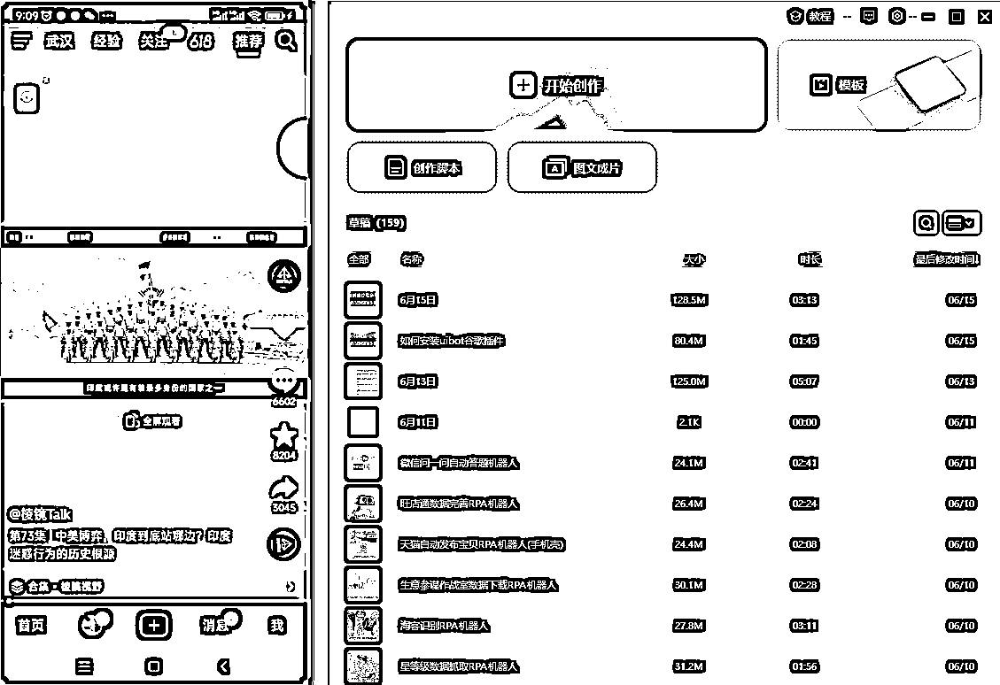</ne-card></ne-p> <ne-p id="u7b859cc1" data-lake-id="u7b859cc1"><ne-text id="u94ae25bd">图文成片，在一些根本不需要精细化素材的地方，也能拿到询盘。</ne-text></ne-p> <ne-p id="udaba338f" data-lake-id="udaba338f"><ne-text id="ufd53cb66">图文成片，是关键词卡位的第一步，在测出合适的平台，合适的品之后，完全可以再生产优质素材，</ne-text></ne-p> <ne-p id="u63536327" data-lake-id="u63536327"><ne-text id="u49bf60f1">同样去用内容工厂工具霸屏。</ne-text></ne-p> <ne-p id="u77a7a2a6" data-lake-id="u77a7a2a6"><ne-text id="u4a7dbe3e">用上本地化素材，暂且定为内容工厂 2.0，但是机器人流程配置上和 1.0 并没有太大区别，只是流程上存在差异。每个人的需求不一样，内容工厂的最终的结构也都不一样，这里只是一个代号而已。</ne-text></ne-p> <ne-h1 id="62af1ba2" data-lake-id="62af1ba2"><ne-heading-ext><ne-heading-anchor></ne-heading-anchor><ne-heading-fold></ne-heading-fold></ne-heading-ext><ne-heading-content><ne-text id="u8fcb3ce7">四.如何用内容工厂搭配巨量算数选品</ne-text></ne-heading-content></ne-h1> <ne-p id="u6a03a6da" data-lake-id="u6a03a6da"><ne-card data-card-name="image" data-card-type="inline" id="ajw56" data-event-boundary="card">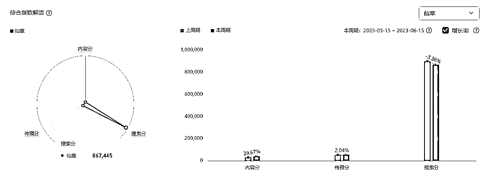</ne-card></ne-p> <ne-p id="u7367d7bd" data-lake-id="u7367d7bd"><ne-text id="u2a7cb302">巨量算数，要做搜索分高，传播分高，内容分低的品，大家都知道。</ne-text></ne-p> <ne-p id="u64ee2b76" data-lake-id="u64ee2b76"><ne-text id="u31371e4d">但是，对于一个从来没有做过电商的人来说，是没有概念的。</ne-text></ne-p> <ne-p id="u2e8fb92e" data-lake-id="u2e8fb92e"><ne-card data-card-name="image" data-card-type="inline" id="lKRhi" data-event-boundary="card"></ne-card></ne-p> <ne-p id="u7d3ccaf7" data-lake-id="u7d3ccaf7"><ne-text id="ue638c71d">对于淘宝来说，拼多多是选品工具吗？亚马逊是选品工具吗？</ne-text></ne-p> <ne-p id="u52b5d793" data-lake-id="u52b5d793"><ne-text id="u8bff2180">显然是的，对于小红书来说，淘宝，拼多多，都是选品工具。</ne-text></ne-p> <ne-p id="u0b4532d5" data-lake-id="u0b4532d5"><ne-text id="u441b6f6f">把这些类目的类目词，以及小类目小的商品核心关键词都采集下来，</ne-text></ne-p> <ne-p id="u66a3158c" data-lake-id="u66a3158c"><ne-text id="u5f536070">然后用 RPA 工具批量的放到巨量算数里面去查询，再采集出每个关键词对应的搜索分和传播分。</ne-text></ne-p> <ne-p id="u3e8ce5a9" data-lake-id="u3e8ce5a9"><ne-text id="ud2d2fd13">由于搜索分和传播分是变化的。</ne-text></ne-p> <ne-p id="ub74767dd" data-lake-id="ub74767dd"><ne-text id="u9ac2ea8e">可以设置好自动查询隔一段时间去采集一次商品信息，然后查询巨量算数的搜索分和传播分。</ne-text></ne-p> <ne-p id="uf5f5db33" data-lake-id="uf5f5db33"><ne-card data-card-name="image" data-card-type="inline" id="KQAfE" data-event-boundary="card"></ne-card></ne-p> <ne-h1 id="6a3efe8a" data-lake-id="6a3efe8a"><ne-heading-ext><ne-heading-anchor></ne-heading-anchor><ne-heading-fold></ne-heading-fold></ne-heading-ext><ne-heading-content><ne-text id="u51c1f285" ne-bold="true">五.如何用内容工厂去升级视频带货玩法</ne-text></ne-heading-content></ne-h1> <ne-p id="ued8786c2" data-lake-id="ued8786c2"><ne-text id="ue56a0882">比如，现在市面上所有的带货视频基本上都是说某个产品好，但是都很少有讲到一个打中用户痛点东西：</ne-text></ne-p> <ne-p id="ufc22e50a" data-lake-id="ufc22e50a"><ne-text id="u6ed239c5" ne-bold="true">没有中间商赚差价</ne-text></ne-p> <ne-p id="uabc4c3fb" data-lake-id="uabc4c3fb"><ne-text id="uab33e31f">用户都觉得厂家会便宜些，用户都觉得中间商赚了差价。</ne-text></ne-p> <ne-p id="uad86ce5c" data-lake-id="uad86ce5c"><ne-text id="u3de17cc6">那你卖玩具，素材完全可以就是玩具厂家，而不是只拍玩具，</ne-text></ne-p> <ne-p id="u9369d4d2" data-lake-id="u9369d4d2"><ne-text id="ud4d21938">卖瓷器，素材完全可以是瓷器工厂，所有的账号信息都以一个厂家的身份来做。</ne-text></ne-p> <ne-p id="ubec0db7a" data-lake-id="ubec0db7a"><ne-text id="u313ef305">B 端的经销商和和终端客户都不放过。</ne-text></ne-p> <ne-p id="u5871fab1" data-lake-id="u5871fab1"><ne-text id="ub1751b50">袜子，纸巾，这种产品都是厂家身份在做，但是那些日用品，宝妈带货很多的家居，厨卫，</ne-text></ne-p> <ne-p id="u2aa27039" data-lake-id="u2aa27039"><ne-text id="u2eede108">其实用厂家素材在推的并不多，主要都是宝妈们的使用场景，</ne-text></ne-p> <ne-p id="u9ff597e9" data-lake-id="u9ff597e9"><ne-text id="uefb7940e">完全可以使用场景加厂家素材来做。</ne-text></ne-p> <ne-p id="u23609c1c" data-lake-id="u23609c1c"><ne-text id="u5a6bf828">布局纯 B 端的内容，本身流量就很少，短期内肯定是难看到结果的。</ne-text></ne-p> <ne-p id="ue5ebc515" data-lake-id="ue5ebc515"><ne-text id="u8763fb2e">但是搞定经销商的话，收益也会比散户要大，而且是持续的复购。</ne-text></ne-p> <ne-p id="ub7c68fd4" data-lake-id="ub7c68fd4"><ne-text id="u3eb33fef">如果自己有项目最好，没有的话也没有关系，去 boss 直聘上对接厂家，用别人的资金来测试玩法和项目。</ne-text></ne-p> <ne-p id="u1c7122bd" data-lake-id="u1c7122bd"><ne-text id="u2b70f9eb">关键是还每个月给你发工资。</ne-text></ne-p> <ne-p id="u7a6c375c" data-lake-id="u7a6c375c"><ne-text id="ua0202de8">门窗可能很卷，但是和建筑材料相关的就太多了。</ne-text></ne-p> <ne-p id="uc1c4778b" data-lake-id="uc1c4778b"><ne-text id="uc8c0f4a4">最后强调一下，</ne-text></ne-p> <ne-p id="uf89e42e5" data-lake-id="uf89e42e5"><ne-text id="udf29bbee">不求结果并不是要佛系，或者内容工厂工具有跟没一样，让你不求结果</ne-text></ne-p> <ne-p id="uab0562ae" data-lake-id="uab0562ae"><ne-text id="u9f921d61">而是不求某个具体的产品出结果，不求单个账号出结果，不求短期出结果。</ne-text></ne-p> <ne-p id="u364049bc" data-lake-id="u364049bc"><ne-text id="uf9c8d854">因为内容工厂用上之后，内容创作的成本实际非常低了，可以持续的批量的去测各种各样的品类。</ne-text></ne-p> <ne-p id="u98c8f486" data-lake-id="u98c8f486"><ne-text id="u8a613df5">前面圈友分享了抖音 SEO 的玩法，但是我还是想再让大家进入一次这个场景。</ne-text></ne-p> <ne-p id="uab54c3ec" data-lake-id="uab54c3ec"><ne-text id="u759e9dda">这个方法，手动完全是可以落地的，运气好很快就能出结果，前面我提到的我本人的门窗账号一个月就出结果了。</ne-text></ne-p> <ne-p id="ucd7f9383" data-lake-id="ucd7f9383"><ne-text id="u9184d46e">但是也有运气不好的时候，纯手动，你去布局这么多内容，那一定是非常非常累的。</ne-text></ne-p> <ne-p id="u3c97fa2c" data-lake-id="u3c97fa2c"><ne-text id="u9eec0ead">但谈到凡落不了地，不是执行力不行，就是认知不够，这样实际是没有解决方案的，</ne-text></ne-p> <ne-p id="ubd79d4c5" data-lake-id="ubd79d4c5"><ne-text id="ud3fee078">为什么执行力不行？如何解决执行力不行的问题？</ne-text></ne-p> <ne-p id="u758a3b58" data-lake-id="u758a3b58"><ne-text id="ub71ed11b">最简单的，下拉词怎么更快速的整理出来？</ne-text></ne-p> <ne-p id="u473aea04" data-lake-id="u473aea04"><ne-text id="uadb2f5a2">这里我给下 RPA 的源码截图，如果下场实操了我前面开源的 chatgpt 超级写手教程，我相信也能自己配出来。</ne-text></ne-p> <ne-p id="u6aa5d4c6" data-lake-id="u6aa5d4c6"><ne-card data-card-name="image" data-card-type="inline" id="WmcTf" data-event-boundary="card"></ne-card></ne-p> <ne-p id="ud486415a" data-lake-id="ud486415a"><ne-text id="u55860ed7">配不出来也没有关系，可以直接帖子的评论区留言，有问题，提出问题，我来解决问题。</ne-text></ne-p> <ne-p id="ub0b5f182" data-lake-id="ub0b5f182"><ne-text id="ud7971594">不通过其他任何渠道做免费答疑。</ne-text></ne-p> <ne-p id="u1bdb0d2d" data-lake-id="u1bdb0d2d"><ne-text id="u8098b0d4">RPA 默认人工和 chatgpt 超级写手构成的内容工厂就是一个比较不错的解决方案。</ne-text></ne-p> <ne-p id="ue25c598e" data-lake-id="ue25c598e"><ne-text id="uefe1cdb8">以父亲节和 iphone14 为例 ，</ne-text></ne-p> <ne-p id="u40dc4fba" data-lake-id="u40dc4fba"><ne-text id="ue7aafe9d">SEO 是非常非常古老的技术了，不是说这个技术有多难，把 SEO 做好有多牛，</ne-text></ne-p> <ne-p id="u7bac8371" data-lake-id="u7bac8371"><ne-text id="uc48b0f70">用户搜索父亲节，出来的每一个下拉词，都布局到你的作品中去，</ne-text></ne-p> <ne-p id="ue3858fd5" data-lake-id="ue3858fd5"><ne-text id="u88544b70">默认的父亲节主题晚会，父亲节晚会，父亲节文案</ne-text></ne-p> <ne-p id="u1d8784ff" data-lake-id="u1d8784ff"><ne-text id="ub2b1f680">统统都做进去，你搜索父亲节晚会之后，父亲节文案之后，</ne-text></ne-p> <ne-p id="uc3ee7cd0" data-lake-id="uc3ee7cd0"><ne-text id="u25e06315">又会出一批下拉词，</ne-text></ne-p> <ne-p id="uba62a4f5" data-lake-id="uba62a4f5"><ne-text id="uc1e84729">不停的套娃，</ne-text></ne-p> <ne-p id="uf5bcb97e" data-lake-id="uf5bcb97e"><ne-text id="u923c0858">套完之后，再在父亲节后面字母加，a,b,c,d,e 又会出一批下拉词。</ne-text></ne-p> <ne-p id="u1d20022c" data-lake-id="u1d20022c"><ne-card data-card-name="image" data-card-type="inline" id="pFYFm" data-event-boundary="card">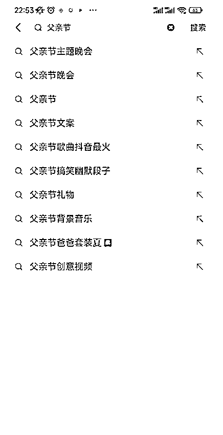</ne-card></ne-p> <ne-p id="u94a3c526" data-lake-id="u94a3c526"><ne-card data-card-name="image" data-card-type="inline" id="G6AqF" data-event-boundary="card"></ne-card></ne-p> <ne-p id="u4597c8d8" data-lake-id="u4597c8d8"><ne-card data-card-name="image" data-card-type="inline" id="ziYRn" data-event-boundary="card">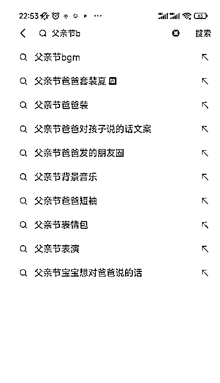</ne-card></ne-p> <ne-p id="uf8fd1a05" data-lake-id="uf8fd1a05"><ne-card data-card-name="image" data-card-type="inline" id="FBpUK" data-event-boundary="card"></ne-card></ne-p> <ne-p id="u97023fd8" data-lake-id="u97023fd8"><ne-card data-card-name="image" data-card-type="inline" id="Dtaiu" data-event-boundary="card"></ne-card></ne-p> <ne-p id="uf074bd9c" data-lake-id="uf074bd9c"><ne-card data-card-name="image" data-card-type="inline" id="Uiv5o" data-event-boundary="card">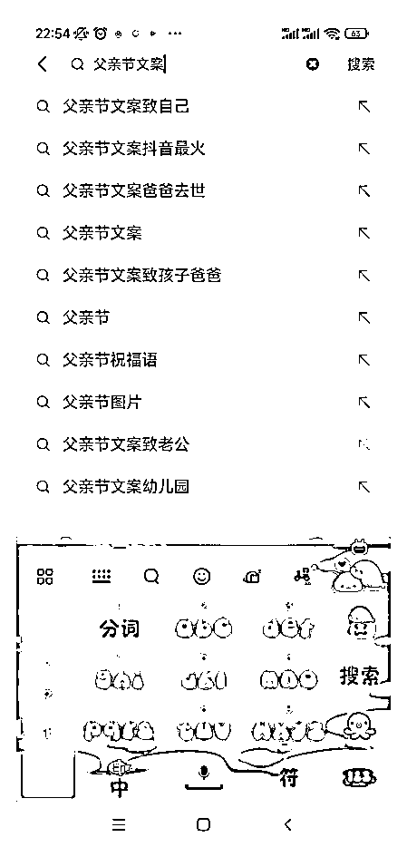</ne-card></ne-p> <ne-p id="u3ce723b8" data-lake-id="u3ce723b8"><ne-card data-card-name="image" data-card-type="inline" id="sq0IL" data-event-boundary="card"></ne-card></ne-p> <ne-p id="u3eb789bb" data-lake-id="u3eb789bb"><ne-card data-card-name="image" data-card-type="inline" id="SUtnZ" data-event-boundary="card">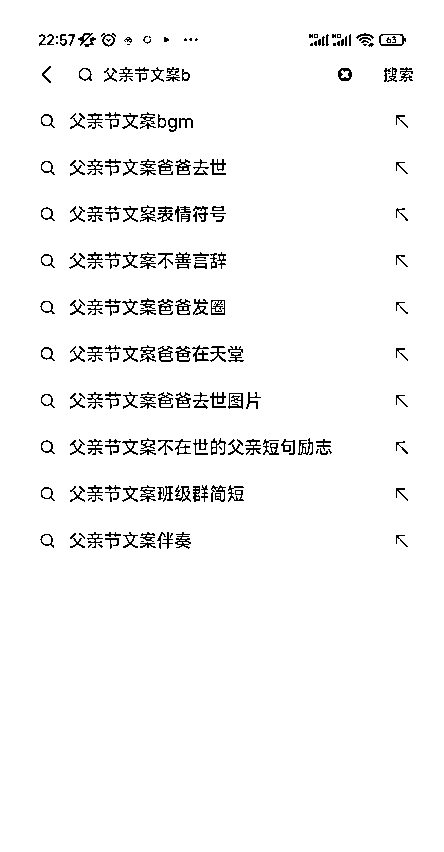</ne-card></ne-p> <ne-p id="u5f76ca3a" data-lake-id="u5f76ca3a"><ne-text id="u85dc196c">如果你，还是没有感觉，把这个词换成 iphone14 吧，去全网布局，闲鱼，小红书等流量大，</ne-text></ne-p> <ne-p id="u161a0a3e" data-lake-id="u161a0a3e"><ne-text id="u46d77c7f">只要巨量算数的搜索分和传播分高，内容分的低，很多都可以做，</ne-text></ne-p> <ne-p id="ue6c6e0de" data-lake-id="ue6c6e0de"><ne-text id="u55438d2a">又不要钱的平台去做关键词布局，</ne-text></ne-p> <ne-p id="u0d7c0c00" data-lake-id="u0d7c0c00"><ne-text id="u938818d6">先不要想什么自动化，</ne-text></ne-p> <ne-p id="uc0119d44" data-lake-id="uc0119d44"><ne-text id="ud0aab50a">先把手动流程跑起来，</ne-text></ne-p> <ne-p id="u4e2a18c7" data-lake-id="u4e2a18c7"><ne-text id="ud17b724a">先每天发个 1,2 个作品，</ne-text></ne-p> <ne-p id="u612b0040" data-lake-id="u612b0040"><ne-text id="u121b5f30">坚持 1 个礼拜之后，再发 10 个作品，</ne-text></ne-p> <ne-p id="udc64f36d" data-lake-id="udc64f36d"><ne-text id="u6c899d5c">坚持 1 个月之后，扩大到 50 个每天，</ne-text></ne-p> <ne-p id="u6813b2e2" data-lake-id="u6813b2e2"><ne-text id="u67cb1768">如果还能坚持，相信那个时候已经能拿到正反馈了，</ne-text></ne-p> <ne-p id="ue4636d4c" data-lake-id="ue4636d4c"><ne-text id="u109085b1">再去自动化吧。</ne-text></ne-p> <ne-p id="u610f70c7" data-lake-id="u610f70c7"><ne-text id="ubb4a5620">逻辑是什么，逻辑就是用户懒，用户不可能去打那么多字，肯定是优先去点下拉词，</ne-text></ne-p> <ne-p id="u5ff2c8f2" data-lake-id="u5ff2c8f2"><ne-text id="u2003a845">下拉词，这么多，你的同行怎么可能有那个精力去搞，</ne-text></ne-p> <ne-p id="ub9e4b038" data-lake-id="ub9e4b038"><ne-text id="u5f92e117">你是因为相信才看见，还是因为看见才相信？</ne-text></ne-p> <ne-p id="uefbcb960" data-lake-id="uefbcb960"><ne-text id="u253ce495">多数人都是因为看见才相信吧？</ne-text></ne-p> <ne-p id="ube1c7bda" data-lake-id="ube1c7bda"><ne-text id="ufa2dc5d3">这种事情，你的同行是看不见的，</ne-text></ne-p> <ne-p id="u98d3dea5" data-lake-id="u98d3dea5"><ne-text id="u9a31a871">这种内容，没有点赞，没有评论，没有关注，</ne-text></ne-p> <ne-p id="ub58da18f" data-lake-id="ub58da18f"><ne-text id="u2abed36c">只有后台的私信询盘，</ne-text></ne-p> <ne-p id="u0f736e1e" data-lake-id="u0f736e1e"><ne-text id="u6a8e47da">他看不见的。</ne-text></ne-p> <ne-p id="u2446e325" data-lake-id="u2446e325"><ne-text id="u56550651">这种操作，短期内拿到结果，有概率，但是概率并不是那么多，</ne-text></ne-p> <ne-p id="ub44b9bf8" data-lake-id="ub44b9bf8"><ne-text id="uae344c28">搞个几天，或者几个月大多数人都放弃了。</ne-text></ne-p> <ne-p id="ub2b0bf19" data-lake-id="ub2b0bf19"><ne-text id="u22bfd4f3">如果你相信，那完全可以用我们的 RPA 自动化工具和 chatgpt 超级写手来全自动化生成内容，</ne-text></ne-p> <ne-p id="uf2142150" data-lake-id="uf2142150"><ne-text id="u1c0b03ae">再用我们的内容工厂完成内容的多平台分发上传。</ne-text></ne-p> <ne-p id="ud89ad140" data-lake-id="ud89ad140"><ne-text id="u824d16ee">将你的内容扩大 100 倍，业务扩大 10 倍！</ne-text></ne-p> <ne-p id="u8d9fdf41" data-lake-id="u8d9fdf41"><ne-card data-card-name="image" data-card-type="inline" id="gyRZ5" data-event-boundary="card"></ne-card></ne-p> <ne-p id="u55b6a82c" data-lake-id="u55b6a82c"><ne-card data-card-name="image" data-card-type="inline" id="xMRY1" data-event-boundary="card"></ne-card></ne-p> <ne-p id="uc7477f88" data-lake-id="uc7477f88"><ne-card data-card-name="image" data-card-type="inline" id="Xtg8r" data-event-boundary="card"></ne-card></ne-p> <ne-p id="u6fd039da" data-lake-id="u6fd039da"><ne-card data-card-name="image" data-card-type="inline" id="BpjEn" data-event-boundary="card"></ne-card></ne-p> <ne-p id="udffafe12" data-lake-id="udffafe12"><ne-card data-card-name="image" data-card-type="inline" id="h1NTE" data-event-boundary="card">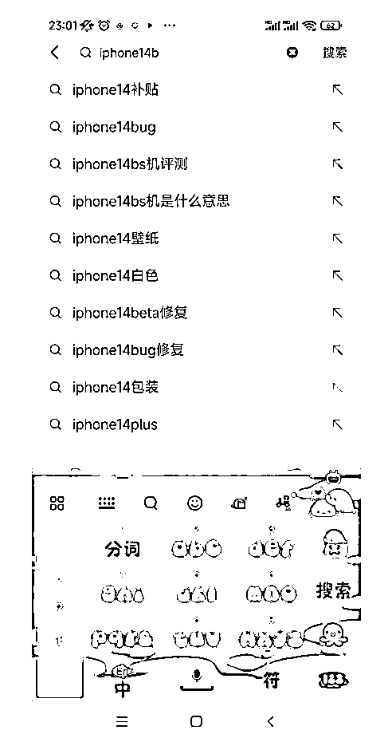</ne-card></ne-p> <ne-p id="u7b9316bd" data-lake-id="u7b9316bd"><ne-card data-card-name="image" data-card-type="inline" id="A9CPg" data-event-boundary="card">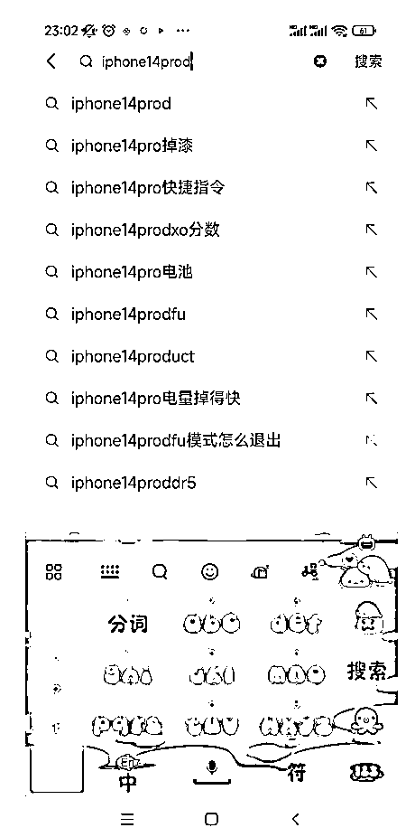</ne-card></ne-p> <ne-p id="ub8b562f6" data-lake-id="ub8b562f6"><ne-card data-card-name="image" data-card-type="inline" id="SyFw0" data-event-boundary="card">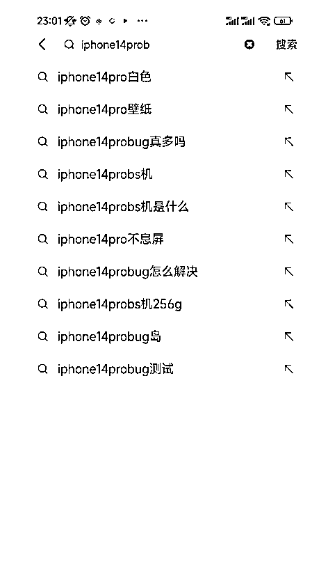</ne-card></ne-p> <ne-p id="u336fd745" data-lake-id="u336fd745"><ne-card data-card-name="image" data-card-type="inline" id="gFpPA" data-event-boundary="card"></ne-card></ne-p> <ne-p id="u579d02c0" data-lake-id="u579d02c0"><ne-card data-card-name="image" data-card-type="inline" id="RQF6W" data-event-boundary="card">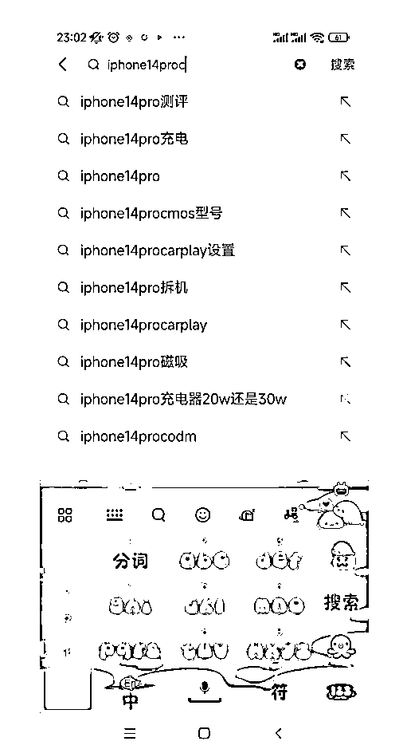</ne-card></ne-p> <ne-h1 id="dc97a607" data-lake-id="dc97a607"><ne-heading-ext><ne-heading-anchor></ne-heading-anchor><ne-heading-fold></ne-heading-fold></ne-heading-ext><ne-heading-content><ne-text id="ud73c7169" ne-bold="true">六.如何控制好心态，玩好内容工厂</ne-text></ne-heading-content></ne-h1> <ne-h2 id="26ed39da" data-lake-id="26ed39da"><ne-heading-ext><ne-heading-anchor></ne-heading-anchor><ne-heading-fold></ne-heading-fold></ne-heading-ext><ne-heading-content><ne-text id="u38d7ef1c">总结一下就是： 不求质量，不求流量，不求结果</ne-text></ne-heading-content></ne-h2> <ne-h3 id="84c06197" data-lake-id="84c06197"><ne-heading-ext><ne-heading-anchor></ne-heading-anchor><ne-heading-fold></ne-heading-fold></ne-heading-ext><ne-heading-content><ne-text id="u9975a3ff">6.1 不求质量</ne-text></ne-heading-content></ne-h3> <ne-p id="u72eb0b76" data-lake-id="u72eb0b76"><ne-text id="uacf8910e">就像去年视频号或者抖音的中老年女装混剪风口，并不是一定要高质量的内容，才能拿到流量。</ne-text></ne-p> <ne-p id="ufb905282" data-lake-id="ufb905282"><ne-card data-card-name="image" data-card-type="inline" id="BMZ1j" data-event-boundary="card"></ne-card></ne-p> <ne-p id="ubba18a8d" data-lake-id="ubba18a8d"><ne-card data-card-name="image" data-card-type="inline" id="Nx3ib" data-event-boundary="card"></ne-card></ne-p> <ne-p id="uc1a99025" data-lake-id="uc1a99025"><ne-text id="udcbadabd">并不是说科班出身的设计师，剪辑师，影视工作者，才能做好视频创作，或者就一定能做好内容创作。</ne-text></ne-p> <ne-h3 id="81b93375" data-lake-id="81b93375"><ne-heading-ext><ne-heading-anchor></ne-heading-anchor><ne-heading-fold></ne-heading-fold></ne-heading-ext><ne-heading-content><ne-text id="u23aba6ac">6.2 不求流量</ne-text></ne-heading-content></ne-h3> <ne-p id="ud349f58f" data-lake-id="ud349f58f"><ne-text id="uf4954e67">去年 10 月，我在 BOSS 直聘挖到一个项目，前面帖子也分享了，</ne-text></ne-p> <ne-p id="uc30617bf" data-lake-id="uc30617bf">[<ne-text id="u6c2aceaa">点我直达：通过 chatgpt+BOSS 直聘+RPA 来挖掘适合普通人赚钱的项目</ne-text>](https://juejinniu.feishu.cn/docx/PyCvdgtaFohPlRxC7YUcqDvgnde)</ne-p> <ne-p id="ua388d831" data-lake-id="ua388d831"><ne-text id="ueb3942ed">今天在这里讲下门窗这个业务我自己操作的细节，每天搬运混剪 2 个视频，快的话 30 分钟，慢的话 2 小时。</ne-text></ne-p> <ne-p id="u2683f49c" data-lake-id="u2683f49c"><ne-text id="udf6bb992">核心就 2 句话：</ne-text></ne-p> <ne-p id="ud8eb75a6" data-lake-id="ud8eb75a6"><ne-text id="ucf1ed6fd" ne-bold="true">1.怼关键词霸屏</ne-text></ne-p> <ne-p id="u6fc3ffaa" data-lake-id="u6fc3ffaa"><ne-text id="ua452b286" ne-bold="true">2.优化所有 5 点（昵称，简介，话题，描述，语音）</ne-text></ne-p> <ne-p id="u61b3df78" data-lake-id="u61b3df78"><ne-text id="u717ac368">极其简单，简单到出咨询的时候，我自己都非常惊讶，仅仅一个账号就出了这么多咨询。</ne-text></ne-p> <ne-p id="u8da64f2e" data-lake-id="u8da64f2e"><ne-text id="u1702f31c">没有点赞，没有流量，没有粉丝，播放也少的可怜，只用一次门窗相关情感出了一个破 50w 播放。</ne-text></ne-p> <ne-p id="u7c8447a4" data-lake-id="u7c8447a4"><ne-text id="u72ab6f54">内容纯粹混剪，就一小作坊，单子发给上家大厂。</ne-text></ne-p> <ne-p id="uf0c99b05" data-lake-id="uf0c99b05"><ne-card data-card-name="image" data-card-type="inline" id="onRAR" data-event-boundary="card"></ne-card></ne-p>  <ne-p id="u16502e97" data-lake-id="u16502e97"><ne-card data-card-name="image" data-card-type="inline" id="PPFwz" data-event-boundary="card"><ne-p id="ud15e17e8" data-lake-id="ud15e17e8"><ne-card data-card-name="image" data-card-type="inline" id="D3njP" data-event-boundary="card"><ne-p id="u236a006f" data-lake-id="u236a006f"><ne-card data-card-name="image" data-card-type="inline" id="IPuz9" data-event-boundary="card"><ne-p id="u38d41311" data-lake-id="u38d41311"><ne-card data-card-name="image" data-card-type="inline" id="OfX9j" data-event-boundary="card"><ne-p id="u8af741fa" data-lake-id="u8af741fa"><ne-text id="u81b00275">说实话，我当时完全是懵的，我觉得就是运气。</ne-text></ne-p> <ne-p id="u8a1bbfb9" data-lake-id="u8a1bbfb9"><ne-text id="u5460b290">虽然指导我的大哥说不是运气，但是我心里一直都没底。</ne-text></ne-p> <ne-p id="u8a8f0550" data-lake-id="u8a8f0550"><ne-text id="ua2e6b81d">直到有一天看到曹大的这段话：</ne-text></ne-p>  <ne-p id="ua50fe2b6" data-lake-id="ua50fe2b6"><ne-card data-card-name="image" data-card-type="inline" id="qF27L" data-event-boundary="card"><ne-p id="u0480fd75" data-lake-id="u0480fd75"><ne-text id="ud2b30afa">点赞，分享，评论，流量也许代表着某种价值，但是也可能仅仅是情绪价值而已。</ne-text></ne-p> <ne-p id="uf6386909" data-lake-id="uf6386909"><ne-text id="u033c7f57">价值和卖货并不是绝对的关联。</ne-text></ne-p> <ne-p id="u4ee78190" data-lake-id="u4ee78190"><ne-text id="uf8dd7180">再想象一下，直播间场景：</ne-text></ne-p> <ne-p id="u035b1ddd" data-lake-id="u035b1ddd"><ne-text id="uac3a5e2f">挂个粉丝灯牌才能发货/才能享受这个折扣/才能优先发货/才能送运费险</ne-text></ne-p> <ne-p id="u7ff8f09c" data-lake-id="u7ff8f09c"><ne-text id="ubb5995e7">很容易感受到客户的智商，被按在地上摩擦。</ne-text></ne-p> <ne-p id="uefe34068" data-lake-id="uefe34068"><ne-text id="u86918d11">结合我自己买东西的场景，哪去搞什么点赞关注评论这些乱七八糟的，</ne-text></ne-p> <ne-p id="uec6407ac" data-lake-id="uec6407ac"><ne-text id="u5e6a3c42">觉得好的东西，需要用的东西，就直接买了，如果有电话或者联系方式，直接就问了。</ne-text></ne-p> <ne-p id="u7db68e55" data-lake-id="u7db68e55"><ne-text id="ub08217a1">家里马桶堵了的时候，58，淘宝，微信群，但凡搜到了一个搞这行的，恨不得立刻马上就来给我掏通了。</ne-text></ne-p></ne-card></ne-p></ne-card></ne-p></ne-card></ne-p></ne-card></ne-p></ne-card></ne-p>