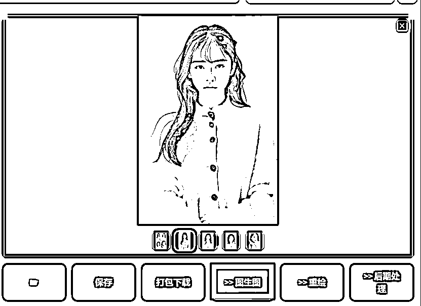
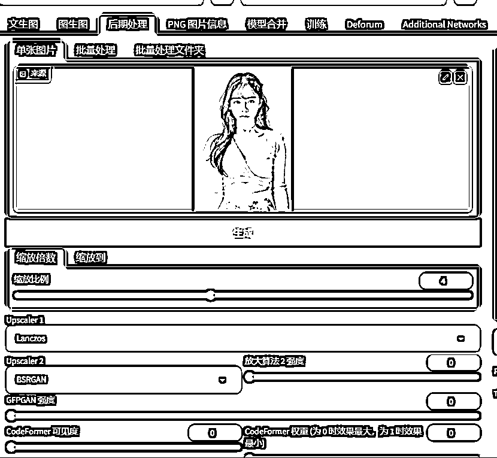

# 淘宝模特 AI 换装教程

> 原文：[`www.yuque.com/for_lazy/thfiu8/cgt6ntki5maubtcs`](https://www.yuque.com/for_lazy/thfiu8/cgt6ntki5maubtcs)

<ne-h2 id="2f173331" data-lake-id="2f173331"><ne-heading-ext><ne-heading-anchor></ne-heading-anchor><ne-heading-fold></ne-heading-fold></ne-heading-ext><ne-heading-content><ne-text id="ub0667505">(43 赞)淘宝模特 AI 换装教程</ne-text></ne-heading-content></ne-h2> <ne-p id="ufce9e5b9" data-lake-id="ufce9e5b9"><ne-text id="u33947d1e">作者： 彦灵</ne-text></ne-p> <ne-p id="u6388b7f5" data-lake-id="u6388b7f5"><ne-text id="uf1eb7a52">日期：2023-06-13</ne-text></ne-p> <ne-p id="u9176445c" data-lake-id="u9176445c"><ne-text id="u5dbfe5f6">淘宝模特 AI 换装教程</ne-text></ne-p> <ne-p id="u801a0ab3" data-lake-id="u801a0ab3"><ne-text id="u383e83e9">最近和团队在做一些 AI 课程，写了一个淘宝模特 AI 换装的教程，</ne-text></ne-p> <ne-p id="ub08a616d" data-lake-id="ub08a616d"><ne-text id="ucd8e7342">使用的是 SD,具体的教程放在飞书里面</ne-text></ne-p> <ne-p id="u825432c4" data-lake-id="u825432c4"><ne-text id="u6c310b2e">觉得有用，记得给我点赞</ne-text>[<ne-text id="u39d479e6">https://ciw2i24cl6.feishu.cn/docx/IysYdFRYKoqbqdxeNSGcxr0Qnkb</ne-text>](https://ciw2i24cl6.feishu.cn/docx/IysYdFRYKoqbqdxeNSGcxr0Qnkb)<ne-card data-card-name="image" data-card-type="inline" id="ySo5Q" data-event-boundary="card"></ne-card></ne-p> <ne-p id="u6eaacbec" data-lake-id="u6eaacbec"><ne-card data-card-name="image" data-card-type="inline" id="PShfq" data-event-boundary="card"></ne-card></ne-p> <ne-hole id="ue0bf29ad" data-lake-id="ue0bf29ad"><ne-card data-card-name="hr" data-card-type="block" id="yV7tz" data-event-boundary="card"><ne-p id="ua6c1421b" data-lake-id="ua6c1421b"><ne-text id="ue5304e59">评论区：</ne-text></ne-p> <ne-p id="u38568633" data-lake-id="u38568633"><ne-text id="u1d68bc93">曹超峰 : 大佬，模特生成之后，可以给她指定的衣服生成吗？给他一张衣服图片，而不是让他生成新的衣服，这样可以吗？</ne-text> <ne-text id="u3d2ff8dd">彦灵 : 要指定衣服，就要炼制定衣服的 lora,炼到过拟合，就能生成接近原图的衣服。</ne-text></ne-p></ne-card></ne-hole>