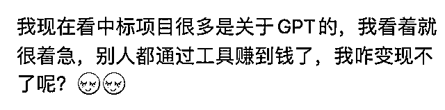

# 系列 6：为什么我们没能在 ChatGPT 这件事上赚到钱？

> 原文：[`www.yuque.com/for_lazy/thfiu8/knqzt0xttk0psop8`](https://www.yuque.com/for_lazy/thfiu8/knqzt0xttk0psop8)

## (41 赞)系列 6：为什么我们没能在 ChatGPT 这件事上赚到钱？ 

作者： HEXIN 

日期：2023-06-12 

大家好，我是 HEXIN，生财有术第一期老圈友，也是本期风向标小航海的教练。今天在风向标共读 1 群中看到了一段内容，相信很多人都会有同感。 

 

那么为什么我们没能在 ChatGPT 这件事上赚到钱？这件问题，我个人建议使用查理芒格提到的逆向思维，思考另外一个问题：想在 ChatGPT 这件事上赚到钱，最重要的是什么？ 

我先说下我自己的答案，想在 ChatGPT 这件事上赚到钱，最重要的是确定自己在 ChatGPT 生态系统中的生态位。 <ne-h3 id="b937c5bb" data-lake-id="b937c5bb">1.什么是生态位？</ne-h3> 

生态位（Ecological niche）是指一个生物种在生态系统中所处的位置，以及它如何与环境和其他物种相互作用。换句话说，生态位可以被理解为物种在生态系统中的“职业”。它反映了物种在生态系统中的角色，包括它们的食物来源、行为模式、生活空间等等。 

生态位的概念有助于我们理解不同的物种如何共存，以及为何一些生物种可能在特定环境中表现得比其他物种更好。例如，狼的生态位可能包括狩猎大型哺乳动物，活动在广阔的领地内，而兔子的生态位可能包括在地下洞穴中寻找植物性食物。 

为什么要确定自己在 ChatGPT 生态系统中的生态位？你要相信，在这个生态中，不是每一个生态位都应该能赚到钱的。比如你明明就是个消费者，那又希望自己赚到钱，不是很不合理么？ 

## 2.在 ChatGPT 这个生态系统中有哪些生态位？ 

我简单的把 ChatGPT 生态系统中的生态位，拆分为三类： <ne-oli index-type="0"><ne-oli-i>1</ne-oli-i><ne-oli-c class="ne-oli-content" id="uf9102308" data-lake-id="uf9102308">甲方</ne-oli-c></ne-oli> <ne-oli index-type="0"><ne-oli-i>2</ne-oli-i><ne-oli-c class="ne-oli-content" id="u1e0024ec" data-lake-id="u1e0024ec">乙方</ne-oli-c></ne-oli> <ne-oli index-type="0"><ne-oli-i>3</ne-oli-i><ne-oli-c class="ne-oli-content" id="u7bcf562e" data-lake-id="u7bcf562e">第三方</ne-oli-c></ne-oli> 

接下来我会详细拆解每一类。 

 <ne-h3 id="8b16ade9" data-lake-id="8b16ade9">3.ChatGPT 生态系统中的甲方</ne-h3> 

想跟打造出 ChatGPT 的 OpenAI 处于同一角色，是一件很难很难的事情，也是互联网大佬们放弃财富自由后的躺平状态，纷纷重出江湖的必争之地。这一类，我个人觉得跟生财内的绝大多数人没什么关系。它的本质可以简单的说：做垂直领域的大模型或者做另一个 GPT 模型。 

比如周末听前猎豹公司的老板付盛的分享，他就在做垂直领域的大模型，叫做聚言。而同生态位的还有在做投资领域的同花顺，中医领域的华驼等。 

生态系统中的甲方，赚的是什么钱？其实甲方也就是平台方，赚的是生态中提供服务后的抽水。 

比如我们最熟悉的，苹果公司做了一个 AppStore，所有开发者的分成，它拿走 30%，而淘宝平台，抖音电商平台也好，OpenAI 也好，也都类似。 <ne-h3 id="427a99b0" data-lake-id="427a99b0">4.ChatGPT 生态系统中的乙方</ne-h3> 

我们绝大多数人，其实在 ChatGPT 生态系统中，属于乙方，也就是使用平台服务的一方。同为乙方，我们却看到了身边不少人赚到了钱，也有人没赚到（比如我），它的本质差异在哪里？在于你是否是另外一个生态里的生产者。 

我把乙方再简单拆成两类，生产者和消费者。ChatGPT 也好，AI 画画也好，他们统称叫做 AIGC。那 AIG 的是什么呢？是 Content。 <ne-h4 id="6b042c52" data-lake-id="6b042c52">4.1 生产者</ne-h4> 

比如你本来在知乎上，小红书上可以靠发文字，图片内容赚到流量；比如你本来靠写书，做课程变现；比如你本来负责给装修公司或美术公司出设计图；比如你本来靠写代码，做浏览器插件变现，那你其实就是另外一个生态一个生产者。 

这时候，我们需要思考另外一个问题：ChatGPT 是帮生产者直接赚到钱么？不是，ChatGPT 是帮生产者提高了生产效率。而我们看到的一些生产者赚到了钱，要么是他们直接出售了服务，成为了第三方，要么是他们提高了生产效率，降低了原本的生产成本，而变现，是人家本来就已经在做的事情。 

举个例子，说下乙方如何提高生产效率的：现在很多游戏研发公司，都在搭建自己的 AIGC 团队，用 SD 去生成一些游戏中的美术图，这部分成本，之前可能在一款游戏中，要占到几百万，那现在如果用几十万甚至更低的价格就实现了，这本身就节省了成本，变相通过 ChatGPT 或者 AI 画画赚到了钱。 <ne-h4 id="b2e55c55" data-lake-id="b2e55c55">4.2 消费者</ne-h4> 

如果你跟我一样，不平时不靠写字，做课，写代码，做图，做短视频引流量为生，那么恭喜你，你跟我一样，只属于消费者 

消费者还有机会么？有，要么你去做另一个生态中的一个生产者，要么，就把 ChatGPT 当成是一个自学神器，因为 ChatGPT 除了是内容生产提效工具，也还是一个极佳的学习提效工具，一个极佳的决策提效工具。 

如果你能因为你自身的技能提高了，决策能力提高了，公司多给你发工资，或者找到了更好的职位，这个算不算变相通过 ChatGPT 赚到了钱？ <ne-h3 id="2c2204c1" data-lake-id="2c2204c1">5.ChatGPT 生态系统中的第三方</ne-h3> 

如果说又想直接赚到钱（不喜欢做个生产者间接变现），又不想难度那么地狱，那其实最适合的是做 ChatGPT 生态系统中的第三方。 

想做 ChatGPT 生态系统中的第三方，有两个前提条件： <ne-oli index-type="0"><ne-oli-i>1</ne-oli-i><ne-oli-c class="ne-oli-content" id="uefffec6b" data-lake-id="uefffec6b">你发现并解决了一类人的真实痛点</ne-oli-c></ne-oli> <ne-oli index-type="0"><ne-oli-i>2</ne-oli-i><ne-oli-c class="ne-oli-content" id="u7fce516a" data-lake-id="u7fce516a">该赛道没有免费的竞品出现</ne-oli-c></ne-oli> 

ChatGPT Plus 账号，ChatGPT Plus 充值，出售代写文章，付费出图的内容服务，甚至连知识星球，培训，社群，都属于这一类。 

而想做好第三方，最重要的一点是商业敏感度，这也是为什么生财会有风向标小航海的原因，因为风向标小航海本质上是一个锻炼商业敏感度的项目。 <ne-h3 id="9d0b365b" data-lake-id="9d0b365b">写在最后</ne-h3> 

总之，只有你明确了你在 ChatGPT 生态系统中的生态位，你才有可能弄清楚，你要如何在 ChatGPT 这件事上赚钱，赚的到底是什么钱。有结论了，欢迎评论区留言。 

评论区： 

胖大魔 : 听说风向标航海特别卷，大佬带带 dd 春山 : 透过现象看本质[强][强][强] 鲸鱼🐳 : [偷笑]看完文章，感叹不愧是战略优势突出的大佬，写的真好针对普通人而言，最直接就在乙方做生产者，如果商业度敏锐就做第三方，当时我也是从第三方这个维度切入去直播卖账号变现。回归到本质，目前应该还是账号、课程、社群这几类变现最高，因为这是底层需求，乙方生产者和消费者都需要HEXIN : 主要甲方咱真切不进去