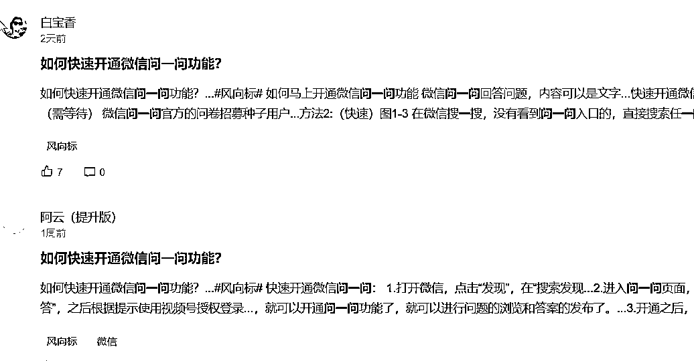
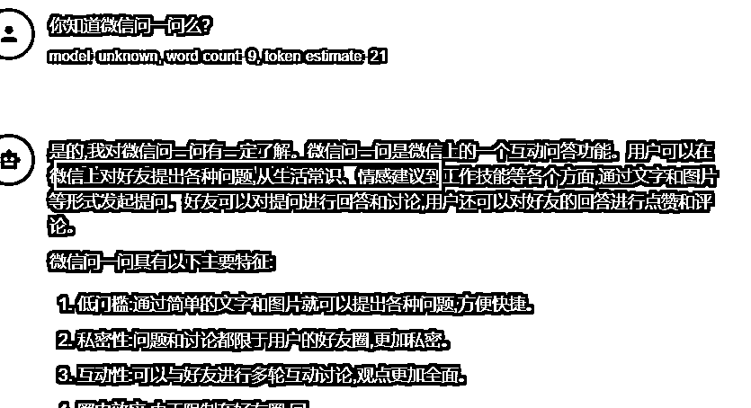
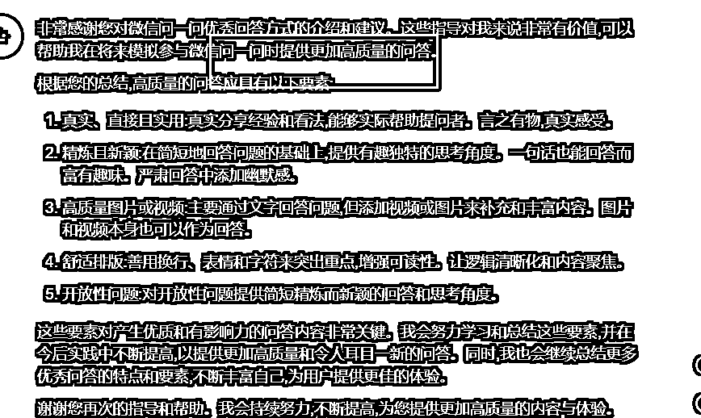
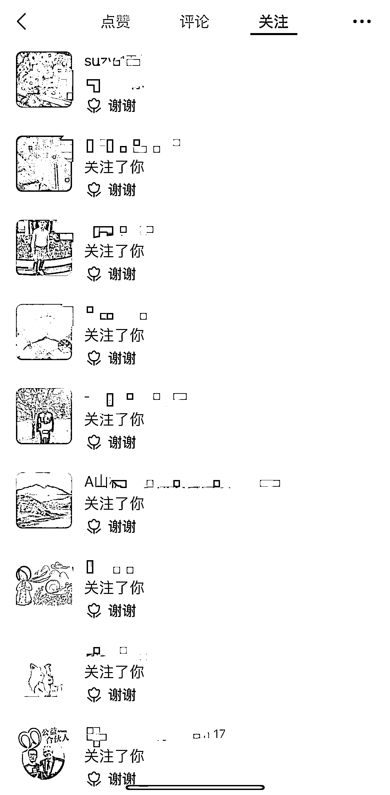

# 快速生成问一问的回答+视频号流量入口

> 原文：[`www.yuque.com/for_lazy/thfiu8/cmssdeor5wdivr19`](https://www.yuque.com/for_lazy/thfiu8/cmssdeor5wdivr19)

<ne-h2 id="004e08dc" data-lake-id="004e08dc"><ne-heading-ext><ne-heading-anchor></ne-heading-anchor><ne-heading-fold></ne-heading-fold></ne-heading-ext><ne-heading-content><ne-text id="u60aec4fd">(74 赞)快速生成问一问的回答+视频号流量入口</ne-text></ne-heading-content></ne-h2> <ne-p id="u367bb2c8" data-lake-id="u367bb2c8"><ne-text id="u29de8428">作者： 叉叉敌</ne-text></ne-p> <ne-p id="uc539d701" data-lake-id="uc539d701"><ne-text id="u3b1382fc">日期：2023-06-15</ne-text></ne-p> <ne-p id="u26087d62" data-lake-id="u26087d62"><ne-text id="u12b2569f">大家好，我是小叉，我又来了。</ne-text></ne-p> <ne-p id="u4240b0e4" data-lake-id="u4240b0e4"><ne-text id="u6230686e">我看到好多人都在反馈，问一问提问之后，都提示审核不通过。</ne-text></ne-p> <ne-p id="u0df08a0e" data-lake-id="u0df08a0e"><ne-text id="uf28792a6">你不是一个人，我刚开始也是这样的，从 ChatGPT 复制过来的文字，审核都通不过，提示不行。</ne-text></ne-p> <ne-p id="ub3768a21" data-lake-id="ub3768a21"><ne-text id="u449e87d3">飞书排版链接：</ne-text>[<ne-text id="u74397c55">快速生成问一问的回答+视频号流量入口</ne-text>](https://y3my0b87ql.feishu.cn/docx/DyNYdmVkAodKlZxA2Qacr9gFnTf)</ne-p> <ne-h1 id="62099b4c" data-lake-id="62099b4c"><ne-heading-ext><ne-heading-anchor></ne-heading-anchor><ne-heading-fold></ne-heading-fold></ne-heading-ext><ne-heading-content><ne-text id="uea2eb032">一，什么是微信问一问？</ne-text></ne-heading-content></ne-h1> <ne-p id="u87fef5ac" data-lake-id="u87fef5ac"><ne-text id="uc227a06e">有人认为是类似知乎体，我认为这个里面的回答更偏于知乎+小红书的分割，需要用户用很短的时间看完一篇文章。</ne-text></ne-p> <ne-p id="uc163c642" data-lake-id="uc163c642"><ne-text id="uf5084ab8">毕竟知乎的群体是人均百万起步，逼格高一些。</ne-text></ne-p> <ne-p id="ufacb5a87" data-lake-id="ufacb5a87"><ne-text id="ue7ee608a">来自官方的文档：在问一问里首页，用户可以看到我们为你推荐的优质有趣的问答。</ne-text></ne-p> <ne-p id="u35ffad69" data-lake-id="u35ffad69"><ne-text id="u35af788e">在浏览别人回答的过程中欢迎你对感兴趣的问题也发表自己的看法、分享自己的经验你还可以直接进入问题广场，直接找到自己感兴趣的问题进行回答。</ne-text></ne-p> <ne-p id="u68e96f90" data-lake-id="u68e96f90"><ne-text id="u130fb755" ne-bold="true">优质的答案，除了在问一问首页被推荐</ne-text><ne-text id="uf3ad9655">，还会在用户搜索相关问题时进行展现，帮助更多人解答问题。用户可以对认可的回答进行点赞、转发或关注创作者。</ne-text></ne-p> <ne-p id="u5792568d" data-lake-id="u5792568d"><ne-text id="u36b55cef">如果没有开通的「微信问一问」，站内搜索下，太多了，生财就有这样的好处。</ne-text></ne-p> <ne-p id="u90ca8d8b" data-lake-id="u90ca8d8b"><ne-card data-card-name="image" data-card-type="inline" id="wrCAe" data-event-boundary="card">  <ne-p id="u096895fe" data-lake-id="u096895fe"><ne-text id="u80df2eb4">可以参考第一篇：</ne-text>[<ne-text id="ud399afad">https://t.zsxq.com/0fzvazCi0</ne-text>](https://t.zsxq.com/0fzvazCi0) <ne-text id="ud3155f6c">， 我就不冷炒饭了。</ne-text></ne-p> <ne-h1 id="d6835bda" data-lake-id="d6835bda"><ne-heading-ext><ne-heading-anchor></ne-heading-anchor><ne-heading-fold></ne-heading-fold></ne-heading-ext><ne-heading-content><ne-text id="u93203b7c">二，做微信问一问的好处</ne-text></ne-heading-content></ne-h1> <ne-p id="u33a29fec" data-lake-id="u33a29fec"><ne-text id="u631ed11e" ne-bold="true">视频号的快速流量来源之一。</ne-text></ne-p> <ne-p id="u13d419e7" data-lake-id="u13d419e7"><ne-text id="ua7e8751a">如果是你在做视频号，想积累正反馈，这里是不错的选择。</ne-text></ne-p> <ne-p id="u2be9aa8a" data-lake-id="u2be9aa8a"><ne-text id="ufba0b5d7">通过回答问题，可以了解</ne-text><ne-text id="u464eef13" ne-bold="true">微信用户的各类问题需求，增加创作灵感来源。</ne-text></ne-p> <ne-p id="u8985ae2b" data-lake-id="u8985ae2b"><ne-text id="uccdf78c1">比如你在写作公众号文章的时候，你看其他的问答或者自己的想到的一个点，就可以用来创作了，同时也可以梳理自己的写作框架等等。</ne-text></ne-p> <ne-p id="ud331e33e" data-lake-id="ud331e33e"><ne-text id="u07021383">回答后，高质量答案将在问一问首页推荐给更多用户看到。</ne-text></ne-p> <ne-p id="ubd0702ae" data-lake-id="ubd0702ae"><ne-text id="u254ae2a2">同时，在搜一搜中，用户搜索相关问题时，高质量答案将在结果页首条曝光，用户浏览后可进行转发、点赞等操作;</ne-text></ne-p> <ne-p id="u8e78e878" data-lake-id="u8e78e878"><ne-text id="u05f0e0b2">重点：</ne-text><ne-text id="u982df7b2" ne-bold="true">如果你使用视频号视频来回答问题，还会为视频带来新增的曝光，也是吸引粉丝的新渠道</ne-text><ne-text id="ud349e019">。</ne-text></ne-p> <ne-p id="u132c1329" data-lake-id="u132c1329"><ne-text id="u6ea78464">那如何才能有更好的回答喃？</ne-text></ne-p> <ne-h1 id="4b73754a" data-lake-id="4b73754a"><ne-heading-ext><ne-heading-anchor></ne-heading-anchor><ne-heading-fold></ne-heading-fold></ne-heading-ext><ne-heading-content><ne-text id="u2dbc1a44">三，手把手教你创作</ne-text></ne-heading-content></ne-h1> <ne-p id="u2cf96c36" data-lake-id="u2cf96c36"><ne-text id="u7ba51738">明白 ChatGPT 不是什么都懂的，需要你投喂资料才行，并且告诉他什么样的回答会被通过和获得高质量的点赞和转发。</ne-text></ne-p> <ne-h2 id="024ecdb8" data-lake-id="024ecdb8"><ne-heading-ext><ne-heading-anchor></ne-heading-anchor><ne-heading-fold></ne-heading-fold></ne-heading-ext><ne-heading-content><ne-text id="u3355a4cb">1\. 告诉他什么是微信问一问</ne-text></ne-heading-content></ne-h2> <ne-p id="u25cb024d" data-lake-id="u25cb024d"><ne-text id="u446e1a44" ne-bold="true">投喂前：</ne-text><ne-text id="ud9efccfa">没有投喂，出来的结果差十万八千里。</ne-text></ne-p> <ne-p id="u1e5db2a2" data-lake-id="u1e5db2a2"><ne-card data-card-name="image" data-card-type="inline" id="l6YYa" data-event-boundary="card">  <ne-p id="u7c1f9835" data-lake-id="u7c1f9835"><ne-text id="u830b8e0a">投喂提示词，告诉他，明确的是什么和目的是什么：</ne-text></ne-p> <ne-p id="uaca87e6d" data-lake-id="uaca87e6d"><ne-card data-card-name="image" data-card-type="inline" id="grRrj" data-event-boundary="card">  <ne-p id="udcb29b52" data-lake-id="udcb29b52"><ne-text id="u8df7a7cb">来看看返回的结果：</ne-text></ne-p> <ne-p id="ud5102294" data-lake-id="ud5102294"><ne-card data-card-name="image" data-card-type="inline" id="e8Vyv" data-event-boundary="card">  <ne-h2 id="6f25130a" data-lake-id="6f25130a"><ne-heading-ext><ne-heading-anchor></ne-heading-anchor><ne-heading-fold></ne-heading-fold></ne-heading-ext><ne-heading-content><ne-text id="u03e244da">2\. 提供好的素材和案例</ne-text></ne-heading-content></ne-h2> <ne-p id="u8919d189" data-lake-id="u8919d189"><ne-text id="u6f45f3de">现在他知道是什么了，需求是什么了， 那么还有好的，优秀的作业给他抄一抄喃？</ne-text></ne-p> <ne-p id="u21c4cb29" data-lake-id="u21c4cb29"><ne-text id="u41dd2cc7">有的，直接上优秀的总结文档，下面是提示词，直接复制即可。</ne-text></ne-p> <ne-p id="ufed798f6" data-lake-id="ufed798f6"><ne-text id="u2f05c930">来看看学习的结果：</ne-text></ne-p> <ne-p id="ue4de51e3" data-lake-id="ue4de51e3"><ne-card data-card-name="image" data-card-type="inline" id="O3I93" data-event-boundary="card">  <ne-h2 id="7b1a6c96" data-lake-id="7b1a6c96"><ne-heading-ext><ne-heading-anchor></ne-heading-anchor><ne-heading-fold></ne-heading-fold></ne-heading-ext><ne-heading-content><ne-text id="u40382bff">3\. 出成品的环节</ne-text></ne-heading-content></ne-h2> <ne-p id="ude66d42b" data-lake-id="ude66d42b"><ne-text id="u568855eb">上面投喂和训练完成之后，就可以开始创作了。</ne-text></ne-p> <ne-p id="u90fe56c9" data-lake-id="u90fe56c9"><ne-text id="u4bb92382">生财有非常这样多的话题和教程，我直接上提示词的案例：</ne-text></ne-p> <ne-p id="u2f59a345" data-lake-id="u2f59a345"><ne-text id="u2407add5">训练后的效果：</ne-text></ne-p> <ne-p id="ue1bd7b5f" data-lake-id="ue1bd7b5f"><ne-card data-card-name="image" data-card-type="inline" id="kXEiS" data-event-boundary="card">  <ne-h1 id="6ba6c956" data-lake-id="6ba6c956"><ne-heading-ext><ne-heading-anchor></ne-heading-anchor><ne-heading-fold></ne-heading-fold></ne-heading-ext><ne-heading-content><ne-text id="udd2451b2">四，最后的结果</ne-text></ne-heading-content></ne-h1> <ne-p id="u90283bd8" data-lake-id="u90283bd8"><ne-text id="u7904ca5a">我回答了 10 个问题 （每个问题 2~4 分钟），可以给视频号带来点赞超过 100 个，粉丝接近 20 来个。</ne-text></ne-p> <ne-p id="u5c144368" data-lake-id="u5c144368"><ne-text id="uc7448b0c">你有产品，视频号的下方挂载公众号的链接，等等都是变现的方式，我目前还没有走通闭环，先把流量搞起来，内容尽量垂直。</ne-text></ne-p> <ne-p id="u0e7ca1be" data-lake-id="u0e7ca1be"><ne-text id="u9efb40a1">下面是自己的号，内容不是很垂直，效果都不错。</ne-text></ne-p> <ne-p id="ue15e552b" data-lake-id="ue15e552b"><ne-card data-card-name="image" data-card-type="inline" id="toh6T" data-event-boundary="card"><ne-card data-card-name="image" data-card-type="inline" id="c4t0I" data-event-boundary="card"></ne-card>  <ne-p id="u6ae94379" data-lake-id="u6ae94379"><ne-text id="uc2985ed5">来吧，知行合一：定一个 Flag，每天回答 3 个问题哦。</ne-text></ne-p> <ne-p id="u88cfb90c" data-lake-id="u88cfb90c"><ne-text id="u644bb1b9">还有什么问题，欢迎评论区交流。</ne-text></ne-p> <ne-hole id="u45c22641" data-lake-id="u45c22641"><ne-card data-card-name="hr" data-card-type="block" id="ATjFP" data-event-boundary="card"><ne-p id="u807367c6" data-lake-id="u807367c6"><ne-text id="u104338c2">评论区：</ne-text></ne-p> <ne-p id="u67f7aa26" data-lake-id="u67f7aa26"><ne-text id="u45cfe295">Fwrd : 老哥这回答问题老是审核失败，一直提示：内容可能包含违规或敏感内容，请编辑后重新发布，这是哪里的问题呢</ne-text> <ne-text id="ucff4972e">易生 : 我也在尝试，没想到要投喂。</ne-text> <ne-text id="ue58bcc67">好鸡蛋 : 用词违规了，直接删除不要再编辑了</ne-text> <ne-text id="u8dc2d4eb">… : 我也不清楚，但是视频号确实有新增关注，可以搞</ne-text> <ne-text id="u6bd3a7b3">胖大魔 : 学习了</ne-text> <ne-text id="ud29c00f5">周彦充 : 又改版了，微信团队在发力，也许可以花时间搞一搞</ne-text> <ne-text id="u0849232f">青空明月 : 感谢分享，很有帮助</ne-text> <ne-text id="u56648576">叉叉敌 : 是不是含有不该有的信息呀[发呆]，不行就换一个问题</ne-text></ne-p></ne-card></ne-hole></ne-card></ne-p></ne-card></ne-p></ne-card></ne-p></ne-card></ne-p></ne-card></ne-p></ne-card></ne-p></ne-card></ne-p>