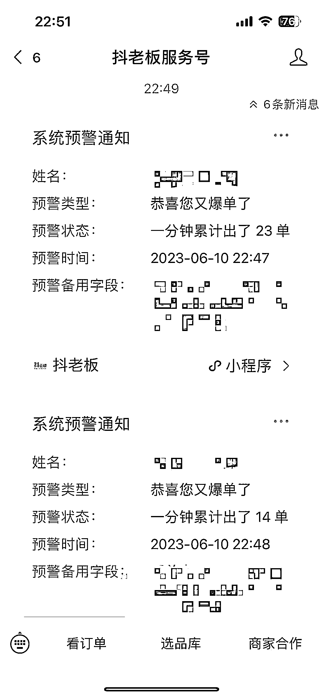
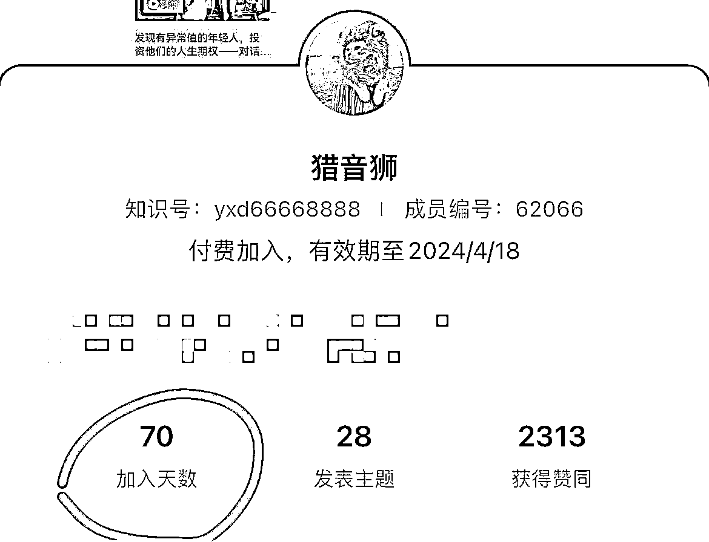
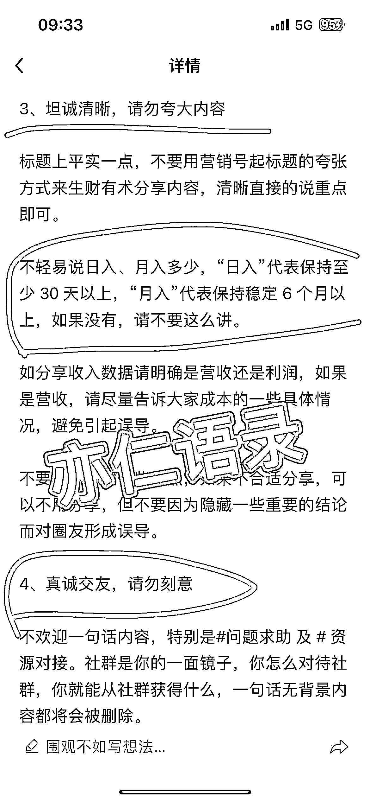
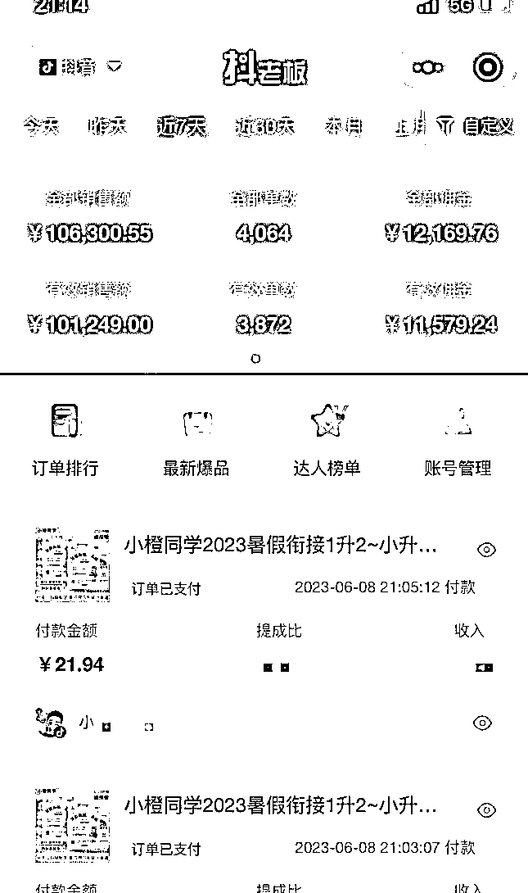
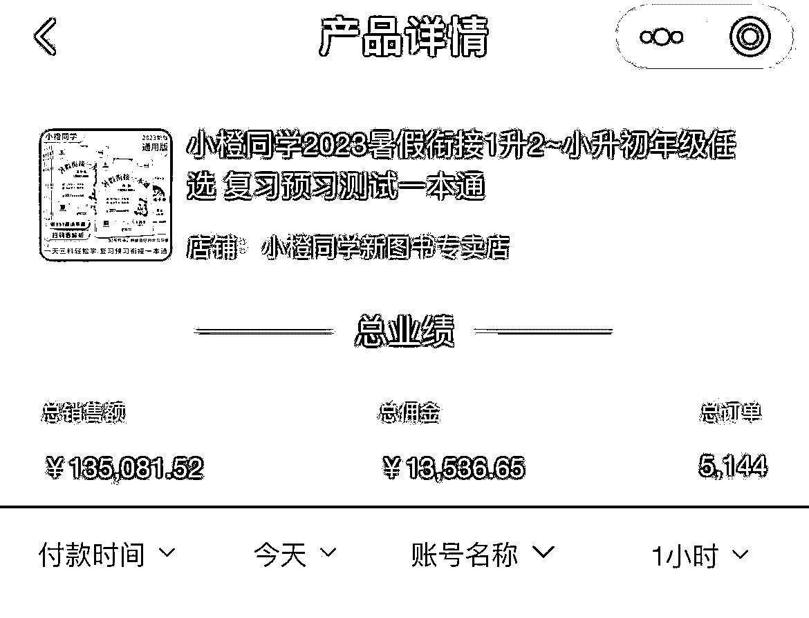

# 抖音洗稿用 5 个字改出热门文案，卖暑假作业出了 5000 多套，利润 1.3W

> 原文：[`www.yuque.com/for_lazy/thfiu8/ola0hk90cp6xry8b`](https://www.yuque.com/for_lazy/thfiu8/ola0hk90cp6xry8b)

## (162 赞)抖音洗稿用 5 个字改出热门文案，卖暑假作业出了 5000 多套，利润 1.3W 

作者： 猎音狮 

日期：2023-06-12 

生财的圈友们，大家好！ 

我是猎音狮，我又来了，我每次来生财分享，都是带着结果来的！ 

今天给大家带来什么好东西呢？今天来分享一下我的洗稿方法！ 

我洗稿卖暑假作业，一个视频出了5000 多套！ 

 

 

分享之前，请允许我谈谈加入生财的感受，这一路，遇到了很多贵人！ 

首先很感激墨鱼兄弟邀请我进生财。掰着手指一算，加入生财70 天了，加入生财前，我的收入是平均每个月 5w，加入后，目前都是每个月稳定 10w。 

 

再次感谢的是亦仁老师打造的圈子！今年加入生财，是我互联网生涯的一个转折点，堪比考进了985！哈哈~ 

 

加入生财后，我第一时间看完亦仁老师发过的所有帖子，这是我当时一天的阅读量！大部分都在看亦仁老师的帖子！ 

 

然后总结亦仁老师把生财有术做得那么成功的精髓，提炼出来四个字：真诚，利他！ 

 

于是我开始分享，至今三篇帖子得到亦仁老师认可，得到了加精，分别是： 

[1、【抖音项目】图书类目短视频投流带货，我是如何月入 10W➕的？](https://t.zsxq.com/0e2QVMLub) 

[2、](https://t.zsxq.com/0e1k8vMdS)[普通人做抖音图书带货，从起号到投流，有哪些具体玩法？](https://t.zsxq.com/0e1k8vMdS) 

[3、#抖音【我层层优化这个文案，从“抄”到“超”，卖中高考押题作文，3 天转化 3000 单＋】](https://t.zsxq.com/0eUuHMVwk) 

好了，言归正传，我开始分享干货！ 

短视频付费打法，其实对新手很友好！ 

因为自然流时代，能把号做起来，确实不容易，哪怕爆了，也是看天吃饭，吃了上顿没下顿的感觉，会让人很焦虑！ 

但是付费时代，你只需要把内容做好就行，然后拿来投流！不看粉丝，只看视频质量，所以只要你开通小黄车，都可以干！ 

但是自然流时代，你开通橱窗，哪怕有 10 万粉，赚钱都很难，所以我说，付费时代，大家都是公平的，就看谁拍的素材牛，拼素材！ 

 

投流有两种方式： 

第一、拿高佣，自己投！ 

第二、低佣，商家代投！ 

很多圈友看到代投的佣金都很低，喜欢第一种方式，但是投了一久下来，发现赚钱的反而是第二种。 

我们来看看团队的这个小伙伴，刚起的新号，做真人出镜，一周赚 1w，就是商家代投！ 

 

 

那么，整个事情的落地，还是回到了视频制作上。 

而且我们出品打的时候，要第一时间上，这样才能吃肉，很多圈友就是观望，抱着个手在旁边看，你没打起来，他就在半边笑话你：看吧，有吹牛逼！ 

你打起来了，他就把问题归因在自己没有样品上，从来不会再自己身上找原因，这个爆单的小伙伴，当时也没有样书，用的是我拍好给大家上传百度网盘的素材。 

所以，在这个卷成狗的时代，不积极真的就是炮灰了！ 

好了，聊到这里，大家是不是想立马做出来一个视频，立马拿去给商家砸钱，今晚睡一觉起床，明早卡里有 1w？哈哈哈哈~ 

 

今天我就重点来聊聊洗稿！ 

因为自己创作，对于我们很多人来说，真的太难了，尤其是我这样的理科生，哈哈哈 

我文案从来不自己写，并不是我不会写，是因为我自己拍脑袋想出来的，没卵用！ 

还是要学习借鉴热门文案，因为你不知道，人家起来一个热门的文案，这期间不知道测试了多少文案了，都是测试出一个高转化的文案，重拍微微修改，重复拍！ 

这样的文案我们先不说它写的怎么样，总之，能卖货的文案才是好文案，卖不了货，哪怕你用文言文写，在带货角度，并没有任何价值！ 

好了，来说说我的洗稿方法！ 

先看一组数据，我洗的稿子，卖上面小伙伴带的暑假一本通，也爆了！目前卖了 5000 套＋，还在飙升中…… 

 

目前 246.8w 播放，点赞 7000＋，差不多一个赞成交一单了！ 

 

没有数据的文案不是好文案，好了，看完数据，我们来看我是怎么改的文案。 

这是我以前做自媒体时候自己研究出来的，就五个字： 

# 留，增、删、调、换 

留：保留主要信息 

增：增加丰富表达（这一步就是超越的部分） 

删：删除多余或者无用文案 

调：调换顺序 

换：替换内容 

下面我们来实操： 

爆款文案（卖猿辅导的）： 

来源于账号：榜样妈妈团图书 

原视频： 

1.51 CuF:/ 复制打开抖音，看看【榜样妈妈团图书的作品】二年级的暑假是最可怕的！不用功，开学差距就拉开了！... https://v.douyin.com/UnKFP2h/ 

文案： <ne-quote id="u0d4b125b" data-lake-id="u0d4b125b">

我改了一下，用来卖小橙同学的暑假一本通： <ne-quote id="u9da423f4" data-lake-id="u9da423f4">

黄金三秒延伸： 

新增前三秒开头、首帧带文字 

孩子#期末考试的扣分的重灾区都在这!看，这就是考试的重灾区(易错题或者暑假一本通复习册) 

●二年级欠的债，三年级是要还的! (年级以此类推) 

如果暑假只能选一套书，应该选什么? 

●有远见的妈妈，这套猿辅导的暑假一本通早就给孩子安排上了 

●孩子多看一眼，就能多得一分! 

●明智的妈妈现在就开始入手了，不然真的晚了 

●x 年级升 x 年级，复习捷径他来了! 

●给 x 年级的孩子提个醒，x 年级如果想进年级前十的话，这个暑假的安排非常重要 

●二升三的暑假这样过，三年级语数英横着走!(年级以此类推) 

● x 年级成绩一般的孩子，如何逆风翻盘，逆袭成为学霸呢? 

●小升初倒计时开始，时间紧任务重，如何高效复习短时间突击逆袭? 

●九月份上 x 年级的孩子，一定要给孩子准备这本书，暑假打场漂亮的翻身仗 

●即将 x 年级的小朋友注意了，这本书一定要给孩子准备好，让孩子翻身做学福 

●·x 年级想要把成绩提起来的孩子，暑假一定要做这件事，帮孩子弯道超车 

●只要你在期末考前 20 天刷到这个视频，孩子的期末考试就不用担心了 

● x 升 x 是个分水岭，很多孩子就是在 x 年级的时候被拉开差距的 

●x 升 x 的孩子暑假想弯道超车，又不想让孩子刷太多的题，可以试试。。。 

●年级是个坎，二年级是个坡，三年级是个峰，想让孩子顺利翻过这个峰，暑假就要用暑假一本通 

+产品介绍 

好了，这就是我对这次爆单的复盘，希望能给圈友们带来启发！ 

我是猎音狮，专注教辅赛道短视频带货。如果我的分享对你有所启发，就麻烦帮我点个赞，你们的认可与鼓励，将是我继续分享的动力！谢谢！ 

同行交流 VX：xxsnb6688 

评论区： 

墨鱼 : 豪叔客气了，进入生财之前，我们虽是点水之交，但是每天在群里看到你爆单，又能和大家在群里分享，让我既羡慕你的才华又嫉妒你的能力，还记得 22 年 4 月份初次邀请你进生财，那时大家都很忙没有过多沟通，就错过了 22 年的 418。今年生财新的一期来临时，我就想到了你，为什么我一定要追着你邀请你进生财，原因有这几点： 1、豪叔真的非常乐于分享 2、豪叔实操经验全部真实且一步一步走出来的 3、豪叔是拿到了结果的 3、豪叔也会收徒陪跑，但是每一个都交付到了，因为我常年都在豪叔的核心群里，眼见为实 4、豪叔执行力真的超强，而且时间利用率非常高效 5、豪叔利他利己的价值观不是嘴上说说，是真的做的很好 6、对于生财，我觉得你的实操经验真的应该分享在生财这个大家庭里，让更多人在生财找到赚钱的方向。 7、对于豪叔，有一句话是这么说，站在巨人的肩膀上，你亦会成为另一个巨人。 

以上是仅是我个人对豪叔的真实感受，正好借豪叔的这篇帖子，回应下豪叔对我的感谢。 猎音狮 : 感谢邀请，感谢认可[抱拳][抱拳] 木木 : [强] 刘皇叔 : 跟着豪叔，收入翻了几番的飘过~ 猎音狮 : 太水了，真诚一点，皇叔自己就很厉害[捂脸] 猎音狮 : [抱拳][抱拳] Luke 王子 : 生财有幸遇到豪哥，不仅收入增加，认知和执行力也在提升！ 猎音狮 : 感谢认可与支持[抱拳][抱拳]</ne-quote></ne-quote>