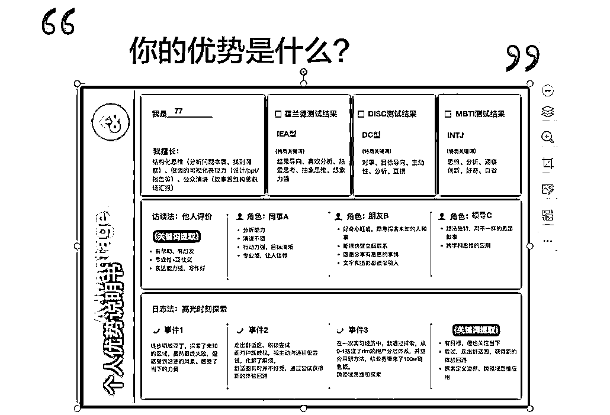
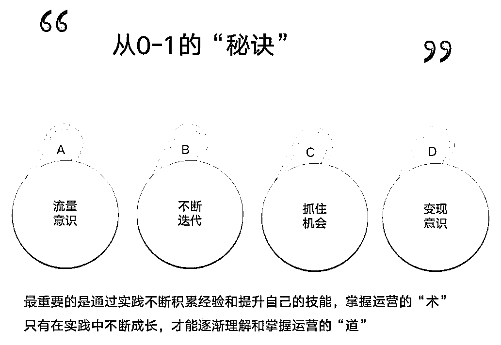
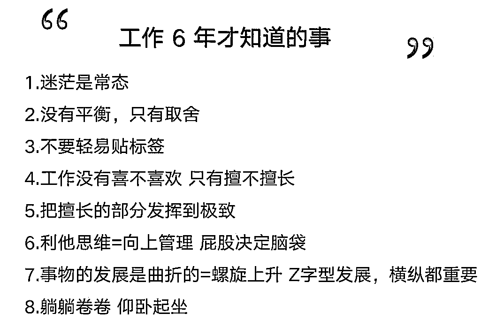

# 引流团队如何做到小红书单月引流 13000＋，全年变现 1000W＋

> 原文：[`www.yuque.com/for_lazy/thfiu8/iudhs9u7ai6y9k7p`](https://www.yuque.com/for_lazy/thfiu8/iudhs9u7ai6y9k7p)

## (精华帖)(265 赞)引流团队如何做到小红书单月引流 13000＋，全年变现 1000W＋ 

作者： 佳能 

日期：2023-06-13 

引流团队管理分享：如何做到小红书单月引流 13000＋，全年变现 1000 万＋㊙ 

大家好，我是佳能，生财潜水新人，谢无敌老师的关门弟子，目前在做线上教育类目，今天主要给大家分享一下我做小红书以及团队管理的一些经验。部分知识来自于谢无敌老师的实战营 。 

先做个自我介绍，今年是我工作的第 6 年，这 6 年期间我打过杂，带过项目，当过运营主管，也自己创过业，目前是公司的合伙人。目前我和另一个朋友共同管理着 15 人的团队，通过 0 成本获客，我们在 45 天内做了 100 多个账号，引流了 3 万多人到微信，单月变现 80w+，全年变现 1000w+。 

我现在的岗位名称是全栈运营，或者叫全域运营，知乎、b 站、公众号、微博、抖音都有做过，运营种类也很广，活动运营、产品运营、增长运营、内容运营和社群运营，也全都做过。 

一、先聊实战，结果倒推 首先问大家 3 个问题： 你有没有制作流量热点地图？ 你的矩阵号有没有进行分类？ 流量爆了之后，成单率是不是也变高了？ 

大家可以带着这三个问题，再来看我接下来的分享：单月引流 1w3，我做对了哪些事情？ 1.抓住热点，提前 2 个月布局 我觉得不管开展什么业务，新业务也好，老业务也好，最好是赶紧去把全年的流量热点地图做出来。 

比如大学四六级考试，永远是考前一个月流量最多。减肥类目，春天和夏天需求是最旺盛的，因为冬天大家都爱吃火锅，而且天气比较冷，不愿意动。 

再比如考研行业，它的热点是 2 月出分，3 月国家线，这些就是自然热点，自然热点是什么意思？就是平时可能默默无闻，突然在 2 月 3 月的时候，考研就炒上了微博热搜。而微博热搜是大家评判行业热点的一个标志，有了热点，就要提前 2 个月甚至 3 个月开始布局起号，热度一来马上就有流量了。 

我的经验是，热度前的 2 个月是最忙的时候，等到热度一来只需要及时回私信，跟进爆款就好了。哪怕你这个行业没有明显的淡旺季，也一定要总结出来，这样你的工作才能有节奏。才能提前两个月布局，布局工作一定要做到位，而且要做准，如果做不准的话，来的流量一是没办法变现，二是流量不够。 

2.矩阵做号，分类要到位 

做流量矩阵，不能为了矩阵而矩阵，比如你做 10 个账号，不是说随随便便注册好了就直接发了，一定要有分类。 

我们做流量是为了赚钱，赚钱就要从产品去倒推：产品的受众人群是谁？向往人群和势能人群分别是哪些？有什么样的特点？在哪些平台上？会看哪些内容？ 

举个例子，比如我的产品受众是 40 ~ 50 岁的男性，这些男性不太可能玩小红书，他们玩手机一般会看一些国家大事，爱用的平台可能就是头条和抖音，他们会把头条当搜索引擎来用。 

刚好头条是文字类，抖音是视频类，这两个平台直接把我们输出的内容分类好了，我们可以以此为方向去做矩阵号。 

做矩阵号的话一定要对账号进行分类，无敌在实战营课里也有讲到过，账号要从咨询类、晒单类、官方类、 IP 类，还有行业细分类去做。 

①晒单类 最左边的这个就是晒单号，这个账号也是无敌老师在实战营群里分享的，你看一个蛋糕才 1000，但是花了 2000 配送，激起了好奇心，就很想点进来，对吧？ 

晒单号就是直接把和用户的聊天截图，发到公域平台上，因为人都有偷窥欲，在这个过程中，让用户的嘴夸你的产品：这个蛋糕虽然只要 1100，但是它值 2000 的配送。 

那用户就会想到两点：1 这个用户怎么这么有钱，是不是冤大种；2 我想看一下这个蛋糕长什么样。 

②咨询类 第二张图：运营小白必看 16 个书籍，这个就是资讯类的账号，这个不用多讲，我觉得大家应该都知道，其实就是合集类。 

③官方类 第三张图为官方号，如果大家做个人 IP 的话，我觉得没必要做官方类，但如果是在公司里面做账号的话，有一个比没有好，不过官方号是要认证的。 

④ IP 类 第四张：xx 学姐，个人 IP 很强。个人和机构号相比的话，肯定是个人的吸引力会更强一些，我们去小红书看内容，更多也都是看个人 IP。 

⑤ 垂直细分类 第五张图，是我找的一个穿搭博主，她身高 165 体重 59 公斤，分享的内容都是针对她这个身高体重的，那么同样体型的用户就可以参考她的穿搭。 

大家也一定要去思考，怎么去做你自己行业里面的细分赛道。我的个人经验是：个人 IP 号和行业细分号是很香的，反而资讯类的不太香。 IP 类和晒单类，更多属于一种品宣，可能平时私信流量很少，但是一来一个准，所以不同账号带来的结果是不一样的。 

所以，你要去思考每个月的 KPI 是什么？你想要涨粉？还是想要引流？根据你的需求去做对应的账号，每个账号大概做多少个，矩阵就出来了。 

不同类型的账号成交率和用户信任度也不一样，具体哪个效果好，需要从用户角度去测试，其实我们是一个需求供应方，而不是给用户创造需求。 

其实矩阵的意义和赛马机制是异曲同工的，东边不亮西边亮，如果我们能把每个平台、每个类型的账号都能运营好，当然是最完美的，但是做到二八定律也很好，把握好最重要的 20% 的账号就能得到 80% 的结果。 

3.一定要从产品出发，不要掉进流量陷阱 

这张图不知道大家有没有看过，我们可以把产品分为四大类：引流品、裂变品、利润品和价值品。 

我以在线教育为例，给大家详细说一下每个品的特点。 ①引流品 大概是 0 到 49 元的区间，它没有信任感，用户只需要出一笔很少的钱，就能体验你的课程和服务，如果不好的话，用户亏的也是很少的一笔钱。 

比如 K12 经常有那种 9.9 元的课程，他会投入很多精力，为什么？因为他不是赚你 9 块 9，他是通过 9 块 9 的课程让你去续费他 349 的课程。 

②裂变品 价格区间在 50- 200 元，它有一定的信任感，但是信任感一般。用户和机构或老师建立了一个基本的信任，用户有意愿把你的课程推荐给其他人的，而且价格不会特别贵，方便用户的好友能够快速做决策。 

如果加入分销机制，比如说 3 人拼团多少钱，那用户的推荐意愿会更强，再加上实时到账，用户对机构会更有信任感。 

③利润品 利润品就是 200 到 500，或者说是 500 到 1000 元，比如 999 元，利润品就是你能挣到一部分钱了，而且用户和老师建立了高信任感，愿意在你这里消费。 

机构应该把重点工作放在这部分用户运营上，不断提升复购率，让这波用户能够再提升一个档次到闭环品上。 

④闭环品 也叫价值品，它的客单价在 1000 元以上，是超高信任感，用户和老师之间建立了强绑定的关系，不管是利益上还是情感上。 

此时的用户不仅是你的用户，更是一个渠道，它能帮你源源不断的带来高净值的用户，他就是你的口碑。 

我们做运营，做流量，肯定是为了把产品卖出来，那在设计产品的时候一定要把每一块都给做好，你可能这 4 块做不全，但是最起码也要有利润品和闭环品，或者说能让你赚钱的必须要有。 

前期可以加一个引流品，我建议百元以下，或者是 10 元以下，筛选愿意在你这儿付费的用户，哪怕掏 1 块钱也比直接过来白嫖要好很多，要香很多。 

做运营一定要学会算账。比如说你要赚到 10 万元，或者你公司这个月业绩指标是多少万，那你首先要测算成本，其次要拆解到各类产品，流量品、引流品、利润品，每个品大概要卖出多少，才能达到业绩指标？算成单转化率，再根据转化率去算要加到多少线索，就是一个倒推。 

不管做什么都是倒推，从结果倒推我们现在要做的动作，而不是说我有 10 个账号，我这 10 个账号能带来多少流量？转化率多少？我能赚多少钱？并不是这样的，是我要赚到多少钱，倒推出我要做什么样的动作，这个思维一定要转换过来。 

4、私域高客单的转化 ①SOP 话术一定要设计好 

用户的疑问点可能也就 10 个、 20 个，通过沟通，了解用户需求和可承受产品的价格区间，然后给用户打标签，后续维护起来，就能更好地切中用户痛点。 

高客单的产品一定是需要时间来养的，不可能加了马上成单，所以说转化路径的设计是很重要的。 

②意向人群的锁定 我引了 1 万 3 的用户，成单大概是 80 多个，剩下的 12920 可能都不是我的意向用户。但是我能保证这 13000 都是我这个业务的，就是考研的学生，但不能保证这些都是能消费的起我的产品的学生。 

所以说用户分层很重要，能够极大的节省时间，针对不同层级的用户去推荐不同层级的产品。 

③做好长期维护和服务的准备 我觉得 5000 以上就算是高客单价，一定要沉下心来做长期维护。像我这边 1 万以上的产品，成单时间最短转化周期都是一个月，一般是 1- 3 个月。 

④人设 人设就等于信任，你的朋友圈，你的头像，你的签名，还有你的社群维护，这些细节都是很重要的。 

我建议大家坚持发 5 条朋友圈，时间要定好，分类要定好。朋友圈配图一定要考究一些，一张好的宣传图，是用户没有点开放大时，就清晰的知道大概有哪些东西，然后被吸引进来。 

其实跟咱们小红书封面设计是一个道理，你打开小红书，信息流一个页面是 4 篇笔记，你怎么做到在这四篇笔记里，让用户点到你的笔记里，而不是其他人的笔记。 

要把这个思考点也用到你的朋友圈里，因为朋友圈也是一个信息流。 

二、再聊管理，承上启下 

接下来是团队管理这块，它其实是一个承上启下的动作。我觉得我们在座的每个人，多多少少会涉及到管理这方面，因为不管在公司上班还是自己创业，你不可能一直是一个人。 

关于团队管理，也是先问大家几个问题，然后我们再来聊团队管理 sop。 你觉得管理最重要的工作是什么，人 or 事？ 从月度、周度、日度来看，管理 sop 如何制定？ 工作流、业务流、绩效、培训是否都定好？ 1、会不会做 

①工作流 从早上 9 点上班到晚上 6 点下班，具体的工作安排。工作安排最好以半个小时为单位去规划，上图是我们公司内部的一些工作流。 

因为我们的引流路径已经跑通了，所以没必要按照半小时去卡点，但是新业务或新创建的团队，最好以半小时为单位去规划。 

②业务流： 相当于咱们星球以及实战营的课程，教给大家平台规则、发文要求、爆文技巧，以及引流方法这些硬核技能知识。 

我每周都会带着部门 20 多个人去听课，听完课我要求每个人都输出手写的笔记和思考，这里就涉及到了培训。 

③培训 培训又分为四块： 1⃣️部门内部的业务能力培训，比如我让他们听课，听完课后运用到日常工作，提高工作效能。 2⃣️外部的跨部门协作培训，比如职场上你怎么沟通，怎么说话。 3⃣️公司层面的培训，你要对这个企业有一定的认同感，而不是说和公司是对立的。 4⃣️职场技能层面的培训，比如职业礼仪、职业素养等。 

这样从各个方向把员工的素质打造起来，他就不是一个单纯的引流工具人。我们做矩阵账号，不管用的兼职还是全职，它都是一个可复制的岗位。但我还是希望成员能在工作中找到一些意义，学到一些东西，而不只是简单的工具人，在这个过程中他能知道自己的不足，也知道该往哪个方向去弥补自己的缺陷。 

④学习氛围 运营岗位一定要不断输入，比如说我们加入无敌的星球，是因为对知识有一定的渴望，这种品质我们要去影响给团队其他成员。这里要注意一点，就是培训之后一定要有考核或者审查。 

记住一句话：员工只会做你检查的事，不会做你安排的事。 

就跟学生做作业一样，你不规定明天要交，他今天肯定不做，但你说明天要交，而且还有打分制，达不到几十分，就会怎么样？他就会更上心。 

培训也一样，一定要让员工自己去思考如何优化手上的工作，不能为了培训而培训。 

2、如何自主做 

①要设置有增长空间的薪酬绩效 包括可量化的、不可量化的、关键指标、绩效考核等。 

绩效这块，我是按照可量化的发文量和爆文量，达到多少才可以拿到对应的爆文提成。 

除此之外还要有个浮动奖励，比如我这个月给他定的目标是一个月引流 2000 个，如果做到 2500 或者 3000，我会额外给一笔钱。你要刺激他不断地做更多，而不是说拿个底薪就 OK 了。 

在做绩效的时候，建议大家用阶梯去奖励。比如说你单月引流 1000 以下是 5 毛钱一个， 1000 以上是 1 块钱一个，阶梯标准具体定多少，要根据大家的 Roi 去定. 

②月度和年度的奖项设置 针对可复制的工种，也就是专注引流的员工，建议做短期奖励，也就是月度奖励。 

对于比较出色的员工，那种不可复制、很牛逼的，你想留住他，就要做年度奖励，比如说年终奖或者 13 薪，或者你跟他做项目合伙，项目分红，但千万不要直接提拔成公司合伙人，项目合伙就可以了，要一点一点去满足。 

③打造互帮互助的氛围 我会在开早会的时候，把昨天的引流数公之于众，做得好的点名表扬，让大家鼓掌，然后让他分享一下经验，整理成文字，发到运营群，把引流效果好的笔记链接也直接发到群里，供大家参考。 

做得好的一定要当众表扬，做得不好我觉得没必要当众批评，但是要一对一的批评。 

3、如何有效地做 其实就是工作计划、工作执行和工作总结复盘。 

目的是确保工作的饱和度，月度、周度、日度都需要盘点，工作饱和度这块，我觉得大家可以自己去测试一下。 

我们自己的运营团队，有的负责 5 个小红书账号，有的负责 10 个，我是根据不同的账号种类以及素材量去敲定的。 

负责 5 个的，就是精细化运营，内容可能偏干货一些。负责 10 个的就是追热点。 

还有一点要注意，就是小红书做得越久，你的速度会越快。 

所以工作流这块，我建议半个月更新一次，如果你精力 OK 的话，一周更一次都是可以的。如果你不更新你的工作流，员工的划水时间就会越来越长，工作效率就会越来越低。 

除非他特别聪明，会在工作中不停地思考如何做爆款，如何把流量给做起来，但是这样的人 10 个里面可能只有一个，甚至一个都没有。所以我们把底线给定好，至于能不能往上走，就要看能不能找到这种人。 

4、如何落地 首先是数据分析，不同平台、不同账号、不同内容、用户意向度这些都要分析，因为我不是只做小红书，我还做抖音、公众号、知乎、微博，包括我现在也在布局 b 站。 

要根据结果去投入人力、成本、精力，带领每一个运营梳理工作流和饱和度，明确好引流的有效方法。 

然后整理培训资料，制定好月度、周度、日度的培训计划。并且每天都要汇总工作完成情况，通过结果去抽查过程，也就是说通过引流数据去抽检账号，引流数据做不起来，要么是账号的问题，要么是人的问题。 

我们上周发现一个运营数据特别差，每天只引 4 、5 个，跟他聊了聊，问他是怎么做的，他说直接抄对标账号。问他抄的哪几篇？他说就是 12345 这几篇，再一看他抄的那些都是点赞连 10 个都没有的。 

所以，员工在做的过程中，他接收的信息可能和我们传达时是有偏差的。通过抽检动作去审查他的工作过程和思路是很重要的。 

可能他觉得按照你的想法去做了，但没做出来，就是账号的问题，但事实是吗？并不是。然后你还去怪他：我给你培训这么久，在你身上花了这么长时间，你没做出结果来，为什么其他人可以，你不可以？ 

所以这个中间是有误差的，遇到问题不应该先去问责，而应该去解决问题。 

5、管理原则：向内找 在开展项目前，或者每月初，一定要定好规则，定好打法，然后赏罚分明，通过数据去抓过程。结果做不出来，过程肯定是有问题的。 

我们做小红书时，怎么去看过程呢？按照三驾马车的原则。 

三驾马车是什么？选题，主图还有标题。 

把员工按照会不会做和想不想做分类一下，如果会做想做，但我们的支持没到位，就是说没有给到培训，那么作为管理，肯定要反省自己的问题，如果他不会做不想做，就涉及到态度层面的问题，需要一律优化掉。 

大家看这个四象限图，有才有德的员工就是右上角的明星，他是团队的榜样。对待明星的核心态度是捧，物质上要慷慨，精神上要表扬， 

那有才无德的员工是什么？是野狗，就是左上角的，对于野狗的话要限制地用，甚至消灭掉。如果这个人不能为你所用，那他到底还是不是人才，是需要打一个问号的。 

第三个是能力差一点，但是任劳任怨的员工，叫老黄牛，老黄牛可以放心用，但是黄牛容易随风倒。如果你公司或者团队明星比较多，那他就会学明星，如果野狗比较多，他就会学野狗。 

第四个是无才有德，无才有德就是右下角小白兔，小白兔态度很好，但是业绩不好，我觉得可以多培训，但如果变成常年的老白兔，就一定要清理，否则公司就是白兔成窝，人效会很低很低。 

一句话总结：捧明星，消灭野狗，清理老白兔，放心用黄牛。 

还有一点，管理团队时，其实是可以适度放养的，只要确保培训到位，必要的部门协同支持到位，工作饱和度也能安排到位。那就用结果说话，你做的越好就越自由，干涉得越少。 

三、TO: 0- 3 年的运营人 也是三个问题： 你了解自己吗？ 你了解运营吗？ 行业变动下，如何建立自己的护城河？ 1、你的优势是什么 

这个跟咱们做小红书账号选赛道是一样的，可以通过测试，比如霍兰德、MBTI 测试，或者通过身边的朋友、领导、同事的评价，他们觉得你的优势是什么？你的缺点是什么？ 

也可以从你自己的一些高光时刻、记忆最深的、最有突破的事件中，多个方向去考虑，千万不要只从一个方向去看自己，尤其是上面的测试，比如你现在是 INTJ 型，但它只是你的一个阶段，不同阶段你要重新去测试，它不是定死的。 

认识自己，是为了取长补短，而不是单纯的扬长避短。大家一定要注意是取和补，而不是扬和避。 

我觉得短板还是要补的，因为我们作为运营，你不是单纯只做运营这个工种，你要知道产品是什么，你甚至要学会研发产品，你要知道销售如何转化的，这样你在做流量的时候，才能切中用户痛点，我希望大家多方位去发散，把自己的优势去扩大，或者说把自己的短板给补齐，至少作为运营是这样。 

2、从 0-1 的“秘诀” 

①流量意识 我觉得流量是一个公司的根，你连用户都没有，你怎么成单，做运营不能只服于内容，品宣工作固然重要，但是光有口碑没有用户的话，我们是赚不到钱的。 

②不断迭代 比如 15 、16 年的公众号裂变， 17、18 年的抖音，还有 22、23 年的小红书，都是风口。 

“站在风口上猪都能飞”这句话大家应该都听过，其实做生意是这个道理，做流量更是。说实话，如果我没有带团队去做小红书的话，即使碰上考研热点期，我可能也搞不出现在的结果。 

③抓住机会 很多人说找工作一定要进到公司最重要的那条业务线，但是哪条是重要业务线，你光靠面试是无法准确判断的。 

如果这个公司和领导都不错，那可以先进来，在做好本职工作的同时，再去观察，观察最重要的业务线在哪里？业务线里你适合的工作岗位有哪些？这些岗位需要什么样的工作能力，然后沉下心去学以致用，做出结果。 

让重要业务线的领导先看到你，接下来就需要一个时机了，等到岗位空缺，这个位置肯定就是你的。所以抓住机会的真实意义在于做好准备。 

④变现意识 变现按理说是销售的活，我不知道大家有没有看过运营的书籍，它们都会强调运营是产品和用户之间的纽带，也就是说你吸引用户过来是为了卖出产品，不是为了吸引而吸引，这也是我上面强调的，用户一定要做分层，要精准获客。 

虽然我们不是销售，我们不背业绩，但是销售业绩是和我们运营动作是息息相关的。 

3、工作 6 年才知道的事 

第 1 条： 迷茫。 我觉得大部分人都会迷茫，不管是刚工作，还是做了 1 年、 2 年、 3 年，甚至 5 年、 6 年，你都会迷茫。 

我觉得迷茫是常态，当你迷茫时可以用丰田生产法，这也是我经常用的，方法就是不断追问自己为什么，不断向下深挖。 

举个例子，你觉得你自己掌握了一些运营技能，但依旧不自信，原因可能有以下几点： 

你可能引流了几百几千，但和同事大几万的引流成绩相比，显得太少了。 你知道了引流的具体操作手法，但这个能力没办法复制。 引流不能证明你做项目拿到了成果，项目关注的是用户的留存和转化。 

像这样多问自己为什么， 1 个问不出来，问 2 个， 2 个问不出来，问 3 个，不断向下挖，挖到你觉得找到迷茫的答案为止。 

如果是自己的问题就取长补短，如果不是自己的问题，就放过自己，想想真正能够带给你发展的是什么？而不是陷入这种迷茫的状态。 

再来看第 7 条： 事物的发展是曲折的。其实我们每个人的职场生涯，我觉得也是曲折的。职场生涯有一个名词叫做生涯四看，分别是向上看、向内看、左右看和向外看。 

向上看什么？看你在这个企业内可能的职业发展路径，比如你现在是一个运营专员，那么你的职业发展路径就是运营主管、运营经理、运营总监，这是大部分都能联想到的一条路径。 

向内看什么？看在原有领域往深了走，成为专家型的人才有哪些细分方向。比如同样是做运营，你可以做活动运营、内容运营、增长运营、产品运营、用户运营、社群运营，你可以选一个方向去深耕。但是这条路其实很考验大家对于这件事情本身的热爱程度。 

左右看，指的是不同岗位上的变化和尝试。比如以前是做销售的，现在可能想尝试一下公司运营、市场公关这些岗位，当然，这条路是有一定风险的，做得好也许可以成为跨界创新者，但也可能错过工作上持续的积累和精进的机会。 

最后是向外看，就是一个人已经不满足于现有的职业，把一部分精力转移到家庭，或者自身的兴趣发展上，类似于我们常说的斜杠青年。这条路的好处就是除了本职工作以外，还可以获得额外的成就感和幸福感，但是要平衡好主业和副业是有一定难度的。 

也是我说的第 2 点：没有平衡，只有取舍。工作和生活是这样，主业和副业也是一样。经过这样一番梳理和盘点，我觉得大家应该能从迷茫中走出来，知道自己接下来往哪个方向去发展。 

其实没有一份工作是完美的，不能百分百满足你所有的要求。只要大部分满足你最想达到的东西，那就是最适合你的，就是一份好工作。 

所以不要看到别人涨薪升职就去羡慕，然后自己很痛苦。我觉得每个人的花期不一样，做好自己是最重要的。我在第 3 点也说到：不要轻易贴标签，什么意思呢？作为运营，你要全方位的发展，全方位开花，做一个斜杠青年。 

第 4 和 5 条：没有喜欢，只有擅不擅长。你如何把你的擅长点从 20% 发挥到 50%，就是你接下来要做的，你要学会把你的工作做成你喜欢的，自发性的，主观能动的，而不是公司给我这个岗位，给我指派这些活，我就只能这么做。其实我也不喜欢我的工作，但是我每天都会在中间去找乐趣。 

第 6 点，利他思维、向上管理。我们应该都听过“屁股决定脑袋”，你坐在管理或老板的位置上，你能不知道基层员工赚的不多吗？但是基层员工如果不每天 8 小时或者加班 10 小时，公司是无法正常运转的。 

学着把屁股挪到领导或老板的位置上，去思考我应该怎么做工作，才能最大化让领导和老板获利，这个就是利他思维。向上管理并不是你要仰头去向上管理，而是把你的思维魂穿到领导和老板的脑袋里，从领导的角度去做这件事情，能不能帮你的领导或老板解决一些问题。 

最后一点：躺躺卷卷，是躺平还是卷呢？我觉得如果实在很累，你就去躺一躺，休息休息，这样你的状态会更好，这个过程中你也会有更多启发。与其一直不停地在岗位上卷，各种担忧，状态特别特别不好，不如适度躺一下，结果反而会更好。 

希望大家也能越来越好，不论是小红书，还是你自己。 最后，再次感谢我的贵人，无敌老师~  

 

 

 

 

 

 

 

评论区： 

万青 : 感谢分享，全程高能干货[拳头][拳头] 夏汉九 : 感谢分享，从管理者的角度剖析了工作中的问题，不管是打工人还是创业者都很有用。 周周 Mia : 宝子太棒啦~一个月就成长的这么快速 Sherry💎谢无敌 : 实操派写的文章，只说干货，不带废话的[呲牙] 大闵 : 感谢分享，很干 嗡嗡嗡起 JoyBoy : 我也是无敌老师的关门弟子[呲牙] 无敌老师 yyds 佳能 : Yyds 佳能 : 不好意思，第一次发言不知道从文章入口进，附上飞书链接，方便阅读：[https://v4y8yg9y6n.feishu.cn/docx/QRLidI7zHoJxWix3Dr1csKObnsc](https://v4y8yg9y6n.feishu.cn/docx/QRLidI7zHoJxWix3Dr1csKObnsc)