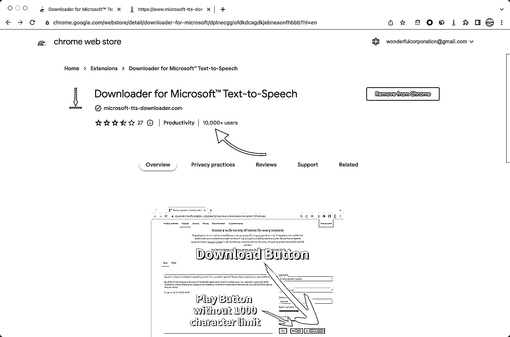

# 围绕大平台做小工具，一直是一个可以闷声赚钱的事情

> 原文：[`www.yuque.com/for_lazy/thfiu8/goibnageme1rfkpk`](https://www.yuque.com/for_lazy/thfiu8/goibnageme1rfkpk)

## (精华帖)(86 赞)围绕大平台做小工具，一直是一个可以闷声赚钱的事情 

作者： Dai 

日期：2023-06-13 

围绕大平台做小工具，一直是一个可以闷声赚钱的事情，这次带大家拆解一个 Chrome 插件，如有启发，不胜荣幸。 

## 背景： <ne-oli index-type="0">1.  2021 年，微软推出了文本转语音服务，各种语言都支持，甚至可以设置声音的情感，效果着实逼真，一般人绝对听不出是机器合成的。可以说甩掉第二名好几条街 <ne-oli index-type="0">2.  最开始微软的官网提供了试听功能，你输入一段文本，它帮你读出来。听完大概率会惊呼牛逼，可是微软偏不提供下载按钮 <ne-oli index-type="0">3.  再后来，微软干脆取消了试听功能。上来就要你注册，甚至绑定支付方式。 

你可以去微软 tts 官网看看 

## 痛点： <ne-oli index-type="0">1.  能听不能下载，而且是非常好听，偏不让你下载 <ne-oli index-type="0">2.  后来干脆试听都没有，断了大家去浏览器开发者工具找线索的可能 

## 案例是如何做的 

作者（大概率是个人）开发了一个 Chrome 插件 

Downloader for Microsoft™ Text-to-Speech 

我盲猜一下原理： <ne-oli index-type="0">1.  微软删除了在线试听，但是没有删除背后的接口，作者找到了这个接口（这是关键线索） <ne-oli index-type="0">2.  插件根据用户提供的文本和其他设置，调用这个接口，微软直接返回 mp3 文件 

技术上做到这里并不难，但还不足以赚钱，我给你分析下作者接下来的操作： <ne-oli index-type="0">1.  将这套原理封装为一个 Chrome 插件，利用 Chrome、Edge 之类浏览器的插件生态，可以把插件铺设到全世界。 <ne-oli index-type="0">2.  创建官网，打开胸怀，接受来自互联网海洋的流量 <ne-oli index-type="0">3.  接入 Stripe 支付，实现全自动化交付，完全无需人工参与。作者重点接入了支付宝，方便中国用户付费，估计是我们国家的开发者 

## 能赚多少钱 <ne-oli index-type="0">1.  插件在 Chrome 的主页显示拥有 1 万+ 用户 <ne-oli index-type="0">2.  插件官网显示按月购买 $2.5/月，按年 $18/年，如果使用支付宝，价格略贵，可能是 pos 费率高 <ne-oli index-type="0">3.  按照 20% 的转化率，$2/月的均价，每月收入 $4000，换成人民币大约 2.8 万，约等于纯利 

估算其实不用那么精确，大概在一个数量级就好了，大家请勿较真。 另外，SimilarWeb 查看插件官网，月流量 1.5 万，果然来自中国。不得不说，中国开发者把握此类机遇的能力，着实越来越强，说不定开发者也在生财 

## 关于我 

微信公众号数据分析软件 wcplusPro 的作者 你可以在官网找到我 [https://azure.microsoft.com/en-us/products/cognitive-services/text-to-speech](https://azure.microsoft.com/en-us/products/cognitive-services/text-to-speech)[https://chrome.google.com/webstore/detail/downloader-for-microsoft/dplnecggiofdkdcagdkjebneaonfhbbb?hl=en](https://chrome.google.com/webstore/detail/downloader-for-microsoft/dplnecggiofdkdcagdkjebneaonfhbbb?hl=en)[https://www.wcplus.cn/?s=sc](https://www.wcplus.cn/?s=sc)  

  

评论区： 

明月 : 国内可以访问吗 Dai : 微软 tts?应该可以 正海 : 给这个插件付过几个月的费用 金色大街 : 我好像也用过这个插件 亦仁 : 感谢分享，已加精华。 Dai : 感谢亦仁老板