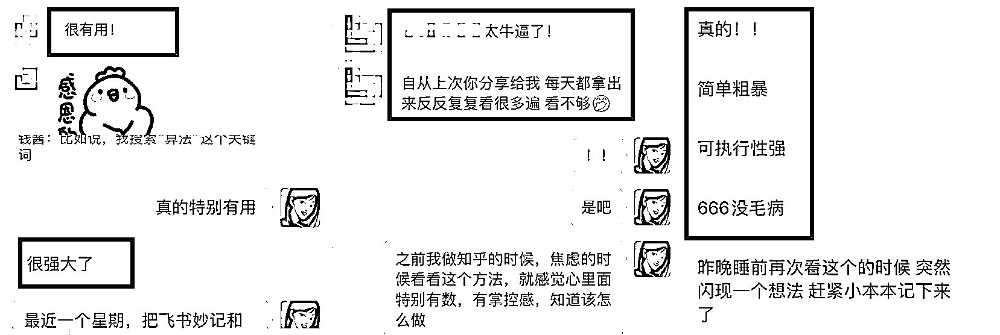
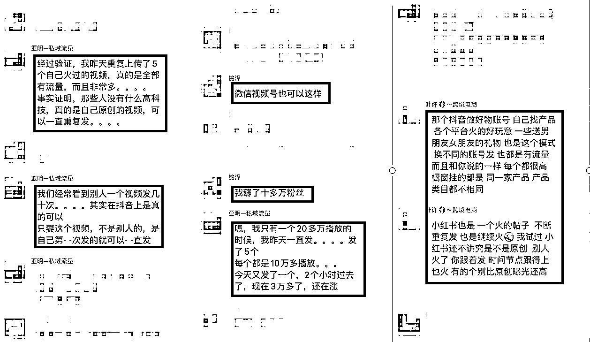

# 知乎引流 4600+，3 个月收钱 35W+，我是怎么做到的？

> 原文：[`www.yuque.com/for_lazy/thfiu8/tanen5g4528xo6ql`](https://www.yuque.com/for_lazy/thfiu8/tanen5g4528xo6ql)

## (72 赞)知乎引流 4600+，3 个月收钱 35W+，我是怎么做到的？ 

作者： 钱酱 

日期：2023-06-16 

算了一笔账，今年年初做了一个自己的付费产品，3 月份推出，截止到现在，一共招募了 34 个人，收钱 35w+. 

当时也没有怎么宣传，因为我不擅长发售，就只是写了一个招募文案，然后公众号菜单栏中给了一个入口，平时公众号写文章的时候，在文末引导一下，现在这个效果，我觉得还是比较满意的. 

实操的过程中，我总结了一些做知乎的方法论，今天这篇文章一次性分享给大家： 

虽然是我做知乎总结出的，但这些方法和思路放在任何互联网项目上，都会让收益上升一个大的台阶。 

内容质量不用担心，我分享给我的朋友们实操过，这是他们的反馈： 

  

好，进入正文。 

我之前做知乎特别沉迷于研究一些技巧，还有平台算法，所以我写过非常多关于知乎的算法、运营技巧的文章。 

但后来知道了，明白再多的算法，不会做内容，就相当于 1000 前面没有那个 1，但如果把内容搞定了，就算不会算法，不会那么多技巧，也能出效果。 

所以，在我看来，我认为现在做知乎，最主要还是内容，而做内容就 2 个思路： 

一个是提高内容利用率； 

一个是提高素材利用率。 

这两个切入点，适用于所有问答平台，包括最近的微信问一问。 

一、怎么提高内容利用率？ 

为什么提高内容利用率？因为把 100 个爆款都说 1 遍，不如把一个爆款说 100 遍效率高。 

我从前做知乎最常用的思路，就是选择自己领域的问题，然后看这个问题的浏览量、回答量，可以的话，就搜集素材，去回答，回答完了再选一个新问题； 

以此类推去做知乎，每天心力交瘁，追着内容跑，感觉自己被榨干，很痛苦。 

后来有 2 件事，让我重新审视了我做内容的思路， 

第一件事是，刷到了一个朋友发的朋友圈，觉得特别有启发。 

就像我虽然擅长写作，但是创作一篇新的内容，远没有把自己的爆款再改 10 遍，发在 10 个知乎问题下效率高。  

第二件事是，在圈子里看到一些朋友的分享： 

看到这两个观点后，我就跃跃欲试，所以我就把自己之前火过的内容，用我的“灵魂改编法”改了改，然后重复发到知乎相似的问题下。  

什么是“灵魂改编法”？我之前花了很大精力详细写过，需要的话，看这篇： 

https://mmmu5tnlrk.feishu.cn/docx/AwMHdgfqxomlshxeCdgcVpEMn9b 

下面这些文章都是我自己改自己的内容，如果你仔细看过的话，你会发现里面的东西大同小异，其实我并没有写很多新的东西，但是他依然能获得不错的数据和引流效果。 

  

有的虽然点赞不多，但是一晚上就有 32 个收藏，后续也会产生连绵不断的精准流量。 

但是要注意，千万不能重复度过高，我虽然重复发，但是特别注意重复率，很多内容我都在我的印象笔记上查了，找到合适的，替换上去，所以原创度还不错，拿不准的话，可以用原创度检测工具再检测一下。 

二、怎么提高素材利用率？ 

我平时在写文章找素材的时候，会有一个问题，举个例子，比如说我现在要回答一个问题，叫： 

“大学生必备的学习软件有哪些。” 

然后我去找相关素材，很多虽然是写软件的，但是我现在用不上，比如： 

“有哪些网站，你一旦用过就离不开了？” 

虽然他是写软件的，但我现在用不上，而过段时间，我可能又要回答这个问题，这时候发现，以前看过的素材，又能用上了，但我还得重新去找，就是利用率不高。 

如果你有这个问题，下面的方法一定要反复多看两遍，最好认真实践一下，我迭代了好几版才总结出最高效、最容易落地的方法。 

在写文章的时候，遇到好的素材，但是暂时不符合题意，直接存起来，怎么存？这块很重要，现在你把脑袋清空，先别想其他的，专注看我接下来的内容。 

先给你说我是怎么存的，我用的印象笔记，就以印象笔记来说，我建立了以下笔记本， 

  

其实新手建立 3 个就足够，分别是：收集箱、等待事项、归档资料。 

我每天看到好的内容，或者写作的时候遇到好的素材，直接扔到收集箱，还有好的课程，虽然来不及有大块时间看，但是我也会放收集箱。 

然后每天晚上我整理一下，好的内容进行修改，然后放归档资料里，来不及看的好课程，我放在“等待事项”； 

等我把手上的事做完了，也就是每周，我就打开“等待事项”看一下，有哪些好素材好课我没看，然后就开始看，看的过程中再记录； 

每晚清空收集箱、每周或者每个月清空“等待事项”。 

一方面知识沉淀的很快，另一方面，一直有源源不断的好内容引领自己去更新迭代。 

还有一方面，其中有好的内容，可以触动我，或者引起我的表达欲，我会去知乎后台查一查相关的问题，怎么查？在知乎后台——问题搜索——查关键词。 

  

选择浏览增量多的，这时候内容和问题就匹配上了，你再按照我给的“灵魂写作法”去改，效率就高很多，带着答案找问题，比自己从 0 到 1 回答一个问题，要简单的多，这是用下来最轻松的方法了，也容易落地。 

只要把这两个思路和里面的细节练熟，做知乎、甚至是做互联网会有奇效。 

最后： 

最近发现了一个规律，越简单越赚钱，这是我今天早上跟我老公聊天的心得，我俩意见出奇的一致。 

很多朋友不赚钱，一个很重要的原因就是“太聪明了”，或者把自己想的“太全能了”，高估自己的精力和能力，低估做一件复杂的事的成本，所以总是心力交瘁，还没有好的效果。 

其实做简单的事比做复杂的事，赚钱的速度要快 10 倍。 

一点经验，感谢观看，希望对你有用。 

评论区： 

梁凉凉 : 不要高估自己的能力，不贪多，专心做好自己目前能做到事情。 钱酱 : 是哒 倪大胖 : 感谢分享。联想到家蒙之前分享过的知乎一文多改的写法，异曲同工之妙。 牛高 : 好文，建议加精 大熊 : 真诚感谢分享 万简 : 找素材群的方法不错 林海盐 : 太棒啦 咕噜咕噜锤 : 这里推荐一下 flomo 和石墨文档，flomo 启动速度快且简约，适合做灵感摘录。 石墨文档适合长文写作（虽然现在我在用金山文档[呲牙]）