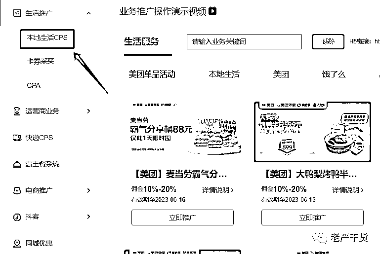
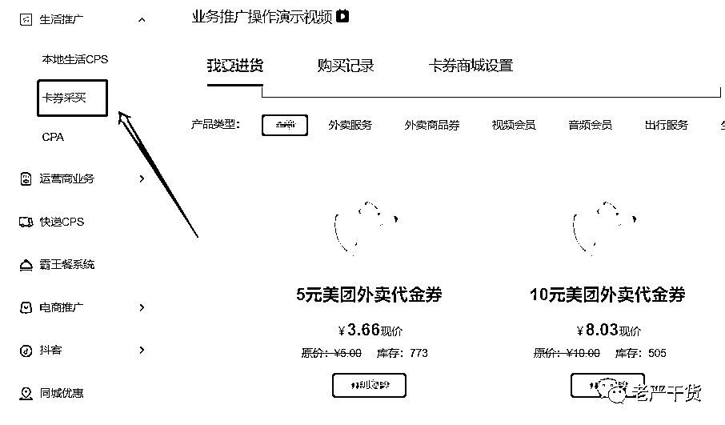
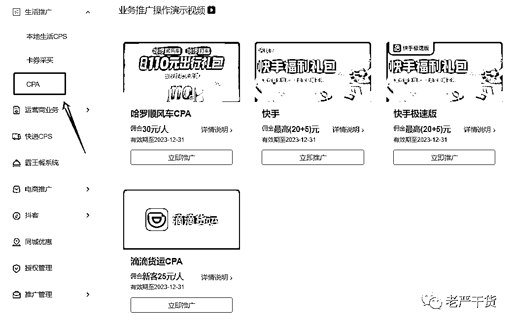
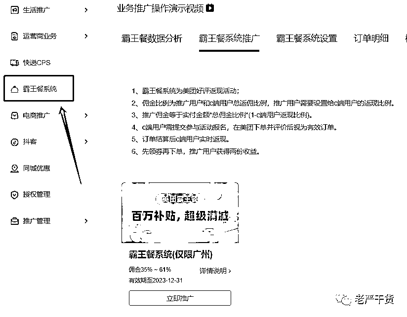

# 7 个能赚百万的私域 CPS 项目

> 原文：[`www.yuque.com/for_lazy/thfiu8/fzao57qdl5ld1zgx`](https://www.yuque.com/for_lazy/thfiu8/fzao57qdl5ld1zgx)

<ne-h2 id="cdf45682" data-lake-id="cdf45682"><ne-heading-ext><ne-heading-anchor></ne-heading-anchor><ne-heading-fold></ne-heading-fold></ne-heading-ext><ne-heading-content><ne-text id="ue582a49b">(49 赞)7 个能赚百万的私域 CPS 项目</ne-text></ne-heading-content></ne-h2> <ne-p id="u1e8ad09d" data-lake-id="u1e8ad09d"><ne-text id="u8eba2663">作者： 老严干货 CPS</ne-text></ne-p> <ne-p id="u6edb6f11" data-lake-id="u6edb6f11"><ne-text id="ud697db95">日期：2023-06-14</ne-text></ne-p> <ne-h1 id="9039450f" data-lake-id="9039450f"><ne-heading-ext><ne-heading-anchor></ne-heading-anchor><ne-heading-fold></ne-heading-fold></ne-heading-ext> <ne-heading-content></ne-heading-content></ne-h1> <ne-p id="u5bc69bd6" data-lake-id="u5bc69bd6"><ne-text id="u71c1e752" style="color: rgb(62, 62, 62);">近 1 个星期，跟云瞻信息创始人【黄海】搞了 2 场视频号直播连麦，聊了 7 个 CPS 多重变现项目，我从中摘了一些精华分享出来，4000 多字，希望对你有用。</ne-text></ne-p> <ne-p id="ud3f696f7" data-lake-id="ud3f696f7"><ne-text id="u2f37eaa3" style="background-color: rgb(255, 255, 255); color: rgb(62, 62, 62);">黄海自己本身在做各种 CPS 项目，而且还是工具商，所以开发的工具特别接地气，简单点说：   </ne-text><ne-text id="u3d6def58" ne-bold="true"> 老严=做 CPS 项目+做自媒体    黄海=做 CPS 项目+做工具商</ne-text></ne-p> <ne-p id="u2e47e95c" data-lake-id="u2e47e95c"><ne-card data-card-name="image" data-card-type="inline" id="pcClA" data-event-boundary="card"></ne-card></ne-p> <ne-p id="ue4846fc9" data-lake-id="ue4846fc9"><ne-text id="u38eb7331" ne-bold="true">项目 1：本地生活</ne-text></ne-p> <ne-p id="u0509938c" data-lake-id="u0509938c"><ne-card data-card-name="image" data-card-type="inline" id="RuCZD" data-event-boundary="card"></ne-card></ne-p> <ne-p id="u435af593" data-lake-id="u435af593"><ne-text id="uefb6b954" ne-bold="true">1.1、【老严】如果要做本地生活项目，是不是只能用同城粉来做？</ne-text></ne-p> <ne-p id="u3b068b6f" data-lake-id="u3b068b6f"><ne-text id="ue75228f2" ne-bold="true">【黄海】</ne-text><ne-text id="u73cc17e3" style="background-color: rgb(255, 255, 255); color: rgb(62, 62, 62);">并不是。</ne-text></ne-p> <ne-p id="u8189ad11" data-lake-id="u8189ad11"><ne-text id="ucac30129" style="background-color: rgb(255, 255, 255); color: rgb(62, 62, 62);">有些以“消费本地生活为主”的业务，可以服务全国各地的粉，不同粉丝会定位距离自己最近的门店。</ne-text></ne-p> <ne-p id="u7a0d7e77" data-lake-id="u7a0d7e77"><ne-text id="u2fad8430" style="background-color: rgb(255, 255, 255); color: rgb(62, 62, 62);">像麦当劳肯德基蜜雪冰城瑞信咖啡直接在我们小程序上最近门店下单，跟我们普通消费者在美团下单时一个逻辑，只不过在我们这里下单更实惠。</ne-text></ne-p> <ne-p id="u87629094" data-lake-id="u87629094"><ne-text id="u66d81254" ne-bold="true">1.2、【老严】一般是如何推广本地生活，直接在群里发优惠信息吗？</ne-text></ne-p> <ne-p id="u3e95c46f" data-lake-id="u3e95c46f"><ne-text id="u78cb42c4" ne-bold="true">【黄海】</ne-text><ne-text id="u65a053bc" style="color: rgb(62, 62, 62);">并不是。</ne-text></ne-p> <ne-p id="ud89ba199" data-lake-id="ud89ba199"><ne-text id="uc8624f7b" style="background-color: rgb(255, 255, 255); color: rgb(62, 62, 62);">一般采取“发爆款+培养用户自主下单习惯”的组合拳。群里时不时发一些超级爆款：什么几块钱一杯的瑞鑫咖啡、折扣力度很高的麦当劳肯德基早餐下午茶套餐……用户最终下单是通过小程序。</ne-text></ne-p> <ne-p id="u59050414" data-lake-id="u59050414"><ne-text id="u74f79109" style="background-color: rgb(255, 255, 255); color: rgb(62, 62, 62);">一旦客户知道这个小程序能优惠下单，用户养成习惯以后，下回他自己想买优惠购买线下大牌美食，就会自己跑到小程序完成下单过程。</ne-text></ne-p> <ne-p id="u091ef1d5" data-lake-id="u091ef1d5"><ne-text id="u2a24af2f" ne-bold="true">1.3、【老严】用户下单以后，一般是外卖还是到店堂食？</ne-text></ne-p> <ne-p id="uce359067" data-lake-id="uce359067"><ne-text id="uea25ebed" ne-bold="true">【黄海】</ne-text><ne-text id="uddb8adb6" style="background-color: rgb(255, 255, 255); color: rgb(62, 62, 62);">都可以，这个跟消费者在美团上下单方式完全一样，如果是堂食的话，下单后会有一个编码，到店后凭编码直接领取就好。</ne-text></ne-p> <ne-p id="uda0c4a4e" data-lake-id="uda0c4a4e"><ne-text id="ud5a802f5" ne-bold="true">1.4、【老严】用户在我们渠道下单，是领取优惠券，还是价格就是比别的渠道优惠些？</ne-text></ne-p> <ne-p id="u3b42640f" data-lake-id="u3b42640f"><ne-text id="ud9024b84" ne-bold="true">【黄海】</ne-text><ne-text id="u025c09dc" style="background-color: rgb(255, 255, 255); color: rgb(62, 62, 62);">这个跟淘客不一样，不是优惠券模式，这个渠道用户下单就是比线下渠道便宜一些，当然用户下单也是可以使用平台或者商家发的优惠券，可以叠加使用。</ne-text></ne-p> <ne-p id="u9d854ec5" data-lake-id="u9d854ec5"><ne-text id="u70ca7e7f" ne-bold="true">1.5、【老严】这些优惠资源的整合方是谁，怎么这里猛？</ne-text></ne-p> <ne-p id="ub6092dee" data-lake-id="ub6092dee"><ne-text id="uc2fd8b42" ne-bold="true">【黄海】</ne-text><ne-text id="u60709fa9" style="background-color: rgb(255, 255, 255); color: rgb(62, 62, 62);">就是美团饿了么。</ne-text></ne-p> <ne-p id="ua880807b" data-lake-id="ua880807b"><ne-text id="u4fd8f08a" style="background-color: rgb(255, 255, 255); color: rgb(62, 62, 62);">大家以前听过的美团 CPS，可能只知道那种【用户领平台外卖券+6%佣金】这种模式，其实美团内部开发了很多品类的 CPS 业务。</ne-text></ne-p> <ne-p id="u352cf25a" data-lake-id="u352cf25a"><ne-text id="uabea2e3d" style="background-color: rgb(255, 255, 255); color: rgb(62, 62, 62);">也只有美团饿了么有这么大实力整合这些资源，就是因为母亲啊出现了单品高佣模式，我们自己的用户群都在发这些超级单品。</ne-text></ne-p> <ne-p id="uc36f4ce5" data-lake-id="uc36f4ce5"><ne-text id="ucb8f84b4" ne-bold="true">1.6、【老严】除了超级单品优惠业务，美团内部还衍生了哪些推广业务？</ne-text></ne-p> <ne-p id="u5324ed5b" data-lake-id="u5324ed5b"><ne-text id="uf7a5bc37" ne-bold="true">【黄海】</ne-text><ne-text id="ufb5e4915" style="background-color: rgb(255, 255, 255); color: rgb(62, 62, 62);">还有很多呀，例如美团拼好饭带 1 个下单新客 7 元、美团买药客户拉新也有钱，还有很多推广业务都可以一起赚钱，大家不清楚而已。</ne-text></ne-p> <ne-p id="ud1bc5934" data-lake-id="ud1bc5934"><ne-text id="u1ef1c538" ne-bold="true">项目 2：卡券采买</ne-text></ne-p> <ne-p id="u3edc9bc8" data-lake-id="u3edc9bc8"><ne-card data-card-name="image" data-card-type="inline" id="czgcr" data-event-boundary="card"></ne-card></ne-p> <ne-p id="ucc733e28" data-lake-id="ucc733e28"><ne-text id="uc5da70be" ne-bold="true">2.1、【老严】你们平台目前的底价优惠力度强吗？</ne-text></ne-p> <ne-p id="ubbdc506a" data-lake-id="ubbdc506a"><ne-text id="u1e124af6" ne-bold="true">【黄海】</ne-text><ne-text id="ua0611ed0" style="background-color: rgb(255, 255, 255); color: rgb(62, 62, 62);">是这样的，大家对这个事的理解有个误区，例如这个 3.66 元的 5 元代金券，可能你需要一次性跟美团要百万张的货，就比我这个价格便宜 1 毛钱。</ne-text></ne-p> <ne-p id="u7a1aa8f7" data-lake-id="u7a1aa8f7"><ne-text id="ub43a3b6a" style="background-color: rgb(255, 255, 255); color: rgb(62, 62, 62);">跟平台方拿这么大量券的人，除了微薄的差价，还可以通过税票来赚钱，另外有些单品完成量以后，平台还有返点。</ne-text></ne-p> <ne-p id="u54d52bb8" data-lake-id="u54d52bb8"><ne-text id="u5a15c300" ne-bold="true">2.2、【老严】目前这些卡券是通过什么形式来卖的？</ne-text></ne-p> <ne-p id="udf715513" data-lake-id="udf715513"><ne-text id="u935d3a4b" ne-bold="true">【黄海】</ne-text><ne-text id="u89da60d6" style="background-color: rgb(255, 255, 255); color: rgb(62, 62, 62);">据我了解，大部分人做卡券业务是来低价引流的，不指望通过这个赚钱，例如 3.66 元的美团外卖代金券，我低价卖，有一个我们用户，通过小红书利用卡券 3 个月引流 10 万人，引流过来以后，通过各种 CPS 变现。</ne-text></ne-p> <ne-p id="u886e0b9c" data-lake-id="u886e0b9c"><ne-text id="u46397880" style="background-color: rgb(255, 255, 255); color: rgb(62, 62, 62);">市面上 1 个粉大概 4~5 块，如果每张卡券我亏 2 元引来 1 个粉，那还是很赚的。如果单纯卖这些标品，复购率太低，利润率低，赚不到什么钱，所以这类产品最适合当做钩子来引流。</ne-text></ne-p> <ne-p id="ue056df43" data-lake-id="ue056df43"><ne-text id="u17651fa2" ne-bold="true">2.3、【老严】拿货价一般是固定的吗？</ne-text></ne-p> <ne-p id="ue18dc503" data-lake-id="ue18dc503"><ne-text id="u6580f7da" ne-bold="true">【黄海】</ne-text><ne-text id="uc274b51a" style="background-color: rgb(255, 255, 255); color: rgb(62, 62, 62);">不固定，是随着市场情况变化而变化的，我认识的老板每年做这块的业绩都是以亿为单位计算的，但利润只有千分之几。</ne-text></ne-p> <ne-p id="u50272d0a" data-lake-id="u50272d0a"><ne-text id="u6192a5bf" ne-bold="true">2.4、【老严】那用户在我们小程序上看到的价格一般是多少？</ne-text></ne-p> <ne-p id="ud01d98d5" data-lake-id="ud01d98d5"><ne-text id="u66145d55" ne-bold="true">【黄海】</ne-text><ne-text id="uf7d915a3" style="background-color: rgb(255, 255, 255); color: rgb(62, 62, 62);">这个价格是我们在后台去设置的，你可以加一个百分比，也可以加固定多少钱，比较灵活。</ne-text></ne-p> <ne-p id="u74cb3a3f" data-lake-id="u74cb3a3f"><ne-text id="u88172a87" ne-bold="true">项目 3：CPA</ne-text></ne-p> <ne-p id="u1f1da05b" data-lake-id="u1f1da05b"><ne-card data-card-name="image" data-card-type="inline" id="D83uv" data-event-boundary="card"></ne-card></ne-p> <ne-p id="u120260dc" data-lake-id="u120260dc"><ne-text id="uca3b8f19" ne-bold="true">3.1、【老严】CPA 这块比较简单，就是推广某个业务拿补贴，黄海有啥要跟大家说的吗？</ne-text></ne-p> <ne-p id="ube10705b" data-lake-id="ube10705b"><ne-text id="u8b1fa8a9" ne-bold="true">【黄海】</ne-text><ne-text id="u6cc0dc58" style="background-color: rgb(255, 255, 255); color: rgb(62, 62, 62);">这个很多人在做，今年我们也会大力推这块，不过在合作方面会比较谨慎，尽量跟一些靠谱的大平台合作，之前被国美的【真快乐】坑了，CPA 的钱至今都没有结算，搞的大家都拿不到钱，打官司都没用，对方基本处于倒闭状态。</ne-text></ne-p> <ne-p id="u1b5f8574" data-lake-id="u1b5f8574"><ne-text id="ude4b71ef" ne-bold="true">项目 4：运营商业务</ne-text></ne-p> <ne-p id="u1cf3db57" data-lake-id="u1cf3db57"><ne-card data-card-name="image" data-card-type="inline" id="Ul11h" data-event-boundary="card"></ne-card></ne-p> <ne-p id="ue8d0cb68" data-lake-id="ue8d0cb68"><ne-text id="uc55c3ccc" ne-bold="true">4.1、【老严】这些电话卡是怎么流出来的？</ne-text></ne-p> <ne-p id="u7337843f" data-lake-id="u7337843f"><ne-text id="u8b16a04f" ne-bold="true">【黄海】</ne-text><ne-text id="ub58afe3b" style="background-color: rgb(255, 255, 255); color: rgb(62, 62, 62);">运营商的很多分子公司，内部设计、审核以后，再放到推广市场的。</ne-text></ne-p> <ne-p id="u6ac9b655" data-lake-id="u6ac9b655"><ne-text id="uf73b2689" ne-bold="true">4.2、【老严】套餐费一般是怎样的？</ne-text></ne-p> <ne-p id="u87da1656" data-lake-id="u87da1656"><ne-text id="u225c34f4" ne-bold="true">【黄海】</ne-text><ne-text id="ua0b69bb3" style="background-color: rgb(255, 255, 255); color: rgb(62, 62, 62);">一般都是 29.9 元的卡，因为运营商规定了目前流通的卡最低套餐不得低于这个价，有些 19.9 元的卡其实是套路，其实是前期每个月返还 10 元的结果，优惠期过了就会升回 29.9 元。</ne-text></ne-p> <ne-p id="u2fbb60e7" data-lake-id="u2fbb60e7"><ne-text id="ubd996b31" ne-bold="true">4.3、【老严】这类卡一般怎么卖的？</ne-text></ne-p> <ne-p id="u54ae8f8a" data-lake-id="u54ae8f8a"><ne-text id="u1b54ff74" ne-bold="true">【黄海】</ne-text><ne-text id="u7496c9d6" style="background-color: rgb(255, 255, 255); color: rgb(62, 62, 62);">一般要求首充 100 元，但是给推广者的奖励很高，大概是 100~150 之间，去年还很低，今年涨起来了。</ne-text></ne-p> <ne-p id="udb91ea92" data-lake-id="udb91ea92"><ne-text id="u9315756e" ne-bold="true">4.4、【老严】为啥有些卡会下架或者重新上架？</ne-text></ne-p> <ne-p id="ubd713e5c" data-lake-id="ubd713e5c"><ne-text id="u1915133c" ne-bold="true">【黄海】</ne-text><ne-text id="u1e61f6e9" style="background-color: rgb(255, 255, 255); color: rgb(62, 62, 62);">因为通讯管理部门经常会进行稽核，你看最近市面上只有电信卡，就是移动和联通那边在稽核，所以这两家运营商的卡目前全部下架，过一两个月，就会再重新上架。</ne-text></ne-p> <ne-p id="u541f9cdc" data-lake-id="u541f9cdc"><ne-text id="u0f568d8d" ne-bold="true">4.5、【老严】那这些卡是正规卡吗？</ne-text></ne-p> <ne-p id="u539e0446" data-lake-id="u539e0446"><ne-text id="ufe6bd55c" ne-bold="true">【黄海】</ne-text><ne-text id="u741f77a3" style="background-color: rgb(255, 255, 255); color: rgb(62, 62, 62);">都是正规的，需要个人实名的电话卡，稽核的主要是卡片有没有流通到 ZP 市场。</ne-text></ne-p> <ne-p id="u174d56a8" data-lake-id="u174d56a8"><ne-text id="uabe4703f" ne-bold="true">4.6、【老严】据说这个业务结算的有点慢？</ne-text></ne-p> <ne-p id="u46ccea90" data-lake-id="u46ccea90"><ne-text id="uf3a83867" ne-bold="true">【黄海】</ne-text><ne-text id="u9e97dcc4" style="background-color: rgb(255, 255, 255); color: rgb(62, 62, 62);">是有这个实际情况，我们这边虽然把卡卖出去了，到那时运营商那边有 10 几个审查节点，等全部审核完以后才能结算，例如：到货、激活、实名、首充等等。</ne-text></ne-p> <ne-p id="u38caccc3" data-lake-id="u38caccc3"><ne-text id="ud3bc07c5" style="background-color: rgb(255, 255, 255); color: rgb(62, 62, 62);">大家知道的，大机构做事比较拖拉，很多小县城甚至靠人工去统计，他们效率低，最终导致结算有点慢。</ne-text></ne-p> <ne-p id="u15a20827" data-lake-id="u15a20827"><ne-text id="u4491367e" style="background-color: rgb(255, 255, 255); color: rgb(62, 62, 62);">还有一个难点，例如  有些 4 月 15 号以后激活的订单，他们内部会核算到 5 月份激活，然后 6 月份给钱。</ne-text></ne-p> <ne-p id="ud55f1553" data-lake-id="ud55f1553"><ne-text id="ud6ef2f38" style="background-color: rgb(255, 255, 255); color: rgb(62, 62, 62);">我有一个朋友是运营商副总，他说一旦运营商出推广业务了，很多人倾家荡产去投流，抓住这波机会去赚钱，很香的。</ne-text></ne-p> <ne-p id="ud33177d7" data-lake-id="ud33177d7"><ne-text id="uc5f671b1" ne-bold="true">项目 5：快递 CPS</ne-text></ne-p> <ne-p id="u5afc835d" data-lake-id="u5afc835d"><ne-card data-card-name="image" data-card-type="inline" id="JDS5L" data-event-boundary="card"></ne-card></ne-p> <ne-p id="ub6403b2b" data-lake-id="ub6403b2b"><ne-text id="uc29c0bde" ne-bold="true">5.1、【老严】快递 CPS 的源头是什么公司，不可能你黄海的公司去找各个快递公司谈吧，那是啥公司把这些优惠组合在一起的？</ne-text></ne-p> <ne-p id="u264a4293" data-lake-id="u264a4293"><ne-text id="u11adb68d" ne-bold="true">【黄海】</ne-text><ne-text id="u8b52e8f2" style="background-color: rgb(255, 255, 255); color: rgb(62, 62, 62);">首先，确实是各大快递公司给了一个接口，中间有一家公司把这些接口整合到一起，前提是这个人必须在快递行业干了很多年，有这个资源和能力，外人干不了。</ne-text></ne-p> <ne-p id="ud19f59ce" data-lake-id="ud19f59ce"><ne-text id="u1a73b7a5" style="background-color: rgb(255, 255, 255); color: rgb(62, 62, 62);">这类人拿到接口以后，以前可能干的是云仓，后来有人根据这类接口就开发了快递 CPS 业务，放到我们这类渠道去跑。</ne-text></ne-p> <ne-p id="ufdd10c41" data-lake-id="ufdd10c41"><ne-text id="u4810f654" ne-bold="true">5.2、【老严】那价格一般是怎么设置的？</ne-text></ne-p> <ne-p id="ua5dfc5dd" data-lake-id="ua5dfc5dd"><ne-text id="u9ed615c3" ne-bold="true">【黄海】</ne-text><ne-text id="uf98943db" style="background-color: rgb(255, 255, 255); color: rgb(62, 62, 62);">在后台，底价基础上做价格浮动，增加固定价格或者增加百分比，实际上就是赚差价，6 块底价，卖 8 块，赚 2 块。</ne-text></ne-p> <ne-p id="ua613ea33" data-lake-id="ua613ea33"><ne-text id="u45414249" style="background-color: rgb(255, 255, 255); color: rgb(62, 62, 62);">底价是一套行业内的价格体系，比较复杂，主要是按区域分的。</ne-text></ne-p> <ne-p id="u60c8a088" data-lake-id="u60c8a088"><ne-text id="u2c5546c5" ne-bold="true">5.3、【老严】那用户下单以后，是怎么发件的？</ne-text></ne-p> <ne-p id="u905b1a78" data-lake-id="u905b1a78"><ne-text id="u67538e31" ne-bold="true">【黄海】</ne-text><ne-text id="uc638d06c" style="background-color: rgb(255, 255, 255); color: rgb(62, 62, 62);">这个是上门取件，但是有个坑，有些偏远地区下单以后，会有拒收，没人上门取件，钱会退给客户。</ne-text></ne-p> <ne-p id="u5699f6bf" data-lake-id="u5699f6bf"><ne-text id="u7cdb58ed" ne-bold="true">5.4、【老严】退单率大概多少？</ne-text></ne-p> <ne-p id="u5ec8a7a4" data-lake-id="u5ec8a7a4"><ne-text id="u3fb206c0" ne-bold="true">【黄海】</ne-text><ne-text id="u8e7cedc2" style="background-color: rgb(255, 255, 255); color: rgb(62, 62, 62);">30%左右，但是随着放单的人越来越多，随着上门取件覆盖范围越来越大，这个退单率会慢慢降低。</ne-text></ne-p> <ne-p id="ua6ebcc9a" data-lake-id="ua6ebcc9a"><ne-text id="u896b6bd6" style="background-color: rgb(255, 255, 255); color: rgb(62, 62, 62);">不过一旦一个用户下单成功以后，复购率相当高，很恐怖。</ne-text></ne-p> <ne-p id="ubb5b7678" data-lake-id="ubb5b7678"><ne-text id="u5642749d" ne-bold="true">5.5、【老严】一般用我们这个快递的是啥客户？</ne-text></ne-p> <ne-p id="u4d1b7eb6" data-lake-id="u4d1b7eb6"><ne-text id="u8d03074e" ne-bold="true">【黄海】</ne-text><ne-text id="u8cc8c608" style="background-color: rgb(255, 255, 255); color: rgb(62, 62, 62);">最主要的场景是客户退货，一般大家都是在楼下快递站，你只能找他寄，除非你再跑很远的地方，或者淘宝京东拼多多平台提供的上门寄件服务。</ne-text></ne-p> <ne-p id="u297a77bc" data-lake-id="u297a77bc"><ne-text id="uecf684e8" style="background-color: rgb(255, 255, 255); color: rgb(62, 62, 62);">早期这个业务起源于 闲鱼小红书上的代下单，后来有懂技术的，就把这个开发成一个 CPS 工具。</ne-text></ne-p> <ne-p id="u76ebb3b0" data-lake-id="u76ebb3b0"><ne-text id="u7803833a" ne-bold="true">5.6、【老严】目前这个市场大概多大？</ne-text></ne-p> <ne-p id="ude38934e" data-lake-id="ude38934e"><ne-text id="ub5482eb4" ne-bold="true">【黄海】</ne-text><ne-text id="ub127d7dc" style="background-color: rgb(255, 255, 255); color: rgb(62, 62, 62);">根据我了解，目前市面上每天大概几十万单，而且还在不停增长。</ne-text></ne-p> <ne-p id="uccf629b9" data-lake-id="uccf629b9"><ne-text id="u0dbd6790" ne-bold="true">5.7、【老严】这里还有个问题，用户先付费下单以后，实际称重大于客户填的 1kg，那这笔差价怎样让客户补？</ne-text></ne-p> <ne-p id="u05a47f3e" data-lake-id="u05a47f3e"><ne-text id="u6eb99518" ne-bold="true">【黄海】</ne-text><ne-text id="u312032a8" style="background-color: rgb(255, 255, 255); color: rgb(62, 62, 62);">一般如果有差价，系统就会提示用户补，然后客服也会提醒，最后如果对方还是不愿意补，那可能会被拉入圈内的全网黑名单，再也无法使用这类服务。</ne-text></ne-p> <ne-p id="u300a7f8c" data-lake-id="u300a7f8c"><ne-text id="uee0cd609" ne-bold="true">项目 6：霸王餐</ne-text></ne-p> <ne-p id="ud8bea114" data-lake-id="ud8bea114"><ne-card data-card-name="image" data-card-type="inline" id="lwuKn" data-event-boundary="card"></ne-card></ne-p> <ne-p id="uab44ed2b" data-lake-id="uab44ed2b"><ne-text id="u54b7cf8a" ne-bold="true">6.1、【老严】这个霸王餐是个什么业务，免费吃喝吗？</ne-text></ne-p> <ne-p id="u9c8e6578" data-lake-id="u9c8e6578"><ne-text id="u22e01444" ne-bold="true">【黄海】</ne-text><ne-text id="u7c754671" style="background-color: rgb(255, 255, 255); color: rgb(62, 62, 62);">有些新商户入驻美团以后，需要销量，于是美团开放了一个霸王餐平台，商家可以报名，当然这个霸王餐不是说用户可以免费吃，而是比平时正常价格要便宜一些，然后推广者可以推广，然后拿高佣金。</ne-text></ne-p> <ne-p id="u07f79d10" data-lake-id="u07f79d10"><ne-text id="ub9bbb75f" ne-bold="true">6.2、【老严】这个霸王餐项目是美团推出的，目前是什么阶段？</ne-text></ne-p> <ne-p id="ua1e01c22" data-lake-id="ua1e01c22"><ne-text id="ufe9f6438" ne-bold="true">【黄海】</ne-text><ne-text id="u9aed50ab" style="background-color: rgb(255, 255, 255); color: rgb(62, 62, 62);">处于测试阶段，美团霸王餐只开放了广州在测试，佣金有 61%，比较高，饿了么只开通了武汉跟杭州两地测试，目前只适合有广州本地粉的老板来做这块，因为这个业务主要是服务新商机的单量需求。</ne-text></ne-p> <ne-p id="ue6384f05" data-lake-id="ue6384f05"><ne-text id="uaac764db" ne-bold="true">6.3、【老严】一般是怎么引流这类粉的？</ne-text></ne-p> <ne-p id="u7ccc3cd4" data-lake-id="u7ccc3cd4"><ne-text id="u4e3183e5" ne-bold="true">【黄海】</ne-text><ne-text id="u28eaddd3" style="background-color: rgb(255, 255, 255); color: rgb(62, 62, 62);">最好的办法就是在办公楼下面的外卖收取点，摆个摊，进群送东西，这个最实在，单粉成本也低，而且群用户都是同一栋楼的。</ne-text></ne-p> <ne-p id="u823bbb4e" data-lake-id="u823bbb4e"><ne-text id="u5beb40bf" style="background-color: rgb(255, 255, 255); color: rgb(62, 62, 62);">6.4</ne-text><ne-text id="u7b9ea5c8" style="background-color: rgb(255, 255, 255); color: rgb(0, 0, 0);">、【老严】</ne-text><ne-text id="u7ef6c931" style="background-color: rgb(255, 255, 255); color: rgb(62, 62, 62);">据我所知，目前有些招商团队能做到这样，独立于美团之</ne-text><ne-text id="u7f02e0cd" ne-bold="true">【黄海】</ne-text><ne-text id="u2836b19a" style="background-color: rgb(255, 255, 255); color: rgb(62, 62, 62);">外，在某个美团霸王餐没有开通的城市，自己打电话给商家找进行招商，商家给一个优惠包，招商团队再把这类单子拿给有同城粉的团队去推广，有本地电销招商能力的确实可以这么玩，因为能比美团官方多提供一个评价服务。</ne-text></ne-p> <ne-p id="u9938bbe1" data-lake-id="u9938bbe1"><ne-text id="u4daeb049" ne-bold="true">项目 7：电商 CPS</ne-text></ne-p> <ne-p id="u3879a8ab" data-lake-id="u3879a8ab"><ne-card data-card-name="image" data-card-type="inline" id="Vxlck" data-event-boundary="card"></ne-card></ne-p> <ne-p id="u1e9f8bab" data-lake-id="u1e9f8bab"><ne-text id="u235fa621" style="background-color: rgb(255, 255, 255); color: rgb(62, 62, 62);">7.1、</ne-text><ne-text id="u5de35f75" style="background-color: rgb(255, 255, 255); color: rgb(0, 0, 0);">【老严】</ne-text><ne-text id="u272c67c4" style="background-color: rgb(255, 255, 255); color: rgb(62, 62, 62);">这个电商 CPS 其实就是我们平时说的淘客，推广平台除了淘宝，还有京东拼多多和唯品会，一般有 2 个模式：社群模式、返利模式。</ne-text></ne-p> <ne-p id="u63e91311" data-lake-id="u63e91311"><ne-text id="uea2f388b" style="background-color: rgb(255, 255, 255); color: rgb(62, 62, 62);">社群模式：推广者把下单口令发到微信群，用户复制口令，打开对应 app 领券下单，推广者拿佣金。</ne-text></ne-p> <ne-p id="ue96d14f8" data-lake-id="ue96d14f8"><ne-text id="uc83847ec" style="background-color: rgb(255, 255, 255); color: rgb(62, 62, 62);">返利模式：用户把想买的商品口令发给推广者的微信机器人进行查券，如果这个商品有佣金，用户下单以后，推广者会把佣金的一部分返给客户。</ne-text></ne-p> <ne-p id="ue326739a" data-lake-id="ue326739a"><ne-text id="uf15b0335" ne-bold="true">7.2、【老严】刚才说的几个电商平台 CPS 已经非常成熟了，大家都在做，就不展开讨论，重点聊聊比较新的抖客，抖客现在主要是什么玩法？</ne-text></ne-p> <ne-p id="u9e0e1fa5" data-lake-id="u9e0e1fa5"><ne-text id="u75030172" ne-bold="true">【黄海】</ne-text><ne-text id="u2e3e27e3" style="background-color: rgb(255, 255, 255); color: rgb(62, 62, 62);">目前抖客几乎没有通过社群下单的玩法，主要是这 2 个场景：</ne-text></ne-p> <ne-p id="u8dc758af" data-lake-id="u8dc758af"><ne-text id="ua2741ba0" style="background-color: rgb(255, 255, 255); color: rgb(62, 62, 62);">a、1 元购模式：通过抖音直播间帮商家跑量，1 元购之类，跑完以后平台给补贴，大部分是薅羊毛的人。</ne-text></ne-p> <ne-p id="u4fae4240" data-lake-id="u4fae4240"><ne-text id="u0b807178" style="background-color: rgb(255, 255, 255); color: rgb(62, 62, 62);">b、无货源店群模式：例如商品在抖音卖 10 元，商家开 30%佣金，那有人就把这个品商家到拼多多，卖 9 元，用户下单以后，这个人就去抖音代拍 10 元的品，拿 3 块佣金，最终这单赚 2 元，但是这个模式对资金有很大要求。</ne-text></ne-p> <ne-p id="u69b0657b" data-lake-id="u69b0657b"><ne-text id="u0d71101c" ne-bold="true">7.3、【老严】为啥抖客的私域正常推广没法像淘客那样？</ne-text></ne-p> <ne-p id="u97becc14" data-lake-id="u97becc14"><ne-text id="ub87d5e68" ne-bold="true">【黄海】</ne-text><ne-text id="ufc2d4dd1" style="background-color: rgb(255, 255, 255); color: rgb(62, 62, 62);">可能因为是消费者习惯，用户在淘宝购物是有固定意向，但是抖音这边主要是兴趣电商，就是看到某个视频了顺手去购买下单。</ne-text></ne-p> <ne-p id="u0e901051" data-lake-id="u0e901051"><ne-text id="u00ec1301" style="background-color: rgb(255, 255, 255); color: rgb(62, 62, 62);">也可能是抖音商家放在精选联盟的价格没有优势，目前最低价都在大主播手上，商家不可能通过精选联盟走亏本模式，因为亏了以后赚不回来，不像淘宝这边，商家先亏以后，是可以通过后续的站内流量再赚回来。</ne-text></ne-p> <ne-p id="u5eb3b2e5" data-lake-id="u5eb3b2e5"><ne-text id="u2caf681a" ne-bold="true">7.4、【老严】总的来说，这类多重变现粉的获客成本怎样？</ne-text></ne-p> <ne-p id="u58748c4c" data-lake-id="u58748c4c"><ne-text id="u95499ad1" ne-bold="true">【黄海】</ne-text><ne-text id="ub28ee707" style="background-color: rgb(255, 255, 255); color: rgb(62, 62, 62);">我看到很多人利用超级单品优惠当钩子、利用底价外卖卡券当钩子，单个粉丝引流裂变成本 2 元左右，但是这个量就不像投流那样容易扩，可能每天几十个几百个，不过很快就回本。</ne-text></ne-p> <ne-p id="uf829e853" data-lake-id="uf829e853"><ne-text id="u021ac51d" ne-bold="true">7.5、【老严】这类多重变现小程序，会像淘客小程序一样被封么？</ne-text></ne-p> <ne-p id="u50446747" data-lake-id="u50446747"><ne-text id="ub0c89c0a" ne-bold="true">【黄海】</ne-text><ne-text id="u2656d77c" style="background-color: rgb(255, 255, 255); color: rgb(62, 62, 62);">是这样的，小程序是否被封，取决于有没有实质性业务，那啥叫【实质性业务】？</ne-text></ne-p> <ne-p id="u906143db" data-lake-id="u906143db"><ne-text id="u6cae0fc2" style="background-color: rgb(255, 255, 255); color: rgb(62, 62, 62);">如果用户只是在这个小程序跳转链接就到了其它地方，或者只是复制一个口令，然后就转到其它 APP，那这就属于【没有实质性业务】。</ne-text></ne-p> <ne-p id="u215b6ca2" data-lake-id="u215b6ca2"><ne-text id="ud52c6d81" style="background-color: rgb(255, 255, 255); color: rgb(62, 62, 62);">如果用户在这个小程序下单付费，最后完成消费闭环，像电影票、快递等，那就是【有实质性业务】。</ne-text></ne-p> <ne-p id="u2b21dcbb" data-lake-id="u2b21dcbb"><ne-text id="uf01a77d7" style="background-color: rgb(255, 255, 255); color: rgb(62, 62, 62);">小程序中，大家可以组合配置一些业务，所以如何处理这个问题，最终还是靠大家自己设置。</ne-text></ne-p> <ne-hole id="u29e80343" data-lake-id="u29e80343"><ne-card data-card-name="hr" data-card-type="block" id="j1E9V" data-event-boundary="card"><ne-p id="ub2f2389a" data-lake-id="ub2f2389a"><ne-text id="uabf74088">评论区：</ne-text></ne-p> <ne-p id="u24d54ba0" data-lake-id="u24d54ba0"><ne-text id="u96790bc5">周彦充 : 老严出品，避暑精品[强]</ne-text> <ne-text id="u3ca3667a">胖大魔 : 长见识了，原来这么多玩法</ne-text> <ne-text id="ue80d488b">老严干货 CPS : 感谢</ne-text> <ne-text id="ua47f0edf">老严干货 CPS : 私域里的 cps 玩法很多，无论用来引流还是变现都比较适合，总之用户实惠，商家获利，我们也赚钱</ne-text> <ne-text id="uc125b459">猫爸 : 这套系统可以都必须依赖微信服务号才可以运营吧？</ne-text> <ne-text id="u05d337d0">yoyo : 请问截图的小程序叫啥名字呀</ne-text> <ne-text id="u2f67c8b9">老严干货 CPS : 不需要服务号，这是小程序服务用户</ne-text> <ne-text id="ud8a17c99">老严干货 CPS : 私聊我 19662172</ne-text></ne-p></ne-card></ne-hole>