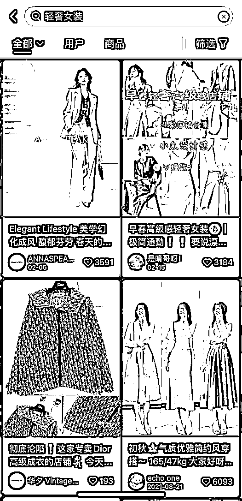

# 做电商摄影但不是自己拍，抓住商家拍摄需求做资源整合也能每月稳定变现 10W

> 原文：[`www.yuque.com/for_lazy/thfiu8/ur2gk149qayoypb8`](https://www.yuque.com/for_lazy/thfiu8/ur2gk149qayoypb8)

<ne-h2 id="fbf92918" data-lake-id="fbf92918"><ne-heading-ext><ne-heading-anchor></ne-heading-anchor><ne-heading-fold></ne-heading-fold></ne-heading-ext><ne-heading-content><ne-text id="u8d9c7baa">(精华帖)(50 赞)做电商摄影但不是自己拍，抓住商家拍摄需求做资源整合也能每月稳定变现 10W</ne-text></ne-heading-content></ne-h2> <ne-p id="u54bc51f7" data-lake-id="u54bc51f7"><ne-text id="ub99e596b">作者： 山木</ne-text></ne-p> <ne-p id="uec822ed4" data-lake-id="uec822ed4"><ne-text id="ufc691e17">日期：2023-06-13</ne-text></ne-p> <ne-p id="u32ab8e15" data-lake-id="u32ab8e15"><ne-text id="u4f43367b">做电商摄影，从零散的被动接单到变成商家的稳定合作伙伴，分享我是怎么发现需求并谈成合作的。</ne-text></ne-p> <ne-p id="u6d123ac3" data-lake-id="u6d123ac3"><ne-text id="u73ac78f8">现在，我不再亲力亲为的拍摄，也能每月变现 10W+。</ne-text></ne-p> <ne-p id="u9c679bbc" data-lake-id="u9c679bbc"><ne-text id="u0313565b">我做了十年电商、五年摄影，经历过行业的起起落落，目前在做摄影培训、单月变现 10W+。主线业务大致可以分为三个阶段：从卖货到卖技术，再到卖服务，如图所示：</ne-text></ne-p> <ne-p id="ua9520680" data-lake-id="ua9520680"><ne-card data-card-name="image" data-card-type="inline" id="ewYmN" data-event-boundary="card">  <ne-p id="udea72025" data-lake-id="udea72025"><ne-text id="u3ff9425a">一开始我只是个普通的电商人，靠卖货赚服务费和佣金。但且随着电商行业对图片的需求增加,以及微商的崛起，我顺势开启了摄影业务，帮助商家进行产品拍摄。</ne-text></ne-p> <ne-p id="udbd5e800" data-lake-id="udbd5e800"><ne-text id="ub8acd8d3">因为早期的卖货经验,我可以精准拿捏商家端的需求--降低成本。我从人员成本、业务成本、合作成本、场地成本等四个方面出发，帮助商家节省拍摄成本，扩大了自己的业务面，去做摄影培训、做需求对接，把主动权握在自己手里，与商家一起成为利益共同体。</ne-text></ne-p> <ne-p id="ubcba972e" data-lake-id="ubcba972e"><ne-text id="uede9c57a">每一次我的业务转变,都是基于行业风向和需求的变化。如果你和我一样身处电商行业，或者同为摄影师，那么我的业务发展经历，或许能为你提供一点新的发展方向。</ne-text></ne-p> <ne-p id="u6b807a0e" data-lake-id="u6b807a0e"><ne-text id="ufd90dd3e">如果你恰好处在行业的阵痛期，卡在项目瓶颈中，不知道怎么去发展业务，或许这段经历也能为你提供一些新思路。</ne-text></ne-p> <ne-p id="u7bf29fad" data-lake-id="u7bf29fad"><ne-text id="u93ebfac5">我的业务都是基于电商和摄影发展的，一是多年来所有的业务都是基于电商展开的，线上卖货渠道基本都涉及过，根据产品的优势来选择不同的渠道售卖，做差异化，也是基于电商对图片的需求量巨大。</ne-text></ne-p> <ne-p id="u4cebdda6" data-lake-id="u4cebdda6"><ne-text id="u6bfc7316">二是涉及到了摄影行业，当时的摄影行业是价格乱、需求大，这就等于有机会赚钱。</ne-text></ne-p> <ne-p id="u92f4265c" data-lake-id="u92f4265c"><ne-text id="u56c276ed" style="color: rgb(31, 35, 41);">以女装举个例子：一次拍摄的费用在 5 万左右，女装一个季度新款在 100 件左右，摄影师费用 6000-12000 /天（根据客户拍摄图片的难度报价），化妆师 2000-3000/ 天，助理 500/ 天，模特 1200/ 小时（ 8 小时 9600 ），场地费用 200-400/ 小时，100 件服装需要 2 天的拍摄时间。</ne-text></ne-p> <ne-p id="u2150d0b9" data-lake-id="u2150d0b9"><ne-text id="u4464d8dc" style="color: rgb(31, 35, 41);">回顾电商的发展，从 2010 年淘宝、2012 年天猫、2015 年微博、2018 年微商平台、2020 年直播带货。</ne-text></ne-p> <ne-p id="u6fed5d8f" data-lake-id="u6fed5d8f"><ne-text id="ub6bc3d59" style="color: rgb(31, 35, 41);">可以发现 2020 年之前，对图片的需求一直是巨大的，在网上只要销售就必须要有产品图片展示，直播开始之后从图片进入到了图片+视频模式，所以接下来商家对视频的需求会慢慢超过图片的需求。</ne-text></ne-p> <ne-p id="u5d59e9bd" data-lake-id="u5d59e9bd"><ne-text id="ua3bf78e4" style="color: rgb(31, 35, 41);">2018 年因为微商平台的契机和之前的积累做了摄影业务，原因：</ne-text></ne-p> <ne-p id="uf0782d45" data-lake-id="uf0782d45"><ne-text id="ubc54759c" style="color: rgb(31, 35, 41);">① 外聘的摄影师跟不上公司内部的需求，那时云集、环球捕手、贝店销量一路突破，但是每个平台都有自己的调性。</ne-text></ne-p> <ne-p id="uc828181b" data-lake-id="uc828181b"><ne-text id="u6276ed3b" style="color: rgb(31, 35, 41);">这就对产品图片的视觉有了要求，那时刚好也是微博网红的时代，摄影师的报价一直非常高，也衍生了很多非常好的摄影基地。</ne-text></ne-p> <ne-p id="ua6570cc4" data-lake-id="ua6570cc4"><ne-text id="uc8b8eeaa" style="color: rgb(31, 35, 41);">②之前合作的商家朋友也都开始做微商平台，也有很大的拍摄需求，当时基本上所有的拍摄都是外包的，因为一个季度拍一次，自己组团队非常不划算，包括摄影的相机器材都是一笔很大的投入。</ne-text></ne-p> <ne-p id="u27ed643b" data-lake-id="u27ed643b"><ne-text id="u1878c5ef" style="color: rgb(31, 35, 41);">所以做摄影工作室一开始是满足我们自己的拍摄需求，再是满足商家朋友的拍摄需求，我们的拍摄成本会低于同行，所以朋友也会推荐朋友，后来我们把拍摄的作品发到小红书、抖音、闲鱼上，陆陆续续也会有客户找我们拍摄。</ne-text></ne-p> <ne-p id="u23bd9489" data-lake-id="u23bd9489"><ne-text id="ufd059fd2" style="color: rgb(31, 35, 41);">现在商家对拍摄需求的多样化，只有专一方向拍摄的摄影师才能把整体的拍摄成本省下来</ne-text></ne-p> <ne-p id="ud78050b3" data-lake-id="ud78050b3"><ne-text id="ub056ac1d" style="color: rgb(31, 35, 41);">除了上面提到的主要国内电商平台，还有很多其他电商平台，比如：京东、拼多多、快手、视频号、唯品会、蘑菇街、单创、鲸灵、快团团、群接龙，还有其他很多小的渠道。</ne-text></ne-p> <ne-p id="uaec3a512" data-lake-id="uaec3a512"><ne-text id="uae313f98" style="color: rgb(31, 35, 41);">所以渠道越多，说明流量越分散，大品牌方需要自己做所有的渠道铺货卖货是不现实的，更不要说小品牌、无品牌商家、工厂、供应链了，所有渠道都做就更不可能了。</ne-text></ne-p> <ne-p id="u50c00811" data-lake-id="u50c00811"><ne-text id="u3da3c402" style="color: rgb(31, 35, 41);">所以大品牌基本上会自己做销售份额占 80%的主要渠道（大概三、四个渠道，每个渠道一个部门），不同渠道对图片的不同需求就是我们合作的开始。</ne-text></ne-p> <ne-p id="u0ec846e3" data-lake-id="u0ec846e3"><ne-text id="u4561cf51" style="color: rgb(31, 35, 41);">以服装举例：唯品会需要服装图片是 3D 白底图，淘宝需要的是模特图，抖音产品链接需要的是白底图，小红书需要的是场景穿搭图；</ne-text></ne-p> <ne-p id="u145d5743" data-lake-id="u145d5743"><ne-text id="u93dc6fd5" style="color: rgb(31, 35, 41);">每个平台服装的定位也不一样，天猫做新品发布，做高价利润新款，唯品会做品牌当季清仓，其他渠道做最后的尾货处理。</ne-text></ne-p> <ne-p id="ud368e265" data-lake-id="ud368e265"><ne-text id="u50bd319c" style="color: rgb(31, 35, 41);">唯品会图展示：以白底图，3D 白底图为主</ne-text></ne-p> <ne-p id="udd58b5a6" data-lake-id="udd58b5a6"><ne-card data-card-name="image" data-card-type="inline" id="Lqhxv" data-event-boundary="card">  <ne-p id="uc066f4e1" data-lake-id="uc066f4e1"><ne-card data-card-name="image" data-card-type="inline" id="Hq7W6" data-event-boundary="card">  <ne-p id="u3c972d38" data-lake-id="u3c972d38"><ne-text id="u2aac44e4" style="color: rgb(31, 35, 41);">淘宝图展示：模特图为主</ne-text></ne-p> <ne-p id="uc4a0ac6d" data-lake-id="uc4a0ac6d"><ne-card data-card-name="image" data-card-type="inline" id="h9neh" data-event-boundary="card">  <ne-p id="u05118b2e" data-lake-id="u05118b2e"><ne-card data-card-name="image" data-card-type="inline" id="LalnS" data-event-boundary="card">  <ne-p id="u18c1687a" data-lake-id="u18c1687a"><ne-text id="u3f70995e" style="color: rgb(31, 35, 41);">抖音图展示：直播视频为主，图片为辅</ne-text></ne-p> <ne-p id="ubfe5f14e" data-lake-id="ubfe5f14e"><ne-card data-card-name="image" data-card-type="inline" id="cVAFY" data-event-boundary="card">  <ne-p id="ud492fc62" data-lake-id="ud492fc62"><ne-text id="uc791b470" style="color: rgb(31, 35, 41);">小红书图展示：穿搭场景图为主</ne-text></ne-p> <ne-p id="u1c1231c8" data-lake-id="u1c1231c8"><ne-card data-card-name="image" data-card-type="inline" id="S5F5x" data-event-boundary="card"></ne-card></ne-p> <ne-p id="u175f6f83" data-lake-id="u175f6f83"><ne-text id="ub8ac7184" style="color: rgb(31, 35, 41);">拼多多图展示：模特自拍穿搭图</ne-text></ne-p> <ne-p id="ub5c8769b" data-lake-id="ub5c8769b"><ne-card data-card-name="image" data-card-type="inline" id="p8jij" data-event-boundary="card">  <ne-p id="uc4338e09" data-lake-id="uc4338e09"><ne-text id="uc18c2e31" style="color: rgb(31, 35, 41);">我们现在做轻奢女装批发，我就以“轻奢女装”这关键词来展示，可以很明显的感觉出来，每个平台对于同一关键词的图片需求是不一样的，当你在不同平台刷多了，你甚至可以看到一张图就能说出它适合放在哪个平台，这个其实和网感同理。</ne-text></ne-p> <ne-p id="u9ab74ff3" data-lake-id="u9ab74ff3"><ne-text id="u530f772f" style="color: rgb(31, 35, 41);">基于拍摄业务的基础和信任，我们和商家做更深度的绑定。</ne-text></ne-p> <ne-p id="u6ef3f9b2" data-lake-id="u6ef3f9b2"><ne-text id="ue5b8efc6" style="color: rgb(31, 35, 41);">上面提到商家自己会建部门做主要的渠道，那剩下商家没有精力做的渠道就是我们合作的第二个点。</ne-text></ne-p> <ne-p id="uc9926096" data-lake-id="uc9926096"><ne-text id="u321c7049" style="color: rgb(31, 35, 41);">一般是分佣的形式合作，他们给我们供货一件代发，我们赚佣金，其实现在达人直播带货也是这种分佣合作模式。</ne-text></ne-p> <ne-p id="u97b9fa72" data-lake-id="u97b9fa72"><ne-text id="ue872b669" style="color: rgb(31, 35, 41);">特别是对于小公司、供应链、线下工厂他们做一两个线上渠道都很吃力，因为他们的优势是生产，线上不是他们的强项。</ne-text></ne-p> <ne-p id="u5c0eff1d" data-lake-id="u5c0eff1d"><ne-text id="u91e9b46c" style="color: rgb(31, 35, 41);">从这里开始我们的角色其实发生了改变，我们从拍摄服务者，被动被商家选择的一方，转变到了和商家平等共利，成为了他们某一个渠道的合作伙伴，我们做的是在商家原有业务不变的情况下给他做销售额增量。</ne-text></ne-p> <ne-p id="u8842a7b9" data-lake-id="u8842a7b9"><ne-text id="u131b9f5c" style="color: rgb(31, 35, 41);">接下来我们再回过来具体说下怎么从拍摄服务中赚钱：</ne-text></ne-p> <ne-p id="uef0f6dc4" data-lake-id="uef0f6dc4"><ne-text id="u19e51389" style="color: rgb(31, 35, 41);">其实很简单，你要站在商家的角度给他们节省拍摄的成本，最求长期稳定的合作：</ne-text></ne-p> <ne-p id="u4cd1d078" data-lake-id="u4cd1d078"><ne-text id="u159eb33d" style="color: rgb(31, 35, 41);">对于服装老板来说，拍摄的费用很重，服装跟着季节走，春夏秋冬，每年至少拍 4 次，更新款式快的服装品牌拍摄需求更盛，现在 AI 能做模特图，对模特会有影响，但是你首先得有白底图，才能 AI 出图，从单位时间成本上来看，AI 对于老板们的成本可能会更高。</ne-text></ne-p> <ne-p id="u78fd5759" data-lake-id="u78fd5759"><ne-text id="u4309dbdb" style="color: rgb(31, 35, 41);">举例：服装一天能拍摄 100 件衣服，平均每件 15 张图（拍摄每件会拍 50 张，从 50 张中选出 15 张进行修图），一天 1500 张图，这还没考虑：模特个人 ip 形象、模特动作的摆拍、时间效率成本，所以 AI 短期内还是无法替代的。</ne-text></ne-p> <ne-p id="u5011c614" data-lake-id="u5011c614"><ne-text id="u76b9114a" style="color: rgb(31, 35, 41);">我们会从以下四点给商家们降低整体的拍摄费用：</ne-text></ne-p> <ne-h1 id="50369765" data-lake-id="50369765"><ne-heading-ext><ne-heading-anchor></ne-heading-anchor><ne-heading-fold></ne-heading-fold></ne-heading-ext><ne-heading-content><ne-text id="u74bc9051" style="color: rgb(31, 35, 41);">一、人员成本</ne-text></ne-heading-content></ne-h1> <ne-p id="u45a32d1a" data-lake-id="u45a32d1a"><ne-text id="u9a8081a7" style="color: rgb(31, 35, 41);">摄影师月薪资 10000-15000，我们算 12000，摄影师岗位是非常不稳定的，摄影师都是喜欢做自由摄影师，因为行业摄影师报价一般 4000-8000 一天，以前报价更高，如果摄影师有稳定的 3 个客户，就相当于他一月的薪资。</ne-text></ne-p> <ne-p id="ubd71ba66" data-lake-id="ubd71ba66"><ne-text id="u89e6d31d" style="color: rgb(31, 35, 41);">自由摄影有稳定单子，工作 3 天=上班工作 30 天，</ne-text></ne-p> <ne-p id="u5c848adc" data-lake-id="u5c848adc"><ne-text id="ua5167c7e" style="color: rgb(31, 35, 41);">给商家提供线下摄影培训服务，0 基础的 15 天线下摄影培训，培训完的摄影师基本上能完成商家的日常拍摄需求，</ne-text></ne-p> <ne-p id="u1fae62d9" data-lake-id="u1fae62d9"><ne-text id="u5cd307bc" style="color: rgb(31, 35, 41);">商家可以从摄影毕业生、美院、传媒毕业生招牌，按 8000 的人员薪资算，摄影培训费 6999，第一个月投入 14999，第二个月投入 8000，第三个月投入 8000，相对于直接招聘摄影师，只要这个员工工作超过 3 个月，商家成本就省下来了，12000*3=36000，14999+8000*2=30999，时间越长成本越省。</ne-text></ne-p> <ne-p id="u209ee323" data-lake-id="u209ee323"><ne-text id="uf87d698b" style="color: rgb(31, 35, 41);">有难度的拍摄我们也会给商家指导建议，从效率出发为商家节省成本。</ne-text></ne-p> <ne-p id="u8afb640a" data-lake-id="u8afb640a"><ne-text id="u8090d117" style="color: rgb(31, 35, 41);">商业摄影培训这个一直都有人在做，小红书上也有很多，培训费杭州一般是 12000 左右一人，半个月到一个月的摄影课程，北京一般是 17000 到 50000 万一人，一个月到一个半月的摄影课程，看老师和课程内容。</ne-text></ne-p> <ne-h1 id="b5d032fa" data-lake-id="b5d032fa"><ne-heading-ext><ne-heading-anchor></ne-heading-anchor><ne-heading-fold></ne-heading-fold></ne-heading-ext><ne-heading-content><ne-text id="u33e5a47d" style="color: rgb(31, 35, 41);">二、业务成本</ne-text></ne-heading-content></ne-h1> <ne-p id="u0aa243fa" data-lake-id="u0aa243fa"><ne-text id="u39b653c1" style="color: rgb(31, 35, 41);">摄影师的岗位是很不稳定的，所以在摄影师离职的空档期，拍摄的工作可以由我们来完成，这样商家不必担心摄影师的离职影响线上渠道卖货的节奏，商家也可以再重新招聘新人来培训。</ne-text></ne-p> <ne-h1 id="99ca4a67" data-lake-id="99ca4a67"><ne-heading-ext><ne-heading-anchor></ne-heading-anchor><ne-heading-fold></ne-heading-fold></ne-heading-ext><ne-heading-content><ne-text id="ucc88acb0" style="color: rgb(31, 35, 41);">三、摄影师合作推荐</ne-text></ne-heading-content></ne-h1> <ne-p id="u50edf3d3" data-lake-id="u50edf3d3"><ne-text id="u32a710cf" style="color: rgb(31, 35, 41);">我们培训过的学生和好的摄影师，我们也会有业务合作，因为我们自己做轻奢女装批发，每月有 200-500 款新款，拍摄的需求也非常大，有求助的好的摄影师也会推荐给合作的商家。</ne-text></ne-p> <ne-p id="u431114fd" data-lake-id="u431114fd"><ne-text id="u93198cd1" style="color: rgb(31, 35, 41);">这里应该会有人有疑惑，我们自己每月需求这么大为什么不都自己拍，原因有以下二点：</ne-text></ne-p> <ne-p id="u864d803f" data-lake-id="u864d803f"><ne-text id="uc51495b6" style="color: rgb(31, 35, 41);">（1）摄影行业岗位分工其实非常大，就和做电商一样，电商分工有：店长、运营（活动运营、产品运营、推广运营、会员运营）、运营助理、美工、仓库发货员、售前客服、售后客服。</ne-text></ne-p> <ne-p id="ud3e05ad5" data-lake-id="ud3e05ad5"><ne-text id="uc768b905" style="color: rgb(31, 35, 41);">还有其他配合的岗位，摄影分工有：人像摄影师、人像摄像师、静物摄影师、静物摄像师、3D 白底图摄影师、白底图摄影师、模特、化妆师、搭配师、摄影助理、制片策划、制景师、修图师、剪辑师。</ne-text></ne-p> <ne-p id="uf2fae2f1" data-lake-id="uf2fae2f1"><ne-text id="u3499781a" style="color: rgb(31, 35, 41);">还有其他很多细分，所以组一个细分的拍摄团队成本就非常大了，全能的摄影团队就更不可能了，专业的人做专业的事才能把成本压缩到极致。</ne-text></ne-p> <ne-p id="u305ad301" data-lake-id="u305ad301"><ne-text id="uf33bc045" style="color: rgb(31, 35, 41);">（2）效率问题：</ne-text></ne-p> <ne-p id="uf64bab3e" data-lake-id="uf64bab3e"><ne-text id="uea731d06" style="color: rgb(31, 35, 41);">比如一天拍 50 件衣服，一个团队也许可以，但是一天拍 500 件就需要 10 个团队了，所以合作是更省成本、效率更高的方式，合作共赢。</ne-text></ne-p> <ne-h1 id="94c997e9" data-lake-id="94c997e9"><ne-heading-ext><ne-heading-anchor></ne-heading-anchor><ne-heading-fold></ne-heading-fold></ne-heading-ext><ne-heading-content><ne-text id="ufceb4cf7" style="color: rgb(31, 35, 41);">四、节省场地成本</ne-text></ne-heading-content></ne-h1> <ne-p id="u68c4c791" data-lake-id="u68c4c791"><ne-text id="u4d0b87c0" style="color: rgb(31, 35, 41);">杭州我们自己有两个影棚场地，100 方影棚、200 方影棚，因为是自己的场地，所以就直接给老板们省了拍摄场地的费用。</ne-text></ne-p> <ne-p id="u9f00d7ee" data-lake-id="u9f00d7ee"><ne-text id="ue84b7bd8" style="color: rgb(31, 35, 41);">杭州影棚一天的费用是 1000 元/8 小时，好的影棚会更贵一点，大概 1200-1500/天。</ne-text></ne-p> <ne-p id="ufe6faf4e" data-lake-id="ufe6faf4e"><ne-text id="uf160fd06" style="color: rgb(31, 35, 41);">对于新人如果想做拍摄业务的话，说实话其实不太友好，摄影其实有两个门槛，设备门槛和技术门槛，一个费钱一个费时间。</ne-text></ne-p> <ne-p id="ufbc40e12" data-lake-id="ufbc40e12"><ne-text id="ufd89dc8c" style="color: rgb(31, 35, 41);">（1）不说拍摄技术，单从相机镜头设备起步就小几万的成本，还有摄影灯，拍摄场地，对于新人就是一笔不小的投入。</ne-text></ne-p> <ne-p id="u51fa0240" data-lake-id="u51fa0240"><ne-text id="u13b4afc1" style="color: rgb(31, 35, 41);">可以先从自己身边和家乡是否有产品产业带看看，比如皮草、围巾、美食、零食，有产品的基础下，找这些商家还没有涉及的渠道，去研究这个产品在这个渠道的销售体量，体量足够的情况下再去研究这个渠道的图片调性，再套用我上面的拍摄服务和带货服务和商家绑定。</ne-text></ne-p> <ne-p id="u33089d03" data-lake-id="u33089d03"><ne-text id="u38b07612" style="color: rgb(31, 35, 41);">其实生财已经有很多销售的渠道，可以直接和有流量的圈友合作，专业的人做专业的事，发挥各自长处。</ne-text></ne-p> <ne-p id="u5c4ab799" data-lake-id="u5c4ab799"><ne-text id="ube9fba62" style="color: rgb(31, 35, 41);">（2）选择其中一种拍摄方向去为商家服务，为什么所一种呢，因为只有当你一种做精细了，你才能把成本控到极致，你才有利润可以赚。</ne-text></ne-p> <ne-p id="u36732eae" data-lake-id="u36732eae"><ne-text id="u56fd2e43" style="color: rgb(31, 35, 41);">比如 3D 白底图拍摄，我朋友已经卷到 40 一件，行业报价普遍在 80-110，但他只拍 3D 白底图，其他的图片他不拍，也不会拍，其实可以认为一个人精力有限，什么都做其实很难把成本压缩，不同拍摄会需要不同的相机、灯光、道具，就这些设备成本就是一道砍了。</ne-text></ne-p> <ne-p id="uea651097" data-lake-id="uea651097"><ne-text id="uda1c26d0" style="color: rgb(31, 35, 41);">（3）接下来摄像的需求量会比图片的需求量大，可以研究下视频的拍摄和剪辑，就不去和图片的卷了，可以换摄像赛道。</ne-text></ne-p> <ne-p id="u4258dbcc" data-lake-id="u4258dbcc"><ne-text id="u42aaf7a1" style="color: rgb(31, 35, 41);">（4）降低期目标期望值，不要想着什么都能自己做就自己去做了，得考虑单位时间成本，合作才是提升效率的最佳方法，而且只需要有稳定合作客户就会很舒服。</ne-text></ne-p> <ne-hole id="ube63d3f8" data-lake-id="ube63d3f8"><ne-card data-card-name="hr" data-card-type="block" id="TIAEm" data-event-boundary="card"><ne-p id="u7dc67767" data-lake-id="u7dc67767"><ne-text id="ud6c61d9c">评论区：</ne-text></ne-p> <ne-p id="u33571a9e" data-lake-id="u33571a9e"><ne-text id="u62cd0a5b">灵动 : 可以介绍你朋友给我吗？ 想做 3d 白底图 微 diwen2013</ne-text> <ne-text id="u1fcf5e89">山木 : 你是要拍 3D 服装产品图？还是只是要修 3D 图的？</ne-text> <ne-text id="uf078d7c5">王玉波 : 可以加微吗</ne-text> <ne-text id="u6f559954">山木 : 👌</ne-text> <ne-text id="u81096848">亦仁 : 感谢分享，已加精华。</ne-text> <ne-text id="u3d275b6d">山木 : 感谢亦仁[抱拳][抱拳]</ne-text> <ne-text id="u37b954ca">艺术家 刘遥磊 : 谢谢分享</ne-text></ne-p></ne-card></ne-hole></ne-card></ne-p></ne-card></ne-p></ne-card></ne-p></ne-card></ne-p></ne-card></ne-p></ne-card></ne-p></ne-card></ne-p>