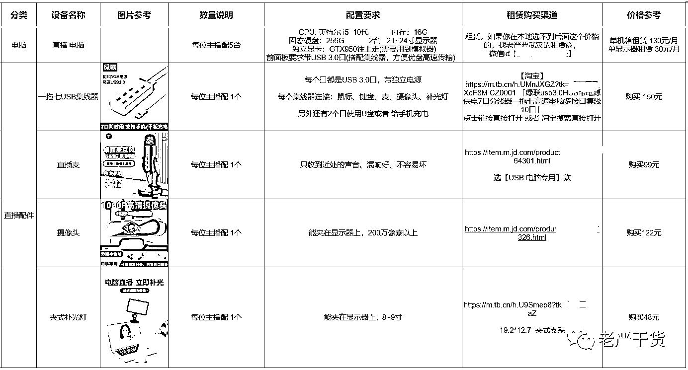
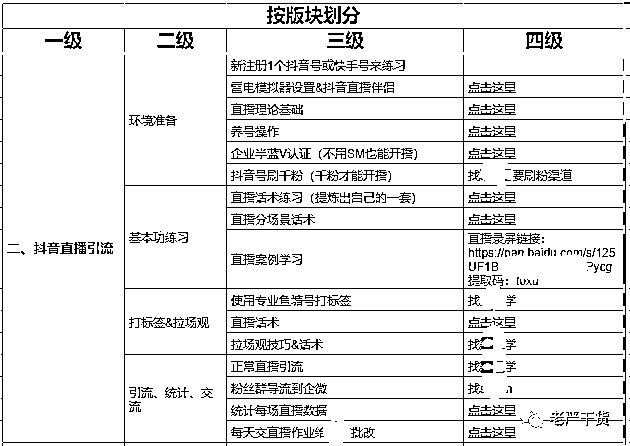
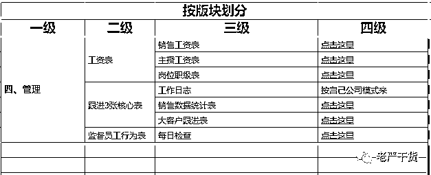
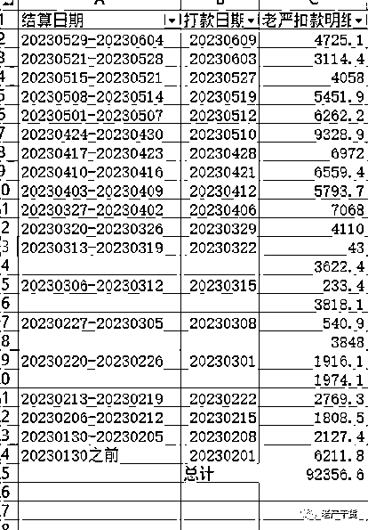

# 手游充值 CPS 项目拆解

> 原文：[`www.yuque.com/for_lazy/thfiu8/maf5304oe2lhfq88`](https://www.yuque.com/for_lazy/thfiu8/maf5304oe2lhfq88)

<ne-h2 id="d050c399" data-lake-id="d050c399"><ne-heading-ext><ne-heading-anchor></ne-heading-anchor><ne-heading-fold></ne-heading-fold></ne-heading-ext><ne-heading-content><ne-text id="u85e71fc8">(18 赞)手游充值 CPS 项目拆解</ne-text></ne-heading-content></ne-h2> <ne-p id="u38343833" data-lake-id="u38343833"><ne-text id="ub0d63b3a">作者： 老严干货 CPS</ne-text></ne-p> <ne-p id="u74cbbaea" data-lake-id="u74cbbaea"><ne-text id="u554833b1">日期：2023-06-16</ne-text></ne-p> <ne-h1 id="9039450f" data-lake-id="9039450f"><ne-heading-ext><ne-heading-anchor></ne-heading-anchor><ne-heading-fold></ne-heading-fold></ne-heading-ext> <ne-heading-content></ne-heading-content></ne-h1> <ne-p id="u349d5ec0" data-lake-id="u349d5ec0"><ne-text id="u08814ce1" style="color: rgb(62, 62, 62); background-color: rgb(255, 255, 255);">自己团队做手游充值 CPS 项目，正好做了 1 年时间，去年写过几篇文章，介绍了项目的基本情况：</ne-text></ne-p> <ne-p id="u1e60e130" data-lake-id="u1e60e130"><ne-text id="u24c9c458">https://t.zsxq.com/0fObxA62R</ne-text></ne-p> <ne-p id="u8f6f5e6f" data-lake-id="u8f6f5e6f"><ne-text id="u2b91740b">https://t.zsxq.com/0frz3Wjrd</ne-text></ne-p> <ne-p id="ud5034cee" data-lake-id="ud5034cee"><ne-text id="u0fe01d52" style="background-color: rgb(255, 255, 255); color: rgb(62, 62, 62);">但之前介绍的都是偏理论，今天上更多干货，截图了很多内部文档，全文 4000 多字，如果算上截图里的文字，估计大几千，分 2 部分继续写一篇长文分享：</ne-text></ne-p> <ne-p id="ub533ad2d" data-lake-id="ub533ad2d"><ne-text id="u0198015a" ne-bold="true">Ⅰ、项目实操干货拆解</ne-text></ne-p> <ne-p id="uaae1ae04" data-lake-id="uaae1ae04"><ne-text id="u175150f5" ne-bold="true">Ⅱ、为啥有的团队做得好，有的做不好？</ne-text></ne-p> <ne-p id="u8dc99a67" data-lake-id="u8dc99a67"><ne-text id="uc4c8baf9" ne-bold="true">Ⅰ、项目实操干货拆解</ne-text></ne-p> <ne-p id="ue0a831c6" data-lake-id="ue0a831c6"><ne-text id="ufd945829" ne-bold="true">分类逻辑有且仅有 3 种：</ne-text><ne-text id="u50bc1880" ne-bold="true">按版块、按时间、按程度</ne-text><ne-text id="uef320942" style="background-color: rgb(255, 255, 255); color: rgb(62, 62, 62);">。接下来我会【按版块】来介绍这个项目内部资料的截图。</ne-text></ne-p> <ne-p id="ud4ae7a41" data-lake-id="ud4ae7a41"><ne-text id="u82c2caec" ne-bold="true">一、搞定基础</ne-text></ne-p> <ne-p id="ua81dd746" data-lake-id="ua81dd746"><ne-card data-card-name="image" data-card-type="inline" id="AyJAt" data-event-boundary="card">  <ne-p id="u4a32a987" data-lake-id="u4a32a987"><ne-text id="uf88a9d72" style="background-color: rgb(255, 255, 255); color: rgb(62, 62, 62);">只有准备好了这些，才能开展项目，只要做过互联网项目的，这部分都是很简单就能完成。</ne-text></ne-p> <ne-p id="ua7fbc507" data-lake-id="ua7fbc507"><ne-text id="uda5c3d1c" ne-bold="true">1.1、关于直播设备</ne-text></ne-p> <ne-p id="udede6e15" data-lake-id="udede6e15"><ne-card data-card-name="image" data-card-type="inline" id="GUZ7u" data-event-boundary="card"></ne-card></ne-p> <ne-p id="u49bcd4dc" data-lake-id="u49bcd4dc"><ne-text id="uae53cf4b" style="background-color: rgb(255, 255, 255); color: rgb(62, 62, 62);">我们搭配是这样的：</ne-text></ne-p> <ne-p id="u922f2010" data-lake-id="u922f2010"><ne-text id="u45548a3d" style="background-color: rgb(255, 255, 255); color: rgb(62, 62, 62);">每位主播用 5 个抖音号直播，每个号每天播 1 常场，这样总共播 5 场，每场 50 分钟左右。</ne-text></ne-p> <ne-p id="ub59275fa" data-lake-id="ub59275fa"><ne-text id="u61b09547" ne-bold="true">每位主播设备清单:   N 个工位 + 5 台电脑主机+ 5 部安卓手机+5 张电话卡+ 2 台显示器  + 1 套外设（集线器、键盘、鼠标、摄像头、麦、灯）。</ne-text></ne-p> <ne-p id="u66d2abe6" data-lake-id="u66d2abe6"><ne-text id="ubb6b2a58" style="background-color: rgb(255, 255, 255); color: rgb(62, 62, 62);">电脑是租的，为了省钱，外设都比较便宜，也是为了省钱，我们直播画面大部分是游戏界面，用【直播伴侣】进行直播，对外设要求并不高。链接部分我打码了，没必要展示，大家要找到淘宝同款非常简单，看照片、参数和价格就好。</ne-text></ne-p> <ne-p id="u5aefddd9" data-lake-id="u5aefddd9"><ne-text id="u1f5c6a7c" ne-bold="true">1.2、关于网络</ne-text></ne-p> <ne-p id="u593e6708" data-lake-id="u593e6708"><ne-card data-card-name="image" data-card-type="inline" id="HHiNI" data-event-boundary="card"></ne-card></ne-p> <ne-p id="ue085311c" data-lake-id="ue085311c"><ne-text id="u5f9ada7c" style="background-color: rgb(255, 255, 255); color: rgb(62, 62, 62);">我们直播项目最需要的不是下载速度，而是上传速度。</ne-text></ne-p> <ne-p id="ub15ebd23" data-lake-id="ub15ebd23"><ne-text id="u6a037065" style="background-color: rgb(255, 255, 255); color: rgb(62, 62, 62);">一般来说千兆网上传速度 50M 左右，一台电脑你把清晰度等各种指标拉满大概占用 10M 上传速度，一条网最多支持 5 台电脑同时做高清直播，一般情况没必要这么多同时在线，因为公司会拉多条宽带。</ne-text></ne-p> <ne-p id="u66a2bf4f" data-lake-id="u66a2bf4f"><ne-text id="u6d70ab8d" style="background-color: rgb(255, 255, 255); color: rgb(62, 62, 62);">一旦拉了千兆网，后续所有配套全都要是千兆，我建议能二手就二手，不能二手再考虑买新，省钱嘛，不寒酸，把钱花在刀刃上，后面会说刀刃是啥。</ne-text></ne-p> <ne-p id="u8c2afd27" data-lake-id="u8c2afd27"><ne-text id="u35e2baef" ne-bold="true">1.3、关于手机、账号、执照</ne-text></ne-p> <ne-p id="uf09cce7c" data-lake-id="uf09cce7c"><ne-text id="u570328c6" style="background-color: rgb(255, 255, 255); color: rgb(62, 62, 62);">就不用截图细节了，这些大家自己去弄就好，都不难，该买就买，该注册就注册。</ne-text></ne-p> <ne-p id="u6763011d" data-lake-id="u6763011d"><ne-text id="u03ed05d5" ne-bold="true">二、抖音直播引流</ne-text></ne-p> <ne-p id="u39a85913" data-lake-id="u39a85913"><ne-card data-card-name="image" data-card-type="inline" id="Wa3UQ" data-event-boundary="card"></ne-card></ne-p> <ne-p id="ua40e2126" data-lake-id="ua40e2126"><ne-text id="u18a7c551" style="background-color: rgb(255, 255, 255); color: rgb(62, 62, 62);">这是整个项目的核心部门，从软件环境准备，到能开播养号，到练习基本功，到正式开始起号，到数据统计，贯穿整个项目。</ne-text></ne-p> <ne-p id="u03103d41" data-lake-id="u03103d41"><ne-text id="uab407dbd" ne-bold="true">2.1、环境准备</ne-text></ne-p> <ne-p id="u230f4377" data-lake-id="u230f4377"><ne-text id="u1b249890" style="background-color: rgb(255, 255, 255); color: rgb(62, 62, 62);">核心思想就是先注册 1 个抖音号来练习话术，这个号就是准备播死来练习话术熟练度。</ne-text></ne-p> <ne-p id="u7dfb3794" data-lake-id="u7dfb3794"><ne-text id="u5f273a6c" style="background-color: rgb(255, 255, 255); color: rgb(62, 62, 62);">模拟器设置和直播伴侣设置太长了，如果放进来就是一堆图片，太占篇幅，这些大家基本可以通过百度找到，不难。</ne-text></ne-p> <ne-p id="ucbdb47f6" data-lake-id="ucbdb47f6"><ne-text id="ub4a909a5" style="background-color: rgb(255, 255, 255); color: rgb(62, 62, 62);">直播理论这东西有点玄，只有做过直播了，再总结才是自己的，否则你看来跟没看一样：</ne-text></ne-p> <ne-p id="u5b519fb7" data-lake-id="u5b519fb7"><ne-card data-card-name="image" data-card-type="inline" id="go9DS" data-event-boundary="card"></ne-card></ne-p> <ne-p id="u436dbb1d" data-lake-id="u436dbb1d"><ne-text id="ua3b5645d" style="background-color: rgb(255, 255, 255); color: rgb(62, 62, 62);">养号流程比较简单：</ne-text></ne-p> <ne-p id="u3ccebda3" data-lake-id="u3ccebda3"><ne-card data-card-name="image" data-card-type="inline" id="TPQWj" data-event-boundary="card"></ne-card></ne-p> <ne-p id="u9cb50578" data-lake-id="u9cb50578"><ne-text id="uc93902ec" style="background-color: rgb(255, 255, 255); color: rgb(62, 62, 62);">本质就是进行一些操作，让平台觉得你是一个正常的号。</ne-text></ne-p> <ne-p id="uc3455267" data-lake-id="uc3455267"><ne-text id="u4325a753" style="background-color: rgb(255, 255, 255); color: rgb(62, 62, 62);">接下来就是半蓝认证和上千粉，详细操作百度可以搜索到，我就不截图了，都是开播前的必备条件，只有这 2 个条件搞定了，才能开播。</ne-text></ne-p> <ne-p id="u6e374cbd" data-lake-id="u6e374cbd"><ne-text id="uc1489014" style="background-color: rgb(255, 255, 255); color: rgb(62, 62, 62);">上面这些都准备好，那就可以开播了。</ne-text></ne-p> <ne-p id="ub1b3aba0" data-lake-id="ub1b3aba0"><ne-text id="u3405b5b5" ne-bold="true">2.2、基本功练习</ne-text></ne-p> <ne-p id="uc14a8958" data-lake-id="uc14a8958"><ne-text id="u8efddc3f" style="background-color: rgb(255, 255, 255); color: rgb(62, 62, 62);">一般来说，如果做过直播项目，才需要练习这个基本功，有直播能力的，这部分是直接跳过的，能省很多时间，上来就直接进入核心部分。</ne-text></ne-p> <ne-p id="u90602131" data-lake-id="u90602131"><ne-text id="ud99b602b" style="background-color: rgb(255, 255, 255); color: rgb(62, 62, 62);">说白了，就是</ne-text><ne-text id="ud9f06804" ne-bold="true">给你一个麦，一台电脑，你能不能完成：连续 1 小时不间断激情满满地介绍游戏，尤其是直播间没有人的时候。</ne-text></ne-p> <ne-p id="u91ef0aba" data-lake-id="u91ef0aba"><ne-text id="u25b9fa70" style="background-color: rgb(255, 255, 255); color: rgb(62, 62, 62);">有些人在这关就倒下了，因为直播间没人，心态就慢慢变差，也不愿意说话，最后心态就崩了。</ne-text></ne-p> <ne-p id="u4ca31a9c" data-lake-id="u4ca31a9c"><ne-text id="u91ba7bab" style="background-color: rgb(255, 255, 255); color: rgb(62, 62, 62);">我给大家截图部分话术，可以看看主播在直播间的开始阶段在说什么。</ne-text></ne-p> <ne-p id="ufd3d453b" data-lake-id="ufd3d453b"><ne-card data-card-name="image" data-card-type="inline" id="thOcP" data-event-boundary="card"></ne-card></ne-p> <ne-p id="u51197c3e" data-lake-id="u51197c3e"><ne-text id="u4d5344eb" style="background-color: rgb(255, 255, 255); color: rgb(62, 62, 62);">不过话术归话术，这只是第 1 阶段，这个熟练以后只能说可以开始上播了，距离引流还差很远很远。</ne-text></ne-p> <ne-p id="ubc94adb9" data-lake-id="ubc94adb9"><ne-text id="u2dd8fdbf" ne-bold="true">有些人只会背这些基础话术，不会根据实际情况去灵活调整，不能整理成一套自己的话术，那基本也做不好主播。</ne-text></ne-p> <ne-p id="ubd7273f3" data-lake-id="ubd7273f3"><ne-text id="ub5f59b20" style="background-color: rgb(255, 255, 255); color: rgb(62, 62, 62);">我们有新主播入职的时候，也会把老主播录制的视频给到她们去下载学习。</ne-text></ne-p> <ne-p id="u642701b5" data-lake-id="u642701b5"><ne-text id="u779332c0" ne-bold="true">2.3、打标签&拉场观</ne-text></ne-p> <ne-p id="u9573af30" data-lake-id="u9573af30"><ne-text id="u051fa998" style="background-color: rgb(255, 255, 255); color: rgb(62, 62, 62);">到这一步，才真正考验一个主播能不能起来的关键。</ne-text></ne-p> <ne-p id="ub4397d00" data-lake-id="ub4397d00"><ne-text id="ua4dec856" style="background-color: rgb(255, 255, 255); color: rgb(62, 62, 62);">首先要有个基础操作，我们</ne-text><ne-text id="u48fac852" ne-bold="true">得让平台知道我们是播啥内容的，俗称【打标签】，</ne-text><ne-text id="ue5fd14fa" style="background-color: rgb(255, 255, 255); color: rgb(62, 62, 62);">打好标签，好的，恭喜你，你直播间已经能做到每小时场观 100~200 区间，而是都是比较精准的粉丝。</ne-text></ne-p> <ne-p id="ufaf3e62f" data-lake-id="ufaf3e62f"><ne-text id="u1d10d741" style="background-color: rgb(255, 255, 255); color: rgb(62, 62, 62);">但是就这点场观，播 1 个小时也引不了几个人，</ne-text><ne-text id="u35aa905e" ne-bold="true">再下一步就要【拉场观】了，把每小时的场观拉到三五百或更高，这时候只能靠主播本身的魅力了。</ne-text></ne-p> <ne-p id="u7d17ac73" data-lake-id="u7d17ac73"><ne-text id="uda950779" style="background-color: rgb(255, 255, 255); color: rgb(62, 62, 62);">我前面不是说【钱花在刀刃上】么，主播就是这个刀刃，如果主播魅力不行，那即使 ta 会全套操作，引流到私域的人也寥寥无几，反之，那结果就很乐观，所以</ne-text><ne-text id="ucd8d8989" ne-bold="true">招聘主播的底薪一定要高，远高于你做普通项目时招聘的客服和销售。</ne-text></ne-p> <ne-p id="u52d6c013" data-lake-id="u52d6c013"><ne-text id="u9974895c" style="background-color: rgb(255, 255, 255); color: rgb(62, 62, 62);">原理很简单，在我们手游直播行业，</ne-text><ne-text id="u69316479" ne-bold="true">直播间价值=主播价值+产品价值</ne-text></ne-p> <ne-p id="ueb0328e0" data-lake-id="ueb0328e0"><ne-text id="u213fe05a" style="background-color: rgb(255, 255, 255); color: rgb(62, 62, 62);">普通操作你懂我懂别人也懂，游戏你能代理别人也能代理【独家代理的游戏这里不讨论】，所有团队都还是站在同一起跑线，那抖音怎么知道要把流量分配给谁。</ne-text></ne-p> <ne-p id="ufff6ef37" data-lake-id="ufff6ef37"><ne-text id="u023b1e71" style="background-color: rgb(255, 255, 255); color: rgb(62, 62, 62);">对，还是要看直播数据，就是所谓的留存时间、评论数、新增关注、粉丝灯牌之类老掉牙的指标。</ne-text></ne-p> <ne-p id="u7db1d742" data-lake-id="u7db1d742"><ne-text id="u25ddb2ac" style="background-color: rgb(255, 255, 255); color: rgb(62, 62, 62);">如果你家主播没有足够的能力或魅力让客户喜欢 ta，那前面的动作就算再完美也无济于事，留不住人，数据会很拉胯就没有更多自然流。</ne-text></ne-p> <ne-p id="u932b8d26" data-lake-id="u932b8d26"><ne-text id="uffe236c5" ne-bold="true">绝大部分好多团队就是倒在了这一步，ta 的直播间没意思，ta 的主播提不起观众的兴趣，精准客户过来直播间就划走了。</ne-text></ne-p> <ne-p id="ue25e7f20" data-lake-id="ue25e7f20"><ne-text id="u933eaeec" style="background-color: rgb(255, 255, 255); color: rgb(62, 62, 62);">而【一个人有没有意思】【能不能让别人喜欢】这些魅力，基本已经定型，就是 ta 前几十年的性格与人生阅历总和，几乎没法培养，企业也没这个财力去培养 ta，所以</ne-text><ne-text id="uedfd02a1" ne-bold="true">主播只能靠筛选，没法靠培养。</ne-text></ne-p> <ne-p id="u21e848fb" data-lake-id="u21e848fb"><ne-text id="ubefa992b" style="background-color: rgb(255, 255, 255); color: rgb(62, 62, 62);">就好比在饭桌上，一群人吃饭，那个最能调动现场氛围的人，ta 的这个【调动氛围】的能力，绝大多数人就不具备，而且也培养不起来。</ne-text></ne-p> <ne-p id="u660e6ea4" data-lake-id="u660e6ea4"><ne-text id="u4d5ad8b0" style="background-color: rgb(255, 255, 255); color: rgb(62, 62, 62);">大部分的团队会死在这一步，老板入场的时候有多激情，离场的时候就有多凄凉。</ne-text></ne-p> <ne-p id="ud255b438" data-lake-id="ud255b438"><ne-text id="u5aac2dab" style="background-color: rgb(255, 255, 255); color: rgb(62, 62, 62);">这里我花了非常大量的篇幅，就是想告诉没有做过直播项目的团队，直播这个事很难，难在哪，为啥很多团队进来就死了，还赔了不少钱。</ne-text></ne-p> <ne-p id="u91f055ea" data-lake-id="u91f055ea"><ne-text id="ud545189a" style="background-color: rgb(255, 255, 255); color: rgb(62, 62, 62);">做过直播且通过直播项目赚钱的老板，这些认知已经具备，手上的主播上来就能干活，要学的只不过是后面项目变现环节，这个就简单很多了。</ne-text></ne-p> <ne-p id="u33b3df4d" data-lake-id="u33b3df4d"><ne-text id="u69edcd8a" ne-bold="true">2.3、引流统计交流</ne-text></ne-p> <ne-p id="ud83669b0" data-lake-id="ud83669b0"><ne-text id="u46ffcd8d" style="background-color: rgb(255, 255, 255); color: rgb(62, 62, 62);">能搞定【打标签】和【拉场观】，现在已经可以</ne-text><ne-text id="ub328a0e8" ne-bold="true">往私域导流</ne-text><ne-text id="u804fb90b" style="background-color: rgb(255, 255, 255); color: rgb(62, 62, 62);">了，最常见的是两种方式：</ne-text></ne-p> <ne-p id="u0c6f1e33" data-lake-id="u0c6f1e33"><ne-text id="u52d28d3c" ne-bold="true">第一是通过粉丝群</ne-text><ne-text id="ud8b8043e" style="background-color: rgb(255, 255, 255); color: rgb(62, 62, 62);">，主播把客户往粉丝群引，粉丝群里放个小号发二维码图片，不过小号容易封，你需要准备一批小号，而且你所有直播的号都需要完成个人实名，否则没有粉丝群功能，这里又难倒了一批团队。</ne-text></ne-p> <ne-p id="u63571709" data-lake-id="u63571709"><ne-text id="ubc9e2397" ne-bold="true">第二是通过预约卡片</ne-text><ne-text id="u51a56090" style="background-color: rgb(255, 255, 255); color: rgb(62, 62, 62);">，用户填手机号（一般都绑定自己微信），我们销售主动添加就好，如果添加不上就配合主播在直播间问对方准确的微信联系方式，这个方式不需要账号实名，只需要完成半蓝 V 认证就好，嗯，还是免费的。</ne-text></ne-p> <ne-p id="u9fafc2ec" data-lake-id="u9fafc2ec"><ne-text id="u3d9e36a7" style="background-color: rgb(255, 255, 255); color: rgb(62, 62, 62);">导流到私域后，至于统计数据、交流啥的，都是简单流程，做了自然懂，不赘述。</ne-text></ne-p> <ne-p id="u90d2b262" data-lake-id="u90d2b262"><ne-text id="u1d5097e2" ne-bold="true">三、变现</ne-text></ne-p> <ne-p id="ua3a8677e" data-lake-id="ua3a8677e"><ne-card data-card-name="image" data-card-type="inline" id="tZeF5" data-event-boundary="card"></ne-card></ne-p> <ne-p id="u0f8c7ad8" data-lake-id="u0f8c7ad8"><ne-text id="u49ba0777" style="background-color: rgb(255, 255, 255); color: rgb(62, 62, 62);">如果能</ne-text><ne-text id="uf1073fbd" ne-bold="true">搞定引流这个环节，恭喜这个项目已经成功了 90%</ne-text><ne-text id="u1530e23b" style="background-color: rgb(255, 255, 255); color: rgb(62, 62, 62);">，是的，后面的变现环节，你肯定能有进账赚钱，只不过是效率高或低的问题，而随着时间的拉长和经验积累，你的效率肯定会越来越高。</ne-text></ne-p> <ne-p id="uea8b7417" data-lake-id="uea8b7417"><ne-text id="u596c9812" style="background-color: rgb(255, 255, 255); color: rgb(62, 62, 62);">首先对游戏要懂吧，有哪些玩法，哪些功能，哪些流程，玩家在游戏里是怎么一步一步获得爽感的。</ne-text></ne-p> <ne-p id="uea4f8e05" data-lake-id="uea4f8e05"><ne-text id="uf3933247" style="background-color: rgb(255, 255, 255); color: rgb(62, 62, 62);">然后游戏后台也要了解，怎么看数据，怎么给客户发材料，这个很快就能学会，对于玩家来说我们就好比是拥有金手指的上帝。</ne-text></ne-p> <ne-p id="u3635a95a" data-lake-id="u3635a95a"><ne-text id="uc7be21ef" style="background-color: rgb(255, 255, 255); color: rgb(62, 62, 62);">再就是了解游戏的价格体系，怎么卖材料道具，不同的道具卖多少钱，接待的玩家多了，自然会熟悉。</ne-text></ne-p> <ne-p id="u3b686983" data-lake-id="u3b686983"><ne-text id="u537ff4e5" style="background-color: rgb(255, 255, 255); color: rgb(62, 62, 62);">当然，遇到具体问题，一般会在项目陪跑群里直接私聊沟通，也比较容易解决。</ne-text></ne-p> <ne-p id="ub28e2103" data-lake-id="ub28e2103"><ne-text id="uda40ad12" ne-bold="true">四、管理</ne-text></ne-p> <ne-p id="ud2a2f286" data-lake-id="ud2a2f286"><ne-card data-card-name="image" data-card-type="inline" id="id1Sc" data-event-boundary="card"></ne-card></ne-p> <ne-p id="ua389a9e8" data-lake-id="ua389a9e8"><ne-text id="ufdba0714" style="background-color: rgb(255, 255, 255); color: rgb(62, 62, 62);">剩下的是一些基础管理问题，工资怎么发，岗位职级怎么定，如何设定员工的工作行为标准，如何监督检查等等，这些都是通用技能，每个公司都有自己的玩法，带过团队的基本都会这些，不多赘述。</ne-text></ne-p> <ne-p id="u1f177b5a" data-lake-id="u1f177b5a"><ne-text id="ub73c91f8" style="background-color: rgb(255, 255, 255); color: rgb(62, 62, 62);">前文都是【按版块】进行介绍，最后附上一张项目全景图，也有【按时间】【按程度】的逻辑。</ne-text></ne-p> <ne-p id="uc52faae9" data-lake-id="uc52faae9"><ne-card data-card-name="image" data-card-type="inline" id="cbYAQ" data-event-boundary="card"></ne-card></ne-p> <ne-p id="u1d2d6503" data-lake-id="u1d2d6503"><ne-text id="ua4e2b6c1" style="background-color: rgb(255, 255, 255); color: rgb(62, 62, 62);">右边的时间条类似于【甘特图】，就是什么阶段做什么事，有一个清晰规划，这就是时间逻辑，另外颜色越深代表这个版块越重要越难掌握，反之越容易掌握，这就是程度逻辑。</ne-text></ne-p> <ne-p id="u877f36c5" data-lake-id="u877f36c5"><ne-text id="ue39279e3" style="background-color: rgb(255, 255, 255); color: rgb(62, 62, 62);">无论你做不做直播项目，都希望这次分享的干货对你有帮助，毫不夸张地说，这是我们花了几百万沉淀的成果。</ne-text></ne-p> <ne-p id="ud15ee4ac" data-lake-id="ud15ee4ac"><ne-text id="u6a5035e8" ne-bold="true">Ⅱ、为啥有的团队做得好，有的做不好？</ne-text></ne-p> <ne-p id="u0498c852" data-lake-id="u0498c852"><ne-text id="ub515b185" style="background-color: rgb(255, 255, 255); color: rgb(62, 62, 62);">今年年初跟一些团队开始合作，我们公司提供几个人 【团队 v 团队】拉群陪跑，给大家汇报一下结果，有好有坏，整体上，好的占比要低于坏的，好的团队差不多总 GMV 百万左右。</ne-text></ne-p> <ne-p id="ub7266a18" data-lake-id="ub7266a18"><ne-card data-card-name="image" data-card-type="inline" id="yKeBe" data-event-boundary="card"></ne-card></ne-p> <ne-p id="u4145c9e1" data-lake-id="u4145c9e1"><ne-text id="u7f7f6663" style="background-color: rgb(255, 255, 255); color: rgb(62, 62, 62);">这是其中一家公司发给我的打款明细图，每周结算一次，因为我这边是提分公司 10%的充值收入，所以他们的</ne-text><ne-text id="ufc2d43b1" ne-bold="true">游戏总充值 GMV 接近百万，收入 80w 左右</ne-text><ne-text id="uf2d2ac45" style="background-color: rgb(255, 255, 255); color: rgb(62, 62, 62);">。做的不好的团队成绩为 0，还亏损了一些人工设备场地等开支。</ne-text></ne-p> <ne-p id="u090ff458" data-lake-id="u090ff458"><ne-text id="u83617a4e" style="background-color: rgb(255, 255, 255); color: rgb(62, 62, 62);">好跟不好的差距太大，我就一直在想，</ne-text><ne-text id="ue819b759" ne-bold="true">为啥有的团队能做好，有的团队做不好，我接下来应该找什么样的团队合作</ne-text><ne-text id="u9060e8aa" style="background-color: rgb(255, 255, 255); color: rgb(62, 62, 62);">，最后总结了几点经验：</ne-text></ne-p> <ne-p id="u01285d94" data-lake-id="u01285d94"><ne-text id="ud72a530e" ne-bold="true">1、直播是一项复杂能力，很多团队没有这项能力</ne-text></ne-p> <ne-p id="udc7f4a91" data-lake-id="udc7f4a91"><ne-text id="ud635a81d" style="background-color: rgb(255, 255, 255); color: rgb(62, 62, 62);">不论是直播带货还是直播引流，无论是自然流还是付费流，【直播】难度都要大于【客服】、【运营】这些基础能力。</ne-text></ne-p> <ne-p id="u4947bfe6" data-lake-id="u4947bfe6"><ne-text id="ua6a29fb5" style="background-color: rgb(255, 255, 255); color: rgb(62, 62, 62);">很多团队以为只要勤奋就能学会这项能力，其实不是的。</ne-text></ne-p> <ne-p id="u0773e69d" data-lake-id="u0773e69d"><ne-text id="ubfdd2e9c" style="background-color: rgb(255, 255, 255); color: rgb(62, 62, 62);">这么说吧，【用英语跟外国人沟通】是一项复杂能力，读完大学的兄弟，都学了 10 年以上吧，结果呢，有几个人能跟外国人正常沟通。</ne-text></ne-p> <ne-p id="ua631379c" data-lake-id="ua631379c"><ne-text id="u981ef450" style="background-color: rgb(255, 255, 255); color: rgb(62, 62, 62);">再比如，【练出一身腱子肉】是一项复杂能力，但是大部分人，可能就买几个简单器械回家练练，或者办一张健身房年卡，然后，就没有然后了。</ne-text></ne-p> <ne-p id="u253800bf" data-lake-id="u253800bf"><ne-text id="u571daa00" style="background-color: rgb(255, 255, 255); color: rgb(62, 62, 62);">团队如果要掌握直播这个能力，学习成本巨高，需要投入不少时间去研究学习，可能两三个月，可能半年一年。我们团队花了 5 个月时间，期间是亏钱状态，投入很长时间同时也意味着投入很多钱。</ne-text></ne-p> <ne-p id="u4344165c" data-lake-id="u4344165c"><ne-text id="uc313e348" style="background-color: rgb(255, 255, 255); color: rgb(62, 62, 62);">对直播项目一定要有敬畏心，如果打算好好干直播类项目，一定要做好【几个月亏钱学能力】的最坏打算。</ne-text></ne-p> <ne-p id="u9b92d23d" data-lake-id="u9b92d23d"><ne-text id="u61169c31" ne-bold="true">2、团队不具备直播能力，做直播类项目失败率至少 80%。</ne-text></ne-p> <ne-p id="u19ddbf1c" data-lake-id="u19ddbf1c"><ne-text id="u20aa6b07" style="background-color: rgb(255, 255, 255); color: rgb(62, 62, 62);">如果团队做的项目主要是淘客、店群、撸货、短视频混剪、抖店这类，没有干过直播，那刚开始转做直播项目，成功率低的可怜。</ne-text></ne-p> <ne-p id="u96e423a8" data-lake-id="u96e423a8"><ne-text id="u80b6df99" style="background-color: rgb(255, 255, 255); color: rgb(62, 62, 62);">2019 年~2020 年，我周围很多淘客兄弟去做抖音的项目，当时大部分人做的还不是直播，而是短视频带货，结果 90%的团队都亏了。</ne-text></ne-p> <ne-p id="u90ab44a6" data-lake-id="u90ab44a6"><ne-text id="ub5b117ad" style="background-color: rgb(255, 255, 255); color: rgb(62, 62, 62);">后来也跟很多老朋友聊他们做过的直播项目，大部分都比较凄惨。</ne-text></ne-p> <ne-p id="u01c0a480" data-lake-id="u01c0a480"><ne-text id="u23d96df3" ne-bold="true">3、啥叫具备直播能力？</ne-text></ne-p> <ne-p id="u9fc39999" data-lake-id="u9fc39999"><ne-text id="uc20e9380" style="background-color: rgb(255, 255, 255); color: rgb(62, 62, 62);">简单点说，就是团队曾经通过直播的方式至少持续 3 个月赚到过钱。</ne-text></ne-p> <ne-p id="uc2b85b91" data-lake-id="uc2b85b91"><ne-text id="uadc4f5bf" style="background-color: rgb(255, 255, 255); color: rgb(62, 62, 62);">如果钱都没赚到，那就是能力还差一些，肯定有哪些路径没有跑通。</ne-text></ne-p> <ne-p id="u1bdfc827" data-lake-id="u1bdfc827"><ne-text id="u9cee5f2b" style="background-color: rgb(255, 255, 255); color: rgb(62, 62, 62);">一旦跑通一个直播项目，再去做别的直播项目，就触类旁通了。</ne-text></ne-p> <ne-p id="ua27e1284" data-lake-id="ua27e1284"><ne-text id="u9a953ceb" ne-bold="true">4、一旦具备直播能力，就会打开一扇新的窗户</ne-text></ne-p> <ne-p id="u459bc560" data-lake-id="u459bc560"><ne-text id="u4c88e961" style="background-color: rgb(255, 255, 255); color: rgb(62, 62, 62);">直播是一把锤子，你有了这把锤子，你看任何项目都是钉子，从此以后【公域直播引流+私域高客单变现】这类项目就都比较容易复制。</ne-text></ne-p> <ne-p id="ueeefb2bd" data-lake-id="ueeefb2bd"><ne-text id="u81716b0d" style="background-color: rgb(255, 255, 255); color: rgb(62, 62, 62);">就好比只要你通过在淘宝开店卖货品 A 赚到过钱，你就拥有了一种电商开店卖货能力，让你到任何一个电商平台，换个商品 B，就算从 0 开始，你都比那些从来没开过店的人更容易赚到钱。</ne-text></ne-p> <ne-p id="ubb4c21c0" data-lake-id="ubb4c21c0"><ne-text id="u13375901" style="background-color: rgb(255, 255, 255); color: rgb(62, 62, 62);">上面是我做项目以来的心得经验，希望对大家有用！</ne-text></ne-p> <ne-hole id="u5484a349" data-lake-id="u5484a349"><ne-card data-card-name="hr" data-card-type="block" id="wOv1o" data-event-boundary="card"><ne-p id="ufe6a5600" data-lake-id="ufe6a5600"><ne-text id="u5f40a537">评论区：</ne-text></ne-p> <ne-p id="uda1e718a" data-lake-id="uda1e718a"><ne-text id="u763dba37">刘海龙 : [撇嘴]有幸见过几个大佬做的游戏 cps 项目，每个月收入都是几百万的，这也是我目前能接触到最赚钱的项目了</ne-text></ne-p></ne-card></ne-hole></ne-card></ne-p>