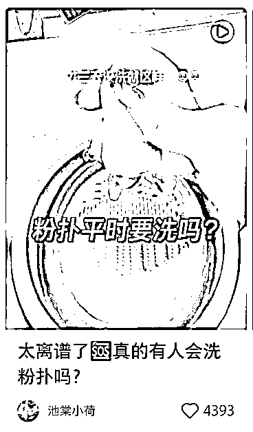
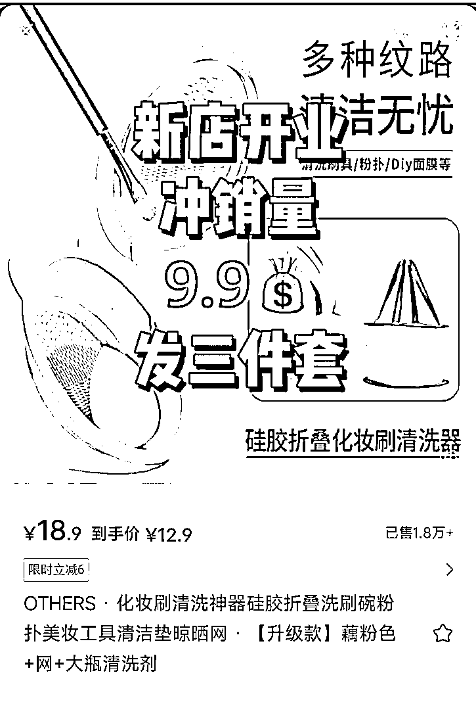

# 如何拆解一个小红书爆款视频

> 原文：[`www.yuque.com/for_lazy/thfiu8/soaitrbek9cbem5z`](https://www.yuque.com/for_lazy/thfiu8/soaitrbek9cbem5z)

## (78 赞)如何拆解一个小红书爆款视频 

作者： 书豪 

日期：2023-07-04 

各位朋友好，我是在杭州的圈友书豪，一个连续创业四年的 95 后，目前连续四年都年入百万。 

最近分享了不少关于小红书无货源电商的玩法，其实本质就是通过低粉爆文去选品，然后抄对应的爆款视频。 

但有不少朋友只知道一比一复制爆款视频，但并不知道它能爆的本质是什么，今天我们就来分享一下如何拆解一个爆款视频。 

要想打造爆款，就要先拆解爆款。 

  

今天我们拿化妆品清洗碗这个例子给大家拆解一下，不到一千粉，这个品一共卖了将近两万单。 

大家可以按这个表格的内容对视频进行拆解，我们一个个来分析。 

  

# 拆解标题 

## 原标题 

把原标题记录下来，用来分析 

## 关键要素 

把标题进行分词拆解，看具体指向了哪些内容，是否出现特定人群？是否出现价格？是否出现数字？是否出现特定行为，是否出现了特定场景？ 

像这个例子中的标题是“太离谱了，真的有人会洗粉扑吗？”，里面出现了洗粉扑，这是特定行为，出现粉扑这个物品，也把特定人群框定为需要化妆的人群 

## 表现形式 

案例中的标题是典型的悬念式标题，用反问抛出一个悬念，却不给出答案，在好奇心的驱使下，用户会迫不及待想点开笔记查看答案。 

“粉扑又不湿又不脏的，难道需要洗吗？”让用户产生疑问，吸引用户点击，这是标题想要达到的效果。 

# 拆解封面 

## 封面形式 

是单图还是拼图？图片的内容是人物还是产品？如果是单图，内容是展示产品功能还是体现产品效果？如果是拼图，内容是对比还是同款罗列？等等 

## 文字内容 

封面文字与标题是否相关？是标题的补充，还是功能的陈列？是陈述句还是疑问句？有没有展示价格？文字的位置在封面的什么位置？等等 

## 文字排版 

是单行还是多行？用的什么字体，跟封面是否搭配？等等 

像这个案例，封面是一个单图，图片内容是一个脏兮兮的粉扑，将脏水流在化妆刷清洗器中，既展示了产品，又与现实中表面上看起来不脏的粉扑形成鲜明对比。同时配上文字“粉扑平时要洗吗？”“才三天没洗就这样了”文字本身是种自问自答的形式，三天没洗原来这么脏，那你说粉扑平时需不需要洗？ 

再结合上面拆解标题时提到的“你真的会洗粉扑吗？”让用户产生强烈的点击欲望，“我的粉扑是不是也这么脏？”于是封面+标题搭配一气呵成，让用户点击进笔记。 

其实封面的细节很多，每个封面都有不同的特色，我相信拆解得多了，你就能总结出一套属于自己的爆款封面公式。 

# 拆解选题 

其实把标题分析完，选题大概也就浮出水面了。 

还是这个案例。 

## 受众是谁？ 

就是那些平时需要化妆的人群，再细分，就是那些不怎么好好洗粉扑，或者说根本不洗粉扑的人群。 

## 他们的痛点是什么呢？ 

化妆品的清洗问题。该怎么洗？用什么洗？ 

那么这个笔记，就完美解决了这个问题，把清洗、晾晒问题都解决了，还不占空间，低价实惠，爆单就很容易了。 

# 拆解文案 

先推荐一个工具，就是【轻抖小程序】，把小红书的视频链接复制到小程序上，可以直接提取视频文案，不需要自己一个字一个字敲。 

先看下这个案例的文案“这叫不吃粉吗？我看看哪个美女子还不洗粉扑，就敢往脸上抹？别再说买不起了，都已经给你们卷到个位数洗刷三件套了，这才三天没洗就这样了，怪不得你脸上经常冒各种东西，洗完可干净了，跟新的一样。” 

拿到文字稿之后，就需要从四个方面去分析。 

## 开头 

开头一定要着重分析，因为短视频的前 3 秒里藏着流量密码，能不能留住观众全靠这 3 秒。也就是所谓的“黄金三秒” 

开头是设置悬念还是颠覆认知？是讲了个故事还是直接抛出了观点？是充满共鸣还是充满诱惑？ 

案例中用“这叫不吃粉吗？我看看哪个美女子还不洗粉扑，就敢往脸上抹？”直接颠覆认知，这个粉扑真的是不洗不行了！ 

只要多看多分析，你就能摸到爆款开头的套路。 

## 金句 

拆金句需要注意三点，第一是金句的句式，第二是金句出现的位置，第三是金句达到的效果。 

案例中直接把金句放在开头，与标题和封面相呼应，让用户开始有了洗粉扑的想法。同时搭配“个位数洗刷三件套”价格优势，让用户放心购买。 

## 结尾 

常见的结尾方式，包括种草、总结、引导、煽情等等，不同的视频适合不同的方式，拆解的时候可以用方法论，但是自己制作的时候要注意思考你的视频适合哪种风格才用哪种风格，不然容易有割裂感。 

案例的结尾是点明了这个洗刷三件套不仅价格低廉，效果还很好，继续种草。 

## 结构 

分析一下整个视频的内容安排，是平行的结构还是总分的结构？是起承转合还是抽丝剥茧？ 

通过分析结构去摸清视频的逻辑，情感的传递，等到你自己上手的时候也会思路清晰。 

案例文案有点短，但能看出是一种递进的结构，先设置问题，“这么脏的粉扑也敢往脸上抹？”然后种草，“我这产品个位数就能解决洗粉扑的问题”，再设置问题，“就是因为粉扑没洗你脸上才冒各种东西”，然后再种草，“用了这产品洗完粉扑就跟新的一样”。然后就等用户自行拔草了。 

# 拆解视频 

## 场景 

视频的场景是在哪里？在工厂拍的，可能代表工厂直发，性价比高；在书房拍的，可能代表要输出观点，推荐书籍，不同场景代表的含义不同，可以第一时间让用户知道你想干嘛。 

当然，你也可以利用这种惯性思维去制造反差，比如保安厅里唱 rapper，烧烤摊上讲文学，书房里玩花手，山顶上背乘法口诀。 

## 节奏 

对视频进行分段拆解，A 片段应该用什么画面，B 片段应该用什么画面。 

让所有画面之间过渡自然，契合文案的表达。 

## 风格 

内容风格是悬疑还是搞笑？是知识讲解还是产品介绍？是讲故事还是搞煽情？音效用什么？BGM 用什么？ 

案例的视频就是纯纯展示产品，背景是洗手台，搭配一个脏脏的粉扑和几根脏脏的化妆刷，与文案搭配，在气口处进行剪辑过渡。但有一点需要注意的是，该视频在文案语音结束后，又配了一段洗刷三件套将洗干净的化妆品挂起来晾晒的视频。透露出的信息就是，这个三件套不仅价格低廉，清洗效果好，还能重复使用，性价比高，继续种草。 

每个视频的风格和内容都是不一样的，多刷多看多拆解，总结出这些特征，再结合自身的特点，一定可以找到你的独家路线。但要注意的是，拆解视频并不是让你照猫画虎，而是要学会融会贯通，成为自己的表达技巧。 

以上呢，就是关于如何拆解一个爆款视频的方法，希望对你有所帮助。 

往期文章： 

## [人生的第一个 100 万，我是怎么赚到的？！](https://articles.zsxq.com/id_kek27cqo56wf.html) 

## [小红书单店铺单月 6000+利润选品保姆级教程](https://articles.zsxq.com/id_xwveu3e0usfv.html) 

## [小红书无货源电商，单品 4w+利润，我做了什么？](https://articles.zsxq.com/id_8o3ptacdp6mj.html) 

## [抖音直播间月消耗过百万的千川投流经验分享](https://articles.zsxq.com/id_d3zembkeh2cw.html) 

## [2023 小红书幼教考编保姆级教程](https://articles.zsxq.com/id_cpdec6j4xtho.html) 

[小红书低粉爆款案例拆解教程](https://articles.zsxq.com/id_0nmnwdg6mb0l.html) 

[小红书新人入局月入 100-1000 元保姆级教程](https://articles.zsxq.com/id_sbk8lqv5unca.html) 

[抖音单品短视频带货 1000 万 GMV，我是怎么做到的？！](https://articles.zsxq.com/id_qoak1w7ptnwf.html) 

评论区： 

biubiu 六月 : 很详细 感谢书豪分享 书豪 : [玫瑰][玫瑰][玫瑰]希望内容写的有价值，可以多提提建议，我会的都写出来 精灵 : 厉害了，做哪些方面的视频 书豪 : 百货，女装，玩具都做