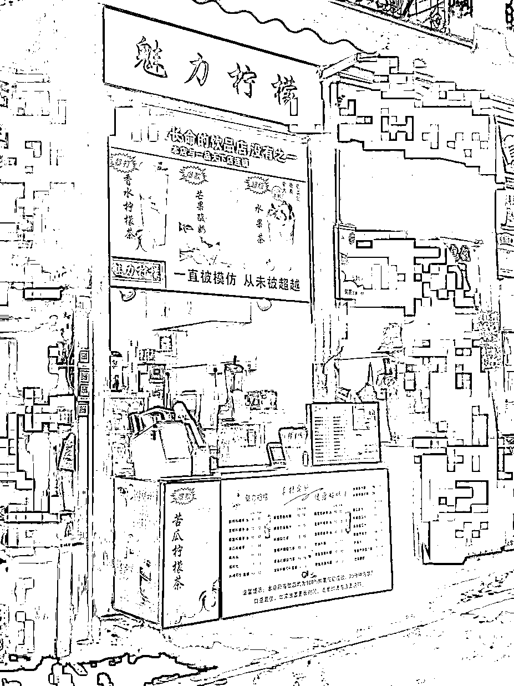
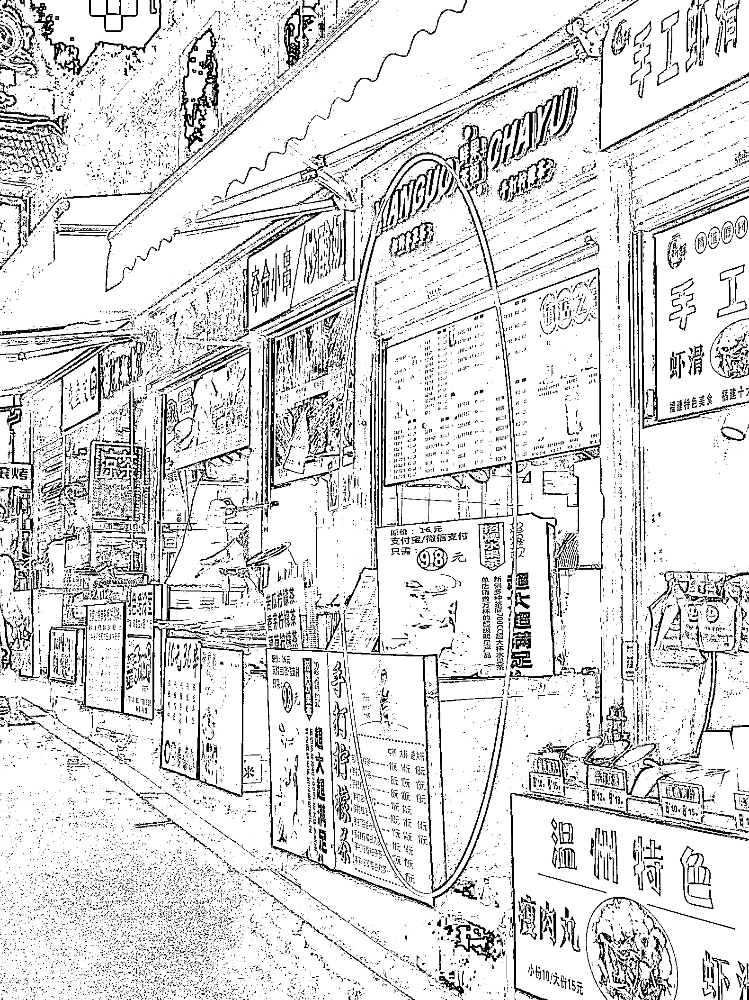
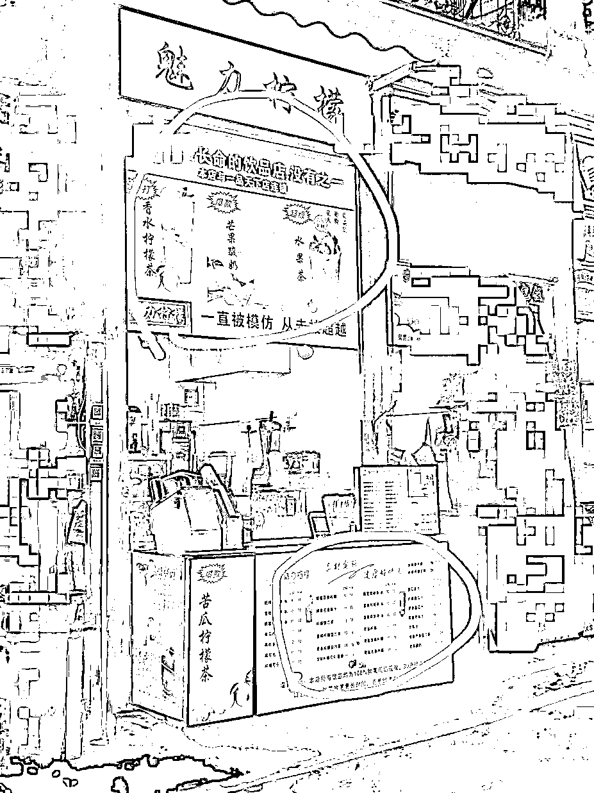
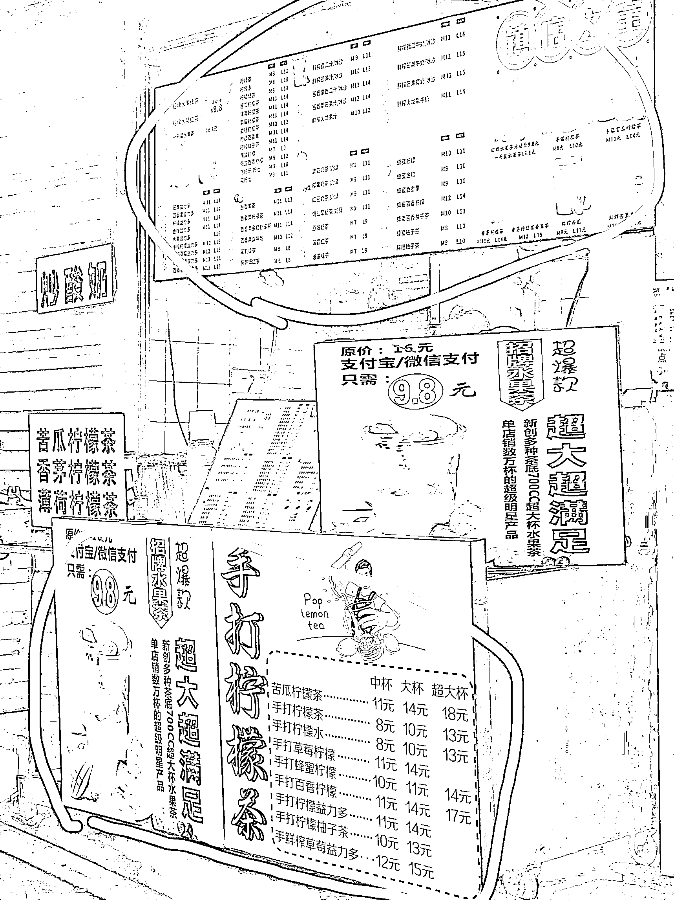
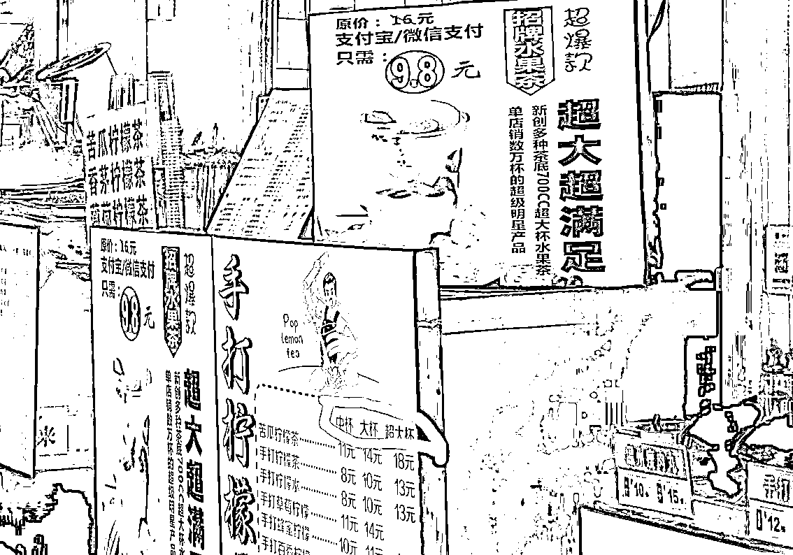

# 同样的街道和人流，为何这家小店获客是对手的几倍？

> 原文：[`www.yuque.com/for_lazy/thfiu8/cq2tgw0wy5qesb26`](https://www.yuque.com/for_lazy/thfiu8/cq2tgw0wy5qesb26)

## (24 赞)同样的街道和人流，为何这家小店获客是对手的几倍？ 

作者： 奋斗的木鱼 

日期：2023-07-07 

一直偏向写大店，但大店很多经营技巧是我们无法模仿的，有些朋友就让我写一下小店，因为我们一般开店都是从一家小店开始，最近恰好在观察两家小店，就拆解他们的经营智慧，为大家奉上。 

在这一条 50 米长的街道上，有两家有趣的门店，都是果茶店。一家以水果茶为主，柠檬茶为辅，开在小吃街左边。另一家是柠檬茶为主，水果茶为辅，开在小吃街右边。 

你们猜猜，哪家门店生意更好？ 

 

图 1（左边） 

 

图 2（右边） 

我潜意识的猜测是左边的这一家以柠檬茶为主的门店（图 1）会更胜一筹，因为他这家店是分店，首店就在 200 米外，而且这家店在这边沉淀了多年，有着众多的粘性客户。 

但是通过一段时间的观察，我发现我错了，原来右边的水果茶门店（图 2）生意更好，这引起了我的好奇，为什么同一街道，一家有着大量沉淀客户的老店输给了一家新店呢？ 

为了寻找答案，我连续蹲点，站在街道入门处开始观察。 

这一观察，才发现这家新店的奥妙与手段，今天，我带大伙一起来看看。 

战争的关键战略点【位置】 

我没入行就听说一句话：线下门店生意好，关键是“位置、位置、还是位置”。 

不管是餐饮门店还是其他行业的线下门店，位置的重要性必定排在前列，那这短短的 50 米，大家位置一左一右，面对面的直线距离也不过 5 米，怎么说位置也是他们的战争决胜点呢？ 

这个问题我也疑惑良久，后面在黄老师的零售小店课程里找到了答案。 

【客户进店，是先迈左脚向右看】就是这句话，让我茅舍顿开。 

首先，我们可以将这条街道当作一家门店，两边当成零售的货架，按照大多数人的习惯，客户进店（进街）是先迈左脚向右看的，那会首先注意到的是谁？ 

就是在右边开店的水果茶店。 

这样一来，水果茶店是抢夺了先机，先吸引到顾客的注意力。 

我们来看看他们门店的灯箱。 

 

图 3 

他们有一个灯箱是侧向展示的（图 3），你在远处可以看到全貌，但正面点单时就只能看到一半图像。 

我看到这个灯箱是疑惑良久，那这块灯箱装错了？ 

恰恰相反，在客户首先向右看的逻辑下，这块灯箱装对了。 

因为这个水果茶灯箱并不是给点单的客户看的，而是给进街【右看】的客户看的，因此它的角度才侧向面对街口。 

这样一来，客户看向右面这家门店时，顺着门店的灯源看向了招牌灯箱。而且这家店为了增大可视面积【减少客户负担】，调整了字体，表明了价格，用大块的面积突出主产品，让客户瞬间了解这家店【买啥，价钱多少】。 

行为学家有个有趣的实验结论：让客户多将注意力放在你这里，你就赢得客户更多的好感。 

这家店不但做到了让客户原本极短的注意力变长了，赢得了客户好感，还做到了抢先占据用户心智（让客户以它为起点，作为衡量接下来饮品的价格、容量、材料丰富度）。 

为了验证这家门店是否赢在【迈左脚向右看】的原因上，我连续多天（中午、晚上）观察客流步行迈脚情况和视线变化。 

发现了同样有趣的知识： 

迈左脚向右看是极大多数客户的习惯。 

其次，迈右脚，向左看客户也会分为两拨，一直看左和先看左，在观察几眼后转向右面。而转向看右的客户占据迈右脚的大部分客户，但迈左脚转向左看的客户却是少数。 

总体而言，向右看的客户居多数，不管迈左脚还是右脚。 

（PS：以上数据是连续 1 周观察千人以上数据） 

后面还得出一个验证信息：迈右脚向左看，看了几眼又转向看右边的客户，转向的第一眼是从街道中间开启，而这家水果店恰恰在中间的位置。 

（PS：可能和街道距离长短有关） 

分析完位置，我们来看看门店的灯箱 

这里，两家的灯箱都大同小异，不同的是展示菜单的位置有所区别 

 

图 4 

 

图 5 

左边（图 4）这一家，我们可以看到上方是以“大图+主打产品“，下面是“菜单价格图”。 

右边（图 5）这家上方是“菜单价格图”，下方是“招牌大图+针对竞对对手的菜单产品图”。 

哪个好呢？ 

好与坏怎么分辨？ 

是图片？大小？价格展示作为分辨吗？ 

华与华老师说过“现场有神明”。 

【灯箱位置的好坏让客户自主的反应来判断】 

我观察到，在客户选择产品的时候，都会自主的将注意力放在菜单上，但身体有所不同。 

看向左边柠檬茶门店菜单时，客户视线向下，【身体微微往后】，因为要看的更清楚。 

看向右边水果茶门店菜单时，客户视线向上，【身体微微靠近】，因为要看的更清楚。 

人天生对外界有警惕性，不会贸然靠近陌生的事物，一般选择站在安全的位置上。 

这时，因为导致客户距离的不同，灯箱的好坏便体现出来了。 

这两家门店的菜单让客户有截然不同的反应，一个让客户靠得近，一个让客户离得远。 

客户要靠得近，潜意识引导身体接近对方，易于产生信任。 

客户要离得远，潜意识引导身体远离对方，易于产生防备。 

一个信任，一个防备，换来的结果是截然不同。 

其次，由于街上的人流众多，而街道空间有限，左边门店需要远离才能看到菜单，那更容易受到人流的冲击，在点单过程中形成了无形的紧迫感。 

试想在点单时，来来往往的人与小电车穿梭越过，你的感觉会好吗？ 

 

图 6 

 

图 7 

来到价格 

同样产品，水果茶为主的门店就对标柠檬茶的门店，你有的，我也有，我还比便宜一点。 

因为柠檬茶有两家店，如果贸然改价跟进，就会导致总店受损，在价格策略上，柠檬茶店只能看着对方无奈叹气。 

在同样柠檬茶的价格设置上，水果茶店还玩了小心思，增加一个超大杯（图 6）。 

我们了解“价格锚点”的会知道，客户选择产品一般趋向于中间的价格，这样安全系数更高。 

你看，对方买和你同样的产品，可能买的还都是你的最高价，真是气人...... 

都说高手在民间，今天这两家店就让我看到了众多的学问，也了解到为什么一家老牌茶饮店，在客流上输于新的茶饮店，因为里面都是满满的经营智慧啊。 

评论区： 

暂无评论