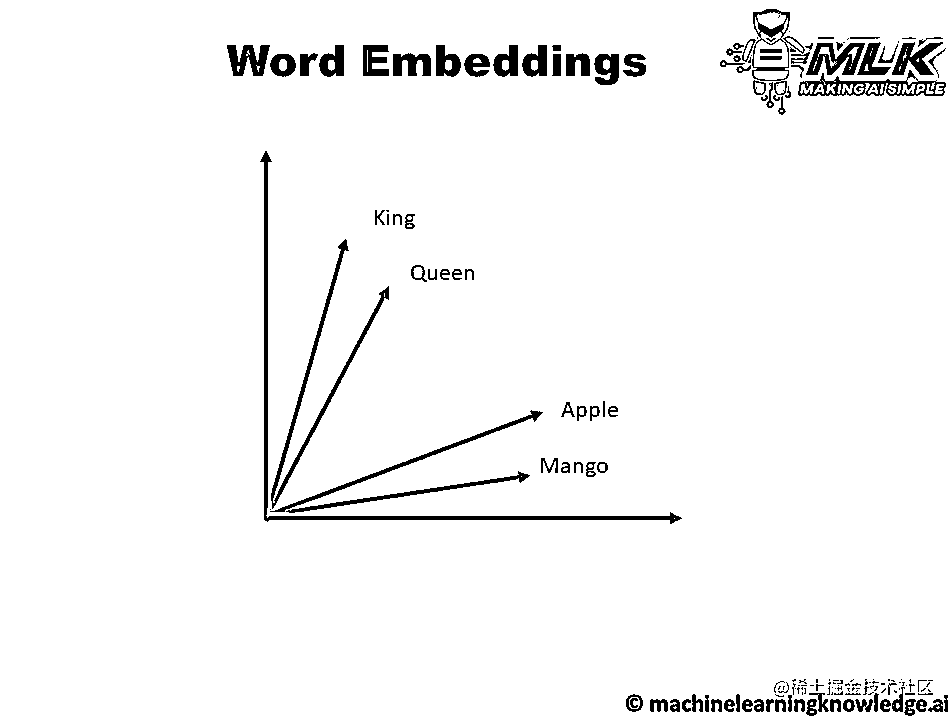
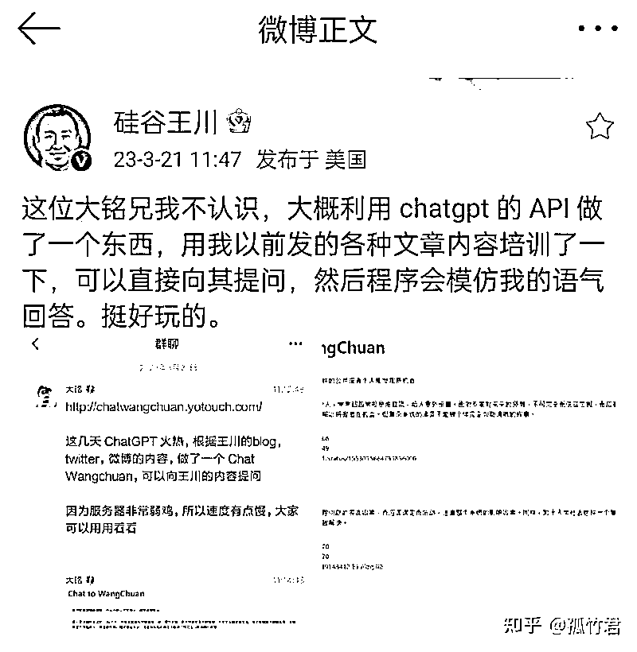

# 深度解析 ChatPAN：基于语料的 AI 聊天工具的设计与落地过程

> 原文：[`www.yuque.com/for_lazy/thfiu8/uodwzdimc055c7n1`](https://www.yuque.com/for_lazy/thfiu8/uodwzdimc055c7n1)

## (精华帖)(40 赞)深度解析 ChatPAN：基于语料的 AI 聊天工具的设计与落地过程 

作者： 大铭🍀 

日期：2023-07-07 

深度解析 ChatPAN：基于语料的 AI 聊天工具的设计与落地过程 

6 月 7 日《深度解析 ChatPAN：基于语料的 AI 聊天工具的设计与落地过程》@大铭一、ChatPAN 缘起大家晚上好，我是大铭，一直在生财潜水，感谢生财的邀请来和大家做分享。先做个介绍，我是程序员出身，初中开始写程序，拿到过天津市程序设计奥赛一等奖。后来在大厂、豆瓣都待过，也在硅谷短暂创业。回国后加入月嫂公司，通过数字化的方式，2 年时间把月嫂公司从每个月 15 万收入不到增长到 1000 万每个月。在今年 3 月开始研究 ChatGPT，做了很多技术上的尝试，也有一些产品的思考。现在正在开发 ChatPAN.ai 这个产品1.1 研究 Prompt 还是研究 API？在上次参加航海的时候，我开始正式研究 ChatGPT，因为感觉已经有点晚了。当时我注意到了一种普遍的现象：许多人已经在制作基于 ChatGPT 的 Prompt 套壳。简单有效，能够将这个强大的 AI 模型应用到各种场景中。但是这个太薄了，而且想做出来估计也就是一周两周的时间，所以我跳过了对 Prompt 之类的学习，直接开始从接口 API 下手看还有没有什么机会。我认为 API 是一种更为灵活和强大的工具，它可以让我更深入地探索和利用 ChatGPT 的能力。而且，通过 API，我可以更加灵活地集成和定制 ChatGPT 的功能，从而做一些不一样的产品。1.2 技术实验 & 产品需求1.2.1 技术实验的坑在前期的实验中，我大概遇到了以下这些坑：封号，封 API同一个 IP ，不断轮询换 Key 请求，会把这个 IP 放入黑名单，然后这个 IP 粘过的 key 对应的账号全都被封杀completion 接口 vs chat 接口刚开始研究的时候还没有 chat 接口，全部是使用 completion 接口进行访问。 就必须自己定义身份的定义词， STOP 词等。有了 chat 接口就简单很多，但同时也更容易理解一些对 OpenAI 的调用方式。Fine Tuning vs embeddingFine Tuning 是第一时间想到的方式，也做了测试，1 万字需要花费 3-5 美金，测出来效果很奇怪。而且需要很大的验证集进行验证，但是一般我们是没有这种数量的验证集的。如果能够覆盖全部的场景倒是没问题，但是我们无法完全涵盖业务中可能的场景。如何使用 embedding本地保存向量使用数据库工具坑可以快速掠过，我这个阶段最大的收获，是对调用和一些底层的机制有了很大的了解。1.2.2 对一个客服产品需求的初步思考我在看市面上已有的工具产品时，发现这时候网上已经开始有 ChatPDF 等产品出现了，从这些产品上看，很容易看到是一个基于文件的问答，如果把一个单独的文件转换成多个文件的支持，这就是一个非常方便的客服的雏形。如果我们看手册可以发现，需求的来源是有如下的几个方面的，这里感谢 @刘小排💡✅原生 idea ★★★★★✅抄竞品做出差异化 ★★★★✅通过关键词挖掘需求 ★★★✅通过痛点挖掘需求 ★★★✅通过围绕平台挖掘需求 ★★★✅通过围绕自身需求拓展需求 ★★★✅个性化需求定制 ★★✅重点关注：ChatGPT 相关工具站需求挖掘从我自己的场景出发，我是做母婴服务生意的，现在可以应用的场景有公司的月子中心 5 个，月嫂公司 1 个，朋友的月嫂联盟 20-30 家，这个基础的用户量是可以有保障的。所以我可以确定我做出来的东西一定会有人用，而且这个应用场景还不会很小。然后我进行了初次的产品功能抽象提炼：完全是基于语料库进行后续的操作，结合特定的内容填充至 ChatGPT。凡是需要有自己的语料库进行处理，就可以使用类似的技术。抽象提炼完成后，我发现一个很多开发者都会碰到的问题：虽然这个产品已经具备了解决实际问题的能力，但是用户还是有可能看不懂，不会用。很多工具从开发者的角度，是能够看明白可以应用在很多的场景下的，但是从用户的角度是看不到也看不懂的，因为用户看不到技术的深度，也无法想象技术可以延展的点。比如对企业知识库的问答、客服系统、名人的角色扮演，都可以利用基于语料库 + 特定 prompt 的方式来做。技术上很类似，但是场景差异很大。如果不能把场景展示给用户，用户是无法明白可以利用这些技术来干什么。换言之，如果你只给技术，用户不知道怎么用。用户只能看懂自己熟悉的东西，然后做一些变化。如果你给他一个拥有很多新功能的产品，更像工具的产品，用户是不知道怎么用的。比如：你给用户用乐高组装好的变形金刚，用户很爽；你给一堆散件乐高和组装说明书，少数用户愿意这么干；你给用户一堆乐高，告诉他释放你的想象力吧，用户说这是个啥啊；所以，用户需要的是场景落地。因此我现在也还在寻找真正的落地场景。二、实验室代码尝试2.1 尝试一：通过微调数据进行训练首先看到的是 Fine Tuning 这种方式，对数据进行微调，但是失败了💡Q: 到家月嫂提供什么服务？A: 到家月嫂是一个非常纯洁的工作原因是需要一个很大的验证集，每次训练的成本是1 万字 3-5 美金，但是不知道需要训练多少时间。2.2 尝试二：抄作业， How ChatPDF works发现了很多的类似的 GitHub 的项目，比如向  Naval 提问：https://github.com/mckaywrigley/naval-gpt，AI search & chat for Naval Ravikant Twitter thread "How To Get Rich."从这个项目中获得的知识，使用 OpenAI Embedding，和 pgvector。研究 Embedding本地做了测试，深入了解  Embedding 的原理汉堡和热狗的关系比较近，但是和桌子差距比较远通过 Embedding 可以做很多相似度的查询当你从 King 中减去 Man 这个词，再加上 Woman，就会得到 Queen 这个最接近的结果之一。国王-男人+女人≈女王解释 Gensim 中的 Word2Vec，用于创建单词嵌入模型（预训练和自定义）。原文：https://juejin.cn/post/7120088845604880421其他的项目Gpt-indexLangchain这是两个项目，从里面我获得了很多灵感，也对一些不确定的技术进行了验证。另外很多人也问 ChatPAN 是否是使用了 langchain，并没有，因为开发 ChatPAN 时候 langchain 还向现在这么成熟，而且也想把最关键的技术掌握在自己手里。2.3 尝试三：做了一个 ChatWangchuan我需要一个完整的 App 把上面的所有零散的点串联起来，来证明整体上是可行的，所以我尝试做了一个 AI 版本「Chat WangChuan」。王川是一个硅谷的投资人，善于输出，很容易的就可以拿到以下平台上的公开信息：微博Twitter博客我整理了这些渠道上的所有的内容，大约 200 万字，进行本地的 Embedding，存储到 SQLite 数据库，使用代码进行相似度的计算，效率低，但是可以证明可行。在这个这个过程中，我有以下收获：经验一：语料如何切分？王川的特点是按照 1/2/3 这样的方式，所以就按照自然段进行切分。 效果在王川上还可以，但是在其他的文档就不行，因为上下文太少了经验二：语料库命中的问题是否有效王川的语料库中大量的，参考我的文章 XXX，这时候如果一个用户问的问题就是标题关键字，则命中的全部是“参考我的文章 XXXX”，比如摩尔定律，这时候就会给不出来什么有效的内容。引起的启发是，语料必须进行人工处理——清洗整理才能达到一个比较好的效果。但是在很多的场景下我们无法对语料库进行特定的业务切分，所以只能有通用的做法，也就是按照字数进行切分。 ChatPDF 和很多类似的产品都是这样做的。另外被王川大佬翻牌子，发了微博和推特，本人感觉挺好的。三、做出 ChatPAN 产品基于自己的语料库，进行后续的提问，这本身就是一个强需求，虽然我当时还不清楚落地的场景，但是已经决定开始把  ChatWangChuan 通用化，产品化：1.用户上传自己的语料，理论上可以无限2.对自己的语料进行提问，获得对应的结果3.1 考虑可能的落地应用场景客服学习助手企业知识库……3.2 先做出来再说—— ChatPAN 0.9.0从实验室代码到产品代码，中间有很多的事情要做。例如：稳定性在实验室环境下，我可以随时修改和调试代码，但在正式产品中，我不能这么做。我需要确保我的代码在各种情况下都能稳定运行，不会出现错误或崩溃。异常处理在实验室环境下，我可以忽略一些异常，但在正式产品中，我不能这么做。我需要确保我的代码能够正确地处理各种异常情况，而不是简单地崩溃或者停止运行。性能优化在实验室环境下，性能可能并不是一个大问题，但在正式产品中，性能就变得非常重要了。我需要确保我的代码能够快速且高效地运行，满足用户的需求。用户体验我需要确保我的产品不仅功能强大，还易于使用，能够给用户带来良好的体验。在这过程中，我也有一些收获首先，如果你对产品的第一个版本不感到尴尬，那就意味着你推出的时间太晚了。这句话是 LinkedIn 的联合创始人 Reid Hoffman 说的：If you're not embarrassed by the first version of your product, you've launched too late，原文：https://twitter.com/reidhoffman/status/847142924240379904所以，这次我就开始第一时间就尝试上线，为了安抚产品给用户带来的不好的体验，暂时定义为免费的产品而且只有上线了，我才能：1.验证客户假设，很多我们理解的客户需求，并不是真的需求；2.收集到很多用户的需求，才更好的进行下一个版本的迭代。3.3 产品升级  ChatPAN.ai 0.9.2这次升级，主要增加了对助手的开发的扩展，因为是希望用户可以方便的基于 ChatPAN 进行扩展，扩展出来自己的应用，初期时针对开发者，提供接口 API。开发部分不多说了，大家可以看文档 扩展 ChatPan（0.9.2）我现在给 ChatPAN这个工具的定位是【支撑】，帮助各位长官更好的赚钱，大家赚大钱，ChatPAN 顺便喝口汤。四、针对产品的再次思考4.1 不做定制开发首先，定制开发虽然看起来很有吸引力，因为它允许我为每个用户创建一个独特的、完全符合他们需求的产品，但这也带来了很多问题。定制开发需要大量的时间和资源，这意味着我需要更多的人手和资金来支持这个过程。此外，定制开发也会带来维护问题。每个定制的产品都有其自身的特性和问题，这使得维护和更新工作变得更加困难。并且在定制开发中，我永远是被我的甲方带着走，无法实现产品层面的积累。本质上是出卖体力，无法形成杠杆。这个决定也影响了我开发的工作流程。我不再需要为每个用户创建一个独特的解决方案，而是需要创建一个可扩展的、可配置的产品，这个产品可以通过设置和选项来满足不同用户的需求。这使得我能够更加专注于产品的核心功能，而不是花费大量时间在为每个用户定制产品上。所以才有了 ChatPAN 0.9.2 的扩展性。4.2 扩展性Unix 编程思想，一个产品只解决一个问题，ChatPAN 只解决如何更好的处理自己的语料内容，此外全部通过扩展实现这给了 ChatPAN 一个非常好的边界，只要是更好的和语料相关的，就应该做，其他的就不做。比如从数据库、网页读取，OCR 等，更好的整理语料，对语料处理偏应用层的可以通过扩展实现，比如 Summarize 总结。4.3 ChatGPT 是用来读，还是用来写在现在大量的场景下， ChatGPT 都是用来读内容。还有一个巨大的市场使用 ChatGPT 进行写。这种场景包括根据已有的内容进行扩展、仿写、续写等。在不结合自己语料的时候，进行写操作并不难，但是这样通用性太强，也就意味着千人一面。就好像现在小红书的文案，已经出现了大量的同质性了。结合自己的语料有这三个好处：真实性和正确性保障文案的风格，个性化特定领域的专业知识支持而要实现这样的特点，需要大量的特定场景的定制开发，ChatPAN 提供了语料处理能力和定制开发能力，说明之前的产品的判断是 OK 的。五、能确定的很多落地场景客服/企业场景首先是，企业微信侧边栏，实验室测试完成，下面是演示视频：图片加载失败企业微信侧边栏问答功能.mp4然后是，CRM、 订单系统的结合，这我们也在 API上接通测试完成了。角色扮演，解梦，同样也验证成功这是完全依赖 ChatGPT 的版本。下面是结合语料库的版本。内容生成同样是卖手机壳，赛博朋克风和小清新风，创建的小红书文案是不一样的根据已有的内容进行仿写，比如商标驳回申请（已验证）以上就是我的分享，感谢生财有术的邀请，也感谢大家的时间，希望我的分享能够给你带来启发。  

评论区： 

胖大魔 : 大佬太厉害了！！！我一直想投喂 ai 王川辅导我功课[呲牙] 胖大魔 : 我是老豆瓣人了，现在还在用，蓦然回首，豆瓣才是金山[呲牙] 大铭🍀 : 现在还可以访问 chatwangchuan.yotouch.com 胖大魔 : 好滴感谢[呲牙] 大铭🍀 : ChatPAN.ai 升级后我会再弄一个新版本的王川 大铭🍀 : 正在用豆瓣读书做一个新的测试 胖大魔 : 今天进微信读书，在用看广告变现，豆瓣读书依然佛性。我之前试过把微信读书写的好的，搬运到豆瓣读书去 胖大魔 : 期待期待[呲牙]