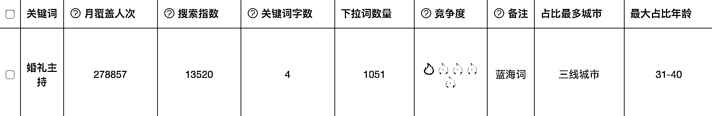
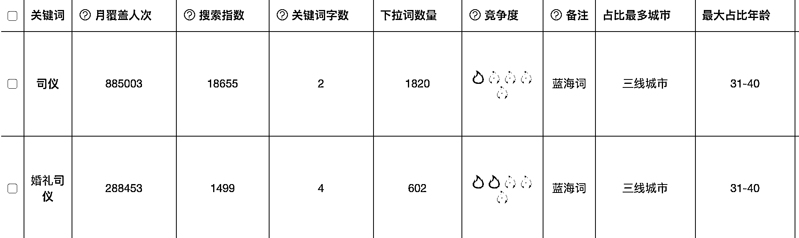
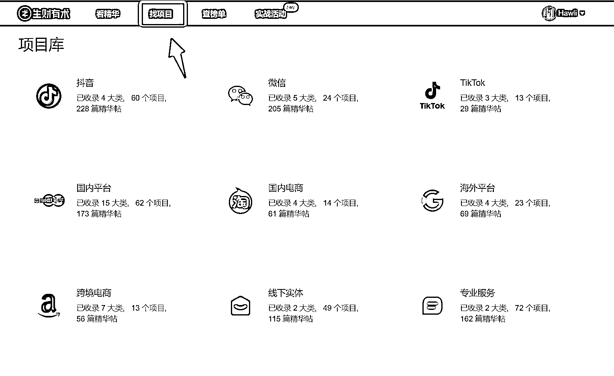
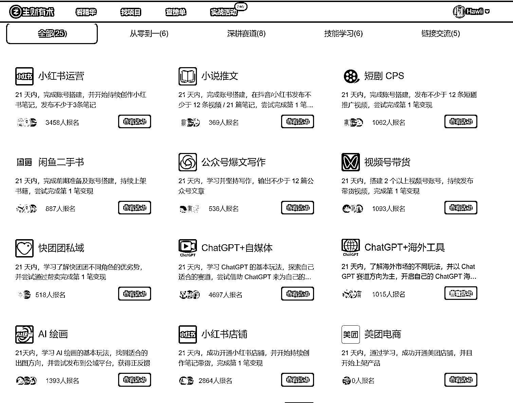
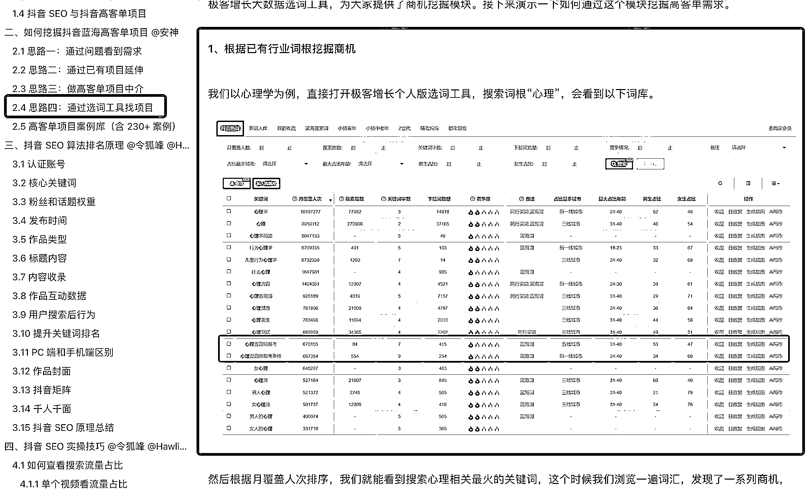
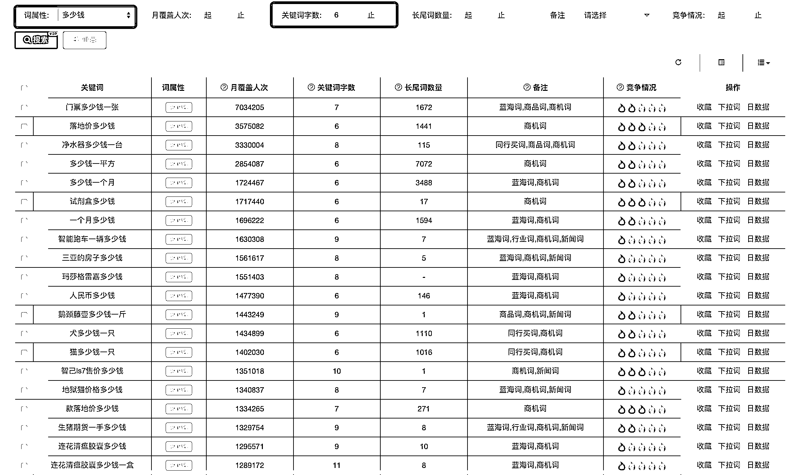

# 如何精细化选词并找到适合自己的项目

> 原文：[`www.yuque.com/for_lazy/thfiu8/fciw7nf8c00hotwg`](https://www.yuque.com/for_lazy/thfiu8/fciw7nf8c00hotwg)

## (精华帖)(46 赞)如何精细化选词并找到适合自己的项目 

作者： Hawli 

日期：2023-07-07 

5 月 25 日《如何精细化选词，并找到适合自己的项目 》@Hawli5 月 25 日《如何精细化选词，并找到适合自己的项目》@Hawli各位同学大家好，我是 Hawli，是本次抖音 SEO 航海的教练之一。上次分享中，令狐教练给大家分享了极客工具的选词和 AI 写作，那么今天，我就来我的分享会分成两部分：第一部分，精细化选词。第二 部分，通过挖掘关键词，找到适合自己的项目。在开始分享之前，我要讲讲这个主题的意义。为什么要去挖掘项目呢？在上次航海的分享中，我提到四种类型的人，在这里我也跟大家分享一下，大家看一下下面这张图。根据我们前期的案例，抖音 SEO 船员出效果的速度，最快的是第一类人：有产品且有短视频经验。大部分 1 周内出成果，最快的第二天。而有产品，没有短视频经验的人，出结果的速度，取决于他的野心，如果愿意跑通最小闭环，学习输出几个短视频，那么出效果的速度也是很快的。而出结果比较慢的，又或者上不了案的人中，很大程度是因为他没有项目，缺少方向，不知道从何入手，有了锤子，不知道往哪钉，最后很容易放弃。假如你是有产品的船员，那么系统的选词方法可以帮到你更好地做好抖音 SEO，获取精准流量。而假如你是还没确定自己的产品和方向，那么第二部分，通过关键词挖掘项目，会比较适合你。一、精细化选词那接下来，开始进入正题，我们先讲第一部分，精细化选词。1、选词的重点指标很多船员问，我选词的时候，到底是要参考什么指标？  其实，主要可以看下面的截图中红框部分：月覆盖人次：我们参考数据的时候，越具体越有用。月覆盖人次指的是这个关键词及其下拉词每个月具体的搜索人次的总和，有了这个指标，你就可以知道你能获取多少搜索流量。下拉词数量：指的是这个词在系统内有多少下拉词，下拉词数量越多，说明细分需求也多，也说明这个词可能不精准，需要看看细分方向有哪些。竞争度：系统给出的竞争激烈程度，越小越好。备注：看看是否是蓝海词，是否有同行投广告。注意，有同行投广告，一定程度说明这个词具有商业价值。2、选词的几种方法方法一：根据产品/解决方案选词今天有位船员提供的是婚礼主持服务，那么他的产品/解决方案就是：婚礼主持/婚庆司仪。这个是大多数人优先会用的选词方法，采用这种方法要注意的要点是，要从用户的角度去看看用户使用的是什么搜索词。比方说用户要找婚礼主持，可能会搜的词有婚礼主持，司仪，四大金刚。我们可以看到，不同叫法的搜索量级是完全不一样的。尽量选大众会用的叫法。方法二：根据用户需求，痛点选词。比如我们这一期航海有船员是做失眠调理的，那么失眠，就是用户的需求和痛点，用户可能会围绕失眠这个问题，去搜索相关的内容，而你作为提供解决方案的人，就要围绕用户的需求去做内容，让用户觉得你的解决方案是最适合他的，这样才能提高转化率。方法三：根据场景/人群选词。有很多需求是在特定场景和人群中产生的，比如：新房除甲醛。很多人有除甲醛需求，都是在买了房子，刚装修完后产生的，那么围绕这个场景和人群去产内容，用户就会自我代入，觉得你是为他定制的，更容易被你的内容吸引。3.本地词怎么获取更大流量有些船员会发现，当你搜索带地域的词的时候，搜索量总是很小，这是因为受到两方面的影响：第一，主词的搜索量不大，分配到各个地方，自然也会比较小；第二，很多人搜的时候不一定会带地域，系统会根据用户的标签自动推送靠得比较近的店。基于这个原理，我们在做本地词的时候，可以直接挑选主词，然后带上地理位置 poi，这样系统就会自动推送给附近的人，就不会因为仅仅用地域词，过滤了那些搜索的时候不带地域的用户。4.多少的搜索量值得做，要学会算帐很多船员会问，我选词的时候，要选择多少月覆盖人次呢？其实这个问题没有标准答案，选择多少月覆盖人次，取决于你的阶段，你的客单价，还有你的转化能力。你的收益=客单价*搜索量曝光量*转化率假如你的客单价是 5000，搜索量（月覆盖人次是 10000），排名前 5 获得 50%的曝光，然后这些曝光后引流到私域是 10%，转化率是 5%，那么你这个月获得的收益是 5000*10000*0.5*0.1*0.05=125000。算完这笔账，你就知道这些词你该不该做，需要花多少心思，投入多少成本去做。所以我们为什么建议老板要做高客单价产品，因为客单价高，你对词的要求就不会那么苛刻，搜索量小的也可以做，因为只要转化一个就很香。选词的时候能注意以上要点，做搜索就成功了一大半。二、通过关键词挖掘合适的项目讲完选词，我们进入第二部分，讲讲如何通过关键词，挖掘适合自己的项目。这里我提供三种思路，供大家参考。第一种，也是最简单的，就是从已有的项目入手。比如生财里面，有这么多的项目，哪些项目有搜索热度，大部分人没研究过。假如你没有项目，建议从项目库里挑选合适的项目，然后再用极客工具，挖掘流量机会。具体如何做呢？打开生财的项目库，点击找项目。又或者直接打开实战活动，查看已有的项目。你可以先选择其中一个项目，然后分析一下这个项目在抖音推广的可能性。比如我们看到小说推文，短剧 CPS，就很适合抖音推广，我们以短剧 CPS 来举例。首先，我们要确定短剧这一块，在抖音的搜索情况。于是我们打开极客工具，搜索“短剧”，我们会发现，短剧的搜索量好大，看下面的图。这是个热门的项目，可以做。同时，我们从左边的侧边栏可以看出，前 1000 个词中，大部分人搜短剧的时候，都是什么方向，比如总裁，情感，穿越，这些方向就是大众搜得最多的，根据这些方向再精细化选词，还怕选不出合适的内容吗？第二种，相对比较顺手的，就是从成熟的领域挖项目。比如有很多领域，其实就有有很多机会，如果能够挖掘领域的商机，就能发现适合自己的项目机会。成熟领域的挖掘方法，可以参考有产品的选词思路。而因为你是没有产品的人，更不容易被解决方案限制，可以从用户需求、痛点和人群入手，挖掘有竞争力的产品，这部分在航海手册的 2.4 有提到，大家可以仔细看看，这里就不详细说了。第三种，通过商机挖掘的形式找项目。具体怎么做呢？这种方法针对完全没有思路，想挖掘需求的人使用。打开极客工具中的商机挖掘模块，传送门：https://dyinseo.com/DouyinKeywordBusiness/index.html我们直接可以看到这个界面，上面是各种各样的需求词，眼尖的船员已经发现各种商机，比如说，净水器一台多少钱，竟然有这么高的搜索量，毕竟净水器的价格可不低。同时我们还可以看到很多有用的需求，比如：女性 bmi 大小怎么测。能关注这种词的人，多半是有减肥需求，吗， 这种选题方向，是不是看起来就挺不错。那么我们怎么利用这个模块呢？有两种方法，一种是直接输入关键词查看，比如做失眠的那位船员，就可以直接输入失眠，得到下面的结果：第二种是可以直接根据词属性筛选，比如多少钱，就是意向很强的属性词，设置关键词字数 6，可以筛选出需求更明确的词，结果如下：根据月覆盖人次排序，我们能看到很多人在搜索各种各样的产品的价钱，可以从中选择自己能深入发展的业务，然后再结合前面精细化选词的方法，去直接实操获取流量。今天的分享就到这，希望各位船员能够先确定一个合适的方向，跑通从 0-1，21 天，给自己一个结果，加油！  

评论区： 

书豪 : 牛的 更绪 : 狐嫂牛的 老吴 : 项目库在哪里啊，找不到 灯火煌煌 : 关键词：极客有没有优惠价？ Hawli : 联系客服报生财有术 Hawli : [https://search01.shengcaiyoushu.com/project](https://search01.shengcaiyoushu.com/project)Hawli : 😄 Hawli : [嘿哈]