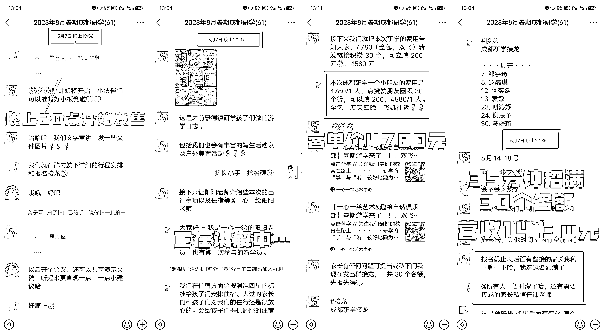
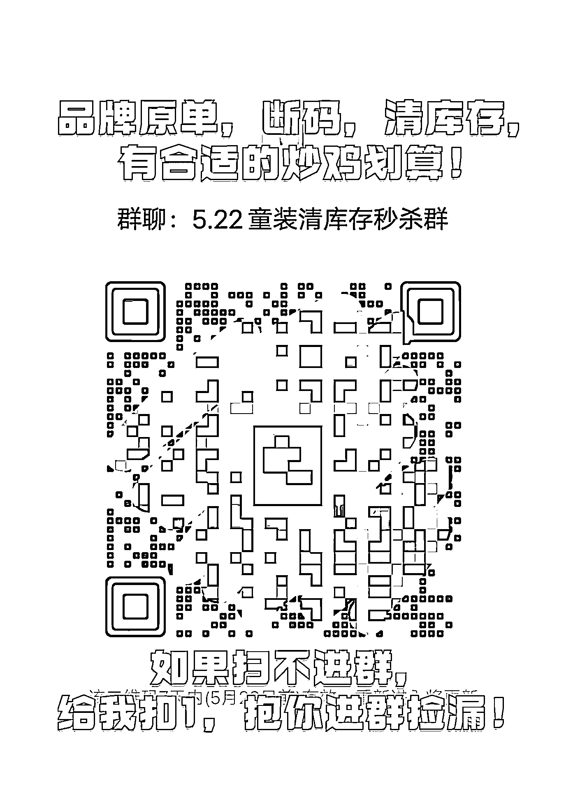
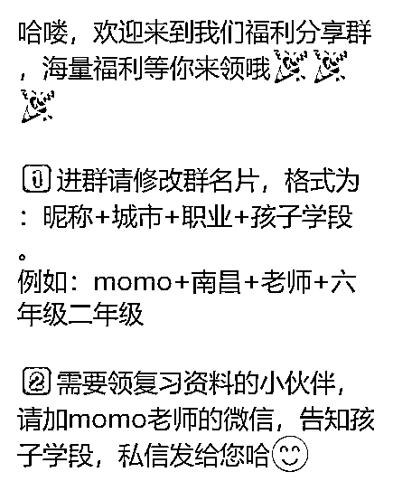
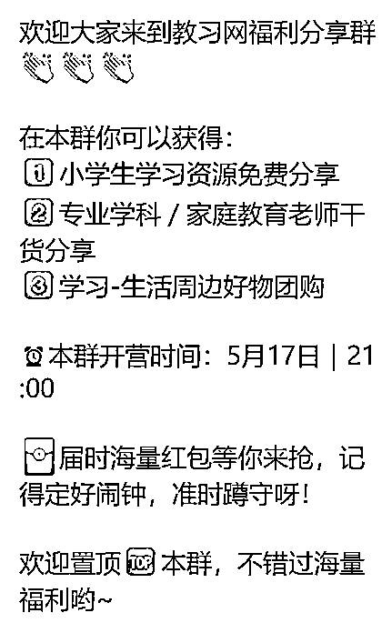
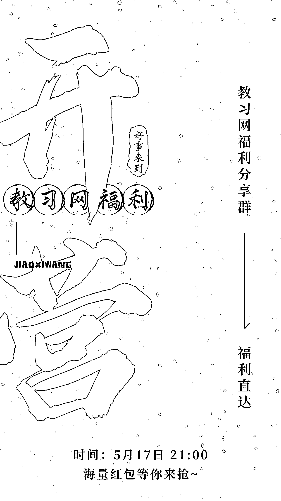
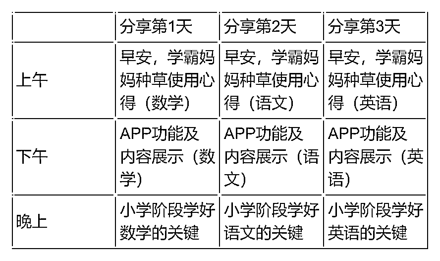
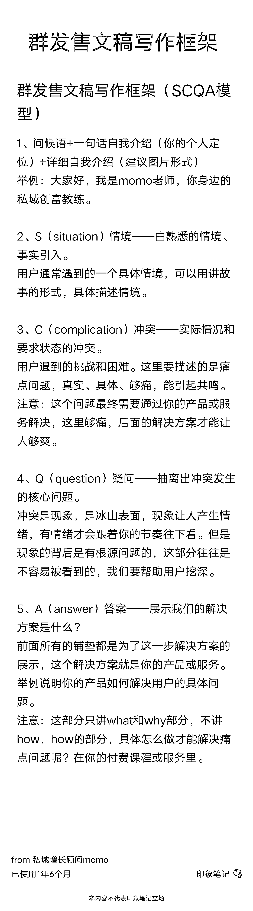

# 如何做一场高转化率的快闪活动

> 原文：[`www.yuque.com/for_lazy/thfiu8/kfugpv7k0t5edw4i`](https://www.yuque.com/for_lazy/thfiu8/kfugpv7k0t5edw4i)

## (41 赞)如何做一场高转化率的快闪活动 

作者： momo 

日期：2023-07-05 

6 月 1 日《如何做一场高转化率的快闪活动？》@momo6 月 1 日《如何做一场高转化率的快闪活动？》@momo大家好，我是 momo，一个玩了十年私域的老司机。主业中学老师，副业私域增长顾问。自己通过微信私域赚了几百个 W，也曾帮助过几千位普通的素人小白通过私域实现副业变现，其中有上百位实现副业月入过万。感谢生财团队的信任，让我担任此次社群运营航海的教练，并邀请我做这次分享。这次社群运营航海，咱们有个小目标：做一次 7 天快闪群。我翻了一下之前的精华文章，有篇针对课程类的快闪活动的文章，写的挺详细的，我转过来，大家可以参考阅读：https://t.zsxq.com/0eR0aVC1G那今天我就从整体运营设计的角度来分享一下，如何做一场高转化率的快闪活动吧！本次分享，我将从以下几个方面展开：一、快闪活动的适用场景二、快闪活动的基本流程（一）拉群（二）开营（三）分享（四）发售（五）解散三、高转化快闪活动的关键点一、快闪活动的适用场景快闪活动，通常会以高转化率或者单场高营收来吸引人们的眼球，很多人都跃跃欲试。但是大多数情况下，如果没有成熟的操盘手操盘，似乎结果并没有宣传的那么夸张，那别人的宣传都是骗人的吗？虽然宣传多少都有点浮夸，但也不一定就是骗人的。一场收几十万，转化率达到 30%多的我也做过。但有个关键点是，要选择好适合的场景。因为不是所有的情况下都适合做快闪活动，以下几类情况比较适合入场：1、课程服务类：超低客单价做快闪（如 9.9），转化不超过 500 元的产品2、日用百货类：应季且使用场景覆盖面广的产品，限时限量，价格够低3、生鲜食品类：最好能与一些特定的节日对应，如中秋节的月饼，端午节的粽子，情人节的鲜花等4、服装鞋帽类：打断码清仓的点，直播+社群做快闪，库存售完为止通常，低客单做快闪优势更大，因为用户决策成本低，更容易构成消费冲动，特别是对于陌生用户来说。高客单也可以做快闪，不过有个前提条件，用户已经养过一段时间，建立了比较好的信任度。比如这个发售客单价 4780 元的成都研学产品，35 分钟，30 个名额报满，转化率 50%，营收 14.3 万，这次的快闪就是建立在已经培养了一定的信任度后达成的成果。所以，快闪做好了对收钱来说，还是帮助挺大的！在开始一场快闪活动之前，需要提前确定一下目标，比如：你想要转化多少人？你转化的抓手是什么？通过抓住什么点来促进转化等等。然后这些点全部都要融进你的活动流程里。比如：在上面的案例中，目标转化是 20～30 人，转化的抓手是什么呢？是研学活动中丰富的美学体验，和家长要工作无法陪伴孩子深度游学的矛盾。只要极致的展示孩子们即将要获得活动内容，往期孩子在活动中的美学输出作品，就能让家长产生向往，再对比家长自己的精力很难做到这样的丰富度，自然就产生了向往。通过抓住什么点来促进转化？效果比较好的就是限时、限量，制造稀缺感的逻辑。无论是提前沟通好意向用户来接龙，还是请群托来接龙烘托气氛，都是可以的。这里的小技巧是，如果你估计有 15 个人会想要，那么你放出的名额最多只能 12 个，永远要有人想抢抢不到，才会给人火爆的印象，今后做这种活动才能越抢越火爆。有人可能会有疑惑，如果真有人想抢抢不到怎么办？难道就不转化的吗？其实都是可以通过返场，补录等等活动灵活调整完成转化的。那么如何从头到尾设计一场快闪活动呢？下面我按时间线来分享：二、快闪活动的基本流程1、拉群第一步肯定是拉群，在微信群做发售。拉群阶段主要解决 2 个问题：人从哪里来？进群说什么？问题一：人从哪里来？公域引流如果你有小红书、抖音、视频号、公众号等途径引流，可以在这些渠道发一条引流贴，说清楚你将要在什么时候要干什么事情，他能得到什么好处？具体如何规避平台风险，不在这次讨论范围之内哈！总之，你要让你公域渠道的粉丝知道你什么时候发什么福利，就行了。私域引流如果没有公域渠道，就从自己的私域入手，你的微信好友，你亲朋好友的微信好友都可以。一般有 2 种比较高效的方式：①滚动发朋友圈滚动发圈的好处是：既能让你更多的微信好友看到你的招募信息，又不会造成刷屏的副作用，惹人不悦，将你拉黑，重点是，效率极高！具体做法是：可以用相同的文案（注意不要超过 4 行文字，否则折叠）和图片，每隔一段时间发一条朋友圈，像大家都公认的上网高峰期，半小时滚动发一遍。实测是，朋友圈配图直接用进群二维码比制作精美的海报进群效率更高，但是，海报上能传达的信息更多，对人的冲击力有可能更强，所以，配图可以海报、入群二维码轮流发。②用进群二维码去私发目标用户要想转化率高，营收多，来的人精准很重要，所以，你可以去筛一遍你的微信好友，把精准的人找出来，然后把你的进群二维码图上写上关键信息私发过去，如果对方感兴趣，可以自己扫码进群。类似于下面这个样子。裂变别人的私域就是我们的公域，所以也可以设计一些裂变活动，促进已经进群的人，把他们身边的精准人群拉进来。一般就是送东西、抽奖等方式，提醒一下，控制好成本，尽量送无边际成本的电子资料，或者是优惠券这样的促进下单的产品。问题二：进群说什么？当别人扫码进群之后，我们说什么？提前准备好以下物料：①入群欢迎语一般入群欢迎语是用户进群后，最先触达到的话术，所以，把你最想让他知道的部分写出来就可以，一定不能太长！！！如果进群非常集中，一定不要频繁刷欢迎语，会导致退群率增加。可以每隔一段时间发一次。举个例子②群公告群公告不用频繁发，因为每次发都会@所有人，不要过渡无效打扰，一般上午、下午、晚上各发一次就可以。内容上，主要是告知用户你具体活动的内容、时间、他能得到什么好处等等。举个例子：③群规群规教育是降低社群运营成本的法宝，虽然你发不发群规都可能有人违反，但发过群规后，你踢出去违规的人，同时可以顺带教育剩下的人不要这么干。群规建议做成一张图片，否则大段文字容易刷屏。举个例子：2、开营开营仪式不一定非要有，一般打算做低客单价转高客单价品，需要通过价值输出吸引用户的，最好做个开营仪式，如果直接快消卖货就不需要，比如像前面举的例子，做库存甩卖的快闪群就不需要。如果要做开营仪式，怎么做呢？开营前：物料准备①开营倒计时海报一般要做倒计时 1 天，10 小时，6 小时，3 小时，1 小时，30 分钟等 7 张海报。类似这样：这里面有几个要素是必备的：倒计时的时间，活动开始的时间，这个活动的核心价值等，图片比纯文字有优势的地方在于，能够最快速的抓住人的注意力。如果自己不太会设计海报的话，可以用类似创客贴、稿定设计这样的工具，直接套模板就可以，很方便。②开营海报③开营文稿就是开营仪式上，你要说什么？一般就是说清楚接下来的这几天，你要干什么，人家在群里能得到什么？一般会针对你本次想发售的产品做痛点深挖，在开营的时候打痛点，然后给希望，在群里呆着好好听分享就能解决。给大家看个案例吧！不过这个不是快闪群的开营，是一个福利分享群的开营，这是和我们生财的小伙伴合作的一个私域变现的项目https://kwj3fkh7ymf.feishu.cn/docx/Oq8OdjYLgoBJTNxwA3WcM52kn4i?from=from_copylink开营期间：开营仪式运营①预热不管在社群里面做什么活动，预热都非常重要，否则大家都没注意到有活动，参与率肯定是低的。预热的方法很简单，就是发群公告+倒计时海报+红包，定好闹钟，按点发就行。②开营活动开营活动一般安排在第 2 天晚上进行，当天白天一整天的预热，晚上举行活动的时候，按照开营文稿流程走就行，中间可以看需要安排嘉宾讲话，一般是总负责人、活动期间的分享嘉宾之类的。开营仪式要做的好，有 2 个关键点：一是红包一定要多，在红包皮上把你想说的话一句一句打出来，金额也不用太大，我常用的是 1 元 10 个包，但是一场开营仪式可以发二三十个，甚至更多，要的就是这个 feel，具体怎么发，可以参考上面的开营文稿里的。二是要安排群托儿，一个社群里，好的群托儿是灵魂，整个社群的氛围，就靠他们调动了，在群里积极呼应主持人的发言。快闪群运营期：分享价值分享部分，一般安排在第 3、4、5 三天进行，根据你想转化的产品，每天安排一些内容分享，也就是持续种草，形式可以有专家分享、产品介绍、用户反馈分享等等。如果卖的是课程，这期间最好穿插一些用户体验感比较强的活动。总之，这三天的核心目标就是让用户和我们产生链接，让他体验到足够多的好处，幻想以后还能得到更多，从而产生想买你产品的想法。提供一个之前我们做的一个《学霸养成记》快闪群时间安排表，给大家参考，这个快闪群是转化一款学习类的 APP 会员。当时是 4 个 400 多人的群内，转化了 500 多单，客单价是 398。这部分不展开来讲，有具体的问题，咱们可以再讨论。快闪群运营期：发售到发售这一步，基本上就是收网阶段了，通常安排在第 6 天。前面通过 3 天的种草，产品价值已经介绍的差不多了，这时候用户需要一个立即购买的理由 push 一下。逻辑是，要么限时，要么限量。总之就是，现在不下手错过一个亿。这里面最重要的点，就是发售文稿的组织，要让人心痒痒的感觉。给大家参考一个比较好用的发售文稿的写作框架——SCQA 模型。也给大家一个参考的群发售文稿案例，有问题仍然可以一起交流。https://kwj3fkh7ymf.feishu.cn/docx/SucvdzswloVe1txIrbDchCZDnvb总之，发售这步最重要的就是卖货啦！为了促进出单，你还可以设置一些福利，比如在什么时间之前购买可以抽奖，或者有赠品，或者早鸟价等等，也可以阶梯式涨价，具体情况具体分析，能促进出单的方案就是好方案。快闪群结束期：解散快闪群的最后一天，也就是第 7 天，通常这一天可以做个追单动作，比如，跟公司申请了几个名额返场之类的，这个世界上总有些人，不到最后一刻下不了决心，等到他好不容易纠结完，发现时间已经过了，最后一天，可以给这部分人一些机会，捞上来一些漏网之鱼。但，重点是，一定不能无限放量，你可以预估一下，大概有多少人想买没买到，这时候你定的名额要少于预期值。比如说，有五六个人想买没买到，这时候，你设定一个时间节点，放出 3 个名额，提前通知到位，让他们抢。群里看热闹的肯定居多，一定要让看热闹的人看到大家都在抢，还有人抢不到，你的东西才能越来越好卖。第 7 天过后，这个快闪群，要么把人都引导加一遍解散，要么转做其他的群继续运营，一定不能既舍不得解散，又没想好干什么，放在那只会有反作用。三、高转化快闪活动的关键点刚刚，我们把做一场高转化率的快闪活动整体流程分享了一下，分享的最后，我们抓几个关键点，再提醒一下大家：1、不管拉什么群，一定要先想清楚，你拉个群到底想干嘛，做好基础准备，再拉群，否则极有可能影响用户体验2、不管是开营还是发售，多发红包，把你想说的话一句一句写在红包皮上相当好用，红包不用太大，但一定要多，满屏的爱马仕橙还是蛮震撼的3、不管卖什么，发售的时候一定要稀缺感，千万不能给人什么时候来都可以的感觉，既然这样，他为什么要现在就买？现在不买，过阵子要么不买，要么去别家买了社群运营，随便一个内容都可以展开不少篇幅，因为细节真的非常非常多，听再多不如自己下场干几次。好啦，今天的分享就到这里，祝大家在本次航海中收获多多！  

评论区： 

芷蓝 : 好详细，快闪群真的是需要根据场景、行业和人群来做具体规划～ momo : 嗯嗯是的，蓝总经验丰富👍 下页小峰 : 写的很棒，非常有收获 momo : 🌹