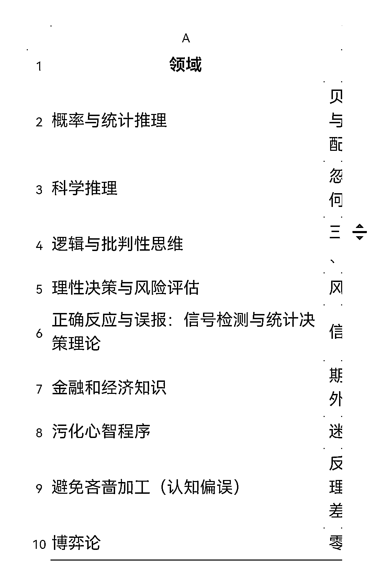

# 如何科学系统地提高认知

> 原文：[`www.yuque.com/for_lazy/thfiu8/ybfy5cpbw2dd1w7h`](https://www.yuque.com/for_lazy/thfiu8/ybfy5cpbw2dd1w7h)

## (53 赞)如何科学系统地提高认知 

作者： 老黄牛 

日期：2023-06-30 

《如何科学系统地提高认知》 ——如何利用知识更好实现目标 

“投资是认知的变现”大家都听过，我在投资领域多年的人，深感这句话的重要性，我也一直关注“提升认知”这个话题。 现在，终于有了“系统科学提高认知”的方向了，分享给大家。 

如何提高创业成功率，、提高投资收益，如何防被割韭菜，甚至找到一个好的生活伴侣的关键往往归结于一个单一的强大概念： "提高认知能力"。 

本文是教大家如何“科学变聪明”或“提高认知” 

最近两年，有两位大师非常科学地提出如何“提高认知”/“变聪明”。 一个史蒂芬平克（语言学家、认知科学家）。 另一个是心理学家斯坦诺维奇（Keith E. Stanovich）（研究领域是推理心理学和阅读心理学）。 

详情点击: [https://igk43cq0a6.feishu.cn/docx/FYXPdp8TqogPToxsOYbcmhmFnVb](https://igk43cq0a6.feishu.cn/docx/FYXPdp8TqogPToxsOYbcmhmFnVb)  

评论区： 

暂无评论