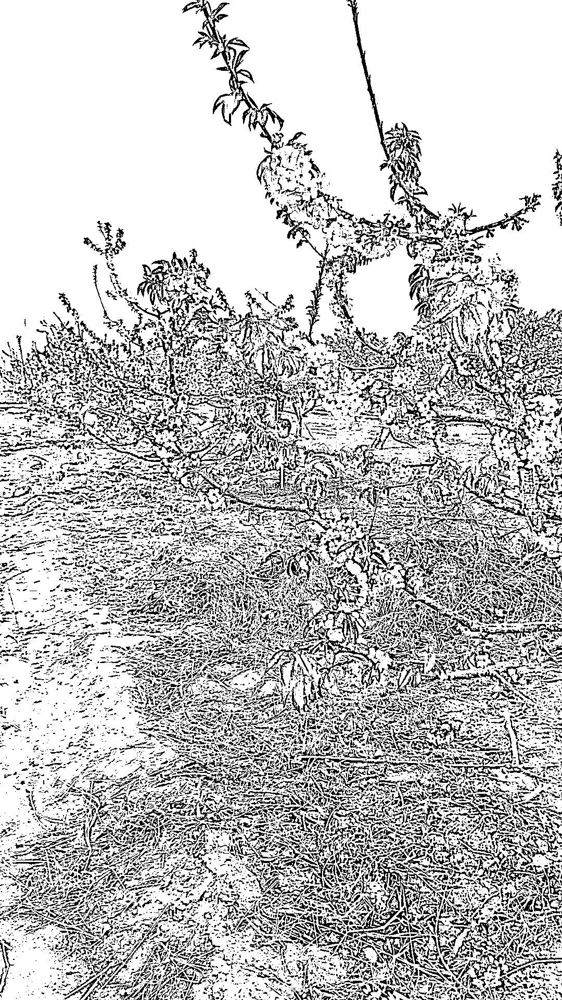
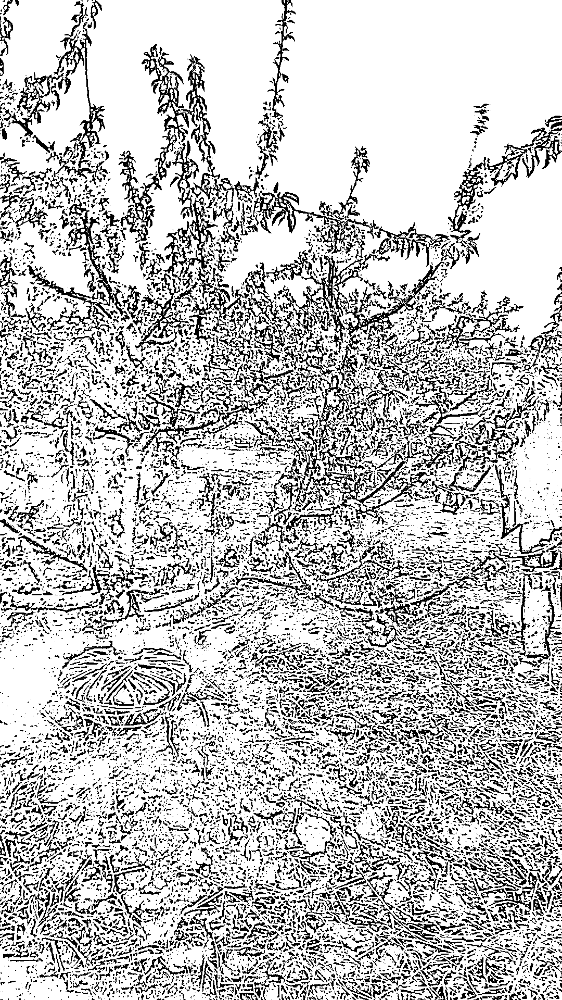
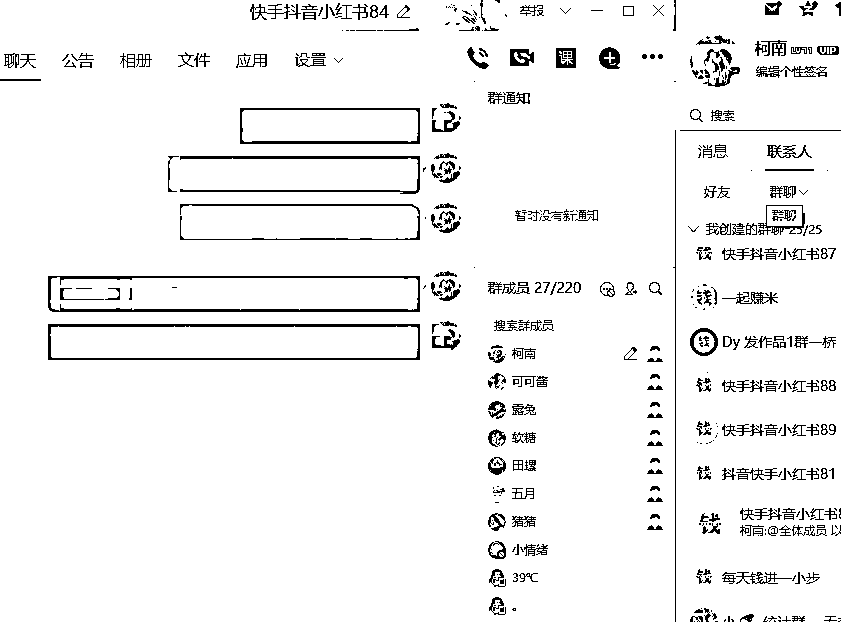
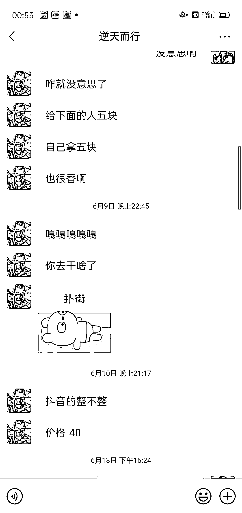
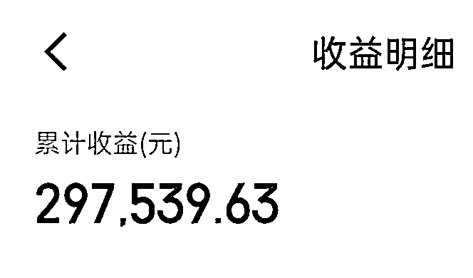
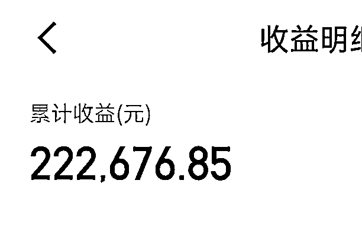
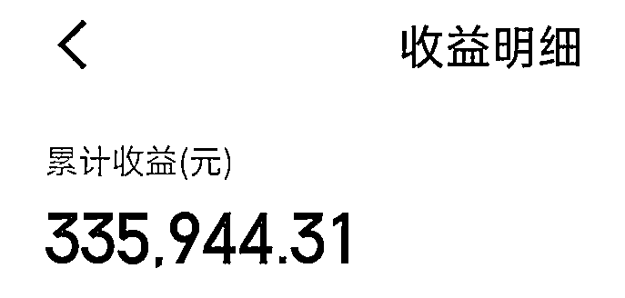

# 农村孩子创业之路的辛酸，结缘生财斩获 150 万

> 原文：[`www.yuque.com/for_lazy/thfiu8/vcmgoufcnc1w20r6`](https://www.yuque.com/for_lazy/thfiu8/vcmgoufcnc1w20r6)

## (138 赞)农村孩子创业之路的辛酸，结缘生财斩获 150 万 

作者： 唐杰 

日期：2023-06-27 

初次在生财分享稍微有点紧张，先来个自我介绍吧 

我是七期生财新人 

来自山东青岛农村孩子 

第一次创业收益 400 多万 

第二次创业负债 190 万 

第三次创业结缘生财，做兼职粉和快手 7 个月赚了 150 万 

# 一、时间回顾 

我是一个 93 年的农村孩子初中学历，没有什么技能，按照农村的风俗和家里长辈的建议，毕业后找个离家近点的地方上班或者种地，过几年娶个老婆生个孩子，这样的人生不是我想要的，父辈的面朝黄土背朝天的生活我看不到任何希望，我想走出去看看，我想找到自己的人生机遇。 

2009 年 10 月 20 号在家人极力不让我出门闯荡的情况下，我带着仅有的 213 块钱带着两套衣服，给妈妈写了一张留言纸条（当时真傻），踏上了离家 100 公里的青岛崂山区，虽然不远，但是一个 16 岁的孩子独自去一个无亲无故离家 100 公里的地方，对自己也是一种挑战，充满了不确定，陌生，害怕，唯独没感觉到孤独 

当天到了青岛汽车总站，第一感觉就是真好，大楼，汽车，这该死的陌生环境让自己膨胀了，感觉自己做什么都会比别人好，唯独就是自己穿的，跟这个城市格格不入，这时一个大姨和蔼可亲非常热情的问我要住店吗，问了下价格 8 块一天，一个月 200，我身上只有 183 了（坐车 30），讨价中大姨很痛快的答应了 150 一个月，先给钱，给完钱他说去车站里边上个厕所然后再带我去住店，还别让我乱跑，原地等她回来，等了一下午也没见到那个大姨，天真的我第一次被社会教训，带着仅剩 33 块钱在车站里边溜达，看到座位报纸上边有招聘信息，我掏出了我的诺基亚，了解沙子口木材厂的招工，赶紧坐公交兜兜转转 3 个小时，10 点多了找到了工厂，老板了解我之后，半夜给我安排了宿舍，一个月 600 元的薪资包吃住。 

# 二、人生转折 

一天休息来到李村，正好是李村大集，溜达中发现有卖苗木的，好奇心多呆了一会，正好看到上班的地方经常看到的住在附近大叔在卖果树苗，聊天中大叔知道我是平度的，于是给我了他的电话，建议让我回家的时候看一下我们老家苗木出地价格，我们老家很多果苗，经过深入了解这个行业水很深，一颗拇指粗的樱桃树苗他卖 15 元，回工厂的路上我马上打电话给我舅，因为我舅的村里全是种树苗的，问了樱桃树苗的价格，我再次确定后，我直接沉思到公交车终点站的声音，司机催促我下车的时候我那时候还是蒙的，惊喜、激动的心情久久不能平复 

请了一天假，回到老家，再次确定价格又去村里看他们收的价格，一公分樱桃树苗 2 块一颗，大叔卖 15 一颗，激动的心彻底不行了，抖着手打电话给那个大叔，手是抖的，声音也发颤，说了价格后，大叔说如果能倒腾，我给你 7 块，可以让我拉 100 颗送过去看看货，相差 5 元的差价有一点点担心，是真的吗？有这种好事？忍不住金钱诱惑 

钱不够，车没有，怎么办，钱就摆在这，一个想法，找，跟我姨家借车，是那种 3 个轮胎的，不是三轮摩托，一种带棚的农用三轮车，叫一个全家福蓝色五征车货车，总之不小，那年代这种车，一般家庭没有，正好冬天农活不忙，我姨夫来帮忙。车解决了，就是钱，跟我舅说了前因，我舅在村里联系了两家，卖我 100 颗，回来再给钱，谁知我舅传达有点错误，每家挖了 100 颗，一共 200 颗，挖都挖了，万一大叔不嫌乎那，装上吧，夜里跟我姨夫开着三轮车到了沙子口村口，到了地方凌晨 1 点多了，大叔知道我来夜里也没睡，电话指挥到他家，没想到的是大叔看了货全收了结账多给我 100 块，1500 块除去收的 400 成本油钱差不多也 100 多，纯赚近 1000 元，顶一个月工资还多，果断辞职，辞职后又后悔了，第二天回去是大雪季节，北方大雪封地，就是地都冻了，只能第二年地化冻才能出苗。 

这段时间我也没闲着，不断地去各大集市去转悠，联系集市上卖家，我给他们供货他们卖，本来是他们自己需要去农村找代办收购一颗最少加 1 块，加上时间，路费，运费等原因，樱桃苗 1 公分 6 元，3 公分 10 元，5-7 公分 20 元，10 公分以上 35 元，葡萄，桃子，苹果树苗等，基本上都愿意跟我合作，我有百分 60 多的利润，我让我舅收购，租半挂拉到崂山北宅，我姨夫再一家一家送货，整个链条打通，后边青岛大拆迁，都用大龄果树占地拿补贴，公路建设绿化，这个行业只有入冬和开春不到 3 个月的时间，树木冬眠的时候干活，到 17 年前前后后总共赚了 400 多万，17 年后青岛的待征土地基本没了，北宅等地区种植基本没空地了，完成人生第一个百万 

这样的樱桃树在地里收的 200 一颗，卖 6500 一颗 

  

学校绿化的工程 

  

# 三、二次创业 

苗木绿化，跪着要工程款，舔着脸求人，一年不如一年感觉生活无光，于是 17 年底再次创业“社区团购”我们叫互联网+社区购物，那时候还没有，多多买菜、美团等团购巨头，说干就干，搭建微信小程序叫超团团，组建推广团队，微信群每个市区，以超市为单位划分一个团购群，在老沧口设置仓库，基础建设齐活就开始推广 

刚开始做的时候很多超市老板对互联网接受度不高，不愿意建团购群，推广效率太慢。改变战略，社区推广，经过不断测试引流，商业模型，确定了最终运营方案，做到了 5100 多个微信群 120 多万的群用户，就在这时，橙心优选、多多、美团等大大小小的平台如雨后春笋崛地而起，当时建群的群主都是超市老板，加上补贴力度，价格战，被参透到渣都不剩，橙心优选倒闭的同年我也破产清算。 

# 四、一记耳光 

我没欠代理商一分钱，没欠员工一分钱，把网贷信用卡撸了一个遍，印象最深的是，给员工最后一次工资的时候，结算完了后，有 4 个老员工等其他人走后，又把工资给我了，这种事咱不能让，最后一起吃的饭，那一夜，三男两女喝的大醉怎么回到公寓的都不知道了，醒来感觉口袋鼓鼓的，伸手一掏，一股子钞票的味道，崩溃了，从记事起没哭过，可能积攒的太多了，鼻涕泡流到嘴里，感觉到齁咸，才知道自己的狼狈。 

那段时间，提不起精神，拿不定主意，心理的压力，信用卡的逾期，网贷的逾期，催收的电话，静不下心去做任何事情，尽一年没有回家了，妈妈给我打视频，看出我憔悴，我没说欠了一腚饥荒，看着母亲渐老的脸，愧疚用上心头，挂了电话，告诉自己，不能一直消沉下去，把斗志捡起来去跟社会摩擦。 

压抑得太久了，决定出去走走，把手机卡放到旧手机上，重新办理一张手机卡，踏上了去往拉萨的火车 

# 五、星星之火 

拉萨回来没有了以前的压抑，研究了一下，要想快速翻身只有互联网了，剩下的钱还有 6 千多，这就是启动资金，一定要精打细算，人算不如天算，看到一个抖音教带货的 3980，朋友圈包装的跟他干一个月能赚 100 万的感觉，对于一个互联网小白是如此的诱人，结果大家也能猜到，被割的只剩裤衩了，从此以后再也不相信什么所谓的大师。 

我就自己研究抖音同城，研究不明白我就去咸鱼买份相关的资料，商家让我好评送我资料，好吧，顺手的事，结果发给我一个生财有术的腾讯文档，好奇心驱使送的能有什么，看看吧，这一看不得了，什么淘宝，抖音，小红书，就像发什一片新大陆，看了一篇木易大哥写的绑着炸弹做淘宝，负债百万的逆袭之，还没看完感觉自己就开始分泌了，久久不能平静，互联网这道门能不能进去，生财和木易绝对是间接踹我一脚。 

连续看了几天腾讯文档的生财已经满足不了我，我就问了送我资料的那个人说收费 3980，又是一个 3980 直接劝退了我，发现有卖网页扫码盗版的，便宜的不得了，登陆了官网更不得了，直接打破认知。项目太多，无法给自己定位做什么的时候，发现一个风向标，有关小红书引流方面的，巧的是前段时间朋友圈有商家招快手代发视频 10 一个，我用我自己的号接了几单，感觉没啥问题，视频也没违法，如果我从小红薯引流 5 块让他们发，我就赚 5 块，一天 100 个人不就 500 块，对比起其他项目，短期内能解决基本的温饱，说干就干，确定了代发商家不限制代发量，我就开始引流，第一贴就 3000 个小眼睛，400 多评论，第一次做没接住流量，彻底浪费这些流量了， 

感觉行得通那就加号，匆忙办理几张手机卡，以前的几部旧手机倒腾出来，那时候不知道养号是什么，注册了号就发，流量都很好，大批评论的，手舞足蹈的私信引流，没私信几个就禁言了，几个号都这样，心一下子凉了半截，百度说小红书可以秒注销注册，试了一下还真是，发了流量也一样不错，立马搜生财引流方法，用群承接，第一天 3 个号引流到 QQ 群一百多个人，26 个做单的，赚了 130 元，这是破产后第一笔收益，非常激动 

第二天登录小红书引流一看，3 个号 2 个号封禁，这开始慌了，尝试着再次注销注册，害怕发帖没流量，神奇的是流量还是一样的好，就这样，发完一贴评论区挂上群链接，公告上挂着 qq 群自动引流，等 5.6 个小时小眼睛到了 2000 多不动了，我就再注销注册，流量一直没影响，晚上跟商家结算 98 个人做单，商家给我 500，信心有了，拿着两天的收益去信息城买了 3 部 oppor11 手机，引流效果出起得好，后边发现快手也能引兼职，对号要求更低，引流比小红书更猛，直接双管齐下不断放大，短短 2 个月赚了 48 万，最多一天佣金 1 万多，好景不长，商家临时调整，不用我了，手里有兼职粉也寻找了其他变现渠道，感觉这个很难做大，看到了天花板。 

这是其中的一个 qq，每个 qq 只建 25 个群，到现在有的兼职群还在零散的进人 

  

  

商家这个月还找我接单，因为这个微信不怎么用，回复他总是断断续续的 

  

# 六、结缘生财 

经过深思熟虑决定换个领域，一个多月的时间，在视频号、小红书，咸鱼，抖音，公众号，推文，短剧这些项目上都拿到了小结果，项目越操作越多，看到圈友每分享一个新项目新玩法第一时间先去研究，人确越来越迷茫，紧急按下暂停键，让自己静下来分析一下自身的能力和互联网的项目趋势，4 天时间把生财近一年的文章翻了一遍，发现近一年比较火的项目抖音、小红书、视频号、gpt、快手、ai、tk、淘宝、咸鱼、无人直播、淘宝客 

发现大部分能产生高收益主要在短视频平台上 

整理如下： 

1.  平台：抖音、视频号、小红书、快手 

2.  类型：图文、视频、直播 

3.  收益：店铺、引流、带货、商单（我把抖音风车、快手磁力、第三方链接统一划到商单里了） 

确定了两个项目测试 

1.  抖音图文带货 

2.  快手视频+直播商单 

自己分析如下： 

1.  抖音是短视频日活用户最大的平台，扶持图文 

2.  快手属于下沉同行竞争较小，搬运比较友好，无人直播风险小，最重要的一点，作为短视频鼻祖，瘦死的骆驼比马大， 

3.  视频号虽然是潜在用户基数最大的平台，但是机制尚未明确，对于新人赚大钱运气因素太多 

# 七、接近上岸 

方向确定好了，刚要是开始进行我阳了，我以为几天就好了，结果阳过一个多月，一直头晕，那种晕直接看不了手机跟电脑，看几分钟就晕的不行了，检查也没什么事，没办法，正好春节了，调整一下休息规律锻炼身体，没事时候看下生财。 

在生财又又发现一个风向标，激发出一个快手新玩法的灵感，身体恢复的差不多了，研究几天确定下玩法，年初三起号测试，生财在快手方面的知识不是很多，操作起来有点费劲，经过长达 2 个多月的不断优化，不断打磨，就在正式加入生财的那天，快手收益数据正式爆发，到目前为止 4 个号，3 个多月共纯收益超过 100 多万， 

  

抖音图文赛道也迎来百万播放热门 

  

# 八、你好圈友 

精华贴很好的补充自己的互联网知识盲区，风向标藏着很多赚大钱的机遇，每诞生一个中标都有一定赚钱的链条，对于有用的的人，这个价值无法估计，很佩服亦仁大哥的互联网的嗅觉。 

决定深耕的项目不要随便更换，先给自己 2 个月的时间，只要执行力没问题，赛道没问题，出结果是早晚的事 

三不要 

1.  不要盲目跟风，龙卷风永远没有微风长久 

2.  不要只想不做，纸上谈兵永远是假设 

3.  不要项目还没开始就买很多设备，这种一般都做不起来 

三必须 

1.  必须了解这个项目的底层逻辑，平台逻辑 

2.  必须让自己坚定下来持续深耕一个项目 

3.  必须不断的优化，不断的超越 

我是唐杰，90 后创业者 

初中文化，文章杂乱请圈友多多包涵 

祝 23 年圈友人手过百万，加油圈友们 

评论区： 

静明 : 强，都是青岛老乡，交个朋友 请叫我孙先森 : 青岛老乡，加油💪 书豪 : 牛 书情小跟班 : 强，围观下朋友圈 Ray♻️💥 : 快手的下次可以详细讲讲，生财确实内容少点 早晚 : 强，同求围观朋友圈[害羞] 骏马 : 牛掰 小凯 : 强，围观下朋友圈