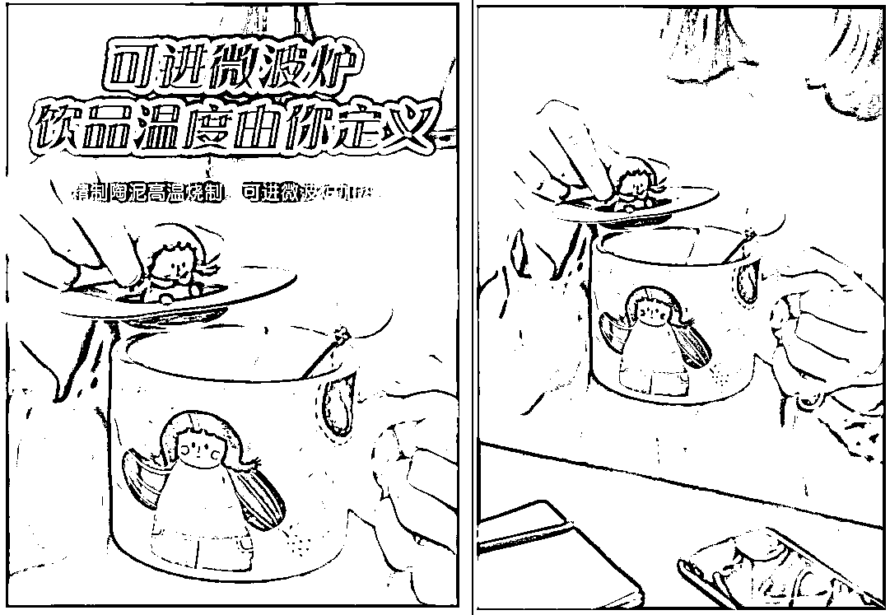
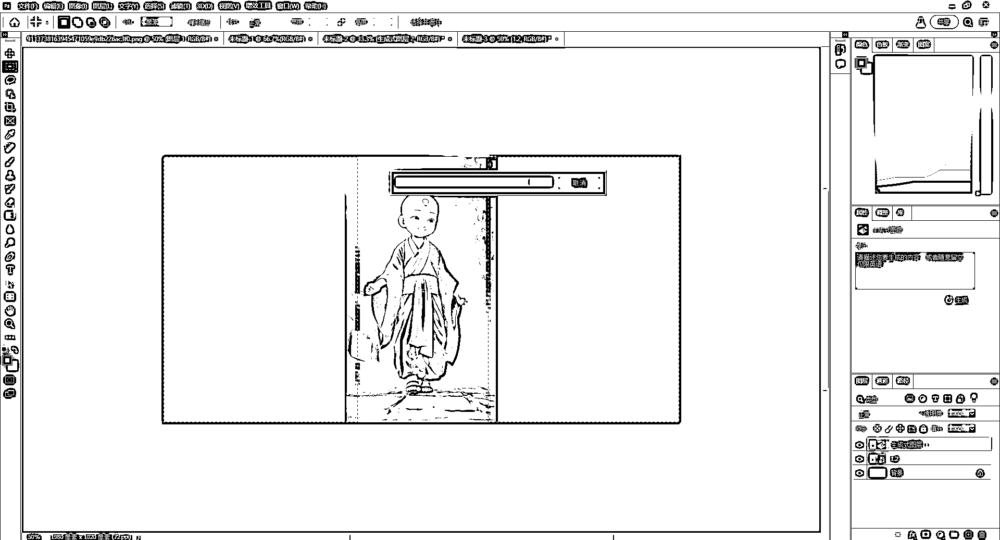
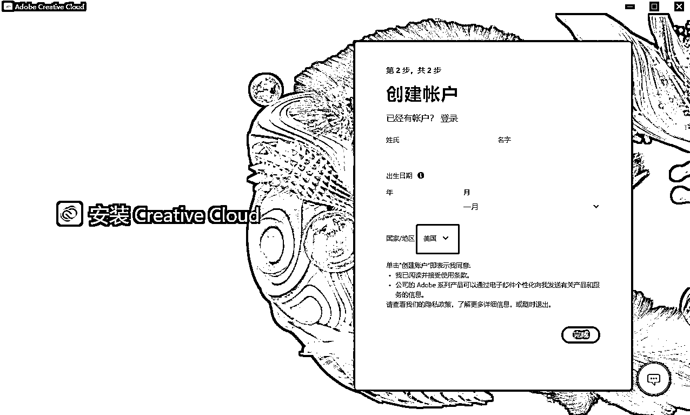
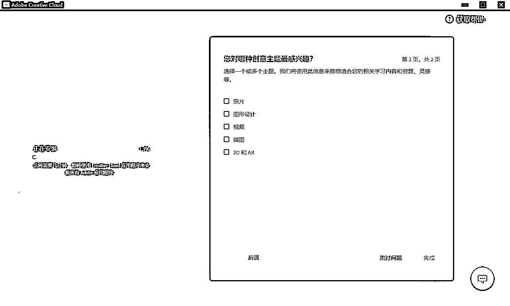
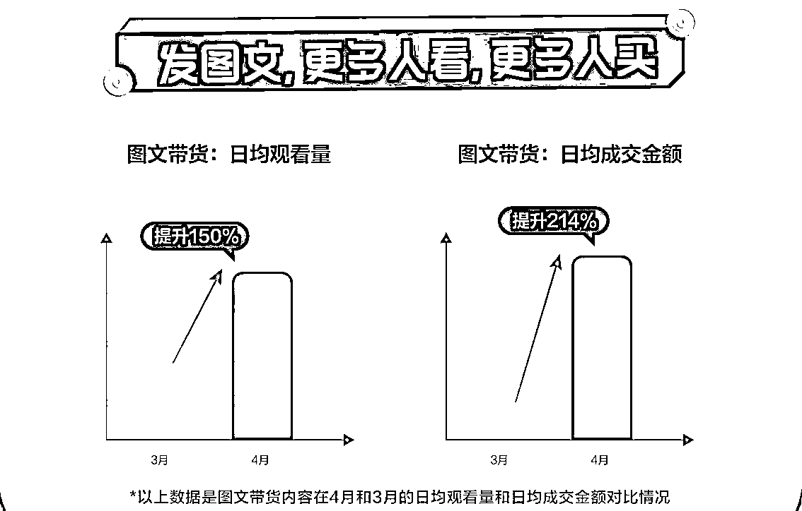
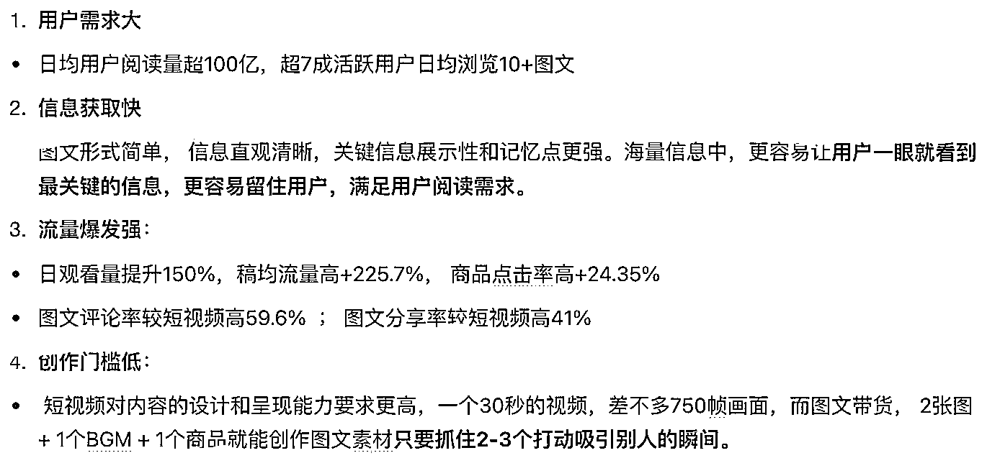

# PS2023beta 版的 Ai 创成式填充应用实例分享

> 原文：[`www.yuque.com/for_lazy/thfiu8/wxvzca3dv95kb59k`](https://www.yuque.com/for_lazy/thfiu8/wxvzca3dv95kb59k)

## (43 赞)PS2023beta 版的 Ai 创成式填充应用实例分享 

作者： 李谢谢 

日期：2023-06-26 

大家好，我是李谢谢，今天来和大家分享最近收获非常多的 PS+Ai 

PS+Ai 的这个组合真的超乎我的想象，可能有很多人对 PS 的印象都是专业难懂的工具，各种细节化的参数等等，但是今天要分享的东西小白也可以放心观看不用担心看不懂，相信看过以后一定会对自己现在的工作有很大的帮助 

一，什么是 PSbeta 版的 Ai 创成式填充？ 

（1）简要介绍 PSbeta 版及其 AI 功能 

PSbeta 版是 Adobe 公司开发的图像编辑和设计软件，旨在提供创意工具和功能，PSbeta 版的 AI 功能整合了人工智能技术，为用户提供更强大的创意填充和设计支持。（来源 chatGPT） 

（2）什么是创成式填充？ 

创成式填充应用是指利用人工智能技术，自动生成和填充创意元素、设计要素或艺术灵感的工具。 

它能够通过分析大量的图像、数据和模式，为用户提供创意灵感、图案生成和设计建议，AI 技术能够处理复杂的图像识别、模式生成和语义理解，从而提供更多元化和创新的创成式填充，在电商领域，创成式填充应用可以帮助电商平台生成吸引人的产品展示图、广告宣传素材和界面设计，在日常工作中，创成式填充应用可以为设计师、营销人员和创作者提供灵感和快速设计支持，节省时间和精力。（来源 chatGPT） 

（3）创成式填充的操作路径 

打开 PS，进入图像编辑页面，用选取框选取需要生成位置，可以输入或者不输入提示词，进行创成式填充 

Adobe 官方的宣传视频：https://www.adobe.com/products/photoshop/generative-fill.html#watch-video 

二 , 实例应用分享 

（1）：创成式填充+电商应用 

  

在开始这个案例之前，大家先看一下，左右两张图那个是原创？ 

是不是很明显左边的这张图截取了右边这张图的中间位置，然后添加了字体，成为了电商主图？ 

直接揭晓答案是：不是，左边这张才是原创，是我在淘宝找的一个卖杯子的图片 

这个功能最吸引的我一点就是可以进行很写实的二创，甚至在某种程度你可以成为原创，在做电商的玩家，无论什么淘宝的主图，别人拍的产品图，你随时都可以通过 PS 的创意填充达到原创的效果，别说平台的机器审核，今天就是人工在面前审核，也很难说清谁是原创 

抖音上面有很多图文你刷到的时候已经爆了，即使你换个方式，还用这个品可能也不会爆，你想用他这个图再发一次，你就觉得这个图一定会爆，但是会面临平台审核，这个时候你就可以采用这个办法 

  

  

只要你的电脑配置 OK，一个小白他可以轻松上手并且帮助你批量做任何产品图，如果你觉得还是不太好，你给他重新换个头或者换个背景问题也是不大的 

比如这是坤哥抖音男装的一个没头像的透明图 

  

  

  

当然你的生成效果也是和提示词有很密切的关系，这个在玩 chatGPT 和 Mj 的人相信都不陌生，肯定是从鼻子到眼镜描述的越详细，生成最后的效果你是越满意的，但是我觉得人像的凭空生成还是有很大的缺陷以及细节上面的瑕疵，这点的话大家都可以多多尝试 

还有就是尽量不要透明图操作，有个背景比较好 

（2）：创成式填充+Midjourney 

  

  

有很多人在玩 MJ 的时候其实面临很多细节上面的修改，比如手的不完美，或者这个图片我觉得还可以，但是某一个地方不好，我需要做修改，在修改提示词等出图就比较麻烦，那这个时候就可以用 PS 的创意填充进行修改，比如上图手的位置有问题就可以进行细节上面的调整，或者有些地方不想要都是可以进行修改的 

（3）：创成式填充+固定机位视频比例修改 

  

就是有很多人可能感觉拍的比如说 9：16 或者 16：9 比例不是很满意，那这个时候你可能在重新拍太费时间了，我们可以通过 AI 创意填充去生成周围的这个图片从而达到这个效果，但是这里大家需要注意一下，图片四周都是静止的才可以生成哦，如果四周有动像的话会导致错位，这个局限性是比较高的 

比如这种视频我想给它改成横屏就可以两边生成图像，生成了以后导入到剪映或者 PR 做个背景就好了 

  

  

三 , PS2023beta 下载安装注册 

（1）安装：Adobe Creative Cloud 

官方网站：[https://www.adobe.com/cn/lead/creativecloud/business.html](https://www.adobe.com/cn/lead/creativecloud/business.html) 

点进网址以后，选择立即试用，就会自动下载了 

（2）注册账户 

  

  

这里我用的是域名邮箱 

  

这个地方一定要注意一下地区是必须要选择 美国 的，否则的后面是没有测试这个版本的 

  

这里的要选择取消 

  

  

当你安装好了以后，左边出现 beta 应用程序以及有这个 Photoshop（beta）试用就可以了 

试用的时间只有 7 天，如果装爱国版的话，在 PS 装好了以后，下面这个软件点击 search 

百度网盘链接：[https://pan.baidu.com/s/1RorYWCHUkBWJLFB8niKU4A?pwd=bl86](https://pan.baidu.com/s/1RorYWCHUkBWJLFB8niKU4A?pwd=bl86) 

提取码：bl86 

Q＆A 

Q：为什么点击创成式填充一直都会出现正值高峰耐心等待？ 

A：生成的时候是需要科学上网的，并且在打开 PS 之前就需要把科学上网打开 

Q：确定没问题都安装好了，发现创意生成这个按钮还是灰色 

A：点击帮助登录自己的账户就行了 

Q：安装好了以后发现怎么都打不开 

A：win10 的系统才可以，我本来是 win10 的企业版发现不行，后来刷到了 win10 的专业版可以了 

四 , 补充 

这种 Ai 生成完全可以天天找个第三方数据软件跟别人的图文爆款 

做电商很多的地方都是需要图片的，像商品大图，做小红书，做抖音图文等等，重要性就不多说了 

直客告诉我：千川在内测图文投放 （图文是这个真图文） 

确实图文会更容易上手一些，成本相对短视频也更低一些，不用到处找拍摄剪辑，自己可以第一时间就开始做了，图文爆了以后可以接直播，现在也可以投放千川了，所以还是很值得尝试的 

目前的话如果你直接投会显示低效素材，需要联系直客报名，没有条件的也可以先布局，相信后面都会开放的 

本文的话到这里就结束了，希望能帮助到你，各位要是有问题也欢迎留言~ 

  

  

评论区： 

淇方 : 大佬，请问对电脑配置有啥要求没 李谢谢 : 我的显卡是 1060 用起来还行 如意郎君 : 谢谢，分享，写的灰常详细。我的效率又要提升了。[呲牙] 一时 : 刷系统的意思是重装系统吗 ✨🍒恋小呆🍒✨ : 及时雨 Kyo" : 请问出现试用过期还有救吗。已经卸载过重新装过重新申请的账号。一来还是提示试用过期，打开很快就被秒关。 李谢谢 : 换个邮箱重新装就好了 李谢谢 : 是的