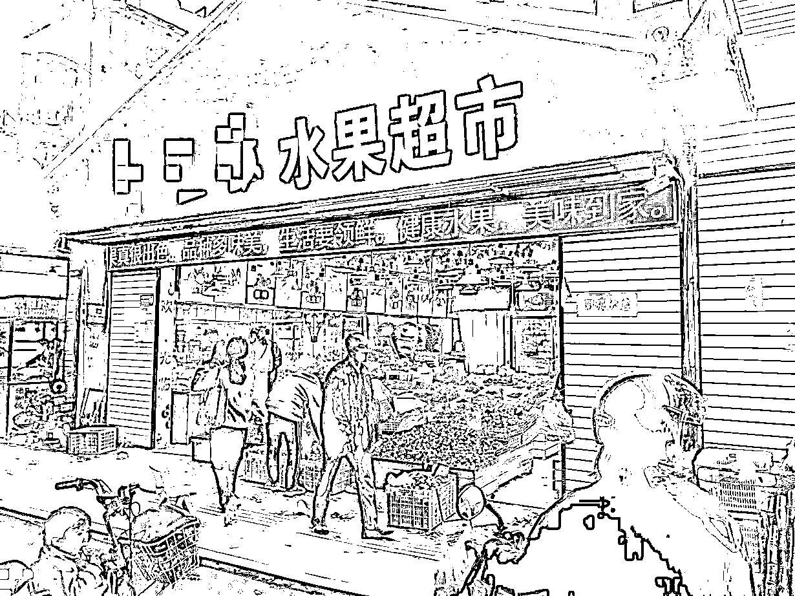
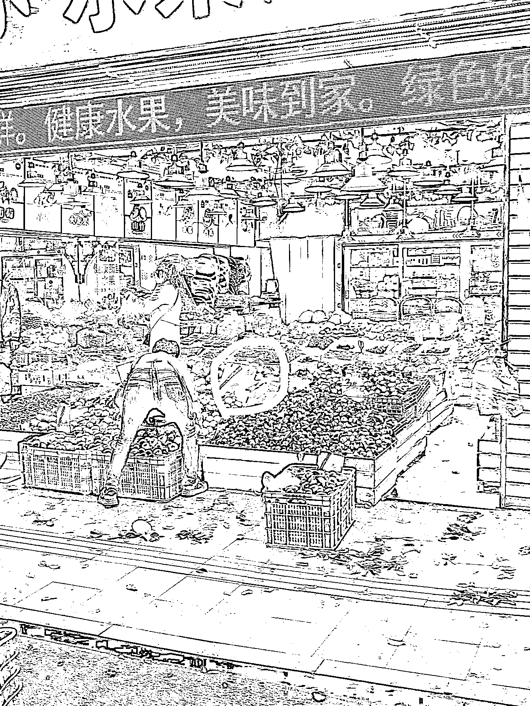
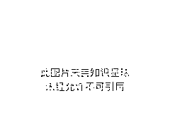

# 同样的经营方式的两家店，为何一家生意爆火，一家冷冷清清？

> 原文：[`www.yuque.com/for_lazy/thfiu8/xb7m10cdpti774np`](https://www.yuque.com/for_lazy/thfiu8/xb7m10cdpti774np)

## (100 赞)同样的经营方式的两家店，为何一家生意爆火，一家冷冷清清？ 

作者： 奋斗的木鱼 

日期：2023-06-30 

偶然的一天，在回程路上，经过了一条城中村，村内路边有两家水果店，粗略看过去，发现一家生意火爆，而另外一家生意冷冷清清，路过的我，看了一会，疑惑不解，因为两家采用的引流方式都一样的，为什么一家生意火爆，另外一家生意冷清呢？ 

面对着情况，我被吸引了，直接在蹲在对面观察两家门店经营情况，，看了许久后再走进他们各自经营的门店。 

经过蹲守观看与入内观察，发现了他们各自经营的方法，今天在这里给大伙分享分享。 

以下用英文字母 A 代表冷清的店，英文字母 B 店代表客流旺盛的店。 

 

图 1  

 

图 2 

从图 1、2 我们可以看出。 

A 店（图 1）门店面积比 B 店要小一点，虽然同样的街道位置，但是由于门店位置大，在视觉上更容易吸引到客户的注意，而且，大的门店反而能显现自己更强的实力，双重影响下，B 店吸引度比 A 要大。 

门店大是一回事，为什么同样的策略，形成的结果不同呢？ 

 

图 3 

 

图 4 

我们可以从图 3、4 可以看出，彼此都是使用了超低价的皇帝柑引流客户（1 元 1 斤），照理 A 店的生意不会差过 B 店那么多呀？ 

因为 B 店做了 3 个动作，让同样的手段，却形成了不同效果。 

1.卖货就要大声喊 

在推销自己产品时，B 店采用了超大的喇叭，不循环断播放着语言：“来来来，新鲜水果，1 元 1 斤，超级甜，包产包销的，不甜不要钱嘞”，让经过的客户首先注意到他。 

2.货物堆山 

我们可以看 AB 两点引流产品来看，哪个吸引力更大？ 

毫无疑问是 B 的货物，因为它打造了一个强烈吸引点，将货物堆放的满满的。 

这里还隐藏一个小细节，货物堆山后，客户拣货时会更自在舒服。 

我们将视线转到 A 店，我们可以看到在 A 店购物时，拣货需要弯腰，这个动作加大了客户身体的负担，让客户选购时产生了不舒适的感觉，如果是穿裙子的女孩，我相信基本不愿意到 A 店去购物，因为这个动作让穿裙子的女孩很不雅。 

3.免费试吃 

在 B 店，价格牌上挂着免费试吃，而且店员和大喇叭也会不断重复“免费试吃，甜了再买”。在这些试吃的引导下，让客户放下戒备，大胆尝试。而试吃又是一个提高转化的利器，因此进一步推动了客户的选择在 B 店购买。 

面对这些手段，A 店做了什么回应吗？ 

也有的，A 店后面使用了人力播报+降价促销。利用店员口头叫卖，还将皇帝柑降到了 1 元 2 斤，可惜，即使人力播报+降价的手段，依然没有为门店带来客流的提升。 

在这里，我们可以看到，越是多人的门店，越能形成了更强的竞争力，即使你使用自损八百的手段，都做不到杀敌一人。 

那同地段的门店，是否因为以上的这些手段，AB 两店就拉开了这么大的差距呢？ 

当然不是，还有他们内在经营方法的不同，在这，我继续为大伙讲讲 B 店内在的经营手段。 

 

图 5 

 

图 6 

1.价格写大大 

大伙可能被我这个标题逗乐，价格写大大（图 5）也是经营手段之一？ 

是的，我们站在门口代入客户视角看看，当我们在门口处选择商品（皇帝柑）时，我们会不会往店内瞅一眼？ 

瞅一眼，就为我们带来了商机，我们要在这一眼里告知客户其它水果的价格，让客户一眼就能了解到是否符合自己消费。 

因此，大大的价格牌，让站在门口的客户，能一眼看到水果售价，从而降低了他需要进店才能了解。而且，大大的价格牌，让路过的客户也能一眼了解，帮助客户有效的决策。 

还有，我观察到一些老人进店时，都不需要走近相应水果区就能看清价格，而在 A 店，某些产品我需要靠近蹲下才能看清价格。 

你看，价格写大大的好处，是否意想不到呢？ 

2.灯光柔和度 

这点是我最强烈的感受，我走进 B 店时，是没有感觉到灯光的刺激的，甚至没有意识到灯光的重要性。但我走进 A 店时，A 店灯光强烈的刺激着我的眼睛，让我感觉到极差的体验，或许是我个人光源的敏感，但 A 店的灯光，是我所遇到的水果店里最难受的灯光。 

3.提高客户信任的口号 

在 B 店里，他的收银台和门头都会大大的标注一句话“足斤足两，少一两补十斤”(图 6)。 

这句简单的口号带来的确实不简单的力量。 

在这个城中村里，价格是极其重要的因素，其次就是缺斤少两，因为这里聚集了大量务工人员，平常节省惯了，花钱买水果那是为了犒赏一下自己，面对不熟悉的门店，而且超低价格的水果，内心难免会嘀咕，但是店家如果大张旗鼓的告诉客户“缺斤少两就赔偿”，那购买的时候就会更放心，自然也更愿意购买。 

我们回看 A 店，B 店经营的方式，表面上 AB 两店内的经营方式雷同，实际上 AB 两店在经营细节上的处理相差甚远。难怪相同的位置，相同的引流手段，为什么 B 店人头涌动，而 A 店冷冷清清。 

这两家店也告诉了我，在经营细节处下功夫，经营的效果是天差地别。 

评论区： 

昊东.Lee : 足金足两，少一两补十斤，转化了不少新用户，再加上水果这种谁卖的快，谁家就越新鲜，越新鲜就更吸引客户购买，买的人多了，进货的量就大，进货量大进价就越便宜，就能与进货商建立关系，其他货也容易拿到低价，这样就有更多利润。 周宇 : 用户思维，方便客户就是方便自己 奋斗的木鱼 : 👍 奋斗的木鱼 : 是的 南意 : 同样是实体人，B 店的换位思考和细节确实做的很棒 徐铭悦 : 真的是，以前没注意过的细节 奋斗的木鱼 : 经营看细节 奋斗的木鱼 : 😄