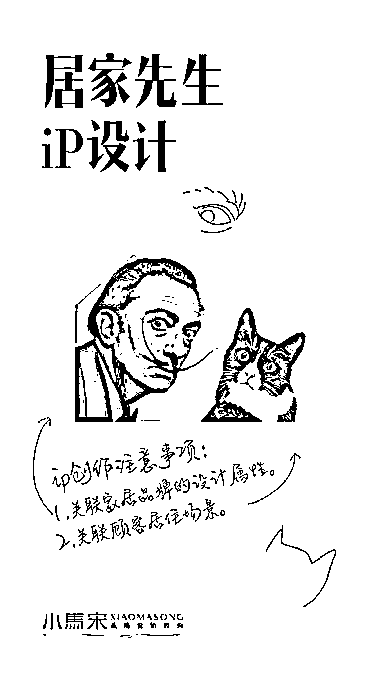
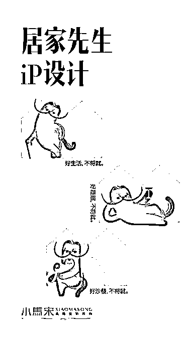

# 商业应用的 IP 设计有几个原则

> 原文：[`www.yuque.com/for_lazy/thfiu8/ngoegz9rtbkgvp7z`](https://www.yuque.com/for_lazy/thfiu8/ngoegz9rtbkgvp7z)

## (52 赞)商业应用的 IP 设计有几个原则 

作者： 小马宋 

日期：2023-07-28 

商业应用的 IP 设计有几个原则： 

1、有原型，顾客看起来要有熟悉感 2、独特性，要与其他品牌 IP 有区别 3、关联性，要与品牌的产品有关联 

因为居家先生的产品是家居，所以我们选择了家居生活中最熟悉的一个动物“猫”作为原型设计。 

如何增加独特性？因为居家先生是一个设计品牌，具有很高的审美风格，我们把艺术家达利的形象与猫结合，于是就创造了独特的 IP“达利猫”。 

而且猫的耳朵也与居家先生的“家 logo”有关联。 

 

  

 

 

 

 

 

 

评论区： 

Tina｜禹萱 : 感谢🙏分享 

 