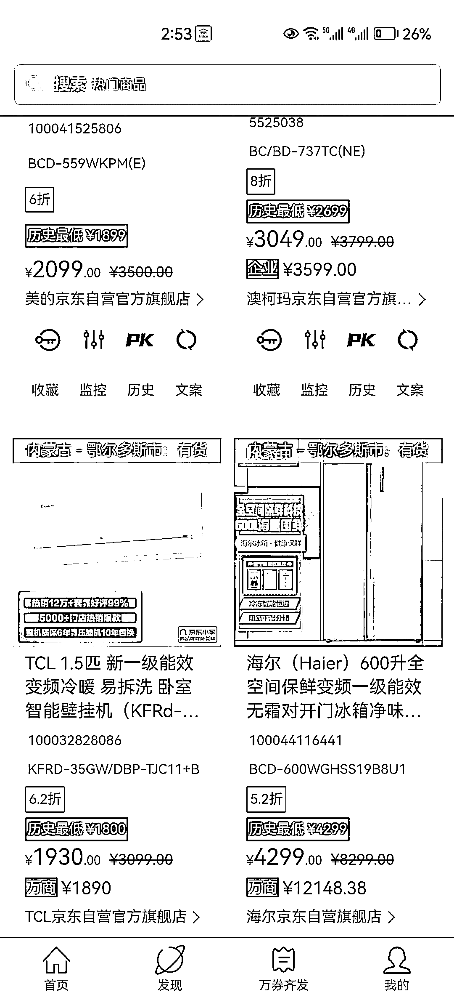
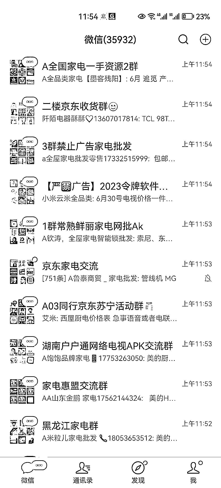

# 如何通过家政店群+京东家电代下+除甲醛的项目组合赚到人生第一个 100w

> 原文：[`www.yuque.com/for_lazy/thfiu8/itllgxsbglnhaona`](https://www.yuque.com/for_lazy/thfiu8/itllgxsbglnhaona)

## (45 赞)如何通过家政店群+京东家电代下+除甲醛的项目组合赚到人生第一个 100w 

作者： 三俗 

日期：2023-07-26 

小白如何通过家政店群+京东家电代下+除甲醛的项目组合赚到人生第一个 100w 

最初通过美团家政店群一年赚了 30w，在做的过程中微信好友也在不断的增加，就想着除了家政复购还有哪些项目能进行二次变现，其中很多都是刚装修完新家的客户，那这部分用户的购买力是十分强劲的，粗略算一下 100 平的用户家政服务从中能抽取 150 左右的中介费，家电一台按平均 200 的抽成，油烟机，冰箱，电视，空调，热水器等一系列家电只要用户通过我们成交第一台家电，那么接下来他需要购买的家电也很大可能是通过我们购买的，因为要比京东官网便宜 3-8 折，解决了信任问题是很容易成交的，后续跟进推销除甲醛业务就能通过一个用户赚到 1000-5000 的利润。 

具体操作，还请移步飞书 

[https://se2oqury81.feishu.cn/docx/VubWdxEcpoHbiCxdkH3cw6j9nne?from=from_copylink](https://se2oqury81.feishu.cn/docx/VubWdxEcpoHbiCxdkH3cw6j9nne?from=from_copylink) 

 

 

 

评论区： 

平凡小吴 : 圈友，链接没开权限 芷蓝 : 刚给我的舞蹈室除完甲醛 三俗 : 那应该花了不少钱吧[偷笑][偷笑] 胖大魔 : 除甲醛是伪概念吧 三俗 : 存在即合理哈 胖大魔 : [奸笑] 帅彬 : 营业执照是网上代办嘛还是自己找租房合同去工商局办理呢 三俗 : 异地的没地址只能是找代办 

  