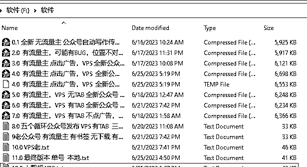

# 公众号爆文项目：批量公众号自动化发布文章和生成草稿 流程分享

> 原文：[`www.yuque.com/for_lazy/thfiu8/oba1iagn0fi7x0bi`](https://www.yuque.com/for_lazy/thfiu8/oba1iagn0fi7x0bi)

## (104 赞)公众号爆文项目：批量公众号自动化发布文章和生成草稿 流程分享 

作者： 良辰美 

日期：2023-07-20 

# 前言，分享背景 

最近公众号爆文吃流量主的项目如火如荼，不知道有多少圈友下场？ 

我没报名这个航海项目，但看星球里好多这方面的文章，尤其是[亦仁给这条风向标加精](http://%20https://wx.zsxq.com/dweb2/index/topic_detail/181154582542122)之后，这个项目就更加火爆了。 

 

我当时看到这条帖子，第一反应就是，批量，矩阵，自动化，这几个关键词。 

所以当天上午就把 RPA 自动化跑公众号的流程搞完了，接下来就是找人合作拿号，然后再慢慢优化流程，包括增加 SD 批量出图和 GPT 自动化写文章。 

最后找了个圈友号商合作，个把月下来都是跑美女图文项目，废了几个号，收益不算高，今晚突然说没资料了，流量主收益全部都提不出来了... 

（具体细节不多说，问了也暂不回答，大环境封控原因） 

本来想着项目搞到月入十万，再分享一波这个流程的，现在感觉今天就可以拿出来了。 

# 公众号自动化流程是怎么实现的 

先说脚本，用的是 UIBOT，前后优化了好几个版本，好处是不同电脑之间可以直接复制代码，免费版本的就可以直接上，坏处是不如影刀的识别性准确率高，当然还有方便易用性等等。 

脚本可以设置成一个号不停得保存草稿，也可以一台电脑每天定时循环五个号创作草稿后点击发布。 

就是公众号发布有个问题，得管理员扫码，当然这个可以在安全中心里面吗关闭。 

那还有个问题，是一个号的登录缓存只能保持三天，那每周还是得扫码登录两三次。 

至于一个电脑怎么同时登录多个号？用 sessionbox 插件。最多可以登录多少个号？仁者见仁智者见智，建议五个左右，其实有人觉得超过十个也没关系。 

 

链接：https://pan.baidu.com/s/1VGyuAgEC5wKogMNqjItLMg?pwd=tfay 

提取码：tfay 这个是截图里面全部版本的脚本代码了，但是不一定适配你的电脑，大概率是要调试的。 

这里脚本的实现逻辑是，提前准备好图片和文章素材，文案统一格式放到表格当中，然后就完成标题撰写，一张图+一段话循环复制粘贴，再完成原创作者和标签话题填写，最后保存就行。一次群发想弄几篇文章，就循环几次即可，当然每个循环也要有所变动。 

以上这段话看起来简单，但真正去做起来，就需要各种各样的调试了，确实超级麻烦，可以这么说，就算我把代码给你，不懂的可能压根不知道怎么用，知道 UIBOT 的也得调试半天。 

所以这里我也把录制的视频一并放上来，是之前给一个付费圈友远程讲解的，中间也是经过了无数次沟通。 

 

链接：https://pan.baidu.com/s/1gYuEPbdOaC-XOXn8pXJceQ?pwd=5rju 

提取码：5rju  这个是上面截图的视频教程，不保证你能看懂，但是想学的话，估计能看个大概，有这套代码，搭配视频，稍微研究下，应该就知道怎么用怎么修改了。 

如果你自学性强，估计不看这些也能自己研究出来；如果你看着代码就头皮发麻，那可能看了这些视频也搞不懂。我是自己瞎鼓捣的，需要用到什么，就去自行研究。 

以上这套代码，是美女图文项目的，说白了就是一段话一张图那种类型的，如果你想要精细化的排版，或者只需要一张图，那都是可以修改的。 

我目前的做法是，一个号批量保存草稿，一天 24 小时不停创建，保证图片和文章素材足够用，差不多攒了两三百篇草稿... 然后手机端就每天发一次就可以了。 

如果想要精细化操作，那么从出图和写稿到排版都可以去进行优化，只是代码固定好后，不轻易乱搞，会知道怎么用，那就不怎么耗时间了。 

# 图片和文章素材怎么批量自动化生成 

美女图，甚至任何类型的图片，基本都可以用 MIDJOURNEY 生成，只不过这个是用按月付费的平台。 

如果自己电脑配置比较高，且是 N 卡，那就可以自行下载安装 Stable Disfusion 这块软件，然后网上下载美女模型，再搭配 RPA 就可以免费 24 小时不间断出图了。 

我电脑配置都比较低，也都是 INTERL 的显卡，所以就找朋友借了个 6T 的电脑和 64G 运行内存的 N 卡超高配电脑去跑，基本上一秒钟一张图，搞几千张图很快的。 

在此感谢@吴东子手把手的教程，[《耗时 80 小时！超详细的胎教级 Stable Diffusion 使用教程，看这一篇就够！》](https://wx.zsxq.com/mweb/views/topicdetail/topicdetail.html?topic_id=181484882125482) 

如果你不懂 RPA，只需要知道固定鼠标位置，每隔 5 分钟点击一次，这个原理就行。 

如果你懂 RPA，那么可以做的事情就非常多啦，改变关键词，调整参数，等等全部都可以自动化操作。 

至于文章，要求不高，那就一个 PROMPT，让 CHATGPT 反复生成就行，顶多是改变一下个别关键词。 

如果要求很高，则需要完善一套 GPT4 的写稿流程，然后用 RPA 把人工操作给固定下来。 

如果是洗稿的话，那还得先去抓取文章： 

1\. 关键词下面的十万加爆款，各种公众号的都有； 

2\. 关键词下面的最新文章，各个公众号的都要； 

3\. 固定一个博主的所有文章，这个就有很多工具了。 

RPA 都可以解决这三个，目前我是做了前面两个脚本。 

 

截图里可以看出，我还有批量登录公众号的流程，所以说学会 RPA 很方便，门槛很低的指哪打哪的机器人。 

链接：https://pan.baidu.com/s/1kLMy1vARTclWJKgQ0YKuBg?pwd=p8ks 

提取码：p8ks 这个是上面所有代码的合集，我正在用的代码，但是具体怎么用，可能你要研究一下，或者评论区问下我。 

用 RPA 的一个坏处是，鼠标和键盘都被机器人占据了，所以这个时候用 VPS 就显得很有帮助了，本地电脑可以正常操作，且同时可以连接非常多 VPS。 

但是一个 VPS 就跑一个 RPA 脚本就显得浪费了，尤其是只针对 GPT 批量自动化写作，所以我后来买了个码叔的 GPTPLUS 插件，用得很方便，就是要保持页面不能刷新和浏览器卡死。 

 

[https://fnkip.xet.tech/s/1ygto4](https://fnkip.xet.tech/s/1ygto4) 这里是直达链接，他那有非常详细的操作手册。 

# 最后的话，矩阵之前，先搞 SOP 

我其实还在研究洗稿的自动化流程，但是太忙一直搁置。 

公众号自动化流程不难，难得是对领域内爆文的把握和判断。 

小女子教练纯手动写文，一年也能收入百万。 

总结下这个项目，要有明确的赚钱 SOP，不断复盘总结爆文的特点，优化自己的操作，前面我大部分时间都投入到脚本开发和优化上了，看似花了很多精力，但真正可以赚钱的地方不多。 

文章的流量主收益曝光低且需要日更搬砖，搭配小程序和社群做留存和反复触达，才算是管道性的被动收益。 

参考程序员田同学的[三年探索，我通过流量主每月被动收入超 5w，历程分享](https://wx.zsxq.com/dweb2/index/topic_detail/181148842244512) 

圈内挺多人做这方面培训的，貌似也有自动化的脚本，应该也是 RPA 居多。 

另外看到祥叔的[《YouTube 名人名言 AI 制作保姆级教程》](https://wx.zsxq.com/dweb2/index/group/1824528822)分析这条加精的风向标：[AI 制作中国名言视频赚钱](https://wx.zsxq.com/dweb2/index/topic_detail/811511842282282) 

看大概操作，自动批量化的 RPA 脚本，其实就在文本转语音和图片生成视频上，这两个去操作的技术也不难，难的可能是找对领域与方向和沉淀出可盈利的 SOP （如果有时间可能也会鼓捣一下...）。 

以上，希望对圈友有所帮助！（大半夜写文，找不到人校稿，所以明后天可能会适当修改本篇文章） 

评论区： 

猫爸 : 太厉害了吧 Fan : 感谢分享, 最近正好需要这个. 财火 : 厉害👍 财火 : 提升效率的神器 RPA 地铁馒头 : 没资料是啥意思？ 我叫🐷🐔💊 : 思维看懂了 具体操作仍需要学习 感谢分享 Wheels : 🐮🍺 吉祥 : 换个方向，出海卷 

  