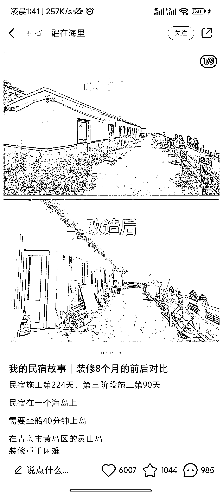
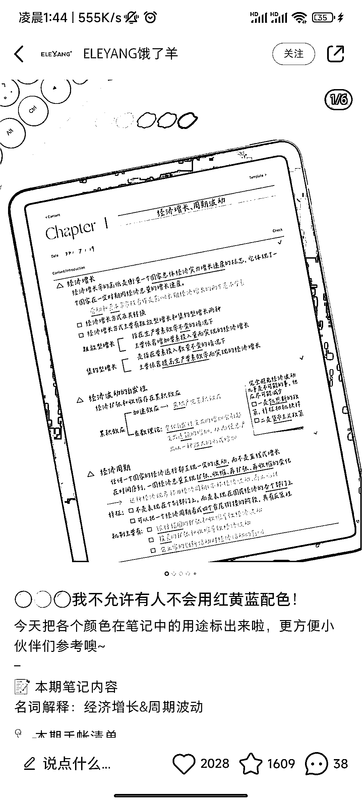

# 小红书爆款封面最新设计攻略！带你掌握流量密码

> 原文：[`www.yuque.com/for_lazy/thfiu8/smk34z8xrdxgs4tw`](https://www.yuque.com/for_lazy/thfiu8/smk34z8xrdxgs4tw)

## (53 赞)小红书爆款封面最新设计攻略！带你掌握流量密码 

作者： 书豪 

日期：2023-07-14 

各位朋友好，我是在杭州的圈友书豪，一个连续创业四年的 95 后，目前连续四年都年入百万。 

很多做小红书的朋友都会面临这个问题： 

为什么我辛辛苦苦码了这么多字，还全都是干货，笔记的浏览量点赞数寥寥无几；而隔壁博主相似的内容却能轻轻松松成为爆款，一骑绝尘？ 

在内容、标题差不多的情况下，很有可能是你的封面图不够吸引人。 

在同个环境下，图片永远比文字更加引人注目。 

 

今天就给大家总结了几类小红书爆款图文笔记封面设计技巧 

学会了，你也可以拥有属于自己的爆款笔记，牢牢把握住流量密码！ 

01 封面尺寸 

对于小红书图文笔记来说，官方的尺寸推荐有三种： 

竖屏 3:4，横屏 4:3，正方形 1:1。 

有一个点需要注意：横板封面对于屏幕空间的占比较小，给用户的视觉冲击不会太大，会出现被用户直接划走的风险。 

所以大家公认的小红书图文封面黄金比例分别是竖图 3：4，视频封面是横图 4：3，而且每一篇图文笔记的图片比例都要保持一致，确保用户点进你的主页时，看见的封面是一致的，更具美观性。 

 

02  五种爆款笔记封面参考 

1）前后对比型 

这类封面主要用在制造前后反差效果上，通过反差冲突来吸引用户点击，通常在健身、美妆、测评、考试等类型的博主中看到。 

 

设计技巧：前后对比的反差感越大、越明显越好。但为了体现内容的真实性可以统一前后对比图的拍摄场地和角度。 

适用类型：健身分享、考试提分、美妆教程、家居改造等。 

2）多图拼接型 

拼接型封面适合想要传递元素较多、干货合集类的笔记，可以选择把主题一致的图片拼接起来。拼接型封面的好处在于只要用户心水了多图中的一款图片，就会点开查看笔记，增加点击的概率，内容多样，同时精心设计的排版在视觉效果上也会更胜一筹。 

 

设计技巧： 

1、在多图的选择上，注重图片色调、风格的一致性，这样拼接出来的成片看起来会更加得和谐。 

2、图片适当，成片效果对称最佳，避免图片拼接的数量过多造成封面的重点不明和画面杂乱。封面标题可以放在画面正中或是其他醒目的位置，让封面的主题更加明确。 

适用类型：美食推荐、干货盘点、好物推荐等等。 

3）抠图展示型 

当我们想要在封面中突出主体时，抠图就十分关键，它可以让人物、物件直观呈现在用户面前。 

 

设计技巧：把想要展示的主体抠出来，搭配纯色、清新的背景，给人一种干净清爽的感觉，再配上标题，注意要主次分明、错落有致，保持整体色调和谐。 

适用类型：穿搭分享、好物推荐等 

4）纯文字型 

使用纯文字型封面时，一定要注意封面的关键词让读者能一眼 get 笔记的重点。 

 

设计技巧： 

1、这类封面文字信息较多，制作时注意文字排版的整洁性，可以使用线条、小贴纸等让文字更有主次。 

2、必要时封面标题可以用一些带有夸张的修饰词吸引用户，也可以加一些时间、数字等字眼，来证明自己的笔记的实用性、价值性。 

3、如果是手写字体，字一定要好看或者可爱！ 

适用类型：干货分享、教程推荐等等。 

5）清新实拍型 

小红书女性用户占绝大部分，一张高级、优雅的图片必定会受她们青睐。 

 

设计技巧：选取一些 ins 风或莫兰迪色系的实拍图片作为封面的主视觉，再搭配一些具有设计感的文字，不能太多，文字太多就不够文艺。 

适用类型：家居改造、好物种草、摄影教程等等。 

03 

四款制图软件 

有了封面类型，那么该如何制作图片呢？ 

这里我罗列了几个我们团队最常用的作图 APP，希望能够帮助大家提高作图效率。 

1、美图秀秀 

对于小红书博主而言，美图秀秀基本可以满足自己作图的所有需求，花体字、贴图、p 图、拼图等功能都可以免费使用，如果要拍摄视频，它还有提词器功能，对于新手来说十分。 

2、黄油相机 

黄油相机和美图秀秀相比，花体字、贴纸会更高级一些，模板也可以复用，很适合对图片要求较高的小伙伴。 

3、稿定设计 

这个软件专门为小红书用户开设了小红书专区，有很多热门的首图模板可以使用，只需要填充内容，0 基础的新手也可以很容易上手。 

4、醒图 

醒图的滤镜素材库、花字、拼图种类很多，不管是拍图、修图还是封面制作都很 ok，拿它做主要的作图软件也是没问题的。 

好啦，今天的小红书爆款图文封面制作指南就到这里，希望通过今天的分享，可以给大家带来一些帮助~ 

往期文章： 

## [人生的第一个 100 万，我是怎么赚到的？！](https://articles.zsxq.com/id_kek27cqo56wf.html) 

## [小红书单店铺单月 6000+利润选品保姆级教程](https://articles.zsxq.com/id_xwveu3e0usfv.html) 

## [小红书无货源电商，单品 4w+利润，我做了什么？](https://articles.zsxq.com/id_8o3ptacdp6mj.html) 

## [抖音直播间月消耗过百万的千川投流经验分享](https://articles.zsxq.com/id_d3zembkeh2cw.html) 

## [2023 小红书幼教考编保姆级教程](https://articles.zsxq.com/id_cpdec6j4xtho.html) 

[小红书低粉爆款案例拆解教程](https://articles.zsxq.com/id_0nmnwdg6mb0l.html) 

[小红书新人入局月入 100-1000 元保姆级教程](https://articles.zsxq.com/id_sbk8lqv5unca.html) 

[抖音单品短视频带货 1000 万 GMV，我是怎么做到的？！](https://articles.zsxq.com/id_qoak1w7ptnwf.html) 

[如何拆解一个小红书爆款视频](https://articles.zsxq.com/id_opo78sxacew9.html) 

[小红书无货源电商做女装如何选品？](https://articles.zsxq.com/id_1wxixz3rofb3.html) 

[小红书颜值测评变现保姆级教程](https://articles.zsxq.com/id_15njj2g5hxfr.html) 

评论区： 

陈海伦 : 好用 书豪 : 感谢认可[呲牙][呲牙][呲牙] 

 