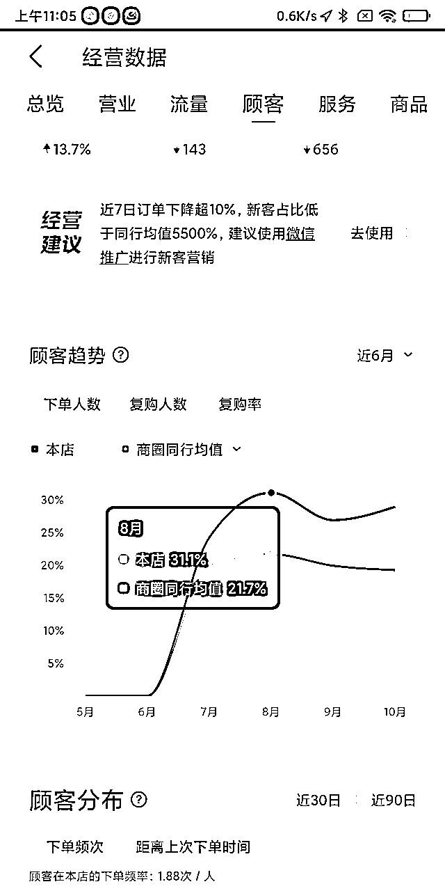
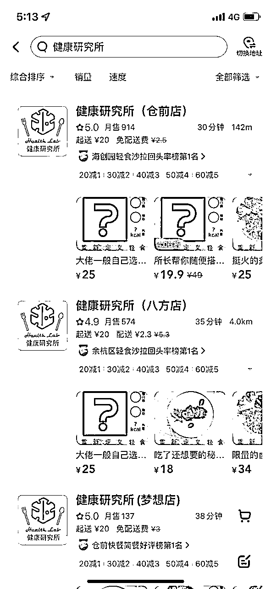
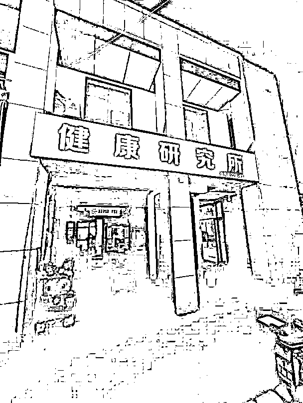
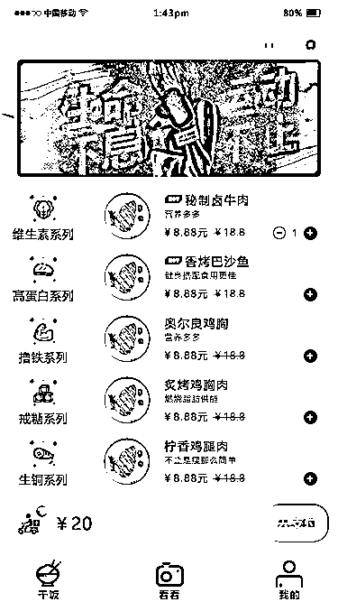
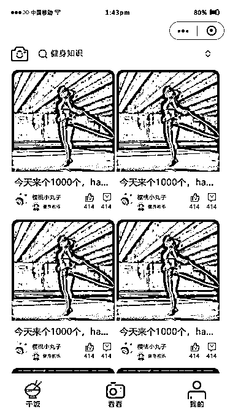
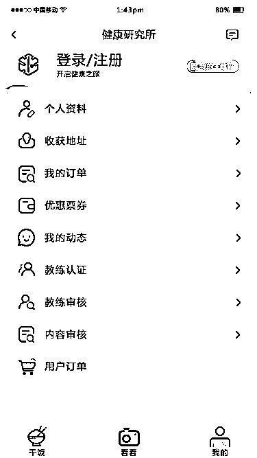

# 关于我开了3家轻食外卖店亏了40W+这回事

> 来源：[https://ixnoucqi80.feishu.cn/docx/AGOAdy5Y1ojz0dx8EP7cIn0tnFh](https://ixnoucqi80.feishu.cn/docx/AGOAdy5Y1ojz0dx8EP7cIn0tnFh)

# 前言

我是做互联网运营的，现在在杭州某大厂搬砖，合伙人当时是项目经理（低代码方向），现在仍然在创业（支付行业），我们当时讨论了大半年决定往大健康方向做，然后打算从门槛较低的餐饮入局健康行业，这个轻食外卖项目完全使用互联网思维来玩的，从前端流量获取到厨房菜品制作，我们都是从0-1自己摸索的，踩了很多坑，也输出了一些方法论，如果你也对轻食、减脂餐、外卖店感兴趣，看完这篇，或许能帮到你

写的很实在，不存在夸大、虚假，全部有真实数据截图，那阵子，钱是真亏了，人是真累了

这里主要讲一下干货，中间其实发生了很多有趣的故事，想了解更多的欢迎链接

# 一、几个有趣的内容

虽然干倒了，但也有一些可圈可点的成绩，先给大家分享一下

## 1、复购率31.1%长期杭州余杭区同行TOP1

## 2、平台（丑团、饱了么）综合抽成20.6%

我们取了一段时间内三店的收入/用户实际支付，计算出平台综合抽成

| 比例 | 仓前75% | 八方18% | 梦想7% |
| 美团顾客实付 | 79388 | 15924 | 5377（不精准） |
| 美团收入 | 63316 | 13424 | 4059（不精准） |
| 饿了么顾客实付 | 48788 | 19907 | 8393 |
| 饿了么收入 | 36057 | 14508 | 6420 |
| 单店收入合计 | 115445 | 27932 | 10479 |
| 各店平台抽成 | 28803 | 7899 | 3291 |
| 总收入合计 | 153856 | 总抽成合计 | 39993 |

## 3、4.9分好评，多次霸占丑团、饱了么榜单

## 4、在梦想小镇开了一家店，就叫梦想店，太有感觉了

——————————————数据这么好，为什么会倒闭，接着往下看，我们踩的坑——————————————

# 二、几个主要的坑，我都踩了

## 1、高品质外卖能做吗？

不能，亲自试错了，我做的就是高品质，券后客单一度干到30+，余杭区同行都是券后15就能拿下

我们所有的肉类（卤牛肉、炙烤鸡胸、奥尔良鸡胸、柠檬鸡腿等）、主食（烤土豆、贝贝南瓜、杂粮饭、紫薯球等）都是现场制作的，没有任何半成品，举个例子，卤牛肉需要解冻、切块、焯水、卤煮2h、冷藏、切片；紫薯球需要洗净、去皮、蒸熟、怼成泥、揉成丸、裹粉，想想就繁琐

同行咋样？半成品加热切片打包，顶多蒸下饭煎一下鸡胸肉

舒服了顾客，苦了自己，高品质外卖可以作为高品质线下实体门店的附带产品，纯外卖店就干高利润半成品好了，品类最好不多，最好是加热就可以食用的，看了那么多外卖店，就这种供应链特完善的加盟店才活得比较好，烤肉拌饭、螺蛳粉这些，需要做的基本上就是打包出餐，烫一烫粉

所以我的建议是，如果你要做高品质，那么你一定有实体线下门店，外卖只是提升你高品质餐饮的另一个方式而已

## 2、纯外卖能做吗？

不能，给平台打工了，而且相当于你付了两倍的流量费（这是我听一个餐饮大佬说的）

线下实体门店，你付了房租，就有客流量，每天路过的都是曝光，你相当于付了一份流量费

但是你纯外卖，你付了房租，一份流量费，但没有客流量，没人路过你店，也不能进来点餐用餐，你只能再付一份流量费给平台，也就是平台的20%以上的抽成，这样，你付了两份流量费

你赚不赚不知道，反正平台不亏

## 3、别想着app小程序了

当时小程序都开发80%了，现在想想真是扯淡，不仅耗精力，还耗钱

搞了三个角色，用户端、教练端、商家端

还做了社区功能，供教练、用户发表内容、交流

因为当时跟很多健身教练聊了合作，教练本身，包括其生产的内容可以为平台提供更多的专业背书，一个综合性的健康平台，不仅仅是吃饭，对教练来说，输出专业性内容也能提升自己的知名度，也是一个获客渠道，对用户来说，在这样一个综合性健康平台，不仅能吃到教练推荐的饮食，还能学习很多健康知识

但是后来你会发现很多问题，教练绝对不会让自己的学员来这里，因为有被其他教练抢走的风险，教练只会单方面引流走这里的用户，用户也只会把这个当作点餐平台，发训练照片随便一个平台都比这里的点赞评论多，压根走不通，想得太好了

能微信群聊解决的东西就别走开发！体量没上来之前都是扯淡，几千个用户群体就想搞小程序，吃屁吧你！

## 4、小餐饮就别搞中央厨房模式了

只是听起来逼格高大上，当时以为会节省设备、人员成本，我们想的1家主店2家分店的形式，分店无餐饮设备，只做打包出餐服务，由主店制作并配送到分店，这样，原来三家店每家店3个员工+设备的模式就缩减为，主店4个员工，分店各1个员工且无设备，瞬间少了很多成本（少了3个员工+1套设备）

但其实，压根行不通

三店你需要配送，需要配备一辆三轮车，三轮车成本需要加上，且三个店的园区三轮车可以进吗？搬运是否方便？充电是否方便？这些都需要考虑

餐损直接翻倍，你想要降低配送的时间成本，一次配送当天全部食材，那你就必须承担单量下滑导致的残损上升，做外卖的肯定知道，单量受到太多因素干扰，你出单慢、差评来一个、附近开了新店，都会影响你的单量

百万级以下流水根本不配做中央厨房

## 5、招年轻人便于未来发展？

也是屁话，还是招老餐饮人吧，稳定长久，可以结合单量做激励，给到实实在在的钱，搞分店可以让人去管理下当店长

不要招年轻人，你画的饼可能有用，但是基本的吃苦都做不到，还如何吃你的饼？

老餐饮人都懂，也不会要求你缴社保公积金啥的，他们只图稳定收益，年轻人还动不动说你不交社保起诉你威胁你，这谁顶得住，对于创业类型的新店，你去搞社保这些规范，不得直接把你干垮了

所以人员配置建议：1个阿姨+1-2个老餐饮人+1兼职，对于绝大部分外卖店完全够了

阿姨洗菜打杂收拾卫生，老餐饮人制作+机动，兼职打荷出餐

## 6、别做季节性的品类，要么就只做季节性品类

好家伙，轻食真就是典型的季节性品类，到了秋冬谁吃轻食啊，冷冰冰的菜叶子，我都吃不下！气温一降，你的单量也得跟着降，活不过冬天的不只是流浪猫，还有轻食外卖店...

或者你就极端一点，只做季节性品类，比如我见过几个老板，每年只做几个月的餐饮外卖，短租3个月，做什么？龙虾，就纯龙虾纯外卖，3个月赚10w净利润，每年如此

# 三、一些或许能帮到你的东西

## 1、冷启动如何做？

就是刚开店，你如何做第一波流量

现在有很多帮你做冷启动的，说的直白点，无非就是刷单，这群人让你出几十几百份霸王餐，还得额外给他们服务费，帮你送出霸王餐，这部扯淡吗

首先新店是有强制排名靠前的，是一周还是两周，忘了，在这段时间内你只要不太拉跨，都是排在前几个位置的，两个外卖平台都是如此，所以只要你门头包装的好看，开前几天天一定有单，承接的好的话还有爆单几率

这里插一段，很多外卖店就是利用了这个机制，每个月注销店铺成立新店，就是为了免费获取排名靠前的大流量，具体玩法，外卖平台的运营经理都懂的

回到主题，有了新店流量，你完全可以给每一位下单的用户亲自电话联系，诚恳的表面咱们这是新店，恭喜他可以吃霸王餐，就是麻烦带图好评以下，我会加你微信发你红包返现，同时拉近霸王餐群，这样，你获得了好评，加到了私域，也进了粉丝群，你接下来就可以号召他喊他的同事们来体验霸王餐，这样前几天的评价、复购都有了，叠加新店权重，你接下来肯定爆单，做好承接即可，完全没难度，我三家店都是这么玩起来的

后续群里搞一搞小活动，手机尾号x免单、随机免单等都可以玩起来

## 2、团餐真的棒

我接过阿里、字节还有多家公司的团餐，他们是周期性的订餐，比如每月x号，或者每周星期x

好处就是无平台抽成，单量大，只要你品质过关他就是一个稳到死的收益点

如何获得团餐流量，目前靠谱的都是公司主动联系，你能做的就是在外卖平台店铺简介上说明团餐联系方式即可，很多第三方团餐平台坑的要死，利润还不如做自然流量

## 3、菜品采购相关

你可以选择去菜市场找长期合作的，让他每天定时给你送货，但是能做全品类的菜场老板很少，而且很多不靠谱的

所以我推荐你直接用现成的采购平台，但是别只用一个，用多个平台

如：美菜、快驴等等，都是每天早上七点前能送达，相对靠谱，对于创业启动来说，再合适不过了

用多个的好处就是，他们为了争夺资源都会给你定期送券，降价等，对于你来说，利益最大化

## 4、如何选址

好些方法，主要以下几个

最蠢的方法，你的头部竞品在哪里开了，你在他边上找找便宜的位置

问外卖小哥饭点经常送哪里的外卖，调研十几个或者几十个，标记热门地点，取中间位置

百度、高德热力图，可以看各个时间段各商圈的人流情况，大致了解人口密度，在多个密集区的中间找租金少的位置

我认为的最佳位置是方圆4km包含学校、写字楼、小区

工作日，写字楼、学校的人消费，节假日小区的人消费

学校的学生能在非假期有稳定的单量，且他们更喜欢好评返现，拍的图还好看

## 5、一些好东西给到大家

最后给大家一些店铺的sop，可以直接用，帮你市场验证过了，更新了很多版本的，这些东西，一份卖几百随便卖吧，第一次整理发出来，自取，不客气

如果有些具体的细节我没提及但是你感兴趣的，欢迎链接！