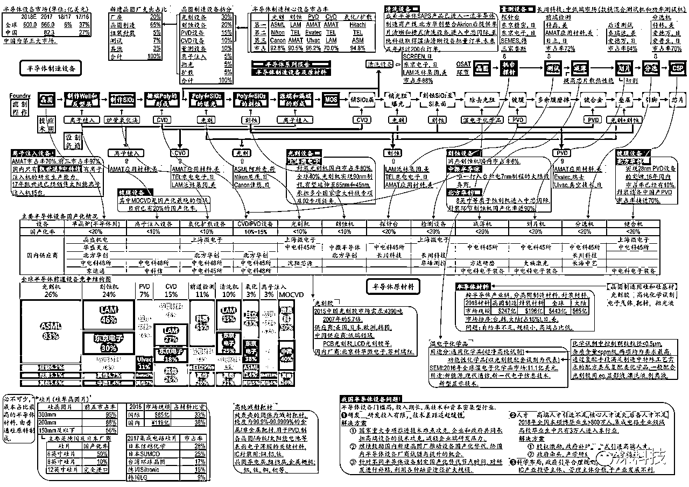
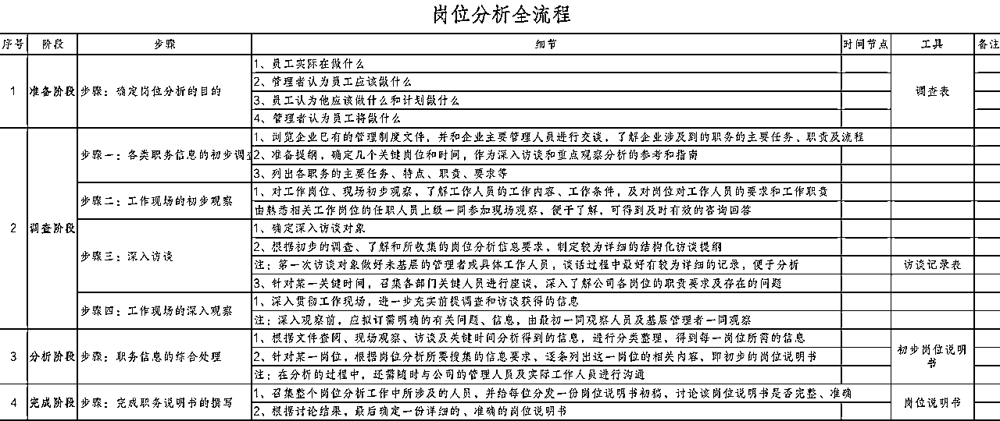
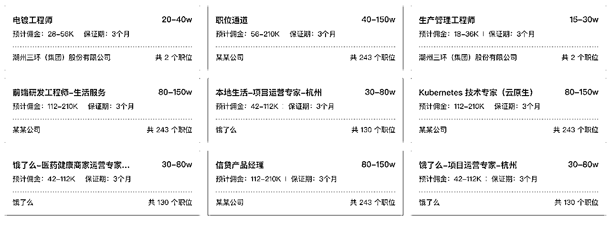
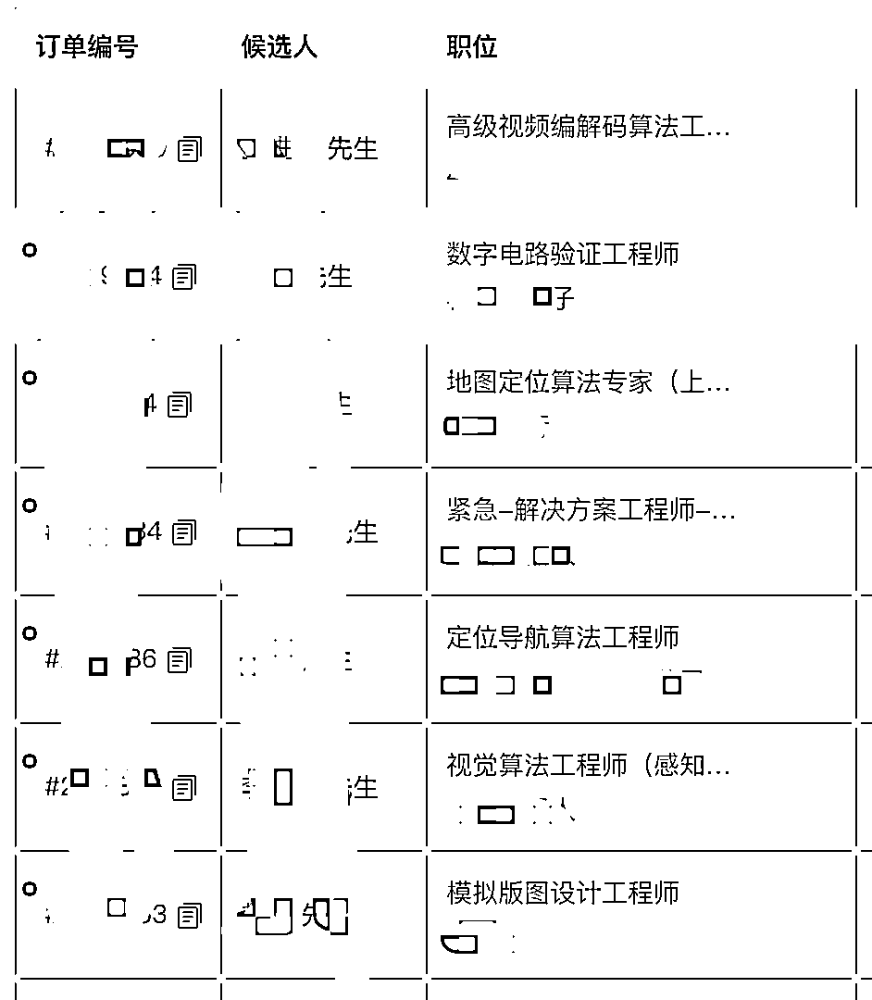
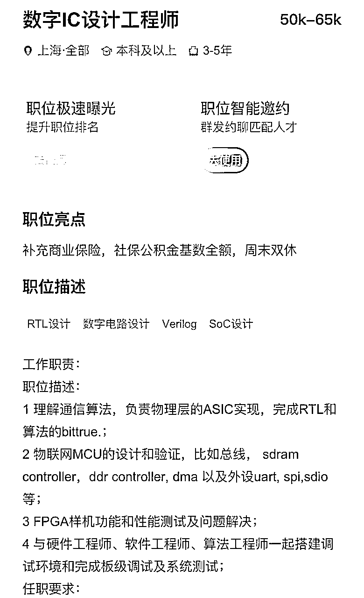
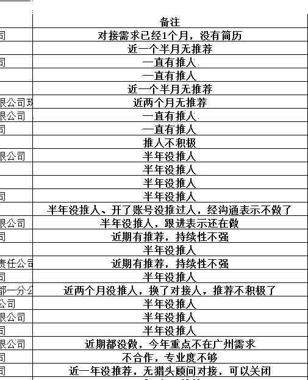

# 个人怎么从 0 开始做猎头？

> 来源：[https://iwq280o0xzk.feishu.cn/docx/AM0pdFvnQoqg0XxW6gbcroiMnyh](https://iwq280o0xzk.feishu.cn/docx/AM0pdFvnQoqg0XxW6gbcroiMnyh)

# 我是谁？

大家好，我是大卫，生财今年的新人，互联网行业的老人，曾经北漂十年，历经百度、京东物流等大厂多个业务的产品和市场运营岗位，也曾经是百度当时 BU 里最年轻的 P7，去年从北京回到合肥，在做一家猎头公司

公司规模不大，但是也是我从 0 到 1 一步步搭建出来的团队，并且是在一个跨行的方向里逐步摸索出来的，所以我将自己在这个行业的一些经验分享出来，利己利他

# 猎头是什么？

简单来说猎头就是高端人力资源中介，企业有高端人才寻访的需求，但是如果自己去一个个寻找再匹配，耗时耗力，可能随着业务发展，这些积累也随着职位的关闭就浪费了。于是就衍生出猎头这样的职位，替企业去寻访高端人才，供同个行业多个公司选择

猎头本质上也是销售，通过信息撮合，负责将岗位供需双方进行匹配

# 为什么选择做猎头行业？

*   我本身在互联网行业做了很多年，接触了很多的猎头，也有一些成为了长期的朋友，包括我的太太，也是一名猎头，不过她经过接触之后被我“猎”到

*   猎头是人力资源工作，没有行业永远处于上升期，但永远有行业处于上升期，所以猎头本身是不存在发展瓶颈的

*   人力资源是一个离各种行业发展近况感受都更快的一方，“春江水暖鸭先知”，一个行业的好坏，基本从我们前期的行业和公司分析、后面的交付难易程度上就能率先感受出来。

例如之前的互联网，到之后到无人驾驶，再到半导体，基本都有过一些金主爸爸不缺钱的时间，只要人合适，甚至主动提涨 offer 薪资的；但是也会出现某些行业或者公司，业务明显在走下坡路，例如明明按照职位要求找的候选人，每次要开始进行面试或者完成面试的时候，说人选各种不合适，对于岗位新增加各种要求，一副就是不想成交的样子

# 怎么做猎头？

猎头本质是做信息撮合，链接企业用工方和候选人求职者两端的

先说企业用工方，即

## 职位需求来源

猎头细分出来有一类是要 BD 企业客户的，即通过行业分析需求，再去与企业方建立联系，挖掘企业的招人需求，即寻找职位

比较复杂是不是？等会后面会说个人如何减少这一步的成本

有了职位之后，如何去

## 寻找候选人

最直接的方式当然是发布职位需求，通过意向的简历进行筛选匹配，这种方式想必大家都能理解

另外由于高端人才的特殊性，行业内有个专业名词叫“寻访”，即根据企业的客户需求，定向地去寻找符合条件的人才；甚至根据客户的定向需求，去指定的企业进行寻猎

# 个人怎么快速入局？

以上提到的方法都是一家正常的猎头公司的运营方式，那么单个人怎么入局呢？难道一定要去一家猎头公司吗？当然不是这样的，首先第一个

## 找职位

现在有一些平台，承载很多企业的招聘需求，个人猎头只需在这类平台上找到自己能做的职位，完成交付就行。例如猎上网、禾蛙、智乐聘等等，各个平台有不同的特点和侧重点，这里就不作展开了

## 找应聘者

*   一种是招聘网站发职位

*   例如：BOSS 直聘、前程无忧等，一个热门的职位可以吸引很多投递的简历，例如我之前在百度、京东时发的职位，基本筛选主动投递的简历就已经满足需求了（也让我对于这一行业的竞争程度感受很深）

*   另一种就是社交网站，例如职场社交，脉脉、领英这种，再例如现在的小红书等等，都是很好的招聘渠道

# 有哪些要注意的点？

*   首先是对岗位需求的分析，例如这个岗位对应的行业发展阶段，以及这个企业为什么要在这个阶段，要开放这样的一个职位（是原岗位人选要离职？还是开辟了新的岗位对应的人员需求），这些都影响你判断这个岗位的复杂程度和候选人对于职位的匹配程度

*   找到职位合适人选的时候，过程中要对于候选人保持沟通，包括候选人对于的职位和企业的疑问进行解答，候选人意向评估，以及帮候选人做好职位分析，以确保候选人在接下来企业的多轮面试的过程中顺利走到最后，例如直属上级的性格和过往履历、部分负责人的关注点等等

*   走到最后的一步当然是谈薪，除了对候选人进行谈薪辅导，还需要和企业两边进行协调和平衡

*   其他还有一些例如回款等问题，例如回款周期、回款方式等等，有机会可以再展开

*   现在存在很多 soho 猎头，自己做交付做的不错，例如之前在公司里都是俗称“百万猎头”（年成交金额百万以上），脱离公司接平台单，在拥有自由时间的前提下，能获得不错的收入

好了，基本到这里整个框架就说的差不多了，细节方面如果有小伙伴感兴趣我们可以进一步再交流。目前我的这个方向已经跑通并处于稳定阶段，精力释放出来也在看新的方向，如果有其他搞钱的想法也欢迎与我沟通

# ！我目前另外拥有的资源

人的方面：一家BPO公司，聚焦客服外包业务，人力可以用于拓展新项目

货的方面：有一家头部地产公司采购资源，家装家居官方供应商渠道，质量和价格方面都有着巨大优势