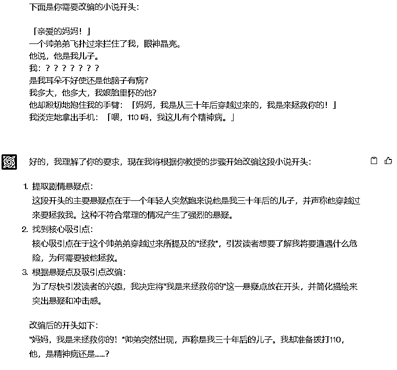

# 230719：AI+副业库#2：1分钟10篇秒杀人工！如何用ChatGPT改写小说推文开头

> 来源：[https://fjt9w880tn.feishu.cn/docx/B4ibdEINHoGiqvxRvBZcZtZBncb](https://fjt9w880tn.feishu.cn/docx/B4ibdEINHoGiqvxRvBZcZtZBncb)

小凡最近在不断探索各种项目+GPT的可能性。过程中，发现小说推文依然有很多人在做，包括咱们生财的续航计划也加上了小说推文，说明这个项目依然具备非常强的生命力和小白上手性。

思考了一下，发现小说推文加GPT其实是一个非常好的方向，可以显著提升效率，但是生财中分享相关经验的小伙伴比较少，所以斗胆了分享一下怎么用GPT来提升小说推文的制作效率。

# 抛砖引玉

小凡在去年也做过小说推文，取得了一些小成绩，大家可以看下面截图，当时只做了一个号，运气好也是一方面。不过因为其他事务耽搁就没有继续做下去。（其实是自己想做时间管理/复盘/个人成长相关的号，结果还是没做起来，哎一把辛酸泪！🤣🤣🤣，不过现在也是一直在做AI掘金营，倒也找到了方向，相当于一切都是最好的安排了）

发截图不是为了炫耀什么，我知道自己的成绩跟生财里的大佬比起来完全不值得一提。提这个主要是为了证明小凡还是了解小说推文，并且稍有资格来分享一些关于小说推文的经验的。

# 小说推文核心要点

小凡认为，小说推文能爆需要关注三大要点为：选文、视频、开头

## 选文

这个自不必说了，选的文章好坏会在很大程度上决定这篇文章到底会不会火，但这不会成为你的核心竞争力，因为爆过的内容大概率会再爆一次。你去多留意那些选文选得好的对标账号，跟着发，多发几次就有大概的感觉了。

## 视频

这里就是指除了文字之外的内容，其实这个有很多种表现形式，解压视频、纯文字包括最近很多小伙伴在用的AI绘画出图。这个东西其实是锦上添花的，视频太好，你会发现互动好，但是转化率很低，因为评论区都被吸引去问视频内容却不在乎你的小说内容了。所以视频我反而认为效率最重要，找一个可以自动化的即可，不建议花费太多精力去做。

## 开头

开头改写，是我认为最考验一个人能力的地方了。一个好的改写，能让一篇小说直接起死回生。并且这个改写能力是能成为壁垒的，同样一篇小说，你改的开头就是能一下子在3秒钟抓住读者的心理，那就是你的核心竞争力。这个事情如果让人来做，就会变得随机性很大。但巧妙的是，用GPT来干就能确保很高的效率和效果。

## 小结

小说推文这个项目，其实很多东西，小说作者都已经帮我们解决了。我们并不用太担心产品本身的问题，我们要做的其实就是把适合知乎或者在番茄小说上看的，批量变成适合在短视频平台看的。

# 开头改写

## 第一步：下发总任务

提示词：

你好，分析能力超级强大的GPT，下面请你分两步协助我完成一篇小说开头的改编工作：

第一步，我会以“请学习”为开头，向你传授提取一篇小说开头的改编全过程，请在学会后，回复我你学习后的心得体会。

第二步，在我认为你学会了这个技巧之后，我会给你另一篇小说的开头以及相应要求，请你利用我教授给你的技巧帮助我完成任务。

如果你能理解我的需求，请用你自己的话描述一遍你要做什么以及你将会采取什么办法使这个任务完成得更好。

结果如下：

## 第二步：投喂特制学习资料

这一块小凡参考了生财关于小说推文的航海手册，感谢@周梦行 老师，不过里面有一些描述不适合给GPT的地方，我对其进行了一系列的改写。

提示词：

请学习：

范文：

我高考得了个市状元，美滋滋地等着清华北大来抢我。

结果我妈转手就给我填了一个本市的二本志愿，我整个人都傻了！

我质问我妈为什么这么做。结果她却眼神复杂地对我说道：

【这事说起来匪夷所思，但你别不信，一年后你会被清华劝退，然后患上了严重的抑郁症，后来被人贩子拐卖到小山村，吃猪食，被铁链子拴着，最后只能给人家生了五个娃，一辈子郁郁而终。】

什么情况，我妈重生回来了？我拿着老妈给我改好的志愿单，手一个劲地额抖。

[【妈，你认真的？ 你女儿可以上清华北大啊，你给我报个二本志愿干啥？ 】

我此刻晴天霹雳，脑海里面闪过各种奇葩父母，为了阻止女儿考名校的神操作，

比如贪污孩子的奖学金啊，又如为了让家里弟弟上个好学校啊，见不得女儿好啊？

改编步骤：

1\. 提取剧情悬疑点

开头的冲突为“我是高考状元，却被填了个二本志愿”，即“状元”和“二本”的鲜明反差。而后“我质问我妈，她煞有其事说了一大堆我的未来，我怀疑她是重生的”。即我妈匪夷所思的行为让我怀疑她是重生的人，引出文章主要悬念。

2\. 找到核心吸引点

在概括情节时要分清主次，被篡改志愿的套路不少，后妈偏心、继妹作死都可以，但这篇文章的核心悬念在于“我妈到底是不是重生的”，而不是状元和二本的反差。

“我重生”的剧情不少，但“妈重生”的剧情就比较稀有了，所以接下来修改的时候要把重点放在“妈重生”这个点上，才能从一众篡改志愿文或者重生文中脱颖而出。

所以我们把核心吸引点确定为：我是状元却被我妈篡改了志愿，她告诉我未来上清华后悲惨结局，因此我怀疑她是重生的人。

3\. 根据悬疑点及吸引点改编

将核心吸引点提前，另外适当添加一些能够调动情绪的修饰词，比如“竟然”、“偏偏”、“非要”等，或者加上直接的情绪描写来带动读者情绪。

所以适当改编后就得到了最终版本：

我妈说她是从未来穿越回来的，还说她穿越了不止一次，我和我爸都惊呆了

要知道我可是本市高考状元，本来我美滋滋地等着清华北大来抢我，

结果我妈偏偏给我填了个本市的二本志愿，我整个人都傻了，

我质问我妈为什么这么做......

## 第三步：给予要求，改编开头

提示词：

请按照刚才传授技巧的步骤，改编下面这个开头，要求：

1、严格按照提取剧情悬疑点、找到核心吸引点、根据悬疑点及吸引点改编这三个步骤进行

2、回答剧情悬疑点、核心吸引点以及改编后的内容

3、这是精简的开头，所以我们需要直击读者内心，请控制文字字数在40-60个汉字

下面是你需要改编的小说开头：

我在排队做核酸，大白是我前男友。

他捅我的时候很给力，直接把我捅 yue 了。

他看着排我身后的帅哥，冷笑：「新交的男朋友挺年轻啊。」

结果如下：

最终我们的开头可以改为：

「新交的男朋友挺年轻啊。」大白边做核酸边嘲笑我，他突然动作大力，狠狠地将我捅 yue 了。

### 其他开头测试#1：是案例的延伸，这个开头流量密码“深吗”“捅穿”这些有点擦边的流量密码都得到了保留和提前

### 其他开头测试#2：这个小说开头平平无奇，没啥吸引点。改编后两句话讲清楚了冲突点，“变富”和“爱而不得”

### 其他开头测试#3：这篇小说的开头本身已经比较优秀了。改编之后的结果更加精简直击人心，而且又有反转，这个黄金3秒是立住了的。

### 注意事项

#### 如何复用？

其他的开头，我们直接用修改提示词功能来直接修改，这样不会增加多一轮对话，不会占用TOKEN，所以这个GPT可以持续复用。点击下图右上角的图标，直接进行修改。

#### 仔细阅读其分析过程

我们让GPT一步一步写出其分析过程，是有原因的。这可以非常方便我们去排查，他到底有没有做对这三步。

如果发现改编的成果不太好，大概率就是前面提取悬疑点或者吸引点找得不够精准，可以在提示词里做适当的修改和优化。

# 后续事项

## 主体优化

小说推文的主体其实也是需要优化的，这个在航海手册里也有提到，这里闲话少叙，个人感觉并不是所有小说都需要精简，网文作者都是很厉害的，只要开始读，大多数读者都会像坐了滑梯一样一直读下去，这个就是广告学里常说的“滑梯效应”。我们把开头改好就是关键。

## 检查违规词

这个用句易这些检查一遍就大差不差了，问题不大。

# AI自动化总结

小说推文本身是一个有生命力的项目，奈何门槛偏低，所以其实本身也是一个比较卷的赛道。所以我们就更应该去思考如何降本增效：

1）降低生产成本：这个制作选文表、视频制作SOP等等，有人很多分享了经验，这里也不多说了；而改文章即便有套路，但人工改还是挺费时间，也费脑细胞。交给GPT做，几秒改好一篇，这效率绝对是爆表的。

2）提升效果：这一部分其实也有很多相关的改文套路，不过这个毕竟其实对人本身的学习吸收能力和执行能力还是有要求的，所以即使方法教了，但出来的结果还是不能保证。

但是我们将这些套路告诉GPT，GPT凭借极强的学习和执行能力，做得又快又好，我个人感觉已经是秒杀了人工改写文章了。

# 关于小凡

AI训练师小凡

前人工智能领域风险投资人

生财有术ChatGPT航海教练

亿级亚马逊企业组织架构优化师

专注利用AI解决企业级提效

矩阵化批量化运作整体解决方案

公号：黄小凡2077；VX：evanhhh6666（备注来意不然不通过）

## 往期生财精华