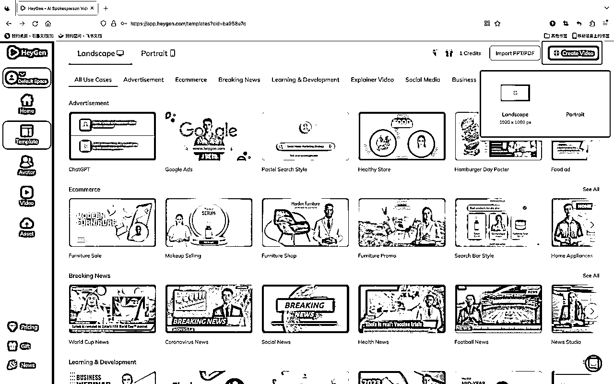
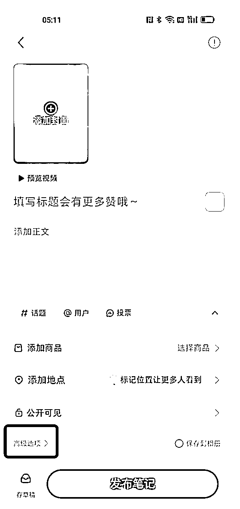

# AI图片说话项目保姆级教程-个人实操分享

> 来源：[https://c33xg0q9fd.feishu.cn/docx/BSW7db9F8oZoWZxTTmwcwKx9nHd](https://c33xg0q9fd.feishu.cn/docx/BSW7db9F8oZoWZxTTmwcwKx9nHd)

大家好，我是百钞。专注于研究 视频号、AI相关的副业小项目。

本着利他的原则，今天来分享1个超级适合小白的 AI项目，目前自己也在跑，跑出来数据还不错，第3天就变现了299。这个项目市面上有很多种叫法，AI数字人，图片说话，图片数字人等等。名字不重要。

今天这篇内容不仅有教程，也有我自己的一些思考，欢迎大家一起探讨交流呀。希望这个分享的不仅仅是项目，也可以触发你的一些思考。毕竟躬身入局比什么都重要。

接下来，enjoy~

我是6月21号开始实操的，先上结果图，截止6月27日，小红书涨粉500，B站涨粉1000，抖音涨粉348（视频号被封两个账号）。目前除视频号外，其他平台的数据每天都是蹭蹭涨。说几个感受：

*   B站能涨1000粉丝，我是大为震惊的。

*   这是我其中1个账号，其他账号晚了2-3天做，目前数据也很不错，所以我认为现在这个项目还是能入手。

*   截止6月27日，收徒变现299（有两单我没变现，判断对方不太适合，就没收，拍大腿！！！）

数据还是很亮眼的。基本3~4天就能起来1个新号。整个项目我自己实操下来的感受：对小白、新手非常友好。

我现在每天空闲就会收集素材，然后整理到飞书，早上到公司就开始制作视频，一天制作4个视频，加上发到各个平台，大概花费时间1个小时左右。平均一条视频花15分钟搞定！！！

那么接下来咱们来说说具体要怎么实操这个项目。

# 怎么做？

整个视频的制作过程都不需要我们真人出镜，只需要我们提前准备：文本内容、人物形象以及把人物形象、文本内容变成视频的工具。

接下来我会以我自己在实操的方向跟大家介绍这个项目，真的是家底都翻出来啦。

## 文案内容

为什么先说文案内容，因为我觉得这个项目文案内容的重要性占比至少达到50%，我始终相信：好的文案不管用什么形式呈现，他都会火。就算没有 AI数字人念出来，只是简单的把文案放上去，配上合适的音乐和画面，他也能火。只是这样的账号对于用户来说，记忆点变少了。

我目前做的账号是禅语类的。类似这种：

那么各大短视频平台都是我们找素材的地方，到抖音、小红书，视频号搜索【禅学】相关的关键词，就能找到很多文案，把他们都整理出来，这个就是后续咱们做视频的文案素材。

甚至偷懒些，你都可以直接抄同行的，因为同行的文案也是从各大平台找的，不过要做好规避视频查重！

牢记1个原则：优先选择爆火过的内容，因为火过的内容换一种形式再发，大概率也会再次爆火。

但是这里又会有个问题，就是现在做佛学禅语的账号太多了，很容易导致文案同质化，如果别人比你先发且对方爆火，很容易被判定你的是非原创，那怎么办呢？

用 ChatGPT 啊！！！用 ChatGPT 做二次文案微原创。举个例子：

师傅说，其实幸福很简单，只有九个字，有家回，有人等，有饭吃。

我看到一条文案别人发都很火，我也想发这条文案，但是好几个人都发了。那你完全可以让 ChatGPT 在这个基础上帮你扩写个30-50字左右。

师傅说，其实幸福很简单，只有九个字，有家回，有人等，有饭吃。在繁忙的都市中，我们常常被琐碎的事物所迷失，却忽略了最珍贵的东西。所以，珍惜家人的等待，回家的温暖，和一顿可口的饭菜，就能感受到生活中最真挚的幸福。

这不就成了！！！极大的保证了内容原有的样式（爆火的因素），又能够跟别人区分开。

以上是短文案的方法，那如果是长文案呢？下面【视频制作】会讲到。

当然了，除了佛学禅语的，还有很多方向的内容可以做，包括但不限于：国学易经、情感语录、创业思维、为人处事等等。所有以前爆火过的、简短的内容都可以用这个形式再做一遍。

大家也可以根据自身的情况去挖掘适合的方向。

## 人物形象

人物形象可以用 MJ 、SD 制作，这个对于咱们星球的小伙伴们来说，应该不是难题。所以这里我就不再讲具体的教程，这里主要聊两件事。

*   第一，你的人物形象要长什么样？

还是拿我自己举例，我是做佛学禅语的，那小和尚是比较适合的。因为我的受众人群主要是中老年人，受众对于可爱的小孩天然的接受度高。

同理，如果你做的是国学易经的，可以弄个老爷爷，老神仙的形象，就是那种仙风道骨的味道；如果你做的是道学的，也可以做个小道士的；情感语录的来个温柔大方的尼姑？也不是不行。只要能够让你的大部分受众接受、喜欢就可以。

尽量不要自己意淫，做之前可以先去各大短视频平台看看，有没有人在做？别人是怎么做的？对标下！！！

*   第二，人物形象需要很精致嘛？

这个我没办法给到很确切的回答，但是我可以给你看几条视频：

怎么样？是不是很震撼，这么假都有人看？还这么多人？没天理了。

我刚开始做的时候也卡在了这一步，反复修改人物形象。当时用 MJ 大概制作了30几个人物都不是很满意。直到我看到上面的视频后，我悟了。

完美主义可以要！但是很多时候我们可以先入场，跑出第一个正反馈后，后面再慢慢迭代。

而且我相信星球的小伙伴做出来的人物肯定能吊打他们，我指的是视频质量。

我们每天接触那么多工具，不就是为了这一刻嘛？

## 视频制作

文案内容、人物形象准备好之后，就可以开始制作视频了。就是让你的人物动起来。

目前市场上很多工具的，包括但不限于DID、CT8-CrazyTalk、HeyGen等。我个人用的是HeyGen，软件使用起来非常方便，甚至可以说无脑，而且制作出来的视频效果也可以说是最好的。但是有个缺点就是免费体验完后要付费。

⚠️HeyGen 只要邮箱就可以注册，他现在又有分享送积分，那完全可以通过自己邀请自己，然后邮箱无限注册。

如果你介意付费，可以选择 CT8-CrazyTalk ， CT8-CrazyTalk 是免费的。大家有需要可以 Google 找下这个软件的教程。或者 👉 ，这个是云天分享的关于这个项目的拆解，里面有讲到 CT8-CrazyTalk 的使用方法。

以下我主要以 HeyGen 讲解。enjoy～

① 点击链接https://app.heygen.com/guest/templates?cid=ba958e7c，出现图1界面

②点击左上角的【sign in】，进入到注册界面（图2）

③输入自己的邮箱后，点击【send code】，接收验证码，并填入（图3）

④点击【next step】，进入到设置密码界面（图4），设置密码，点击【done】完成注册

账号注册完成后，即可开始制作视频，具体教程如下：

①点击右上角【create video】，会出来两个选项，电脑和手机；如果你是在手机上发布视频，直接选择手机即可；选择完成后页面跳转到图2；

这里面有很多其他模型，有兴趣你可以自己尝试体验下；

②制作自己的人物形象

*   点击【my avotor】，点击【uplood or generate】，选择【upload】上传自己的人物形象（图1）

*   点击人物形象，人物的图片会自动出现在右侧（图2）

⚠️：人物形象图片最好是2:3的比例

③文案、图片 ➡️ 视频

这个软件有一个点很好，就是直接帮你把文案和图片统一转换成视频了，而且制作出来的视频个人觉得效果是市面上所有工具最好的。

*   上传脚本，就是你希望这个人物说出来的内容（图1）

*   选择声音：👉 图2、图3，点击图2的红框页面跳转到图3，选择你想要的声音：

*   第一个下拉框选择的是国家

*   第二个下拉框选择的是性别

*   第三个下拉框选择的是年龄、风格等

*   选择后，点击 【播放】按钮，可以试听声音（图4）

*   确定声音后，选择【select】，完成设置（图5）

*   点击【submit】按钮，开始制作视频（图6），过程大概需要1分钟左右；

④下载视频到本地，点击下载按钮，即可将视频下载到本地；

一条视频就制作完成了，下一步就是用剪映做一下简单的剪辑。

填坑时刻：如果是长文案怎么办？让 ChatGPT 修改又怕破坏原结构，导致视频无法爆火。这里可以使用一些方法去规避掉视频同质化的情况。

详细可见这篇文案，写的很详细：https://zhuanlan.zhihu.com/p/353343261。我自己的处理方法就是加一层风景（画布），然后让人物做淡入淡出的效果，这样机审基本能过。

整个项目实操起来真的不难，很适合小白玩家，当然如果有些大佬想做，也可以矩阵号批量搞。

# 变现方式

几个平台实操下来，小红书比较适合收徒变现，抖音和视频号比较适合带货，B站我暂时没想到。但是B站其实是涨粉最快的（我怀疑我几年的浪都白冲了）

## 收徒变现

4个平台跑下来，收徒变现比较适合小红书，我几个意向用户都是小红书来的。具体的操作方法：

*   创建小红书群聊，群聊名称最好取名：视频制作学习群。方便有意向的用户添加

*   发布视频挂上群聊，每次发布视频的时候关联下群聊

*   小号引流：把小号拉到群聊，让小号做引流动作，防止大号被封

以下是具体的实操截图：

## 电商带货

可以根据你的用户去卖相对应的产品，比如佛学的卖卖佛珠、佛串、吊坠等等，创业思维、情感类的可以卖卖对应的书，诸如此类。

当然了，这块目前个人还没成功变现，应该下周会开始尝试。但是我有个大胆的想法。很多用户都把我的人物形象当成了真人，天天夸我小可爱。那么其实就可以充分的利用好这个人物形象，直接做短视频带货。这样比你简单的把商品挂在橱窗的方式会好很多，有足够的引导。

什么？竟然有人会看不出这是个 AI ？还真是有的，我给大家看看我的评论区。

请牢牢记住，并不是所有人都跟我们一样天天接触 AI。所以不要用自己得眼睛看世界。

## 小程序变现

这个变现是从云天那边分享看到了，但是我暂时没有太明白是什么意思。咱们星球技术人多，如果有对这个项目感兴趣的，且有开发能力的，可以一起搞事情。

# 碎碎念

## 早就是优势

我在做这个项目的时候，其实是先确定了受众，我就是想做中老年人的生意，所以我当时就一直想，我要用什么内容去吸引这些人呢？然后我就天天刷，易经、国学、佛学、道教等等相关的内容。

直到有一天我在视频号刷到了以下内容，发现新大陆了。然后我就到各个平台绕了一圈，发现小红书有人做了矩阵佛学号，而且做的时间不长，大概30天前开始做的。

据了解，30天有些人做矩阵涨粉了十几万，妈的！！！

这个技术我记得5月份就有人在星球发的，嗨~

好了，今天的分享到此为止啦，我是百钞，专注于研究 视频号、AI相关的副业小项目。